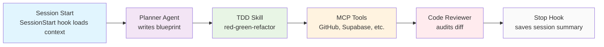
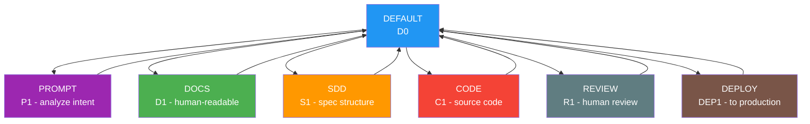
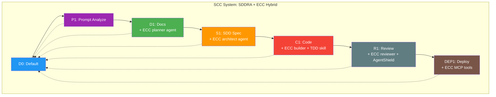

<!-- [APPEND:chain-graph-comparison] -->
<!-- Section: ECC Workflow vs SDD Chain Graph Comparison -->
<!-- Last updated: 2026-09-02 -->
<!-- Append new content below this line -->

# ECC Workflow vs SDD Chain Graph Comparison

## ECC Implicit Workflow

<!-- [END:APPEND:chain-graph-comparison] -->

<!-- [APPEND:ecc-implicit-workflow] -->
<!-- Section: ECC Implicit Workflow -->
<!-- Last updated: 2026-09-02 -->
<!-- Append new content below this line -->

**Characteristics:**
- Implicit skill activation (no explicit gates)
- 281 ready-made skills available
- Memory persistence between sessions
- MCP tools called on-demand

## SDD Explicit Chain Graph

<!-- [END:APPEND:ecc-implicit-workflow] -->

<!-- [APPEND:sdd-explicit-chain-graph] -->
<!-- Section: SDD Explicit Chain Graph -->
<!-- Last updated: 2026-09-02 -->
<!-- Append new content below this line -->

**Characteristics:**
- Explicit human gates at each stage
- Deterministic chain arm selection
- Token tracking per stage
- AutoCompact at end of task

## Comparison Matrix

<!-- [END:APPEND:sdd-explicit-chain-graph] -->

<!-- [APPEND:comparison-matrix] -->
<!-- Section: Comparison Matrix -->
<!-- Last updated: 2026-09-02 -->
<!-- Append new content below this line -->

| Aspect | ECC | SDD | Integration Strategy |
|--------|-----|-----|---------------------|
| **Gates** | Implicit (Stop hook only) | Explicit (6 gates: P1→D1→S1→C1→R1→DEP1) | Add explicit gates to ECC workflow |
| **Approval** | Implicit in Stop hook | Required at each gate | Adopt SDD-style human gates |
| **Skill Activation** | Implicit (prompt-based) | Explicit (INDEX.sdd routing) | Use INDEX.sdd for skill discovery |
| **Agent Isolation** | Each agent gets fresh context | Not applicable (single agent) | Merge: SDD agents + ECC context isolation |
| **Memory Persistence** | SessionStart/Stop hooks | `.sdd/runtime/` DB state | Use SDD runtime state for persistence |
| **Token Tracking** | Manual | Automated (per stage) | Adopt SDD token tracking |
| **Auto-Compaction** | None | End-of-task compaction | Add compaction to ECC Stop hook |
| **Security Scanning** | AgentShield (OWASP checks) | Security levels (L0-L5) | Map AgentShield findings to SDD levels |
| **MCP Integration** | 35 servers, opt-in | Not in SDD | Add MCP integration layer to SDD |

## Hybrid Workflow Proposal

<!-- [END:APPEND:comparison-matrix] -->

<!-- [APPEND:hybrid-workflow] -->
<!-- Section: Hybrid Workflow Proposal -->
<!-- Last updated: 2026-09-02 -->
<!-- Append new content below this line -->

**Hybrid Advantages:**
- SDD's explicit gates + ECC's ready-made skills
- SDD's token tracking + ECC's memory persistence
- SDD's risk classification + ECC's security tools
- ECC's MCP integrations + SDD's gate enforcement

## Recommendations

<!-- [END:APPEND:hybrid-workflow] -->

<!-- [APPEND:chain-graph-recommendations] -->
<!-- Section: Recommendations -->
<!-- Last updated: 2026-09-02 -->
<!-- Append new content below this line -->

1. **Adopt ECC planners** for SDD's D1 (Docs) stage
2. **Use ECC code-reviewer** as SDD's R1 (Review) agent
3. **Import ECC's MCP configs** into SDD's adapter-runtime
4. **Map ECC's AgentShield** to SDD's security levels (L1-L5)
5. **Merge ECC's session memory** into SDD's runtime state persistence
6. **Adopt ECC's diff-aware scanning** for SDD's security controls
7. **Use ECC's confidence-threshold review** in SDD's `@agent.reviewer`

## Next Steps

<!-- [END:APPEND:chain-graph-recommendations] -->

<!-- [APPEND:chain-graph-next-steps] -->
<!-- Section: Next Steps -->
<!-- Last updated: 2026-09-02 -->
<!-- Append new content below this line -->

1. Create `.sdd/chains/hybrid-graph.sdd` with merged chain
2. Add ECC agent references to `.sdd/agent/ecc-bridge.sdd`
3. Import top 15 ECC skills into `.sdd/skills/`
4. Create `.sdd/runtime/mcp-integration.sdd` for MCP server configs
5. Map AgentShield patterns to `.sdd/security/controls.sdd`

<!-- [END:APPEND:chain-graph-next-steps] -->
