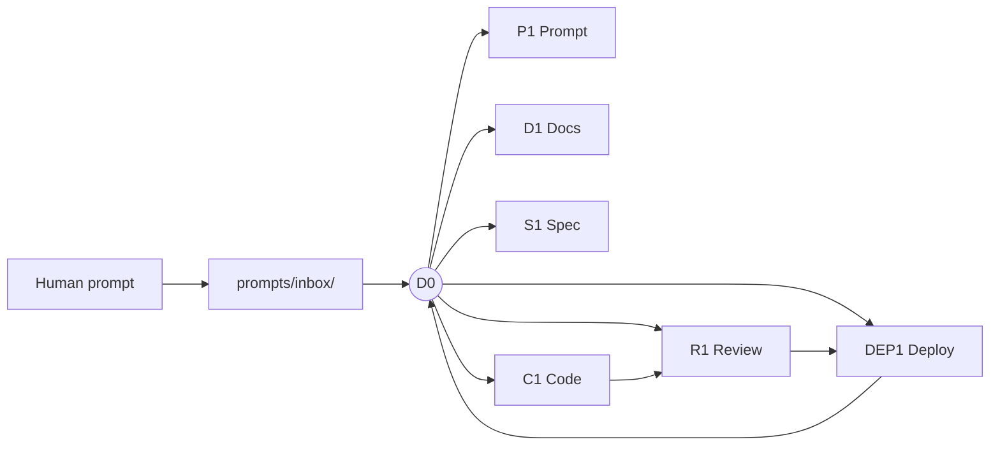
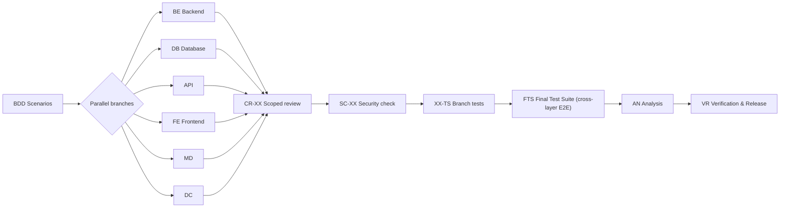

# SDDRA — SDD & Reasoning Architecture

**A specification-first operating system for AI-assisted software
engineering.** The `.sdd/` directory is the single source of truth:
rules, chains, gates, and registries that an AI agent operates
inside — with human approval reserved for irreversible decisions.

[](LICENSE)
[](docker-compose.yml)
[](.sdd/PROJECT.sdd)

## Why

AI agents ship plausible code for goals nobody wrote down. Review
treadmills turn humans into QA for the robot. SDDRA is a **Layer-3
system**: intent is captured as machine-checkable contracts (`.sdd/`)
before code exists, so whole defect classes never happen.

- **Spec → Docs → Code** — the only legal change order
- **Human gates, minimal** — approve the irreversible, automate the rest
- **State over memory** — registries, not chat threads; resume is reading
- **Sandboxed by default** — every build/test runs in a locked container
- **Security-first ordering** — the security pass precedes branch tests ([R101])

### The problem, and what you get instead

| Without SDDRA | With SDDRA |
|---------------|------------|
| Intent lives in chat threads and dies with the session | Intent is captured as machine-checkable `.sdd/` contracts |
| Agents write code before requirements exist | Spec → Docs → Code is the only legal change order |
| Humans review endless diffs as robot QA | Human gates fire only on irreversible decisions |
| Context resets every session | Saved state + registries; resume is a file read |
| Unverified AI claims accumulate silently | Decision ledger, DONE-PROOF, and traceability queries |

## Quick start

```bash
git clone https://github.com/sdd-ra/sddra.git && cd sddra
docker compose build sdd-sandbox
# then pick an install path — see docs/getting-started/install.md
```

Three install paths (auto local / manual global / vendored) with
pros and cons: **[docs/getting-started/install.md](docs/getting-started/install.md)**

## Documentation

| | |
|---|---|
| Architecture + diagrams | [docs/architecture/overview.md](docs/architecture/overview.md) |
| How it works (deep dive) | [docs/concepts/how-it-works.md](docs/concepts/how-it-works.md) |
| Contributing (worked examples) | [docs/contributing/contributing.md](docs/contributing/contributing.md) |
| Philosophy | [docs/contributing/philosophy.md](docs/contributing/philosophy.md) |
| Install paths | [docs/getting-started/install.md](docs/getting-started/install.md) |

Legacy deep docs (analysis, overviews, appendices) live in
`.sdd/docs/` — routed by `.sdd/INDEX.sdd`.

## The 31 commands

| Command | What it does |
|---------|--------------|
| `/sdd` | Execute the chain graph from a prompt |
| `/sdd-plan` | Cache-first execution plan (BIG/SMALL change mode) |
| `/sdd-status` | Execution status: tokens, decisions, tasks, approvals |
| `/sdd-next` | Advance to the next step from saved state |
| `/sdd-resume` | Resume interrupted chain from checkpoint |
| `/sdd-health` | Integrity: critical files, 3-way sync, mojibake, purity |
| `/sdd-analyze` | Deep analysis of the .sdd/ structure |
| `/sdd-explain` | Explain a completed task on demand |
| `/sdd-decisions` | List and explain decision-ledger entries |
| `/sdd-assumptions` | Track and validate project assumptions |
| `/sdd-intents` | Classify and route user intents |
| `/sdd-prompts` | Automate prompt lifecycle (inbox → active → archive) |
| `/sdd-update` | Sync .sdd/ state from the git repository |
| `/sdd-knowledge` | Knowledge-graph health and trust report |
| `/sdd-backup` | Timestamped backups of critical .sdd/ files |
| `/sdd-restore` | Restore .sdd/ from backup (approval required) |
| `/sdd-migrate` | Run pending migrations after schema updates |
| `/sdd-compact` | Compress context after a task |
| `/sdd-clean` | Clear context for the next task |
| `/sdd-skills` | Discover and map the skill ecosystem |
| `/sdd-evolve` | Skill Evolution Engine: propose and validate skill changes |
| `/sdd-design` | Design analysis, evaluation, discovery |
| `/sdd-scan` | Security pattern scans against code files |
| `/sdd-dependencies` | Analyze and visualize the dependency graph |
| `/sdd-purge` | Audit and clean AI provenance marks |
| `/sdd-drift` | Detect drift: .sdd declarations vs reality |
| `/sdd-sync` | Propose and execute sync for detected drift |
| `/sdd-trace` | Bidirectional requirement↔proof traceability |
| `/sdd-context` | Compile a minimal context pack for a task |
| `/sdd-marketplace` | External skill marketplace (list/sync/import/audit) |
| `/sdd-research` | Deep research round (RS1 arm) |

Every command is registered 3-way: `.sdd/commands/` (spec),
`.claude/commands/`, `.kilo/command/` ([R98]); `/sdd-health`
verifies zero drift.

## Architecture at a glance



Full delivery chain (BC→…→VR), decision lifecycle, and enforcement
layers: [docs/architecture/overview.md](docs/architecture/overview.md)

## How work flows — the delivery chain (DL1)

Every delivery request follows one immutable, stateful pipeline.
Once the business case is understood, requirements defined, design
shaped, and behavior specified (BC → BR → BD → DS → TK → BDD), six
engineering branches execute in parallel — each through the same
scoped pipeline — and converge on verification:



Per-branch pipeline (v2 ordering, Phase 155): **implement → scoped
review → conditional refactor (RF-XX, only on findings) → security
check → branch tests**. Security precedes tests — fail fast, fix
cheap ([R101]).

## Repository map

```
.sdd/            specs — rules R1-R111, chains, gates, registries (source of truth)
sdd-adapter/     TypeScript runtime executing the specs
.claude/commands/ + .kilo/command/    /sdd* command wrappers
.kilo/skills/    Kilo skill routing wrappers (R106)
docs/            English documentation (this suite)
.sdd/docs/       deep docs: analysis, overviews, appendices
prompts/         prompt inbox/history (R104)
var/             Docker bind-mount root (R92, gitignored)
```

## Security posture

All execution happens inside the sandbox: locally built image only
([R91]), `var/` bind mounts only ([R92]), read-only rootfs, no-new-
privileges, CPU/memory/pids limits, internal-only network, DNS
egress allowlist ([R59]-[R66], [R102]). Security alerts are fixed
before product work ([R101]). Commits carry no AI signatures
([R97], [R103]).

## Contributing

Commands, rules, skills, and architecture changes each have a defined
path with worked examples — **[docs/contributing/contributing.md](docs/contributing/contributing.md)**.
Philosophy: **[docs/contributing/philosophy.md](docs/contributing/philosophy.md)**.

## License

[MIT](LICENSE)
