# SDDRA — Specification-Driven Development Engine

**Specification-Driven Development framework for AI-assisted software engineering.**

The `.sdd/` folder is the brain: it encodes project intent, architecture rules, execution chains, decisions, and DevOps policies. AI reads `.sdd/` first, then generates `project/` (source code) with human approval at every gate.

---

## 1. System Context

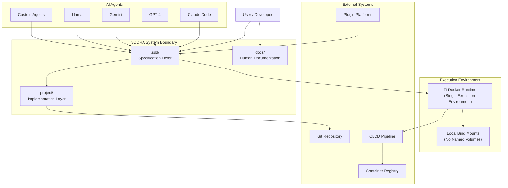

**Legend:** SDDRA operates as a specification-to-code engine. The `.sdd/` directory defines immutable rules, while `project/` contains generated implementation. All execution occurs within Docker containers using local bind mounts.

---

## 2. Execution Architecture

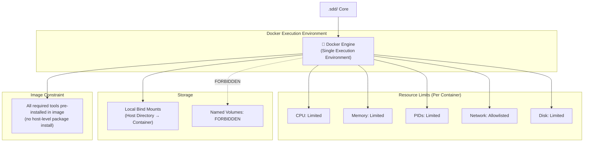

**Legend:** Docker is the single execution environment for build, test, lint, deploy, and all agent tool invocations. Every container MUST be resource-limited (CPU, memory, PIDs, disk, network allowlist) and use local bind mounts — named volumes are forbidden. The Docker image MUST include all required tools; no host-level package installation is permitted. Agents MUST NOT invoke tools outside the Docker sandbox.

---

## 3. Chain Graph (Cyclic Execution Model)

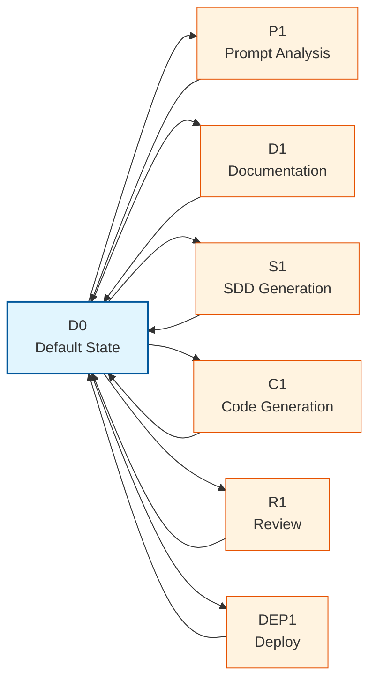

**Legend:** The chain graph is a cyclic structure with root `D0`. Each arm executes a specific phase and returns to `D0`. Human gates are enforced between arms (P1→D1, D1→S1, S1→C1, C1→DEP1).

---

## 4. Fixed SDLC Flow

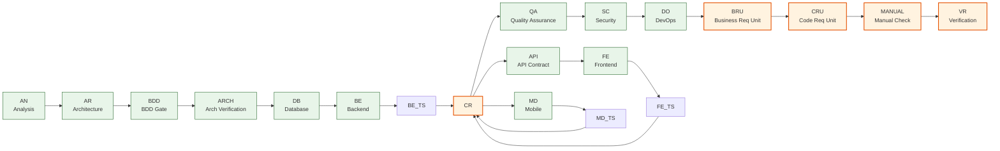

**Legend:** The canonical SDLC flow is: `AN → AR → BDD → ARCH → DB → BE → API → FE → [MD] → QA → SC → DO → BRU → CRU → MANUAL → VR`. Test suites (BE_TS, FE_TS, MD_TS) run only changed files. API and MD are conditional stages activated when their respective surfaces change. Human gates (BRU, CRU, MANUAL) enforce control at the end of the chain.

---

## 5. Human Gates Flow

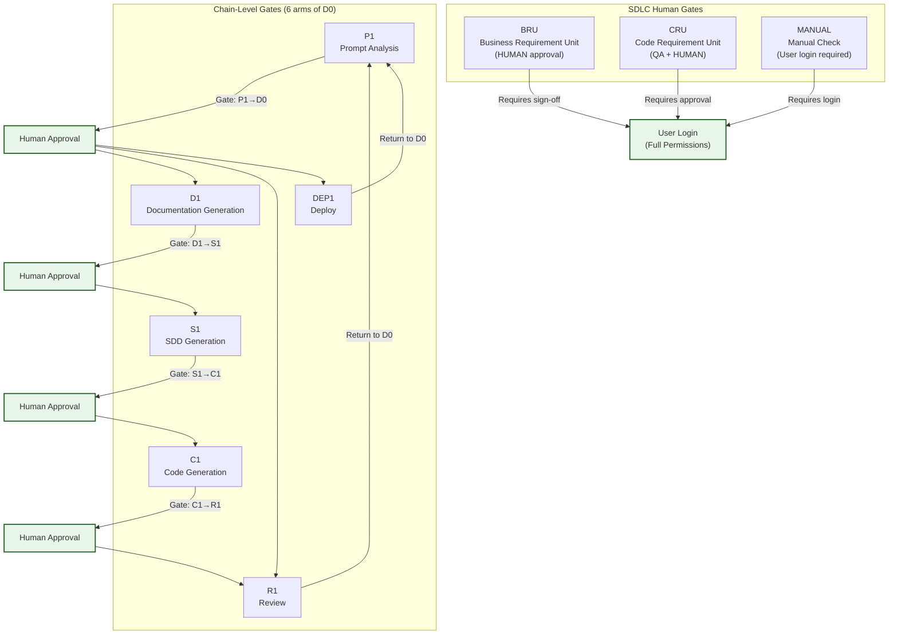

**Legend:** Seven non-bypassable human gates ensure control at critical transitions: chain-level approval at P1→D0, D1→S1, S1→C1, C1→R1, and SDLC-level approval at BRU, CRU, and MANUAL. MANUAL requires user login with full permissions from the environment. The chain is cyclic — every arm returns to D0 (root) for re-entry.

---

## 6. Three-Language Model

```mermaid
graph TB
    subgraph "Machine Language (.sdd/)"
        PROJ_SPEC[".sdd/PROJECT.sdd<br/>Root Router"]
        INDEX[".sdd/INDEX.sdd<br/>Routing Table"]
        PROTO[".sdd/protocol/ROOT.sdd<br/>Universal Rules"]
        CHAINS[".sdd/chains/<br/>Execution Graph"]
        SKILLS[".sdd/skills/<br/>Engineering Skills"]
        GATES[".sdd/gates/<br/>Quality Gates"]
        STAGES[".sdd/stages/<br/>Stage Definitions"]
        DECISIONS[".sdd/decisions/<br/>Decision Ledger"]
        TEMPLATES[".sdd/templates/<br/>Scaffolding"]
    end

    subgraph "AI Language (.sdd/project/)"
        AI_PROJ[".sdd/project/<br/>AI-Readable Project Structure<br/>(modules, components, API, data)"]
    end

    subgraph "Human Language (docs/)"
        HUMAN_DOCS["docs/<br/>Human-Readable Documentation<br/>1:1 mapping to project/"]
        HUMAN_REVIEW["Human Review<br/>(Approve / Request Changes)"]
    end

    subgraph "Execution (Chain Graph)"
        CHAIN_EXEC["D0 → P1 → D1 → S1 → C1 → R1 → DEP1 → D0"]
        GATE_ENFORCE["Gate Enforcement<br/>(Human Approval at Each Step)"]
    end

    USER_PROMPT["User Prompt<br/>(prompts/inbox/)"] --> PROJ_SPEC
    PROJ_SPEC --> INDEX
    INDEX --> PROTO
    PROTO --> CHAINS
    CHAINS --> SKILLS
    SKILLS --> GATES
    GATES --> STAGES
    STAGES --> DECISIONS
    DECISIONS --> TEMPLATES

    TEMPLATES --> CHAIN_EXEC
    CHAIN_EXEC --> GATE_ENFORCE
    GATE_ENFORCE -->|"D1 produces"| HUMAN_DOCS
    HUMAN_DOCS --> HUMAN_REVIEW
    HUMAN_REVIEW -->|"Approved"| AI_PROJ
    HUMAN_REVIEW -->|"Changes Requested"| CHAIN_EXEC
    AI_PROJ -->|"code generation"| SOURCE_CODE["project/<br/>Derived Source Code"]

    classDef machine fill:#e1f5fe,stroke:#01579b,stroke-width:2px;
    classDef ai fill:#e8f5e9,stroke:#1b5e20,stroke-width:1px;
    classDef human fill:#f3e5f5,stroke:#4a148c,stroke-width:1px;
    classDef exec fill:#fff3e0,stroke:#e65100,stroke-width:1px;

    class PROJ_SPEC,INDEX,PROTO,CHAINS,SKILLS,GATES,STAGES,DECISIONS,TEMPLATES machine
    class AI_PROJ,SOURCE_CODE ai
    class HUMAN_DOCS,HUMAN_REVIEW human
    class CHAIN_EXEC,GATE_ENFORCE exec
```

**Legend:** SDDRA uses a three-language model. `.sdd/` is **Machine Language** — immutable rules, schemas, workflows, and routing tables consumed by AI. `.sdd/project/` is **AI Language** — AI-readable project structure (modules, components, API, data) generated after human approval of `docs/`. `docs/` is **Human Language** — human-readable documentation with 1:1 mapping to `project/`. Prompts flow: user → machine language → execution → human language (docs) → AI language (project/) → derived source code. Humans MUST approve docs before `.sdd/project/` generation, and `.sdd/project/` before code execution.

---

## 7. Git Branching Strategy

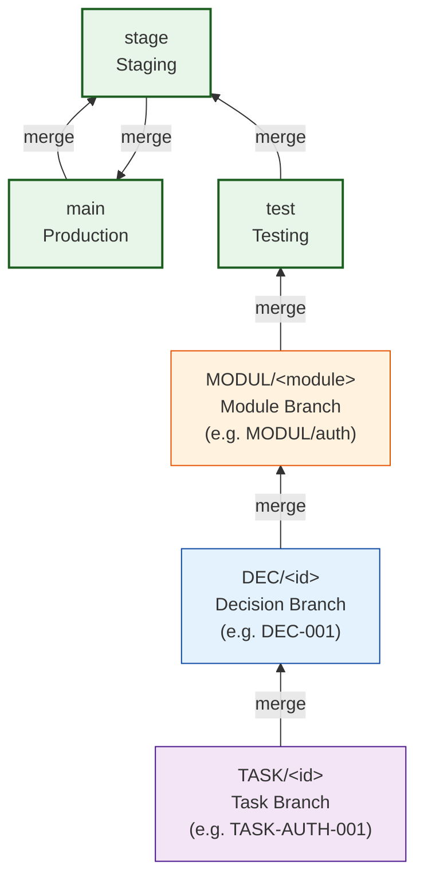

**Legend:** Branch hierarchy follows SDLC/STLC: `main → stage → test → MODUL/<module> → DEC/<id> → TASK/<id>`. Every commit references linked DEC and TASK IDs.

### Branch Creation and Merge Direction

```
CREATED FROM                    MERGES TO
─────────────────               ─────────────────
TASK/<id>       ── created from ──→  DEC/<id>
DEC/<id>        ── created from ──→  MODUL/<module>
MODUL/<module>  ── created from ──→  main
```

### Branch Lifecycle

| Branch | Created From | Merges To | Lifecycle |
|--------|-------------|-----------|-----------|
| `MODUL/<module>` | `main` | `test` → `stage` → `main` | Persists for module lifetime |
| `DEC/<id>` | `MODUL/<module>` | `MODUL/<module>` | Preserved for audit trail |
| `TASK/<id>` | `DEC/<id>` | `DEC/<id>` | Deleted after merge |

### Push and PR Workflow

```mermaid
graph LR
    CREATE["Create TASK branch<br/>from DEC branch"]
    COMMIT["Make changes<br/>+ semantic commits<br/>[DEC:id] [TASK:id]"]
    PUSH["Push TASK branch<br/>to remote"]
    PR["Open Pull Request<br/>TASK → DEC"]
    CI["CI/CD runs<br/>(only changed files)"]
    REVIEW["Human Review"]
    APPROVE["Approval"]
    MERGE_DEC["Merge into DEC<br/>(TASK branch deleted)"]
    PR_DEC["Open PR<br/>DEC → MODUL"]
    MERGE_MODUL["Merge into MODUL"]
    UPSTREAM["Propagate:<br/>MODUL → test → stage → main"]

    CREATE --> COMMIT
    COMMIT --> PUSH
    PUSH --> PR
    PR --> CI
    CI --> REVIEW
    REVIEW --> APPROVE
    APPROVE --> MERGE_DEC
    MERGE_DEC --> PR_DEC
    PR_DEC --> MERGE_MODUL
    MERGE_MODUL --> UPSTREAM
```

**Legend:** Each task has its own branch derived from its linked module and decision branch. Only changed files are tested. The TASK branch is deleted after merge; the DEC branch is preserved for audit.

### Semantic Commit Format

All commits MUST follow this format:

```
<type>(<scope>): <subject> [DEC:<id>] [TASK:<id>]
```

**Example:**
```
feat(auth): add login endpoint [DEC:DEC-001] [TASK:TASK-AUTH-001]
```

- **Types**: `feat`, `fix`, `docs`, `style`, `refactor`, `test`, `chore`, `build`, `ci`, `perf`, `revert`
- **Scopes**: `sdd`, `project`, `docs`, `chains`, `skills`, `prompts`, `commands`, `templates`, `patterns`, `workflows`, `decisions`, `gates`, `tests`
- **Breaking changes**: Include `!` and footer `BREAKING CHANGE: <description>`

### Branch Naming Examples

| Branch Type | Example | Purpose |
|-------------|---------|---------|
| Module | `MODUL/auth` | Authentication module development |
| Decision | `DEC-001` | Implementation of decision DEC-001 |
| Task | `TASK-AUTH-001` | Execution of task TASK-AUTH-001 |

---

## 8. CI/CD Pipeline

```mermaid
graph LR
    COMMIT["Git Commit"]
    PRECOMMIT["Pre-commit Hook<br/>(Validate .sdd/, Check Secrets)"]
    COMMIT_MSG["Commit-msg Hook<br/>(Semantic Format)"]
    PUSH["Push to Remote"]
    PREPUSH["Pre-push Hook<br/>(Run Tests, Validate Chain)"]
    PIPELINE["CI/CD Pipeline"]
    LINT["Lint .sdd/"]
    VALIDATE["Validate References"]
    TEST["Run Tests<br/>(Changed Files Only)"]
    SECURITY["Security Scan"]
    STAGING["Deploy to Staging"]
    PROD_APPROVAL["Human Approval"]
    PROD["Deploy to Production"]

    COMMIT --> PRECOMMIT
    PRECOMMIT --> COMMIT_MSG
    COMMIT_MSG --> PUSH
    PUSH --> PREPUSH
    PREPUSH --> PIPELINE
    PIPELINE --> LINT
    LINT --> VALIDATE
    VALIDATE --> TEST
    TEST --> SECURITY
    SECURITY --> STAGING
    STAGING --> PROD_APPROVAL
    PROD_APPROVAL --> PROD

    classDef gate fill:#fff3e0,stroke:#e65100,stroke-width:2px;
    classDef step fill:#e3f2fd,stroke:#0d47a1,stroke-width:1px;

    class PRECOMMIT,COMMIT_MSG,PREPUSH,PROD_APPROVAL gate
    class LINT,VALIDATE,TEST,SECURITY,STAGING,PROD step
```

**Legend:** Every commit passes through three git hooks (pre-commit, commit-msg, pre-push). The CI/CD pipeline validates, tests, scans, and deploys with human approval required for production.

---

## 9. Application Architecture

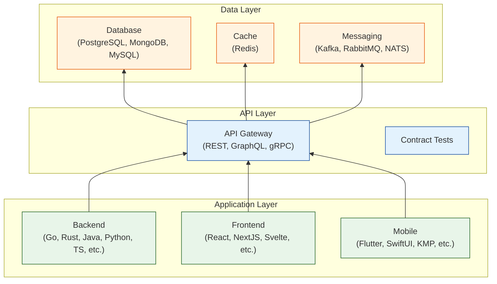

**Legend:** Application architecture follows a layered approach. All clients communicate through the API layer, which mediates access to data stores. Contract tests ensure API compatibility.

---

## 10. Infrastructure and Observability

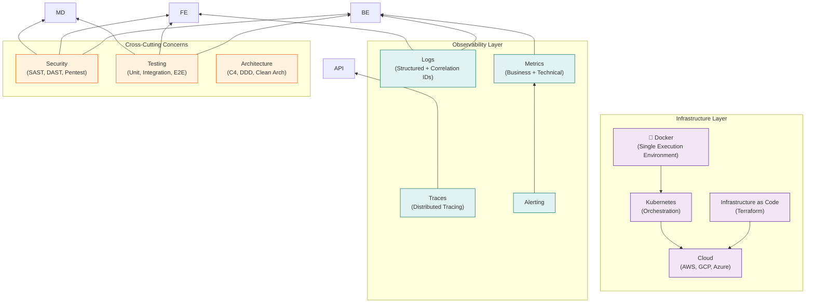

**Legend:** Docker is the single execution environment. Kubernetes provides orchestration on cloud infrastructure. Observability (logs, metrics, traces) and cross-cutting concerns (security, testing, architecture) apply across all layers.

---

## 11. SDDRA Integration Layer

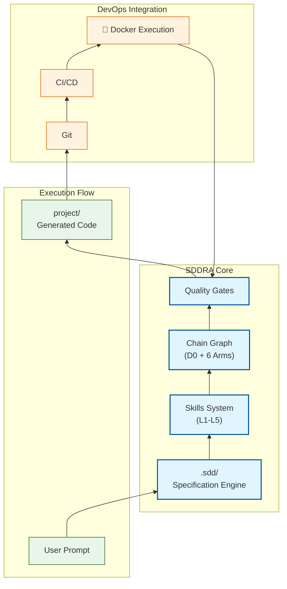

**Legend:** SDDRA acts as the integration layer between specification and execution. The `.sdd/` engine generates code through skills and chain graphs, then DevOps practices (Git, CI/CD, Docker) handle delivery with quality gates at each stage.

---

## 12. Decision Ledger Workflow

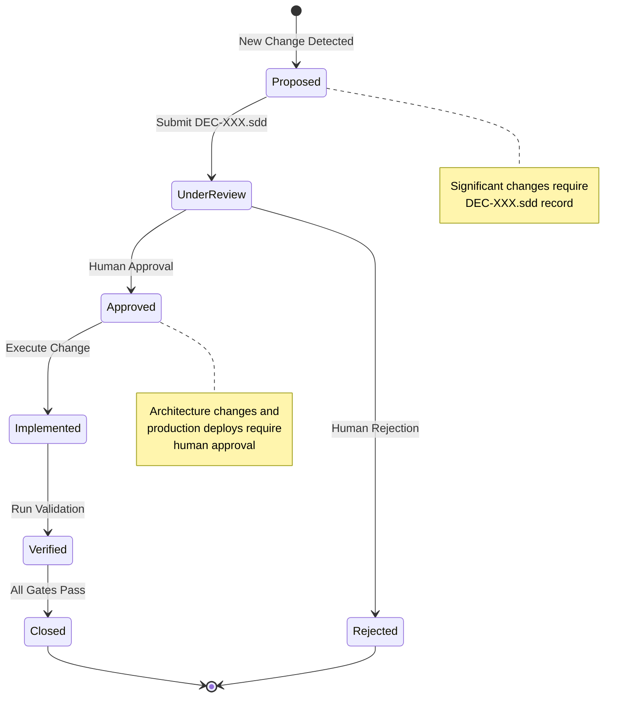

**Legend:** Every significant change follows the decision ledger workflow: `proposed → review → approved → implemented → verified → closed`. Architecture changes and production deployments require explicit human approval.

---

## 13. Skills Competency Model

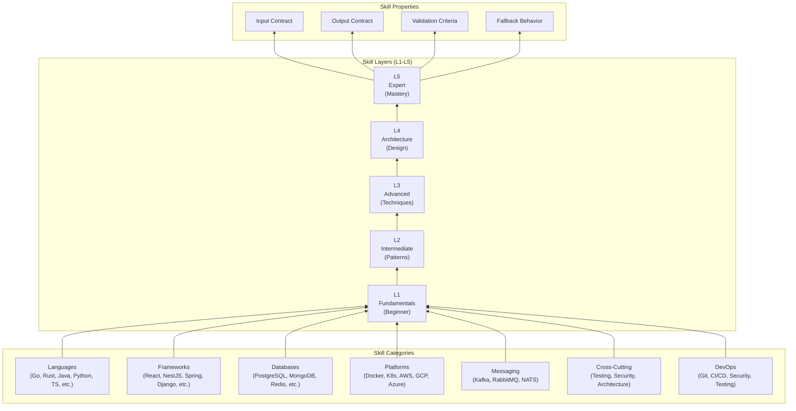

**Legend:** Skills are organized by technology domain and competency layers (L1-L5). Each skill is an executable unit with clear input/output contracts, validation criteria, and fallback behavior.

---

## 14. Project Scale Levels

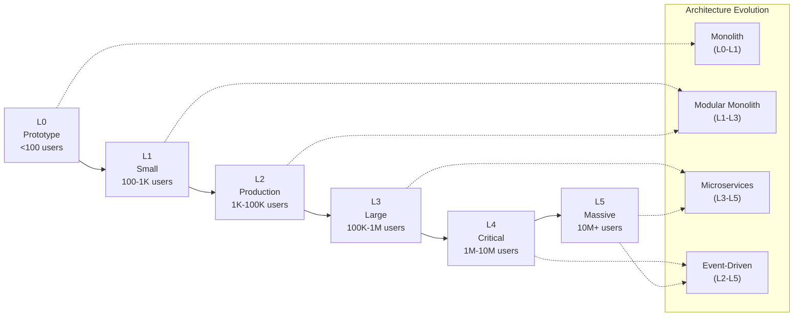

**Legend:** Project scale (L0-L5) determines architecture pattern selection. Overengineering and underengineering gates prevent mismatched complexity. L5 maps to Microservices or Event-Driven (Serverless is L1-L4 only).

---

## 15. Security Control Layers

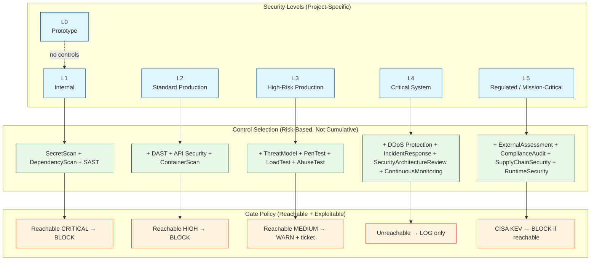

**Legend:** Security is a cross-cutting control layer applied throughout the SDLC. SecurityLevel is **project-specific** (stored in `project/security/INDEX.sdd`) and is calculated from data sensitivity, exposure, transaction volume, and compliance. Controls are **selected by level and risk**, not stacked cumulatively; gates block only on findings that are BOTH reachable AND exploitable (see `.sdd/security/levels.sdd`). Critical and High reachable findings block verification until resolved; Medium is warn+ticket; Unreachable is log-only.

### Security Level Definitions

| Level | Name | Controls | When to Use |
|-------|------|----------|-------------|
| **L0** | Prototype | None | Internal prototypes, throwaway experiments, non-production |
| **L1** | Internal | SecretScan, DependencyScan, SAST | Internal tools, no external access, minimal sensitive data |
| **L2** | Standard Production | + DAST, API Security, ContainerScan | Production systems with standard security requirements |
| **L3** | High-Risk Production | + ThreatModel, PenTest, LoadTest, AbuseTest | High-risk systems with sensitive data or financial impact |
| **L4** | Critical System | + DDoS Protection, IncidentResponse, SecurityArchitectureReview, ContinuousMonitoring | Mission-critical systems with maximum security requirements |
| **L5** | Regulated / Mission-Critical | + ExternalAssessment, ComplianceAudit, SupplyChainSecurity, RuntimeSecurity | Regulated industries, government, critical infrastructure |

---

## 16. Deployment Strategies

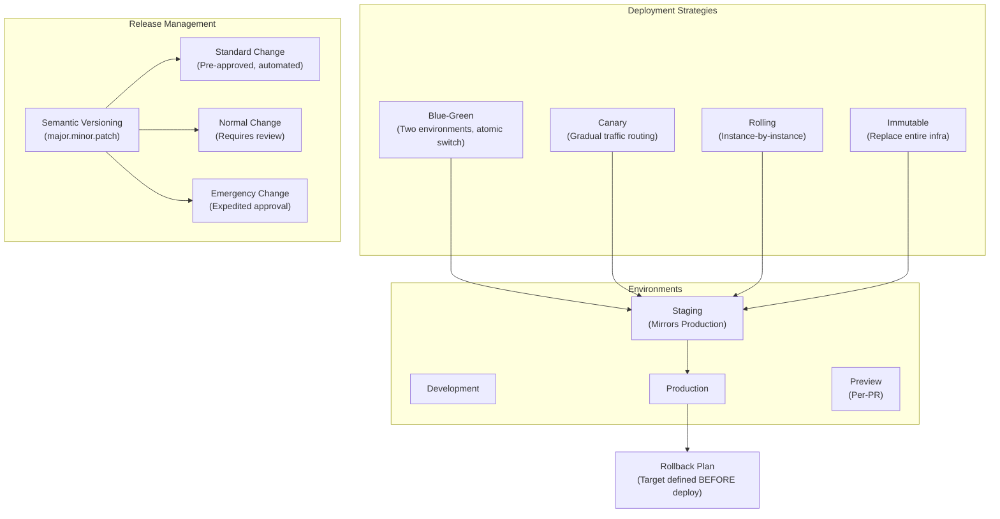

**Legend:** Deployment strategy selection depends on risk tolerance, team maturity, and project scale. Every deploy must be reversible, automated, and tested before production.

---

## 17. Architecture Patterns

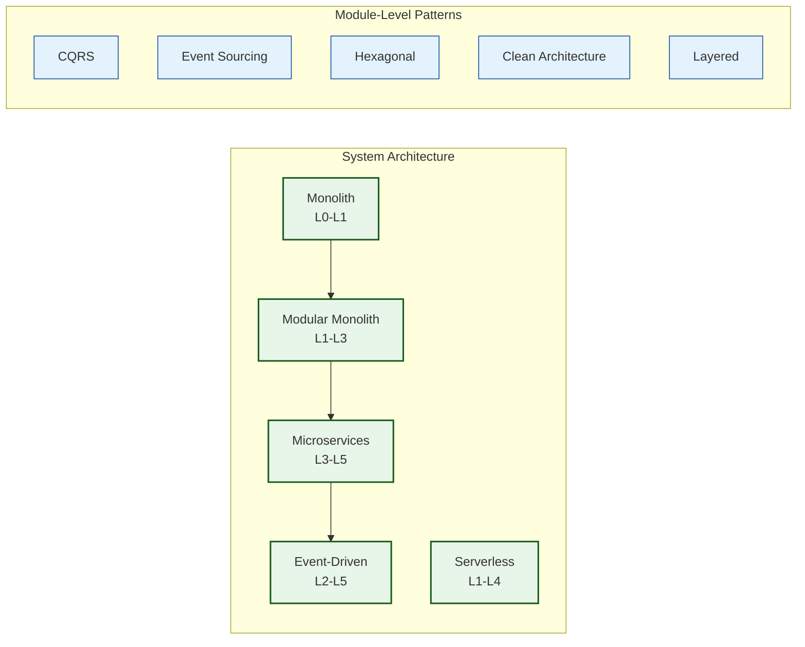

**Legend:** System architecture patterns evolve with scale: Monolith → Modular Monolith → Microservices → Event-Driven. Design patterns (CQRS, Hexagonal, Clean Architecture, Layered) are applied at the module level, not as top-level architecture.

### Architecture Selection Rules

| Pattern | Scale Fit | When to Use | When to Avoid |
|---------|-----------|-------------|---------------|
| **Monolith** | L0-L1 | Small team, low traffic, prototype/MVP | High traffic, multiple teams |
| **Modular Monolith** | L1-L3 | Medium team, medium traffic, clear domain boundaries | Very high traffic, independent scaling needs |
| **Microservices** | L3-L5 | Large team, high traffic, clear domain boundaries | Small team, low traffic, insufficient DevOps maturity |
| **Event-Driven** | L2-L5 | Async workflows, event sourcing, multiple consumers | Simple CRUD, strong consistency required |
| **Serverless** | L1-L4 | Variable traffic, event-driven workloads, rapid prototyping | Consistent high traffic, long-running processes |

**Overengineering Gate:** Flag when pattern complexity > project scale justifies.
**Underengineering Gate:** Flag when availability/security/traffic requirements > pattern provides.

---

## 18. Observability Pillars

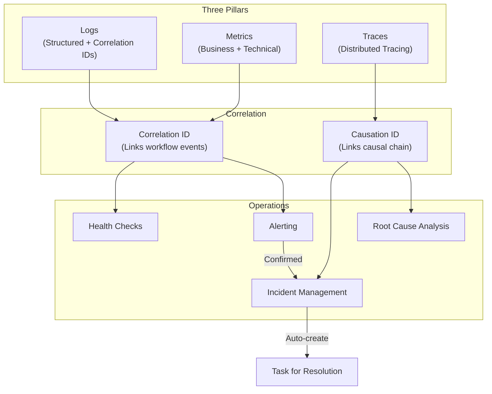

**Legend:** Observability is built on three pillars: logs, metrics, and traces. Correlation IDs link workflow events; Causation IDs link causal chains. Confirmed incidents automatically create resolution tasks.

---

## 19. Resilience Patterns

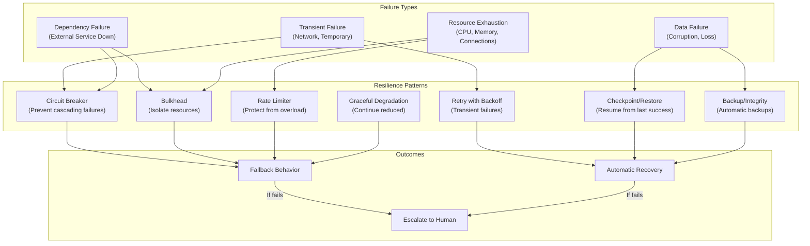

**Legend:** Resilience patterns handle different failure types. Transient failures use retry with backoff. Dependency failures use circuit breaker and bulkhead isolation. Resource exhaustion uses rate limiting. Data failures use backup and checkpoint/restore. Failed recoveries escalate to human intervention.

---

## 20. Gate Failure and Exception Handling

```mermaid
graph TB
    GATE["Quality Gate<br/>(AN, AR, BDD, ARCH, DB, BE, API, FE, MD, QA, SC, DO, VR, CR, BRU, CRU, MANUAL)"]

    GATE -->|"Pass"| NEXT["Advance to Next Stage"]
    GATE -->|"Fail"| CLASSIFY["Classify Failure"]

    CLASSIFY -->|"Code Defect"| OWNER["Route to Owner Stage<br/>(BE/FE/MD/API)"]
    CLASSIFY -->|"Requirement Defect"| AR["Route to Architecture<br/>(AR)"]
    CLASSIFY -->|"Infrastructure"| DO["Route to DevOps<br/>(DO)"]
    CLASSIFY -->|"Security Finding"| SC["Route to Security<br/>(SC)"]
    CLASSIFY -->|"Test Gap"| QA["Route to QA<br/>(QA)"]

    OWNER --> FIX["Fix and Re-run Gate"]
    AR --> CLARIFY["Clarify Requirements"]
    DO --> INFRA_FIX["Fix Infrastructure"]
    SC --> SEC_FIX["Fix Security Issue"]
    QA --> TEST_FIX["Add Missing Tests"]

    FIX --> GATE
    CLARIFY --> GATE
    INFRA_FIX --> GATE
    SEC_FIX --> GATE
    TEST_FIX --> GATE

    classDef gate fill:#fff3e0,stroke:#e65100,stroke-width:2px;
    classDef pass fill:#e8f5e9,stroke:#1b5e20,stroke-width:1px;
    classDef fail fill:#ffebee,stroke:#b71c1c,stroke-width:1px;

    class GATE gate
    class NEXT pass
    class CLASSIFY,OWNER,AR,DO,SC,QA,FIX,CLARIFY,INFRA_FIX,SEC_FIX,TEST_FIX fail
```

**Legend:** When a quality gate fails, the failure is classified by type and routed to the responsible stage per `.sdd/gates/stage/gates.sdd`. There are 17 stage gates — AN, AR, BDD, ARCH, DB, BE, API, FE, MD, QA, SC, DO, VR, CR, BRU, CRU, MANUAL. Code defects go back to the owner stage, requirement defects to architecture, infrastructure issues to DevOps, security findings to security, and test gaps to QA. After fixing, the gate is re-run.

---

## 21. Directory Structure

```
.sdd/
  PROJECT.sdd              Root router / constitution
  INDEX.sdd                Universal routing table
  EVOLUTION.sdd            System evolution roadmap
  AUDIT.sdd                Audit specification
  WORK-PLAN.sdd            Work plan specification
  RESOURCES.sdd            Resource specification
  protocol/ROOT.sdd        Universal rules (above everything)
  architecture/            System architecture knowledge base
    levels.sdd             ProjectScale L0-L5
    patterns.sdd           Architecture patterns
    deployment.sdd         Deployment strategies
  chains/                  Execution graph + arms + rules + tokens
    graph.sdd              Cyclic root D0 with 6 arms (P1, D1, S1, C1, R1, DEP1)
  skills/                  Engineering skills (L1-L5)
    devops/                DevOps skills (git, ci-cd, security, testing)
  workflow/                Execution workflows
    INDEX.sdd              Workflow engine routing
    stages.sdd             Formal stage registry (AN, AR, BDD, ARCH, DB, BE, API, FE, MD, QA, SC, DO, BRU, CRU, MANUAL, VR)
    gates.sdd              Gate criteria for each stage
  commands/                CLI commands (/sdd, /sdd-analyze, /sdd-status, …)
  plugins/                 External plugin adapters
  project/                 AI-readable project structure (modules, components, API, data)
  tasks/                   Task lifecycle engine
  decisions/               Decision ledger engine
  templates/               Reusable project structure templates
  context/                 Context loading & budgets
  dependencies/            Dependency graph engine
  gates/                   Quality / security / release gates
    stage/gates.sdd        Stage-specific gate criteria
  graph/                   Knowledge graph (nodes, relations, drift)
  observability/           Logging, metrics, tracing, incidents
  runtime/                 Agent runtime state
  security/                Security controls & scanners (levels.sdd, controls.sdd)
  stages/                  Individual stage definitions (.sdd per stage)
  testing/                 Test types, levels, gates, scripts
  agent/                   Agent behavior rules (capabilities, policies, …)
  cases/                   Case specifications
  bugs/                    Bug tracking
  projects/                Project instances
    {project_name}/        Concrete project data
  state/                   System state
  knowledge/               Knowledge graph
  lessons/                 Lessons learned
  policies/                Policy specifications
  queries/                 Query specifications
  concepts/                Concept definitions
  references/              Cross-references
  evolution/               Evolution history
  graph/                   Graph definitions
  timeline/                Timeline of events
  orchestrator/            Orchestration reference
  patterns/                Resilience patterns
  standards/               Naming, levels, states, relations
  insights/                System insights
  discovery/               Discovery specifications
  features/                Feature specifications
  stack/                   Stack specifications
  skills/                  Engineering skills

project/                   # AI-generated source code (derived, regenerated)
  backend/
  frontend/
  mobile/
  database/

docs/                      # Human-readable documentation (1:1 mapping to project/)
  00-about/
  20-architecture/
  30-backend/
  40-frontend/
  60-database/
  70-api/
  100-devops/

prompts/                   # Root-level prompt inbox (user submissions, flat storage)
```

---

## 22. Core Principles

| Principle | Description |
|-----------|-------------|
| **Immutability** | Core `.sdd/` rules are immutable. AI may append decisions, tasks, and project state only. |
| **Token Minimalism** | Short IDs, `INDEX.sdd` routing, lazy loading, no full-catalog reads. |
| **Single Source of Truth** | `.sdd/` defines intent; `project/` is implementation. |
| **No Duplication** | Global files route only; project files contain details. |
| **Explicit References** | `@path` format, resolved before reading. |
| **Human Control** | Architectural changes and production deployments require approval. |
| **DevOps as Code** | All DevOps practices are encoded as skills in `.sdd/`. |
| **Docker Only** | All execution runs inside Docker — no local tool installation. |
| **Local Bind Mounts** | Docker uses local bind mounts — named volumes are forbidden. |
| **Changed Files Only** | Only changed files are tested — full regression suites are not run on unchanged code. |

---

## 23. AI Behavior Rules

1. **READ `.sdd/` FIRST**: AI MUST read `.sdd/` files before touching `project/`
2. **CREATE IN `project/`**: AI creates implementation code in `project/`, never in `.sdd/`
3. **UPDATE `.sdd/` ONLY FOR PROJECT ARTIFACTS**: AI updates `.sdd/` only for new decisions, tasks, states, or project-specific content
4. **FOLLOW THE CHAIN**: D0 → arm → D0, never skip gates
5. **USE TEMPLATES**: `.sdd/templates/` provides immutable scaffolding
6. **RECORD TOKENS**: Every stage records token usage
7. **CREATE DECISIONS**: Every significant change gets a `DEC-XXX.sdd`
8. **SKILLS ARE EXECUTABLE**: Skills are not just knowledge — they are executable units
9. **DEVOPS AS SKILLS**: All DevOps practices are skills in `.sdd/skills/devops/`
10. **LOCAL VALIDATION**: All changes must pass local validation before push
11. **DOCKER ONLY**: All execution MUST run inside Docker — no local tool installation
12. **RESOURCE LIMITS**: Docker containers MUST be resource-limited (CPU, memory, PIDs, network)
13. **LOCAL BIND MOUNTS**: Docker MUST use local bind mounts — named volumes are forbidden
14. **CHANGED FILES ONLY**: Only changed files are tested — regression suites are not run on unchanged code
15. **BRANCH PER TASK**: Each task has its own branch linked to its module and decision

---

## 24. DevOps Rules (Immutable)

### Git Commits
- All commits MUST follow semantic format: `<type>(<scope>): <subject> [DEC:<id>] [TASK:<id>]`
- Valid types: `feat`, `fix`, `docs`, `style`, `refactor`, `test`, `chore`, `build`, `ci`, `perf`, `revert`
- Valid scopes (per `.sdd/branches/INDEX.sdd` [B2] and `.sdd/PROJECT.sdd` [R33]): `sdd`, `project`, `docs`, `chains`, `skills`, `prompts`, `commands`, `templates`, `patterns`, `workflows`, `decisions`, `gates`, `tests`
- Breaking changes MUST include `!` and footer: `BREAKING CHANGE: <description>`

### Git Hooks
- **pre-commit**: Validates `.sdd/` files, checks for secrets, validates references
- **commit-msg**: Validates semantic commit format
- **pre-push**: Runs tests, validates chain graph, checks documentation

### Local Validation (Before Push)
Every developer MUST run:
1. `.sdd/` validation: all files have required fields, references resolve
2. Semantic commit check: commit message follows format
3. Local tests: unit tests, integration tests pass
4. Security checks: no secrets, no vulnerabilities
5. Linting: `.sdd/` formatting, code formatting

### CI/CD Pipeline
1. Lint `.sdd/` files
2. Validate references
3. Run tests (unit, integration, chain)
4. Run security scans
5. Validate semantic commits
6. Deploy to staging
7. Production deployment requires human approval

### Branching Strategy
- `MODUL/<module>` → module development branch
- `DEC/<id>` → decision implementation branch
- `TASK/<id>` → task execution branch
- Branch hierarchy: `main → stage → test → MODUL → DEC → TASK`
- Every commit MUST reference linked DEC and TASK IDs
- Only changed files are tested

---

## 25. Getting Started

### For Users
1. Read `README.md` — system overview (this file)
2. Read `.sdd/PROJECT.sdd` — root rules and directory map
3. Read `.sdd/INDEX.sdd` — routing table
4. Read `.sdd/protocol/ROOT.sdd` — universal principles
5. Read `.sdd/chains/graph.sdd` — execution chain
6. Read `.sdd/skills/devops/` — DevOps rules and skills
7. Run `/sdd-analyze` in Claude CLI to inspect the system
8. Run `/sdd "prompt"` to execute the chain graph

### For Developers
1. Clone repository
2. Install dependencies
3. Run `/sdd-analyze` to verify system
4. Create feature branch: `feat(scope): description`
5. Make changes
6. Run local validation: `.sdd/skills/devops/ci-cd/local-validation.sdd`
7. Commit with semantic message
8. Push and create PR
9. Wait for CI/CD checks
10. Merge after approval

### For AI Agents
1. Read `.sdd/PROJECT.sdd` first
2. Follow ReadOrder in `.sdd/INDEX.sdd`
3. Read `.sdd/protocol/ROOT.sdd` for universal rules
4. Read `.sdd/chains/graph.sdd` for execution flow
5. Read `.sdd/skills/devops/` for DevOps rules
6. Use `.sdd/templates/` for scaffolding
7. Follow chain graph: D0 → arm → D0
8. Respect human gates
9. Record token usage
10. Create decision records for significant changes

---

## 26. Commands

| Command | Purpose |
|---------|---------|
| `/sdd` | Execute chain graph from prompt |
| `/sdd-update` | Sync .sdd/ state from git repository |
| `/sdd-prompts` | Automate prompt lifecycle (structure, inbox, archive) |
| `/sdd-analyze` | Analyze `.sdd/` structure |
| `/sdd-status` | Show execution status |
| `/sdd-decisions` | List decisions |
| `/sdd-health` | Check system integrity |
| `/sdd-backup` | Create backup |
| `/sdd-restore` | Restore from backup |
| `/sdd-resume` | Resume from checkpoint |
| `/sdd-migrate` | Run migrations |
| `/sdd-compact` | Compress context after task |
| `/sdd-clear` | Clear context for next task |
| `/sdd-next` | Advance decision chain to next step |
| `/sdd-knowledge` | Report knowledge graph health and trust |
| `/sdd-explain` | Explain completed task on demand |

---

## 27. Skills System

Skills are organized by technology and competency layers (L1-L5):

- **L1**: Fundamentals (beginner)
- **L2**: Intermediate patterns
- **L3**: Advanced techniques
- **L4**: Architecture & design
- **L5**: Expert/mastery

Skills are self-contained executable units with:
- Clear input/output contracts
- Examples of usage
- Validation criteria
- Fallback behavior

### DevOps Skills
All DevOps practices are encoded as skills:
- Git semantic commits
- Git branching strategy
- Git hooks
- CI/CD pipelines
- Local validation
- Security testing
- Test automation

---

## 28. Work Flow

### Prompt to Code
1. User submits prompt to `prompts/inbox/`
2. `/sdd` reads prompt
3. Analyzes and formalizes prompt into `docs/`
4. Human reviews documented prompt
5. Executes P1 (prompt analysis)
6. Executes D1 (docs generation)
7. Human approves docs
8. Executes S1 (sdd generation)
9. Human approves sdd
10. Executes C1 (code generation)
11. Human reviews code
12. Executes R1 (review)
13. Human approves production
14. Executes DEP1 (deploy)
15. Moves prompt to archive

### Git Workflow
1. Create branch: `MODUL/<module>`, `DEC/<id>`, or `TASK/<id>`
2. Make changes
3. Run local validation (only changed files)
4. Commit with semantic message referencing DEC and TASK IDs
5. Push to remote
6. Create PR
7. CI/CD runs checks
8. Human reviews
9. Merge through MODUL → test → stage → main
10. Deploy to staging
11. Human approves production
12. Merge to main
13. Deploy to production

---

## 29. Connecting AI Agents

### How to Connect
1. Read `.sdd/PROJECT.sdd` for system rules
2. Read `.sdd/INDEX.sdd` for routing
3. Read `.sdd/protocol/ROOT.sdd` for universal principles
4. Read `.sdd/agent/INDEX.sdd` for the agent system contract (capabilities, policies, permissions, approvals, execution, limits, rollback, audit, roles, contract, shared-state, coordination, conflicts, handoff)
5. Implement agent adapter in `.sdd/plugins/` (per `.sdd/agent/contract.sdd`)
6. Follow chain graph: D0 → arm → D0
7. Respect human gates (chain-level and SDLC-level)
8. Record token usage
9. Create decision records for significant changes

The SDDRA protocol is **agent-agnostic** — any agent that can read `.sdd/`, follow the chain graph, respect human gates, and satisfy the agent contract in `.sdd/agent/` can act as an executor. No vendor lock-in.

### Agent Requirements
- MUST read `.sdd/` before touching `project/`
- MUST follow the chain graph in `.sdd/chains/graph.sdd`
- MUST follow semantic commits per `.sdd/branches/INDEX.sdd`
- MUST run local validation before push
- MUST respect immutability of `.sdd/` (source of truth)
- MUST create files in `project/`, never in `.sdd/` (except for new decisions, tasks, or states per `.sdd/PROJECT.sdd` [R14])
- MUST record token usage
- MUST create decision records
- MUST obey modes: PLAN, ANALYZE, IMPLEMENT, REVIEW, TEST, SECURITY, DEPLOY, DIAGNOSE, AUDIT
- MUST enforce rules [AG1]–[AG10] in `.sdd/agent/INDEX.sdd`

---

## 30. Future Extensibility

### Adding New Skills
1. Create skill file in appropriate `.sdd/skills/` subdirectory
2. Add to skill INDEX.sdd
3. Add to `.sdd/INDEX.sdd` navigation
4. Document in README.md

### Adding New Commands
1. Create command file in `.sdd/commands/`
2. Add to `.sdd/commands/INDEX.sdd`
3. Add to `.sdd/INDEX.sdd` navigation
4. Document in README.md

### Adding New Patterns
1. Create pattern file in `.sdd/patterns/`
2. Add to `.sdd/patterns/INDEX.sdd`
3. Add to `.sdd/INDEX.sdd` navigation
4. Document in README.md

### Adding New Workflows
1. Create workflow file in `.sdd/workflow/`
2. Add to `.sdd/workflow/INDEX.sdd`
3. Add to `.sdd/INDEX.sdd` navigation
4. Document in README.md

---

## 31. Troubleshooting

### System won't start
1. Run `/sdd-health` to check integrity
2. Verify `.sdd/PROJECT.sdd` exists
3. Verify `.sdd/INDEX.sdd` exists
4. Verify `.sdd/protocol/ROOT.sdd` exists
5. Restore from backup if needed

### Plugin not loading
1. Verify plugin manifest exists for your platform
2. Check platform-specific logs
3. Ensure `.sdd/` structure is intact
4. Reinstall plugin from marketplace

### Chain execution fails
1. Check `/sdd-status` for current state
2. Run `/sdd-resume` to continue from checkpoint
3. Check logs in `.sdd/testing/scripts/results/`
4. Review decisions in `.sdd/decisions/`
5. Ensure Docker is running (all execution requires Docker)

### Docker issues
1. Verify Docker is installed and running
2. Check container resource limits (CPU, memory, PIDs)
3. Verify local bind mounts are configured correctly
4. Ensure no named volumes are used
5. Check Docker logs for errors

### Tests failing
1. Run tests locally in Docker
2. Check test output (only changed files are tested)
3. Fix failing tests
4. Run local validation
5. Push again

---

## 32. Installation

### As Standalone Repository

```bash
git clone https://github.com/sddra/{project_name}.git
cd {project_name}
```

Clone the repo and use `.sdd/` as your engineering OS. No additional installation required.

### As Claude Code Plugin

```bash
/plugin marketplace add sddra/sddra-marketplace
/plugin install sddra@sddra-marketplace
```

### As Codex CLI Plugin

```bash
codex plugin install sddra
```

### As Cursor Extension

Install from Cursor Marketplace: search for "SDDRA".

### As OpenCode Plugin

```bash
opencode plugin install sddra
```

### As Hermes Agent Plugin

```bash
hermes plugin install sddra
```

### As Pi Extension

```bash
pi extension install sddra
```

### As Kimi Code Plugin

```bash
kimi plugin install sddra
```

---

## 33. Plugin Manifests

This repo includes plugin manifests for multiple AI agent platforms:

- `.agents/plugins/marketplace.json` — Claude Code marketplace
- `.claude-plugin/plugin.json` — Claude Code plugin
- `.codex-plugin/plugin.json` — Codex CLI plugin
- `.cursor-plugin/plugin.json` — Cursor extension
- `.opencode/plugins/sddra.js` — OpenCode plugin
- `.pi/extensions/sddra.ts` — Pi extension
- `.hermes-plugin/plugin.yaml` — Hermes plugin
- `.kimi-plugin/plugin.json` — Kimi Code plugin

Each manifest points to the same `.sdd/` core, so the system behaves identically whether cloned directly or installed from a marketplace.

---

## 34. Usage After Installation

1. Open your project root
2. Run `/sdd` to analyze prompts
3. Follow the chain graph: P1 → D1 → S1 → C1 → DEP1
4. Human approval required at each gate
5. `.sdd/` remains immutable — all execution metadata stays in `.sdd/`

---

## Status

Active development. Model is live and incrementally refined. All `.sdd/` files are immutable and owned by the user.

## License

Proprietary - All rights reserved
