Spec DD yazmaq isteyriem ancaq men istediim kimi olsun addim addim gede bilerik?

Bəli, tam olaraq addım-addım gedə bilərik. Hətta məncə ən yaxşı yanaşma budur ki, əvvəlcə sənin istədiyin Spec DD strukturunu birlikdə müəyyən edək, sonra sən məlumatları verdikcə mən onu sənə uyğun formada yığim.

Belə işləyə bilərik:

Sistemin məqsədi — nə həll edir?
Scope — nə daxildir, nə daxil deyil?
User / Role-lar
Functional Requirements
Business Rules
System Architecture
Module-lar
Database / Entity-lər
API-lər
Workflow / Flow-lar
Security
Error handling
Logging / Monitoring
Deployment
Testing
Acceptance Criteria
Edge Cases
Future improvements

Amma bunları birdən-birə yazmayaq.

Addım 1 — əvvəlcə sistemi müəyyənləşdirək

Mənə sadəcə bunları yaz:

Project adı:
Bu sistem nə edir?
Kim istifadə edir?
Əsas problem nədir?
Əsas funksiyalar təxminən hansılardır?

İstəsən qarışıq, qeyri-formal şəkildə yaz. Məsələn:

Sistem tələbə və müəllimlər üçündür. Student dərs alır, teacher material əlavə edir. Company müəllimləri idarə edir. Student müəyyən skill-lər üzrə inkişaf edir və sistem onun progressini saxlayır...

Sən necə bilirsənsə elə yaz. Mən hələ DD-ni yazmayacağam, əvvəlcə sənin ideyanı başa düşüb strukturunu quracağıq.

Bəli. Sənin istədiyin modeldə .sdd qovluğu özü development prosesini idarə edən bir Specification-Driven Development sistemi kimi işləyə bilər.

Sən yalnız prosesi başladırsan, sistem isə:

Step 1 → Backend → Step 2 → Database → Step 3 → API → Step 4 → Frontend → Step 5 → Mobile → Step 6 → DevOps → ...

şəklində irəliləyir.

Əsas qayda: mən sənə hər dəfə yalnız 1 addım verəcəyəm. Sən həmin addımı tamamlayıb nəticəni verdikdən sonra növbəti addıma keçəcəyik.

Başlanğıc yanaşması

.sdd/ altında təxminən belə bir struktur ola bilər:

.sdd/
├── 00-project/
├── 01-backend/
├── 02-database/
├── 03-api/
├── 04-frontend/
├── 05-mobile/
├── 06-devops/
├── 07-testing/
├── 08-security/
├── 09-deployment/
└── 10-documentation/

Amma hamısını indi yaratmırıq.

İlk olaraq sistem yalnız Backend mərhələsinə fokuslanacaq.

STEP 1 — Backend Specification

İlk addımın məqsədi:

Backend-in necə qurulacağını müəyyən edən ilkin specification yaratmaq.

Burada hələ kod yazılmır.

Bu mərhələdə müəyyənləşdiriləcək:

Go version
Backend architecture
Project structure
Application layers
PostgreSQL
Redis varsa
Message broker varsa
Authentication
Authorization
Configuration
Environment variables
Logging
Error handling
Validation
API versioning
Testing strategy
Docker
Health checks

STEP 1 tamamlanmadan STEP 2-yə keçilmir.

Sənin stack-inə uyğun olaraq backend üçün əsas texnologiyanı da başlanğıcda Go + PostgreSQL götürə bilərik.

Növbəti mesajında mən sənə yalnız STEP 1 üçün .sdd daxilində yerləşdiriləcək konkret faylın adını və həmin fayl üçün AI instruction/specification-ı verəcəyəm.


Bəli, indi ideyanı daha dəqiq başa düşdüm. Sən sadəcə .sdd-ni task/spec qovluğu kimi yox, layihənin development brain-i / engineering rules engine-i kimi qurmaq istəyirsən.

Yəni AI kod yazmağa başlamazdan əvvəl .sdd/.backend/ daxilində olan skill-ləri oxuyur, həmin skill-lərə əsasən qərar verir və kodu ona uyğun yazır.

Məsələn:

.sdd/
├── 00-project/
├── .backend/
│   ├── architecture/
│   ├── clean-code/
│   ├── ddd/
│   ├── design-patterns/
│   ├── error-handling/
│   ├── validation/
│   ├── security/
│   ├── testing/
│   ├── database/
│   ├── api/
│   ├── observability/
│   └── performance/
│
├── .frontend/
├── .mobile/
├── .devops/
└── .testing/

Amma burada çox vacib bir fərq var:

.sdd/.backend/ sadəcə documentation olmamalıdır

Hər skill AI üçün executable engineering rule kimi hazırlanmalıdır.

Məsələn:

.sdd/.backend/
└── clean-code/
    └── SKILL.md

İçində:

# Clean Code


## Purpose
...


## Rules
1. Functions must have one responsibility.
2. Avoid unnecessary abstraction.
3. Prefer explicit code.
4. ...


## Go-specific rules
...


## Must
...


## Must Not
...


## Examples
...


## Review Checklist
...

Sonra AI backend kodu yazmazdan əvvəl:

Read:
.sdd/.backend/architecture/*
.sdd/.backend/clean-code/*
.sdd/.backend/ddd/*
.sdd/.backend/security/*
.sdd/.backend/testing/*
...

və kod həmin qaydalar əsasında yaradılır.

Ən vacib hissə

Sənin sistemində workflow belə olmalıdır:

PRODUCT IDEA
     ↓
PROJECT SPECIFICATION
     ↓
TECHNOLOGY SELECTION
     ↓
BACKEND
     ↓
LOAD BACKEND SKILLS
     ↓
ANALYZE REQUIREMENTS
     ↓
DESIGN
     ↓
IMPLEMENT
     ↓
REVIEW AGAINST SKILLS
     ↓
TEST
     ↓
PASS?
 ┌───┴───┐
 NO      YES
 ↓        ↓
FIX    NEXT STEP

Yəni AI sadəcə:

"Mənə Go backend yaz"

etməməlidir.

Əvvəl:

"Bu backend hansı engineering standards-a uyğun yazılmalıdır?"

sualını .sdd/.backend/-dən cavablandırmalıdır.

Və skill-ləri də 3 kateqoriyaya bölmək daha düzgün olar

1. Mandatory

Bunlar pozula bilməz:

Clean Code
Security
Error Handling
Testing
Architecture
DDD rules
API conventions
Database rules

2. Recommended

Design Patterns
Performance
Caching
Observability
Refactoring

3. Contextual

Məsələn DDD hər CRUD endpoint üçün məcburi olmamalıdır.

AI qərar verməlidir:

Does this module require DDD?
        ↓
      YES → load DDD skill
        ↓
       NO → don't force DDD

Bu çox vacibdir. Çünki "hər yerdə DDD istifadə et" kimi rule yaxşı engineering deyil.

Sənin .sdd sisteminin əsas fəlsəfəsi

Mən bunu belə qurardım:

Specification tells WHAT to build.
Skills tell HOW to build it.
Workflow tells WHEN to build it.
Validation tells WHETHER it is acceptable.

Bu yanaşma sənin Full Stack + DevOps roluna da çox yaxşı oturur.

Və bəli — bundan sonra bunu addım-addım qura bilərik.

STEP 1-də hələ backend skill-lərini yazmırıq. İlk olaraq .sdd sisteminin özünün Core/Engine qaydasını müəyyənləşdirməliyik. Çünki sonradan .backend, .frontend, .mobile, .devops hamısı eyni mexanizm ilə işləməlidir.

Bəli — bu artıq daha güclü yanaşmadır. Sən əslində “Microservice-ready Modular Monolith” üçün SDD sistemi qurmaq istəyirsən.

Yəni məqsəd:

İlk gün microservice yaratmıram, amma kodu elə qururam ki, sabah modulun sərhədini ayırıb ayrıca service etmək mümkün olsun.

Bu halda .sdd sadəcə Clean Code + DDD qaydaları saxlamamalıdır. O, architecture guardrail rolunu da oynamalıdır.

Əsas prinsip
                    .sdd
                     │
              Engineering Rules
                     │
          ┌──────────┴──────────┐
          │                     │
     Architecture           Quality
          │                     │
   Modular Monolith       Clean Code
          │               Testing
   Module Boundaries      Security
   DDD Boundaries         Performance
   Dependencies           Observability
          │
          ↓
      Go Backend
          │
    ┌─────┼─────┐
    ↓     ↓     ↓
 Users  Orders  Payments
 Module  Module  Module
    │      │       │
    └──────┼───────┘
           │
    Strict boundaries
           │
           ↓
   Future Microservices

Burada əsas məsələ microservice-i əvvəlcədən yazmaq deyil.

Əksinə:

Modular Monolith → Microservices
MONOLITH


┌─────────────────────────────────┐
│             Backend             │
│                                 │
│ ┌────────┐ ┌────────┐ ┌───────┐ │
│ │ Users  │ │ Orders │ │Payment│ │
│ │ Module │ │ Module │ │Module │ │
│ └────────┘ └────────┘ └───────┘ │
│                                 │
└─────────────────────────────────┘

sonra:

                    ↓


┌───────────┐   ┌───────────┐   ┌────────────┐
│ User      │   │ Order     │   │ Payment    │
│ Service   │   │ Service   │   │ Service    │
└───────────┘   └───────────┘   └────────────┘

və bunun mümkün olması üçün ilk gündən module boundaries düzgün olmalıdır.

Ona görə .sdd/.backend/ başqa cür düşünülməlidir

Məsələn:

.sdd/
└── .backend/
    ├── architecture/
    │   ├── modular-monolith.md
    │   ├── module-boundaries.md
    │   ├── dependency-rules.md
    │   └── microservice-readiness.md
    │
    ├── domain/
    │   ├── ddd.md
    │   ├── bounded-context.md
    │   ├── aggregates.md
    │   └── domain-events.md
    │
    ├── code-quality/
    │   ├── clean-code.md
    │   ├── solid.md
    │   ├── kiss.md
    │   └── yagni.md
    │
    ├── patterns/
    │   ├── repository.md
    │   ├── factory.md
    │   ├── strategy.md
    │   └── dependency-injection.md
    │
    ├── data/
    │   ├── database.md
    │   ├── transactions.md
    │   ├── migrations.md
    │   └── data-isolation.md
    │
    ├── api/
    │   ├── rest.md
    │   ├── versioning.md
    │   └── contracts.md
    │
    ├── reliability/
    │   ├── idempotency.md
    │   ├── retry.md
    │   ├── timeout.md
    │   └── circuit-breaker.md
    │
    ├── security/
    ├── testing/
    ├── observability/
    └── performance/

Amma yenə də hamısını yazmağa başlamırıq.

Mən sənin sistemində bir əsas qayda qoyardım

AI hər hansı kod yaratmazdan əvvəl özünə bunu soruşmalıdır:

1. Bu kod hansı module-a aiddir?
orders
payments
users
notifications
...
2. Bu module-un responsibility-si nədir?
3. Hansı module-lara dependency edə bilər?

Məsələn:

Orders
   ↓
Users       ❌ Direct DB access
   ↓
Users API/Interface ✅
4. Başqa module-un database-inə girə bilər?

Xeyr.

orders module
      │
      ❌
      ↓
users.users_table

Əvəzinə:

Orders
  ↓
UserPort / UserService
  ↓
Users
5. Sabah bu module service olsa nə baş verəcək?

Bu sual hər architectural qərarda nəzərə alınmalıdır.

Məsələn Go-da

Pis:

func CreateOrder(db *sql.DB, userID int64) error {
    // orders
    // users table
    // payments table
    // notifications table
}

Bu kod monolith-də işləyər.

Amma sonra ayırmaq çətinləşər.

Daha düzgün:

type UserReader interface {
    GetUser(ctx context.Context, id int64) (*User, error)
}


type OrderService struct {
    users UserReader
}

İndi əvvəl:

OrderService
      ↓
UserReader
      ↓
Users Module

Sonra:

OrderService
      ↓
UserReader
      ↓
HTTP / gRPC
      ↓
User Service

OrderService dəyişməyə də bilər.

Bu, sənin istədiyin yanaşmanın əsas nöqtəsidir.

Yəni SDD-nin əsas məqsədi

Sadəcə:

"Clean Code yaz"

deyil.

Belə olmalıdır:

Every architectural decision must preserve modularity, replaceability and future service extraction.

Amma burada bir təhlükə var: over-engineering.

Hər şeyi interface etmək, hər şeyi DDD etmək, hər modulu event-driven etmək də düzgün deyil.

Ona görə SDD AI-yə həm:

MUST
SHOULD
MAY
MUST NOT

qaydaları verməlidir.

Məsələn:

MUST
- Modules have explicit boundaries.
- Cross-module database access is forbidden.
- Domain logic stays inside its module.
- Dependencies flow through defined contracts.


SHOULD
- Prefer dependency inversion.
- Prefer replaceable adapters.
- Keep external integrations behind ports.


MAY
- Use domain events when they provide real value.


MUST NOT
- Create abstractions without a reason.
- Share internal module entities across boundaries.
- Access another module's repository directly.
- Couple business logic to infrastructure.

Bu zaman AI sadəcə kod generatoru yox, architecture-aware developer kimi işləyəcək.

Və məncə sənin .sdd üçün ən vacib əlavə concept budur:

Architecture Decision Record (ADR).

AI hər ciddi architectural qərarda:

Decision
Why?
Alternatives
Trade-offs
Consequences
Future extraction impact

saxlamalıdır.

Beləliklə 6 ay sonra:

"Niyə Orders ilə Payments belə ayrılıb?"

sualının cavabı .sdd içində olacaq.

Növbəti addım olaraq məncə STEP 1-i məhz bunun üzərində qurmalıyıq: .sdd-nin Core Architecture Constitution-ı.

Yəni hələ Go koduna keçmirik. Əvvəlcə AI-nin bütün layihədə hansı prinsipləri pozmağa icazəsi olmadığını müəyyənləşdiririk.


________________________________________________________________________________________________
birde ele etmek isteyirem ki skiller bir birine zincir olmalidir ai bir kodu yazmaq yox yazdiqdan sonra o zincirlere dolanaraq meqsede getemek

Bəli. Bu, sənin ideyanın ən güclü hissəsidir. Sən əslində .sdd-ni statik sənədlər qovluğu yox, Skill Chain / Engineering Pipeline kimi qurmaq istəyirsən.

Yəni AI:

“Kod yaz → bitdi”

etmir.

Əksinə:

Planla → Architecture yoxla → Domain yoxla → Design yoxla → Kod yaz → Clean Code yoxla → Security yoxla → Test yoxla → Architecture compliance yoxla → Microservice extraction readiness yoxla → nəticəyə çat.

Sənin modelin
                    USER REQUIREMENT
                           ▼
                    ┌─────────────┐
                    │   ANALYZE   │
                    └──────┬──────┘
                           │
                           ▼
                 ┌──────────────────┐
                 │    ARCHITECTURE  │
                 └────────┬─────────┘
                          │
                          ▼
                 ┌──────────────────┐
                 │ MODULE BOUNDARY  │
                 └────────┬─────────┘
                          │
                          ▼
                 ┌──────────────────┐
                 │       DDD        │
                 └────────┬─────────┘
                          │
                          ▼
                 ┌──────────────────┐
                 │ DESIGN PATTERNS  │
                 └────────┬─────────┘
                          │
                          ▼
                 ┌──────────────────┐
                 │   IMPLEMENTATION │
                 └────────┬─────────┘
                          │
                          ▼
                 ┌──────────────────┐
                 │   CLEAN CODE     │
                 └────────┬─────────┘
                          │
                          ▼
                 ┌──────────────────┐
                 │    SECURITY      │
                 └────────┬─────────┘
                          │
                          ▼
                 ┌──────────────────┐
                 │     TESTING      │
                 └────────┬─────────┘
                          │
                          ▼
                 ┌──────────────────┐
                 │ ARCHITECTURE QA  │
                 └────────┬─────────┘
                          │
                          ▼
                 ┌──────────────────┐
                 │ EXTRACTION READY │
                 └────────┬─────────┘
                          │
                    ┌─────┴─────┐
                    │           │
                   FAIL        PASS
                    │           │
                    └──→ FIX ←──┘
                                │
                                ▼
                              DONE

Burada çox vacib bir məqam var:

Skill ≠ sadəcə instruction

Skill-in özü input → process → output → validation → next skill strukturu daşımalıdır.

Məsələn:

SKILL: MODULE-DESIGN


INPUT:
- Business requirement
- Existing architecture


DO:
- Identify bounded context
- Define responsibility
- Define public contract
- Define dependencies


OUTPUT:
- module specification


VALIDATE:
- No circular dependency
- No cross-module DB access
- Single responsibility


NEXT:
→ DDD

Sonra DDD:

INPUT:
← MODULE-DESIGN output


DO:
- Identify entities
- aggregates
- value objects
- domain services
- domain events


VALIDATE:
- Domain rules isolated
- Infrastructure not leaking


NEXT:
→ DESIGN

Beləliklə skill-lər bir-birindən asılı və ardıcıl olur.

Daha maraqlı hissə

Skill chain linear olmaq məcburiyyətində də deyil.

Məsələn:

                    REQUIREMENT
                         │
                         ▼
                   ARCHITECTURE
                         │
             ┌───────────┴───────────┐
             ▼                       ▼
           DOMAIN                  SECURITY
             │                       │
             ▼                       │
           DESIGN                    │
             │                       │
             └───────────┬───────────┘
                         ▼
                    IMPLEMENT
                         │
          ┌──────────────┼──────────────┐
          ▼              ▼              ▼
      CLEAN CODE      SECURITY       TESTING
          │              │              │
          └──────────────┼──────────────┘
                         ▼
                    ARCHITECTURE
                      REVIEW
                         │
                         ▼
                  EXTRACTION CHECK

Yəni chain əslində graph ola bilər.

Bunu .sdd daxilində metadata ilə idarə etmək olar:

skill
├── id
├── purpose
├── inputs
├── outputs
├── depends_on
├── validates
├── next
├── failure_action
└── priority

Məsələn:

id: backend.module.design


depends_on:
  - backend.requirement.analysis
  - backend.architecture


next:
  - backend.ddd
  - backend.api.contract


validates:
  - module-boundary
  - dependency-direction
Ən əsas prinsip

Sənin AI sistemin belə davranmalıdır:

Never trust the generated code. Validate the code through the skill chain.

Yəni AI kodu yazdısa, özünü yoxlamadan işi bitmiş hesab edə bilməz.

Məsələn kod yazıldı:

IMPLEMENTATION
      ↓
CLEAN CODE CHECK
      ↓
DDD CHECK
      ↓
SECURITY CHECK
      ↓
TEST CHECK
      ↓
ARCHITECTURE CHECK
      ↓
MICROSERVICE EXTRACTION CHECK

Architecture check fail olarsa:

FAIL
 ↓
identify violated skill
 ↓
return to responsible stage
 ↓
fix
 ↓
run chain again

Bu artıq sadə AI prompt deyil.

Bu, AI Engineering Workflow / Specification-Driven Development Framework olur.

Mən sənin .sdd sistemini 5 qatlı qurardım
.sdd/
│
├── 00-core/
│   └── engineering-constitution
│
├── 01-skills/
│   ├── backend/
│   ├── frontend/
│   ├── mobile/
│   └── devops/
│
├── 02-chains/
│   ├── backend-chain
│   ├── frontend-chain
│   └── deployment-chain
│
├── 03-specifications/
│   └── project-specific
│
├── 04-decisions/
│   └── ADR
│
└── 05-validation/
    └── quality-gates
Burada:

Skills → necə işləməlidir?

Chains → hansı ardıcıllıqla işləməlidir?

Specifications → nə qururuq?

ADR → niyə belə qərar verdik?

Validation → doğrudurmu?

Və sənin dediyin “məqsədə çatmaq” anlayışını da ayrıca saxlamalıyıq.

Çünki chain-in sonu:

CODE GENERATED

olmamalıdır.

Sonu:

GOAL ACHIEVED

olmalıdır.

Məsələn:

GOAL:
Create Order module.


SUCCESS CONDITIONS:
✓ Module boundary defined
✓ Domain rules implemented
✓ API contract defined
✓ Database isolated
✓ Tests pass
✓ Security checks pass
✓ No architectural violations
✓ Can theoretically be extracted as independent service

Bu yanaşma ilə AI task-oriented yox, goal-oriented işləyəcək.

İndi isə həqiqətən STEP 1-ə başlaya bilərik.

STEP 1-in adı:

Define the SDD Engineering Constitution

Bu addımda yalnız .sdd sisteminin əsas qanunlarını müəyyən edəcəyik. Başqa skill yaratmayacağıq, backend koduna keçməyəcəyik və yalnız 1 addım üzərində işləyəcəyik.


________________________________________________________________________________________________
Bəli, indi arxitektura çox daha aydın oldu. Sənin istədiyin sistem specdd.io-nu sadəcə təkrarlamaq deyil, onun .sdd yanaşmasını götürüb project-level + skill-chain + symbol-based + token-efficient SDD sisteminə çevirməkdir.

Əsas fərq budur:

.sdd hər kod faylının yanında olmaq məcburiyyətində deyil. Layihənin “source of truth” məlumatı mərkəzi .sdd/project/ daxilində saxlanılır.

Və AI kod yazarkən həmin .sdd məlumatını əsas context kimi istifadə edir.

Mən sənin modelini belə qurardım
project/
│
├── .sdd/
│   │
│   ├── project/
│   │   ├── project.sdd
│   │   ├── architecture.sdd
│   │   ├── modules.sdd
│   │   ├── requirements.sdd
│   │   └── decisions.sdd
│   │
│   ├── backend/
│   │   ├── skills/
│   │   ├── chains/
│   │   └── rules/
│   │
│   ├── frontend/
│   ├── mobile/
│   ├── devops/
│   ├── testing/
│   │
│   └── protocol/
│       ├── symbols.sdd
│       └── states.sdd
│
├── backend/
├── frontend/
├── mobile/
└── ...

Burada .sdd/project/ project memory olacaq.

1. project.sdd nədir?

Məsələn:

PROJECT {
  name: "EduNexus"
  type: "learning-platform"
  architecture: "modular-monolith"
  backend: "go"
  database: "postgres"
  frontend: "react"
  mobile: "react-native"
  deployment: "docker"
}

Amma mən bunu daha da optimallaşdırardım.

Çünki sən düz deyirsən:

uzun sözlər AI üçün lazımsız token yeyir.

Ona görə SDD-də semantic symbols istifadə etmək olar.

Məsələn:

P {
  n: EduNexus
  a: MM
  be: GO
  db: PG
  fe: RX
  md: RN
  dp: DK
}

Burada:

MM = Modular Monolith
GO = Golang
PG = PostgreSQL
RX = React
RN = React Native
DK = Docker

Amma diqqət:

Hər şeyi qısaltmaq olmaz.

Əgər symbol-lar çox qeyri-aydın olsa, AI context-i başa düşmək üçün yenidən izah tələb edəcək və qazandığın tokeni itirəcəksən.

Ona görə .sdd/protocol/symbols.sdd olacaq:

GO = Golang
PG = PostgreSQL
MM = Modular Monolith
MS = Microservice
DK = Docker


+ = DONE
- = FAIL
> = NEXT
? = NEED_INPUT
! = BLOCKED
~ = IN_PROGRESS
@ = REFERENCE
# = RULE

Beləliklə:

PROCESS_DONE

əvəzinə:

+

və:

PROCESS_FAILED

əvəzinə:

-

istifadə edə bilərsən.

2. Amma burada daha güclü fikir var

Mən sadəcə symbol yox, state machine yaradardım.

Məsələn:

~  → in progress
+  → passed
-  → failed
!  → blocked
?  → needs input
>  → next

AI:

backend.module.design ~

işə başlayır.

Bitir:

backend.module.design +

Problem tapır:

backend.module.design -

Növbəti skill:

> backend.ddd

Beləliklə bütün .sdd sistemi çox az tokenlə status idarə edə bilər.

3. Project məlumatı kodla necə əlaqələnəcək?

Sənin dediyin ən vacib hissə budur.

Məsələn:

.sdd/project/modules.sdd
M {
  users {
    r: user-management
    owns: users
    api: public
  }


  orders {
    r: order-management
    owns: orders
    api: public
    deps: users
  }


  payments {
    r: payment-processing
    owns: payments
    deps: orders
  }
}

Sonra Go project:

internal/
├── users/
├── orders/
└── payments/

AI orders üzərində işləyəndə .sdd/project/modules.sdd-dən bilir:

orders
  ↓
owns: orders
  ↓
deps: users

və məsələn:

orders → payments

əgər icazəsizdirsə, bunu violation kimi görür.

4. Kod faylının yanına .sdd qoymaq məcburi olmayacaq

Bu çox yaxşı fərqdir.

Ənənəvi yanaşma:

order_service.go
order_service.go.sdd

Sənin yanaşman:

.sdd/
   project/
      modules.sdd
      architecture.sdd
      decisions.sdd


internal/
   orders/
      service.go

AI:

service.go
    ↓
identify module
    ↓
orders
    ↓
load .sdd/project/modules.sdd
    ↓
load orders-related skills
    ↓
execute chain

Yəni code → SDD relationship dinamik resolution olacaq.

5. Skill chain də project məlumatından istifadə edəcək

Məsələn:

GOAL
Create Order API

AI əvvəl project context-i oxuyur:

project.sdd
architecture.sdd
modules.sdd

Sonra chain:

REQ
 ↓
ARCH
 ↓
MODULE
 ↓
DDD
 ↓
API
 ↓
CODE
 ↓
CLEAN
 ↓
SEC
 ↓
TEST
 ↓
ARCH-CHECK
 ↓
EXTRACT-CHECK
 ↓
+

Burada hər mərhələ əvvəlkinin output-unu alır.

6. Sənin “Microservice-ready” ideyan da burada oturur

Məsələn:

EXTRACT-CHECK

özündə bunları yoxlayır:

# DB isolation
# dependency isolation
# domain isolation
# API contract
# infrastructure isolation
# shared state
# circular dependency

Əgər:

orders → users DB

görsə:

-
reason: cross-module-db

və chain geri qayıdır:

EXTRACT-CHECK -
        ↓
MODULE
        ↓
DESIGN
        ↓
CODE

Yəni AI sadəcə error göstərmir, chain-də geri qayıdıb düzəldir.

7. .sdd-nin öz formatını da optimallaşdırmaq olar

Mən .sdd üçün klassik Markdown-a bağlı qalmazdım.

Məsələn:

@project


P {
 n: EduNexus
 a: MM
 be: GO
 db: PG
}


@module orders


M {
 r: order-management
 owns: orders
 deps: users
 ext: payment
}


@rules


# no-cross-db
# dependency-direction
# domain-isolation


@state


orders: +
architecture: +
security: ~
testing: ?

Bu artıq machine-readable + human-readable hybrid format olur.

Amma burada bir kritik prinsip qoyaq

Symbol-lar yalnız .sdd protocol daxilində istifadə olunmalıdır.

Adi source code-da:

// +

kimi şeylər yazmaq lazım deyil.

Çünki developer üçün:

+

PROCESS_DONE qədər mənalı deyil.

.sdd isə AI-oriented metadata olduğuna görə compact notation çox effektivdir.

Beləliklə sənin sisteminin 4 əsas qatını artıq müəyyən edə bilərik
                SDD
                 │
       ┌─────────┼─────────┐
       ↓         ↓         ↓
    PROJECT    SKILLS    PROTOCOL
       │         │         │
       │         ↓         │
       │       CHAINS      │
       │         │         │
       └────→ ENGINE ←─────┘
                   │
                   ↓
                 CODE
                   │
                   ↓
              VALIDATION
                   │
              ┌────┴────┐
              ↓         ↓
             -          +
             │          │
            FIX        NEXT

Məncə bu mərhələdə backend skill-lərinə keçmək hələ tezdir.

Çünki əvvəlcə ən fundamental şeyi müəyyənləşdirməliyik:

STEP 1 — .sdd Protocol

Burada yalnız bunları müəyyən edəcəyik:

.sdd fayl formatı
symbol sistemi
state-lər
reference sistemi
skill ID formatı
chain ID formatı
dependency notation
+ / - / ~ / ! / ? / > kimi operatorların dəqiq mənası
AI-nin .sdd-ni necə oxuyacağı
token-efficient yazı qaydaları

Bunu sabitləşdirmədən skill-ləri yazsaq, sonradan bütün skill-ləri dəyişmək lazım gələcək.


________________________________________________________________________________________________
Bəli. İndi sənin istədiyin sistemi dəqiq başa düşdüm. Əvvəlki cavablarda mən sənin verdiyin qaydanı genişləndirib başqa istiqamətlərə aparırdım. Bu dəfə qaydalarını dəyişmirəm — onların üzərində qururam.

Sənin məqsədin AI-yə “kod yazdırmaq” deyil.

Sən AI ilə insan development prosesini robotlaşdırmaq istəyirsən.

Yəni AI:

analiz → araşdırma → təqdimat → insan qərarı → plan → task → subtask → implementation → review → test → fix → re-review → deployment → verification

ardıcıllığını insan developer kimi idarə edir.

1. .sdd strukturu

Sənin dediyin struktur əsas götürülür:

.sdd/
│
├── .backend/
│   │
│   ├── ddd/
│   │   └── skill.md
│   │
│   ├── clean-code/
│   │   └── skill.md
│   │
│   ├── solid/
│   │   └── skill.md
│   │
│   ├── modular-monolith/
│   │   └── skill.md
│   │
│   ├── microservice-ready/
│   │   └── skill.md
│   │
│   ├── architecture/
│   │   └── skill.md
│   │
│   ├── design-patterns/
│   │   └── skill.md
│   │
│   ├── database/
│   │   └── skill.md
│   │
│   ├── postgresql/
│   │   └── skill.md
│   │
│   ├── api/
│   │   └── skill.md
│   │
│   ├── security/
│   │   └── skill.md
│   │
│   ├── error-handling/
│   │   └── skill.md
│   │
│   ├── validation/
│   │   └── skill.md
│   │
│   ├── testing/
│   │   └── skill.md
│   │
│   ├── performance/
│   │   └── skill.md
│   │
│   ├── concurrency/
│   │   └── skill.md
│   │
│   ├── observability/
│   │   └── skill.md
│   │
│   └── maintainability/
│       └── skill.md
│
├── .frontend/
│   └── ...
│
├── .mobile/
│   └── ...
│
├── .qa/
│   └── ...
│
├── .ui-ux/
│   └── ...
│
└── .devops/
    └── ...

Burada əsas prinsip:

AI .backend/ içində axtarış etməməlidir.

Sən backend workflow başladanda ona əvvəlcədən deyilir:

BACKEND SKILLS:
.sdd/.backend/

və skill-lər birbaşa həmin path-lərdən istifadə olunur.

2. Amma .sdd sadəcə skill repository deyil

Əsas project prompt-u məsələn:

.sdd/project/

altında olacaq.

Məsələn:

.sdd/
├── project/
│   ├── project.md
│   ├── requirements.md
│   ├── architecture.md
│   └── decisions.md
│
├── .backend/
├── .frontend/
├── .mobile/
├── .qa/
├── .ui-ux/
└── .devops/

Sən AI-yə yalnız project promptunu verirsən.

AI:

USER
 ↓
project prompt
 ↓
.sdd/project/*
 ↓
appropriate discipline
 ↓
skills

və project-i özü başa düşür.

3. Ən vacib hissə: AI dərhal kod yazmır

Sənin istədiyin workflow belədir:

USER:
"Bu sistemə payment əlavə etmək istəyirəm."

AI:

❌ CODE

etmir.

Əvvəl:

ANALYSIS
    ↓
CURRENT SYSTEM
    ↓
BUSINESS REQUIREMENT
    ↓
GLOBAL BEST PRACTICES
    ↓
IMPACT ANALYSIS
    ↓
ARCHITECTURE
    ↓
OPTIONS
    ↓
RECOMMENDATION

və sənə fayl formasında təqdimat hazırlayır.

Məsələn:

.sdd/project/proposals/


PAYMENT-INTEGRATION-001.md

Orada:

# Payment Integration


## Problem


...


## Current System Impact


...


## Proposed Solution


...


## Alternatives


...


## Architecture Impact


...


## Backend Impact


...


## Frontend Impact


...


## Mobile Impact


...


## QA Impact


...


## DevOps Impact


...


## Security Impact


...


## Risks


...


## Recommendation


...


## Decision Required


[ ] APPROVE
[ ] REJECT
[ ] REQUEST CHANGES

Burada AI qərar vermir. İnsan qərar verir.

Bu çox vacibdir.

4. İnsan APPROVE etdikdən sonra proses başlayır

Məsələn:

PROPOSAL
   ↓
HUMAN REVIEW
   ↓
APPROVED
   ↓
TASK GENERATION

AI bundan sonra:

TASK
├── Task
│
├── Subtasks
│
├── Dependencies
│
├── Related cases
│
├── Acceptance criteria
│
└── Validation criteria

yaradır.

5. Task sadəcə development taskı deyil

Məsələn:

PAY-001
Implement Payment Module

altında:

PAY-001
│
├── PAY-001.1
│   Domain design
│
├── PAY-001.2
│   Database design
│
├── PAY-001.3
│   API contract
│
├── PAY-001.4
│   Implementation
│
├── PAY-001.5
│   Unit tests
│
├── PAY-001.6
│   Integration tests
│
├── PAY-001.7
│   Security review
│
├── PAY-001.8
│   Architecture review
│
└── PAY-001.9
    Deployment verification
6. Fail olduqda AI haraya qayıdacağını bilməlidir

Bu sənin sisteminin ən vacib hissələrindən biridir.

Məsələn:

IMPLEMENTATION
      ↓
CODE REVIEW
      ↓
FAIL

AI avtomatik:

FAIL → CODE

qayıtmamalıdır.

Əvvəl failure reason müəyyənləşdirilməlidir.

Məsələn:

FAIL
 │
 ├── Requirement problem
 │       ↓
 │    ANALYSIS
 │
 ├── Architecture problem
 │       ↓
 │    ARCHITECTURE
 │
 ├── Design problem
 │       ↓
 │    DESIGN
 │
 ├── Code problem
 │       ↓
 │    IMPLEMENTATION
 │
 ├── Test problem
 │       ↓
 │    TEST
 │
 └── Environment problem
         ↓
      DEVOPS

Bu loop deyil.

Bu controlled feedback flow-dur.

7. İnsan kimi workflow

Mən bunu belə təsəvvür edirəm:

                  REQUIREMENT
                       │
                       ▼
                  ANALYSIS
                       │
                       ▼
                 PROPOSAL
                       │
                       ▼
                 HUMAN DECISION
                       │
                  ┌────┴────┐
                REJECT    APPROVE
                  │          │
                 END         ▼
                         PLANNING
                             │
                             ▼
                           TASK
                             │
                             ▼
                         SUBTASK
                             │
                             ▼
                        IMPLEMENT
                             │
                             ▼
                           REVIEW
                             │
                    ┌────────┼────────┐
                    │        │        │
                CODE FAIL  QA FAIL  PASS
                    │        │        │
                    ▼        ▼        ▼
                  CODE      TEST     NEXT
                    │        │
                    └────┬───┘
                         │
                         ▼
                      REVIEW
                         │
                         ▼
                       PASS
                         │
                         ▼
                     INTEGRATE
                         │
                         ▼
                      DEPLOY
                         │
                         ▼
                     VERIFY
                         │
                         ▼
                       DONE
8. Ən vacibi: müxtəlif rollar eyni sistemdə işləyir

Sənin .sdd sistemində:

.backend
.frontend
.mobile
.qa
.ui-ux
.devops

ayrı-ayrı professional brain olacaq.

Məsələn Backend AI:

“DDD, Clean Code, Go, modularity, database, API, security...”

Frontend AI:

“React architecture, component design, accessibility, state management...”

QA AI:

“test strategy, edge cases, regression, integration, acceptance criteria...”

DevOps AI:

“Docker, CI/CD, environments, deployment, observability, rollback...”

UI/UX:

“user flow, accessibility, consistency, responsive behavior...”

Amma bunlar bir-birindən ayrı agentlər kimi yaşamır.

Onların hamısı:

              PROJECT
                 │
        ┌────────┼────────┐
        ↓        ↓        ↓
     BACKEND  FRONTEND    QA
        │        │        │
        └────────┼────────┘
                 ↓
              DEVOPS

eyni project truth üzərində işləyir.

9. Sənin “insanın robotlaşdırılmış development prosesi” fikrin

Bunu bir cümlə ilə belə müəyyənləşdirərdim:

The system must reproduce the reasoning, sequencing, validation, review, decision-making, and feedback process of a professional software engineering team — not merely generate code.

Bu, artıq bizim əsas SDD Constitution-ın məqsədi ola bilər.

10. Və token məsələsi

Burada sənin fikrin tam doğrudur.

Biz SDD üçün compact protocol yarada bilərik.

Məsələn:

+  = PASS
-  = FAIL
~  = ACTIVE
>  = NEXT
!  = BLOCKED
?  = INPUT
@  = REF
#  = RULE

Amma bunu özbaşına hər yerdə tətbiq etməyəcəyik.

.sdd/.protocol/ içində rəsmi vocabulary olacaq və AI həmişə onu oxuyacaq.

Beləliklə AI:

TASK_REVIEW_COMPLETED_SUCCESSFULLY

yazmaq əvəzinə:

+

yaza bilər.

İndi bizim real STEP 1

Sənin istədiyin sistem üçün ilk addım skill yaratmaq deyil.

İlk addım:

.sdd-nin özünü idarə edən MASTER PROMPT yaratmaqdır.

Bu master prompt AI-yə deyəcək:

You are not a code generator.
You are an engineering workflow system.


Read project context.
Understand the current state.
Select the correct discipline.
Load its skills directly.
Analyze before implementation.
Create proposal.
Wait for human decision.
Generate tasks.
Execute tasks in sequence.
Validate every stage.
Route failures to the responsible stage.
Preserve workflow state.
Never skip required professional steps.
Never create uncontrolled loops.
...

Sonra bunun üzərinə Backend skill-lərini quracağıq.

Və mən bundan sonra sənin qoyduğun qaydanı dəyişməyəcəyəm: sən “növbəti addım” dedikcə yalnız həmin bir addımı verəcəyəm.


________________________________________________________________________________________________
.sdd/project/ bu qovluqu menim root qovluqumla eyni ederdin ki skiller proyektde gezinerken bilmelidir ki hansi koda toxunacaq Ve orda md faylida numune .sdd fayilina yaxin olmalidir

```
Spec: EscrowCalculation

Purpose:
  Müəllim qazancının uğur faizinə görə escrow hesabında düzgün
  bölüşdürülməsini təmin edir.

Owns:
  ./escrow.go
  ./escrow_test.go

Depends on:
  @PaymentGateway
  @CourseCompletionTracker

Must:
  Uğur faizi 60% və üzəri olduqda müəllimə ödənişin `50%`-i keçir.
  Platforma komissiyası sabit `15%`-dir.
  Nəticə escrow hesabında əks olunur.

Forbids:
  @localCache

Tasks:
  [x] #1 Əsas hesablama məntiqini yaz
  [x] #2 Sərhəd dəyərini (60% həddi) test et
  [!] #3 Refund axını
      Səbəb: security-review kritik tapıntı, issue #SEC-004,
      attempt_count: 1/3, ödəniş geri qaytarma zamanı ikiqat
      refund riski aşkarlanıb, Operator qərarı gözlənilir.

Done when:
  BDD ssenariləri testlə əhatə olunub.
  Security-review kritik/yüksək tapıntısı qalmayıb.
  Ultra-review arxitektura pozuntusu qalmayıb.

Scenario: Tələbə kursu 60% tamamlayır
  Given tələbənin kursda tamamlama faizi 60%-dir
  And kurs qiyməti 100 AZN-dir
  When uğur faizi hesablama mühərriki işə düşür
  Then müəllimə ödəniş 50 AZN olmalıdır
  And platforma komissiyası 15 AZN olmalıdır
  And bu nəticə escrow hesabında əks olunmalıdır

Example:
  input completion: `60%`
  input price: `100 AZN`
  result teacher payout: `50 AZN`
  result platform fee: `15 AZN`

```


________________________________________________________________________________________________
Gorunduyu kimi sade hemde anlayislidir sadece sabah kod girende kodun 2000 linliq input yerine bu fayli oxuyacaq anlayacaq ki bu fayilda 10 func var ve iselri bunlardir ve test case BDD hamisi ozunde eks letediri
Biden mobil devloper isini gorse artiq strukdur ona deyecek ki mobil dveloper folderi hardadir 
Yeni bize bir dene ana mekan gosterici olsun ki .sdd qovluquna girinede taska gore hansi ise getmeyini anlasin>

              PROJECT
                 │
        ┌────────┼────────┐
        ↓        ↓        ↓
     BACKEND  FRONTEND    QA
        │        │        │
        └────────┼────────┘
                 ↓
              DEVOPS

Burda mence mobili de ealve ederdin cunki BE->FE->MD->QA->DO -> Verify


Bəli. **İndi tam olaraq hansı modeli istədiyini görürəm.** Sənin verdiyin `EscrowCalculation.sdd` nümunəsi əslində sistemin əsas ideyasını çox yaxşı göstərir.

Mən əvvəlki təkliflərdə `.sdd/project/`-i ayrıca project qovluğu kimi ayırırdım. **Sənin modelində bunu etməməliyik.** Root project özü source-of-truth olacaq, `.sdd/` isə həmin root-dakı kodun **xəritəsi + specification + workflow idarəçisi** olacaq.

Və bəli, workflow:

```text
PROJECT
   │
   ▼
BACKEND
   │
   ▼
FRONTEND
   │
   ▼
MOBILE
   │
   ▼
QA
   │
   ▼
DEVOPS
   │
   ▼
VERIFY
```

olmalıdır.

Amma bunu bir az daha ağıllı edərdim: **hər task mütləq bütün mərhələlərdən keçməməlidir.** Ana SDD hansı mərhələlərin lazım olduğunu müəyyən edir.

---

# 1. Root struktur

Sənin istədiyin modeldə:

```text
project-root/
│
├── .sdd/
│   │
│   ├── PROJECT.sdd
│   ├── FLOW.sdd
│   ├── TASKS.sdd
│   │
│   ├── backend/
│   │   ├── ddd/
│   │   │   └── skill.md
│   │   ├── clean-code/
│   │   │   └── skill.md
│   │   ├── architecture/
│   │   │   └── skill.md
│   │   ├── database/
│   │   │   └── skill.md
│   │   └── ...
│   │
│   ├── frontend/
│   │   └── ...
│   │
│   ├── mobile/
│   │   └── ...
│   │
│   ├── qa/
│   │   └── ...
│   │
│   ├── devops/
│   │   └── ...
│   │
│   └── specs/
│       ├── escrow-calculation.sdd
│       ├── payment.sdd
│       ├── course.sdd
│       └── ...
│
├── backend/
│   └── ...
│
├── frontend/
│   └── ...
│
├── mobile/
│   └── ...
│
├── tests/
│   └── ...
│
└── infrastructure/
    └── ...
```

Burada əsas prinsip:

> **`.sdd/` project-in yanında duran engineering map-dir.**

AI bütün project-i gəzmək məcburiyyətində deyil.

---

# 2. Sənin `.sdd` faylın kodun “compressed representation”-ıdır

Bu çox vacib fikirdir.

Məsələn real kod:

```text
escrow.go
escrow_test.go
...
2000 lines
```

AI hər dəfə 2000 line oxumaq əvəzinə:

```text
.sdd/specs/escrow-calculation.sdd
```

oxuyur.

Buradan bilir:

```text
Owns:
  ./escrow.go
  ./escrow_test.go
```

və artıq:

> "Bu specification hansı kodu təmsil edir?"

sualının cavabı var.

---

# 3. Mən `Owns` hissəsini daha da gücləndirərdim

Sənin nümunəndə:

```text
Owns:
  ./escrow.go
  ./escrow_test.go
```

çox yaxşıdır.

Amma bunu belə də edə bilərik:

```text
Owns:
  ./escrow.go
  ./escrow_test.go

Functions:
  CalculateTeacherPayout
  CalculatePlatformFee
  ApplyEscrowResult
```

və gələcəkdə:

```text
Functions:
  CalculateTeacherPayout -> escrow.go:42
  CalculatePlatformFee   -> escrow.go:67
  ApplyEscrowResult      -> escrow.go:91
```

olarsa, AI **kodun bütününü oxumadan hansı funksiyanın nə etdiyini anlaya bilər.**

Yəni SDD faylı:

> **code index + specification + acceptance criteria + BDD + workflow state**

olur.

Bu çox güclü modeldir.

---

# 4. SDD faylı yalnız description deyil

Sənin verdiyin nümunədə artıq bunların hamısı var:

```text
Spec
Purpose
Owns
Depends on
Must
Forbids
Tasks
Done when
Scenario
Example
```

Mən bunu qoruyardım.

Çünki bunlar əslində specification üçün çox yaxşı minimum schema-dır.

AI üçün:

```text
Purpose → WHY

Owns → WHERE

Depends on → DEPENDENCY

Must → BUSINESS RULE

Forbids → CONSTRAINT

Tasks → WORK

Done when → ACCEPTANCE

Scenario → BDD

Example → CONCRETE CASE
```

Bu struktur **sadədir və oxunaqlıdır.**

---

# 5. Əsas fərq: `.sdd/PROJECT.sdd`

Sənin dediyin **“ana mexanizm / göstərici”** məhz budur.

Mən `.sdd/PROJECT.sdd`-ni belə düşünərdim:

```text
Project: EduNexus

Root:
  ./

Architecture:
  ModularMonolith

Domains:
  Backend
  Frontend
  Mobile
  QA
  DevOps

Flow:
  BE -> FE -> MD -> QA -> DO -> VERIFY

Paths:

  BE: ./backend
  FE: ./frontend
  MD: ./mobile
  QA: ./tests
  DO: ./infrastructure

Specs:
  ./sdd/specs

Skills:
  BE: ./sdd/backend
  FE: ./sdd/frontend
  MD: ./sdd/mobile
  QA: ./sdd/qa
  DO: ./sdd/devops
```

Bu faylı AI oxuyanda **project-in xəritəsini bir dəqiqəyə anlayır.**

---

# 6. Amma `PROJECT.sdd` yalnız path map olmamalıdır

Mən ora workflow-u da qoyardım:

```text
Workflow:

  1. ANALYZE
  2. PROPOSE
  3. HUMAN_APPROVAL
  4. PLAN
  5. BACKEND
  6. FRONTEND
  7. MOBILE
  8. QA
  9. DEVOPS
  10. VERIFY
```

və:

```text
Rules:

  Human approval required before implementation.

  Failed task must return to responsible stage.

  Failed review must not automatically skip to next stage.

  QA failure returns to implementation/review according to failure reason.

  DevOps failure returns to DevOps.

  Verification failure creates corrective task.

  Completed stages cannot be silently skipped.
```

Bu artıq **workflow engine-in specification-i** olur.

---

# 7. Amma bir vacib dəyişiklik

Sən:

> BE → FE → MD → QA → DO → Verify

dedin.

Mən bunu **default pipeline** edərdim:

```text
BE → FE → MD → QA → DO → VERIFY
```

Amma task özü:

```text
Required stages:
  BE
  QA
```

deyə bilər.

Məsələn yalnız backend bug fix:

```text
BE → QA → VERIFY
```

UI dəyişiklik:

```text
FE → MD → QA → VERIFY
```

Infrastructure dəyişiklik:

```text
DO → VERIFY
```

Beləliklə pipeline **insan kimi adaptiv** olur.

---

# 8. Mobile burada mütləq ayrıca discipline-dir

Bəli, mən də sənin dediyin kimi `MOBILE`-ı ayrıca saxlayardım:

```text
PROJECT
   │
   ├── BACKEND
   │
   ├── FRONTEND
   │
   ├── MOBILE
   │
   ├── QA
   │
   ├── DEVOPS
   │
   └── VERIFY
```

və hər discipline-in öz skill-ləri olacaq.

Məsələn Mobile AI task-a baxanda:

```text
MD:
  root: ./mobile
  skills: ./.sdd/mobile
```

deyə biləcək.

---

# 9. Ən gözəl tərəfi: AI artıq “harada işləməliyəm?” deyə axtarmır

Məsələn task:

```text
#42 Add Payment History
```

Ana SDD-dən:

```text
Backend:
  ./backend/payment

Frontend:
  ./frontend/payment

Mobile:
  ./mobile/payment

QA:
  ./tests/payment

DevOps:
  ./infrastructure/payment
```

görür.

Sonra:

```text
BE
 ↓
.sdd/specs/payment-history.sdd
 ↓
.sdd/backend/*
 ↓
./backend/payment/*
```

və sonra FE:

```text
FE
 ↓
same spec
 ↓
.sdd/frontend/*
 ↓
./frontend/payment/*
```

və Mobile:

```text
MD
 ↓
same spec
 ↓
.sdd/mobile/*
 ↓
./mobile/payment/*
```

Beləliklə **bir specification bütün development komandası üçün ortaq contract** olur.

---

# 10. SDD faylı dəyişikliklərin mərkəzi olacaq

Məsələn:

```text
payment-history.sdd
```

əvvəl:

```text
Tasks:
  [ ] #1 Backend
  [ ] #2 Frontend
  [ ] #3 Mobile
  [ ] #4 QA
  [ ] #5 DevOps
```

Backend bitdi:

```text
Tasks:
  [+] #1 Backend
  [ ] #2 Frontend
  [ ] #3 Mobile
  [ ] #4 QA
  [ ] #5 DevOps
```

Frontend fail:

```text
Tasks:
  [+] #1 Backend
  [!] #2 Frontend
  [ ] #3 Mobile
  [ ] #4 QA
  [ ] #5 DevOps
```

və səbəb:

```text
[!] #2
Reason:
  API contract mismatch
  → return: BE-#1
```

Beləliklə AI **state-i `.sdd`-dən oxuyur.**

---

# 11. Burada sənin “insan kimi düşünən AI” ideyan tam oturur

İnsan developer belə edir:

> Mən nə etməliyəm?
> → task-a baxıram.

> Harada etməliyəm?
> → project structure-a baxıram.

> Necə etməliyəm?
> → engineering standards-a baxıram.

> Nəyi nəzərə almalıyam?
> → requirements + dependencies.

> Bitdimi?
> → tests/review.

> Problem var?
> → səbəbi tapıram və düzgün mərhələyə qayıdıram.

Sənin SDD:

```text
TASK
 ↓
SPEC
 ↓
PATH
 ↓
SKILLS
 ↓
IMPLEMENT
 ↓
REVIEW
 ↓
TEST
 ↓
NEXT / RETURN
```

bunu formalizə edir.

---

## Buna görə məncə növbəti real addımımız artıq məlumdur

**STEP 1 — `PROJECT.sdd`-nin specification-ını yaratmaq.**

Hələ DDD skill-i yazmırıq.
Hələ Clean Code skill-i yazmırıq.
Hələ Backend prompt-u yazmırıq.

Əvvəlcə **bir dənə ana fayl** müəyyənləşdiririk:

```text
.sdd/PROJECT.sdd
```

Bu fayl:

* project root-u göstərir
* BE/FE/MD/QA/DO path-lərini göstərir
* skill path-lərini göstərir
* default workflow-u göstərir
* task routing qaydasını göstərir
* failure routing qaydasını göstərir
* specification-lərin harada olduğunu göstərir
* AI-nin project-də necə hərəkət etməli olduğunu göstərir

**Bu bizim “ana xəritə” olacaq.**

Sonrakı addımlarda isə bunun üzərinə `.backend/ddd/skill.md`, `.backend/clean-code/skill.md` və digər skill-ləri bir-bir qurarıq.


________________________________________________________________________________________________
9. Ən gözəl tərəfi: AI artıq “harada işləməliyəm?” deyə axtarmır

Bir yanasma var men istedim ki .sdd qovluqudna projectin modeli kimi qovluq olsun. cunki kodun hanis pathda oldunu bilmeyck ve islerin nece olduqnu da gore bilmeyecek ona gore isteyim beledir ki lahiye strukturuna groe olsuun ki payment olanda modular monalit olduquna gore artiq payment qovluqunda isleyecek sabah payment integrasiya olanda artiq o gedib evvelki skile yazacaq bu da skilde menasiz yazilar artiracaq buda qayidib kod yazlisina benzeyecek
Bir zincir olmalidir feature veliden ai artiq ardicilliqi qurmalidir ve iselri her bir flowdan kecirmeldiir
Men promtp verdim getdi onun isledi BE isledim saol demesin lahiyenin diger uzelrini de gormeye baslasin men BE bitirdim FE kecirem FE->MD->TS {BE,FE,MD} -> burda eger DO isi varsa onu da ealve edirduzeldir ola biler FE build olmlaidir onu etsin olmamlidirsa artiq
root prompt olsun birde .sdd prompt olsun bu ne ile ferqlenir men o prompt qovluquna nese yazdimsa ai ilk o qovluqu yoxlasin ki orda fayil varmi varsa onu isleme alsin oz daxilinde ki prompt listi ile analiz etsin heqqeten bu promt bizde hardasa istirak edib  mi edib aha bunu arxivleyek yox edib amma comper zamani askarlandi ki bu meluamtlar var bunlar yenidir yaxsidir bunu men oz promtp best partis olaraq dasiyiram ve back log aliram eger hazirda elave edilen prompt menim hazir ki isimde de paralele aparalia bilerse onu da bu isi bitiern kimi ede bielrem birde analiz edilir ki hey bu promt menim yazdiqim isden yuxarida olmalidir cunki onu sonradan yazsam co isime cox koduma tesir edecek deye bunlari duzletmeliyem kimi halalr olacaq 
Elave olaraq bir .sdd ozu haqqinda isleri haqqinda bir islemde yaza bielrsen ~ pprogress deyilen bele sortcutlar hazirlaya bileersen ki buda AI anlasin burda ne demek istediyiNI


Bəli. İndi sənin modeli tam fərqli səviyyədə görürəm. Sən `.sdd`-ni **documentation system** kimi yox, **project-in ikinci, daha yüngül və AI-readable modeli** kimi qurmaq istəyirsən.

Əsas fikir budur:

> **Kod source of truth-dur, `.sdd` isə kodun və development prosesinin xəritəsidir.**

Və ən vacib tələb:

> **AI bir feature-i bitirdikdə “BE bitdi” deyib dayanmayacaq. Feature-in bütün lifecycle-ını özü görəcək və növbəti uyğun mərhələyə keçəcək.**

---

# 1. `.sdd` project-in mirror modelidir

Məsələn real project:

```text
root/
├── backend/
│   └── modules/
│       ├── payment/
│       ├── course/
│       └── user/
│
├── frontend/
│   └── modules/
│       ├── payment/
│       ├── course/
│       └── user/
│
├── mobile/
│   └── modules/
│       ├── payment/
│       └── course/
│
├── tests/
└── infrastructure/
```

`.sdd` isə bunu **kodun kopyası kimi yox**, development modeli kimi göstərir:

```text
.sdd/
├── project/
│   ├── payment/
│   ├── course/
│   └── user/
│
├── skills/
├── prompts/
├── flows/
├── tasks/
├── decisions/
└── system/
```

Məsələn:

```text
.sdd/project/payment/
├── payment.sdd
├── architecture.sdd
├── integrations.sdd
└── cases.sdd
```

Buradakı `.sdd` **payment modulunun development modelidir**.

---

# 2. Payment integration gələndə yeni skill yaratmırıq

Sənin çox düzgün qeyd etdiyin problem budur:

> payment integration gəldi → skill faylına yeni məlumat əlavə etdik → skill şişdi → bir müddət sonra skill kod kimi oldu.

**Bunu etməməliyik.**

Skill:

> **HOW**

Project SDD:

> **WHAT + WHERE + CURRENT STATE**

olmalıdır.

Məsələn:

```text
.sdd/skills/backend/payment-integration/skill.md
```

deyə hər dəfə yeni şey yazmaq əvəzinə:

```text
.sdd/project/payment/integrations.sdd
```

də:

```text
PaymentGateway:
  provider: Stripe
  adapter: ./backend/modules/payment/stripe
  status: active
```

yazılır.

Beləliklə:

```text
SKILL
  ↓
HOW TO BUILD PAYMENT INTEGRATION

PROJECT SDD
  ↓
WHAT EXISTS IN THIS PROJECT
```

**Skill şişmir.**

---

# 3. Feature artıq “Backend task” deyil

Bu sənin sistemində çox vacib dəyişiklikdir.

User:

> “Payment əlavə et.”

AI:

```text
FEATURE
Payment
```

yaradır.

Sonra **feature lifecycle** qurur:

```text
ANALYZE
   ↓
ARCHITECTURE
   ↓
BACKEND
   ↓
FRONTEND
   ↓
MOBILE
   ↓
TEST
   ↓
DEVOPS?
   ↓
VERIFY
```

Amma hər feature üçün bütün mərhələlər məcburi deyil.

AI qərar verir:

```text
BE: +
FE: +
MD: +
QA: +
DO: -
```

Məsələn backend-only feature:

```text
BE → QA → VERIFY
```

---

# 4. Ən vacib şey: feature flow-un sahibi `.sdd` olur

Məsələn:

```text
.sdd/project/payment/payment.sdd
```

```text
Feature: Payment

Flow:
  BE > FE > MD > QA > DO > VERIFY

Required:
  BE
  FE
  MD
  QA

Optional:
  DO

State:
  ~ BE
```

Backend bitir:

```text
State:
  + BE
  ~ FE
```

AI **FE-yə keçir.**

Frontend bitir:

```text
State:
  + BE
  + FE
  ~ MD
```

Mobile bitir:

```text
State:
  + BE
  + FE
  + MD
  ~ QA
```

QA:

```text
State:
  + BE
  + FE
  + MD
  ~ QA
```

QA fail:

```text
QA: -
Reason:
  payment button missing on mobile

Return:
  MD
```

Beləliklə:

```text
QA -
 ↓
MD
 ↓
QA
 ↓
+
```

Bu **controlled flow**-dur.

---

# 5. Root prompt və `.sdd` prompt fərqi

Burada sənin sualın çox vacibdir.

Mən onları ayırardım.

### Root Prompt

Layihənin **daimi qaydalarıdır**.

```text
ROOT PROMPT

You are working on this project.

Project principles:
...

Technology:
...

Architecture:
...

Never:
...

Always:
...
```

Bu AI-nin **global context**-idir.

---

### `.sdd` Prompt

Bu isə **SDD engine instruction**-dır.

```text
.sdd/prompt/
├── MASTER.md
├── FLOW.md
├── REVIEW.md
├── PROMPT-ANALYSIS.md
└── ARCHIVE.md
```

`.sdd` prompt deyir:

> Project-i necə oxu, task-ı necə analiz et, skill-ləri necə istifadə et, flow-u necə davam etdir, fail zamanı hara qayıt.

Yəni:

```text
ROOT PROMPT
     ↓
PROJECT RULES

.SDD PROMPT
     ↓
HOW TO OPERATE THE ENGINE
```

---

# 6. Prompt inbox ideyan da çox yaxşıdır

Sən deyirsən:

> Mən yeni prompt yazdım, AI əvvəl onu yoxlasın.

Bunun üçün:

```text
.sdd/prompts/
├── inbox/
├── active/
├── archive/
└── rejected/
```

ola bilər.

Məsələn:

```text
.sdd/prompts/inbox/
└── new-payment-idea.md
```

AI işə başlayanda:

```text
1. Root Prompt
2. .sdd MASTER
3. .sdd/prompts/inbox/*
4. Current project state
5. Current feature
6. Relevant skills
```

oxuyur.

---

# 7. Yeni prompt gələndə AI onu kor-koranə tətbiq etmir

Sənin istədiyin burada **Prompt Intelligence Layer**-dır.

AI soruşur:

```text
NEW PROMPT
   ↓
ANALYZE
   ↓
Does it affect current work?
   │
   ├── NO → ARCHIVE
   │
   ├── YES → CURRENT TASK
   │
   ├── FUTURE → BACKLOG
   │
   └── HIGH PRIORITY
          ↓
      REPLAN
```

Məsələn yeni prompt deyir:

> Payment architecture-də event-driven model istifadə edilməlidir.

AI görür:

```text
Current:
BE implementation in progress

New prompt:
Architecture change
```

və deyir:

> Bu dəyişiklik artıq yazılmış backend koduna ciddi təsir edir. İndi tətbiq etmək daha ucuzdur.

və task-ı:

```text
BLOCKED
```

edib architecture review-a qaytarır.

---

# 8. Amma paralel iş də mümkün olur

Məsələn:

```text
Current:
Payment Backend

New Prompt:
Notification system
```

AI analiz edir:

```text
Current task impact: NONE

Can run in parallel: YES
```

və:

```text
CURRENT
Payment BE
   │
   └───────+
            \
             \
              Notification backlog
```

yaradır.

Beləliklə yeni prompt itmir.

---

# 9. Prompt arxivləşdirmə də intelligence tələb edir

Məsələn prompt:

```text
new prompt
```

AI müqayisə edir:

```text
Prompt
  ↓
Existing project rules
  ↓
Existing skills
  ↓
Existing tasks
  ↓
Existing decisions
```

sonra:

```text
Already covered?
     │
  YES ─────→ ARCHIVE
     │
     NO
     ↓
NEW KNOWLEDGE
     ↓
Does it affect current work?
     │
 ┌───┴────┐
YES       NO
 │         │
TASK     BACKLOG
```

və daha maraqlısı:

```text
Does this rule belong ABOVE current task?
```

Məsələn:

> “Bütün payment module-lar event-driven olmalıdır.”

Bu:

```text
CURRENT CODE
```

səviyyəsində deyil.

Bu:

```text
ARCHITECTURE RULE
```

səviyyəsindədir.

AI bunu aşkar edib:

```text
NEW ARCHITECTURE DECISION
```

kimi təklif edə bilər.

**Amma insan təsdiqi olmadan global rule-a çevirməməlidir.**

---

# 10. Sənin dediyin `~` məsələsi də `.sdd` protocol-un hissəsi olmalıdır

Məsələn:

```text
~ = progress / active
+ = done
- = failed
! = blocked
? = decision/input required
> = next
@ = reference
# = rule
```

Məsələn:

```text
Payment

BE +
FE +
MD ~
QA ?
DO -
VERIFY -
```

AI bunu dərhal anlayır.

---

# 11. Mən hətta `~` üçün progress formatı verərdim

Məsələn:

```text
~ 2/5
```

demək:

> 5 task-dan 2-si tamamlanıb.

və:

```text
~ BE
```

demək:

> Backend stage active.

Beləliklə:

```text
Payment
~ 3/7

BE +
FE +
MD +
QA ~
DO ?
VERIFY -
```

çox az tokenlə bütün project state görünür.

---

# 12. Amma ən vacib prinsip

`.sdd` **kodun ikinci versiyası olmamalıdır.**

Əgər `.sdd` belə olmağa başlayırsa:

```text
Function A:
  line 1...
  line 2...
  condition...
  loop...
  ...
```

sistem səhv istiqamətə gedir.

`.sdd` yalnız:

```text
WHAT
WHY
WHERE
DEPENDENCY
RULE
STATE
TASK
CASE
DECISION
```

saxlamalıdır.

**HOW** isə skill-lərdədir.

**Implementation** isə source code-dadır.

---

# Beləliklə 3 qatımız olur

```text
┌─────────────────────────────────────┐
│              SKILLS                 │
│              HOW                   │
│  DDD / Clean Code / Security / QA  │
└──────────────────┬──────────────────┘
                   │
                   ▼
┌─────────────────────────────────────┐
│            PROJECT SDD              │
│        WHAT / WHY / WHERE           │
│  modules / features / dependencies │
│  tasks / cases / decisions / state │
└──────────────────┬──────────────────┘
                   │
                   ▼
┌─────────────────────────────────────┐
│               CODE                  │
│             ACTUAL                  │
│         IMPLEMENTATION              │
└─────────────────────────────────────┘
```

və bütün bunları idarə edən:

```text
ROOT PROMPT
     +
SDD ENGINE PROMPT
     +
CURRENT FLOW
```

olur.

---

## Məncə sənin sisteminin adı da artıq çox dəqiqdir

Bu:

> **AI code generator**

deyil.

Bu:

> **AI Engineering Workflow / Human Development Process Automation**

sistemidir.

AI-nin məqsədi kod yazmaq yox, **işi insan kimi sona çatdırmaqdır.**

---

### Növbəti addım

İndi artıq `PROJECT.sdd`-ni yazmağa keçə bilərik. Amma onu sadə config kimi yox, **sənin bütün bu dediklərini idarə edən ana xəritə** kimi dizayn etməliyik:

```text
.sdd/PROJECT.sdd
```

və onun içində:

**Project Map → Disciplines → Paths → Feature Flow → Task Flow → State → Failure Routing → Prompt Inbox → Skill Routing → Verification**

olacaq.

Bundan sonra artıq `.sdd/backend/ddd/skill.md` kimi konkret skill-lərə keçə bilərik.


________________________________________________________________________________________________
bir sey yaddan cixdi zincirleme bu cox onemlidir yeni zincirleri diger skiller baqli etmeliyik ki AI zinciri qirmasin ardicilliqlarininin axini qura bilsin. Hetde .sdd/project/ qovluqunda da modeller olsun ki BE bu kodu yazib FE bu ve bu hisselre ondan aslidir MD bu hisse ondan aslidir QA hisseide burda test olunru yeni sabah AI kodu yazmayanda isnan artiq basa dusmelidri ki neyi harda nece axtaracaq


Bəli. **Bu dediyin məsələ sistemin əsasını dəyişir və mütləq mərkəzdə olmalıdır.**

Sən əslində iki ayrı şeyi birləşdirirsən:

1. `.sdd/project/` → **layihənin development modelidir**: hansı modul haradadır, kim kimdən asılıdır, hansı kod hansı flow-a aiddir.
2. `.sdd/skills/` → **işin necə görüləcəyini öyrədir**.
3. **Chain** → skill-lərin və development mərhələlərinin hansı ardıcıllıqla işləməli olduğunu qoruyur.

Və ən vacib qayda:

> **Heç bir AI agent özbaşına chain-i poza bilməz. Növbəti mərhələyə keçid yalnız əvvəlki mərhələnin çıxışı və validation-u uyğun olduqda mümkündür.**

---

# 1. `.sdd/project/` artıq sadəcə specification deyil

Mən bunu belə qurardım:

```text
.sdd/
│
├── PROJECT.sdd
│
├── project/
│   ├── architecture.sdd
│   ├── modules.sdd
│   ├── dependencies.sdd
│   ├── flows.sdd
│   ├── models.sdd
│   ├── integrations.sdd
│   └── map.sdd
│
├── backend/
├── frontend/
├── mobile/
├── qa/
├── devops/
│
├── chains/
│
├── prompts/
│
├── tasks/
│
└── decisions/
```

Buradakı `project/` **AI-nin layihəni anlaması üçün lightweight modeldir.**

---

# 2. `models.sdd` çox vacib olacaq

Məsələn:

```text
Model: Payment

Owns:
  BE: ./backend/payment
  FE: ./frontend/payment
  MD: ./mobile/payment
  QA: ./tests/payment

Flow:
  BE > FE > MD > QA > DO > VERIFY

Dependencies:
  Payment
    <- Course
    <- User
    -> PaymentGateway
```

AI artıq bilir:

```text
Payment
   │
   ├── BE → ./backend/payment
   │
   ├── FE → ./frontend/payment
   │
   ├── MD → ./mobile/payment
   │
   └── QA → ./tests/payment
```

Kod yazmadan əvvəl **hara baxacağını bilir.**

---

# 3. Amma bunu daha da əlaqəli etməliyik

Məsələn Backend-də:

```text
PaymentService
```

yaradılıb.

`.sdd/project/models.sdd` deyir:

```text
PaymentService

BE:
  ./backend/payment/service.go

Produces:
  Payment API

ConsumedBy:
  FE.PaymentScreen
  MD.PaymentScreen
  QA.PaymentFlow
```

Bu artıq çox qiymətli məlumatdır.

Çünki AI Backend-i dəyişəndə:

```text
PaymentService
      │
      ├── produces → API
      │
      ├── consumed by → FE
      │
      ├── consumed by → MD
      │
      └── tested by → QA
```

görür.

---

# 4. Beləliklə chain təkcə “BE → FE → MD” deyil

Əslində **dependency graph** yaranır.

```text
                 Payment Domain
                       │
                 ┌─────┴─────┐
                 ↓           ↓
              Backend       DB
                 │
                 ↓
              API Contract
             ┌───┴────┐
             ↓        ↓
           FE API    MD API
             │        │
             └───┬────┘
                 ↓
                QA
                 │
                 ↓
               DevOps
                 │
                 ↓
              Verify
```

Bu çox vacibdir.

Çünki FE sadəcə:

> “Backend bitdi, indi mən yazım”

demir.

FE deyir:

> “Backend hansı contract-ı **produce** etdi?”

və həmin contract-dan asılı olaraq işləyir.

---

# 5. Chain skill-lərə də bağlanmalıdır

Sənin əvvəl dediyin məsələ burada həll olunur.

Məsələn:

```text
.sdd/chains/payment.feature.sdd
```

```text
Feature: Payment

Chain:

  ANALYZE
    >
  ARCHITECTURE
    >
  DDD
    >
  BE
    >
  API
    >
  FE
    >
  MD
    >
  QA
    >
  DO
    >
  VERIFY
```

Amma hər node konkret skill-ə bağlıdır:

```text
BE:
  skill: .sdd/backend/architecture
  skill: .sdd/backend/ddd
  skill: .sdd/backend/clean-code
  skill: .sdd/backend/testing
```

FE:

```text
FE:
  skill: .sdd/frontend/architecture
  skill: .sdd/frontend/components
  skill: .sdd/frontend/accessibility
```

MD:

```text
MD:
  skill: .sdd/mobile/architecture
  skill: .sdd/mobile/api
  skill: .sdd/mobile/testing
```

QA:

```text
QA:
  skill: .sdd/qa/bdd
  skill: .sdd/qa/integration
  skill: .sdd/qa/regression
```

DO:

```text
DO:
  skill: .sdd/devops/docker
  skill: .sdd/devops/ci-cd
  skill: .sdd/devops/observability
```

Beləliklə:

```text
CHAIN
 ↓
STAGE
 ↓
SKILLS
 ↓
TASK
 ↓
OUTPUT
 ↓
NEXT STAGE
```

---

# 6. Chain-in qırılmasının qarşısını necə alırıq?

Hər chain node-un:

```text
INPUT
OUTPUT
VALIDATION
NEXT
FAIL
```

olmalıdır.

Məsələn Backend:

```text
BE {
  input:
    requirement
    architecture
    domain-model

  output:
    code
    api-contract
    tests

  validate:
    build
    unit-test
    architecture-check

  next:
    FE

  fail:
    CODE
}
```

FE:

```text
FE {
  input:
    api-contract

  output:
    UI
    frontend-tests

  validate:
    build
    tests
    contract-check

  next:
    MD

  fail:
    FE
}
```

QA:

```text
QA {
  input:
    BE
    FE
    MD

  output:
    test-report

  validate:
    BDD
    integration
    regression

  next:
    DO

  fail:
    responsible-stage
}
```

**Beləliklə AI-nin “özümcə bunu atlayım” deməsi mümkün deyil.**

---

# 7. `.sdd/project/flows.sdd` isə dependency map olacaq

Məsələn:

```text
Flow: Payment

BE:
  input:
    PaymentDomain

  produces:
    PaymentAPI
    PaymentEvents

FE:
  requires:
    PaymentAPI

MD:
  requires:
    PaymentAPI
    PaymentEvents

QA:
  requires:
    BE
    FE
    MD

DO:
  requires:
    QA+

VERIFY:
  requires:
    DO+
```

Bu sənə çox vacib bir şeyi verir:

> **AI hər mərhələdə nəyi gözləməli olduğunu bilir.**

---

# 8. İnsan üçün də çox aydın olacaq

Sabah sən project-i açırsan.

Kod oxumadan:

```text
.sdd/project/
```

açırsan.

`map.sdd`:

```text
Payment
 ├─ BE  → backend/payment
 ├─ FE  → frontend/payment
 ├─ MD  → mobile/payment
 ├─ QA  → tests/payment
 └─ DO  → infrastructure/payment
```

`dependencies.sdd`:

```text
Payment
 ├─ depends → User
 ├─ depends → Course
 └─ depends → PaymentGateway
```

`flows.sdd`:

```text
BE → API → FE → MD → QA → DO → VERIFY
```

və artıq insan da **kodun harasında nə olduğunu** tez anlayır.

---

# 9. SDD-nin ən böyük üstünlüyü burada yaranır

Kod:

```text
2000 lines
```

amma AI/insan üçün model:

```text
Payment
  ↓
PaymentService
  ↓
PaymentAPI
  ↓
FE.PaymentScreen
  ↓
MD.PaymentScreen
  ↓
QA.PaymentFlow
  ↓
DO.PaymentDeployment
```

Bu **compressed project knowledge graph** olur.

---

# 10. Mən bunu “chain of responsibility”dən də geniş götürərdim

Çünki burada təkcə ardıcıllıq yoxdur.

Üç əlaqə var:

### Dependency

```text
BE → API → FE
```

### Skill

```text
BE → DDD → Clean Code → Security → Test
```

### Workflow

```text
BE → FE → MD → QA → DO → VERIFY
```

Bunlar birlikdə işləyir:

```text
                    PROJECT MODEL
                         │
        ┌────────────────┼────────────────┐
        ↓                ↓                ↓
   DEPENDENCIES        SKILLS           FLOW
        │                │                │
        └────────────────┼────────────────┘
                         ↓
                       TASK
                         ↓
                    IMPLEMENT
                         ↓
                      REVIEW
                         ↓
                     VALIDATE
                         ↓
                   NEXT / RETURN
```

**Bu, sənin sisteminin əsas arxitekturasıdır.**

---

# 11. Ən vacib qayda

Mən `.sdd` üçün bunu fundamental rule edərdim:

```text
RULE: CHAIN_INTEGRITY

AI MUST NOT:
- skip a required stage
- reorder dependent stages
- modify a completed stage without reopening its dependents
- create work outside the project model
- modify code without resolving its SDD ownership
- continue after a failed required gate

AI MUST:
- resolve the target module from project model
- resolve applicable skills
- resolve current chain position
- validate stage output
- update SDD state
- follow declared next transition
- route failures to the declared recovery stage
- propagate changes to dependent stages
```

Bu qayda olmasa, bütün sistem yenə adi AI coding agentinə çevrilə bilər.

---

## Və sənin sisteminin yekun modeli artıq belədir

```text
                         ROOT PROMPT
                              │
                              ▼
                       .sdd MASTER PROMPT
                              │
                              ▼
                       PROJECT MODEL
                              │
              ┌───────────────┼───────────────┐
              ▼               ▼               ▼
        MODULE MODEL     DEPENDENCY MAP    FLOW MODEL
              │               │               │
              └───────────────┼───────────────┘
                              ▼
                           FEATURE
                              │
                              ▼
                            CHAIN
                              │
          ┌───────────────────┼────────────────────┐
          ▼                   ▼                    ▼
       BACKEND             FRONTEND              MOBILE
          │                   │                    │
       SKILLS              SKILLS               SKILLS
          │                   │                    │
          └───────────────────┼────────────────────┘
                              ▼
                             QA
                              │
                              ▼
                           DEVOPS
                              │
                              ▼
                           VERIFY
                              │
                    ┌─────────┴─────────┐
                    ▼                   ▼
                   FAIL                PASS
                    │                   │
              ROUTE TO OWNER            +
                    │
                    ▼
                 REOPEN
```

**Bəli, bu yanaşma ilə dəstəkləyəcəyəm.** Və bundan sonra əvvəl verdiyin qaydaları dəyişdirmədən onların üzərində gedəcəyik.

Növbəti addımda artıq konkret olaraq **`.sdd/PROJECT.sdd` + `.sdd/project/` modelinin formatını** müəyyənləşdirmək lazımdır. Burada məqsəd əvvəlcə **project model schema-sını** qurmaqdır; skill-lərə hələ keçmirik.


________________________________________________________________________________________________
VR ->VERIFY qeyd edek 
Isterdim bur DB->Database de ealve ederdik ki bilek hansi tabelde hansi ne meluamt axtacaqimiz
API kanlarini da ealve etsin ki sabah xeta olaraq men bildirsem ki bu appi xeta var avtoatik keci kanalini da bilsin
7\. `.sdd/project/flows.sdd` isə dependency map olacaq  

Artiq burda bir muharibe olacaq sabah bu fayil sisekcek cunki butun map gosterecek amma sen burda kecidleri gostersen qovluqu izinde olsa artiq orda flows oxuya bilecek Payment -> bu qovluqdaki flows-da ordan oxua bilersen artiq AI o qvluqa gedeceK


Bəli. Burada sənin düzəlişin çox vacibdir və mən bunu əsas qayda kimi götürərdim:

* `VR = Verify`
* `DB = Database`
* `API = API channel/contract`
* `FLOW` bütün project-i bir faylda göstərməməlidir.
* **Global map yalnız routing/index rolunda olmalıdır.**
* Əsas flow **feature/module qovluğunun içində** saxlanmalıdır.

Beləliklə `.sdd/project/flows.sdd` böyüyüb “bütün sistemin nəhəng xəritəsi”nə çevrilməyəcək.

## 1. `.sdd/project/` modelini belə qurmaq daha düzgündür

```text
.sdd/
│
├── PROJECT.sdd
│
├── project/
│   ├── map.sdd
│   ├── modules.sdd
│   ├── dependencies.sdd
│   │
│   ├── payment/
│   │   ├── payment.sdd
│   │   ├── flow.sdd
│   │   ├── db.sdd
│   │   ├── api.sdd
│   │   └── cases.sdd
│   │
│   ├── course/
│   │   ├── course.sdd
│   │   ├── flow.sdd
│   │   ├── db.sdd
│   │   └── api.sdd
│   │
│   └── user/
│       ├── user.sdd
│       ├── flow.sdd
│       ├── db.sdd
│       └── api.sdd
│
├── backend/
├── frontend/
├── mobile/
├── qa/
├── devops/
│
├── chains/
├── prompts/
├── tasks/
└── decisions/
```

Burada:

### `map.sdd`

Yalnız **“hara getməliyəm?”** sualına cavab verir.

### `payment/flow.sdd`

**“Payment-də hansı ardıcıllıqla işləməliyəm?”** sualına cavab verir.

### `payment/db.sdd`

**“Payment hansı DB/table/data ilə işləyir?”**

### `payment/api.sdd`

**“Payment hansı API channel/contract-lardan istifadə edir?”**

Bu separation çox vacibdir.

---

# 2. Global map kiçik qalmalıdır

Məsələn:

```text
Project: EduNexus

Modules:
  payment -> ./project/payment
  course  -> ./project/course
  user    -> ./project/user

BE -> ./backend
FE -> ./frontend
MD -> ./mobile
QA -> ./qa
DO -> ./devops

Flow:
  feature -> module/flow.sdd
```

Burada artıq bütün payment flow-u yazmırıq.

AI görür:

```text
payment -> ./project/payment
```

və **birbaşa həmin qovluğa keçir.**

---

# 3. Sənin dediyin “AI artıq axtarmasın” qaydası

Bu çox yaxşı optimallaşdırmadır.

AI:

```text
User:
Payment-də refund problemi var.
```

əvvəl bütün project-i scan etmir.

Belə gedir:

```text
PROJECT.sdd
    ↓
map.sdd
    ↓
payment
    ↓
payment.sdd
    ↓
flow.sdd
    ↓
api.sdd
    ↓
db.sdd
    ↓
relevant skill
    ↓
code
```

Yəni **routing deterministic** olur.

---

# 4. `flow.sdd` artıq feature-specific chain olacaq

Məsələn:

```text
Feature: Payment

Flow:
  AN > AR > DB > BE > API > FE > MD > QA > DO > VR
```

Burada:

```text
AN = Analysis
AR = Architecture
DB = Database
BE = Backend
API = API
FE = Frontend
MD = Mobile
QA = Quality Assurance
DO = DevOps
VR = Verify
```

Amma bunu da daha ağıllı etmək olar.

Məsələn Database ayrıca dəyişiklik tələb etmirsə:

```text
AN > AR > BE > API > FE > MD > QA > DO > VR
```

AI `DB` mərhələsini **skip etmək üçün özbaşına qərar vermir**.

`flow.sdd` deyir:

```text
DB: optional
condition:
  database-impact = true
```

---

# 5. DB modelinin əlavə edilməsi çox faydalıdır

Məsələn:

```text
Payment DB

Engine:
  PostgreSQL

Tables:

  payments
    owns:
      payment state
      amount
      currency
      user_id

  payment_transactions
    owns:
      transaction state
      provider reference

Relations:

  payments.user_id -> users.id
  payment_transactions.payment_id -> payments.id

Read:
  payments
  payment_transactions

Write:
  payments
  payment_transactions
```

Beləliklə sən sabah deyirsən:

> “Payment status səhv gəlir.”

AI:

```text
payment
 ↓
db.sdd
 ↓
payments
 ↓
status
```

sonra yalnız lazım olan kodu tapır.

Bu **2000 line source scanning-dən daha səmərəlidir.**

---

# 6. API də eyni modeldə olmalıdır

Məsələn:

```text
Payment API

Channels:

  REST
    base: /api/v1/payments

  Internal:
    PaymentService

  Events:
    payment.created
    payment.completed
    payment.refunded
```

Endpoint:

```text
POST   /payments
GET    /payments/:id
POST   /payments/:id/refund
```

və ownership:

```text
POST /payments
  -> BE.Payment.Create

GET /payments/:id
  -> BE.Payment.Get

POST /payments/:id/refund
  -> BE.Payment.Refund
```

İndi sən:

> “App-də refund zamanı xəta var.”

deyəndə AI:

```text
USER REPORT
    ↓
payment
    ↓
api.sdd
    ↓
POST /payments/:id/refund
    ↓
BE.Payment.Refund
    ↓
FE / MD consumer
    ↓
QA case
```

gedə bilər.

---

# 7. Hətta API error mapping də əlavə etmək olar

Bu sənin dediyin “xəta bildirəndə avtomatik keçidi bilsin” məsələsini çox gücləndirir.

Məsələn:

```text
Error:

PAY-REF-001

Channel:
  POST /payments/:id/refund

Backend:
  Payment.Refund

DB:
  payment_transactions

Consumers:
  FE.PaymentDetails
  MD.PaymentDetails

QA:
  payment/refund
```

İndi user:

> Refund düyməsində error çıxır.

AI artıq təxmin etməyə başlamır.

```text
refund
 ↓
PAY-REF-001
 ↓
API
 ↓
BE
 ↓
DB
 ↓
FE
 ↓
MD
 ↓
QA
```

**Affected graph** çıxarır.

---

# 8. Bu zaman flow artıq sadəcə linear chain deyil

Əslində iki ayrı mexanizmimiz olur:

### Execution Chain

```text
AN > AR > DB > BE > API > FE > MD > QA > DO > VR
```

### Dependency Graph

```text
DB
 ↓
BE
 ↓
API
 ├── FE
 └── MD
      ↓
      QA
      ↓
      DO
      ↓
      VR
```

Bunları bir-birinə qarışdırmamalıyıq.

**Chain deyir:**

> hansı ardıcıllıqla işləməliyəm?

**Graph deyir:**

> hansı hissə hansı hissədən asılıdır?

Bu ayrım sənin sistemini çox daha stabil edəcək.

---

# 9. Skill chain də üçüncü qatdır

Beləliklə 3 fərqli chain/relationship yaranır:

```text
PROJECT MODEL
      │
      ├── LOCATION
      │
      ├── DEPENDENCY
      │
      └── DATA/API RELATION
               │
               ▼
          EXECUTION FLOW
               │
               ▼
             SKILLS
```

Məsələn:

```text
BE
 ↓
skills:
  architecture
  ddd
  clean-code
  security
  testing
```

AI `BE` mərhələsinə daxil olanda **hansı skill-ləri oxumalı olduğunu chain özü göstərir.**

Bu çox vacibdir:

> AI skill-ləri özü seçib chain-i dəyişmir.
> **Chain hansı skill-lərin tətbiq ediləcəyini müəyyən edir.**

---

# 10. Payment qovluğunda lokal flow məsələsi

Sənin dediyin yanaşma tam doğrudur.

Məsələn:

```text
.sdd/project/payment/
```

içində:

```text
payment.sdd
flow.sdd
db.sdd
api.sdd
cases.sdd
```

AI payment task alanda:

```text
map.sdd
  ↓
payment/
  ↓
flow.sdd
```

oxuyur.

Sonra flow:

```text
AN > AR > DB > BE > API > FE > MD > QA > DO > VR
```

deyirsə, AI həmin mərhələləri idarə edir.

**Global `flows.sdd` artıq bütün project-in 5000 sətrlik xəritəsi olmur.**

Bu həm token, həm maintainability, həm də insan oxunaqlılığı baxımından daha yaxşıdır.

---

# 11. Əlavə olaraq module inheritance edə bilərik

Məsələn:

```text
.sdd/project/payment/
```

`payment.sdd`:

```text
Spec: Payment

Path:
  ./backend/payment
  ./frontend/payment
  ./mobile/payment

Flow:
  @flow

DB:
  @db

API:
  @api

Cases:
  @cases
```

Burada `@flow`, `@db`, `@api`, `@cases` reference-dir.

AI **yalnız lazım olanda həmin faylı açır.**

Bu da sənin token optimization məqsədinə tam uyğundur.

---

# 12. Beləliklə AI-nin navigation algoritmi çox sadə olur

```text
USER INPUT
    ↓
PROJECT.sdd
    ↓
map.sdd
    ↓
IDENTIFY MODULE
    ↓
MODULE/*.sdd
    ↓
IDENTIFY REQUIRED FLOW
    ↓
flow.sdd
    ↓
CURRENT STAGE
    ↓
LOAD STAGE SKILLS
    ↓
LOAD ONLY REQUIRED:
  db.sdd?
  api.sdd?
  cases.sdd?
  dependencies?
    ↓
WORK
    ↓
VALIDATE
    ↓
UPDATE STATE
    ↓
NEXT FLOW NODE
```

Bu, sənin əvvəl dediyin:

> **“AI sabah kod yazmayanda insan artıq başa düşməlidir ki nəyi harada necə axtaracaq.”**

tələbinə tam uyğun gəlir.

---

## Mənim fikrimcə hazırkı əsas struktur artıq belə olmalıdır

```text
.sdd/
│
├── PROJECT.sdd                 # ana router
│
├── project/                    # project model
│   ├── map.sdd                 # haradadır?
│   ├── modules.sdd             # hansı modul var?
│   ├── dependencies.sdd        # kim kimdən asılıdır?
│   │
│   ├── payment/
│   │   ├── payment.sdd
│   │   ├── flow.sdd            # necə/ hansı ardıcıllıq?
│   │   ├── db.sdd              # hansı data?
│   │   ├── api.sdd             # hansı channel?
│   │   └── cases.sdd           # hansı business/test case?
│   │
│   └── ...
│
├── backend/                    # HOW
├── frontend/                   # HOW
├── mobile/                     # HOW
├── qa/                         # HOW
├── devops/                     # HOW
│
├── chains/                     # reusable chain definitions
├── prompts/                    # prompt intelligence
├── tasks/                      # active work
└── decisions/                  # human decisions
```

və default lifecycle:

```text
AN → AR → DB → BE → API → FE → MD → QA → DO → VR
```

**`VR = Verify`** olaraq saxlayırıq.

Əsas prinsip də:

> **Global fayl yalnız istiqamət göstərir; detallı knowledge həmişə aid olduğu module/feature qovluğunda yaşayır.**

Beləliklə `payment` böyüdükcə `.sdd/project/payment/` böyüyür, amma **bütün `.sdd/project/flows.sdd` şişmir.**

Və sabah yeni `Refund` feature-i gələndə onun məlumatı `payment` modelində öz yerini tapır; skill-ə yeni business məlumatı doldurulmur. **Skill “necə”, project SDD isə “bu project-də nə” olduğunu saxlayır.**


________________________________________________________________________________________________
Ya allah deyib ismize baslayaq sen deyeceksen mende quracam basla


😂 **Bismillah, başlayaq.**

Bu dəfə qaydanı pozmadan **1 addım** gedirik. Hələ skill yazmırıq, DDD yazmırıq, Backend yazmırıq.

## STEP 1 — `.sdd` sisteminin ana router-ini qururuq

İlk fayl:

```text
.sdd/
└── PROJECT.sdd
```

Bu faylın işi **kod yazmaq deyil**.

Onun işi AI-yə deməkdir:

> “Bu project necə qurulub, `.sdd` daxilində məlumatı haradan tapmalıyam və işə başlayanda hansı istiqamətdə hərəkət etməliyəm?”

İlk mərhələdə `PROJECT.sdd` üçün yalnız bunları müəyyənləşdirəcəyik:

```text
Project
Root
Architecture
Modules
Domains
Paths
Project Model
Flow
Skills
Prompts
Tasks
State Symbols
Rules
```

Default flow:

```text
AN → AR → DB → BE → API → FE → MD → QA → DO → VR
```

Burada:

```text
AN = Analyze
AR = Architecture
DB = Database
BE = Backend
API = API
FE = Frontend
MD = Mobile
QA = Quality Assurance
DO = DevOps
VR = Verify
```

### Əsas prinsip

```text
PROJECT.sdd
     │
     ▼
.sdd/project/map.sdd
     │
     ▼
module
     │
     ├── flow.sdd
     ├── db.sdd
     ├── api.sdd
     ├── cases.sdd
     └── ...
```

Yəni `PROJECT.sdd` **heç vaxt bütün project knowledge-ı özündə saxlamayacaq.**

O yalnız **haraya getməli olduğunu göstərəcək.**

---

### Bizim iş qaydamız bundan sonra belədir

Mən:

**STEP 1** → bir işi verəcəyəm.

Sən:

**quracaqsan / yoxlayacaqsan.**

Sonra sən **“hazırdır”** deyəndə mən:

**STEP 2**-yə keçəcəyəm.

Beləliklə sistemi birdən-birə dəyişdirməyəcəyik.

**STEP 1 başlayır: `.sdd/PROJECT.sdd` specification-ını qururuq.**


________________________________________________________________________________________________
next
## STEP 2 — `.sdd/project/` üçün **Project Model Router**

İndi `PROJECT.sdd`-yə toxunmuruq. Növbəti məqsəd `.sdd/project/` qovluğunun **ana xəritəsini** yaratmaqdır.

Yarat:

```text
.sdd/
└── project/
    └── map.sdd
```

`map.sdd`-nin vəzifəsi yalnız budur:

> **Project-də hansı modul/domain var və həmin modulun `.sdd` modelini haradan tapmalıyam?**

Məsələn:

```text
ProjectMap:

Modules:
  payment -> ./payment
  course  -> ./course
  user    -> ./user

Domains:
  payment -> ./payment
  course  -> ./course
  user    -> ./user

Rules:
  A module MUST have its own project model.
  Module knowledge MUST stay inside its module directory.
  Global map MUST contain routing information only.
  Do not duplicate module details here.

Resolve:
  payment -> ./payment/payment.sdd
  course  -> ./course/course.sdd
  user    -> ./user/user.sdd
```

### Vacib

Hələ bunları yaratmırıq:

```text
payment/
course/
user/
flow.sdd
db.sdd
api.sdd
cases.sdd
```

Çünki əvvəl **router-in contract-ını** müəyyənləşdiririk.

Bu addımın sonunda AI belə işləməlidir:

```text
"Payment problemi var"
        ↓
map.sdd
        ↓
payment/
```

və **harada olduğunu axtarmamalıdır**.

**STEP 2 yalnız `map.sdd`-dir.** Hazır olanda `next` de.


________________________________________________________________________________________________
PROJECT.sdd bunun icinde ne yazilacaqini vermedin

Haqlısan. **STEP 1-də `PROJECT.sdd`-nin özünü verməli idim.** İndi yalnız onu veririk; başqa fayllara keçmirik.

## STEP 1 — `.sdd/PROJECT.sdd`

Bunu `.sdd/PROJECT.sdd` olaraq yarat:

```text
Project: <PROJECT_NAME>

Purpose:
  <Project-in əsas məqsədi>

Root:
  ./

Architecture:
  ModularMonolith

Model:
  .sdd/project

Disciplines:
  BE: Backend
  API: API
  FE: Frontend
  MD: Mobile
  DB: Database
  QA: Quality Assurance
  DO: DevOps
  VR: Verify

ProjectMap:
  .sdd/project/map.sdd

ModuleModel:
  .sdd/project/<module>/

Flow:
  AN > AR > DB > BE > API > FE > MD > QA > DO > VR

State:
  + = done
  ~ = active
  - = failed
  ! = blocked
  ? = decision required
  > = next
  @ = reference

Rules:
  [R1] .sdd/project is the project's lightweight engineering model.
  [R2] Global files MUST contain routing information, not duplicated module knowledge.
  [R3] Module-specific knowledge MUST live inside its module directory.
  [R4] Every module MUST be resolvable from ProjectMap.
  [R5] AI MUST resolve the module before searching source code.
  [R6] AI MUST resolve the current flow before starting implementation.
  [R7] AI MUST load only the skills required by the current flow stage.
  [R8] AI MUST NOT break the declared flow.
  [R9] A failed stage MUST return to its declared recovery stage.
  [R10] A completed stage MUST be reopened if a later change invalidates its output.
  [R11] Human approval is required for architectural or global rule changes.
  [R12] .sdd files describe WHAT, WHY, WHERE, STATE and RELATIONSHIPS.
  [R13] Skills describe HOW.
  [R14] Source code remains the implementation source of truth.
  [R15] AI MUST update the relevant .sdd state after completing a stage.

Navigation:
  Start:
    .sdd/project/map.sdd

  Then:
    resolve module
    -> open module model
    -> resolve flow
    -> resolve dependencies
    -> resolve required skills
    -> execute current stage

FlowRules:
  AN:
    output: analysis
    next: AR

  AR:
    output: architecture decision
    next: DB or BE

  DB:
    condition: database-impact
    output: database model/change
    next: BE

  BE:
    output: backend implementation + tests
    next: API

  API:
    condition: api-impact
    output: API contract
    next: FE

  FE:
    output: frontend implementation + tests
    next: MD

  MD:
    condition: mobile-impact
    output: mobile implementation + tests
    next: QA

  QA:
    output: validation result
    next: DO

  DO:
    condition: infrastructure-impact
    output: deployment/infrastructure result
    next: VR

  VR:
    output: final verification
    next: DONE

Failure:
  Every failed stage MUST declare:
    reason
    affected_stage
    recovery_stage

  AI MUST NOT continue to the next dependent stage after failure.

Completion:
  A feature is complete only when:
    required stages = +
    required validation = +
    VR = +
    no unresolved critical issue exists

PromptProcessing:
  Before starting work:
    1. Read root project prompt.
    2. Read .sdd prompt instructions.
    3. Check .sdd/prompts/inbox.
    4. Analyze new prompts against current work.
    5. Determine whether they affect current work, future work, or global rules.
    6. Do not silently change global rules.

HumanDecision:
  AI MAY:
    analyze
    propose
    plan
    implement
    test
    review
    route

  AI MUST request human decision for:
    architecture changes
    global skill changes
    global project rule changes
    destructive changes
    unresolved conflicting requirements
```

### Bu faylın əsas fəlsəfəsi

```text
PROJECT.sdd
     │
     ├── Project haradadır?
     │
     ├── Model haradadır?
     │
     ├── Flow necədir?
     │
     ├── State işarələri nədir?
     │
     ├── AI hansı qaydalara tabedir?
     │
     └── Fail olduqda nə etməlidir?
```

Amma **Payment-in hansı table-a bağlı olduğunu burada yazmırıq.**

O artıq:

```text
.sdd/project/payment/
```

altında olacaq.

Eyni şəkildə DDD qaydalarını da burada yazmırıq:

```text
.sdd/backend/ddd/skill.md
```

olacaq.

Yəni `PROJECT.sdd` **ana konstitusiyadır, ensiklopediya deyil.**

Bu faylı qur. **Sonra `next` de — STEP 2-də `map.sdd`-ni quracağıq.**


________________________________________________________________________________________________
step 2den sonra


## STEP 3 — `.sdd/project/<module>/` modelini qururuq

`map.sdd` artıq **hansı modulun harada olduğunu** göstərir. İndi həmin modulun içində AI-nin necə istiqamət tapacağını qururuq.

Hələ **Payment-in özünü yazmırıq**. Əvvəl universal module modelini müəyyən edirik.

Struktur:

```text
.sdd/
└── project/
    └── <module>/
        ├── <module>.sdd
        ├── flow.sdd
        ├── db.sdd
        ├── api.sdd
        └── cases.sdd
```

### `<module>.sdd`

```text
Spec: <MODULE_NAME>

Purpose:
  <Modulun məqsədi>

Owns:
  BE: <backend path>
  FE: <frontend path>
  MD: <mobile path>
  QA: <test path>
  DO: <infrastructure path>

Architecture:
  ModularMonolith

Flow:
  @flow

Database:
  @db

API:
  @api

Cases:
  @cases

DependsOn:
  <module>

UsedBy:
  <module>

Produces:
  <output>

ConsumedBy:
  <consumer>

State:
  ~

Rules:
  Module-specific knowledge MUST remain inside this directory.
  Source code MUST be resolved through Owns.
  Flow MUST be resolved through @flow.
  Database information MUST be resolved through @db.
  API information MUST be resolved through @api.
  Business/test cases MUST be resolved through @cases.
```

### Əsas fikir

Məsələn AI deyir:

> Payment refund error.

Global:

```text
PROJECT.sdd
    ↓
map.sdd
    ↓
payment/
```

Sonra:

```text
payment/payment.sdd
```

oxuyur.

Buradan:

```text
BE → backend/payment
FE → frontend/payment
MD → mobile/payment
QA → tests/payment
```

tapır.

Sonra problemə görə **yalnız lazım olan məlumatı** açır:

```text
Refund
 ↓
flow.sdd
 ↓
api.sdd
 ↓
db.sdd
 ↓
relevant skill
 ↓
code
```

Yəni artıq AI:

> “Project-də harada payment var?”

deyə axtarış etmir.

---

### Burada çox vacib qayda

`<module>.sdd` **kodun funksiyalarını 2000 sətrlik şəkildə təsvir etməyəcək.**

Sadəcə:

```text
WHAT
WHERE
DEPENDS ON
PRODUCES
CONSUMES
FLOW
DB
API
CASES
STATE
```

göstərəcək.

**Növbəti STEP 4-də artıq `flow.sdd`-ni quracağıq.** Orada sənin ən vacib tələbin — **chain-in qırılmaması və mərhələlərin bir-birinə bağlanması** — konkret schema olacaq.


________________________________________________________________________________________________
bir seyi yadinda saxla men ancaq .sdd qovluqunun struktrunu quracam project ise promtp quracaq burda yanlismizi duzeldek


Bəli, bu **çox vacib düzəlişdir** və bundan sonra bunu əsas qayda kimi götürürəm.

Mən əvvəlki STEP 3-də səhv etdim: sənə faktiki project strukturunu yaratdıran kimi yazdım.

### Bizim model artıq belədir

```text
.sdd/
│
├── PROJECT.sdd
├── project/
│   ├── map.sdd
│   ├── payment/
│   ├── course/
│   └── ...
│
├── backend/
├── frontend/
├── mobile/
├── qa/
├── devops/
├── chains/
├── prompts/
├── tasks/
└── decisions/
```

**Bunların hamısını sən `.sdd` daxilində qurursan.**

Amma:

```text
backend/
frontend/
mobile/
database/
...
```

kimi **real project qovluqlarını sən əl ilə qurmayacaqsan.**

Onları AI **prompt-lar vasitəsilə yaradacaq və idarə edəcək.**

Yəni:

```text
.sdd
 │
 │  model + rules + skills + flow + state
 │
 ▼
PROMPT ENGINE
 │
 ▼
REAL PROJECT
 │
 ├── backend
 ├── frontend
 ├── mobile
 ├── tests
 └── infrastructure
```

### Ən vacib ayrım

**`.sdd` = AI üçün xəritə və engineering brain**

**Prompt = həmin brain-in qərarlarını real project-də icra edən mexanizm**

**Real project = source of truth**

---

Və bundan sonra hər STEP-də mən sənə yalnız:

> **`.sdd` daxilində hansı qovluğu/faylı yaratmalı olduğunu**

deyəcəyəm.

Əgər bir `.sdd` faylında:

```text
BE: ./backend/payment
```

yazırıqsa, bu **real `backend/payment` qovluğunu yarat demək deyil**.

Sadəcə `.sdd` modelində:

> “AI real project-də payment backend kodunu burada axtarmalıdır.”

deməkdir.

Bu ayrımı bundan sonra pozmayacağam.


________________________________________________________________________________________________
Davam


## STEP 4 — `.sdd/project/<module>/flow.sdd`

İndi **chain-in özünü** qururuq.

Bu fayl real project-də işi görmür. Sadəcə AI-yə deyir:

> Bu modulda bir feature üzərində işləyəndə hansı ardıcıllıqla hərəkət etməlisən, hansı mərhələdən hansı mərhələyə keçə bilərsən və fail olduqda hara qayıtmalısan.

### Struktur

Sənin `.sdd` daxilində:

```text
.sdd/
└── project/
    └── <module>/
        └── flow.sdd
```

### `flow.sdd`

```text
Flow: <MODULE_NAME>

Chain:
  AN > AR > DB > BE > API > FE > MD > QA > DO > VR

Stages:

  AN:
    name: Analyze
    input:
      requirement
      related_cases
      existing_model
    output:
      analysis
      affected_parts
      required_stages
    next:
      AR
    fail:
      AN

  AR:
    name: Architecture
    input:
      analysis
      dependencies
      applicable_skills
    output:
      architecture_decision
    next:
      DB
    fail:
      AR

  DB:
    name: Database
    condition:
      database-impact
    input:
      data_requirements
      existing_database_model
    output:
      database_decision
    next:
      BE
    skip:
      BE
    fail:
      DB

  BE:
    name: Backend
    input:
      architecture
      database
      backend_skills
    output:
      backend_implementation
      tests
    next:
      API
    fail:
      BE

  API:
    name: API
    condition:
      api-impact
    input:
      backend_output
    output:
      api_contract
    next:
      FE
    skip:
      FE
    fail:
      BE

  FE:
    name: Frontend
    input:
      api_contract
      frontend_skills
    output:
      frontend_implementation
      tests
    next:
      MD
    fail:
      FE

  MD:
    name: Mobile
    condition:
      mobile-impact
    input:
      api_contract
      mobile_skills
    output:
      mobile_implementation
      tests
    next:
      QA
    skip:
      QA
    fail:
      MD

  QA:
    name: Quality Assurance
    input:
      BE
      API
      FE
      MD
      test_cases
    output:
      test_result
      defects
    next:
      DO
    fail:
      responsible_stage

  DO:
    name: DevOps
    condition:
      infrastructure-impact
    input:
      validated_application
    output:
      deployment_result
    next:
      VR
    skip:
      VR
    fail:
      DO

  VR:
    name: Verify
    input:
      completed_flow
      validation_results
    output:
      verification_result
    next:
      DONE
    fail:
      responsible_stage


TransitionRules:

  [T1]
  A stage MUST NOT start before its required predecessor is complete.

  [T2]
  A stage MUST consume the declared output of its predecessor.

  [T3]
  A failed stage MUST NOT transition forward.

  [T4]
  A failure MUST return to the declared recovery stage.

  [T5]
  If a completed stage is changed, all dependent stages MUST be evaluated again.

  [T6]
  AI MUST NOT silently skip a required stage.

  [T7]
  Optional stages MAY be skipped only when their condition is false.

  [T8]
  AI MUST preserve the chain order.

  [T9]
  AI MUST update stage state after every transition.

  [T10]
  AI MUST NOT create a new chain without human approval.


DependencyRules:

  BE:
    produces:
      API
      BE_OUTPUT

  API:
    produces:
      API_CONTRACT
    consumed_by:
      FE
      MD
      QA

  FE:
    produces:
      FE_OUTPUT
    consumed_by:
      QA

  MD:
    produces:
      MD_OUTPUT
    consumed_by:
      QA

  QA:
    produces:
      QA_RESULT
    consumed_by:
      DO
      VR

  DO:
    produces:
      DEPLOYMENT_RESULT
    consumed_by:
      VR


FailureRouting:

  AN -> AN
  AR -> AR
  DB -> DB
  BE -> BE
  API -> BE
  FE -> FE
  MD -> MD
  QA -> responsible_stage
  DO -> DO
  VR -> responsible_stage


State:

  + = completed
  ~ = active
  - = failed
  ! = blocked
  ? = decision required
  > = next
```

### Burada əsas dəyişiklik

Chain:

```text
AN > AR > DB > BE > API > FE > MD > QA > DO > VR
```

amma **hər feature bütün node-lardan məcburi keçmir.**

Məsələn:

```text
AN > AR > BE > API > FE > MD > QA > VR
```

DB dəyişməyib, DO lazım deyil.

Başqa feature:

```text
AN > AR > DB > BE > API > QA > VR
```

FE və MD yoxdur.

Amma AI:

```text
BE → QA
```

deyə **özbaşına qərar vermir**. `flow.sdd` və feature analysis nəticəsində hansı stage-lərin lazım olduğu müəyyənləşir.

---

### Ən vacib hissə: chain qırılmır

Məsələn:

```text
BE +
API +
FE +
MD +
QA -
```

QA deyir:

```text
Mobile refund state incorrect
```

Flow:

```text
QA -
 ↓
MD
 ↓
QA
 ↓
+
 ↓
DO
 ↓
VR
```

AI **DO-ya keçə bilməz.**

Başqa nümunə:

```text
FE +
MD +
QA +
DO -
```

onda:

```text
DO -
 ↓
DO
 ↓
VR
```

BE-yə qayıtmaq lazım deyil.

Bu artıq sənin istədiyin **“insan kimi iş ardıcıllığını qoruyan AI”** mexanizminin əsas hissəsidir.

**STEP 4 burada bitir.**

Növbəti STEP-də `flow.sdd`-nin istifadə etdiyi **skill chain** mexanizmini quracağıq — yəni `BE` mərhələsinə girəndə AI hansı skill-ləri hansı ardıcıllıqla oxuyacaq və bir skill-in nəticəsi növbəti skill üçün necə input olacaq.


________________________________________________________________________________________________
flow.sdd  bu mence .sdd arcitexturasdir axi yeni mende oxuyub gorurem ki, modelin flow su kimi yox .sdd architeck flowsu kimidir standart eger olar ki standartdan keanr kecerse artiq ona gore olmalidir
Duz demirem bele yanilmta meni nezrden kecirdirem sendelrini onu da anla mene durust ol duzgun qayda ile ver


Bəli, **burada sən haqlısan**. Mən `flow.sdd`-ni workflow engine kimi istifadə etməklə iki fərqli anlayışı bir-birinə qarışdırdım.

Sənin düşündüyün sistemdə bunlar ayrılmalıdır:

```text
ARCHITECTURE FLOW
        ≠
WORK EXECUTION CHAIN
```

Və bu ayrımı indi düzəltmək daha doğrudur. Sonradan düzəltmək çox baha başa gələrdi.

---

# STEP 4-ü ləğv edirik

Əvvəl verdiyim:

```text
.sdd/project/<module>/flow.sdd
```

içində:

```text
AN > AR > DB > BE > API > FE > MD > QA > DO > VR
```

yazmaq **düzgün model deyil**.

Çünki:

```text
BE → FE → MD → QA
```

bir **software architecture dependency** deyil.

Bu, development prosesinin ardıcıllığıdır.

---

# Düzgün model

Sistemdə ən azı 3 ayrı layer olmalıdır.

```text
             .SDD
              │
     ┌────────┼────────┐
     ↓        ↓        ↓
 ARCHITECTURE CHAIN   WORKFLOW
     │        │        │
     │        │        │
 "nə nədən    │    "iş hansı
  asılıdır?"  │     ardıcıllıqla
              │     gedir?"
              │
        "hansı skill
         necə bağlanır?"
```

Daha konkret:

```text
PROJECT MODEL
      │
      ├── Architecture
      │
      ├── Dependency Graph
      │
      ├── Data / DB Model
      │
      ├── API Model
      │
      └── Execution Chain
```

---

# 1. Architecture Flow nədir?

Bu real sistemin **struktur əlaqəsidir**.

Məsələn Payment:

```text
Payment
   │
   ├── Backend
   │      ↓
   │    API
   │      ↓
   │    Frontend
   │
   ├── Mobile
   │      ↓
   │    API
   │
   └── Database
          ↑
       Backend
```

Bu deyir:

> Backend Database-ə toxunur.
> Backend API yaradır.
> Frontend API-dən istifadə edir.
> Mobile API-dən istifadə edir.

Bu **architecture**-dır.

---

# 2. Execution Chain tamam başqadır

Sənin dediyin:

```text
AN → AR → DB → BE → API → FE → MD → QA → DO → VR
```

isə:

> **Bu feature-i insan kimi hansı ardıcıllıqla həyata keçirəcəyik?**

Buna ayrıca ad vermək daha düzgün olar.

Mən bunu:

```text
.sdd/chains/
```

altında saxlayardım.

Məsələn:

```text
.sdd/
├── chains/
│   ├── feature.chain
│   ├── bugfix.chain
│   └── architecture-change.chain
```

Bu artıq workflow-dur.

---

# 3. Skill Chain də üçüncü şeydir

Məsələn Backend mərhələsinə girdik:

```text
BE
```

Bu mərhələnin öz daxilində:

```text
DDD
 ↓
Clean Code
 ↓
SOLID
 ↓
Security
 ↓
Testing
 ↓
Review
```

ola bilər.

Bu isə:

> **Engineering Skill Chain**

olur.

Yəni artıq 3 müxtəlif chain var:

```text
ARCHITECTURE
    ↓
DEPENDENCY RELATIONSHIP

WORKFLOW
    ↓
TASK EXECUTION ORDER

SKILL CHAIN
    ↓
HOW THE STAGE IS EXECUTED
```

Bunları qarışdırmamalıyıq.

---

# 4. Sənin “standartdan kənara çıxarsa” fikrin isə çox doğrudur

Bu hətta sistemin əsas validation mexanizmlərindən biri olmalıdır.

Məsələn project architecture deyir:

```text
Payment FE
    ↓
Payment API
    ↓
Payment BE
```

amma AI yeni kodda:

```text
Payment FE
    ↓
Database
```

etmək istəyir.

Bu zaman:

```text
ARCHITECTURE VIOLATION
```

olmalıdır.

AI bunu:

```text
+
```

edib davam etməməlidir.

---

# 5. Architecture model “allowed / forbidden” bilməlidir

Məsələn:

```text
Architecture: Payment

Allowed:

  FE -> API
  MD -> API
  BE -> DB
  BE -> ExternalPaymentGateway
  QA -> API
  QA -> Application

Forbidden:

  FE -> DB
  MD -> DB
  FE -> PaymentRepository
  MD -> PaymentRepository
```

İndi AI kod yazanda:

```text
frontend/payment
```

içində database query görsə:

```text
VIOLATION
```

çıxarmalıdır.

Bu artıq sadəcə documentation deyil.

Bu **architecture guard** olur.

---

# 6. “Standartdan kənara çıxmaq” üçün xüsusi vəziyyət lazımdır

Mən bunu belə edərdim:

```text
Architecture state:

+ = compliant
! = violation
? = architecture decision required
~ = architecture change in progress
```

Məsələn:

```text
Payment

Architecture:
  FE -> API +
  MD -> API +
  BE -> DB +
  FE -> DB !
```

AI görəndə:

```text
FE -> DB !
```

onu avtomatik düzəltmək məcburiyyətində deyil.

Əvvəl:

```text
Architecture Decision Required
```

yaradır.

Çünki ola bilər ki, sən **qəsdən** həmin architecture-ı dəyişmək istəyirsən.

---

# 7. Beləliklə AI “səhvdir” və “yeni architecture-dır” fərqini anlayır

Bu çox vacibdir.

Məsələn AI görür:

```text
FE -> DB
```

İki ehtimal var:

### A

Developer səhv edib.

```text
Architecture violation
```

### B

Yeni architecture qərarı verilib.

```text
Architecture change proposal
```

AI bunları özü qarışdırmamalıdır.

İkinci halda:

```text
? Human Decision
```

olmalıdır.

---

# 8. `.sdd/project/` içində düzgün struktur

Mən hazırkı fikirlərimizi nəzərə alaraq bunu belə düzəldərdim:

```text
.sdd/
│
├── PROJECT.sdd
│
├── project/
│   │
│   ├── map.sdd
│   ├── architecture.sdd
│   ├── dependencies.sdd
│   │
│   ├── payment/
│   │   ├── payment.sdd
│   │   ├── architecture.sdd
│   │   ├── db.sdd
│   │   ├── api.sdd
│   │   └── cases.sdd
│   │
│   ├── course/
│   │   └── ...
│   │
│   └── user/
│       └── ...
│
├── chains/
│   ├── feature.chain
│   ├── bugfix.chain
│   └── ...
│
├── backend/
├── frontend/
├── mobile/
├── qa/
└── devops/
```

Burada artıq:

### `project/architecture.sdd`

**Sistemin architecture modelidir.**

### `project/dependencies.sdd`

**Dependency graph-dır.**

### `project/payment/architecture.sdd`

**Payment-in lokal architecture modelidir.**

### `chains/feature.chain`

**Feature development ardıcıllığıdır.**

### `.sdd/backend/.../skill.md`

**Backend-də işin necə görüləcəyidir.**

---

# 9. Ən vacib prinsipimiz

Bunu mən artıq sistemin əsas qaydalarından biri kimi qəbul edərdim:

```text
Architecture defines what is allowed.

Dependencies define what depends on what.

Chains define what happens next.

Skills define how the current work must be done.

Specs define what the feature must achieve.

Code implements the approved model.
```

Azərbaycan dilində:

```text
Architecture
→ Nəyə icazə var?

Dependencies
→ Kim kimdən asılıdır?

Chain
→ İndi hansı iş gəlir?

Skills
→ Bu işi necə görməliyəm?

Spec
→ Nəticədə nə əldə etməliyəm?

Code
→ Real implementation
```

Bu ayrım **çox sağlamdır**.

---

## Ona görə STEP 4-ü dəyişirik

Əvvəlki STEP 4:

```text
flow.sdd
```

**ləğv olunur.**

Yeni STEP 4:

> **`.sdd/project/architecture.sdd` — global architecture model və architecture violation qaydaları.**

Sonra:

**STEP 5 → module architecture**

**STEP 6 → DB model**

**STEP 7 → API model**

**STEP 8 → execution chains**

**STEP 9 → skill chains**

və bundan sonra artıq konkret Backend skill-lərinə keçərik.

Bu ardıcıllıqla getsək, `.sdd` özü də getdikcə **öz architecture-ını qoruyan sistemə** çevriləcək.


________________________________________________________________________________________________
gel ilk formada .sdd qovluqunun arxitektarusaini qurmaqa calisaq 


Bəli. İndi **feature, Payment, Backend və s. haqqında danışmırıq.** Əvvəlcə yalnız **`.sdd`-nin öz arxitekturasını** qururuq.

Məqsəd:

> `.sdd` elə bir sistem olsun ki, sonradan içində project modelini, skill-ləri, chain-ləri, prompt-ları, task-ları və state-ləri idarə edə bilsin.

Və birinci mərhələdə yalnız **skeleti** qururuq.

## STEP 1 — `.sdd` Architecture Root

Sən yalnız bunu yarat:

```text
.sdd/
│
├── PROJECT.sdd
│
├── project/
│
├── architecture/
│
├── chains/
│
├── skills/
│
├── prompts/
│
├── tasks/
│
├── decisions/
│
└── state/
```

### Hər qovluğun ilkin rolu

```text
PROJECT.sdd
→ .sdd sisteminin ana entry point-i

project/
→ real project-in .sdd modelini saxlayır

architecture/
→ .sdd sisteminin və project architecture qaydalarının modeli

chains/
→ işlərin mərhələ-mərhələ keçidlərini saxlayır

skills/
→ AI-nin işi necə görəcəyini müəyyən edən skill-lər

prompts/
→ daxil olan və saxlanılan prompt intelligence

tasks/
→ aktiv / planlanmış / tamamlanmış işlərin vəziyyəti

decisions/
→ human decision və architecture qərarları

state/
→ .sdd sisteminin ümumi vəziyyət məlumatları
```

### Çox vacib ayrım

Burada:

```text
.sdd/project/
```

**real project deyil.**

Bu:

```text
PROJECT MODEL
```

dir.

Məsələn gələcəkdə:

```text
.sdd/project/payment/
```

olarsa, bu real `payment/` kod qovluğu deyil.

Sadəcə AI-yə:

> “Payment project-də haradadır, hansı komponentləri var, hansı DB/API ilə əlaqəlidir?”

demək üçün modeldir.

---

### İlk architecture prinsipi

`.sdd` özü də modular olmalıdır:

```text
                    .sdd
                     │
       ┌─────────────┼─────────────┐
       ↓             ↓             ↓
    PROJECT       PROJECT       PROJECT
     MODEL       ARCHITECTURE     FLOW
       │             │             │
       └─────────────┼─────────────┘
                     ↓
                  CHAINS
                     ↓
                  SKILLS
                     ↓
                  TASKS
                     ↓
                 DECISIONS
```

Amma **hələ bu qovluqların içinə heç nə qoymuruq.**

İlk məqsədimiz `.sdd`-nin **öz architecture skeleton-ını** düzgün qurmaqdır.

**Bu STEP 1-dir.**

Bunu qurandan sonra `next` de. Növbəti addımda `.sdd/PROJECT.sdd`-nin **nəyi bilməli, nəyi bilməməli olduğunu** müəyyənləşdirəcəyik.


________________________________________________________________________________________________
baslayaq


Başlayaq. Bu dəfə **yalnız `.sdd`-nin öz arxitekturasını** qururuq və addımları bir-bir verəcəyəm.

## STEP 1 — `.sdd` root skeleton

İlk olaraq yalnız bu strukturu yarat:

```text
.sdd/
│
├── PROJECT.sdd
│
├── project/
├── architecture/
├── chains/
├── skills/
├── prompts/
├── tasks/
├── decisions/
└── state/
```

### Bu mərhələdə məqsəd

Hələ heç birinin içinə real qayda yazmırıq.

Sadəcə `.sdd`-nin əsas məsuliyyətlərini ayırırıq:

| Path            | Məsuliyyət                      |
| --------------- | ------------------------------- |
| `PROJECT.sdd`   | `.sdd` üçün əsas giriş nöqtəsi  |
| `project/`      | Project-in `.sdd` modeli        |
| `architecture/` | Architecture qaydaları və model |
| `chains/`       | İş ardıcıllıqları               |
| `skills/`       | Engineering skill-lər           |
| `prompts/`      | Prompt-ların idarəsi və analizi |
| `tasks/`        | Task/subtask state              |
| `decisions/`    | İnsan qərarları                 |
| `state/`        | Sistem state-i və qısa işarələr |

### Əsas prinsip

```text
.sdd = Engineering Intelligence Layer
```

və:

```text
.sdd
 ├── understands the project
 ├── understands architecture
 ├── knows how work must be done
 ├── knows where work belongs
 ├── knows what depends on what
 ├── tracks state
 └── preserves the execution chain
```

**STEP 1 burada bitir.**

Strukturu yaratdıqdan sonra `next` yaz.


________________________________________________________________________________________________
next


## STEP 2 — `.sdd/PROJECT.sdd`

İndi `.sdd`-nin **ana giriş faylını** qururuq.

Bu faylın məqsədi bütün sistemi özündə saxlamaq deyil. O yalnız **`.sdd`-nin necə işlədiyini və məlumatı haradan tapacağını** göstərən root router olacaq.

Yarat:

```text
.sdd/
└── PROJECT.sdd
```

İçinə ilkin olaraq bunu qoy:

```text
SDD: Project

Purpose:
  Define the entry point and operating rules of the .sdd system.

Root:
  ./

Architecture:
  Modular

Directories:

  project:
    path: ./project
    purpose: Project model and project-specific knowledge

  architecture:
    path: ./architecture
    purpose: Architecture definitions and architecture rules

  chains:
    path: ./chains
    purpose: Execution chains and stage transitions

  skills:
    path: ./skills
    purpose: Engineering skills and implementation rules

  prompts:
    path: ./prompts
    purpose: Prompt intake, analysis and prompt knowledge

  tasks:
    path: ./tasks
    purpose: Tasks, subtasks and work state

  decisions:
    path: ./decisions
    purpose: Human decisions and approved changes

  state:
    path: ./state
    purpose: Global SDD state and compact state markers


Navigation:
  project: @project
  architecture: @architecture
  chains: @chains
  skills: @skills
  prompts: @prompts
  tasks: @tasks
  decisions: @decisions
  state: @state


Rules:

  [R1]
  PROJECT.sdd is the root entry point of the .sdd system.

  [R2]
  PROJECT.sdd MUST NOT contain detailed project knowledge.

  [R3]
  Detailed knowledge MUST live in the directory responsible for it.

  [R4]
  AI MUST resolve the responsible .sdd directory before starting work.

  [R5]
  AI MUST NOT scan the entire .sdd directory when a direct reference exists.

  [R6]
  AI MUST follow references before performing broad discovery.

  [R7]
  AI MUST preserve declared relationships between .sdd components.

  [R8]
  AI MUST NOT silently modify global .sdd rules.

  [R9]
  Changes to global .sdd architecture require human approval.


State:

  + = completed
  ~ = active
  - = failed
  ! = blocked
  ? = decision required
  > = next
  @ = reference


Entry:
  Read:
    PROJECT.sdd

  Resolve:
    project
    architecture
    chains
    skills
    prompts
    tasks
    decisions
    state
```

### Burada vacib bir qərar verdik

`PROJECT.sdd` **knowledge base deyil**.

Məsələn bunu ora yazmayacağıq:

```text
Payment:
  uses PostgreSQL
  uses payments table
  backend path ...
```

Çünki bu artıq:

```text
.sdd/project/
```

məsuliyyətidir.

Eyni şəkildə:

```text
DDD necə tətbiq olunur?
Clean Code necə yazılır?
Security necə yoxlanılır?
```

bunlar:

```text
.sdd/skills/
```

məsuliyyətidir.

---

### `.sdd`-nin navigation məntiqi

İndi AI üçün ilk routing belədir:

```text
USER REQUEST
     │
     ▼
PROJECT.sdd
     │
     ├── project?
     ├── architecture?
     ├── chain?
     ├── skill?
     ├── prompt?
     ├── task?
     ├── decision?
     └── state?
```

Bu **STEP 2-dir**.

Hələ `project/`, `architecture/`, `chains/` daxilində fayl yaratmırıq.

`PROJECT.sdd` hazır olduqda `next` yaz.


________________________________________________________________________________________________
next


## STEP 3 — `.sdd/architecture/`

İndi `.sdd`-nin öz **arxitekturasını təsvir edən qatını** yaradırıq.

Burada əsas məqsəd budur:

> `.sdd` daxilində hansı komponentlər var, bir-biri ilə necə əlaqəlidir və hansı əlaqələrə icazə verilir?

Yarat:

```text
.sdd/
└── architecture/
    └── architecture.sdd
```

### `.sdd/architecture/architecture.sdd`

```text
Architecture: SDD

Purpose:
  Define the internal architecture of the .sdd system.

Owns:
  .sdd/

Components:

  PROJECT:
    path: ../PROJECT.sdd
    role: Root entry point

  PROJECT_MODEL:
    path: ../project
    role: Project knowledge model

  ARCHITECTURE:
    path: ../architecture
    role: Architecture definitions

  CHAINS:
    path: ../chains
    role: Execution chains

  SKILLS:
    path: ../skills
    role: Engineering skills

  PROMPTS:
    path: ../prompts
    role: Prompt intelligence

  TASKS:
    path: ../tasks
    role: Work management

  DECISIONS:
    path: ../decisions
    role: Human decisions

  STATE:
    path: ../state
    role: System state


Relationships:

  PROJECT
    -> PROJECT_MODEL

  PROJECT
    -> ARCHITECTURE

  PROJECT_MODEL
    -> CHAINS

  CHAINS
    -> SKILLS

  PROMPTS
    -> TASKS

  TASKS
    -> STATE

  DECISIONS
    -> ARCHITECTURE
    -> PROJECT_MODEL
    -> CHAINS


Allowed:

  PROJECT:
    may_reference:
      PROJECT_MODEL
      ARCHITECTURE
      CHAINS
      SKILLS
      PROMPTS
      TASKS
      DECISIONS
      STATE

  PROJECT_MODEL:
    may_reference:
      ARCHITECTURE
      CHAINS
      SKILLS
      TASKS
      DECISIONS

  CHAINS:
    may_reference:
      SKILLS
      TASKS
      STATE
      DECISIONS

  TASKS:
    may_reference:
      PROJECT_MODEL
      CHAINS
      SKILLS
      DECISIONS
      STATE

  PROMPTS:
    may_reference:
      PROJECT_MODEL
      ARCHITECTURE
      CHAINS
      SKILLS
      TASKS
      DECISIONS


Forbidden:

  SKILLS:
    MUST NOT redefine PROJECT architecture.

  TASKS:
    MUST NOT redefine global SDD architecture.

  PROMPTS:
    MUST NOT silently modify architecture or global rules.

  STATE:
    MUST NOT define architecture.

  PROJECT_MODEL:
    MUST NOT contain engineering skill instructions.

  ARCHITECTURE:
    MUST NOT contain implementation code.


Principles:

  SeparationOfConcerns:
    Each SDD component MUST own one responsibility.

  SingleSourceOfTruth:
    A fact MUST have one authoritative SDD owner.

  ExplicitReference:
    Cross-component knowledge MUST use references.

  Locality:
    Detailed knowledge MUST live as close as possible to
    the component that owns it.

  NoDuplication:
    The same knowledge MUST NOT be copied across multiple SDD files.

  Traceability:
    Every task MUST be traceable to a project element,
    chain stage or decision.

  HumanControl:
    Global architecture changes require human approval.
```

### Bu addım niyə vacibdir?

Artıq `.sdd` özünü də modelləşdirməyə başlayır:

```text
                 PROJECT.sdd
                      │
          ┌───────────┼───────────┐
          ↓           ↓           ↓
       PROJECT    ARCHITECTURE   CHAINS
          │                       │
          │                       ↓
          │                     SKILLS
          │
          ↓
        TASKS
          │
          ↓
        STATE

PROMPTS ───────────────→ TASKS
DECISIONS ─────────────→ architecture/project/chains
```

Ən vacib prinsip isə:

> **Bir məlumatın sahibi yalnız bir yer olacaq.**

Məsələn DDD qaydası `skills/`-dədirsə, `project/` və `chains/` həmin qaydanı kopyalamayacaq — sadəcə reference verəcək.

Bu, sənin əvvəldə dediyin **“skill-ə hər dəfə yeni-yeni project məlumatları doldurub onu şişirtməyək”** problemini də həll edir.

**STEP 3 bitdi.**
`next` → STEP 4-də `.sdd/project/` modelinin arxitekturasını quracağıq.


________________________________________________________________________________________________
next

## STEP 4 — `.sdd/project/`

İndi `.sdd`-nin **Project Model** qatını qururuq.

Burada hələ konkret `payment`, `user`, `course` yaratmırıq. Əvvəl universal struktur müəyyənləşdiririk.

Yarat:

```text
.sdd/
└── project/
    ├── map.sdd
    ├── architecture.sdd
    ├── dependencies.sdd
    ├── domains.sdd
    └── indexes.sdd
```

### 1. `map.sdd`

**Əsas routing xəritəsidir.**

```text
ProjectMap:

Purpose:
  Resolve where project knowledge is stored.

Rules:
  Module -> module model
  Domain -> domain model
  Feature -> feature model

Resolution:
  module: @modules
  domain: @domains
  feature: @features

Navigation:
  AI MUST resolve the target before searching source code.
  AI MUST prefer direct references over broad search.
```

---

### 2. `architecture.sdd`

Bu artıq **real project-in architecture modelidir**.

```text
ProjectArchitecture:

Purpose:
  Describe how project components are structured and related.

Layers:
  DB
  BE
  API
  FE
  MD
  QA
  DO

Rules:
  Architecture relationships MUST be explicit.
  Forbidden dependencies MUST be declared.
  Architecture violations MUST be detectable.
  Architecture changes require human decision.

Validation:
  implemented_structure MUST conform to declared architecture.
```

Burada hələ:

```text
BE -> DB
FE -> API
```

kimi konkret project qaydaları yazmırıq.

Onları gələcəkdə project özü müəyyən edəcək.

---

### 3. `dependencies.sdd`

Bu **dependency graph** üçün olacaq.

```text
Dependencies:

Purpose:
  Describe relationships between project components.

RelationTypes:
  depends_on
  produces
  consumes
  calls
  owns
  tested_by
  deployed_by

Rules:
  Dependencies MUST have an explicit owner.
  Circular dependencies MUST be detectable.
  New dependencies MUST be evaluated against architecture.
```

---

### 4. `domains.sdd`

```text
Domains:

Purpose:
  Define business domains represented in the project.

Rules:
  Each domain MUST have an identifiable owner.
  Domain knowledge MUST remain within its domain model.
  Cross-domain dependencies MUST be explicit.
```

---

### 5. `indexes.sdd`

Bu **performans və navigation** üçün olacaq.

```text
Indexes:

Purpose:
  Provide fast resolution of project knowledge.

Indexes:
  module
  domain
  feature
  api
  database
  dependency
  test
  deployment

Rules:
  Indexes are routing metadata.
  Indexes MUST NOT become the source of truth.
  Indexes MUST reference authoritative SDD files.
```

---

## Bu qatın nəticəsi

Artıq `.sdd` belə düşünə bilir:

```text
                    PROJECT
                       │
              ┌────────┴────────┐
              ↓                 ↓
            DOMAIN           MODULE
              │                 │
              ↓                 ↓
           FEATURE          ARCHITECTURE
              │                 │
              ├──────┬──────────┘
              ↓      ↓
             API     DB
              │
              ↓
         DEPENDENCIES
```

və `indexes.sdd` bütün bunları **axtarışsız tapmaq üçün pointer** kimi istifadə edir.

### Çox vacib

Bu fayllar:

```text
map.sdd
architecture.sdd
dependencies.sdd
domains.sdd
indexes.sdd
```

**project haqqında konkret məlumat deyil, project modelinin schema/strukturudur.**

Konkret məlumat sonradan məsələn:

```text
.sdd/project/payment/
```

altında yerləşəcək.

Beləliklə `.sdd/project/` özü də şişməyəcək.

**STEP 4 tamamlandı.**


________________________________________________________________________________________________
next

## STEP 5 — `.sdd/chains/`

İndi **execution chain** qatını qururuq.

Burada əvvəlki səhvimizi təkrarlamırıq:

> `project/architecture` = sistemin necə qurulduğu
> `chains/` = işin hansı ardıcıllıqla görülməsi

Yarat:

```text
.sdd/
└── chains/
    ├── chains.sdd
    ├── feature.chain
    ├── bugfix.chain
    └── change.chain
```

### `chains.sdd`

```text
Chains:

Purpose:
  Define and route execution chains used by the SDD system.

ChainTypes:
  feature
  bugfix
  change

Rules:

  [C1]
  Every task MUST belong to a chain.

  [C2]
  Every chain MUST define an ordered sequence.

  [C3]
  A stage MUST NOT start before its required predecessor is complete.

  [C4]
  A failed stage MUST route to its declared recovery stage.

  [C5]
  A completed stage MUST be reopened when a later change invalidates
  its output.

  [C6]
  A chain MUST NOT silently skip a required stage.

  [C7]
  Optional stages MUST declare their activation condition.

  [C8]
  Chain definitions MUST NOT contain engineering implementation rules.

  [C9]
  Chain stages MAY reference skills.

  [C10]
  Chain stages MAY reference project models.

  [C11]
  Global chain changes require human approval.

Resolution:

  feature -> ./feature.chain
  bugfix  -> ./bugfix.chain
  change  -> ./change.chain
```

---

# `feature.chain`

Bizim əsas development axınımız burada olacaq:

```text
Chain: Feature

Sequence:

  AN
  >
  AR
  >
  DB
  >
  BE
  >
  API
  >
  FE
  >
  MD
  >
  QA
  >
  DO
  >
  VR

Stages:

  AN:
    name: Analyze

  AR:
    name: Architecture

  DB:
    name: Database

  BE:
    name: Backend

  API:
    name: API

  FE:
    name: Frontend

  MD:
    name: Mobile

  QA:
    name: Quality Assurance

  DO:
    name: DevOps

  VR:
    name: Verify
```

Burada hələ **skill-ləri bağlamırıq**. O işi `skills/` qatını quranda edəcəyik.

Həmçinin bütün feature-lər məcburi olaraq:

```text
DB → BE → API → FE → MD → QA → DO
```

keçməli deyil.

Chain-in özü **standart axını** göstərir. Konkret task üçün hansı node-ların aktiv olacağını gələcəkdə chain execution mexanizmi müəyyənləşdirəcək.

---

# `bugfix.chain`

Bug üçün fərqli davranış lazımdır:

```text
Chain: Bugfix

Sequence:

  AN
  >
  IMPACT
  >
  FIX
  >
  QA
  >
  VR
```

Burada:

```text
IMPACT
```

çox vacibdir.

Çünki sən deyirsən:

> “Mobil app-də payment error var.”

AI əvvəlcə fix yazmamalıdır.

Əvvəl:

```text
AN
 ↓
IMPACT
 ↓
API?
BE?
DB?
FE?
MD?
QA?
```

müəyyən etməlidir.

Sonra affected stage-ə qayıtmalıdır.

---

# `change.chain`

Architecture və ya mövcud davranış dəyişəndə:

```text
Chain: Change

Sequence:

  AN
  >
  IMPACT
  >
  AR
  >
  DB
  >
  BE
  >
  API
  >
  FE
  >
  MD
  >
  QA
  >
  DO
  >
  VR
```

Bu chain xüsusilə sənin dediyin vəziyyət üçün lazımdır:

> “Sonradan yeni prompt gəldi və məlum oldu ki, bu iş daha əvvəl görülməli imiş.”

Bu zaman sadəcə task-a yeni kod əlavə etmirik.

**Change chain** ilə dependency impact hesablanır və əvvəlki mərhələlər lazım gələrsə reopen olunur.

---

## Beləliklə artıq 3 ayrı axınımız var

```text
FEATURE
AN → AR → DB → BE → API → FE → MD → QA → DO → VR


BUGFIX
AN → IMPACT → FIX → QA → VR


CHANGE
AN → IMPACT → AR → DB → BE → API → FE → MD → QA → DO → VR
```

Və əsas prinsip:

```text
Architecture
    ≠
Chain
```

Architecture:

> **Sistem necə qurulmalıdır?**

Chain:

> **Bu işi hansı ardıcıllıqla görməliyik?**

Bu ayrımı qoruyuruq.

**STEP 5 tamamlandı.** `next` → `.sdd/skills/` arxitekturasını quracağıq.


________________________________________________________________________________________________
next


## STEP 6 — `.sdd/skills/`

İndi **Skill Architecture** qururuq.

Burada çox vacib qayda var:

> `skills/` **project-in nə olduğunu yox**, işi **necə görmək lazım olduğunu** saxlayır.

Yəni:

```text
project/
→ WHAT / WHERE

architecture/
→ ARCHITECTURAL RULES

chains/
→ WHEN / ORDER

skills/
→ HOW
```

---

## `.sdd/skills/` strukturu

İlk skelet:

```text
.sdd/
└── skills/
    ├── skills.sdd
    │
    ├── global/
    │
    ├── backend/
    │
    ├── api/
    │
    ├── frontend/
    │
    ├── mobile/
    │
    ├── database/
    │
    ├── qa/
    │
    └── devops/
```

Hələ bunların içində konkret skill yaratmırıq.

---

# `skills.sdd`

```text
Skills:

Purpose:
  Define the architecture, discovery and execution rules
  for engineering skills used by the SDD system.

SkillDomains:

  global:
    path: ./global
    purpose: Universal engineering rules

  backend:
    path: ./backend
    purpose: Backend engineering rules

  api:
    path: ./api
    purpose: API engineering rules

  frontend:
    path: ./frontend
    purpose: Frontend engineering rules

  mobile:
    path: ./mobile
    purpose: Mobile engineering rules

  database:
    path: ./database
    purpose: Database engineering rules

  qa:
    path: ./qa
    purpose: Quality assurance rules

  devops:
    path: ./devops
    purpose: DevOps engineering rules


Rules:

  [S1]
  A skill MUST have one clear responsibility.

  [S2]
  A skill MUST describe HOW work is performed.

  [S3]
  A skill MUST NOT contain project-specific knowledge.

  [S4]
  A skill MUST NOT redefine project architecture.

  [S5]
  A skill MUST NOT redefine execution chains.

  [S6]
  A skill MAY reference project models.

  [S7]
  A skill MAY reference another skill.

  [S8]
  Skill dependencies MUST be explicit.

  [S9]
  Skills MUST be composable.

  [S10]
  Skills MUST be reusable across projects.

  [S11]
  A skill MUST declare its input and output.

  [S12]
  A skill MUST declare validation criteria.

  [S13]
  A skill MUST declare failure conditions.

  [S14]
  A skill MUST NOT silently override another skill.

  [S15]
  Conflicting skills MUST be resolved before implementation.


SkillContract:

  Every skill SHOULD define:

    Name
    Purpose
    AppliesWhen
    Requires
    Produces
    Rules
    Forbids
    Validation
    Failure
    RelatedSkills


Execution:

  Chain stage
    >
  Resolve required skills
    >
  Resolve skill dependencies
    >
  Execute skills in declared order
    >
  Validate output
    >
  Return result to chain
```

---

# Ən vacib hissə — Skill chain

Məsələn gələcəkdə:

```text
.sdd/skills/backend/
```

altında:

```text
ddd/
clean-code/
solid/
security/
testing/
error-handling/
observability/
```

ola bilər.

Amma AI bunları:

```text
DDD
Clean Code
SOLID
Security
Testing
```

kimi **özbaşına random sırada oxumamalıdır.**

Skill dependency olacaq:

```text
Architecture
    ↓
DDD
    ↓
Clean Code
    ↓
Error Handling
    ↓
Security
    ↓
Testing
    ↓
Review
```

Məsələn:

```text
DDD
  requires:
    architecture

Repository
  requires:
    DDD

Testing
  requires:
    implementation

Security
  requires:
    architecture
```

Beləliklə skill-lər də **zəncirə çevrilir**.

---

## Çox vacib fərq

Sən əvvəl dediyin:

> “AI bir kodu yazıb dayanmasın, zincirlərə dolanaraq məqsədə getsin.”

məhz burada həll olunur.

Sistem:

```text
CHAIN
  ↓
STAGE
  ↓
SKILL CHAIN
  ↓
IMPLEMENT
  ↓
VALIDATE
  ↓
STAGE RESULT
  ↓
NEXT CHAIN STAGE
```

Məsələn:

```text
BE
 │
 ├─ Architecture skill
 │
 ├─ DDD skill
 │
 ├─ Clean Code skill
 │
 ├─ Security skill
 │
 ├─ Testing skill
 │
 └─ Review skill
 │
 ▼
BE COMPLETE
 │
 ▼
API
```

---

### Bir qaydanı xüsusilə qoruyuruq

`skill.md` içində belə şey yazılmayacaq:

```text
Payment table
PaymentService
./backend/payment
```

Çünki bunlar project knowledge-dır.

Skill yalnız deyəcək:

```text
Repository Pattern necə tətbiq olunur?
DDD necə tətbiq olunur?
Clean Code qaydaları hansılardır?
Security necə yoxlanılır?
```

Project-specific məlumat isə:

```text
.sdd/project/
```

altından reference olunur.

Bu, `.sdd` sisteminin **ən vacib separation-of-concerns qaydalarından biridir.**

**STEP 6 tamamlandı.**

Növbəti: **STEP 7 — `.sdd/prompts/`**. Burada sənin dediyin *“mən root-a prompt verirəm → AI əvvəl `.sdd/prompts`-u yoxlayır → yeni prompt-u analiz edir → current task-a təsirini tapır → backlog / parallel work / priority müəyyən edir”* mexanizmini quracağıq.


________________________________________________________________________________________________
next


## STEP 7 — `.sdd/prompts/`

İndi sənin sistemində **Prompt Intelligence** qatını qururuq.

Burada əsas fikir:

> User-in verdiyi yeni prompt sadəcə “iş tapşırığı” deyil. Əvvəl `.sdd/prompts/` tərəfindən analiz olunur, mövcud knowledge ilə müqayisə edilir, sonra işə təsiri müəyyənləşdirilir.

### Struktur

```text
.sdd/
└── prompts/
    ├── prompts.sdd
    ├── inbox/
    ├── active/
    ├── archive/
    ├── extracted/
    └── conflicts/
```

---

## `.sdd/prompts/prompts.sdd`

```text
Prompts:

Purpose:
  Manage, analyze, classify and preserve project prompts
  before they become executable work.

Directories:

  inbox:
    path: ./inbox
    purpose: Newly received prompts

  active:
    path: ./active
    purpose: Prompts currently affecting active work

  archive:
    path: ./archive
    purpose: Processed prompts and historical knowledge

  extracted:
    path: ./extracted
    purpose: Useful knowledge extracted from prompts

  conflicts:
    path: ./conflicts
    purpose: Prompt conflicts requiring resolution


Lifecycle:

  RECEIVE
    >
  ANALYZE
    >
  CLASSIFY
    >
  COMPARE
    >
  IMPACT
    >
  DECIDE
    >
  EXECUTE / BACKLOG / ARCHIVE


PromptTypes:

  requirement
  feature
  bug
  architecture
  improvement
  constraint
  skill
  process
  decision
  knowledge


Rules:

  [P1]
  Every new prompt MUST be analyzed before execution.

  [P2]
  AI MUST check existing prompt knowledge before processing
  a new prompt.

  [P3]
  A prompt MUST be compared against existing project knowledge,
  active tasks, chains, skills and decisions when relevant.

  [P4]
  AI MUST determine whether the prompt is:
    new
    duplicate
    update
    conflict
    obsolete
    related
    higher_priority

  [P5]
  Useful new knowledge MUST NOT be copied blindly into skills.

  [P6]
  Project-specific knowledge belongs to project/.

  [P7]
  Engineering knowledge belongs to skills/.

  [P8]
  Architecture decisions belong to decisions/.

  [P9]
  Executable work belongs to tasks/.

  [P10]
  A prompt MUST NOT silently change global SDD rules.

  [P11]
  Conflicting information MUST be preserved until resolved.

  [P12]
  AI MUST identify whether the prompt affects the current task.

  [P13]
  AI MUST identify whether the prompt creates future work.

  [P14]
  AI MAY create backlog work from a prompt.

  [P15]
  AI MAY identify parallel work when dependencies allow it.

  [P16]
  AI MUST identify higher-priority work that should be completed
  before the current task.

  [P17]
  Processed prompts MUST remain traceable.

  [P18]
  Archived prompts MUST NOT be treated as active instructions
  unless explicitly reactivated.


Comparison:

  NewPrompt
    >
  ExistingPrompts
    >
  ProjectModel
    >
  Architecture
    >
  Skills
    >
  Chains
    >
  Tasks
    >
  Decisions


Impact:

  current:
    affects active work

  dependency:
    blocks or changes another task

  parallel:
    can be executed independently

  future:
    creates future work

  global:
    affects project-wide rules

  none:
    no actionable impact


Decision:

  EXECUTE
    new work can start

  UPDATE
    existing knowledge/task must be updated

  BACKLOG
    useful but not currently executable

  PARALLEL
    independent work can be scheduled

  ESCALATE
    human decision required

  ARCHIVE
    no actionable value


Traceability:

  Every processed prompt MUST preserve:

    source
    received_at
    classification
    affected_area
    related_task
    related_decision
    extracted_knowledge
    final_action
```

---

## Burada sənin dediyin əsas mexanizm yaranır

Məsələn sən root prompt verirsən:

> “Payment refund sistemi dəyişməlidir.”

AI dərhal Backend-ə getmir.

Əvvəl:

```text
ROOT PROMPT
     ↓
.sdd/prompts/
     ↓
COMPARE
     │
     ├── existing prompt?
     ├── existing task?
     ├── architecture?
     ├── skill?
     ├── decision?
     └── current chain?
```

sonra qərar:

```text
              PROMPT
                 │
        ┌────────┼────────┐
        ↓        ↓        ↓
     CURRENT   PARALLEL   FUTURE
        │        │        │
        ↓        ↓        ↓
      TASK     TASK      BACKLOG
```

---

### Daha vacib nümunə

Sən hazırda:

```text
BE → API → FE
```

üzərində işləyirsən.

Yeni prompt gəlir:

> “Payment üçün bütün request-lər idempotent olmalıdır.”

AI bunu sadəcə yeni task kimi görmür.

Analiz edir:

```text
PROMPT
 ↓
ARCHITECTURE IMPACT
 ↓
BE
 ↓
API
 ↓
DB
 ↓
QA
```

və müəyyən edə bilər:

```text
CURRENT TASK:
  affected

NEW REQUIREMENT:
  idempotency

DEPENDENCIES:
  API
  DB
  QA

ACTION:
  UPDATE CURRENT CHAIN
```

---

### Daha güclü hal

Sonradan gələn prompt deyir:

> “Bütün service-lər event-driven olmalıdır.”

AI görür ki bu:

```text
current Payment task
```

-dan daha yuxarı səviyyəli architecture dəyişiklikdir.

Ona görə:

```text
? HUMAN DECISION REQUIRED
```

və:

```text
decisions/
```

altına qərar tələb edən məsələ yaradır.

**AI özbaşına bütün project architecture-ını dəyişmir.**

---

## Prompt → Knowledge ayrımı

Bu da çox vacibdir.

Prompt:

```text
"Repository pattern istifadə edin."
```

sadəcə prompt olaraq qalmaq məcburiyyətində deyil.

Əgər analiz nəticəsində məlum olsa ki:

```text
bu yeni və faydalı global engineering rule-dur
```

onda:

```text
prompt
   ↓
extracted knowledge
   ↓
skill proposal
   ↓
human approval
   ↓
skill
```

gedə bilər.

Beləliklə `.sdd/prompts/` **knowledge dumping ground** olmur.

---

### Və sənin dediyin token optimization üçün

Burada gələcəkdə:

```text
+
~
-
!
?
>
@
```

kimi qısa state/reference işarələrindən istifadə edə bilərik.

Amma **mənalarını `prompts.sdd`-də bir dəfə müəyyən edirik**.

Beləliklə hər faylda:

```text
PROCESS_DONE
REVIEW_REQUIRED
HUMAN_DECISION_REQUIRED
```

kimi uzun ifadələri təkrar etmək əvəzinə:

```text
+
?
```

kifayət edə bilər.

**STEP 7 tamamlandı.**

Növbəti addım: **STEP 8 — `.sdd/tasks/`**. Burada prompt-dan yaranan işi `task → subtask → related task → dependency → review → fail/reopen → VR` formasında idarə edəcəyik.


________________________________________________________________________________________________
next


## STEP 8 — `.sdd/tasks/`

İndi `.sdd`-nin **iş idarəetmə qatını** qururuq.

Burada məqsəd sadəcə task siyahısı yaratmaq deyil.

Task artıq:

```text
Prompt
  ↓
Analysis
  ↓
Decision
  ↓
Chain
  ↓
Task
  ↓
Subtask
  ↓
Review
  ↓
VR
```

zəncirinin bir hissəsi olacaq.

### Struktur

```text
.sdd/
└── tasks/
    ├── tasks.sdd
    ├── active/
    ├── backlog/
    ├── blocked/
    ├── review/
    ├── done/
    └── failed/
```

---

# `.sdd/tasks/tasks.sdd`

```text
Tasks:

Purpose:
  Manage executable work generated from prompts, analysis,
  decisions and project changes.


Directories:

  active:
    path: ./active
    purpose: Currently executable tasks

  backlog:
    path: ./backlog
    purpose: Valid work not currently executable

  blocked:
    path: ./blocked
    purpose: Tasks waiting for dependency or decision

  review:
    path: ./review
    purpose: Tasks awaiting review or validation

  done:
    path: ./done
    purpose: Successfully completed tasks

  failed:
    path: ./failed
    purpose: Failed tasks requiring recovery


TaskLifecycle:

  CREATED
    >
  ANALYZED
    >
  READY
    >
  ACTIVE
    >
  REVIEW
    >
  VERIFIED
    >
  DONE


Failure:

  ACTIVE
    >
  FAILED
    >
  RECOVER
    >
  ACTIVE

  REVIEW
    >
  FAILED
    >
  RECOVER
    >
  ACTIVE


TaskTypes:

  feature
  bug
  change
  refactor
  security
  performance
  infrastructure
  research


TaskContract:

  Every task MUST define:

    id
    type
    purpose
    source
    scope
    chain
    owner
    dependencies
    subtasks
    related_tasks
    affected_project
    affected_architecture
    affected_skills
    done_when
    state


Rules:

  [T1]
  Every executable task MUST have a source.

  [T2]
  Every task MUST belong to a chain.

  [T3]
  Every task MUST declare its scope.

  [T4]
  Every task MUST declare dependencies when dependencies exist.

  [T5]
  A blocked dependency MUST prevent dependent execution.

  [T6]
  A task MUST NOT be marked DONE before verification.

  [T7]
  Failed tasks MUST enter recovery.

  [T8]
  Recovery MUST return to the stage responsible for the failure.

  [T9]
  A task MAY have multiple subtasks.

  [T10]
  Subtasks MUST NOT break the parent task's chain.

  [T11]
  Related tasks MUST be explicitly linked.

  [T12]
  Parallel tasks MAY execute only when dependencies allow it.

  [T13]
  Review failure MUST reopen the responsible work.

  [T14]
  Changes to completed work MUST trigger impact analysis.

  [T15]
  AI MUST NOT silently close unresolved tasks.


Dependency:

  requires:
    task MUST wait

  blocks:
    task prevents execution

  related:
    informational relationship

  invalidates:
    change requires reevaluation

  supersedes:
    new task replaces old task


Review:

  code-review
  architecture-review
  security-review
  qa-review
  deployment-review
  ultra-review


Verification:

  A task is VERIFIED only when:

    implementation satisfies specification
    required tests pass
    required reviews pass
    architecture remains valid
    dependencies remain valid


State:

  + = done
  ~ = active
  - = failed
  ! = blocked
  ? = decision required
  > = next
  @ = reference
```

---

# Burada çox vacib bir şey qurduq

Məsələn:

```text
TASK-001
Payment Refund
```

onun daxilində:

```text
subtasks:

  BE-001
  API-001
  FE-001
  MD-001
  QA-001
```

ola bilər.

Amma bunlar **sadəcə checklist deyil**.

Onların dependency-si olur:

```text
BE-001
   ↓
API-001
   ↓
FE-001
   ↓
MD-001
   ↓
QA-001
```

və məsələn:

```text
BE-001 ───────→ QA-001
API-001 ──────→ QA-001
FE-001 ───────→ QA-001
MD-001 ───────→ QA-001
```

---

# Failure mexanizmi

Məsələn:

```text
BE +
API +
FE +
MD +
QA -
```

QA deyir:

```text
MD contract test failed
```

Sistem:

```text
QA -
 ↓
responsible: MD
 ↓
MD ~
 ↓
MD +
 ↓
QA ~
 ↓
QA +
 ↓
VR
```

**DO-ya keçmir.**

---

# Daha maraqlı vəziyyət

Tutaq ki:

```text
BE +
API +
FE +
MD +
QA +
DO +
VR -
```

VR deyir:

> Production configuration architecture-a uyğun deyil.

Bu halda:

```text
VR -
 ↓
impact analysis
 ↓
DO
 ↓
QA
 ↓
VR
```

qayıda bilər.

Yəni sistem:

> “Kod bitdi, sağ ol.”

demir.

**Nəticə doğrulanana qədər chain davam edir.**

---

# Parallel iş də mümkündür

Məsələn:

```text
              AN
              ↓
             AR
              ↓
       ┌──────┴──────┐
       ↓             ↓
      BE             DB
       │             │
       └──────┬──────┘
              ↓
             API
```

Əgər `BE` və `DB` bir-birini bloklamırsa, sistem onları **parallel candidate** kimi göstərə bilər.

Amma AI özbaşına:

> “İki task var, ikisini paralel edim.”

demir.

Dependency graph bunu təsdiqləməlidir.

---

### Nəticədə `.sdd`-də artıq belə bir əlaqə yaranır

```text
PROMPT
   │
   ↓
ANALYSIS
   │
   ↓
DECISION
   │
   ↓
TASK
   │
   ├── SUBTASK
   ├── SUBTASK
   └── SUBTASK
          │
          ↓
        CHAIN
          │
          ↓
        SKILLS
          │
          ↓
      IMPLEMENT
          │
          ↓
        REVIEW
          │
          ↓
          VR
```

Bu artıq sənin əvvəl dediyin **“AI kod yazan bot yox, insanın engineering workflow-unu robotlaşdıran sistem”** istiqamətinə gedir.

**STEP 8 tamamlandı.**

Növbəti: **STEP 9 — `.sdd/decisions/`**. Burada AI-nin nəyi özü qərar verə biləcəyini, nə vaxt dayanıb insandan qərar istəməli olduğunu quracağıq.


________________________________________________________________________________________________
task hissede bir duzelis edek 
Men burda hansi taskin hansi mehsula iad olduqnu bilmediyime gore bunu project base uzerinde ederdim ki bu lahiyye hansi tasklar var ve hali veziyyeti nedir cunki task skili ancaq taskin nece yarandiqni gostersin ve project qovluqunda islerin qaydasi bilindirilsin porjectin icinde lap modellerin ciidne misal olaraq user .sdd/project/{users,payments}/tasks bele olsa daha effectiv olar sabah bu taski goturub diger .sdd/procjet qovluquna atanda artiq o tasklara gore iselri orda davame de bielrse yeni meniim root folderimden asli olan project base sdd olmasin


Bəli. **Bu düzəliş daha düzgündür.** Mən də əvvəlki modeldə `tasks/`-i global `.sdd/tasks/` altında saxlamaqla project/domain ownership-i zəiflətmişdim.

Sənin istədiyin modeldə **task öz sahib olduğu project/domain/module ilə birlikdə yaşamalıdır.**

### Düzəliş edilmiş prinsip

```text
.sdd/
├── PROJECT.sdd
├── project/
│   ├── users/
│   │   ├── users.sdd
│   │   └── tasks/
│   │       ├── TASK-001.sdd
│   │       └── TASK-002.sdd
│   │
│   └── payments/
│       ├── payments.sdd
│       └── tasks/
│           ├── TASK-003.sdd
│           └── TASK-004.sdd
│
├── architecture/
├── chains/
├── skills/
├── prompts/
├── decisions/
└── state/
```

Burada:

> **Task = project knowledge-in bir hissəsidir.**

Global `.sdd/tasks/` artıq lazım deyil.

---

# Amma `tasks.sdd` yenə lazımdır

Sadəcə onun yeri dəyişir.

```text
.sdd/
└── project/
    └── tasks.sdd
```

və onun işi:

> Task-ların özünü saxlamaq yox, **project daxilində task-ların necə yaradıldığını, state-lərinin necə idarə olunduğunu və task modelinin qaydalarını müəyyən etməkdir.**

Məsələn:

```text
.sdd/project/tasks.sdd
```

```text
TaskModel:

Purpose:
  Define the task model used by project components.

Ownership:

  Task MUST belong to:
    project
    domain
    module
    feature

Storage:

  Task MUST be stored under its owning project component.

  Example:
    project/<domain>/tasks/

Rules:

  [T1]
  Task MUST have an owner.

  [T2]
  Task MUST NOT be stored globally when its ownership
  can be resolved.

  [T3]
  Moving a task between project models MUST preserve
  its history and references.

  [T4]
  A task MUST remain executable after relocation if
  all referenced dependencies can be resolved.

  [T5]
  Task references MUST be relative to the .sdd root
  or owner when possible.

  [T6]
  Task state belongs to the task itself.

  [T7]
  Task skill defines HOW a task is created and managed.
  It does not own project task data.

States:

  + = done
  ~ = active
  - = failed
  ! = blocked
  ? = decision
  > = next
```

---

# Sənin “taskı başqa `.sdd/project`-ə atmaq” fikrin

Bu çox yaxşı ideyadır.

Məsələn:

```text
.sdd/project/payment/tasks/TASK-042.sdd
```

və task:

```text
Owner:
  project: current
  domain: payment
```

sonra onu başqa project modelinə köçürürsən:

```text
.sdd/project/another-project/payment/tasks/TASK-042.sdd
```

Task öz daxilində:

```text
Spec: PaymentRefund

Owner:
  domain: payment

Source:
  @prompt/...

Chain:
  @feature-chain

DependsOn:
  @payment/API
  @payment/DB

State:
  ~
```

deyirsə, **task özünü project root-a bağlamır.**

Bu çox vacibdir.

---

# Ona görə `PROJECT.sdd` də dəyişməlidir

Əvvəlki:

```text
tasks:
  ./tasks
```

yanaşması artıq düzgün deyil.

Root sadəcə deməlidir:

```text
PROJECT.sdd

ProjectModel:
  @project

TaskModel:
  @project/tasks.sdd
```

Yəni:

```text
.sdd
 │
 ├── project/
 │    ├── tasks.sdd
 │    │
 │    ├── users/
 │    │    └── tasks/
 │    │
 │    └── payments/
 │         └── tasks/
 │
 └── ...
```

---

# Bir də vacib fərq

Sənin dediyin:

> “task skill ancaq taskın necə yarandığını göstərsin”

**tamamilə doğrudur.**

Məsələn:

```text
.sdd/skills/global/task/
└── skill.md
```

orada:

```text
Task creation
Task decomposition
Task dependency
Task state
Task review
Task recovery
Task relocation
```

kimi **qaydalar** olacaq.

Amma:

```text
Payment TASK-042
```

orada olmayacaq.

O:

```text
.sdd/project/payment/tasks/
```

altında olacaq.

Beləliklə:

```text
SKILL
  ↓
HOW TO MANAGE TASK

PROJECT/TASK
  ↓
ACTUAL TASK
```

---

# Bu həm də `.sdd`-ni portable edir

Əsas məqsədin burada çox yaxşı görünür:

```text
.sdd/
```

**project root-a bağlı intelligence olmamalıdır.**

Əksinə:

```text
PROJECT
   │
   └── .sdd
        │
        ├── model
        ├── skills
        ├── chains
        ├── prompts
        ├── decisions
        └── project knowledge
```

`.sdd` başqa project-ə köçürüləndə onun öz project modelini daşıya bilməlidir.

Bu səbəbdən mən əvvəlki **STEP 8-i ləğv edib** belə qəbul edirəm:

### Yeni STEP 8 modeli

```text
.sdd/project/
├── tasks.sdd
│
├── <domain>/
│   ├── <domain>.sdd
│   └── tasks/
│       └── *.sdd
│
└── ...
```

və **global `.sdd/tasks/` yoxdur.**

Bu düzəlişdən sonra növbəti addımda `decisions/`-ə keçmək daha düzgün olacaq.


________________________________________________________________________________________________
prject icine de gondere bilemszsen axi o tasklarin nece yaraindiqini bildiri bu mence .sdd rootunda qalsin sadece axini ozu ogsterin


Bəli. **Bu daha düzgün separation-dır.** Sənin dediyini belə dəqiq ayıraq:

* `.sdd/tasks/` → **taskın necə yaranması və idarə olunması qaydası**
* `.sdd/project/<domain>/tasks/` → **real task-ların özü**
* `.sdd/project/` → **taskın hansı project/domain/module-a aid olduğunu göstərir**

Yəni `tasks.sdd` project-in içinə getməməlidir.

### Düzgün struktur

```text
.sdd/
│
├── PROJECT.sdd
│
├── project/
│   ├── map.sdd
│   ├── architecture.sdd
│   ├── dependencies.sdd
│   ├── domains.sdd
│   ├── indexes.sdd
│   │
│   ├── users/
│   │   ├── users.sdd
│   │   └── tasks/
│   │       └── TASK-001.sdd
│   │
│   └── payments/
│       ├── payments.sdd
│       └── tasks/
│           └── TASK-002.sdd
│
├── architecture/
├── chains/
├── skills/
├── prompts/
├── tasks/
│   └── tasks.sdd
│
├── decisions/
└── state/
```

Burada `.sdd/tasks/tasks.sdd` **task repository deyil**.

O yalnız:

```text
Task lifecycle
Task creation
Task decomposition
Task dependency
Task state
Task review
Task failure
Task recovery
Task relocation
Task completion
```

qaydalarını saxlayır.

---

## Taskın özü isə

Məsələn:

```text
.sdd/project/payments/tasks/TASK-002.sdd
```

```text
Task: PaymentRefund

Owner:
  @project/payments

Source:
  @prompt/P-014

Chain:
  @chains/feature.chain

DependsOn:
  @project/payments/API
  @project/payments/DB

State:
  ~

DoneWhen:
  @project/payments/spec
  @project/payments/QA
  @VR
```

Beləliklə AI taskı oxuyanda dərhal bilir:

```text
TASK-002
   ↓
payments
   ↓
payments.sdd
   ↓
architecture
   ↓
dependencies
   ↓
chain
   ↓
skills
```

---

## Ən vacib məsələ: task portable olur

Sən bunu başqa `.sdd` project-ə köçürsən:

```text
.sdd/project/payments/tasks/TASK-002.sdd
```

və yeni project-də:

```text
.sdd/project/billing/tasks/TASK-002.sdd
```

olsa, taskın **öz lifecycle qaydaları dəyişmir**.

Çünki lifecycle:

```text
.sdd/tasks/tasks.sdd
```

-dən gəlir.

Task isə yalnız:

> **“Mən kimə aidəm?”**

sualını cavablandırır.

Bu çox sağlam modeldir:

```text
                 .sdd
                  │
       ┌──────────┴──────────┐
       ↓                     ↓
 TASK ENGINE             PROJECT MODEL
       │                     │
 "task necə işləyir?"   "task nəyə aiddir?"
       │                     │
       └──────────┬──────────┘
                  ↓
             ACTUAL TASK
```

**Bunu STEP 8 üçün son model kimi qəbul edək.** Bundan sonra bu qaydanı dəyişmədən davam edəcəyik.


________________________________________________________________________________________________
indi mene tasks.sdd faylini yenilenmisini vereridn

Bəli. İndi `tasks.sdd`-ni əvvəlki variantdan düzəldirik. Bu fayl **heç bir konkret project taskını saxlamır**; yalnız task sisteminin **qaydalarını, lifecycle-ını, state-lərini və taskın necə yaradılıb idarə olunacağını** müəyyən edir.

Fayl:

```text
.sdd/tasks/tasks.sdd
```

```text
Spec: TaskSystem

Purpose:
  Define how tasks are created, structured, connected, executed,
  reviewed, failed, recovered and completed inside the .sdd system.

Owns:
  ./


Scope:
  Task lifecycle
  Task structure
  Task states
  Task dependencies
  Task decomposition
  Task review
  Task recovery
  Task traceability
  Task portability


DoesNotOwn:
  Project-specific tasks
  Project architecture
  Project dependencies
  Engineering skills
  Execution chain definitions
  Human decisions


Storage:

  Task definitions MUST be stored inside the owning
  project/domain/module/feature model.

  Example:

    .sdd/project/payments/tasks/TASK-001.sdd

    .sdd/project/users/tasks/TASK-002.sdd

  The .sdd/tasks/ directory MUST NOT contain project task instances.


TaskOwnership:

  Every task MUST have an owner.

  Owner MAY be:

    project
    domain
    module
    feature

  The task MUST be stored under its owner.


TaskCreation:

  Prompt
    >
  Analyze
    >
  Identify affected project element
    >
  Determine task type
    >
  Resolve dependencies
    >
  Select chain
    >
  Create task
    >
  Register task state


TaskTypes:

  feature
  bug
  change
  refactor
  security
  performance
  infrastructure
  research


TaskContract:

  Every task MUST define:

    id
    type
    title
    purpose
    owner
    source
    chain
    scope
    dependencies
    subtasks
    related
    done_when
    state


Source:

  A task MUST have a traceable source.

  Source MAY reference:

    prompt
    decision
    requirement
    bug
    architecture_change
    another_task


Scope:

  A task MUST explicitly identify what it affects.

  Scope MAY reference:

    project
    domain
    module
    feature
    backend
    api
    frontend
    mobile
    database
    qa
    devops


Lifecycle:

  CREATED
    >
  ANALYZED
    >
  READY
    >
  ACTIVE
    >
  REVIEW
    >
  VERIFIED
    >
  DONE


BlockedFlow:

  READY
    >
  BLOCKED
    >
  READY


FailureFlow:

  ACTIVE
    >
  FAILED
    >
  RECOVER
    >
  ACTIVE


ReviewFailure:

  REVIEW
    >
  FAILED
    >
  RECOVER
    >
  ACTIVE


VerificationFailure:

  VERIFIED
    >
  FAILED
    >
  RECOVER


Rules:

  [T1]
  Every executable task MUST have an owner.

  [T2]
  Every task MUST have a traceable source.

  [T3]
  Every task MUST belong to a valid chain.

  [T4]
  Every task MUST declare its scope.

  [T5]
  Dependencies MUST be resolved before execution.

  [T6]
  A blocked dependency MUST block the dependent task.

  [T7]
  A task MUST NOT be marked DONE before VR.

  [T8]
  A failed task MUST enter recovery.

  [T9]
  Recovery MUST return to the responsible stage.

  [T10]
  A review failure MUST reopen the responsible work.

  [T11]
  A completed task MUST be reopened if a later change
  invalidates its result.

  [T12]
  AI MUST NOT silently skip a required stage.

  [T13]
  AI MUST NOT silently close an unresolved task.

  [T14]
  Parallel execution is allowed only when dependencies permit it.

  [T15]
  Subtasks MUST inherit the relevant context of their parent task.

  [T16]
  Subtasks MUST NOT create an independent chain that conflicts
  with the parent task.

  [T17]
  Related tasks MUST be explicitly referenced.

  [T18]
  A task MUST NOT duplicate knowledge owned by project,
  architecture or skills.

  [T19]
  Task lifecycle rules are defined here, not inside project tasks.

  [T20]
  Project task instances MUST remain inside their owning
  project model.


Dependencies:

  requires:
    Task cannot start until referenced task is satisfied.

  blocks:
    Task prevents another task from starting.

  related:
    Informational relationship.

  invalidates:
    Change requires another task to be reevaluated.

  supersedes:
    New task replaces an older task.


Decomposition:

  ParentTask
    >
  Subtask
    >
  Subtask
    >
  Validation

  Parent task MUST remain responsible for the final outcome.

  Subtasks MAY belong to different engineering stages:

    DB
    BE
    API
    FE
    MD
    QA
    DO


Review:

  Review MAY include:

    architecture-review
    code-review
    security-review
    qa-review
    deployment-review
    ultra-review


Completion:

  Done when:

    required implementation completed
    required tests passed
    required reviews passed
    architecture remains valid
    dependencies remain valid
    VR passed


Portability:

  A task MAY be moved between .sdd project models.

  When moved:

    task history MUST be preserved
    task identity MUST be preserved
    source MUST remain traceable
    chain reference MUST remain valid
    skill references MUST remain valid
    dependencies MUST be re-resolved

  If a dependency cannot be resolved after relocation:

    state = !
    reason = dependency-unresolved


State:

  + = DONE
  ~ = ACTIVE
  - = FAILED
  ! = BLOCKED
  ? = DECISION_REQUIRED
  > = NEXT
  @ = REFERENCE


StateRules:

  +:
    Task is successfully verified and completed.

  ~:
    Task is currently being executed.

  -:
    Task execution or verification failed.

  !:
    Task cannot continue because a dependency or decision
    is unresolved.

  ?:
    Human decision is required.

  >:
    Next executable stage.

  @:
    Reference to another .sdd object.


Traceability:

  Every task MUST be traceable through:

    Source
      >
    Task
      >
    Chain
      >
    Skills
      >
    Implementation
      >
    Review
      >
    VR


Navigation:

  Task lifecycle rules:
    @./tasks.sdd

  Project task instances:
    @../project/*/tasks/

  Chains:
    @../chains/

  Skills:
    @../skills/

  Decisions:
    @../decisions/

  Project models:
    @../project/
```

### İndi modelimiz belədir

```text
.sdd/
│
├── tasks/
│   └── tasks.sdd          ← TASK NECƏ İŞLƏYİR
│
└── project/
    ├── users/
    │   └── tasks/
    │       └── TASK-001.sdd   ← REAL TASK
    │
    └── payments/
        └── tasks/
            └── TASK-002.sdd   ← REAL TASK
```

Bu ayrımı bundan sonra qoruyuruq:

**`tasks.sdd` = Task Engine-in qaydaları.**

**`project/.../tasks/*.sdd` = konkret işlər.**

Beləliklə `.sdd`-ni başqa project-ə köçürəndə task sistemi yenidən yazılmır; yalnız həmin project-in öz taskları və project modeli dəyişir.


________________________________________________________________________________________________
next

## STEP 9 — `.sdd/decisions/`

İndi **Decision Layer** qururuq.

Bu qat çox vacibdir, çünki sənin sistemində AI **hər şeyi özü dəyişməməlidir**.

Məsələn:

```text
AI analiz etdi
   ↓
Architecture conflict
   ↓
? Human Decision
   ↓
İnsan qərar verir
   ↓
Decision.sdd
   ↓
Chain davam edir
```

Burada `decisions/` konkret project qərarlarının özü deyil, **decision sisteminin necə işlədiyini** saxlayır.

### Struktur

```text id="q8p7za"
.sdd/
└── decisions/
    ├── decisions.sdd
    ├── pending/
    ├── approved/
    ├── rejected/
    └── superseded/
```

### `.sdd/decisions/decisions.sdd`

```text id="b8w6m3"
Spec: DecisionSystem

Purpose:
  Define how human decisions are requested, recorded,
  approved, rejected and applied by the SDD system.


Owns:
  Decision lifecycle
  Decision structure
  Approval rules
  Conflict resolution
  Decision traceability
  Decision state


DoesNotOwn:
  Project-specific architecture
  Project-specific requirements
  Tasks
  Skills
  Chains


Storage:

  pending:
    path: ./pending

  approved:
    path: ./approved

  rejected:
    path: ./rejected

  superseded:
    path: ./superseded


DecisionTypes:

  architecture
  requirement
  security
  dependency
  technology
  scope
  process
  exception


DecisionLifecycle:

  CREATED
    >
  ANALYZED
    >
  PENDING
    >
  APPROVED

  CREATED
    >
  ANALYZED
    >
  PENDING
    >
  REJECTED

  APPROVED
    >
  SUPERSEDED


DecisionContract:

  Every decision MUST define:

    id
    type
    question
    reason
    context
    alternatives
    impact
    affected
    requested_by
    state
    resolution


Rules:

  [D1]
  AI MUST request a decision when an unresolved human choice
  affects architecture, scope, security or critical behavior.

  [D2]
  AI MUST NOT silently convert an unresolved conflict into
  an implementation decision.

  [D3]
  AI MUST provide the context required for the human to decide.

  [D4]
  AI SHOULD provide possible alternatives when known.

  [D5]
  Every approved decision MUST be traceable to the work
  that caused it.

  [D6]
  Every rejected decision MUST preserve its history.

  [D7]
  A superseded decision MUST NOT remain an active rule.

  [D8]
  A decision MAY affect project model, architecture,
  chain or task execution.

  [D9]
  Decision impact MUST be evaluated before implementation.

  [D10]
  AI MUST NOT modify unrelated project areas because of
  a decision without impact analysis.

  [D11]
  Decisions MUST remain immutable after approval.

  [D12]
  A new decision MUST supersede an old decision instead of
  silently rewriting its history.


DecisionImpact:

  local:
    affects one project component

  domain:
    affects one domain

  project:
    affects the project architecture or behavior

  global:
    affects the SDD system itself


State:

  + = APPROVED
  - = REJECTED
  ? = PENDING
  ~ = ANALYZING
  ^ = SUPERSEDED
  @ = REFERENCE


Resolution:

  APPROVED:
    referenced work MAY continue.

  REJECTED:
    related work MUST follow rejection result.

  SUPERSEDED:
    previous decision MUST NOT be used as active authority.


Traceability:

  Prompt
    >
  Analysis
    >
  Decision
    >
  Task
    >
  Chain
    >
  Implementation
    >
  Verification
```

### Konkret qərar faylı necə görünəcək?

Məsələn AI müəyyən edir ki:

> Frontend birbaşa DB-yə qoşulmalıdır, yoxsa API üzərindən getməlidir?

```text
.sdd/decisions/pending/DEC-004.sdd
```

```text
Decision: DEC-004

Type:
  architecture

Question:
  FE birbaşa Database-ə çıxmalıdır?

Reason:
  Current implementation proposes direct database access.

Context:
  @project/payment/architecture.sdd

Alternatives:

  A:
    FE -> API -> BE -> DB

  B:
    FE -> DB

Impact:
  project

Affected:
  @project/payment

State:
  ?

RequestedBy:
  @task/TASK-014
```

İnsan qərar verir:

```text
A approved
```

onda:

```text
DEC-004
?
↓
+
```

və qərar artıq architecture/task chain tərəfindən istifadə edilə bilər.

---

### Ən vacib prinsip

`decisions/` **AI-nin “mən belə qərar verdim” qovluğu deyil.**

Bu:

> **AI-nin insan qərarına ehtiyac duyduğu nöqtələri idarə edən layer-dir.**

Beləliklə sistem:

```text
AI CAN DECIDE
    ↓
routine / deterministic work

AI MUST ASK
    ↓
architecture conflict
security exception
scope change
major technology decision
business ambiguity
global rule change
```

ayrımını qoruyur.

**STEP 9 tamamlandı.**

Növbəti **STEP 10 — `.sdd/state/`** olacaq. Orada `+ ~ - ! ? > @` kimi qısa işarələrin sistem üzrə vahid mənasını və `.sdd`-nin cari vəziyyətini quracağıq.


________________________________________________________________________________________________
eslinde bu decisions.sdd gedib projectlerde yaratmalidir cunki men bilmeyim ki, hansi qerarlar alinib projectde hansi qerarlar qalib cunki meim root fodlerim hemise serbest qalmaqi sevmelidir root folderim lahiyyenin skletine donmelidir


Bəli. **Bu düzəliş də doğrudur** və əvvəlki modeldə yenə ownership-i global saxlamışdıq.

Sənin əsas prinsipin indi daha aydın olur:

> **`.sdd` root yalnız framework/engine olmalıdır. Project-specific məlumat isə həmişə `.sdd/project/` altında yaşamalıdır.**

Deməli konkret `decisions` də project-ə aid olduğu üçün project daxilində olmalıdır.

Amma `decisions.sdd`-nin **qaydası** root-da qala bilər.

---

# Düzgün model

```text id="m3q0r1"
.sdd/
│
├── PROJECT.sdd
│
├── project/
│   ├── map.sdd
│   ├── architecture.sdd
│   ├── dependencies.sdd
│   ├── domains.sdd
│   ├── indexes.sdd
│   ├── decisions.sdd
│   ├── users/
│   │   ├── users.sdd
│   │   ├── decisions/
│   │   └── tasks/
│   │
│   └── payments/
│       ├── payments.sdd
│       ├── decisions/
│       └── tasks/
│
├── architecture/
├── chains/
├── skills/
├── prompts/
├── tasks/
└── state/
```

Burada:

### Root

```text id="0n4wse"
.sdd/decisions/
```

**yoxdur.**

### Root-da:

```text id="t6r7pn"
.sdd/decisions.sdd
```

də lazım deyil, çünki bu da system-specific knowledge kimi şişə bilər.

Bunun əvəzinə qərarların **qaydasını**:

```text id="0k5n7d"
.sdd/skills/global/decision/
```

və ya daha yaxşı:

```text id="z1t9e8"
.sdd/architecture/
```

altında sistem qaydası kimi saxlamalıyıq.

Mən burada ikinci variantı yox, **ayrı root-level system specification** yaratmağı üstün tutaram:

```text id="3yqv5e"
.sdd/
└── decisions/
    └── decisions.sdd
```

amma bu faylda **heç bir project decision olmayacaq**.

O yalnız:

```text
Decision lifecycle
Decision format
Decision state
Decision rules
Decision resolution
```

olacaq.

Project qərarları isə:

```text id="q3a4ne"
.sdd/project/payments/decisions/
```

içində olacaq.

---

# Beləliklə iki fərqli anlayış yaranır

```text id="5q8g8j"
.sdd/decisions/decisions.sdd
        ↓
"Decision necə işləyir?"

.sdd/project/payments/decisions/
        ↓
"Payment üçün hansı qərarlar qəbul olunub?"
```

Bu **çox sağlam separation**-dır.

---

# Əsas prinsipimizi indi daha da dəqiqləşdirək

Sənin dediyin:

> “root folderim həmişə sərbəst qalmalıdır, project skeletonuna dönməlidir”

mən bunu belə qaydaya çevirərdim:

```text id="4f8h2w"
ROOT PURITY RULE

.sdd root MUST contain system-level definitions only.

Project-specific knowledge MUST NOT be stored directly
under the .sdd root.

Project-specific knowledge MUST belong to .sdd/project/.

The .sdd root MUST remain portable and reusable.
```

Yəni:

```text id="c2xk8d"
.sdd/
```

**framework-dir.**

```text id="4e2d0h"
.sdd/project/
```

**instance-dir.**

Bu çox vacib arxitekturadır.

---

# Nəticədə

```text id="2n8v8z"
.sdd/
│
├── PROJECT.sdd
│
├── architecture/     ← SDD engine rules
├── chains/           ← SDD chain definitions
├── skills/           ← reusable engineering knowledge
├── prompts/          ← prompt processing system
├── tasks/            ← task lifecycle system
├── decisions/        ← decision lifecycle system
├── state/            ← state system
│
└── project/          ← ONLY project-specific knowledge
```

və:

```text id="7u4w8p"
project/
│
├── users/
│   ├── users.sdd
│   ├── tasks/
│   └── decisions/
│
├── payments/
│   ├── payments.sdd
│   ├── tasks/
│   └── decisions/
│
└── ...
```

Bu modeldə sabah sən:

```text
.sdd/
```

qovluğunu başqa project-ə götürsən, **framework hissəsi dəyişmir**.

Sadəcə:

```text
.sdd/project/
```

yeni project-in modelinə çevrilir.

Bu, məncə sənin əvvəl dediyin **“`.sdd` root project skeleton yox, reusable engineering brain olsun”** fikrinin ən düzgün formasıdır.

**STEP 9-u bu düzəlişlə qəbul edirik.**


________________________________________________________________________________________________
decisions.sdd bunu duzelisni er


Bəli. `decisions.sdd`-ni bu yeni prinsipə uyğun düzəldirik:

* `.sdd/decisions/decisions.sdd` → **Decision System qaydaları**
* `.sdd/project/*/decisions/` → **real project qərarları**
* `decisions.sdd` heç bir konkret project qərarını saxlamır.
* `.sdd` root project-specific məlumatla çirklənmir.

Fayl:

```text
.sdd/decisions/decisions.sdd
```

```text
Spec: DecisionSystem

Purpose:
  Define how decisions are requested, analyzed, recorded,
  approved, rejected, superseded and consumed by the SDD system.

Owns:
  Decision lifecycle
  Decision structure
  Decision states
  Decision resolution
  Decision traceability
  Decision impact rules

DoesNotOwn:
  Project-specific decisions
  Domain-specific decisions
  Module-specific decisions
  Architecture implementations
  Tasks
  Skills
  Chains


Storage:

  Project-specific decisions MUST be stored inside
  the owning project model.

  Example:

    .sdd/project/payments/decisions/
    .sdd/project/users/decisions/

  The SDD root MUST NOT contain project-specific decisions.


DecisionOwnership:

  Every decision MUST have an owner.

  Owner MAY be:

    project
    domain
    module
    feature

  The decision MUST be stored under its owner.


DecisionTypes:

  architecture
  requirement
  security
  dependency
  technology
  scope
  process
  exception


DecisionLifecycle:

  CREATED
    >
  ANALYZED
    >
  PENDING
    >
  APPROVED

  CREATED
    >
  ANALYZED
    >
  PENDING
    >
  REJECTED

  APPROVED
    >
  SUPERSEDED


DecisionContract:

  Every decision MUST define:

    id
    type
    question
    reason
    context
    alternatives
    impact
    affected
    requested_by
    state
    resolution


Rules:

  [D1]
  AI MUST request a decision when an unresolved human choice
  affects architecture, scope, security or critical behavior.

  [D2]
  AI MUST NOT silently convert an unresolved conflict
  into an implementation decision.

  [D3]
  AI MUST provide enough context for a human to make
  an informed decision.

  [D4]
  AI SHOULD provide known alternatives.

  [D5]
  Every decision MUST have a traceable source.

  [D6]
  Every approved decision MUST be traceable to the
  project element affected by the decision.

  [D7]
  Rejected decisions MUST preserve their history.

  [D8]
  Superseded decisions MUST remain available for history
  but MUST NOT remain active.

  [D9]
  A decision MAY affect:

    project
    domain
    module
    feature
    architecture
    chain
    task

  [D10]
  Decision impact MUST be analyzed before implementation.

  [D11]
  AI MUST NOT modify unrelated project areas without
  impact analysis.

  [D12]
  Approved decisions MUST be treated as immutable.

  [D13]
  A changed decision MUST create a new decision that
  supersedes the previous decision.

  [D14]
  Project decisions MUST remain inside their owning
  project model.

  [D15]
  Decision rules defined here MUST NOT contain
  project-specific knowledge.


DecisionImpact:

  local:
    affects one feature or module

  domain:
    affects one business domain

  project:
    affects project-wide behavior or architecture

  global:
    affects the SDD system itself


Resolution:

  APPROVED:
    Related work MAY continue.

  REJECTED:
    Related work MUST follow the rejection result.

  SUPERSEDED:
    Previous decision MUST NOT be used as active authority.

  PENDING:
    Dependent work MAY be blocked when the decision
    is required for execution.


State:

  + = APPROVED
  - = REJECTED
  ? = PENDING
  ~ = ANALYZING
  ^ = SUPERSEDED
  ! = BLOCKED
  @ = REFERENCE


Traceability:

  Prompt
    >
  Analysis
    >
  Decision
    >
  Task
    >
  Chain
    >
  Implementation
    >
  Review
    >
  VR


Navigation:

  Project model:
    @../project/

  Project decisions:
    @../project/*/decisions/

  Tasks:
    @../tasks/

  Chains:
    @../chains/

  Skills:
    @../skills/

  Architecture:
    @../architecture/


Portability:

  This decision system MUST be reusable across projects.

  Project-specific decision data MUST NOT be embedded
  into this specification.

  Moving .sdd to another project MUST NOT require changes
  to this decision system.
```

### İndi arxitektura dəqiq ayrılır

```text
.sdd/decisions/decisions.sdd
        │
        │ HOW decisions work
        ↓
Decision System
        │
        ├───────────────┐
        ↓               ↓
project/users/      project/payments/
decisions/          decisions/
        │               │
        ↓               ↓
REAL DECISIONS      REAL DECISIONS
```

Bu versiyada `decisions.sdd` artıq **project skeleton deyil**, reusable **decision engine specification**-dır.


________________________________________________________________________________________________
next

## STEP 10 — `.sdd/state/`

İndi **State System** qururuq.

Burada məqsəd `+`, `~`, `-`, `!`, `?`, `>`, `@` kimi işarələrin bütün `.sdd` sistemində **vahid və standart mənaya** sahib olmasıdır.

Əsas qayda:

> `state/` konkret project-in vəziyyətini saxlamır. Yalnız state-lərin **nə demək olduğunu və necə dəyişdiyini** müəyyən edir.

---

### Struktur

```text
.sdd/
└── state/
    └── state.sdd
```

### `.sdd/state/state.sdd`

```text
Spec: StateSystem

Purpose:
  Define the universal state notation and state transition
  rules used by the SDD system.


Owns:
  State symbols
  State meanings
  State transitions
  State transition rules
  Failure states
  Blocking states
  Verification states


DoesNotOwn:
  Project state
  Task instances
  Project decisions
  Project architecture
  Skill execution


Principle:

  State MUST describe the current condition of an SDD object.

  State MUST NOT describe the object's entire history.

  History MUST remain traceable through the object itself.


Symbols:

  + = DONE
  ~ = ACTIVE
  - = FAILED
  ! = BLOCKED
  ? = DECISION_REQUIRED
  > = NEXT
  @ = REFERENCE


ExtendedStates:

  = = CREATED
  : = ANALYZING
  * = REVIEW
  ^ = SUPERSEDED
  _ = ARCHIVED


Meaning:

  =:
    Object has been created but has not entered analysis.

  ::
    Object is currently being analyzed.

  >:
    Object is the next eligible execution target.

  ~:
    Object is currently being executed.

  *:
    Object is waiting for or undergoing review.

  +:
    Object successfully completed its required validation.

  -:
    Object failed execution or validation.

  !:
    Object cannot continue because a dependency,
    environment or required condition is unresolved.

  ?:
    Human decision is required.

  ^:
    Object has been replaced by a newer object.

  _:
    Object is no longer active but is preserved for history.

  @:
    Reference to another SDD object.


GeneralFlow:

  =
    >
  :
    >
  >
    >
  ~
    >
  *
    >
  +
    

FailureFlow:

  ~
    >
  -
    >
  :
    >
  >
    >
  ~


ReviewFailureFlow:

  *
    >
  -
    >
  :
    >
  >
    >
  ~


BlockedFlow:

  ~
    >
  !
    >
  >
    >
  ~


DecisionFlow:

  ~
    >
  ?
    >
  +
    

  ~
    >
  ?
    >
  -
    

SupersedeFlow:

  +
    >
  ^
    >
  @ new-object


Rules:

  [S1]
  Every state MUST have exactly one defined meaning.

  [S2]
  State symbols MUST NOT be redefined by project components.

  [S3]
  Project-specific state MAY use these states but MUST NOT
  change their global meaning.

  [S4]
  AI MUST NOT skip a required state transition.

  [S5]
  AI MUST NOT mark an object as + without required validation.

  [S6]
  - MUST identify the reason for failure.

  [S7]
  ! MUST identify the unresolved dependency or condition.

  [S8]
  ? MUST identify the human decision being requested.

  [S9]
  ^ MUST reference the object that replaced the current object.

  [S10]
  _ MUST preserve the object's historical traceability.

  [S11]
  > MUST only be assigned to an executable or eligible
  next stage.

  [S12]
  Multiple objects MAY have ~ when they are independent
  and parallel execution is permitted.

  [S13]
  An object MUST NOT become ~ if a required dependency
  is ! or ?.

  [S14]
  State changes MUST be traceable.

  [S15]
  State represents condition, not ownership.

  [S16]
  Ownership MUST be resolved through the project model.


Failure:

  Every - state MUST define:

    reason
    failed_at
    failed_by
    recovery_target


Recovery:

  - 
    >
  analyze failure
    >
  identify responsible stage
    >
  >
    >
  ~


Verification:

  An object MAY become + only when:

    required work completed
    required dependencies satisfied
    required reviews passed
    required verification passed


Navigation:

  Tasks:
    @../tasks/

  Decisions:
    @../decisions/

  Chains:
    @../chains/

  Skills:
    @../skills/

  Project:
    @../project/


Portability:

  State definitions MUST remain independent from
  project-specific data.

  Moving .sdd to another project MUST NOT require
  changing this specification.
```

---

## Niyə bunu ayrıca saxlayırıq?

Məsələn project-də:

```text
.sdd/project/payments/tasks/TASK-021.sdd
```

sadəcə:

```text
State: ~
```

yazır.

AI bilir ki:

```text
~ = ACTIVE
```

çünki:

```text
.sdd/state/state.sdd
```

oxunur.

Eyni şey:

```text
.sdd/project/payments/decisions/DEC-004.sdd
```

üçün:

```text
State: ?
```

→ **Human Decision Required**

və:

```text
.sdd/project/payments/tasks/TASK-022.sdd
```

üçün:

```text
State: !
```

→ **Blocked**

---

### Bir düzəlişi də burada etmiş olduq

Əvvəl yalnız:

```text
+ ~ - ! ? > @
```

demişdik.

Amma sistem böyüdükcə `CREATED`, `ANALYZING`, `REVIEW`, `SUPERSEDED`, `ARCHIVED` kimi vəziyyətlər də lazım olur.

Ona görə onları da qısa simvollarla verdik:

```text
= CREATED
: ANALYZING
> NEXT
~ ACTIVE
* REVIEW
+ DONE
- FAILED
! BLOCKED
? DECISION
^ SUPERSEDED
_ ARCHIVED
@ REFERENCE
```

Beləliklə `.sdd` faylları həm **insan üçün oxunaqlı**, həm də AI üçün **çox az tokenli state machine** olur.

**STEP 10 tamamlandı.**

Növbəti mərhələdə artıq `.sdd/chains/` qatına keçmək lazımdır. Bu, sənin sisteminin ən kritik hissələrindən biridir: **BE → API → FE → MD → QA → DO → VR** axınının necə qurulacağını və skill-lərin bu chain-i necə məcburi izləyəcəyini burada müəyyən edəcəyik.


________________________________________________________________________________________________
next


## STEP 11 — `.sdd/chains/`

Bura sənin sisteminin **əsas orchestration qatıdır**.

Çünki sənin əsas tələbin budur:

> AI bir taskı götürüb yalnız həmin taskı bitirməməlidir. Feature-in bütün engineering lifecycle-ını chain üzrə davam etdirməlidir.

Məsələn:

```text
BE → API → FE → MD → QA → DO → VR
```

Amma bu **hər feature üçün məcburi sabit sıra deyil**.

Chain project-in real dependency-lərinə görə qurulmalıdır.

---

# Struktur

```text
.sdd/
└── chains/
    ├── chains.sdd
    ├── stages/
    │   ├── BE.sdd
    │   ├── API.sdd
    │   ├── FE.sdd
    │   ├── MD.sdd
    │   ├── DB.sdd
    │   ├── QA.sdd
    │   ├── DO.sdd
    │   └── VR.sdd
    │
    └── templates/
        ├── feature.sdd
        ├── bug.sdd
        └── change.sdd
```

Burada **real feature chain-ləri saxlamırıq**.

Real chain project modelindən yaranacaq:

```text
.sdd/project/payments/
```

və onun içində:

```text
payments.sdd
flows.sdd
```

olacaq.

Bu əvvəl danışdığımız `flows.sdd` məsələsini də həll edir.

---

# `.sdd/chains/chains.sdd`

```text
Spec: ChainSystem

Purpose:
  Define how engineering work flows through dependent
  engineering stages from task creation to verification.


Owns:
  Chain model
  Stage model
  Stage dependency rules
  Chain transition rules
  Chain validation
  Failure recovery
  Parallel execution rules


DoesNotOwn:
  Project-specific flows
  Project-specific dependencies
  Project-specific tasks
  Engineering skill implementations
  Project architecture


Principle:

  A chain represents the execution order of engineering work.

  A chain MUST be dependency-driven.

  A chain MUST NOT assume that every project uses
  the same engineering stages.


StandardStages:

  BE:
    Backend

  API:
    API / Contract

  FE:
    Frontend

  MD:
    Mobile

  DB:
    Database

  QA:
    Quality Assurance

  DO:
    DevOps

  VR:
    Verification


Important:

  VR = VERIFY

  VR is the final validation stage of a chain.

  VR MUST NOT be treated as an implementation stage.


StageResponsibilities:

  BE:
    Backend implementation

  API:
    API contract and integration

  FE:
    Web frontend implementation

  MD:
    Mobile implementation

  DB:
    Database changes

  QA:
    Testing and quality validation

  DO:
    Build, deployment and infrastructure validation

  VR:
    Final system verification


ChainLifecycle:

  DISCOVER
    >
  PLAN
    >
  EXECUTE
    >
  REVIEW
    >
  VERIFY


ExecutionModel:

  Chain
    >
  Resolve stages
    >
  Resolve dependencies
    >
  Resolve required skills
    >
  Execute eligible stage
    >
  Validate stage
    >
  Continue chain


Rules:

  [C1]
  Every executable task MUST belong to a chain.

  [C2]
  Every chain MUST define its stages.

  [C3]
  Every stage MUST have a responsibility.

  [C4]
  Stage order MUST be derived from dependencies.

  [C5]
  A stage MUST NOT execute before its required dependencies
  are satisfied.

  [C6]
  A stage MAY execute in parallel when dependencies allow it.

  [C7]
  A stage MUST NOT skip a required downstream stage.

  [C8]
  Completing one stage MUST NOT automatically complete
  the entire chain.

  [C9]
  Chain completion requires VR.

  [C10]
  Failed stages MUST return to the responsible stage.

  [C11]
  Review failure MUST reopen the responsible stage.

  [C12]
  VR failure MUST trigger impact analysis.

  [C13]
  A chain MAY dynamically add a required stage when
  impact analysis identifies it.

  [C14]
  A chain MAY remove an irrelevant optional stage.

  [C15]
  AI MUST preserve chain continuity.

  [C16]
  AI MUST NOT stop after the originally requested stage
  when downstream work is required.

  [C17]
  Chain decisions MUST be traceable.

  [C18]
  Project-specific chain definitions belong to
  the project model.


Dependency:

  requires:
    stage cannot execute until dependency is satisfied

  blocks:
    unresolved stage prevents dependent stage

  optional:
    stage may be skipped when proven unnecessary

  parallel:
    stage may execute concurrently

  invalidates:
    change requires downstream reevaluation


DefaultFeatureFlow:

  AN
    >
  AR
    >
  DB
    >
  BE
    >
  API
    >
  FE
    >
  MD
    >
  QA
    >
  DO
    >
  VR


Note:

  The DefaultFeatureFlow is a template only.

  Project-specific flows MUST be defined under:

    @../project/*/flows.sdd


DynamicFlow:

  Prompt
    >
  ImpactAnalysis
    >
  DetermineAffectedStages
    >
  ResolveDependencies
    >
  BuildChain
    >
  Execute


Example:

  Feature requires:

    DB
    BE
    API
    FE
    QA
    DO
    VR

  Then:

    DB
      >
    BE
      >
    API
      >
    FE
      >
    QA
      >
    DO
      >
    VR


MobileExample:

  If mobile is not affected:

    BE
      >
    API
      >
    FE
      >
    QA
      >
    DO
      >
    VR

  If mobile is affected:

    BE
      >
    API
      >
    FE
      >
    MD
      >
    QA
      >
    DO
      >
    VR


ParallelExample:

  If DB and BE are independent:

       DB
        │
        ├──────┐
        │      │
        ↓      ↓
       BE     API
        │      │
        └──┬───┘
           ↓
          FE


Failure:

  Stage
    >
  FAILED
    >
  ImpactAnalysis
    >
  ResponsibleStage
    >
  RECOVER
    >
  ContinueChain


ReviewFailure:

  Stage
    >
  REVIEW
    >
  FAILED
    >
  ResponsibleStage
    >
  RECOVER


VerificationFailure:

  VR
    >
  FAILED
    >
  ImpactAnalysis
    >
  AffectedStage(s)
    >
  RECOVER
    >
  QA
    >
  DO
    >
  VR


Completion:

  Chain is DONE only when:

    all required stages completed
    all required reviews passed
    all required dependencies satisfied
    VR passed


Navigation:

  Stage definitions:
    @./stages/

  Chain templates:
    @./templates/

  Project flows:
    @../project/*/flows.sdd

  Tasks:
    @../tasks/

  Skills:
    @../skills/

  State:
    @../state/
```

---

# Burada çox vacib fərq var

Sənin əvvəl dediyin:

> `flows.sdd` architecture flow olmalıdır.

**Bəli.**

Ona görə indi:

```text
.sdd/chains/
```

**generic chain engine-dir.**

Amma:

```text
.sdd/project/payments/flows.sdd
```

**real Payment architecture flow-dur.**

Məsələn:

```text
Spec: PaymentFlow

DB:
  @./database

BE:
  @./backend

API:
  @./api

FE:
  @./frontend

MD:
  @./mobile

QA:
  @./qa

DO:
  @./devops

VR:
  @./verify


Flow:

  DB
   >
  BE
   >
  API
   >
  FE
   >
  MD
   >
  QA
   >
  DO
   >
  VR
```

Amma sabah Payment-də mobile yoxdursa:

```text
DB → BE → API → FE → QA → DO → VR
```

olacaq.

AI bunu `.sdd/chains/chains.sdd`-dən təxmin etməyəcək.

**`.sdd/project/payments/flows.sdd`-dən biləcək.**

Bu sənin istədiyin prinsipdir:

> **Global SDD deyir “flow necə işləyir”. Project flow deyir “bu project-də hansı flow var”.**

---

## Ən vacib nəticə

Artıq AI:

```text
Prompt:
"Payment refund-da bug var"
```

gələndə:

```text
PROMPT
 ↓
PROJECT MODEL
 ↓
PAYMENT
 ↓
PAYMENT FLOWS
 ↓
AFFECTED COMPONENTS
 ↓
CHAIN
 ↓
SKILLS
 ↓
TASK
```

gedəcək.

Sonra:

```text
BE
 ↓
API
 ↓
FE
 ↓
MD ?
 ↓
QA
 ↓
DO ?
 ↓
VR
```

və **`MD ?`** sualının cavabını project modelindən tapacaq.

Beləliklə AI artıq kod bazasında “harada nə var?” deyə kor-koranə gəzmək əvəzinə əvvəl `.sdd/project/`-dən **xəritəni oxuyur**, sonra konkret kod path-lərinə gedir.

**STEP 11 tamamlandı.**


________________________________________________________________________________________________
chains/stages bunlar yoxdur 

Düzdür. **`chains/stages/` və `chains/templates/` əlavə etməyimiz düzgün deyil.** Sənin qurduğun modeldə bunlar lazımsız abstraction yaradır.

Bizim prinsipimiz:

> **Root `.sdd` reusable qaydaları saxlayır. Project isə real model, flow və əlaqələri saxlayır.**

Ona görə STEP 11-i sadələşdiririk.

### Düzgün struktur

```text
.sdd/
├── PROJECT.sdd
│
├── architecture/
├── chains/
│   └── chains.sdd
│
├── decisions/
│   └── decisions.sdd
│
├── prompts/
├── skills/
├── tasks/
├── state/
│
└── project/
    ├── map.sdd
    ├── flows.sdd
    │
    ├── users/
    │   ├── users.sdd
    │   ├── tasks/
    │   └── decisions/
    │
    └── payments/
        ├── payments.sdd
        ├── flows.sdd
        ├── tasks/
        └── decisions/
```

Burada:

```text
.sdd/chains/chains.sdd
```

yalnız **chain sisteminin qaydasını** izah edir.

---

## `.sdd/chains/chains.sdd` — düzəldilmiş

```text
Spec: ChainSystem

Purpose:
  Define how engineering work flows through dependent
  stages from task creation to final verification.

Owns:
  Chain lifecycle
  Stage dependency rules
  Transition rules
  Parallel execution rules
  Failure recovery rules
  Chain validation

DoesNotOwn:
  Project-specific flows
  Project-specific tasks
  Project-specific architecture
  Skills
  Decisions


Principle:

  A chain defines the order in which engineering work
  must progress.

  A chain MUST be dependency-driven.

  A chain MUST NOT assume that every project uses
  the same stages.


Stages:

  AN = Analysis
  AR = Architecture
  DB = Database
  BE = Backend
  API = API
  FE = Frontend
  MD = Mobile
  QA = Quality Assurance
  DO = DevOps
  VR = Verify


VR:

  VR means VERIFY.

  VR is the final validation stage.

  A chain MUST NOT be considered complete before VR.


Rules:

  [C1]
  Every executable task MUST belong to a chain.

  [C2]
  Every chain MUST define its required stages.

  [C3]
  Stage order MUST follow dependency relationships.

  [C4]
  A stage MUST NOT execute before its required
  dependencies are satisfied.

  [C5]
  Independent stages MAY execute in parallel.

  [C6]
  A completed stage MUST NOT be treated as completion
  of the entire chain.

  [C7]
  Required downstream stages MUST NOT be skipped.

  [C8]
  Failed work MUST return to the responsible stage.

  [C9]
  Review failure MUST reopen the responsible stage.

  [C10]
  VR failure MUST trigger impact analysis.

  [C11]
  Impact analysis MAY add required stages.

  [C12]
  Impact analysis MAY remove irrelevant optional stages.

  [C13]
  AI MUST preserve chain continuity.

  [C14]
  AI MUST NOT stop after the originally requested
  engineering stage when downstream work is required.

  [C15]
  Project-specific flows MUST be defined inside
  the project model.


DefaultFlow:

  AN
   >
  AR
   >
  DB
   >
  BE
   >
  API
   >
  FE
   >
  MD
   >
  QA
   >
  DO
   >
  VR


Important:

  DefaultFlow is only a reference model.

  It MUST NOT override project-specific flows.


ProjectFlow:

  Project-specific flow MUST be read from:

    @../project/flows.sdd

  Domain-specific flow MAY be read from:

    @../project/<domain>/flows.sdd


FlowResolution:

  Global chain rules
    >
  Project flow
    >
  Domain flow
    >
  Feature dependencies
    >
  Final executable chain


Example:

  Project:

    DB
     >
    BE
     >
    API
     >
    FE
     >
    QA
     >
    DO
     >
    VR


  Mobile affected:

    DB
     >
    BE
     >
    API
     >
    FE
     >
    MD
     >
    QA
     >
    DO
     >
    VR


Parallel:

       DB
        │
        ├──────→ BE
        │
        └──────→ API
                    │
                    ↓
                   FE


Failure:

  Stage
    >
  -
    >
  Impact
    >
  ResponsibleStage
    >
  ~
    >
  Continue


ReviewFailure:

  Review
    >
  -
    >
  ResponsibleStage
    >
  ~
    >
  Review


VRFailure:

  VR
   >
  -
   >
  Impact
   >
  AffectedStage
   >
  QA
   >
  DO
   >
  VR


Completion:

  Chain = +

  only when:

    required stages = +
    required reviews = +
    dependencies = satisfied
    VR = +


Navigation:

  Project flow:
    @../project/flows.sdd

  Domain flows:
    @../project/*/flows.sdd

  Tasks:
    @../tasks/

  Skills:
    @../skills/

  State:
    @../state/

  Decisions:
    @../decisions/
```

### İndi sistem daha təmizdir

```text
ROOT .sdd
│
├── chains/
│   └── chains.sdd
│       ↓
│       "Chain necə işləyir?"
│
└── project/
    ├── flows.sdd
    │   ↓
    │   "Bu project-də flow necədir?"
    │
    └── payments/
        └── flows.sdd
            ↓
            "Payment-də flow necədir?"
```

Yəni **`stages/` yoxdur, `templates/` yoxdur.**

Stage-lər `chains.sdd` daxilində standart terminlərdir. Real istifadə isə `.sdd/project/.../flows.sdd` tərəfindən müəyyən edilir.

Bu, sənin istədiyin **sadə, oxunaqlı və project-driven SDD** modelinə daha uyğundur.


________________________________________________________________________________________________
next


## STEP 12 — `.sdd/architecture/`

İndi **Architecture System** qatını qururuq.

Burada çox vacib ayrım var:

```text
.sdd/architecture/
        ↓
AI hansı architecture prinsiplərinə görə düşünməlidir?

.sdd/project/architecture.sdd
        ↓
Bu konkret project necə qurulub?
```

Yəni root-da konkret `Payment`, `User`, `Order` kimi project məlumatı olmayacaq.

---

# Struktur

```text
.sdd/
├── architecture/
│   └── architecture.sdd
│
└── project/
    └── architecture.sdd
```

Domain-specific architecture isə lazım olduqda:

```text
.sdd/project/payments/
└── architecture.sdd
```

ola bilər.

---

# `.sdd/architecture/architecture.sdd`

```text
Spec: ArchitectureSystem

Purpose:
  Define the architectural principles and validation rules
  used by the SDD system when analyzing, designing,
  implementing and reviewing software.


Owns:
  Architecture principles
  Architecture boundaries
  Modularity rules
  Dependency rules
  Layering rules
  Coupling rules
  Scalability rules
  Service extraction rules
  Architecture validation


DoesNotOwn:
  Project-specific architecture
  Domain-specific architecture
  Project components
  Project paths
  Project database structure
  Project APIs


CorePrinciple:

  Code MUST be designed so that a modular monolith
  can be separated into independently deployable services
  without requiring a complete rewrite.


ArchitectureGoals:

  modularity
  low coupling
  high cohesion
  explicit boundaries
  dependency direction
  replaceability
  testability
  observability
  scalability
  service extraction readiness


Rules:

  [A1]
  Every business domain MUST have an explicit boundary.

  [A2]
  Domain boundaries MUST NOT depend on implementation paths.

  [A3]
  Cross-domain communication MUST use explicit contracts.

  [A4]
  Internal implementation details MUST NOT leak across
  domain boundaries.

  [A5]
  Dependencies MUST point toward stable abstractions.

  [A6]
  Circular dependencies MUST NOT exist.

  [A7]
  A module MUST have a clearly defined responsibility.

  [A8]
  Shared code MUST NOT become an uncontrolled dependency hub.

  [A9]
  Business logic MUST NOT depend directly on infrastructure
  implementations when abstraction is required.

  [A10]
  External integrations MUST have explicit boundaries.

  [A11]
  Database access MUST remain inside the responsible boundary
  unless explicitly approved by architecture.

  [A12]
  A domain MUST NOT access another domain's internal database
  structures directly.

  [A13]
  Cross-domain data access MUST use an approved contract.

  [A14]
  Domain logic MUST remain independently testable.

  [A15]
  A module SHOULD be independently replaceable.

  [A16]
  A module SHOULD be independently deployable in the future
  when service extraction becomes necessary.

  [A17]
  Architecture MUST NOT introduce microservice complexity
  without an actual requirement.

  [A18]
  Modular monolith is the default architecture when
  independent deployment is not currently required.


DependencyDirection:

  Presentation
    >
  Application
    >
  Domain
    >
  Infrastructure


DomainInteraction:

  Domain A
    >
  Contract
    >
  Domain B


Forbidden:

  Domain A
    >
  Domain B internal implementation

  Domain A
    >
  Domain B database table

  Domain A
    >
  Domain B private service

  Presentation
    >
  Infrastructure directly


ModuleBoundary:

  Every module SHOULD define:

    purpose
    owns
    exposes
    depends_on
    forbids


ServiceExtraction:

  A module is considered extraction-ready when:

    boundary is explicit
    dependencies are explicit
    contracts are explicit
    internal state is isolated
    database ownership is known
    external integrations are isolated
    tests do not require unrelated modules
    cross-module communication is explicit


ExtractionTarget:

  ModularMonolith
      >
  IsolatedModule
      >
  ExplicitContract
      >
  IndependentDataOwnership
      >
  ServiceCandidate
      >
  Microservice


Important:

  Service extraction readiness does NOT mean:

    "build microservices now"

  It means:

    "do not design the monolith in a way that makes
     future extraction unnecessarily expensive."


ArchitectureValidation:

  Every feature MUST be checked for:

    boundary violation
    dependency violation
    circular dependency
    coupling
    cohesion
    data ownership
    contract ownership
    infrastructure leakage
    scalability risk
    extraction risk


ArchitectureFailure:

  If architecture validation fails:

    implementation MUST NOT be considered complete.

  Flow:

    implementation
      >
    architecture-review
      >
    -
      >
    responsible-stage
      >
    recover
      >
    review
      >
    VR


ProjectArchitecture:

  Project-specific architecture MUST be defined in:

    @../project/architecture.sdd

  Domain-specific architecture MAY be defined in:

    @../project/<domain>/architecture.sdd


Resolution:

  Global architecture rules
    >
  Project architecture
    >
  Domain architecture
    >
  Feature architecture
    >
  Implementation


Portability:

  This architecture system MUST remain reusable
  across projects.

  Project-specific architecture MUST NOT be embedded
  into this specification.
```

---

## Burada sənin əsas ideyanı formal qaydaya saldıq

Sən əvvəl demişdin:

> “Kodu elə yazmalıyam ki sabah böləndə microservice kimi birləşdirə bilim.”

Bunu artıq sistemin əsas architecture prinsipinə çevirdik:

```text
MODULAR MONOLITH
       ↓
CLEAR BOUNDARIES
       ↓
LOW COUPLING
       ↓
EXPLICIT CONTRACTS
       ↓
OWNED DATA
       ↓
EXTRACTION READY
       ↓
MICROSERVICE
```

Amma **AI hər şeyi microservice kimi qurmayacaq.**

Bu qayda xüsusilə vacibdir:

```text
[A17]
Architecture MUST NOT introduce microservice complexity
without an actual requirement.
```

Yəni:

> **Microservice-ready ≠ Microservice-first**

Bu, sənin istədiyin yanaşmaya daha uyğundur.

---

### Architecture məlumatının yerləşməsi də belə olur

```text
.sdd/
│
├── architecture/
│   └── architecture.sdd
│       ↓
│       GLOBAL RULES
│
└── project/
    │
    ├── architecture.sdd
    │   ↓
    │   PROJECT ARCHITECTURE
    │
    └── payments/
        │
        └── architecture.sdd
            ↓
            PAYMENT ARCHITECTURE
```

AI konkret Payment işi görəndə artıq:

```text
Global Architecture
        ↓
Project Architecture
        ↓
Payment Architecture
        ↓
Payment Flow
        ↓
Payment Task
        ↓
Relevant Skills
        ↓
Code
```

ardıcıllığı ilə işləyə bilər.

**STEP 12 tamamlandı.**

Növbəti mərhələ artıq `.sdd/project/`-in öz **modelini** qurmaqdır. Bu hissə çox kritikdir, çünki `map.sdd`, `flows.sdd`, `architecture.sdd`, domain-lər, `tasks`, `decisions`, DB/API əlaqələri və kod path-ləri burada bir-birinə bağlanacaq.


________________________________________________________________________________________________
next

## STEP 13 — `.sdd/project/`

İndi `.sdd`-nin **ən vacib hissələrindən birinə** keçirik: **Project Model**.

Burada artıq konkret layihənin xəritəsi yaranır.

Əsas prinsip:

> `.sdd` root **engine**, `.sdd/project/` isə **project-in living modelidir**.

AI kod bazasına getməzdən əvvəl ilk olaraq buranı oxuyur.

---

# 1. Struktur

```text
.sdd/
│
├── PROJECT.sdd
│
├── architecture/
├── chains/
├── decisions/
├── prompts/
├── skills/
├── tasks/
├── state/
│
└── project/
    ├── project.sdd
    ├── map.sdd
    ├── architecture.sdd
    ├── flows.sdd
    ├── dependencies.sdd
    ├── indexes.sdd
    │
    ├── users/
    │   ├── users.sdd
    │   ├── tasks/
    │   └── decisions/
    │
    └── payments/
        ├── payments.sdd
        ├── architecture.sdd
        ├── flows.sdd
        ├── tasks/
        └── decisions/
```

Bu mərhələdə hələ `users`, `payments` kimi konkret domain-ləri yaratmırıq.

Onlar **real project qurulanda** yaranacaq.

İndi onların necə modelləşdirildiyini müəyyən edirik.

---

# 2. `.sdd/project/project.sdd`

```text
Spec: ProjectModel

Purpose:
  Define how the real software project is represented
  inside the SDD project model.

Owns:
  Project model
  Domain model
  Module model
  Feature model
  Component ownership
  Project navigation
  Project references


DoesNotOwn:
  Global SDD rules
  Global skills
  Task lifecycle rules
  Decision lifecycle rules
  State definitions
  Chain engine rules


Principle:

  The project model MUST represent the software system
  without requiring AI to inspect the entire source tree
  before understanding the system.


ProjectStructure:

  Project
    >
  Domain
    >
  Module
    >
  Feature
    >
  Component


Domain:

  A domain represents a coherent business capability.

  Example:

    users
    payments
    courses
    notifications


Module:

  A module represents a technical or functional boundary
  inside a domain.

  Example:

    payments
      >
    refund
    payout
    escrow


Feature:

  A feature represents executable product behavior.

  Example:

    payment
      >
    refund
      >
    automatic-refund


Component:

  A component represents an implementation boundary.

  MAY include:

    backend
    api
    frontend
    mobile
    database
    qa
    devops


Ownership:

  Every project element MUST have one clear owner.

  Example:

    payments
      owns:
        payment state
        payment rules
        payment database model

    refund
      owns:
        refund behavior
        refund workflow


Navigation:

  AI SHOULD resolve:

    Project
      >
    Domain
      >
    Module
      >
    Feature
      >
    Component
      >
    Code


Rules:

  [P1]
  Every project domain MUST have a project model file.

  [P2]
  Every domain SHOULD expose its boundaries.

  [P3]
  Every domain SHOULD declare owned components.

  [P4]
  Project elements MUST NOT duplicate information owned
  by global SDD systems.

  [P5]
  Project elements MUST reference skills instead of
  copying skill rules.

  [P6]
  Project elements MUST reference chains instead of
  redefining chain lifecycle rules.

  [P7]
  Project elements MUST reference task rules instead of
  redefining task lifecycle rules.

  [P8]
  Project elements MUST reference decision rules instead
  of redefining decision lifecycle rules.

  [P9]
  Code paths MUST be mapped to project ownership.

  [P10]
  AI SHOULD use the project model to locate code before
  searching the source tree.


CodeMapping:

  Every implementation component SHOULD declare:

    path
    owner
    responsibility
    exposes
    depends_on


Portability:

  The project model MUST remain independent from the
  physical root project path.

  Paths SHOULD be relative to the project root.


ResolutionOrder:

  PROJECT
    >
  DOMAIN
    >
  MODULE
    >
  FEATURE
    >
  COMPONENT
    >
  CODE


NavigationFiles:

  map.sdd:
    Project navigation map

  architecture.sdd:
    Project architecture

  flows.sdd:
    Project execution flows

  dependencies.sdd:
    Project dependency graph

  indexes.sdd:
    Fast navigation index
```

---

# 3. `map.sdd`

Bu fayl sənin dediyin **“ana mexan və göstərici”** olacaq.

```text
Spec: ProjectMap

Purpose:
  Provide a compact navigation map of the project model.

Project:

  domains:
    @./users/
    @./payments/
    @./courses/

Navigation:

  users:
    @./users/users.sdd

  payments:
    @./payments/payments.sdd

  courses:
    @./courses/courses.sdd


Rules:

  [M1]
  Map MUST contain project navigation references.

  [M2]
  Map SHOULD remain compact.

  [M3]
  Map MUST NOT contain detailed implementation rules.

  [M4]
  Map MUST NOT duplicate domain specifications.

  [M5]
  Every active domain SHOULD be discoverable from this map.
```

AI belə edir:

```text
.sdd/project/map.sdd
        ↓
    payments
        ↓
payments/payments.sdd
        ↓
payments/flows.sdd
        ↓
payments/tasks/
```

**Source code-a hələ girmir.**

---

# 4. `dependencies.sdd`

Bu isə project dependency graph olacaq.

```text
Spec: ProjectDependencies

Purpose:
  Define relationships between project domains,
  modules and components.

Relationships:

  requires
  depends_on
  provides
  consumes
  blocks
  related
  invalidates


Rules:

  [D1]
  Dependencies MUST be explicit when known.

  [D2]
  Circular dependencies MUST be identified.

  [D3]
  Dependency ownership MUST be defined.

  [D4]
  Cross-domain dependencies MUST use explicit contracts.

  [D5]
  Hidden dependencies SHOULD be treated as architecture risks.


Example:

  payments:
    depends_on:
      users
      notifications

  notifications:
    depends_on:
      users
```

---

# 5. `indexes.sdd`

Bu isə **token və navigation optimization** üçündür.

Sənin dediyin:

> AI hər dəfə uzun faylları oxumasın.

məhz burada həll olunur.

```text
Spec: ProjectIndex

Purpose:
  Provide compact references for fast project navigation.

Index:

  users:
    @./users/users.sdd

  payments:
    @./payments/payments.sdd

  payment_flow:
    @./payments/flows.sdd

  payment_tasks:
    @./payments/tasks/

  payment_decisions:
    @./payments/decisions/

  architecture:
    @./architecture.sdd

  dependencies:
    @./dependencies.sdd

  flows:
    @./flows.sdd


Rules:

  [I1]
  Index SHOULD contain references, not duplicated content.

  [I2]
  Index SHOULD be optimized for fast AI navigation.

  [I3]
  Stale references MUST be removed or marked.

  [I4]
  Index MUST NOT become the source of truth.

  [I5]
  Referenced files remain the source of truth.
```

---

# 6. `flows.sdd`

Burada isə project-in **ümumi flow-u** olacaq.

Bu çox vacibdir: `chains.sdd` ilə qarışdırmırıq.

```text
Spec: ProjectFlows

Purpose:
  Define how this project normally moves work between
  engineering stages.

Stages:

  AN
  AR
  DB
  BE
  API
  FE
  MD
  QA
  DO
  VR


Default:

  AN
    >
  AR
    >
  DB
    >
  BE
    >
  API
    >
  FE
    >
  MD
    >
  QA
    >
  DO
    >
  VR


Rules:

  [F1]
  This file defines project-specific flow.

  [F2]
  Global chain lifecycle remains defined by:
    @../chains/chains.sdd

  [F3]
  Domain flows MAY override the default flow when justified.

  [F4]
  Feature flows MAY add or remove stages based on
  dependency analysis.

  [F5]
  VR MUST remain the final verification stage.

  [F6]
  Flow changes MUST be traceable.
```

---

# Ən vacib məsələ

İndi üç layer bir-birindən ayrılır:

```text
.sdd/chains/chains.sdd
        ↓
"CHAIN NECƏ İŞLƏYİR?"


.sdd/project/flows.sdd
        ↓
"BU PROJECT-IN DEFAULT FLOW-U NƏDİR?"


.sdd/project/payments/flows.sdd
        ↓
"PAYMENT ÜÇÜN REAL FLOW NƏDİR?"
```

Bu separation **sənin sisteminin əsas güclərindən biri olacaq.**

---

## AI-nin navigation yolu

Məsələn user deyir:

> “Payment refund-da problem var.”

AI:

```text
ROOT PROMPT
    ↓
.sdd/project/indexes.sdd
    ↓
payments
    ↓
payments.sdd
    ↓
payments/flows.sdd
    ↓
payments/dependencies
    ↓
payments/tasks
    ↓
payments/decisions
    ↓
relevant skill chain
    ↓
SOURCE CODE
```

Beləliklə AI **2000 sətirlik kodu əvvəlcədən oxumur**.

Əvvəl:

```text
MODEL → MAP → FLOW → DEPENDENCY → TASK → SKILL → CODE
```

oxuyur.

Bu da sənin ilk ideyana qayıdır:

> **`.sdd/project/` source code-un yanında yaşayan onun “semantic model”-idir.**

**STEP 13 tamamlandı.**

Növbəti addımda artıq konkret domain-in içində `domain.sdd` necə görünməlidir onu qurmaq lazımdır. Burada `DB`, `API`, `BE`, `FE`, `MD`, `QA`, `DO` və onların real code path-ləri bir model altında birləşəcək.


________________________________________________________________________________________________
bu project kimi bele yanasmayaq bildirim project qovluqu porjectin root fodlerinde yaradilmis prompt qovluqudna olan qerarlara esasn formaslacaq ki, men project qovluqunda bunlari yaradim
Sistem bunu anlayacaq
Sistem ondan elave anlayacaq ki, butun skiller var her seviyyede musteirnin verdiyi meluamtalra esasen sullar verecek cunki lahiyye kicik olar sadece sistem qerari ona xirda bir lahiyye duzletmek olar durub ona ddd microservis monil filan duzletmesin light modular sistem duzeltsin
Belek sistemiini ideyalari genisdir taskalr boyukdur ve bunu sadece 2 fayil ile hell dilesi proyekt olmadi artiq ai .sdd qovluqudna olan skills architect analiz ederek musteriye lahiyye phaqinda instans cixardacaq ondan sonra yeni promt 1 cumlede ola biler epromt 1 hekayede ola biler


Bəli. İndi sənin dediyini daha düzgün başa düşdüm və **STEP 13-də etdiyimiz “project model-i əvvəlcədən sabit strukturla yaratmaq” yanaşması düzgün deyil.**

Sənin sistemində `.sdd/project/` **template deyil**.

O, AI tərəfindən **müştərinin verdiyi məlumat + prompt-lar + skills + architecture rules + project scale** analizindən sonra **dinamik yaranan project instance** olmalıdır.

Yəni:

```text
.sdd/
    ↓
SYSTEM BRAIN
    ↓
skills + architecture + chains + prompts + rules
    ↓
Müştərinin prompt-u
    ↓
ANALYZE
    ↓
PROJECT INSTANCE
    ↓
.sdd/project/
```

## Buna görə STEP 13-ü ləğv edirik

Əvvəlki:

```text
project.sdd
map.sdd
architecture.sdd
flows.sdd
dependencies.sdd
indexes.sdd
```

**məcburi struktur deyil.**

Bunlar yalnız AI analizdən sonra **lazım gələrsə** yaradılmalıdır.

---

# Yeni STEP 13 — Project Instantiation

Əsas qayda:

```text
PROJECT IS GENERATED, NOT PREDEFINED.
```

`.sdd/project/` boş başlaya bilər:

```text
.sdd/
└── project/
```

Müştəri isə məsələn belə yaza bilər:

> “Kiçik kurs platforması istəyirəm. Student login olacaq, müəllim kurs yaradacaq, student kursa qoşulacaq.”

AI bunun üzərinə:

```text
Prompt
  ↓
Prompt Analysis
  ↓
Skill Discovery
  ↓
Architecture Analysis
  ↓
Scale Analysis
  ↓
Complexity Analysis
  ↓
Dependency Analysis
  ↓
Project Decision
  ↓
Project Instance
```

yaradır.

---

# Ən vacib yeni qayda: Scale Awareness

AI heç vaxt:

> “Mən DDD bilirəm → DDD tətbiq edim.”

və ya:

> “Microservice yaxşı practice-dir → microservice quraq.”

deməməlidir.

Əvvəl project-in ölçüsünü müəyyən etməlidir.

```text
ProjectScale:

  XS
  S
  M
  L
  XL
```

Məsələn:

```text
XS:
  simple application

S:
  light modular application

M:
  modular monolith

L:
  strong modular architecture

XL:
  distributed / service-oriented architecture
```

Bu yalnız nümunədir; **real scale qərarı skills və architecture analysis-dən çıxmalıdır.**

---

# Architecture Selection

AI:

```text
Customer Input
      ↓
Requirements
      ↓
Complexity
      ↓
Expected Growth
      ↓
Team / Operational Constraints
      ↓
Architecture Skills
      ↓
Architecture Candidates
      ↓
Trade-off Analysis
      ↓
Recommended Architecture
      ↓
Human Approval
```

Məsələn kiçik project üçün nəticə:

```text
Architecture:

  Light Modular Monolith

Why:

  small scope
  low operational complexity
  limited domains
  no independent scaling requirement
  no service isolation requirement
```

Başqa project üçün:

```text
Architecture:

  Modular Monolith

Modules:

  users
  payments
  notifications
  courses
```

Daha böyük project üçün isə:

```text
Architecture:

  Modular Monolith
      +
  independently scalable workers
      +
  external integrations
```

və yalnız həqiqətən lazım gəlsə:

```text
Microservices
```

---

# `.sdd/project/` artıq belə düşünülməlidir

AI əvvəlcədən bilməyəcək:

```text
users/
payments/
courses/
```

Nə çıxırsa, onu yaradacaq.

Məsələn:

```text
.sdd/project/
├── project.sdd
├── architecture.sdd
├── flows.sdd
└── payments/
    └── payment.sdd
```

və ya başqa project-də:

```text
.sdd/project/
├── project.sdd
├── architecture.sdd
└── booking/
    ├── booking.sdd
    └── flow.sdd
```

Başqa kiçik project-də isə:

```text
.sdd/project/
└── app.sdd
```

belə də ola bilər.

**Heç biri məcburi deyil.**

---

# Əsas prinsip

`.sdd` AI-yə:

> “Bu qovluqları yarat.”

demir.

Əksinə:

> **“Müştərinin verdiyi sistemi analiz et və həmin sistemin işləməsi üçün lazım olan semantic project modelini yarat.”**

deyir.

---

# Prompt ölçüsü də problem deyil

Sənin dediyin çox vacibdir:

Prompt:

```text
Build me a small booking app for a local gym.
```

ola bilər.

və ya:

```text
Mənə elə bir sistem lazımdır ki...
```

şəklində 5 səhifəlik hekayə ola bilər.

və ya:

```text
Payment refund bug fix et.
```

ola bilər.

AI əvvəlcə bunu **normalized requirement**-ə çevirəcək.

```text
RAW PROMPT
    ↓
INTERPRETATION
    ↓
REQUIREMENTS
    ↓
UNKNOWN / ASSUMPTIONS
    ↓
PROJECT ANALYSIS
```

Sonra `.sdd` skills-lərinə baxacaq.

---

# Skill-lər burada çox böyük rol oynayır

AI:

```text
.sdd/skills/
```

içərisində:

```text
backend
frontend
mobile
database
qa
devops
architecture
security
performance
clean-code
ddd
testing
api
...
```

kimi skill-ləri görür.

Amma:

> **hamısını tətbiq etmir.**

Əvvəl:

```text
Project
  ↓
Relevant Skills
  ↓
Applicable Skills
  ↓
Required Skills
  ↓
Architecture
```

qərarı verir.

Məsələn:

```text
Small CRUD application
```

üçün:

```text
DDD              → unnecessary
Microservices    → unnecessary
Event sourcing   → unnecessary
Kafka            → unnecessary
CQRS             → unnecessary
```

amma:

```text
Clean Code
Modularity
Testing
API design
Security
Basic DB design
```

uyğun ola bilər.

Bu çox vacib **YAGNI + Context Awareness** prinsipidir.

---

# Beləliklə sistemin əsl məqsədi

Sən əslində:

> “AI kod yazsın”

sistemi qurmursan.

Sən:

> **“AI software engineer kimi düşünərək işi təşkil etsin.”**

sistemi qurursan.

Flow belə olur:

```text
                    CUSTOMER
                       │
                       ↓
                  RAW PROMPT
                       │
                       ↓
                PROMPT ANALYSIS
                       │
                       ↓
              PROJECT UNDERSTANDING
                       │
          ┌────────────┼────────────┐
          ↓            ↓            ↓
       SKILLS      ARCHITECTURE   CONSTRAINTS
          │            │            │
          └────────────┼────────────┘
                       ↓
                SCALE ANALYSIS
                       ↓
              ARCHITECTURE OPTIONS
                       ↓
                HUMAN DECISION
                       ↓
              PROJECT INSTANCE
                       ↓
                 REQUIREMENTS
                       ↓
                    FLOWS
                       ↓
                    TASKS
                       ↓
                    CHAINS
                       ↓
             BE → API → FE → MD
                       ↓
                      QA
                       ↓
                      DO
                       ↓
                      VR
```

Və ən əsası:

```text
.sdd/
```

**dəyişməz brain/framework** kimi qalır.

```text
.sdd/project/
```

isə həmin brain-in **konkret project haqqında yaratdığı instance** olur.

Bu düzəlişdən sonra artıq bizim `.sdd` arxitekturasının fundamental prinsiplərindən biri belə olmalıdır:

> **The SDD system defines how a project is understood; it does not define what every project must look like.**

Bu, əvvəlki yanaşmadan xeyli daha güclüdür.


________________________________________________________________________________________________
buna gore harda neler duzlecek duzeldek sonra davam edek

Bəli. Burada **davam etməzdən əvvəl geri qayıdıb arxitekturanı düzəltmək lazımdır**. Çünki son qərarın `.sdd/project/` modelinin bütün digər qatlarına təsir edir.

Mən əvvəlki addımları nəzərdən keçirəndə əsasən **6 yerdə düzəliş** görürəm.

## 1. Əsas prinsip dəyişir

Bunu `.sdd` sisteminin fundamental qaydasına əlavə etməliyik:

```text
PROJECT INSTANCE RULE

.sdd/ defines how a project is analyzed, modeled and executed.

.sdd/project/ is NOT a predefined project template.

.sdd/project/ MUST be generated or evolved from:

  customer input
  project prompts
  applicable skills
  architecture analysis
  project constraints
  project decisions
  dependency analysis

The SDD system MUST NOT assume that every project
has the same domains, modules, architecture or files.
```

Bu qayda **ən yuxarı səviyyədə** olmalıdır.

---

# 2. `PROJECT.sdd` dəyişməlidir

Əvvəl `PROJECT.sdd`-ni statik project təsviri kimi düşünürdük.

İndi onun rolu:

> **SDD sisteminin project instance yaratma qaydalarını göstərməkdir.**

Yəni:

```text
.sdd/PROJECT.sdd
```

belə olmalıdır:

```text
Spec: ProjectInstantiation

Purpose:
  Define how the SDD system understands customer input
  and creates a project-specific SDD instance.

Principle:

  Project structure MUST be derived from the actual project.

  No project structure is mandatory unless required by
  an applicable SDD rule.

Input:

  customer_prompt
  project_prompts
  existing_project
  constraints
  decisions
  applicable_skills


Process:

  INPUT
    >
  INTERPRET
    >
  EXTRACT_REQUIREMENTS
    >
  ANALYZE_SCOPE
    >
  ANALYZE_SCALE
    >
  SELECT_APPLICABLE_SKILLS
    >
  ARCHITECTURE_ANALYSIS
    >
  IDENTIFY_DOMAINS
    >
  IDENTIFY_DEPENDENCIES
    >
  BUILD_PROJECT_MODEL
    >
  HUMAN_REVIEW


ProjectModel:

  MUST contain only information required
  to understand and navigate the actual project.

  MAY contain:

    project
    domains
    modules
    features
    components
    flows
    dependencies
    architecture
    decisions
    tasks
    code mappings


Rules:

  [P1]
  Project structure MUST be generated from evidence.

  [P2]
  AI MUST NOT create unnecessary project structures.

  [P3]
  AI MUST NOT apply skills merely because they exist.

  [P4]
  AI MUST select skills based on project context.

  [P5]
  Architecture MUST be proportional to project complexity.

  [P6]
  Small projects MUST NOT receive unnecessary
  distributed-system complexity.

  [P7]
  Project model MUST evolve when the project evolves.

  [P8]
  Existing project information MUST be preserved unless
  explicitly superseded.

  [P9]
  Human decisions MUST influence project generation.

  [P10]
  Project model MUST remain navigable by AI without
  requiring full source-code inspection.


Scale:

  AI MUST evaluate project scale before selecting
  architecture and engineering practices.

  Scale MAY be:

    XS
    S
    M
    L
    XL

  Scale is contextual and MUST NOT be determined only
  by source-code size.


ArchitectureSelection:

  AI MUST compare applicable architectural approaches.

  AI MUST prefer the simplest architecture that satisfies
  known requirements and constraints.

  Microservices MUST NOT be introduced without justification.

  DDD MUST NOT be introduced without sufficient domain
  complexity or benefit.

  Event-driven architecture MUST NOT be introduced
  without a relevant requirement.

  Modular architecture SHOULD be preferred when it provides
  meaningful boundary or future extraction benefits.


HumanApproval:

  AI MUST present the generated project understanding,
  architecture recommendation and major assumptions
  before irreversible implementation.


Evolution:

  New customer prompts MAY:

    modify project model
    add domain
    remove domain
    change architecture
    add dependency
    create decision
    create task
    create chain
    update existing knowledge


Portability:

  .sdd/ MUST remain reusable.

  .sdd/project/ MUST represent only the current
  project instance.
```

---

# 3. `architecture.sdd` də dəyişməlidir

Əvvəl yazdığımız:

> Modular monolith default architecture

çox sərt idi.

Çünki sənin yeni prinsipinə görə **architecture seçilməlidir**, əvvəlcədən məcbur edilməməlidir.

Ona görə bunu:

```text
[A18]
Modular monolith is the default architecture
```

şəklində saxlamaq düzgün deyil.

Əvəzinə:

```text
ArchitectureSelection:

  Architecture MUST be selected based on:

    project scope
    domain complexity
    expected growth
    scalability requirements
    team constraints
    operational requirements
    security requirements
    integration requirements
    deployment requirements
    cost


Principle:

  Prefer the simplest architecture that satisfies
  the actual requirements.

  Avoid speculative complexity.


Examples:

  Small project:
    simple modular application

  Medium project:
    modular monolith

  Large project:
    modular monolith or distributed architecture

  Independently scalable bounded components:
    service extraction MAY be considered
```

Amma sənin **microservice-ready kod** istəyin qalır.

O ayrıca belə:

```text
ExtractionReadiness:

  When modular architecture is selected,
  modules SHOULD maintain explicit boundaries,
  contracts and ownership so that future extraction
  remains possible.

  Extraction readiness MUST NOT imply immediate
  microservice deployment.
```

---

# 4. `chains.sdd` dəyişməlidir

Bu da vacibdir.

Əvvəl:

```text
DefaultFlow:

AN > AR > DB > BE > API > FE > MD > QA > DO > VR
```

yazmışdıq.

Bu artıq **məcburi default kimi təhlükəlidir**.

Çünki hər project-də:

```text
DB
MD
DO
API
```

olmaya bilər.

Ona görə:

```text
StandardStages:

  AN
  AR
  DB
  BE
  API
  FE
  MD
  QA
  DO
  VR
```

qalır.

Amma:

```text
DefaultFlow
```

çıxır.

Əvəzinə:

```text
ChainResolution:

  AI MUST determine applicable stages from:

    project model
    feature requirements
    dependencies
    affected components
    applicable skills
    deployment requirements


  Only required stages MUST enter the chain.

  Optional stages MUST be explicitly justified.

  Irrelevant stages MUST NOT be created.
```

Beləliklə:

```text
Simple project:

BE → FE → QA → VR
```

ola bilər.

Backend API project:

```text
DB → BE → API → QA → DO → VR
```

ola bilər.

Full product:

```text
DB → BE → API → FE → MD → QA → DO → VR
```

ola bilər.

---

# 5. `project/` strukturunu məcburi göstərməyi dayandırırıq

Əvvəl belə verirdik:

```text
project/
├── project.sdd
├── map.sdd
├── architecture.sdd
├── flows.sdd
├── dependencies.sdd
└── indexes.sdd
```

**Bunu artıq qayda kimi vermirik.**

Əvəzində:

```text
project/
```

**empty instance space**-dir.

AI analizdən sonra məsələn:

```text
project/
└── app.sdd
```

yarada bilər.

Başqa project:

```text
project/
├── project.sdd
├── architecture.sdd
├── payments/
│   └── payment.sdd
└── users/
    └── user.sdd
```

ola bilər.

Başqa böyük project:

```text
project/
├── project.sdd
├── architecture.sdd
├── flows.sdd
├── dependencies.sdd
├── payments/
├── users/
├── subscriptions/
└── notifications/
```

ola bilər.

**Structure emerges from project complexity.**

---

# 6. `skills` də dəyişməlidir

Bu sənin sisteminin ən kritik düzəlişlərindən biridir.

AI:

```text
.sdd/skills/
```

görüb:

> “Bütün skill-ləri tətbiq et.”

deməməlidir.

Yeni qayda:

```text
SkillSelection:

  AvailableSkills
       ↓
  ProjectAnalysis
       ↓
  RelevantSkills
       ↓
  ApplicableSkills
       ↓
  RequiredSkills
       ↓
  Chain
```

Məsələn:

```text
Project:
  Small CRUD

Available:

  DDD
  Clean Architecture
  CQRS
  Event Sourcing
  Microservices
  Clean Code
  REST
  Testing
  Security
  Docker
  Kubernetes

Selected:

  Clean Code
  REST
  Testing
  Security
  Docker
```

`Kubernetes` isə lazım deyilsə **heç chain-ə girmir**.

---

# Beləliklə indiki `.sdd` fəlsəfəmiz

```text
                    .sdd/
                      │
              ┌───────┴────────┐
              ↓                ↓
        SYSTEM KNOWLEDGE    SYSTEM RULES
              │                │
              └───────┬────────┘
                      ↓
               CUSTOMER PROMPT
                      ↓
                ANALYSIS
                      ↓
             PROJECT INSTANCE
                      ↓
        ┌─────────────┼─────────────┐
        ↓             ↓             ↓
      SKILLS      ARCHITECTURE    SCALE
        │             │             │
        └─────────────┼─────────────┘
                      ↓
                PROJECT MODEL
                      ↓
                    FLOW
                      ↓
                    TASK
                      ↓
                   CHAIN
                      ↓
             IMPLEMENTATION
                      ↓
              QA → DO → VR
```

### Əsas prinsipimiz artıq budur:

> **`.sdd` project-in nə olduğunu əvvəlcədən bilmir. `.sdd` project-i necə anlamağı bilir.**

Bu fərq çox böyükdür.

---

## İndi nəyi dəyişdik?

| Əvvəl                          | İndi                           |
| ------------------------------ | ------------------------------ |
| Project structure predefined   | Project structure generated    |
| `project.sdd` məcburi          | Lazım olarsa yaradılır         |
| Default architecture           | Architecture analysis          |
| Modular monolith default       | Simplest suitable architecture |
| Bütün skills potensial tətbiq  | Relevant skills seçilir        |
| Default BE→FE→MD...            | Dependency-based chain         |
| Project qovluğu template       | Project qovluğu instance       |
| Sabit domainlər                | AI domainləri özü çıxarır      |
| 2-3 fayl project-i təsvir edir | Dynamic semantic model         |
| AI kod yazmağa fokuslanır      | AI əvvəl project-i anlayır     |

**Bundan sonra STEP 13-ü davam etdirmirik. Bu düzəlişləri əvvəlki `PROJECT.sdd`, `architecture.sdd`, `chains.sdd` üzərində tətbiq etmiş sayırıq.**

Növbəti addımda artıq **`.sdd/prompts/`** qatını qurmaq daha doğrudur. Çünki sənin dediyin sistemdə *bir cümləlik prompt → böyük project analysis → project instance* prosesini məhz prompt layer idarə etməlidir.


________________________________________________________________________________________________
next

## STEP 13 — `.sdd/prompts/`

İndi **Prompt System** qururuq.

Bu qat sənin sistemində çox kritikdir, çünki istifadəçi:

```text
"Payment refund problemini həll et"
```

deyə bilər.

və ya:

```text
"Mənə kiçik kurs sistemi yarat..."
```

deyə bilər.

və ya uzun bir biznes hekayəsi verə bilər.

AI isə promptun formasından asılı olmadan onu `.sdd` sisteminin işləyə biləcəyi **strukturlaşdırılmış işə** çevirməlidir.

Əsas prinsip:

> **Prompt = input. Prompt project-in strukturunu müəyyən etmir. Prompt project-in yaranmasına səbəb olur.**

---

# Struktur

```text
.sdd/
└── prompts/
    ├── prompts.sdd
    ├── analysis.sdd
    ├── normalization.sdd
    └── lifecycle.sdd
```

Burada da project-specific prompt saxlamırıq.

Project prompt-ları:

```text
.sdd/project/
```

altında lazım gəldikdə yaranacaq.

---

# `.sdd/prompts/prompts.sdd`

```text
Spec: PromptSystem

Purpose:
  Define how human input is interpreted, normalized,
  analyzed and transformed into executable SDD work.


Owns:
  Prompt interpretation
  Prompt normalization
  Prompt classification
  Prompt analysis
  Prompt impact detection
  Prompt evolution
  Prompt-to-work transformation


DoesNotOwn:
  Project architecture
  Project tasks
  Project decisions
  Project-specific requirements
  Engineering implementation


Principle:

  A prompt is an input signal.

  A prompt MUST NOT be treated as an implementation plan.

  AI MUST understand the intent behind the prompt before
  creating implementation work.


InputForms:

  short:
    One sentence or short instruction.

  descriptive:
    Multiple requirements.

  narrative:
    Business story or natural language description.

  technical:
    Technical implementation request.

  corrective:
    Bug or problem report.

  incremental:
    Change to an existing project.

  mixed:
    Combination of the above.


PromptLifecycle:

  INPUT
    >
  INTERPRET
    >
  NORMALIZE
    >
  CLASSIFY
    >
  ANALYZE
    >
  IMPACT
    >
  PLAN
    >
  EXECUTE


Rules:

  [P1]
  AI MUST understand the prompt before creating tasks.

  [P2]
  Prompt length MUST NOT determine project complexity.

  [P3]
  AI MUST extract requirements from natural language.

  [P4]
  AI MUST identify explicit requirements.

  [P5]
  AI SHOULD identify implicit requirements when evidence
  supports them.

  [P6]
  AI MUST distinguish requirements from assumptions.

  [P7]
  AI MUST identify ambiguity.

  [P8]
  AI MUST NOT silently convert important ambiguity
  into implementation decisions.

  [P9]
  AI MUST identify affected project areas for changes
  to an existing project.

  [P10]
  AI MUST reuse existing project knowledge before creating
  new project structures.

  [P11]
  AI MUST check applicable skills before planning work.

  [P12]
  AI MUST evaluate project scale before selecting
  architecture or engineering practices.

  [P13]
  AI MUST NOT introduce unnecessary complexity.

  [P14]
  A prompt MAY result in:

    project_creation
    project_change
    feature
    bug
    refactor
    investigation
    decision
    task
    review
    verification


PromptClassification:

  CREATE:
    New project or system.

  CHANGE:
    Modify existing behavior.

  FEATURE:
    Add capability.

  BUG:
    Correct incorrect behavior.

  REFACTOR:
    Change implementation without intended behavior change.

  INVESTIGATE:
    Determine cause or impact.

  DECISION:
    Human choice is required.

  REVIEW:
    Validate existing implementation.

  VERIFY:
    Confirm expected behavior.


ExistingProject:

  If project exists:

    prompt
      >
    project model
      >
    existing decisions
      >
    existing architecture
      >
    existing flows
      >
    existing tasks
      >
    impact analysis


NewProject:

  If project does not exist:

    prompt
      >
    requirement extraction
      >
    scale analysis
      >
    skill selection
      >
    architecture analysis
      >
    project instance generation


PromptImpact:

  Every change prompt MUST be evaluated against:

    architecture
    domains
    modules
    database
    API
    frontend
    mobile
    QA
    DevOps
    security
    dependencies
    existing tasks
    existing decisions


PromptEvolution:

  A new prompt MAY:

    add knowledge
    update knowledge
    contradict knowledge
    supersede knowledge
    create task
    create decision
    modify architecture
    modify flow
    modify dependencies


Conflict:

  When new prompt conflicts with existing project knowledge:

    detect
      >
    compare
      >
    determine impact
      >
    request decision OR
    apply previously authorized rule


NoBlindExecution:

  AI MUST NOT execute a prompt directly when
  the prompt changes architecture, security,
  scope or critical behavior without analysis.


Output:

  Prompt processing MAY produce:

    interpretation
    requirements
    assumptions
    questions
    decisions
    project changes
    tasks
    dependencies
    chain


HumanReview:

  AI MUST present a project-level recommendation
  before implementing major new project architecture.

  Recommendation MUST explain:

    what was understood
    what was inferred
    what architecture was selected
    why it was selected
    which skills are required
    what work will be created
    what remains uncertain
```

---

# Ən vacib hissə: Prompt → Project

Yeni project gələndə:

```text
User:
"Kiçik gym booking sistemi istəyirəm..."
```

AI bunu dərhal:

```text
BE
FE
MD
DB
DO
```

kimi tasklara bölmür.

Əvvəl:

```text
PROMPT
  ↓
UNDERSTANDING
  ↓
REQUIREMENTS
  ↓
SCALE
  ↓
APPLICABLE SKILLS
  ↓
ARCHITECTURE OPTIONS
  ↓
RECOMMENDATION
```

çıxarır.

Məsələn:

```text
Project Recommendation

Scale:
  S

Architecture:
  Light Modular Monolith

Required:
  Backend
  Database
  API
  Frontend
  QA

Not required:
  Mobile
  Microservices
  Kubernetes
  Event Sourcing

Reason:
  Current requirements do not justify additional complexity.
```

**İnsan bunu oxuyur və qərar verir.**

Sonra:

```text
APPROVED
```

və yalnız bundan sonra:

```text
.sdd/project/
```

formalaşmağa başlayır.

---

# Mövcud project-də isə tamam başqa davranış

Məsələn artıq:

```text
.sdd/project/
├── payments/
├── users/
└── architecture.sdd
```

var.

İstifadəçi deyir:

> “Payment refund zamanı double refund yaranır.”

AI:

```text
PROMPT
 ↓
BUG
 ↓
PROJECT MAP
 ↓
PAYMENTS
 ↓
PAYMENT FLOW
 ↓
EXISTING DECISIONS
 ↓
DEPENDENCIES
 ↓
RELEVANT SKILLS
 ↓
IMPACT
```

və sonra chain qurur.

Burada **yeni project yaratmır**.

---

## Bir də sənin “prompt qovluğuna əlavə prompt yazsam” ideyan

Bu da burada həll olunacaq.

Məsələn:

```text
.sdd/prompts/
```

içərisinə yeni:

```text
security-review.sdd
```

əlavə etdin.

AI bunu görməlidir:

```text
New Prompt
   ↓
Prompt Registry
   ↓
Is it applicable?
   ↓
Existing project work?
   ↓
Already covered?
   ↓
New?
   ↓
Apply / Archive / Backlog / Decision
```

Bu hissəni ayrıca **Prompt Evolution** qaydası ilə növbəti mərhələdə daha sərt quracağıq.

Çünki burada sənin dediyin çox maraqlı mexanizm yaranır:

```text
NEW PROMPT
    ↓
COMPARE WITH CURRENT SYSTEM
    ↓
ALREADY USED?
   / \
 YES  NO
  ↓    ↓
ARCHIVE  ANALYZE
          ↓
    BETTER THAN CURRENT?
       /        \
     NO          YES
     ↓            ↓
 BACKLOG      UPDATE SYSTEM
```

Bu artıq `.sdd`-nin **özünü inkişaf etdirən knowledge system** hissəsidir.

**STEP 13 tamamlandı.**


________________________________________________________________________________________________
next

## STEP 14 — `.sdd/skills/`

İndi ən vacib qatlarımızdan birinə keçirik: **Skills System**.

Sənin sistemində skill sadəcə “Clean Code haqqında məlumat” deyil.

Skill:

> **AI-nin müəyyən engineering sahəsində necə düşünməli, nəyi yoxlamalı, hansı qaydaları tətbiq etməli və hansı nəticəni verməli olduğunu müəyyən edən reusable knowledge unit-dir.**

Və əsas prinsip:

```text
ALL SKILLS EXIST
        ↓
PROJECT ANALYSIS
        ↓
RELEVANT SKILLS
        ↓
APPLICABLE SKILLS
        ↓
REQUIRED SKILLS
        ↓
CHAIN
```

AI **bütün skill-ləri avtomatik tətbiq etmir.**

---

# `.sdd/skills/` strukturu

Burada əvvəlcədən konkret skill-lərin hamısını yaratmaq məcburi deyil.

Amma skill-in necə saxlanılacağını standartlaşdırırıq:

```text
.sdd/
└── skills/
    ├── skills.sdd
    │
    ├── architecture/
    ├── backend/
    ├── frontend/
    ├── mobile/
    ├── database/
    ├── api/
    ├── qa/
    ├── devops/
    ├── security/
    ├── performance/
    └── engineering/
```

Məsələn sonradan:

```text
.sdd/skills/backend/
├── clean-code/
│   └── skill.md
├── ddd/
│   └── skill.md
├── modularity/
│   └── skill.md
└── error-handling/
    └── skill.md
```

ola bilər.

Amma bunların **hamısı məcburi deyil**.

---

# `.sdd/skills/skills.sdd`

```text
Spec: SkillSystem

Purpose:
  Define how reusable engineering skills are discovered,
  evaluated, selected, chained and applied by the SDD system.


Owns:
  Skill definition
  Skill discovery
  Skill applicability
  Skill selection
  Skill dependencies
  Skill chaining
  Skill priority
  Skill conflicts
  Skill validation


DoesNotOwn:
  Project-specific implementation
  Project-specific tasks
  Project-specific architecture
  Project-specific decisions


Principle:

  A skill is reusable engineering knowledge.

  A skill MUST define how a specific engineering concern
  should be analyzed, implemented or validated.

  A skill MUST NOT assume a specific project.


SkillStructure:

  Every skill SHOULD define:

    name
    purpose
    scope
    applies_when
    prerequisites
    rules
    forbids
    checks
    outputs
    depends_on
    conflicts_with
    severity


SkillSelection:

  AvailableSkills
      >
  ProjectContext
      >
  RequirementContext
      >
  ArchitectureContext
      >
  RiskContext
      >
  ApplicableSkills
      >
  RequiredSkills


Applicability:

  A skill MAY be:

    applicable
    optional
    unnecessary
    blocked
    conflicting


Rules:

  [SK1]
  AI MUST discover relevant skills before implementation.

  [SK2]
  AI MUST NOT apply every available skill automatically.

  [SK3]
  Skill selection MUST be based on project context.

  [SK4]
  Skill selection MUST consider project scale.

  [SK5]
  Skill selection MUST consider architecture.

  [SK6]
  Skill selection MUST consider the current task.

  [SK7]
  Skill selection MUST consider dependencies.

  [SK8]
  Skill selection MUST consider risk.

  [SK9]
  A skill MUST NOT introduce unnecessary complexity
  when the project does not require it.

  [SK10]
  Higher-level architecture skills MAY determine whether
  lower-level skills are applicable.

  [SK11]
  Conflicting skills MUST be detected before execution.

  [SK12]
  Required skill dependencies MUST be resolved before
  executing the dependent skill.

  [SK13]
  Skill execution MUST be traceable.

  [SK14]
  Skill results MAY create:

    task
    decision
    constraint
    review
    chain stage
    project knowledge


SkillChain:

  Skills MAY depend on other skills.

  Example:

    architecture
      >
    modularity
      >
    clean-code
      >
    testing


  AI MUST resolve skill dependencies before execution.


SkillDependency:

  requires:
    required skill MUST execute first

  supports:
    supporting skill MAY provide additional validation

  conflicts:
    skills MUST NOT be applied together without resolution

  enhances:
    skill improves the result of another skill


SkillPriority:

  critical
  high
  normal
  low


PriorityRule:

  critical
    >
  high
    >
  normal
    >
  low


But:

  Priority MUST NOT override applicability.

  A high-priority irrelevant skill MUST NOT be applied.


SkillConflict:

  If:

    Skill A
      conflicts_with
    Skill B

  AI MUST:

    identify conflict
      >
    analyze context
      >
    select applicable approach OR
    request human decision


SkillOutput:

  A skill SHOULD produce structured findings.

  Example:

    status
    findings
    risks
    recommendations
    affected
    required_actions


SkillToTask:

  A finding requiring implementation MAY create a task.

  A finding requiring human choice MUST create a decision.

  A finding requiring validation MUST create a review.


SkillToChain:

  Skills MAY determine which engineering stages
  are required.

  Example:

    database skill
      >
    DB stage

    API skill
      >
    API stage

    frontend skill
      >
    FE stage

    mobile skill
      >
    MD stage

    testing skill
      >
    QA stage

    deployment skill
      >
    DO stage


SkillLifecycle:

  DISCOVER
    >
  ANALYZE
    >
  SELECT
    >
  RESOLVE_DEPENDENCIES
    >
  APPLY
    >
  VALIDATE
    >
  RECORD


Reuse:

  Skills MUST be reusable across projects.

  Project-specific rules MUST NOT be embedded inside
  reusable skills.

  Project-specific decisions MUST remain inside
  .sdd/project/.


Evolution:

  A new skill MAY:

    improve an existing skill
    complement an existing skill
    conflict with an existing skill
    replace an existing skill

  Before replacing a skill AI MUST compare:

    scope
    rules
    applicability
    dependencies
    conflicts
    project impact


SkillDiscovery:

  AI SHOULD use indexes or metadata to identify
  candidate skills before reading full skill content.

  Full skill content SHOULD be loaded only when relevant.


ComplexityControl:

  Skills MUST NOT increase project complexity
  without measurable benefit.

  Example:

    Small project
      >
    simple modularity

  MUST NOT automatically become:

    DDD
      +
    CQRS
      +
    Event Sourcing
      +
    Microservices


Portability:

  Skills MUST remain project-independent.

  The same skill MAY be used by multiple projects
  with different architecture and scale.
```

---

# Ən vacib hissə — Skill-lər də zəncirlənir

Sənin əvvəl dediyin:

> “skill-lər bir-birinə zəncir olmalıdır.”

Bunu indi sistem qaydasına saldıq.

Məsələn:

```text
Architecture
      ↓
Modularity
      ↓
DDD
      ↓
Clean Code
      ↓
Testing
      ↓
Security Review
      ↓
Performance Review
```

Amma bu **həmişə belə getməyəcək**.

AI dependency graph-a baxacaq.

Məsələn kiçik project:

```text
Architecture
      ↓
Simple Modularity
      ↓
Clean Code
      ↓
Testing
      ↓
VR
```

Böyük payment sistemi:

```text
Architecture
      ↓
Domain Modeling
      ↓
DDD
      ↓
Modularity
      ↓
Database
      ↓
API
      ↓
Security
      ↓
Testing
      ↓
Performance
      ↓
DO
      ↓
VR
```

Bu artıq sənin istədiyin **“AI bir kod yazıb çıxmasın, skill chain-i sona qədər keçsin”** mexanizmidir.

---

# Skill ilə Chain arasındakı fərq

Bu ayrımı qəti saxlamalıyıq:

```text
SKILL
=
"NƏYİ NECƏ DÜŞÜNMƏLİYƏM / YOXLAMALIYAM?"
```

```text
CHAIN
=
"BU İŞİ HANSI ARDICILLIQLA GÖRMƏLİYƏM?"
```

Məsələn:

```text
DDD skill
   ↓
payment domain boundary necə olmalıdır?

Chain
   ↓
AN → AR → DB → BE → API → FE → QA → DO → VR
```

Skill chain-in içində işləyir, amma **skill chain-in özü deyil**.

---

## İndi `.sdd`-nin əsas mexanizmi artıq belə görünür

```text
                    CUSTOMER PROMPT
                          │
                          ↓
                    PROMPT SYSTEM
                          │
                          ↓
                   PROJECT ANALYSIS
                          │
              ┌───────────┼───────────┐
              ↓           ↓           ↓
           SCALE       SKILLS     ARCHITECTURE
              │           │           │
              └───────────┼───────────┘
                          ↓
                   PROJECT INSTANCE
                          │
                          ↓
                    REQUIREMENTS
                          │
                          ↓
                     TASK GRAPH
                          │
                          ↓
                    SKILL CHAIN
                          │
                          ↓
                    WORK CHAIN
                          │
                          ↓
                BE → FE → MD → QA
                          │
                          ↓
                       DO
                          │
                          ↓
                         VR
```

Və hər mərhələdə:

```text
+
~
-
!
?
```

state-ləri ilə sistem vəziyyəti qorunur.

**STEP 14 tamamlandı.**

Növbəti addımda artıq `.sdd/tasks/` qatına keçmək lazımdır. Orada sənin əvvəlki düzəlişinə əsasən **task-in öz məlumatı root-da**, amma **task-in project/domain üzrə cari vəziyyəti `.sdd/project/` modelindən** idarə olunacaq.


________________________________________________________________________________________________
next

## STEP 15 — `.sdd/tasks/`

Burada əvvəlki qərarımızı qoruyuruq:

> **Task-in yaranma və lifecycle qaydası `.sdd/tasks/`-dədir. Task-in hansı project/domain/module-a aid olduğu isə `.sdd/project/` tərəfindən müəyyən edilir.**

Yəni task sistemi **project-ə bağlı deyil**, amma task işlənəndə project context-i mütləq tapılır.

---

# Struktur

```text
.sdd/
└── tasks/
    ├── tasks.sdd
    ├── lifecycle.sdd
    ├── states.sdd
    └── templates/
        └── task.sdd
```

`tasks.sdd`:

```text
Spec: TaskSystem

Purpose:
  Define how work is represented, tracked, executed,
  reviewed and completed by the SDD system.

Owns:
  Task creation
  Task structure
  Task lifecycle
  Task state
  Task dependency
  Task relationship
  Task failure handling
  Task retry
  Task review routing
  Task completion criteria

DoesNotOwn:
  Project structure
  Project architecture
  Project-specific decisions
  Project-specific domain definitions
  Engineering skills
  Global execution chains


Principle:

  A task represents a unit of work.

  A task MUST describe what must be achieved,
  why it exists, where it belongs and how completion
  is verified.

  A task MUST NOT become a copy of the implementation.


TaskIdentity:

  Every task MUST have a unique identifier.

  Example:

    #PAY-042


TaskContext:

  Every task SHOULD resolve to:

    project
    domain
    module
    feature
    component
    related_task
    dependencies


Ownership:

  Task ownership MUST be resolved from the project model.

  Example:

    #PAY-042
      project: current
      domain: payments
      module: refund
      component: backend


TaskStructure:

  A task SHOULD contain:

    id
    title
    purpose
    context
    target
    dependencies
    skills
    chain
    acceptance
    state
    attempts
    blockers
    related
    history


TaskCreation:

  Task MAY be created by:

    customer prompt
    requirement analysis
    skill finding
    architecture analysis
    QA finding
    security review
    performance review
    failed verification
    dependency analysis
    human decision


TaskResolution:

  Before execution:

    task
      >
    project context
      >
    applicable skills
      >
    dependencies
      >
    chain
      >
    implementation


TaskDependency:

  A task MAY depend on:

    task
    decision
    skill
    architecture
    external dependency


Rules:

  [T1]
  Every executable task MUST have a clear objective.

  [T2]
  Every task MUST be traceable to its origin.

  [T3]
  Every task MUST resolve its project context before work.

  [T4]
  AI MUST NOT assume the task location from the source tree.

  [T5]
  AI MUST use the project model to locate affected code.

  [T6]
  Task dependencies MUST be resolved before execution.

  [T7]
  A blocked task MUST NOT be executed as if it were ready.

  [T8]
  A failed task MUST NOT automatically loop indefinitely.

  [T9]
  Retry count MUST be tracked.

  [T10]
  Repeated failure MUST escalate according to lifecycle rules.

  [T11]
  A task MUST be reviewed when its implementation is complete.

  [T12]
  A task MUST NOT be marked completed only because code exists.

  [T13]
  Completion requires acceptance criteria and required
  verification to pass.

  [T14]
  A task MAY create follow-up tasks when verification
  discovers additional work.

  [T15]
  Follow-up tasks MUST preserve the relationship
  with the original task.

  [T16]
  Tasks MUST remain portable between projects when
  their project-specific references are resolvable.

  [T17]
  Project-specific state MUST NOT be duplicated into
  the global task definition.


Completion:

  A task is DONE only when:

    implementation complete
    required reviews complete
    required tests pass
    acceptance criteria satisfied
    required dependencies resolved
    no unresolved blocking finding remains


Failure:

  FAILED
      >
  REVIEW_FAILURE
      >
  FIX_REQUIRED
      >
  RETRY

  If retry limit is reached:

      >
  ESCALATE


Escalation MAY create:

  decision
  investigation
  architecture review
  security review
  human approval


NoLoop:

  AI MUST detect repeated equivalent failures.

  If the same failure occurs repeatedly,
  AI MUST stop automatic execution and escalate.

  Example:

    attempt 1 → failed
    attempt 2 → failed
    attempt 3 → failed
    ↓
    ESCALATE


TaskRelationship:

  Tasks MAY be:

    parent
    child
    blocked_by
    depends_on
    related_to
    supersedes
    discovered_by
    caused_by


TaskChain:

  A task MAY have a chain.

  Example:

    #PAY-042

    AN
     >
    AR
     >
    DB
     >
    BE
     >
    API
     >
    QA
     >
    DO
     >
    VR


  The actual chain MUST be generated from
  project context and applicable skills.

  It MUST NOT be assumed from the example above.


TaskMovement:

  A task MUST move through explicit states.

  AI MUST preserve task history when state changes.


TaskPortability:

  A task MAY be moved between SDD project instances.

  When moved:

    task identity remains
    task history remains
    origin remains
    project context MUST be re-resolved

  The task MUST NOT depend on the original project's
  physical root path.


TaskKnowledge:

  Task SHOULD contain references rather than large
  duplicated descriptions.

  Example:

    skill: @skills/backend/ddd
    project: @project/payments
    decision: @project/payments/decisions/DEC-003


Traceability:

  Every task SHOULD answer:

    Why was this created?
    Which requirement caused it?
    Which project area is affected?
    Which skills are required?
    Which tasks block it?
    Which chain does it follow?
    How is it verified?
    Why did it fail, if it failed?
    Who/what approved completion?
```

---

# Əsas düzəliş: Task project-in içində yaşamır

Sənin əvvəlki fikrinə uyğun olaraq:

```text
.sdd/tasks/
```

**task engine-dir.**

Amma:

```text
.sdd/project/payments/
```

task-ların **project context**-ini göstərir.

Məsələn task:

```text
#PAY-042
```

özündə:

```text
project: @project
domain: @project/payments
module: @project/payments/refund
```

deyə bilər.

Beləliklə sabah task başqa `.sdd/project/` instance-a daşınsa:

```text
.sdd/tasks/#PAY-042.sdd
```

silinmir.

Sadəcə:

```text
project
domain
module
```

yenidən resolve edilir.

Bu sənin dediyin **root project-dən asılı olmamaq** prinsipini qoruyur.

---

# Task faylının özü

Məsələn:

```text
.sdd/tasks/#PAY-042.sdd
```

```text
Task: #PAY-042

Title:
  Refund zamanı double refund problemini həll et.

Origin:
  prompt: #PROMPT-019
  finding: #SEC-004

Context:
  project: @project
  domain: @project/payments
  module: @project/payments/refund
  component: backend

Purpose:
  Refund əməliyyatının bir transaction üçün yalnız
  bir dəfə icra olunmasını təmin etmək.

Skills:
  @skills/backend/idempotency
  @skills/database/transactions
  @skills/security/payment-security

DependsOn:
  #PAY-039

Chain:
  AR
  >
  DB
  >
  BE
  >
  QA
  >
  VR

Acceptance:
  Refund eyni request üçün ikinci dəfə tətbiq edilməməlidir.

State:
  ~

Attempts:
  0/3

Related:
  #PAY-041
  #SEC-004
```

Burada çox vacib bir şey var:

**Task özü kodun path-ını hard-code etmir.**

AI:

```text
#PAY-042
 ↓
project
 ↓
payments
 ↓
refund
 ↓
backend
 ↓
project model
 ↓
real code path
```

gedir.

---

# Task State

Sənin qısa simvol sistemini də burada saxlayırıq:

```text
+   READY
~   IN_PROGRESS
?   BLOCKED
!   FAILED
>   REVIEW
✓   DONE
@   WAITING_HUMAN
-   CANCELLED
```

Məsələn:

```text
#PAY-042  ~
```

AI bunu oxuyanda bilir:

> task hazırda işlənir.

```text
#PAY-042  !
```

→ fail.

```text
#PAY-042  >
```

→ implementation bitib, review lazımdır.

```text
#PAY-042  ✓
```

→ tamamlanıb.

---

# Ən vacib hissə: Failure Loop

Sənin əvvəl dediyin sistemdə AI:

> kod yazdı → fail oldu → yenidən yazdı → fail oldu → yenidən yazdı...

etməməlidir.

Ona görə:

```text
TASK
 ↓
IMPLEMENT
 ↓
VERIFY
 ↓
FAIL
 ↓
ANALYZE FAILURE
 ↓
KNOWN PROBLEM?
 ├── YES → existing task/decision
 └── NO  → new finding
              ↓
           REVIEW
              ↓
        FIX OR DECISION
```

və:

```text
attempt 1
attempt 2
attempt 3
   ↓
ESCALATE
```

Bu **loop prevention** qaydası olacaq.

---

## Beləliklə Task artıq sadəcə TODO deyil

Adi sistem:

```text
TODO:
Fix payment
```

Sənin sistem:

```text
Prompt
 ↓
Requirement
 ↓
Finding
 ↓
Task
 ↓
Project Context
 ↓
Skills
 ↓
Dependencies
 ↓
Chain
 ↓
Implementation
 ↓
Review
 ↓
Verification
 ↓
DONE / FAIL / ESCALATE
```

Bu fərq vacibdir.

**STEP 15 tamamlandı.**


________________________________________________________________________________________________
2 meseleni ealve etmeyi meslhet gorerdim

1. men lahiyye .sdd qovluqunu ealve etmisem ve sadece inputda deyirem lahiyyemi analiz et. AI anlayir ki men artiq butun isleri dayandirib lahiyyei arasdirmali ve bunlar gore sistematika cixartmaliyam ve sistem artiq promptlara yox root folderde olan kodlarin isleme ve mentiqleirne aid olacaq
2. bele dusunek sisteme eger islerin ardicilliq axinin hemise standart qoysaq AI fayilda hansi standartlarin axini oldunu avtoamtik yanimsalayacaq ve axinlari izleyecek hemise luzumsuz

```
.sdd/tasks/#PAY-042.sdd
Task: #PAY-042

Title:
  Refund zamanı double refund problemini həll et.

Origin:
  prompt: #PROMPT-019
  finding: #SEC-004

Context:
  project: @project
  domain: @project/payments
  module: @project/payments/refund
  component: backend

Purpose:
  Refund əməliyyatının bir transaction üçün yalnız
  bir dəfə icra olunmasını təmin etmək.

Skills:
  @skills/backend/idempotency
  @skills/database/transactions
  @skills/security/payment-security

DependsOn:
  #PAY-039

Chain:
  AR
  >
  DB
  >
  BE
  >
  QA
  >
  VR

Acceptance:
  Refund eyni request üçün ikinci dəfə tətbiq edilməməlidir.

State:
  ~

Attempts:
  0/3

Related:
  #PAY-041
  #SEC-004
```

Burdaki kimi yerler adlar hemise butun stanardlara gore bir standarta cixsa ve onlari bir skill kimi saxlasaaq ki butn islerin iceriyi bu adlarla ile baslayacaq bu adlarda bu isler demekdir ve biz bir azda orda token qenaiti etmis olaraq nece fikirlesiresen belke yanlisim olara amam token xercleyen sen AI sen ona gore isini deye bilersen


Bəli, hər iki fikir **düz istiqamətdədir**, amma ikinci məsələdə kiçik bir düzəliş edərdim: **qısa keyword-ləri skill kimi yox, `.sdd`-nin canonical vocabulary / protocol-u kimi saxlamaq daha düzgündür.** Skill isə həmin keyword-un nə zaman və necə tətbiq ediləcəyini izah edir.

Bu iki dəyişiklik sistemi xeyli gücləndirir.

---

# 1. `ANALYZE PROJECT` ayrıca əməliyyat olmalıdır

Bu çox vacibdir.

Sənin dediyin vəziyyət:

```text
Project artıq mövcuddur
+
.sdd/ əlavə olunub

User:
"Layihəni analiz et."
```

Bu zaman AI **prompt-driven development rejimində deyil.**

Əvvəlcə:

```text
CURRENT PROJECT
      ↓
STOP IMPLEMENTATION
      ↓
DISCOVER
      ↓
ANALYZE SOURCE
      ↓
BUILD PROJECT MODEL
      ↓
IDENTIFY ARCHITECTURE
      ↓
IDENTIFY DOMAINS
      ↓
IDENTIFY DEPENDENCIES
      ↓
IDENTIFY FLOWS
      ↓
MAP CODE
      ↓
MAP DATABASE
      ↓
MAP API
      ↓
MAP TESTS
      ↓
MAP DEVOPS
      ↓
GENERATE .sdd/project/
      ↓
HUMAN REVIEW
```

olmalıdır.

Yəni:

> **`Analyze Project` prompt deyil, system operation-dır.**

Prompt-lardan əvvəl işləyir.

---

## Bunu `PROJECT.sdd`-yə əlavə edirik

```text
Operation: ANALYZE_PROJECT

Trigger:

  User explicitly requests project analysis.

  Examples:

    "Analyze project"
    "Analyze this project"
    "Projecti analiz et"
    "Layihəni araşdır"


Mode:

  PROJECT_DISCOVERY


Priority:

  ANALYZE_PROJECT MUST take priority over
  implementation requests until discovery is complete.


Behavior:

  AI MUST temporarily stop implementation.

  AI MUST inspect the existing project and determine:

    project structure
    architecture
    domains
    modules
    features
    backend
    frontend
    mobile
    database
    API
    tests
    DevOps
    dependencies
    flows
    external integrations
    configuration
    security boundaries


SourceOfTruth:

  During discovery:

    source code
    database schema
    API definitions
    tests
    configuration
    deployment configuration
    existing documentation

  MUST be treated as evidence.


PromptRelationship:

  Project analysis MUST NOT depend on
  customer prompts.

  Existing source code is the primary evidence
  when analyzing an existing project.


Output:

  AI MUST generate or update:

    .sdd/project/


  The generated project model MUST represent
  the discovered system.


Rules:

  [PA1]
  Do not modify source code during discovery.

  [PA2]
  Do not create implementation tasks before
  discovery is sufficiently complete.

  [PA3]
  Do not assume architecture from project names.

  [PA4]
  Existing code behavior MUST be analyzed.

  [PA5]
  Existing implementation MAY differ from
  recommended best practices.

  [PA6]
  Discovered reality MUST be separated from
  recommended improvements.

  [PA7]
  Uncertain findings MUST be marked as uncertain.

  [PA8]
  Existing architecture MUST NOT be silently rewritten
  in the project model.

  [PA9]
  Recommendations MUST be recorded separately
  from discovered facts.


Result:

  DISCOVERED
    +
  RECOMMENDATIONS
    +
  RISKS
    +
  UNKNOWN
```

Bu son hissə çox vacibdir.

AI məsələn kodda görür:

```text
PaymentService
```

və müəyyən edir:

```text
DISCOVERED:
  PaymentService exists.

OBSERVED:
  Refund logic is inside PaymentService.

RECOMMENDATION:
  Refund could become separate module.

RISK:
  High coupling.

UNKNOWN:
  Whether external systems depend on this behavior.
```

AI **“best practice belədir, ona görə mən bunu dəyişdim”** demir.

---

# 2. İkinci fikrin — canonical vocabulary

Burada mən səninlə razıyam.

Məsələn:

```text
Task:
  #PAY-042

Chain:
  AR > DB > BE > QA > VR

State:
  ~

Skills:
  IDP
  TX
  SEC
```

Bu çox daha effektiv ola bilər.

Amma belə etmə:

```text
IDP = bütün idempotency qaydalarını burada yaz
```

Çünki onda keyword skill-in özünü əvəz edir.

Düz model:

```text
Protocol vocabulary
        ↓
Keyword
        ↓
Reference
        ↓
Skill
        ↓
Rules
```

---

# Yeni `.sdd/protocol/`

Mən bunu ayrıca qat etməyi məsləhət görürəm.

```text
.sdd/
├── protocol/
│   ├── protocol.sdd
│   ├── stages.sdd
│   ├── states.sdd
│   ├── relations.sdd
│   └── vocabulary.sdd
│
├── skills/
├── tasks/
├── chains/
├── prompts/
└── project/
```

---

# `protocol.sdd`

Bu artıq **SDD dili** olacaq.

```text
Spec: SDDProtocol

Purpose:
  Define the canonical vocabulary used by the SDD system.

Principle:

  SDD artifacts SHOULD use canonical identifiers
  instead of repeatedly writing long semantic descriptions.


Identifiers:

  AN  = Analysis
  AR  = Architecture Review
  DB  = Database
  BE  = Backend
  API = API
  FE  = Frontend
  MD  = Mobile
  QA  = Quality Assurance
  DO  = DevOps
  VR  = Verify


TaskStates:

  +   = READY
  ~   = IN_PROGRESS
  >   = REVIEW
  ?   = BLOCKED
  !   = FAILED
  @   = HUMAN_ACTION
  ✓   = DONE
  -   = CANCELLED


Relations:

  ->  depends_on
  =>  produces
  <-  produced_by
  @   reference
  !   finding
  ?   unknown
  +   required


Rules:

  [P1]
  Canonical identifiers MUST have exactly one meaning.

  [P2]
  Identifiers MUST remain stable.

  [P3]
  An identifier MUST NOT change meaning between projects.

  [P4]
  Long descriptions SHOULD be replaced by identifiers
  when the meaning is already defined by the protocol.

  [P5]
  Human-readable explanations MAY be added when ambiguity
  would otherwise occur.

  [P6]
  Protocol identifiers MUST NOT replace information
  that is required for human decision-making.
```

---

# 3. Skill identifier-ləri

Burada da çox böyük token qənaəti edə bilərik.

Məsələn:

```text
IDP = Idempotency
TX  = Transaction Integrity
SEC = Security
DDD = Domain Driven Design
MOD = Modularity
CC  = Clean Code
API = API Design
DB  = Database Design
TST = Testing
OBS = Observability
PERF = Performance
```

Amma burada bir təhlükə var.

**Hər şeyi 2-3 hərfə salmaq olmaz.**

Məsələn:

```text
API
```

həm API stage-dir, həm API skill ola bilər.

Bu ambiguity yaradır.

Ona görə mən namespace təklif edirəm.

### Stage

```text
@BE
@FE
@MD
@QA
@DO
```

### Skill

```text
#IDP
#TX
#SEC
#DDD
#MOD
#CC
#TST
```

### State

```text
+
~
>
?
!
✓
@
```

### Relation

```text
->
=>
```

Bu çox daha aydın olur.

---

# Task artıq belə ola bilər

Sənin verdiyin 20+ sətir əvəzinə:

```text
Task: #PAY-042

Refund double-processing fix.

@PAY/refund

#IDP
#TX
#SEC

-> #PAY-039

AR > DB > BE > QA > VR

Acceptance:
  One refund per transaction.

~
0/3
```

Bu artıq **çox yüngüldür**.

Amma AI `#IDP` görəndə:

```text
.sdd/skills/backend/idempotency/skill.md
```

skill-ə gedə bilər.

Yəni:

```text
#IDP
 ↓
Skill Registry
 ↓
Idempotency Skill
```

---

# 4. Amma daha maraqlı optimizasiya edə bilərik

Sənin “AI token qənaəti” fikrini bir addım da irəli aparardım.

**Hər task-da skill-in adını belə yazmaq məcburi deyil.**

Məsələn task:

```text
#PAY-042

@PAY/refund

AR > DB > BE > QA > VR

~
```

AI artıq:

```text
PAY/refund
```

project modelindən bilir ki:

```text
payment
refund
backend
```

və chain-dən:

```text
DB
BE
QA
VR
```

görür.

Sonra skill selection özü:

```text
refund
+
payment
+
DB
+
BE
```

əsasında:

```text
#IDP
#TX
#SEC
```

çıxara bilər.

Bu halda **task faylı minimal qalır**.

---

# 5. Mənim tövsiyəm: üç səviyyəli məlumat

### Level 1 — Signal

Çox qısa:

```text
#PAY-042
@PAY/refund
AR > DB > BE > QA > VR
~
```

### Level 2 — Semantic Model

```text
.sdd/project/payments/refund.sdd
```

burada taskın nə ilə əlaqəli olduğu.

### Level 3 — Knowledge

```text
.sdd/skills/
```

burada həmin işin necə görülməsi.

Belə:

```text
SIGNAL
  ↓
MODEL
  ↓
KNOWLEDGE
```

AI hər dəfə uzun izahat daşımır.

---

# 6. Amma bir şeyi xüsusilə dəyişirik

**Token qənaəti əsas məqsəd olmamalıdır.**

Əsas prinsip:

> **Canonical vocabulary reduces ambiguity first; token usage reduction is a secondary benefit.**

Çünki həddindən artıq qısaltsaq:

```text
A
B
C
X1
X2
X3
```

insan üçün sistem anlaşılmaz olacaq.

Sənin məqsədin:

```text
insan tərəfindən oxuna bilən
+
AI tərəfindən deterministik başa düşülən
+
qısa
```

olmalıdır.

Məsələn:

```text
#IDP
```

çox yaxşıdır.

Amma:

```text
#I
```

artıq pisdir.

---

# 7. Bu dəyişikliklərdən sonra sistemimiz belə olur

```text
                         .sdd/
                           │
        ┌──────────────────┼──────────────────┐
        ↓                  ↓                  ↓
    PROTOCOL            SKILLS             PROMPTS
        │                  │                  │
        │                  │                  │
        └──────────────┬───┴──────────────────┘
                       ↓
                PROJECT ANALYSIS
                       │
                       ↓
                 .sdd/project/
                       │
                       ↓
                 REQUIREMENTS
                       │
                       ↓
                    TASKS
                       │
                       ↓
                   CHAINS
                       │
                       ↓
             BE → FE → MD → QA
                       │
                       ↓
                      DO
                       │
                       ↓
                      VR
```

Və iki ayrı giriş rejimi yaranır:

### Yeni project

```text
PROMPT
 ↓
ANALYSIS
 ↓
PROJECT INSTANCE
 ↓
TASKS
```

### Mövcud project

```text
"ANALYZE PROJECT"
 ↓
SOURCE CODE
 ↓
DISCOVERY
 ↓
PROJECT INSTANCE
 ↓
RECOMMENDATIONS
 ↓
HUMAN DECISION
 ↓
TASKS
```

Bu ikinci rejim sənin dediyin **“`.sdd`-ni artıq mövcud layihəyə əlavə etdim, indi layihəni analiz et”** ssenarisini tam həll edir.

**Məncə bu iki dəyişiklikdən sonra STEP 15-i tamamlanmış hesab etməliyik, amma `tasks.sdd`-də `Origin` sahəsini də standartlaşdırmalıyıq: `prompt`, `analysis`, `finding`, `decision`, `review` kimi origin-lər canonical protocol-a bağlanmalıdır. Növbəti addımda isə `.sdd/chains/`-i bu yeni canonical vocabulary üzərində qurmaq daha doğru olacaq.**


________________________________________________________________________________________________
mende insan terefinden basa dusulmeyen token terefinden ecanom olan ve basa dusulen bir lahiyye olsun projectin root cosunda onsuzda hemin genislenmeni acib izzahe deceksen ki bu func ne ise yarayir ne iserl gorur bildireceksen BDD testlerini yazilis formasini qeyd edeceksen
Demeyim odur ki isi goren ac xerclesin is baxan cox anlasiin
Ona gore de bax harda ne duzelmelidir neleri etmeliyik nece etmeliyik bildir ondan ireli baslayaq ne kesirlerimiz qalib progress nedir bilek


Bəli. İndi sənin əsas məqsədin daha aydın oldu:

> **`.sdd` insan üçün böyük documentation sistemi deyil; AI üçün kompakt, deterministik “software engineering protocol” olmalıdır. İnsan isə lazım olanda root project-dəki geniş izahdan oxuyur.**

Yəni iki qat:

```text
                    .sdd/
                      │
             COMPACT AI MODEL
                      │
       ┌──────────────┼──────────────┐
       ↓              ↓              ↓
    PROJECT         TASKS          CHAINS
       ↓              ↓              ↓
   short refs     short states    short stages
                      │
                      ↓
                 SOURCE CODE
                      │
                      ↓
          HUMAN-READABLE CODE DOCS
```

Bu yanaşmanı qəbul edib, **indi yeni step-ə keçməkdənsə, indiyə qədər qurduqlarımızı audit etmək daha doğrudur.**

---

# 1. Hazırda nəyimiz var?

İndiki `.sdd` konseptimiz:

```text
.sdd/
│
├── PROJECT.sdd
│
├── protocol/
│
├── prompts/
│
├── skills/
│
├── tasks/
│
├── chains/
│
├── decisions/
│
├── state/
│
└── project/
```

Məntiq:

```text
PROMPT
   ↓
ANALYSIS
   ↓
SKILL SELECTION
   ↓
ARCHITECTURE
   ↓
PROJECT INSTANCE
   ↓
TASK
   ↓
CHAIN
   ↓
IMPLEMENTATION
   ↓
REVIEW
   ↓
VERIFY
```

Bu artıq yaxşı əsasdır.

Amma **hələ sistem tamam deyil.**

---

# 2. Ən böyük çatışmazlığımız — `PROTOCOL`

İndi canonical vocabulary ideyasını əlavə etdik.

Bu çox düzgün istiqamətdir.

Amma onu sadəcə:

```text
@BE
@QA
#DDD
~
>
!
```

kimi saxlamaq kifayət deyil.

Bizdə ayrıca:

```text
.sdd/protocol/
```

olmalıdır və burada **SDD dili** müəyyən edilməlidir.

Məsələn:

```text
@BE
```

həmişə:

> Backend engineering stage

deməlidir.

```text
#DDD
```

həmişə:

> Domain-Driven Design skill

deməlidir.

```text
~
```

həmişə:

> IN_PROGRESS

deməlidir.

Bu artıq `.sdd`-nin **machine-readable language** hissəsidir.

### Status

🟢 Direction düzgündür
🟡 Tam spesifikasiya yoxdur

---

# 3. İkinci çatışmazlıq — `CHAIN`

Ən kritik hissələrdən biri hələ tam həll olunmayıb.

Biz bilirik:

```text
AN
AR
DB
BE
API
FE
MD
QA
DO
VR
```

Amma hələ tam müəyyən etməmişik:

> **AI bu chain-i konkret task üçün necə quracaq?**

Çünki:

```text
BE → FE → MD → QA → DO → VR
```

hamı üçün məcburi ola bilməz.

Biz artıq qərar vermişik:

> chain **project/task dependency əsasında dinamik yaranmalıdır.**

Amma bunun **resolution algorithm**-ı ayrıca yazılmalıdır.

Məsələn:

```text
Task
 ↓
Affected components
 ↓
Dependencies
 ↓
Applicable skills
 ↓
Required stages
 ↓
Stage dependencies
 ↓
Chain
 ↓
VR
```

Bu növbəti əsas işlərdəndir.

### Status

🟡 Konsept var
🔴 Formal qayda hələ yoxdur

---

# 4. Üçüncü çatışmazlıq — `SKILL CHAIN`

Sənin əsas ideyan budur:

> AI bir skill istifadə edib dayanmasın; skill-lər bir-birinə bağlı olsun.

Biz bunu yazdıq:

```text
Architecture
 ↓
Modularity
 ↓
DDD
 ↓
Clean Code
 ↓
Testing
```

Amma hələ:

* skill dependency
* skill precedence
* skill conflict
* skill output
* skill completion
* skill → next skill

mexanizmini tam formalizə etməmişik.

Məsələn:

```text
#DDD
```

nəticəsində:

```text
finding
decision
constraint
task
```

yarana bilər.

O nəticə növbəti skill-i trigger edə bilər.

Bu artıq:

```text
SKILL
 ↓
OUTPUT
 ↓
NEXT SKILL
```

olmalıdır.

### Status

🟡 Konsept var
🔴 Engine qaydaları çatışmır

---

# 5. Dördüncü çatışmazlıq — `TASK`

Task sistemi var, amma sənin son fikrinə görə onu **daha kompakt etməliyik.**

Əvvəl belə idi:

```text
Origin:
Context:
Purpose:
Skills:
DependsOn:
Chain:
Acceptance:
State:
Attempts:
Related:
```

Bu çox uzun ola bilər.

Bunun əvəzinə canonical references istifadə edə bilərik:

```text
#PAY-042
@PAY/refund

#IDP #TX #SEC

-> #PAY-039

AR > DB > BE > QA > VR

A:
  refund_once

~
0/3
```

Amma burada **insan oxunaqlılığı** itməməlidir.

Ona görə mənim təklifim:

### `.sdd` task

```text
#PAY-042
@PAY/refund

#IDP #TX #SEC
-> #PAY-039

AR > DB > BE > QA > VR

A:
  refund_once

~
```

### Root project documentation

```text
Payment Refund

Purpose:
  Refund əməliyyatının eyni transaction üçün
  yalnız bir dəfə icra olunmasını təmin edir.

Why:
  Double refund maliyyə uyğunsuzluğu yarada bilər.

BDD:
  Given transaction has already been refunded
  When refund is requested again
  Then refund must not be processed twice.

Implementation:
  ...
```

Bu **çox düzgün separation**-dır.

### Status

🟢 Konsept düzgündür
🟡 Compact format + human documentation relation tamamlanmalıdır

---

# 6. Beşinci çatışmazlıq — `PROJECT DISCOVERY`

Bu yaxınlarda əlavə etdik:

```text
"Layihəni analiz et"
```

və AI:

```text
SOURCE CODE
 ↓
DISCOVERY
 ↓
PROJECT MODEL
```

etməlidir.

Bu çox vacibdir.

Amma discovery nəticəsində AI:

```text
FACT
RECOMMENDATION
RISK
UNKNOWN
```

ayırmalıdır.

Bu qayda çox vacibdir, çünki:

> Mövcud project-i analiz etmək başqa şeydir, onu yaxşılaşdırmaq başqa şey.

Məsələn:

```text
FACT:
  Payment logic is inside UserService.

RECOMMENDATION:
  Payment should be separated.

DECISION:
  Human has not approved separation.

TASK:
  None.
```

AI avtomatik kodu dəyişməməlidir.

### Status

🟢 Əsas model düzgündür
🟡 Discovery output formatı hazırlanmalıdır

---

# 7. Altıncı çatışmazlıq — `CODE ↔ SDD`

Bu sənin sisteminin ən vacib xüsusiyyətlərindən biridir.

Sən istəyirsən:

> AI source code-a baxanda `.sdd`-dən həmin kodun nə olduğunu anlaya bilsin.

Məsələn:

```text
payments/refund.go
```

qarşısında:

```text
@PAY/refund
```

və project modelində:

```text
@PAY/refund
```

onun:

* məqsədini
* owner-ini
* dependency-lərini
* skill-lərini
* BDD-lərini
* task-larını

göstərsin.

Amma biz hələ **Code Mapping Protocol** yazmamışıq.

Bu ayrıca lazımdır.

### Status

🔴 Əsas mexanizm hələ çatışmır

---

# 8. Yeddinci çatışmazlıq — BDD

Sənin dediyin:

> “project root-da geniş izah olacaq, BDD testlərinin necə yazılacağı da qeyd olunacaq.”

tamamilə doğrudur.

Amma BDD-ni iki yerə ayırmalıyıq:

### `.sdd`

Kompakt:

```text
BDD:
  @PAY/refund
  Given: refunded
  When: refund_again
  Then: no_second_refund
```

### Project code/documentation

İnsan üçün:

```text
Scenario: Already refunded transaction

Given the transaction has already been refunded
When the refund request is submitted again
Then the refund must not be processed twice
And the original refund must remain unchanged
```

Bununla yanaşı:

```text
BDD style
Test location
Test naming
Fixture rules
Mock rules
Integration test requirements
```

kimi məlumatlar **testing skill** tərəfindən idarə olunmalıdır.

### Status

🟡 Konsept var
🔴 Formal BDD/Test protocol yoxdur

---

# 9. Səkkizinci çatışmazlıq — Human vs AI output

Bu sənin yeni açıqlamanın ən vacib hissəsidir.

Biz bunu ayrıca prinsip etməliyik:

```text
AI WORK MODEL
```

və

```text
HUMAN KNOWLEDGE MODEL
```

ayrı olmalıdır.

AI:

```text
@PAY/refund
#IDP
#TX
>
VR
```

ilə işləyə bilər.

İnsan isə:

```text
Payment Refund Module

This module handles...
...
```

oxuyur.

---

# 10. Token economy qaydası

Burada da düzgün sərhəd qoyaq.

Biz:

> “mütləq token azalt”

deməməliyik.

Əsas qayda:

```text
COMPACT
+
DETERMINISTIC
+
HUMAN-RESOLVABLE
```

olmalıdır.

Məsələn:

```text
#IDP
```

yaxşıdır.

Amma:

```text
#I
```

pisdir.

Çünki:

```text
#I
```

insana da, AI-yə də ambiguity gətirir.

---

# 11. İndi nə çatışmır?

Mənim auditimə görə hazırda:

| Sistem                    | Vəziyyət |
| ------------------------- | -------- |
| `.sdd` əsas fəlsəfə       | 🟢       |
| Project instance          | 🟢       |
| Prompt system             | 🟢       |
| Project discovery         | 🟢       |
| Skills                    | 🟢       |
| Tasks                     | 🟡       |
| Protocol vocabulary       | 🟡       |
| Chains                    | 🟡       |
| Skill chains              | 🟡       |
| Code ↔ SDD mapping        | 🔴       |
| BDD protocol              | 🔴       |
| DB mapping                | 🔴       |
| API mapping               | 🔴       |
| Human documentation model | 🔴       |
| Failure/review loop       | 🟡       |
| Decision system           | 🟡       |
| Verification/VR           | 🔴       |
| Project evolution         | 🟡       |
| Prompt evolution          | 🟡       |
| Token/compact format      | 🟡       |

---

# 12. Məncə bundan sonra belə getməliyik

Artıq random folder yaratmaq olmaz.

Bu sırayla tamamlamalıyıq:

```text
1.  PROTOCOL
        ↓
2.  CODE ↔ SDD MAPPING
        ↓
3.  CHAIN ENGINE
        ↓
4.  SKILL CHAIN ENGINE
        ↓
5.  TASK COMPACT FORMAT
        ↓
6.  BDD / TEST MODEL
        ↓
7.  DATABASE MODEL
        ↓
8.  API MODEL
        ↓
9.  PROJECT DISCOVERY
        ↓
10. DECISION SYSTEM
        ↓
11. REVIEW / FAILURE LOOP
        ↓
12. VR — VERIFY
        ↓
13. PROJECT EVOLUTION
        ↓
14. PROMPT EVOLUTION
        ↓
15. HUMAN DOCUMENTATION
```

Burada **yeni project code yaratmırıq**. Yalnız `.sdd` sisteminin skeletini və qaydalarını qururuq.

---

# Ən vacib arxitektura qərarımız

Bundan sonra bütün `.sdd` fayllarında bu ayrımı qoruyacağıq:

```text
                    .sdd/
                      │
              AI COMPACT MODEL
                      │
          ┌───────────┼───────────┐
          ↓           ↓           ↓
       PROTOCOL     SKILLS      CHAINS
          │           │           │
          └───────────┼───────────┘
                      ↓
                 PROJECT MODEL
                      │
                      ↓
                    TASK
                      │
                      ↓
                   SOURCE
                      │
                      ↓
              HUMAN DOCUMENTATION
```

Yəni **`.sdd` source code-un yerinə documentation deyil.**

`.sdd`:

> **AI-nin software engineer kimi hərəkət etməsi üçün kompakt operational modeldir.**

Source code isə:

> **real implementation + insanın oxuya biləcəyi geniş izahdır.**

Bu qərardan sonra mən **növbəti addımı `PROTOCOL`-un tam və final formasını düzəltməkdən** başlayardım. Çünki hazırda `@BE`, `#DDD`, `~`, `>`, `->`, `+` kimi işarələri standartlaşdırmadan Tasks, Chains, DB, API və VR sistemlərini qurmaq sonradan yenidən dəyişiklik yaradacaq.


________________________________________________________________________________________________
next
## STEP 16 — `.sdd/protocol/` FINAL KERNEL

Bu addımda artıq yeni funksiya əlavə etmirik. **`.sdd`-nin dilini sabitləyirik.**

Məqsəd:

> AI uzun cümlə oxumadan `.sdd` faylındakı işarələri və kodları eyni mənada başa düşsün. İnsan isə istənilən kodun geniş izahını project root-da tapa bilsin.

### Struktur

```text
.sdd/
└── protocol/
    ├── protocol.sdd
    ├── stages.sdd
    ├── states.sdd
    ├── relations.sdd
    ├── origins.sdd
    └── vocabulary.sdd
```

---

# 1. `protocol.sdd`

```text
Spec: SDDProtocol

Purpose:
  Define the canonical language of the SDD system.

Principle:
  Short identifiers represent stable meanings.
  Full meanings are resolved from the SDD protocol.

Rules:

  [P1]
  Every canonical identifier MUST have exactly one meaning.

  [P2]
  An identifier MUST NOT change meaning between projects.

  [P3]
  Unknown identifiers MUST NOT be guessed.

  [P4]
  AI MUST resolve unknown identifiers through the protocol.

  [P5]
  Compact notation SHOULD be used when the meaning is already
  defined by the protocol.

  [P6]
  Human-readable text MAY be used whenever compact notation
  would create ambiguity.

  [P7]
  Protocol defines meaning.
  Skills define engineering knowledge.
  Project defines project reality.
  Tasks define work.
  Chains define execution order.

  [P8]
  Protocol MUST NOT contain project-specific information.

  [P9]
  Project-specific conventions MUST NOT modify global
  identifier meanings.

  [P10]
  New identifiers MUST be registered before use.

Resolution:

  symbol
    >
  protocol
    >
  canonical meaning
    >
  related skill / stage / state / relation
```

Bu fayl **qanundur**.

---

# 2. `stages.sdd`

Burada `BE`, `FE`, `MD`, `QA`, `DO`, `VR` standartlaşdırılır.

```text
Spec: SDDStages

Stage: AN
Meaning: Analysis

Stage: AR
Meaning: Architecture Review

Stage: DB
Meaning: Database Engineering

Stage: BE
Meaning: Backend Engineering

Stage: API
Meaning: API Engineering

Stage: FE
Meaning: Frontend Engineering

Stage: MD
Meaning: Mobile Engineering

Stage: QA
Meaning: Quality Assurance

Stage: DO
Meaning: DevOps Engineering

Stage: VR
Meaning: Verification


Rules:

  AN MUST occur before implementation when analysis is required.

  AR MUST validate architecture before implementation
  when architecture decisions are involved.

  DB MUST be included when persistent data changes.

  BE MUST be included when backend behavior changes.

  API MUST be included when an API contract changes.

  FE MUST be included when frontend behavior changes.

  MD MUST be included when mobile behavior changes.

  QA MUST be included when behavior requires verification.

  DO MUST be included when build, deployment,
  infrastructure or runtime configuration changes.

  VR MUST be the final verification stage.


Important:

  Stages are NOT automatically executed.

  AI MUST determine required stages from:

    task
    project
    dependencies
    affected components
    skills
    architecture
    acceptance criteria
```

Bu çox vacibdir.

Məsələn:

```text
BE → FE → MD → QA → DO → VR
```

**default chain deyil.**

Sadəcə mümkün stage-lərdir.

---

# 3. `states.sdd`

```text
Spec: SDDStates

State: +
Meaning: READY

State: ~
Meaning: IN_PROGRESS

State: >
Meaning: REVIEW

State: ?
Meaning: BLOCKED

State: !
Meaning: FAILED

State: @
Meaning: HUMAN_ACTION

State: ✓
Meaning: DONE

State: -
Meaning: CANCELLED


Transitions:

  + → ~

  ~ → >

  > → ✓

  > → !

  ! → ~

  ! → @

  ? → +

  @ → +

  @ → -

  + → -

  ~ → ?

  ? → @


Rules:

  [S1]
  State changes MUST be traceable.

  [S2]
  AI MUST NOT mark a task DONE without verification.

  [S3]
  FAILED MUST preserve failure information.

  [S4]
  Repeated equivalent failures MUST NOT create
  an infinite retry loop.

  [S5]
  HUMAN_ACTION MUST require an explicit human decision.

  [S6]
  VR MUST be passed before final DONE.
```

Burada `>`-ni həm relation, həm state kimi istifadə etməmək daha yaxşıdır.

**Bu səbəbdən burada bir düzəliş edirəm:**

`>` state kimi qalacaqsa, chain separator üçün başqa işarə seçək:

```text
AR > DB > BE
```

oxunaqlıdır, amma ambiguity yaradır.

Mən bunu:

```text
AR → DB → BE → QA → VR
```

etməyi təklif edirəm.

`→` = chain transition.

Beləliklə:

```text
> = REVIEW
→ = NEXT STAGE
```

olur.

Bu daha təmizdir.

---

# 4. `relations.sdd`

```text
Spec: SDDRelations

Relation: →
Meaning: next stage / execution transition

Relation: ->
Meaning: depends_on

Relation: =>
Meaning: produces

Relation: <-
Meaning: produced_by

Relation: @
Meaning: reference

Relation: !
Meaning: finding

Relation: ?
Meaning: unknown

Relation: +
Meaning: required

Relation: ~
Meaning: active


Rules:

  [R1]
  Relations MUST preserve direction.

  [R2]
  `→` represents execution order.

  [R3]
  `->` represents dependency.

  [R4]
  `=>` represents produced output.

  [R5]
  `@` MUST reference an existing SDD entity
  when used as a reference.

  [R6]
  `?` MUST NOT be silently converted into a known value.

  [R7]
  `!` MUST represent a finding or failure depending
  on its context.
```

Burada da bir incə məsələ var:

`+`, `~`, `!`, `?` həm state, həm relation kimi işlədilə bilər.

Ona görə **context-sensitive syntax** qəbul edirik.

Məsələn:

```text
State: !
```

→ FAILED

amma:

```text
!SEC-004
```

→ security finding.

Bu qayda protocol-da açıq yazılmalıdır.

---

# 5. `origins.sdd`

Taskın haradan yarandığını burada standartlaşdırırıq.

```text
Spec: SDDOrigins

Origin: PROMPT
Meaning: customer/user prompt

Origin: ANALYSIS
Meaning: project analysis finding

Origin: SKILL
Meaning: skill-generated finding

Origin: ARCH
Meaning: architecture finding

Origin: QA
Meaning: QA finding

Origin: SEC
Meaning: security finding

Origin: PERF
Meaning: performance finding

Origin: VR
Meaning: verification finding

Origin: HUMAN
Meaning: human-created work

Origin: SYSTEM
Meaning: system-generated work


Rules:

  Every task SHOULD preserve its origin.

  Multiple origins MAY exist.

  Example:

    Origin:
      PROMPT
      SEC
      VR
```

Bu bizim əvvəlki `Origin` problemini də həll edir.

---

# 6. `vocabulary.sdd`

Burada **skill identifier-ləri** olacaq.

```text
Spec: SDDVocabulary

Architecture:

  #ARCH
  #DDD
  #MOD
  #SOLID

Engineering:

  #CC
  #DRY
  #KISS
  #YAGNI

Backend:

  #IDP
  #TX
  #ERR
  #OBS

Database:

  #DBD
  #IDX
  #MIG

API:

  #APID
  #AUTH
  #RATE

Testing:

  #BDD
  #UNIT
  #INT
  #E2E

Security:

  #SEC
  #THREAT

Performance:

  #PERF
  #CACHE

DevOps:

  #CI
  #CD
  #DOCKER
  #K8S
  #OBS
```

Amma burada **bir qayda qoyuram**:

> Bu siyahı final skill siyahısı deyil.

Yalnız canonical naming formatıdır.

Məsələn sabah:

```text
#OUTBOX
#SAGA
#CQRS
#EVENT
```

lazım olsa əlavə edilə bilər.

---

# 7. Ən vacib qayda — Identifier ≠ Skill

Bunu xüsusilə ayıraq.

```text
#DDD
```

sadəcə:

```text
identifier → DDD skill
```

deməkdir.

Skill-in özü:

```text
.sdd/skills/architecture/ddd/skill.md
```

içindədir.

Məsələn:

```text
#DDD
```

→

```text
.sdd/skills/architecture/ddd/skill.md
```

→

```text
rules
checks
dependencies
conflicts
outputs
```

AI yalnız lazım olanda həmin skill-i açır.

Bu da token qənaətinin əsas mexanizmlərindən biridir.

---

# 8. Beləliklə `.sdd` faylı çox kiçik ola bilər

Məsələn:

```text
#PAY-042
@PAY/refund

#IDP #TX #SEC

AR → DB → BE → QA → VR

-> #PAY-039

A:
  refund_once

~
```

AI:

```text
#PAY-042
```

görür → task registry.

```text
@PAY/refund
```

görür → project model.

```text
#IDP
```

→ idempotency skill.

```text
#TX
```

→ transaction skill.

```text
#SEC
```

→ security skill.

```text
AR → DB → BE → QA → VR
```

→ execution chain.

```text
~
```

→ IN_PROGRESS.

Bu, sənin istədiyin **“iş görən az xərcləsin, işi yoxlayan çox şeyi anlaya bilsin”** modelidir.

---

# 9. Amma human documentation haradadır?

Bu `.sdd`-də deyil.

Məsələn real kod:

```text
payment/refund/refund.go
```

yanında və ya project documentation-da:

```text
payment/refund/refund.md
```

ola bilər.

Orada:

```text
# Payment Refund

## Purpose

...

## Functions

### Refund()

...

## Business Rules

...

## BDD

Scenario: Duplicate refund

Given ...
When ...
Then ...

## Dependencies

...

## Security

...

## Related SDD

@PAY/refund
#IDP
#TX
#SEC
```

olur.

Beləliklə:

```text
.sdd
=
AI operational memory

.md
=
Human engineering knowledge
```

---

# 10. İndi `.sdd` üçün əsas prinsipimiz

Bunu bütün sistemin ən üst qaydalarından biri kimi saxlayırıq:

```text
AI SHOULD READ THE SMALLEST SUFFICIENT CONTEXT.

AI MUST EXPAND REFERENCES ONLY WHEN REQUIRED.

HUMAN DOCUMENTATION SHOULD CONTAIN THE FULL EXPLANATION.

SDD SHOULD CONTAIN THE COMPACT OPERATIONAL MODEL.
```

Bu sənin sisteminin əsas fəlsəfələrindən biri olur.

---

## STEP 16 status

```text
PROTOCOL
├── canonical identifiers      ✓
├── stages                     ✓
├── states                     ✓
├── relations                  ✓
├── origins                    ✓
├── skill vocabulary           ✓
├── ambiguity rules             ✓
└── compact-resolution model    ✓
```

### Ümumi progress

```text
SDD FOUNDATION

Architecture        █████████░  90%
Protocol             ██████████ 100%
Skills               ████████░░  80%
Tasks                ████████░░  80%
Project Discovery    ███████░░░  70%
Chains               █████░░░░░  50%
Code Mapping         ██░░░░░░░░  20%
BDD                  ████░░░░░░  40%
Database Mapping     ██░░░░░░░░  20%
API Mapping          ██░░░░░░░░  20%
Verification (VR)    ██░░░░░░░░  20%
Human Docs           ███░░░░░░░  30%
```

**Növbəti STEP 17-ni `Code ↔ SDD Mapping` etməyimiz daha doğrudur.** Çünki artıq `.sdd` dili hazırdır; indi AI-yə `@PAY/refund` deyəndə real source code-da **hansı qovluğa, hansı fayla, hansı function-a getməli olduğunu** deterministik şəkildə göstərən mexanizmi qurmalıyıq.


________________________________________________________________________________________________
next

# STEP 17 — Code ↔ SDD Mapping

İndi `.sdd`-nin ən kritik hissələrindən birinə gəlirik.

Əsas problem:

> AI `@PAY/refund` gördü. **Real project-də hara getməlidir?**

Biz istəyirik ki AI source code-da kor-koranə search etməsin.

---

## 1. Əsas prinsip

`.sdd` **source code-u təkrarlamır.**

O yalnız **code location + semantic identity** əlaqəsini saxlayır.

```text
SDD
 ↓
@PAY/refund
 ↓
project model
 ↓
payments
 ↓
refund
 ↓
source
 ↓
payment/refund/
```

Sonra lazım olsa konkret fayla keçir.

---

# 2. Yeni struktur

`.sdd/project/` artıq project-in **semantic map**-i olacaq:

```text
.sdd/
└── project/
    ├── project.sdd
    ├── architecture.sdd
    ├── flows.sdd
    │
    ├── payments/
    │   ├── payment.sdd
    │   ├── flow.sdd
    │   ├── map.sdd
    │   └── refund/
    │       ├── refund.sdd
    │       ├── flow.sdd
    │       └── map.sdd
    │
    ├── users/
    │   ├── user.sdd
    │   └── map.sdd
    │
    └── ...
```

Burada `map.sdd` əsasən:

> **Bu semantic component real kodda haradadır?**

sualına cavab verir.

---

# 3. `map.sdd`

Məsələn:

```text
Spec: PaymentRefundMap

Id: @PAY/refund

Owns:
  payment/refund/

Files:
  payment/refund/refund.go
  payment/refund/refund_test.go

Tests:
  payment/refund/refund_test.go

Entry:
  payment/refund/refund.go:Refund

Dependencies:
  @PAY/payment
  @DB/transactions
  @API/payment

Related:
  @PAY/refund-flow
```

Burada diqqət et:

**Biz 2000 line source code-u `.sdd`-yə köçürmürük.**

Sadəcə:

```text
nədir?
haradadır?
nəyə bağlıdır?
nəyi idarə edir?
```

deyirik.

---

# 4. Function mapping

Sənin əvvəl dediyin nümunəyə uyğun:

> “AI faylı oxumadan anlayacaq ki burada 10 function var və bunların işləri bunlardır.”

Bunu `.sdd`-də belə saxlaya bilərik:

```text
Spec: Refund

Id: @PAY/refund

File:
  payment/refund/refund.go

Functions:

  Refund
    purpose: process refund
    input: RefundRequest
    output: RefundResult

  ValidateRefund
    purpose: validate refund request

  CheckRefundStatus
    purpose: prevent duplicate refund

  CalculateRefund
    purpose: calculate refund amount
```

Amma burada bir optimizasiya təklif edirəm:

### Bütün function-ları həmişə `.sdd`-də saxlamaq lazım deyil.

Çünki kod dəyişdikcə:

```text
function added
function removed
function renamed
```

`.sdd` stale ola bilər.

Ona görə:

> **Semantic map source code-dan üstün deyil.**

Source code:

```text
truth
```

`.sdd`:

```text
semantic index
```

---

# 5. `SourceOfTruth` qaydası

Yeni qayda:

```text
Spec: CodeMapping

SourceTruth:

  Runtime behavior:
    source code

  Database reality:
    database/schema

  API reality:
    API specification + implementation

  Test reality:
    test suite

  Project organization:
    .sdd/project/

  Engineering rules:
    .sdd/skills/

  Execution state:
    .sdd/tasks/

  Execution order:
    .sdd/chains/
```

Bu çox vacibdir.

Çünki `.sdd` səhvdirsə AI:

> “`.sdd` belə deyir, ona görə kodu dəyişirəm”

deməməlidir.

Əvvəl discrepancy tapmalıdır.

---

# 6. Discrepancy

Məsələn:

`.sdd`:

```text
Owns:
  payment/refund/refund.go
```

amma project-də:

```text
payment/refunds/refund.go
```

var.

AI:

```text
! MAP_MISMATCH
```

yaradır.

Sonra:

```text
AN
 ↓
MAP_REVIEW
 ↓
UPDATE PROJECT MODEL
```

**kod avtomatik dəyişdirilmir.**

---

# 7. Kod dəyişəndə nə olacaq?

Məsələn developer:

```text
payment/refund/
```

qovluğunu:

```text
payment/refunds/
```

edir.

AI sonradan project analysis və ya task zamanı bunu görəndə:

```text
Source
   ≠
SDD Map
```

aşkarlayır.

Sonra:

```text
!MAP
```

və:

```text
Task:
  synchronize project map
```

yaradıla bilər.

Beləliklə `.sdd` **self-healing knowledge model** olur.

---

# 8. Daha güclü mexanizm: semantic ID

Biz source code-a belə ID verməli deyilik:

```go
// @PAY/refund
```

Bu məcburi olmamalıdır.

Çünki kodu `.sdd`-yə həddindən artıq bağlamaq istəmirik.

Əsas mapping:

```text
@PAY/refund
      ↓
.sdd/project/payments/refund/map.sdd
      ↓
payment/refund/
```

olur.

Əgər source code-da marker istifadə etmək istəyiriksə, optionaldır:

```go
// SDD: @PAY/refund
```

Amma **məcburi deyil**.

---

# 9. Project map hierarchical olmalıdır

Bu sənin əvvəl dediyin ideyaya tam uyğundur.

```text
@PROJECT
   │
   ├── @USERS
   │     ├── @USER
   │     └── @AUTH
   │
   ├── @PAY
   │     ├── @PAYMENT
   │     ├── @REFUND
   │     └── @ESCROW
   │
   └── @COURSE
         ├── @COURSE
         └── @COMPLETION
```

AI:

```text
@REFUND
```

görəndə bütün project-i search etmir.

Əvvəl:

```text
@PROJECT
 ↓
@PAY
 ↓
@REFUND
```

gedir.

Sonra:

```text
map.sdd
```

oxuyur.

Bu sənin **“AI harda işləməliyəm deyə axtarmasın”** prinsipinin əsas mexanizmidir.

---

# 10. Dependency mapping

Map yalnız path saxlamamalıdır.

Məsələn:

```text
Spec: PaymentRefundMap

Id: @PAY/refund

Owns:
  payment/refund/

DependsOn:
  @PAY/payment
  @DB/transactions
  @API/payment

UsedBy:
  @FE/payment
  @MD/payment
  @QA/payment-refund

Triggers:
  @PAY/refund-flow

Produces:
  @PAY/refund-result
```

İndi AI artıq görür:

```text
Refund
 ↓
Payment
 ↓
DB transaction
 ↓
API
 ↓
FE
 ↓
MD
 ↓
QA
```

Bu da bizim gələcək chain engine üçün input olacaq.

---

# 11. Bu bizi sənin əsas ideyana gətirir

User deyir:

> “Payment-də xəta var.”

AI artıq:

```text
ERROR
 ↓
@PAY
 ↓
find affected flow
 ↓
@PAY/refund
```

gedə bilər.

Sonra:

```text
@PAY/refund
 ↓
map
 ↓
BE
DB
API
FE
MD
QA
```

dependency-lərini görür.

Və yalnız bundan sonra:

```text
AN
```

başlayır.

**Bu çox vacibdir: xəta birbaşa kod editinə çevrilmir.**

---

# 12. Code Mapping lifecycle

```text
SOURCE
  ↓
DISCOVER
  ↓
MAP
  ↓
VALIDATE
  ↓
REGISTER
  ↓
USE
  ↓
DETECT DRIFT
  ↓
REMAP
```

---

# 13. Drift

Bu sistemə yeni anlayış əlavə edirik:

```text
MAP DRIFT
```

Yəni:

> `.sdd/project/` ilə real source code arasında fərq yaranması.

Misal:

```text
SDD:
@PAY/refund
  → payment/refund/

CODE:
payment/refunds/
```

və ya:

```text
SDD:
@PAY/refund
  → Refund()

CODE:
RefundV2()
```

və ya:

```text
SDD:
@PAY/refund
  → DB transaction

CODE:
no transaction
```

Bunların hamısı:

```text
!DRIFT
```

ola bilər.

---

# 14. Ən vacib qayda

```text
AI MUST NOT TRUST THE MAP BLINDLY.

AI MUST USE THE MAP TO NAVIGATE.

AI MUST USE SOURCE CODE TO CONFIRM REALITY.
```

Bu üç cümlə sistemin fundamental qaydasıdır.

Yəni:

```text
Map
 ↓
Navigation
 ↓
Source
 ↓
Reality
```

---

# 15. Human documentation ilə əlaqə

İndi əvvəlki məqsədimiz də tamamlanır.

Məsələn:

```text
@PAY/refund
```

AI üçün:

```text
.sdd/project/payments/refund/map.sdd
```

insan üçün:

```text
payment/refund/README.md
```

və ya:

```text
payment/refund/refund.md
```

ola bilər.

İnsan:

```text
Refund necə işləyir?
```

→ `.md`

AI:

```text
Refund haradadır?
```

→ `.sdd/map`

AI:

```text
Refund necə yazılmalıdır?
```

→ `.sdd/skills/#IDP #TX #SEC`

AI:

```text
Refund hansı ardıcıllıqla yoxlanmalıdır?
```

→ `chain`

Beləliklə **eyni məlumatı üç dəfə saxlamırıq.**

---

# STEP 17 nəticəsi

Artıq belə bir modelimiz var:

```text
                    @PAY/refund
                         │
             ┌───────────┼───────────┐
             ↓           ↓           ↓
            MAP        SKILLS      CHAIN
             │           │           │
             ↓           ↓           ↓
        real source   how to work  how to work
             │
             ↓
        source code
             │
             ↓
        human .md
```

### Status

```text
Code ↔ SDD Mapping

Semantic IDs       ✓
Project hierarchy  ✓
Path mapping       ✓
Function mapping   ✓
Dependencies       ✓
Source of truth    ✓
Drift detection    ✓
Navigation model   ✓
Human docs link    ✓
```

**Növbəti STEP 18 — `CHAIN ENGINE` olmalıdır.**

Çünki artıq AI-nin **“hara getməliyəm?”** sualını həll etdik. İndi həll etməliyik:

> **“Ora getdim. İndi hansı ardıcıllıqla nə etməliyəm və bir mərhələ digər mərhələyə necə bağlanmalıdır?”**

Burada `BE → FE → MD → QA → DO → VR` sadəcə nümunə olmayacaq; AI-nin project model + skill + dependency-lərdən **real chain yaratma qaydası** olacaq.


________________________________________________________________________________________________
men projecti temzi saxlamaq istyeirm 
Hansi ki proqramalama dilinde hansisa bir func yazilisa onun yanidna men extra bir fayil istemirsem her sey oz yerinde yerli formasinda olsun
Misal ucun ...\BE\internal\analytics\repository.go ...\BE\internal\analytics\repository.md olmaqini istemirem

ayrica bir docs/ qovluqunda about_project uyqun ad olsun ki doc senedi artiq kodun nece isleceyini Human bildiri

Amma .sdd/ icinde ise ...\BE\internal\analytics\repository.sdd fayli olsun ki AI ise dusende bir basa .sdd qovluqunun icinde oz dilinde olan qisa yazilisli anlamlar ile anlaya bilsin ki bu neyi bildiri
Hetda istedim ki BDD islem qaydasida ai terefinden token ehtiyatimizi qoruayaq Human terefde ise undastubel edek birde ele edek ki butun sort keylerde butun best pratisleri ve hatda kicikden boyuyey listelemek ile artiq sistemin hansi levele aid olduqunu ai anlayib secib davam etsin sistem dizaini da anlayacaq qeder DO seviyyede BE seviyyede hetda lahiyyenin hansi dilde yazilacaqi barede list olsun ki hansi dilde hansi freamworkde isleeceyini anlasin yeni ai optimisitk olmasi ucun sortkeyler olsun ki ai lahiyyenin promtpuna gore infrastrukturu qurub ona gore doc sistematikasini qura bilsin hetda diqramlar bele ceke bilsin ki hansi kod hansi diqram uzerinden isleye bilri hansilaina raltetdir 1ml DAU uzer MAU uzer standartalri da nezer alsin BoEE nezere alsin SPoF nezerde saxlasin yeni ai bir FullStack mine olan bir sistem olsun qisa adlar ile uzun iselri goren bir tokene qenaet eden bir sistem olsun


Bəli. Bu düzəliş **çox vacibdir** və əvvəlki `Code ↔ SDD Mapping` yanaşmamızda bir şeyi dəyişməliyik.

Sənin istədiyin modeldə **source project tam təmiz qalır**. `.sdd` source-un içinə qarışmır.

Yəni:

```text
BE/
└── internal/
    └── analytics/
        └── repository.go
```

və **heç vaxt**:

```text
repository.md
repository.sdd
```

olmur.

Amma `.sdd` həmin strukturu **güzgü kimi** saxlayır:

```text
.sdd/
└── project/
    └── BE/
        └── internal/
            └── analytics/
                └── repository.sdd
```

Bu, əvvəlki STEP 17-ni dəyişdirir.

---

# STEP 17 — DÜZƏLİŞ: Virtual Project Mirror

Əsas prinsip:

```text
SOURCE PROJECT
=
real implementation

.sdd/project
=
AI semantic mirror

docs
=
human knowledge
```

Beləliklə:

```text
PROJECT ROOT
│
├── BE/
│   └── internal/
│       └── analytics/
│           └── repository.go
│
├── FE/
│
├── MD/
│
├── DB/
│
├── DO/
│
├── docs/
│   ├── architecture/
│   ├── backend/
│   ├── frontend/
│   ├── mobile/
│   ├── database/
│   ├── devops/
│   └── bdd/
│
└── .sdd/
    │
    ├── protocol/
    ├── skills/
    ├── prompts/
    ├── tasks/
    ├── decisions/
    ├── chains/
    │
    └── project/
        ├── PROJECT.sdd
        ├── flows.sdd
        │
        └── BE/
            └── internal/
                └── analytics/
                    └── repository.sdd
```

Bu artıq məncə sənin istədiyin arxitekturaya **daha dəqiq uyğundur**.

---

# 1. `.sdd/project/` nədir?

Bu documentation deyil.

Bu:

> **Project Semantic Mirror**

olacaq.

Məsələn source:

```text
BE/internal/analytics/repository.go
```

`.sdd`:

```text
.sdd/project/BE/internal/analytics/repository.sdd
```

orada isə:

```text
@BE/analytics/repository

#REPO
#DB
#ANALYTICS

Own:
  analytics

Do:
  query analytics data
  persist analytics data

Use:
  @DB/analytics

Test:
  @QA/analytics/repository

→ DB
→ QA
→ VR
```

AI artıq 2000 sətirlik `repository.go`-nu dərhal oxumaq məcburiyyətində deyil.

Əvvəl:

```text
.sdd/project/BE/internal/analytics/repository.sdd
```

oxuyur.

Sonra yalnız lazım olan source-u açır.

---

# 2. `.md` source yanında olmayacaq

Bu qaydanı artıq sistemin fundamental qaydalarından edirik:

```text
RULE: CLEAN_SOURCE

Source directories MUST NOT contain SDD metadata.

Forbidden:

  repository.go
  repository.sdd

  service.go
  service.md

  controller.go
  controller.sdd
```

Əvəzində:

```text
docs/
```

insan documentation üçündür.

---

# 3. `docs/` nədir?

Burada insan üçün geniş izah olacaq.

Məsələn:

```text
docs/
├── about-project.md
├── architecture/
│   ├── system.md
│   ├── backend.md
│   ├── frontend.md
│   ├── mobile.md
│   └── devops.md
│
├── domains/
│   ├── payments.md
│   ├── users.md
│   └── analytics.md
│
├── database/
│   ├── schema.md
│   └── relationships.md
│
├── api/
│   └── contracts.md
│
├── bdd/
│   └── scenarios.md
│
└── decisions/
    └── architecture.md
```

Burada insan:

> “Bu sistem necə işləyir?”

sualının cavabını tapır.

---

# 4. BDD də iki səviyyəli olacaq

Bu da sənin dediyin token məsələsini həll edir.

### AI

```text
BDD:

G:
  refund_exists

W:
  refund_again

T:
  once
```

və protocol deyir:

```text
G = Given
W = When
T = Then
```

### Human

```text
Scenario: Duplicate refund

Given a transaction has already been refunded

When the same refund request is submitted again

Then the refund must not be processed twice
```

Beləliklə:

```text
AI:
G → W → T

Human:
Given → When → Then
```

Eyni semantika.

---

# 5. Amma burada daha güclü fikir var

Sənin dediyin:

> “sort key-lərdə bütün best practices olsun.”

Bunu mən **Skill Taxonomy** adlandırardım.

Məsələn:

```text
.sdd/skills/
```

belə ola bilər:

```text
skills/
├── architecture/
│   ├── modularity/
│   ├── ddd/
│   ├── clean-architecture/
│   ├── hexagonal/
│   └── microservices/
│
├── backend/
│   ├── clean-code/
│   ├── solid/
│   ├── error-handling/
│   ├── concurrency/
│   ├── idempotency/
│   └── observability/
│
├── database/
│   ├── normalization/
│   ├── indexing/
│   ├── transactions/
│   ├── partitioning/
│   └── replication/
│
├── frontend/
├── mobile/
├── qa/
├── devops/
├── security/
├── performance/
└── system-design/
```

Amma burada da AI hər şeyi oxumayacaq.

---

# 6. Skill levels

Bu sənin yeni ideyanın əsas hissəsidir.

Hər skill:

```text
L1
L2
L3
L4
L5
```

kimi səviyyələnə bilər.

Məsələn:

```text
#CACHE
```

AI bunu görüb bütün Redis sənədini oxumur.

Skill deyir:

```text
#CACHE

L1:
  local cache

L2:
  distributed cache

L3:
  invalidation

L4:
  multi-region cache

L5:
  massive-scale caching
```

Project:

```text
DAU: 5K
```

→ L1/L2

Project:

```text
DAU: 1M
MAU: 20M
```

→ L3/L4

Bu artıq AI-nin **overengineering etməsinin qarşısını alır.**

---

# 7. Architecture maturity

Eyni şeyi architecture üçün edirik.

```text
#ARCH
```

məsələn:

```text
L1:
  simple modular application

L2:
  modular monolith

L3:
  distributed modules

L4:
  microservices

L5:
  large-scale distributed architecture
```

AI prompt-dan:

```text
users: 500
DAU: 200
regions: 1
```

görürsə:

```text
→ L1/L2
```

və **Kubernetes + Kafka + 30 microservice** qurmağa getmir.

Amma:

```text
DAU: 1M
MAU: 10M
regions: 5
availability: 99.99%
```

olarsa:

```text
→ L3/L4
```

---

# 8. System Design skill-ləri

Bura artıq sənin istədiyin **Full Stack + DevOps Engineer AI** modelinə çevrilir.

Canonical vocabulary:

```text
#SCALE
#DAU
#MAU
#QPS
#LAT
#SLA
#SLO
#SLI

#SPOF
#HA
#DR
#RPO
#RTO

#CACHE
#QUEUE
#CDN
#LB

#DB
#REPL
#SHARD
#PART

#OBS
#LOG
#METRIC
#TRACE
```

AI prompt-da:

```text
DAU=1M
MAU=5M
SLA=99.99
```

görəndə həmin skill-ləri avtomatik aktivləşdirə bilər.

---

# 9. Dil və framework də skill olacaq

Məsələn project input:

```text
Backend:
  Go

Database:
  PostgreSQL

Frontend:
  React

Mobile:
  React Native

Infrastructure:
  Docker
  Kubernetes
```

AI:

```text
#GO
#POSTGRES
#REACT
#RN
#DOCKER
#K8S
```

ilə işləyə bilər.

Sonra:

```text
#GO
```

→ Go engineering skill.

```text
#POSTGRES
```

→ PostgreSQL skill.

Beləliklə `.sdd` layihənin **technology fingerprint**-ini də saxlayır.

---

# 10. Infrastructure də project modelə daxil olur

Məsələn:

```text
@PAYMENT
```

dependency:

```text
@DB/payment
@API/payment
@QUEUE/payment
@CACHE/payment
```

və architecture:

```text
PAYMENT
 │
 ├── API
 ├── BE
 ├── DB
 ├── CACHE
 └── QUEUE
```

AI artıq bundan diagram yarada bilər.

---

# 11. Diagram source-of-truth olacaq?

Xeyr.

Çox vacibdir.

Diagram:

```text
OUTPUT
```

olmalıdır.

Yəni:

```text
.sdd/project/
       ↓
architecture model
       ↓
diagram generator
       ↓
Mermaid / PlantUML / Graphviz
```

Məsələn:

```text
User
  ↓
API
  ↓
Payment Service
  ↓
PostgreSQL
```

diagram `.sdd` modelindən yaranır.

Əksinə diagramdan system model çıxarmırıq.

---

# 12. 1M DAU nümunəsi

Prompt:

```text
Build a learning platform for 1M DAU and 10M MAU.
```

AI:

```text
DAU=1M
MAU=10M
```

oxuyur.

Skill selector:

```text
#SCALE
#HA
#CACHE
#QUEUE
#DB
#OBS
#SPOF
#CDN
```

Architecture:

```text
Modular Monolith
```

bəlkə hələ kifayətdir.

Amma müəyyən modullar:

```text
Authentication
Media
Notifications
Analytics
```

ayrıca scale tələb edirsə:

```text
Modular Monolith
+
Selective Extraction
```

qərarı verə bilər.

Bu çox vacibdir:

> **AI yalnız böyük rəqəm gördü deyə microservice yaratmamalıdır.**

---

# 13. Sənin sisteminin ən böyük üstünlüyü burada yaranır

AI:

```text
PROMPT
 ↓
PROJECT DISCOVERY
 ↓
CONTEXT EXTRACTION
 ↓
SCALE PROFILE
 ↓
TECHNOLOGY PROFILE
 ↓
ARCHITECTURE LEVEL
 ↓
SKILL LEVEL
 ↓
PROJECT MODEL
 ↓
CHAINS
 ↓
TASKS
 ↓
IMPLEMENTATION
 ↓
QA
 ↓
VR
```

Bu artıq sadəcə:

> “AI kod yazsın”

sistemi deyil.

Bu:

> **“AI software engineering process-i icra etsin.”**

sistemidir.

---

# 14. İndi `.sdd`-nin rolu

Nəticədə:

```text
.sdd/
```

bir növ:

```text
AI SOFTWARE ENGINEERING KERNEL
```

olur.

```text
.sdd/
├── protocol/       ← dil
├── skills/         ← bilik
├── prompts/        ← input
├── project/        ← project semantic mirror
├── tasks/          ← work
├── chains/         ← execution
├── decisions/      ← approved decisions
└── state/          ← current system state
```

və:

```text
docs/
```

```text
HUMAN KNOWLEDGE
```

olur.

Source:

```text
BE/
FE/
MD/
DB/
DO/
```

```text
REAL SYSTEM
```

---

## Bu dəyişikliklə STEP 17-ni yekunlaşdırırıq

Əvvəlki:

```text
Code ↔ SDD Mapping
```

fikrini belə dəyişirik:

> **Virtual Project Mirror + Semantic Code Index**

və əsas qayda:

```text
SOURCE MUST REMAIN CLEAN.

.sdd/project MUST MIRROR SOURCE SEMANTICALLY.

docs MUST EXPLAIN THE SYSTEM TO HUMANS.

.sdd MUST OPTIMIZE AI NAVIGATION AND CONTEXT.
```

Bu qaydanı artıq dəyişməməliyik.

**Növbəti addım isə `STEP 18 — Project Intelligence / Architecture Profile` olmalıdır.** Çünki sən çox vacib bir şey əlavə etdin: AI əvvəlcə layihənin **ölçüsünü, DAU/MAU-nu, texnologiyasını, riskini, availability tələbini, architecture maturity-sini və engineering level-ini** müəyyən etməlidir. Bundan sonra hansı skill və hansı chain-in aktivləşəcəyinə qərar verə bilər.


________________________________________________________________________________________________
bunlarin hamisni duzeldib mene zip formasinda yuklme efayli vere bilerseN?

Bəli. İndiyə qədər razılaşdığımız düzəlişləri birləşdirib **təmiz project + `.sdd` AI kernel + `docs` human documentation** strukturu ilə ZIP hazırladım.

[**ZIP faylını yüklə — sdd-system.zip**](sandbox:/mnt/data/sdd-system.zip)

Əsas model:

```text
PROJECT/
├── BE/                 # real source
├── FE/
├── MD/
├── DB/
├── DO/
│
├── docs/               # Human-readable documentation
│
└── .sdd/               # AI operational model
    ├── protocol/       # SDD dili
    ├── skills/         # engineering knowledge
    ├── prompts/        # prompt intake
    ├── project/        # source-un semantic mirror-i
    ├── tasks/          # task registry
    ├── chains/         # execution chains
    ├── decisions/      # project decisions
    └── state/          # current execution state
```

Məsələn source:

```text
BE/internal/analytics/repository.go
```

amma yanında əlavə fayl yoxdur.

AI üçün isə:

```text
.sdd/project/BE/internal/analytics/repository.sdd
```

və insan üçün:

```text
docs/...
```

modeli istifadə olunur.

ZIP-də həmçinin bunları da yerləşdirdim:

* `AN → AR → DB → BE → API → FE → MD → QA → DO → VR` canonical stage modeli
* compact states: `+ ~ > ? ! @ ✓`
* dependency `->`
* execution `→`
* skill vocabulary
* `L1 → L5` engineering maturity
* DAU/MAU/QPS/SLA/SPOF/HA/RPO/RTO kimi system-design açarları
* architecture profile
* project semantic mirror
* task registry
* chain engine
* BDD compact/human ayrımı
* clean source qaydası
* human `docs/` modeli
* source code-un `.sdd`-dən üstün runtime truth olması
* `.sdd`-nin source code-u təkrarlamaması
* AI-nin əvvəlcə ən kiçik lazımi context-i oxuması

**Vacib:** Bu hələ son məhsul deyil — bu, indiyə qədər razılaşdırdığımız **foundation/skeleton**-dır. Növbəti mərhələdə bunun üzərinə real `skills` kitabxanasını, xüsusilə **Go/Backend, DDD, modular monolith, Clean Code, DB, API, QA, DevOps və System Design** skill-lərini və onların `L1-L5` seçim mexanizmini qurmaq lazımdır.


________________________________________________________________________________________________
basqa ne meselehtler vere bilersen
Bəli. Məncə artıq sənin sistemin sadəcə `.sdd` folder structure səviyyəsindən çıxıb **AI Software Engineering Operating System** səviyyəsinə gedir. Ona görə bir neçə vacib məsələni indidən həll etmək lazımdır.

Ən vaciblərini prioritetləşdirim:

### 1. `FACT / DECISION / PROPOSAL / UNKNOWN` ayrımı

AI heç vaxt öz ehtimalını project faktı kimi qəbul etməməlidir.

```text
FACT       = mövcud sistemdə təsdiqlənib
DECISION   = insan tərəfindən qəbul edilib
PROPOSAL   = AI təklifidir
UNKNOWN    = məlumat yoxdur
```

Məsələn:

```text
DB: PostgreSQL
```

→ `FACT`

Amma:

```text
Payment microservice olmalıdır
```

→ `PROPOSAL`

İnsan qəbul etdikdən sonra:

```text
DECISION
```

Bu, AI-nin öz qərarını project-ə zorla tətbiq etməsinin qarşısını alır.

---

### 2. `WHY` saxlanması

Sadəcə:

```text
Decision:
  PostgreSQL
```

kifayət deyil.

```text
Decision:
  PostgreSQL

Why:
  transactional consistency
  existing team expertise
  current infrastructure
```

Amma `.sdd`-də bunu qısa saxlamaq olar:

```text
DB: PostgreSQL
Why: TX + existing infra
```

Human docs-da geniş açıqlanır.

Bu, gələcəkdə AI-nin köhnə qərarı dəyişdirməsinin qarşısını alır.

---

### 3. `Confidence`

AI analiz zamanı:

```text
FACT
```

ilə:

```text
GUESS
```

arasında fərqi bilməlidir.

Məsələn:

```text
@PAY/refund

confidence: 0.98
```

və:

```text
@PAY/legacy

confidence: 0.42
```

Aşağı confidence varsa AI:

```text
?
```

yaratmalı və lazım gəlsə insana müraciət etməlidir.

---

### 4. `STOP CONDITIONS`

Bu çox vacibdir.

AI-yə deməliyik:

> Hansı vəziyyətdə işləməyi dayandırmalısan?

Məsələn:

```text
STOP:
  architecture_conflict
  security_critical
  unknown_requirement
  destructive_migration
  data_loss_risk
  contract_break
  repeated_failure
  human_decision_required
```

Bu sənin “AI insanın robotlaşdırılmış formasıdır” ideyana çox uyğundur.

İnsan da kritik qərarda dayanır.

---

### 5. `NO-INFINITE-LOOP`

Sənin sistemində mütləq olmalıdır.

Məsələn:

```text
BE
 ↓
QA FAIL
 ↓
BE
 ↓
QA FAIL
 ↓
BE
 ↓
QA FAIL
```

sonsuz gedə bilməz.

Bunun əvəzinə:

```text
attempt: 1/3
attempt: 2/3
attempt: 3/3
       ↓
     HUMAN
```

və:

```text
!
reason:
  same_failure_detected
```

---

### 6. `FAILURE ROUTING`

Sadəcə `FAILED` yazmaq kifayət deyil.

Failure-in növbəti sahibi müəyyən olmalıdır.

Məsələn:

```text
BE → QA
QA FAIL
   ↓
code issue      → BE
architecture    → AR
database        → DB
security        → SEC
requirements    → HUMAN
infrastructure  → DO
```

Beləliklə AI:

> “fail oldu, yenidən başla”

deməyəcək.

**Fail səbəbinə görə doğru node-a qayıdacaq.**

Bu sisteminin ən güclü hissələrindən biri ola bilər.

---

### 7. `CHANGE IMPACT GRAPH`

Mən bunu mütləq əlavə edərdim.

Məsələn:

```text
@PAY/refund
```

dəyişir.

AI avtomatik görür:

```text
PAY/refund
 ├── BE
 ├── API
 ├── FE
 ├── MD
 ├── QA
 ├── DB
 └── DO
```

və:

```text
Impact:
  BE  ✓
  API ✓
  FE  ?
  MD  ?
  QA  ✓
  DB  ?
  DO  ?
```

Beləliklə bütün project-i yenidən analiz etmir.

---

### 8. `CONTRACT FIRST`

Module-lar arasında contract-ları ayrıca model etmək yaxşı olar.

Məsələn:

```text
@PAY/refund
```

contract:

```text
Input:
  RefundRequest

Output:
  RefundResult

Errors:
  AlreadyRefunded
  InvalidTransaction

Events:
  RefundCompleted
```

FE, MD, QA, BE hamısı bundan asılı ola bilər.

Bu, gələcəkdə modular monolith → microservice extraction zamanı çox böyük üstünlük verəcək.

---

### 9. `EXTRACTION READINESS`

Sənin əsas ideyalarından biri:

> “Bugünkü modular monolith sabah microservice kimi ayrıla bilsin.”

Bunu ayrıca ölçmək olar:

```text
Extraction:
  READY
  PARTIAL
  NOT_READY
```

Məsələn:

```text
@PAY

Boundary: ✓
DB ownership: ✓
API contract: ✓
Events: ✓
Dependencies: 2
Shared state: 0

Extraction:
  READY
```

Bu çox güclü olacaq.

AI beləliklə **microservice yaratmadan microservice-ready architecture** qura bilər.

---

### 10. `BOUNDARY SCORE`

Modulların bir-birinə nə qədər bağlı olduğunu ölçmək olar:

```text
@PAY
  internal coupling: low
  external coupling: medium
  DB coupling: low
  API coupling: low

Boundary: GOOD
```

və:

```text
@USER
  payment references
  course references
  notification references
  analytics references

Boundary: WEAK
```

AI burada refactor təklif edə bilər.

---

### 11. `ARCHITECTURE ADR + SDD`

Decision-ları yalnız text kimi yox, architecture relation kimi saxlamaq yaxşıdır:

```text
ADR-014

Decision:
  Modular Monolith

Reason:
  current scale

Rejected:
  Microservices

Why rejected:
  unnecessary operational complexity
```

Sonra project böyüyəndə AI:

```text
Current scale > ADR threshold
```

görüb:

> “Bu qərar artıq yenidən review edilməlidir.”

deyə bilər.

Bu **living architecture** yaradır.

---

### 12. `PROJECT PROFILE`

Mən `.sdd/project/PROJECT.sdd`-ni çox güclü edərdim:

```text
Project: EduPlatform

Stack:
  BE: Go
  DB: PostgreSQL
  FE: React
  MD: ReactNative
  DO: Docker

Scale:
  DAU: 100K
  MAU: 1M
  QPS: 2K

Availability:
  SLA: 99.9

Architecture:
  modular_monolith

Regions:
  1

Compliance:
  ...

Constraints:
  ...

Goals:
  ...

NonGoals:
  ...
```

AI bütün project-i anlamadan task-a girmir.

---

### 13. `NON-GOALS`

Bu çox underrated məsələdir.

Məsələn:

```text
NonGoals:
  microservices
  multi-region
  blockchain
  event-sourcing
```

AI sonradan:

> “Best practice-dir, bunu da əlavə edim.”

deməsin.

**Best practice ≠ universally required.**

Bu sənin sistemində fundamental prinsip olmalıdır.

---

### 14. `ENGINEERING BUDGET`

AI-yə complexity budget vermək olar.

Məsələn:

```text
Complexity:
  L2
```

demək:

> L2-dən artıq architecture gətirmə.

və:

```text
OpsBudget:
  low
```

olarsa:

```text
Kafka
Kubernetes
service mesh
```

kimi şeyləri yalnız çox ciddi səbəb varsa təklif etsin.

Bu overengineering-i ciddi azaldar.

---

### 15. `ALTERNATIVES`

AI yalnız bir qərar çıxarmamalıdır.

Məsələn:

```text
Architecture:

A:
  Modular Monolith
  score: 91

B:
  Microservices
  score: 63

C:
  Serverless
  score: 51
```

Sonra:

```text
RECOMMEND:
  A
```

və **insan qərar verir**.

---

### 16. `VR` sadəcə test olmamalıdır

Sənin `VR → VERIFY` qərarını çox geniş istifadə edərdim.

VR:

```text
Code
Architecture
Security
Performance
BDD
Database
API
Deployment
Documentation
SDD consistency
```

hamısını yoxlaya bilər.

Yəni:

```text
QA ≠ VR
```

QA:

> sistemin davranışını yoxlayır.

VR:

> **işin bütövlükdə düzgün tamamlandığını yoxlayır.**

Bu fərq çox önəmlidir.

---

### 17. `SDD CONSISTENCY CHECK`

VR zamanı:

```text
SOURCE
vs
.sdd/project
vs
docs
vs
tasks
vs
decisions
```

müqayisə olunsun.

Məsələn:

```text
✓ source matches map
✓ task matches implementation
✓ decision is current
! docs outdated
✓ tests exist
```

Beləliklə `.sdd` özü də **self-auditing** olur.

---

### 18. Ən vacibi: `SDD özü də inkişaf edə bilsin`

Sistem zamanla:

```text
.sdd/skills/
```

kitabxanasını genişləndirməlidir.

Amma AI birbaşa skill-i dəyişməməlidir.

Axın:

```text
NEW PROMPT
 ↓
ANALYZE
 ↓
COMPARE EXISTING SKILLS
 ↓
NEW KNOWLEDGE?
 ↓
PROPOSAL
 ↓
HUMAN APPROVAL
 ↓
SKILL UPDATE
```

Bu sənin əvvəl dediyin:

> “yeni prompt-da əvvəl bilmədiyimiz yaxşı bir şey varsa backlog-a düşsün”

fikrinin düzgün formasıdır.

---

# Mənim fikrimcə ən kritik 5 əlavə

Hamısını birdən etməzdim.

**İndi ən vacib:**

```text
1. FACT / DECISION / PROPOSAL / UNKNOWN
              ↓
2. STOP + HUMAN GATE
              ↓
3. FAILURE ROUTING
              ↓
4. CHANGE IMPACT GRAPH
              ↓
5. ARCHITECTURE / SCALE PROFILE
```

Bunlar qurulandan sonra:

```text
Skills
   ↓
Project Intelligence
   ↓
Chain Engine
   ↓
Task Engine
   ↓
Implementation
   ↓
QA
   ↓
VR
```

çox daha stabil olacaq.

Ən əsas prinsip isə məncə bunu `.sdd`-nin “constitution” səviyyəsində saxlamalıyıq:

> **AI best practice-i tətbiq etmir; project context-ə uyğun best practice-i seçir.**

Və:

> **AI qərar verməzdən əvvəl mövcud qərarı, project constraint-lərini, scale-i və dependency-ləri yoxlayır.**

Bu iki qayda sistemi adi “AI coding agent”dən ciddi şəkildə fərqləndirəcək.


________________________________________________________________________________________________
Men bir menecer olaraq iselrimin axini yaxsi olmasini isteyriem bir vibe cod lazimsiz senedler formalsdiri sistem iselir amam problme olduqda tapmaq cetinlesir doc sendi olmur kod olur zincir hara gedib harda qirildiqni arasdirmaq ozu bele cetinlesir

Ona gore ne aqqili halalrda vere bielrsen

Busines mind set olunanda ilk olaraq BDD testleri qurlur sonra Code yazilir Code sorna TS iselri aparilir sonra UI testleri aparilri sonra bu hallar manualdan kecrilir avtoatike ve bele SDLC sistemi STLC sistemelri qqurlur sonra linux sistemine kecir devops sistemlerine qosulur bezen kodu refacotr etmek mecbuiyyetinde oluruq bezen DB reindix optimise etmek mecburiyyetinde oluruq bu mecburiyyetler bezen DB NoSQL deblerine kecirmeyimiz bezen ise cach sistemlerinmizin ealvelerine getirib cixardin buna groe isteirem ki skilelr hemise anlayisi ola bilsin hetda isterdim ki men AI yazsam ki skilelr kohnelib ozunu yenile artiq orda serach keybordlar olsun skilerin yenilenmesini daha best partis tenologiyanin istifadesini yeni qerar olmasin ki men bu sdd aldim gedim isleyim fact o olsun ki men sdd gordum amma birde bunlarin best partsi varsa oz skilime ealve edim isleri nece gedir yeni texnologiarlda pros nedir cons nedir daha effektli hansi ola biler pros uzerinden baxsii olsun cons uzeirnden baxisi olsun bele ede ede skiller kicik olaraq dircet yanasma ile qalsin


Misal olaraq menim ahiyyem var ki laravel qovluqu lahiyyede boyukdur sabah onu micro servise kecirsek axi roda olan vedor qovluqu tutarsiz yaddas saxlayacaq ve belelikle microservis cox data saxlayacaq amma AI bunu vendoru bir image cixardib ordan isini basqa microservis layerilerinde bir image qati kimi isletse daha mene rahat olar kimi basa dusun 
yeni bir insan oalraq fikirlerimi bele deyirem


Səni başa düşdüm. Sən əslində **“AI kod yazsın” sistemi qurmursan**.

Sən **menecer kimi işləyən, SDLC + STLC + Architecture + DevOps + Documentation + Decision Management prosesini AI-yə ötürən bir sistem** qurmaq istəyirsən.

Ən vacib problem də budur:

> Kod işləyir, amma sabah problem çıxanda **“bu qərar niyə belə verilib, chain harada qırılıb, hansı skill bunu seçib, hansı testdən keçib, hansı mərhələdə problem yaranıb?”** sualının cavabı yoxdur.

Mən sənin yanaşmanı bir az daha sistemləşdirərdim.

---

# 1. Əvvəlcə bir şeyi dəyişərdim: `TASK` mərkəz yox, `WORK ITEM` mərkəz

Sənin real iş həyatında hər şey “task” deyil.

Bəzən:

```text
Feature
Bug
Refactor
Optimization
Security finding
Architecture change
Infrastructure change
Migration
Incident
Technical debt
```

olur.

Ona görə:

```text
.sdd/tasks/
```

əvəzinə concept olaraq:

```text
WORK
```

daha güclü ola bilər.

Məsələn:

```text
#PAY-042
type: feature
```

və:

```text
#BUG-018
type: bug
```

və:

```text
#OPT-007
type: optimization
```

Hamısı eyni execution engine-dən keçə bilər.

---

# 2. Sənin dediyin real SDLC axını belə modelləşməlidir

Sənin nümunən çox düzgündür:

```text
BUSINESS
   ↓
BDD
   ↓
ARCHITECTURE
   ↓
CODE
   ↓
TECHNICAL TEST
   ↓
UI TEST
   ↓
MANUAL QA
   ↓
AUTOMATION
   ↓
SYSTEM TEST
   ↓
DEPLOYMENT
   ↓
OBSERVABILITY
   ↓
VERIFY
```

Amma bunu **hər project üçün məcburi chain etməzdim**.

AI qərar verməlidir:

```text
Feature type
+
risk
+
architecture
+
affected components
+
project scale
```

əsasında hansı mərhələlər lazımdır.

---

# 3. Məsələn sadə feature

```text
User profile avatar dəyişir
```

AI:

```text
BDD
 ↓
BE
 ↓
FE
 ↓
QA
 ↓
VR
```

Bəs DB dəyişmirsə:

```text
DB
```

chain-ə girmir.

---

# 4. Amma böyük payment feature

```text
Refund
```

olarsa:

```text
BDD
 ↓
AR
 ↓
DB
 ↓
BE
 ↓
API
 ↓
FE
 ↓
MD
 ↓
QA
 ↓
SEC
 ↓
DO
 ↓
VR
```

Bu artıq **dynamic chain** olur.

---

# 5. Mən bir də `GATE` konsepti əlavə edərdim

Chain sadəcə:

```text
BE → FE → QA
```

olmamalıdır.

Hər mərhələnin **gate**-i olmalıdır.

```text
BDD
 ↓
BDD-GATE
 ↓
BE
 ↓
BE-GATE
 ↓
QA
 ↓
QA-GATE
 ↓
DO
 ↓
DO-GATE
 ↓
VR
```

Məsələn:

### BE-GATE

```text
✓ code compiles
✓ unit tests pass
✓ lint pass
✓ architecture constraints pass
✓ security baseline pass
```

Gate keçilməyibsə:

```text
BE → QA
```

getmir.

---

# 6. Chain harada qırılıb?

Sənin əsas problemin budur.

Bunun üçün ayrıca:

```text
TRACE
```

sistemi lazımdır.

Məsələn:

```text
#PAY-042

BDD       ✓
AR        ✓
DB        ✓
BE        ✓
API       ✓
FE        !
QA        -
DO        -
VR        -
```

AI dərhal deyir:

> Chain FE mərhələsində qırılıb.

Daha da yaxşı:

```text
FE
 ├── implementation ✓
 ├── unit-test ✓
 ├── build !
 └── UI-test -
```

Problem:

```text
FE-BUILD-003
```

---

# 7. `Event Log` əlavə edərdim

Bu çox güclü olar.

`.sdd` içində:

```text
.sdd/state/
```

məsələn:

```text
#PAY-042

23:01 AN +
23:03 BDD +
23:08 AR +
23:19 DB +
23:31 BE +
23:48 API +
00:02 FE ~
00:09 FE !
```

Amma bunu verbose saxlamaq lazım deyil.

Compact:

```text
#PAY-042
AN+
BDD+
AR+
DB+
BE+
API+
FE~
FE!
```

AI bunu geniş izah edə bilər.

İnsan isə:

```text
docs/work-trace/#PAY-042.md
```

oxuya bilər.

Bu artıq sənin dediyin:

> “chain harada qırılıb?”

problemini həll edir.

---

# 8. `WHY` trace də olmalıdır

Məsələn:

```text
FE!
```

sadəcə statusdur.

Amma:

```text
FE!
reason: API contract mismatch
```

lazımdır.

Daha yaxşı:

```text
FE!
@API/payment
!CONTRACT
```

AI dərhal API mərhələsinə qayıdır:

```text
FE
 ↓
API
 ↓
review
 ↓
FE
```

---

# 9. Bu bizi `failure routing` sisteminə gətirir

Məsələn:

```text
QA FAIL
```

AI bunu analiz edir:

```text
code defect?
architecture defect?
DB defect?
API contract?
test defect?
environment defect?
```

Sonra:

```text
code        → BE
DB          → DB
contract    → API
test        → QA
environment → DO
architecture→ AR
```

Yəni:

> **FAIL → ROOT CAUSE → OWNER → RETURN**

Bu, sənin “insan kimi işləsin” fikrinin çox vacib hissəsidir.

---

# 10. Skill-lər sadəcə “best practice” kitabı olmamalıdır

Burada sənin ən güclü ideyan gəldi.

Skill:

```text
#CACHE
```

sadəcə:

> Cache istifadə et.

deməməlidir.

O belə olmalıdır:

```text
#CACHE

When:
  repeated_reads
  expensive_compute
  high_read_ratio

Prefer:
  local cache
  distributed cache

Avoid:
  unnecessary cache

Pros:
  lower latency
  lower DB load

Cons:
  invalidation
  stale data
  memory cost

Escalate:
  high_scale → distributed-cache
```

AI yalnız lazım olan hissəni oxuyur.

---

# 11. Skill evolution

Sənin:

> “skill köhnəlibsə özünü yenilə”

fikrini **birbaşa update** etməzdim.

Çünki təhlükəlidir.

Belə:

```text
OLD SKILL
   ↓
TECHNOLOGY REVIEW
   ↓
COMPARE
   ↓
PROPOSAL
   ↓
HUMAN APPROVAL
   ↓
NEW SKILL VERSION
```

Məsələn:

```text
#CACHE v1
Redis

NEW:
Dragonfly
Valkey
Redis
```

AI:

```text
Candidate:
  Valkey

Pros:
  ...

Cons:
  ...

Project fit:
  87%

Recommendation:
  REVIEW
```

Sonra sən qərar verirsən.

---

# 12. Skill-lərdə `PROS / CONS` çox vacibdir

Sənin dediyin kimi:

```text
#KAFKA
```

AI-yə:

```text
Use when:
  event streaming
  high throughput
  durable events

Pros:
  ...

Cons:
  operational complexity

Alternative:
  RabbitMQ

Prefer:
  RabbitMQ for task queue
  Kafka for event streaming
```

deyə bilər.

Bu, “best practice = always use X” səhvini aradan qaldırır.

---

# 13. Mən bir də `TRIGGER` əlavə edərdim

Skill özü nə vaxt aktivləşəcəyini bilməlidir.

```text
#CACHE

Trigger:
  read_ratio > threshold
  latency_problem
  DB_hotspot
  repeated_expensive_query
```

və:

```text
#QUEUE

Trigger:
  async_work
  slow_external_service
  retry_required
  burst_traffic
```

və:

```text
#SHARD

Trigger:
  DB scale limit
  partition insufficient
```

Beləliklə AI bütün skill-ləri oxumur.

**Trigger → Skill activation**

---

# 14. Laravel/vendor məsələsində isə çox yaxşı engineering instinct göstərdin

Sənin nümunən:

```text
Laravel project
+
vendor/
```

sonra:

```text
microservice A
microservice B
microservice C
```

hər birinin öz:

```text
vendor/
```

olmasıdır.

Bu həm image size, həm build time, həm dependency duplication yarada bilər.

Amma burada diqqətli olmaq lazımdır:

> `vendor`-u sadəcə bir image layer-ə qoyub bütün microservice-lərə paylaşmaq həmişə düzgün deyil.

Çünki hər service-in dependency graph-ı fərqli ola bilər.

Daha düzgün pattern çox vaxt:

```text
Composer dependency stage
        ↓
build artifact
        ↓
service-specific image
```

olur.

və Docker layer cache istifadə edilir.

Yəni AI:

```text
#DOCKER
#PHP
#DEPENDENCY
#IMAGE
```

skill-lərini aktivləşdirib:

```text
shared vendor?
multi-stage build?
dependency pruning?
runtime image?
```

variantlarını müqayisə etməlidir.

**Bu nümunə göstərir ki, sənin Skill sistemin sadəcə kod qaydaları yox, real engineering trade-off sistemi olmalıdır.**

---

# 15. Buna görə `Skill` strukturunu belə böyüdərdim

```text
skill.sdd
```

minimum:

```text
Id:
Level:
Domain:

Trigger:

When:

Avoid:

Prefer:

Options:

Pros:

Cons:

Dependencies:

Conflicts:

Inputs:

Outputs:

Checks:

Failure:

Escalate:

Deprecated:

Alternatives:

Version:
```

Məsələn:

```text
Id: #CACHE
Level: L2

Trigger:
  DB_hotspot
  repeated_read

Prefer:
  distributed

Avoid:
  premature_cache

Options:
  local
  distributed

Pros:
  latency-
  db-load-

Cons:
  invalidation+
  stale-data+

Checks:
  hit-rate
  invalidation
  memory

Escalate:
  L4

Version:
  3
```

Bu artıq çox az tokenlə kifayət qədər böyük engineering knowledge daşıyır.

---

# 16. Mən `.sdd`-yə `WHY / WHAT / HOW / VERIFY` modelini də əlavə edərdim

Hər work item üçün:

```text
WHY
 ↓
WHAT
 ↓
HOW
 ↓
VERIFY
```

Məsələn:

```text
WHY:
  double refund

WHAT:
  idempotent refund

HOW:
  transaction + idempotency key

VERIFY:
  duplicate request BDD
```

Bu, bütün sistemin düşüncə ardıcıllığını sadələşdirir.

---

# 17. Ən böyük təklifim: `Engineering Decision Graph`

Sənin sistemində sadəcə task graph yox, **decision graph** da olsun.

```text
Requirement
   ↓
Constraint
   ↓
Options
   ↓
Trade-offs
   ↓
Decision
   ↓
Implementation
   ↓
Verification
```

Məsələn:

```text
1M DAU
 ↓
DB bottleneck risk
 ↓
Postgres tuning
 vs
Read replica
 vs
Redis
 vs
NoSQL
 ↓
analysis
 ↓
Read replica
 ↓
implementation
 ↓
VR
```

Beləliklə sabah:

> “Niyə NoSQL istifadə etməmişik?”

sualının cavabı olur.

---

# 18. Və ən sonda `Engineering Memory`

Sənin sisteminin ən dəyərli hissəsi bu ola bilər.

AI zamanla öyrənir:

```text
Project
 ↓
Problems
 ↓
Solutions
 ↓
Decisions
 ↓
Results
```

Məsələn:

```text
#CACHE-019

Problem:
  Redis invalidation complexity

Decision:
  use cache-aside

Result:
  successful
```

Gələcək project-də:

```text
#CACHE
```

aktivləşəndə AI bunu reference kimi görə bilər.

Amma bunu **global truth** yox, **experience/evidence** kimi saxlamalıyıq.

---

# Mən sənin sistemini belə təsəvvür edirəm

```text
                    BUSINESS
                       │
                       ↓
                  REQUIREMENT
                       │
                       ↓
                      BDD
                       │
                       ↓
                  ARCHITECTURE
                       │
             ┌─────────┴─────────┐
             ↓                   ↓
          SKILLS             DECISIONS
             │                   │
             └─────────┬─────────┘
                       ↓
                     PLAN
                       │
                       ↓
                    CHAIN
                       │
       ┌───────────────┼────────────────┐
       ↓               ↓                ↓
      BE              FE               MD
       │               │                │
       └───────────────┼────────────────┘
                       ↓
                      QA
                       ↓
                    MANUAL
                       ↓
                   AUTOMATION
                       ↓
                      DO
                       ↓
                      VR
                       │
              ┌────────┴────────┐
              ↓                 ↓
            DONE             FAILURE
                                │
                                ↓
                           ROOT CAUSE
                                │
              ┌─────────────────┼──────────────┐
              ↓                 ↓              ↓
             BE                DB             AR
              │                 │              │
              └─────────────────┴──────────────┘
                                ↓
                             RE-CHAIN
```

Bu artıq **vibe coding deyil**.

Bu:

> **AI-managed engineering workflow**

olur.

Və sənin menecer kimi istədiyin ən mühüm nəticə budur:

**Kodun işləməsi kifayət deyil. Sistem hər dəyişiklik üçün “nə etdik → niyə etdik → hansı mərhələlərdən keçdi → harada problem oldu → niyə geri qayıtdı → necə verify edildi” tarixçəsini itirməməlidir.**

Mən bundan sonra `.sdd` strukturuna yeni qovluqlar əlavə etməzdən əvvəl bu **workflow/trace/skill evolution modelini** əsas götürərdim.


________________________________________________________________________________________________
Burda men Ancaq BE gorurem amma digelrerine toxunlumayib isteyirdim ki toxunuqurqsa hamisan toxunaq hamisnin skilerini defect edek misal ucun MD fullter durt ReactNative var FE Vue, Angular, React TS Palywright Cypress vs var yeni o demek deyil ki men buna fokuslandim skiler ozu aline olmalidir hetda reaview edirikse butun modulalr uzre edilmeldir tek bir skopda yox BE kod yazdi reviw etdim saqol getdi FE ah ui hell oldu TS kecdi baqlayaq sabah FE kodu MD kodu qarisri 
Ele doclar ealve edilsin ki sabah sen bunu L{0-5} arasinda edilende nece edilmeldir ozu gostersin doc sened devlopment VPS olarsa bele olacaq AWS oalrsa bele GCP olarsa bele Azuere oalcaqsa bele olacaq yeni her sey insanin elinin altinda olsun ki bilsin neleri nece edecek


Bəli. Burada əvvəlki yanaşmamızın bir məhdudiyyəti var idi: **Backend-i mərkəzə çox yaxın qoymuşduq.** Sənin qurmaq istədiyin sistem isə BE-centric deyil, **full engineering lifecycle** olmalıdır.

Sənin son dediyin tələbdən sonra mən arxitekturanı belə dəyişərdim:

> **`.sdd` heç bir texnologiyanı və layer-i prioritet saymır. Project nə tələb edirsə, uyğun skill-lər avtomatik aktivləşir.**

## 1. Əsas model

```text
                    PROJECT
                       │
          ┌────────────┼────────────┐
          ↓            ↓            ↓
       PRODUCT      ARCHITECTURE   SECURITY
          │            │            │
          └────────────┼────────────┘
                       ↓
                 WORK / FEATURE
                       │
      ┌────────────────┼─────────────────┐
      ↓                ↓                 ↓
     BE               FE                MD
      │                │                 │
      ├── Go           ├── React         ├── React Native
      ├── PHP          ├── Vue           ├── Flutter
      ├── Laravel      ├── Angular       └── Native
      └── ...          └── ...
      │                │                 │
      └────────────────┼─────────────────┘
                       ↓
                      API
                       ↓
                 DB / CACHE / MQ
                       ↓
                      QA
                       ↓
              AUTOMATION / UI
                       ↓
                     DO
                       ↓
                      VR
```

Burada **BE sadəcə bir node-dur**.

---

# 2. Skill-lər texnologiyaya görə yox, domain + technology kimi ayrılmalıdır

Məsələn:

```text
.sdd/skills/
```

belə:

```text
skills/
├── architecture/
├── product/
├── security/
│
├── backend/
├── frontend/
├── mobile/
├── database/
├── api/
├── testing/
├── devops/
├── infrastructure/
├── observability/
├── performance/
└── documentation/
```

Sonra texnologiyalar həmin domain-in altına düşür:

```text
backend/
├── general/
├── go/
├── php/
├── laravel/
├── node/
├── java/
└── ...
```

Frontend:

```text
frontend/
├── general/
├── react/
├── vue/
├── angular/
├── typescript/
├── nextjs/
└── ...
```

Mobile:

```text
mobile/
├── general/
├── react-native/
├── flutter/
├── ios/
└── android/
```

QA:

```text
testing/
├── strategy/
├── unit/
├── integration/
├── api/
├── e2e/
├── ui/
├── bdd/
├── playwright/
├── cypress/
└── mobile/
```

Bu şəkildə **sənin hansı texnologiyadan istifadə etməyin `.sdd` arxitekturasını dəyişmir.**

---

# 3. Project deyir hansı skill-lər aktivdir

Məsələn:

```text
PROJECT.sdd
```

içində:

```text
Stack:

BE:
  Go

FE:
  React
  TypeScript

MD:
  ReactNative

QA:
  Playwright
  API

DB:
  PostgreSQL

Cache:
  Redis

DO:
  Docker
  AWS
```

AI artıq bütün skill kitabxanasını oxumur.

Selector:

```text
Go
+
React
+
TypeScript
+
ReactNative
+
Playwright
+
PostgreSQL
+
Redis
+
AWS
```

uyğun skill-ləri aktivləşdirir.

---

# 4. Amma skill seçimi yalnız stack-dən gəlməməlidir

Məsələn:

```text
React
```

var.

Bu o demək deyil ki:

```text
React skill
```

hamısını oxu.

Context:

```text
UI form
```

olarsa:

```text
React
TypeScript
Accessibility
Form Validation
UI Testing
```

aktivləşir.

Amma:

```text
React performance issue
```

olarsa:

```text
React
Rendering
Memoization
Profiling
Performance
```

aktivləşir.

Yəni:

```text
PROJECT
 ↓
STACK
 ↓
WORK
 ↓
CONTEXT
 ↓
SKILL SELECTOR
```

---

# 5. Sənin “BE bitdi, sağ ol” problemini həll edirik

Bu çox vacibdir.

AI:

```text
BE ✓
```

görüb dayanmayacaq.

Feature-in **global chain**-i olacaq.

Məsələn:

```text
#PAY-042

AR
 ↓
DB
 ↓
BE
 ↓
API
 ↓
FE
 ↓
MD
 ↓
QA
 ↓
DO
 ↓
VR
```

BE tamamlandı:

```text
BE ✓
```

AI:

```text
next required stage → API
```

sonra:

```text
API ✓
→ FE
```

sonra:

```text
FE ✓
→ MD
```

sonra:

```text
MD ✓
→ QA
```

Beləliklə **bir layer-in tamamlanması feature-in tamamlanması demək deyil.**

---

# 6. Review də global olmalıdır

Sənin dediyin:

> “BE kod yazdı, review etdim, sağ ol.”

**qadağan edilməlidir.**

Review modeli:

```text
WORK REVIEW
```

və daxilində:

```text
Architecture
BE
API
DB
FE
MD
QA
Security
Performance
DO
Documentation
SDD
```

hamısı impact-ə görə yoxlanılır.

Məsələn:

```text
#PAY-042

BE       ✓
DB       ✓
API      ✓
FE       ✓
MD       ✓
QA       !
DO       ?
DOC      ✓
SDD      ✓
```

AI:

> QA hələ tamamlanmayıb. Feature `DONE` ola bilməz.

---

# 7. `Impact Matrix`

Hər feature üçün əvvəlcə:

```text
Impact:
```

yaratmaq çox faydalıdır.

Məsələn:

```text
#PAY-042

BE:       +
DB:       +
API:      +
FE:       +
MD:       +
QA:       +
DO:       ?
Security: +
Docs:     +
```

Başqa feature:

```text
Profile theme

BE:       -
DB:       -
API:      -
FE:       +
MD:       +
QA:       +
DO:       -
```

Burada `-`:

> bu layer təsirlənmir.

Bu çox böyük token qənaətidir.

---

# 8. `L0-L5` məsələsini də bütün sahələrə tətbiq edərdim

Sənin dediyin çox yaxşıdır.

Amma `L0-L5` sadəcə architecture deyil.

Hər domain üçün:

```text
L0
L1
L2
L3
L4
L5
```

olmalıdır.

Məsələn DevOps:

```text
L0:
  manual VPS

L1:
  Docker

L2:
  CI/CD

L3:
  HA infrastructure

L4:
  multi-region

L5:
  global platform
```

QA:

```text
L0:
  manual testing

L1:
  unit tests

L2:
  integration/API

L3:
  E2E automation

L4:
  distributed test strategy

L5:
  continuous quality engineering
```

Architecture:

```text
L0:
  simple application

L1:
  structured monolith

L2:
  modular monolith

L3:
  selectively distributed

L4:
  microservices

L5:
  large distributed platform
```

Mobile:

```text
L0:
  basic app

L1:
  structured app

L2:
  production architecture

L3:
  offline-first / advanced state

L4:
  large-scale mobile platform

L5:
  enterprise ecosystem
```

---

# 9. `L0-L5` “daha yaxşı” demək deyil

Bu çox vacib qayda olsun.

```text
L5 ≠ Best
```

Məsələn 100 istifadəçili internal application üçün:

```text
L5 architecture
```

pis seçim ola bilər.

AI:

```text
Project:
  50 users

Required:
  L1
```

deyə bilməlidir.

---

# 10. Deployment documentation məsələsində də tamamilə haqlısan

Sən istəyirsən:

> İnsan bir sənədə baxıb AWS-dirsə necə, GCP-dirsə necə, Azure-dursa necə, VPS-dirsə necə edəcəyini bilsin.

Mən `docs/deployment/` yaratardım:

```text
docs/
└── deployment/
    ├── overview.md
    ├── local.md
    ├── vps.md
    ├── aws.md
    ├── gcp.md
    ├── azure.md
    └── kubernetes.md
```

və `.sdd`-də isə qısa:

```text
#DO
platform: AWS
level: L2
```

AI:

```text
#DO
```

→ AWS skill

→ L2 AWS deployment pattern

→ həmin docs reference.

---

# 11. Eyni şeyi DB üçün

```text
docs/database/
├── postgresql.md
├── mysql.md
├── mongodb.md
├── redis.md
└── migration.md
```

AI:

```text
#POSTGRES
L2
```

görür.

Human isə geniş sənədi açır.

---

# 12. Eyni şeyi FE üçün

```text
docs/frontend/
├── react.md
├── vue.md
├── angular.md
├── typescript.md
├── state-management.md
└── accessibility.md
```

və:

```text
docs/testing/
├── playwright.md
├── cypress.md
├── api.md
├── bdd.md
├── unit.md
└── manual.md
```

---

# 13. Ən vacib məsələ: Documentation da chain-in bir hissəsi olsun

Məsələn FE tamamlandı:

```text
FE ✓
```

amma:

```text
docs missing
```

olarsa:

```text
VR !
```

çünki:

> Kod dəyişib, amma sistemin insan üçün izahı dəyişməyib.

Bu, sənin əvvəl dediyin **“sistem işləyir, amma sonra problemi tapmaq çətindir”** problemini həll edir.

---

# 14. Documentation səviyyələri

Hər şeyi böyük document etməməliyik.

```text
L0:
  no docs

L1:
  basic README

L2:
  module docs

L3:
  architecture + operations

L4:
  architecture + ADR + runbooks + diagrams

L5:
  full engineering knowledge system
```

Project `L2`-dirsə, AI `L5 documentation` yaratmamalıdır.

---

# 15. `Runbook` əlavə etmək də çox ağıllıdır

İnsan üçün:

```text
docs/runbooks/
├── payment-failure.md
├── database-down.md
├── redis-down.md
├── api-degraded.md
├── deployment-failure.md
└── rollback.md
```

Sabah production problemi çıxanda:

```text
API 500
```

AI:

```text
incident
 ↓
identify service
 ↓
find runbook
 ↓
follow steps
 ↓
verify
```

Bu artıq development-dən production-a qədər sistemi bağlayır.

---

# 16. `Incident → Engineering Feedback`

Ən maraqlı hissə budur.

Production-da:

```text
DB CPU 95%
```

oldu.

AI:

```text
INCIDENT
 ↓
ROOT CAUSE
 ↓
DB skill
 ↓
optimization proposal
```

sonra:

```text
INDEX
CACHE
QUERY OPTIMIZATION
READ REPLICA
```

variantlarını müqayisə edir.

Əgər problem təkrar-təkrar yaranırsa:

```text
skill improvement proposal
```

yaradır.

Beləliklə project öz engineering knowledge-ini inkişaf etdirir.

---

# 17. Mən `.sdd` üçün son böyük modeli belə qurardım

```text
.sdd/
│
├── protocol/
│   ├── syntax.sdd
│   ├── states.sdd
│   ├── stages.sdd
│   └── rules.sdd
│
├── skills/
│   ├── architecture/
│   ├── product/
│   ├── backend/
│   ├── frontend/
│   ├── mobile/
│   ├── database/
│   ├── api/
│   ├── qa/
│   ├── security/
│   ├── devops/
│   ├── infrastructure/
│   ├── performance/
│   └── observability/
│
├── prompts/
│
├── project/
│   ├── PROJECT.sdd
│   ├── architecture.sdd
│   ├── stack.sdd
│   ├── scale.sdd
│   ├── flows.sdd
│   ├── impact.sdd
│   ├── BE/
│   ├── FE/
│   ├── MD/
│   ├── DB/
│   ├── API/
│   ├── QA/
│   └── DO/
│
├── work/
│
├── chains/
│
├── decisions/
│
├── state/
│
├── trace/
│
└── incidents/
```

Burada artıq **BE xüsusi status daşımır**.

---

## Ən vacib nəticə

Sənin sisteminin məntiqini bir cümlə ilə belə müəyyən edərdim:

> **Input hansı texnologiya və ya layer-dən gəlsə də, AI əvvəlcə bütün project impact-ini müəyyən edir, sonra uyğun skill-ləri və L0-L5 səviyyəsini seçir, dynamic chain qurur, hər layer-i öz gate-i ilə tamamlayır, failure olduqda root-cause-a uyğun geri qayıdır və yalnız bütün təsirlənmiş sahələr Verify-dan keçdikdən sonra işi DONE hesab edir.**

Bu yanaşmada:

```text
BE yazıldı ✓
```

**iş bitmir.**

Əksinə:

```text
BE
→ API
→ FE
→ MD
→ QA
→ Automation
→ DO
→ Docs
→ VR
```

təsirlənən hissələr qədər davam edir.

Və sabah sən:

> “Bu sistemdə Flutter yoxsa React Native? AWS yoxsa VPS? Playwright yoxsa Cypress? PostgreSQL yoxsa NoSQL? Modular monolith yoxsa microservice?”

soruşanda AI cavabı əzbərdən vermir.

**Project context + L0-L5 + skill + pros/cons + constraints + previous decisions** əsasında qərar verir.

Məncə artıq bundan sonra yeni qovluq əlavə etməkdən çox, **bu modelin “canonical rules” sənədini** müəyyənləşdirmək lazımdır. O sənəd bizim bundan sonrakı bütün `.sdd` dizaynının əsas konstitusiyası olmalıdır.


________________________________________________________________________________________________
Doc senedlerinde isterdim ki bolmelere ayiraim bu doc business logice, developerelr aiddiir bu doc supporta bu doc infraya bele bele gederek lahiyyenin docuna esasen bu probleme gore kim esas is gormeldir 
Elave oalraq doclarda her yuxarida qeydd etdiyim insfratsruktur layerine groe digramlar olasun msal ucun men numune diqarami bele goruerm daha best pratisi avrsa ealve ederdin


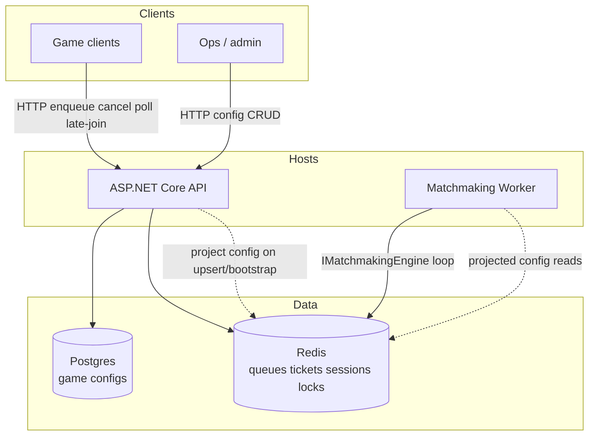


Yeni diaqram her layir doc ucun oz eskini tapmalidir ki bines oxuanda bilsin ki bu logic nece formalsib filan


Bəli. Bu əlavəni mən **mütləq edərdim**, hətta burada əvvəlki modeldən bir addım da irəli getmək olar.

Sənin istədiyin `docs/` artıq sadəcə “documentation” deyil. O, **layihənin insan üçün naviqasiya və əməliyyat xəritəsi** olmalıdır.

Əsas fikir:

> **AI `.sdd`-dən nə etməli olduğunu, insan isə `docs/`-dan sistemin necə işlədiyini və problem çıxanda kimin işləməli olduğunu anlamalıdır.**

---

# 1. `docs/`-u layer-lərə bölək

Mən belə struktur təklif edərdim:

```text
docs/
│
├── 00-about/
│   ├── project.md
│   ├── glossary.md
│   └── system-overview.md
│
├── 10-business/
│   ├── business-model.md
│   ├── business-rules.md
│   ├── domains/
│   └── workflows/
│
├── 20-architecture/
│   ├── overview.md
│   ├── decisions.md
│   ├── boundaries.md
│   ├── dependencies.md
│   └── diagrams/
│
├── 30-backend/
│   ├── overview.md
│   ├── modules/
│   ├── services/
│   ├── api/
│   └── diagrams/
│
├── 40-frontend/
│   ├── overview.md
│   ├── modules/
│   ├── state/
│   └── diagrams/
│
├── 50-mobile/
│   ├── overview.md
│   ├── android/
│   ├── ios/
│   └── diagrams/
│
├── 60-database/
│   ├── overview.md
│   ├── schema/
│   ├── migrations/
│   ├── indexing/
│   └── diagrams/
│
├── 70-api/
│   ├── overview.md
│   ├── contracts/
│   ├── authentication.md
│   └── diagrams/
│
├── 80-qa/
│   ├── strategy.md
│   ├── bdd/
│   ├── automation/
│   ├── ui/
│   ├── manual/
│   └── diagrams/
│
├── 90-security/
│   ├── overview.md
│   ├── threats.md
│   ├── policies.md
│   └── incidents/
│
├── 100-devops/
│   ├── overview.md
│   ├── docker/
│   ├── ci-cd/
│   ├── deployment/
│   ├── rollback/
│   └── diagrams/
│
├── 110-infrastructure/
│   ├── overview.md
│   ├── vps/
│   ├── aws/
│   ├── azure/
│   ├── gcp/
│   └── kubernetes/
│
├── 120-support/
│   ├── overview.md
│   ├── runbooks/
│   ├── troubleshooting/
│   ├── incidents/
│   └── faq/
│
└── 130-operations/
    ├── monitoring.md
    ├── alerting.md
    ├── sla.md
    └── disaster-recovery.md
```

Bu strukturda hər sənədin **owner-i də təbii olaraq görünür**.

---

# 2. Problem → hansı komanda?

Bu isə sənin çox yaxşı əlavə etdiyin fikirdir.

Məsələn production-da:

```text
Payment failed
```

AI və ya support sistemi əvvəlcə:

```text
Problem
 ↓
Domain
 ↓
Layer
 ↓
Owner
 ↓
Runbook
```

tapmalıdır.

Məsələn:

```text
Payment API 500
```

nəticə:

```text
Domain:
  Payment

Layer:
  API / Backend

Primary:
  Backend

Secondary:
  DevOps

Docs:
  docs/30-backend/api/
  docs/70-api/
  docs/120-support/troubleshooting/
```

Başqa:

```text
Database connection refused
```

→

```text
Primary:
  Infrastructure / DevOps

Secondary:
  Database

Runbook:
  docs/120-support/runbooks/database-down.md
```

---

# 3. Bunun üçün `Ownership Matrix` yaratmaq lazımdır

Məsələn:

```text
docs/00-about/ownership.md
```

```text
| Problem | Primary | Secondary | Runbook |
|---|---|---|---|
| API 500 | BE | DO | api-500 |
| UI broken | FE | QA | ui-failure |
| Mobile crash | MD | QA | mobile-crash |
| DB unavailable | DB | DO | database-down |
| Deployment fail | DO | BE | deployment-failure |
| Security issue | SEC | DO | security-incident |
| Business rule wrong | Product | BE | business-rule |
| Test failure | QA | Owner layer | test-failure |
```

Bu çox praktikdir.

---

# 4. Daha da yaxşısı: hər docs faylının `Owner` məlumatı olsun

Məsələn:

```md
# Payment Refund

Owner:
  Backend

Secondary:
  Database
  QA
  Security

Business:
  Payment

Related:
  @PAY/refund
  @DB/payment
  @API/refund
```

Human oxuyanda dərhal bilir:

> Bu mənim işimdir, yoxsa başqa komandanın?

---

# 5. Diagram məsələsində isə tamamilə səninlə razıyam

Amma bir qayda qoyardım:

> **Hər layer öz diagramını sıfırdan yaratmır. Mövcud diagram source-of-truth-dan derive olunur.**

Məsələn:

```text
docs/20-architecture/diagrams/system.md
```

ümumi architecture.

Sonra Backend:

```text
docs/30-backend/diagrams/payment.md
```

yalnız Backend-in maraqlandığı hissəni göstərir.

Frontend:

```text
docs/40-frontend/diagrams/payment-flow.md
```

Mobile:

```text
docs/50-mobile/diagrams/payment-flow.md
```

QA:

```text
docs/80-qa/diagrams/payment-test-flow.md
```

---

# 6. Sənin Mermaid nümunən çox yaxşıdır

Mən onu saxlayardım, amma bir az metadata əlavə edərdim:


Bu artıq insan üçün çox yaxşı architecture snapshot-dır.

---

# 7. Amma diagramın yuxarısında SDD reference saxlayardım

Məsələn:

```md
# Payment Architecture

Layer:
  ARCH

Owner:
  Backend

Related:
  @PAY
  @DB/payment
  @API/payment
  @DO/payment

Source:
  .sdd/project/flows.sdd

Generated:
  2026-08-20

Status:
  ✓ verified
```

sonra Mermaid.

Bu çox vacibdir.

AI görür:

```text
@PAY
```

və `.sdd/project/` modelinə gedə bilir.

İnsan isə diagramı oxuyur.

---

# 8. Diagramların da növləri olmalıdır

Mən sadəcə “architecture diagram” deməzdim.

Canonical diagram types:

```text
#CTX   Context
#ARCH  Architecture
#FLOW  Flow
#SEQ   Sequence
#DATA  Data model
#DEP   Dependency
#NET   Network
#DEPLOY Deployment
#CI    CI/CD
#OBS   Observability
#SEC   Security
#TEST  Test flow
```

Məsələn:

```text
#PAY
#ARCH
```

architecture diagram.

```text
#PAY
#FLOW
```

business flow.

```text
#PAY
#SEQ
```

request sequence.

---

# 9. Hər layer öz “view”sini yaradır

Məsələn ümumi sistem:

```text
Client
 ↓
API
 ↓
BE
 ↓
DB
```

Backend developer üçün:

```text
API
 ↓
Controller
 ↓
Service
 ↓
Repository
 ↓
DB
```

DevOps üçün:

```text
Internet
 ↓
Load Balancer
 ↓
Container
 ↓
Postgres
 ↓
Redis
```

QA üçün:

```text
BDD
 ↓
API Test
 ↓
UI Test
 ↓
Integration
 ↓
Regression
```

Business üçün:

```text
Student
 ↓
Course
 ↓
Payment
 ↓
Completion
 ↓
Teacher payout
```

**Eyni sistemdir. Sadəcə fərqli “view”dir.**

Bu çox güclü yanaşmadır.

---

# 10. Buna görə `.sdd/project/flows.sdd` birbaşa diagram deyil

Bu əvvəlki müzakirəmizdəki vacib düzəlişdir.

`flows.sdd`:

> **canonical relationship model**

olur.

Diagram isə:

> **view**

olur.

Yəni:

```text
.sdd/project/flows.sdd
        │
        ├── Business view
        ├── Backend view
        ├── Frontend view
        ├── Mobile view
        ├── QA view
        └── DevOps view
```

Bu daha düzgündür.

---

# 11. AI yeni kod yazanda diagramı da düşünməlidir

Məsələn BE-də:

```text
PaymentService
```

əlavə edildi.

AI yoxlayır:

```text
Impact:
  BE +
  API +
  DB +
  FE ?
  MD ?
  QA +
  DO ?
  DOC +
```

Əgər architecture relationship dəyişibsə:

```text
flows.sdd
```

də dəyişir.

Sonra:

```text
docs/20-architecture/...
docs/30-backend/...
docs/70-api/...
```

uyğun diagramları yeniləmək task-a çevrilir.

---

# 12. Documentation da `VR`-dan keçməlidir

Bu məncə mütləq qayda olmalıdır:

```text
Code changed
      ↓
Impact analysis
      ↓
Documentation impact
      ↓
Diagram impact
      ↓
Docs update
      ↓
VR
```

Əgər:

```text
source changed
```

amma:

```text
diagram stale
```

olarsa:

```text
VR !
```

---

# 13. “Stale documentation” ayrıca status olsun

```text
DOC+
DOC~
DOC!
```

Məsələn:

```text
Payment architecture
  status: ~
  reason: source changed
```

AI görəndə:

> Bu sənəd köhnəlib.

və bunu özü task-a çevirir.

---

# 14. Mən bir də `DOC INDEX` yaradardım

```text
docs/index.md
```

orada:

```text
Business
  ↓
Architecture
  ↓
Backend
  ↓
Frontend
  ↓
Mobile
  ↓
Database
  ↓
API
  ↓
QA
  ↓
Security
  ↓
DevOps
  ↓
Infrastructure
  ↓
Support
  ↓
Operations
```

və hər birinin:

```text
Owner
Purpose
Related domains
Related diagrams
Related runbooks
```

məlumatı olar.

İnsan layihəyə ilk daxil olanda **hara getməli olduğunu dərhal bilir.**

---

# 15. Ən güclü model: Problem → Documentation → Owner → Skill → Chain

Məsələn:

```text
PROBLEM
  ↓
"Payment timeout"
  ↓
DOC INDEX
  ↓
Payment
  ↓
API / Backend / Infrastructure
  ↓
OWNER
  ↓
BE + DO
  ↓
SKILLS
  ↓
#TIMEOUT
#API
#DB
#CACHE
#OBS
  ↓
CHAIN
  ↓
AR → BE → DB → DO → QA → VR
```

Bu artıq sənin dediyin:

> **“Problemin nə olduğunu görüb kim işləməlidir?”**

sualını avtomatik həll edir.

---

## Məncə burada son modelimiz artıq belə olmalıdır

```text
                    PROJECT
                       │
             ┌─────────┴─────────┐
             │                   │
        .sdd PROJECT             docs
             │                   │
        AI knowledge         Human knowledge
             │                   │
       Skills / Chains       Explanations
       Tasks / State         Diagrams
       Dependencies          Runbooks
       Impact                Ownership
             │                   │
             └─────────┬─────────┘
                       ↓
                     CODE
                       │
                       ↓
                    VERIFY
                       │
             ┌─────────┴─────────┐
             ↓                   ↓
           VALID               FAIL
             │                   │
           DONE              ROOT CAUSE
                                 │
                                 ↓
                           CORRECT OWNER
                                 │
                                 ↓
                              RE-CHAIN
```

**Bu yanaşmanı mən sənin sistemində əsas model kimi saxlayardım.**

Xüsusilə `docs` üçün üç şeyi standartlaşdırmaq lazımdır:

1. **Owner** — kim məsuldur?
2. **View** — hansı layer üçün göstərilir?
3. **Diagram** — həmin layer sistemi necə görür?

Beləliklə eyni architecture məlumatını 10 dəfə əl ilə yazmırıq; **bir canonical `.sdd` modelindən Business, BE, FE, MD, QA, DB, DO və Support view-ləri törəyir.** Bu həm sənədlərin şişməsinin, həm də bir-birindən fərqli diagramların yaranmasının qarşısını alır.


________________________________________________________________________________________________
daha neleri duzeltmek istyeirsen Human Seviyyede AI seviyyede SaveCost seviyyede ne ede bielrsen

Bəli. Məncə artıq `.sdd`-ni sadəcə **AI üçün task/spec sistemi** kimi yox, **3 səviyyəli engineering operating system** kimi qurmaq lazımdır:

```text
                 .sdd SYSTEM
                     │
        ┌────────────┼────────────┐
        ↓            ↓            ↓
      HUMAN          AI       TOKEN/COST
   Understanding  Execution   Optimization
```

Mən aşağıdakı düzəlişləri edərdim.

---

# 1. HUMAN səviyyəsi

Burada əsas prinsip:

> **İnsan bütün `.sdd`-ni oxumamalıdır. Lazım olan anda lazım olan məlumatı tapmalıdır.**

### 1.1. `docs/index.md` → xəritə

İnsan layihəyə girəndə:

```text
PROJECT
├── Business
├── Architecture
├── Backend
├── Frontend
├── Mobile
├── Database
├── API
├── QA
├── Security
├── DevOps
├── Infrastructure
├── Support
└── Operations
```

və hər birinin yanında:

```text
Owner
Status
Level
Last updated
Related systems
```

görməlidir.

---

# 2. Human üçün `WHY → WHAT → HOW → WHO`

Hər böyük modul üçün sənəd eyni struktura malik olsun:

```text
WHY
Niyə var?

WHAT
Nə edir?

HOW
Necə işləyir?

WHO
Kim məsuldur?

WHEN
Nə vaxt istifadə olunur?

FAILURE
Nə zaman və necə qırılır?

RECOVERY
Problem olanda nə edilməlidir?
```

Bu çox vacibdir.

Developer üçün:

```text
HOW
```

önəmlidir.

Business üçün:

```text
WHY / WHAT
```

Support üçün:

```text
FAILURE / RECOVERY
```

DevOps üçün:

```text
HOW / FAILURE / RECOVERY
```

---

# 3. `Audience` əlavə edərdim

Hər document:

```text
Audience:
  business
  developer
  qa
  devops
  support
```

deyə bilməlidir.

Məsələn:

```text
docs/120-support/runbooks/payment-timeout.md
```

üçün:

```text
Audience:
  support
  devops
  backend
```

Business sənədində isə:

```text
Audience:
  business
  product
```

Beləliklə AI insanın hansı sənədə ehtiyacı olduğunu da seçir.

---

# 4. Human üçün “one-page summary”

Hər böyük domain-in əvvəlində:

```text
PAYMENT
```

və yalnız:

```text
Purpose
Owner
Users
Inputs
Outputs
Dependencies
Main Flow
Failure modes
Current status
```

olmalıdır.

**10 səhifəlik document oxumağa ehtiyac yoxdur.**

---

# 5. AI səviyyəsi

Burada daha sərt dəyişiklik edərdim.

AI heç vaxt:

```text
.sdd/
```

altındakı hər şeyi oxumamalıdır.

Əvvəl:

```text
PROJECT
```

oxuyur.

Sonra:

```text
task
→ impact
→ chain
→ required skills
```

tapır.

Sonra yalnız bunları yükləyir.

---

# 6. `Progressive Context Loading`

Bu bizim əsas token-saving mexanizmimiz olsun.

```text
L0
PROJECT summary

        ↓

L1
relevant domain

        ↓

L2
relevant module

        ↓

L3
relevant skill

        ↓

L4
specific implementation rule

        ↓

L5
source/document/deep reference
```

AI əvvəlcədən 500 skill oxumur.

**Lazım olduqca dərinləşir.**

---

# 7. Skill-lərə “trigger” qoyaq

Məsələn:

```text
skills/database/indexing/
```

`skill.md`:

```text
Trigger:
  #INDEX
  #QUERY_SLOW
  #DB_PERF

UseWhen:
  query latency
  high DB CPU
  missing index
```

AI:

```text
"query 3 saniyə çəkir"
```

görəndə bütün DB skill-lərini axtarmır.

Birbaşa:

```text
#QUERY_SLOW
```

→ indexing/performance skill.

Bu həm sürətli, həm token-efficient-dir.

---

# 8. Skill-lərə `Don'tUseWhen`

Bu çox vacibdir.

```text
UseWhen:
  read query performance issue

Don'tUseWhen:
  write contention
  schema migration
  replication failure
```

Beləliklə AI yanlış skill-i də aktivləşdirmir.

---

# 9. Skill-lərin `parent → child` əlaqəsi

Məsələn:

```text
database
 └── performance
      ├── query
      ├── index
      ├── cache
      └── partition
```

AI:

```text
#QUERY_SLOW
```

görür.

Əvvəl:

```text
database/performance/query
```

oxuyur.

Əgər kifayət etmirsə:

```text
index
```

skill-i açır.

Sonra:

```text
partition
```

lazım olarsa açır.

---

# 10. Skill versioning

Sənin “skill köhnəlib, özünü yenilə” fikrin çox yaxşıdır.

Mən belə edərdim:

```text
skill:
  id: DB-INDEX

version:
  3

last_review:
  2026-08-10

status:
  active

review_after:
  2026-11-10
```

və:

```text
Evidence:
  PostgreSQL docs
  engineering findings
  production incidents
```

Amma burada AI **özbaşına skill-i dəyişməməlidir.**

AI:

```text
UPDATE_PROPOSAL
```

yaradır.

Human təsdiqləyir:

```text
ACCEPT
REJECT
```

---

# 11. `Evidence` sistemi

Skill:

```text
#CACHE
```

deyirsə:

> Redis istifadə et.

Bu kifayət deyil.

Belə olmalıdır:

```text
Pros:
  low latency
  shared state

Cons:
  operational complexity
  invalidation

UseWhen:
  ...

AvoidWhen:
  ...

Evidence:
  production incident #INC-021
  benchmark #BENCH-004
```

Bu AI-nin “best practice”i kor-koranə qəbul etməsinin qarşısını alır.

---

# 12. `Decision → Evidence → Result`

Hər qərar:

```text
Decision:
  Redis cache istifadə edildi.

Why:
  DB read pressure

Alternatives:
  local cache
  CDN
  Redis

Selected:
  Redis

Evidence:
  benchmark #BENCH-004

Result:
  DB load -42%
```

Beləliklə 6 ay sonra:

> Niyə Redis qoymuşduq?

sualı cavabsız qalmır.

---

# 13. `Reconsideration Trigger`

Bu daha güclüdür.

Məsələn:

```text
Decision:
  Redis

ReconsiderWhen:
  cache hit < 70%
  memory > 80%
  invalidation complexity ↑
```

AI gələcəkdə problem görəndə:

> Bu qərarın yenidən nəzərdən keçirilmə şərti yaranıb.

deyə bilər.

---

# 14. AI üçün `STOP RULE`

Çox vacibdir.

AI hər şeyi optimallaşdırmağa çalışmamalıdır.

Məsələn:

```text
DO NOT:
  redesign architecture
  introduce microservices
  add Kafka
  add Kubernetes
```

əgər project context tələb etmirsə.

Bu sənin əvvəl dediyin:

> “Kiçik layihəyə DDD + microservice gətirməsin”

problemini həll edir.

---

# 15. `Complexity Budget`

Bunu mütləq əlavə edərdim.

Project:

```text
Complexity:
  L1
```

deyirsə:

```text
Allowed:
  modular structure

Avoid:
  microservices
  event mesh
  Kubernetes
  CQRS
  distributed transactions
```

AI beləliklə:

> Mən bunu edə bilərəm, amma project complexity budget buna icazə vermir.

deyir.

---

# 16. Cost səviyyəsi

İndi ən maraqlı hissə.

AI üçün ayrıca:

```text
.sdd/protocol/cost.sdd
```

yaradardım.

Burada:

```text
C0
C1
C2
C3
```

kimi context cost səviyyələri ola bilər.

Məsələn:

```text
C0:
  symbols only

C1:
  project summary

C2:
  relevant module

C3:
  relevant skills

C4:
  implementation docs

C5:
  full deep analysis
```

Default:

```text
C0 → C1 → C2
```

və yalnız ehtiyac olduqda dərinləşir.

---

# 17. Token deyil, `Information Density`

Mən yalnız token sayına optimizasiya etməzdim.

Çünki çox qısa:

```text
AR
DB
BE
VR
```

insan üçün anlaşılmaz ola bilər.

Ona görə:

```text
AI:
  short keys

Human:
  expanded meaning
```

modeli saxlayardım.

Məsələn:

```text
AR
```

AI üçün:

```text
Analysis Required
```

Human docs-da:

```text
AR — Analysis Required
```

Beləliklə:

> **iş görən AI az oxuyur, işi idarə edən insan çox anlayır.**

Bu sənin sisteminin əsas fəlsəfəsi ola bilər.

---

# 18. `Symbol Registry`

Bütün qısa kodlar bir yerdə:

```text
.sdd/protocol/symbols.sdd
```

məsələn:

```text
AR = Analyze
DB = Database
BE = Backend
FE = Frontend
MD = Mobile
QA = Quality Assurance
DO = DevOps
VR = Verify

+ = affected
- = not affected
~ = pending
! = blocked
✓ = done
? = unknown
```

AI bunları bütün sistemdə eyni mənada istifadə edir.

---

# 19. State-ləri də standartlaşdırmaq

```text
~  pending
>  active
!  blocked
✓  done
×  failed
↻  retry
?  needs-decision
```

Məsələn:

```text
#PAY-042

BE >
QA ~
DO ?
VR ~
```

Bu insan üçün də oxunaqlıdır.

---

# 20. `Failure Routing`

Bu sənin sistemində ən vacib hissələrdən biridir.

Task:

```text
BE >
QA ×
```

AI:

```text
QA failure
```

görüb BE-yə kor-koranə qayıtmır.

Əvvəl:

```text
failure type
```

müəyyən edir:

```text
code defect
test defect
environment
data
architecture
requirement
```

sonra route edir.

Məsələn:

```text
QA ×
reason: API contract mismatch
```

→

```text
API
→ BE
```

Amma:

```text
QA ×
reason: test environment unavailable
```

→

```text
DO
```

---

# 21. Loop prevention

Bu sistemdə mütləq lazımdır.

```text
attempts:
  2/3
```

və:

```text
same_failure_count:
  2
```

olarsa:

```text
ESCALATE
```

AI sonsuz:

```text
code
→ test
→ code
→ test
→ code
```

loop-a girmir.

---

# 22. `Change Impact Graph`

Bu çox güclü olacaq.

Məsələn:

```text
Payment
 │
 ├── BE
 │    └── RefundService
 │
 ├── API
 │    └── /refund
 │
 ├── DB
 │    └── refunds
 │
 ├── FE
 │    └── RefundPage
 │
 ├── MD
 │    └── RefundScreen
 │
 └── QA
      └── refund.feature
```

`RefundService` dəyişdi.

AI avtomatik bilir:

```text
BE +
API +
DB ?
FE +
MD +
QA +
DOC +
```

Bu sənin “sabah kodu görəndə nə hara bağlıdır?” problemini həll edir.

---

# 23. `Source of Truth` qaydası

Bunu çox sərt qoyardım:

```text
Code
Business model
Architecture model
Documentation
Diagram
Task
```

bir-birinin kopyası olmamalıdır.

Hər məlumatın bir sahibi olmalıdır.

Məsələn:

```text
Business rule
→ business.sdd

Architecture dependency
→ flows.sdd

Implementation
→ code

Human explanation
→ docs

Work state
→ task.sdd
```

Docs `.sdd`-ni kopyalamır.

Diagram architecture modelini kopyalamır.

Bu çox böyük maintenance qənaətidir.

---

# 24. `Drift Detection`

AI periodik olaraq:

```text
CODE
vs
SDD
vs
DOC
vs
DIAGRAM
```

müqayisə edir.

Nəticə:

```text
✓ synchronized

və ya

!
documentation drift

!
architecture drift

!
task drift
```

Bu məncə sistemin ən dəyərli xüsusiyyətlərindən biri olar.

---

# 25. `Project Health`

Sonda:

```text
.sdd/state/health.sdd
```

kimi:

```text
Architecture   ✓
Business       ✓
Backend        ✓
Frontend       ✓
Mobile         ~
Database       ✓
QA             !
Security       ✓
DevOps         ✓
Docs           ~
Drift          !
```

və:

```text
Overall:
  82%
```

Amma bu sadəcə faiz olmamalıdır.

AI:

```text
Top risks:
1. Mobile docs stale
2. QA automation missing
3. Redis decision requires review
```

deməlidir.

---

# 26. Mən əlavə olaraq `Risk Register` yaradardım

```text
.sdd/project/risks.sdd
```

Məsələn:

```text
#RISK-004

Area:
  Database

Risk:
  PostgreSQL becomes bottleneck

Probability:
  medium

Impact:
  high

Trigger:
  CPU > 75%

Mitigation:
  indexing
  caching
  read replica

Owner:
  DB / DO
```

AI architecture qurarkən bunu nəzərə alır.

---

# 27. `Capacity assumptions`

Sənin 1M DAU məsələn üçün də:

```text
Scale:
  DAU: 1M
  MAU: 4M
  peak RPS: 8k
  data growth: 200GB/month
```

olmalıdır.

AI architecture seçəndə:

```text
1M DAU
```

görüb L1 architecture seçməməlidir.

---

# 28. `Non-functional requirements`

Bunu ayrıca skill kimi yox, project constraint kimi saxlayardım:

```text
NFR:

Latency:
  p95 < 300ms

Availability:
  99.9%

Security:
  OWASP baseline

Recovery:
  RPO 15m
  RTO 1h
```

AI architecture və DevOps qərarlarını buna görə verir.

---

# 29. Mən sonda 5 əsas “engine” edərdim

Sənin `.sdd` sisteminin daxilində məntiqi olaraq:

```text
┌───────────────────────────┐
│       SDD ENGINE          │
├───────────────────────────┤
│ 1. Context Engine         │
│ 2. Skill Engine           │
│ 3. Chain Engine            │
│ 4. Impact Engine           │
│ 5. Verification Engine    │
└───────────────────────────┘
```

və əlavə:

```text
Cost Engine
Drift Engine
Decision Engine
Risk Engine
```

---

# 30. Mənim ən vacib dəyişikliklərim

Əgər prioritetləşdirsəm:

### 🔴 Mütləq əlavə edərdim

1. **Source of Truth**
2. **Impact Graph**
3. **Failure Routing**
4. **Loop Prevention**
5. **Progressive Context Loading**
6. **Skill Trigger System**
7. **L0-L5 + Complexity Budget**
8. **Decision + Evidence**
9. **Documentation Ownership**
10. **Documentation Drift**
11. **Architecture/Business/Code synchronization**
12. **Project Health**
13. **Risk Register**
14. **NFR / Scale constraints**
15. **Standard symbols**

### 🟡 Sonrakı mərhələ

16. Skill versioning
17. Skill update proposals
18. Benchmark evidence
19. Incident → skill feedback
20. Automated diagram generation
21. Capacity analysis
22. Architecture alternatives comparison

---

## Və ən əsas fəlsəfə

Mən sənin sistemini belə adlandırardım:

> **Human-readable outside, machine-optimized inside.**

Yəni:

```text
             HUMAN
               │
        ┌──────┴──────┐
        │    docs     │
        │   diagrams  │
        │  runbooks   │
        │  decisions  │
        └──────┬──────┘
               │
             .sdd
               │
        ┌──────┴──────┐
        │ AI CONTEXT  │
        │   ENGINE    │
        └──────┬──────┘
               │
       minimal context
               │
        ┌──────┴──────┐
        │    CODE     │
        │    TEST     │
        │   DEPLOY    │
        │   VERIFY    │
        └─────────────┘
```

**Human çox məlumat görür, AI isə yalnız qərar üçün lazım olan məlumatı görür.**

Və məncə ən böyük token qənaəti `AR`, `BE`, `QA` kimi qısaltmalardan yox, **AI-nin lazımsız `.sdd` fayllarını heç vaxt oxumamasından** gələcək. Bu, qısaltmadan qat-qat böyük qənaətdir.

Bundan sonra məncə artıq strukturun özünü dəyişmək yox, **`.sdd` Architecture v1 üçün 10–15 fundamental qaydanı dondurmaq** lazımdır. Ondan sonra qovluqları/faylları həmin qaydalardan törətmək daha düzgün olacaq.


________________________________________________________________________________________________
esas derd Security onun da dizayni olmalidir qa test kecdi SC -Security testden kecmelidir pentest edilmelidir load test edilib ddos atacina meruz qaldiqda ne etmelidir bu halalrida elave ederdim skille yeni bir sirket kimi ozunu dusun butun Pros Cons idare eden bir ai kimi ozunu fikirles


Tam olaraq. Burada mən bir düzəliş edərdim: **Security-ni ayrıca bir skill qovluğu kimi saxlamaq kifayət deyil.** Security bütün lifecycle-ın içindən keçən **cross-cutting gate** olmalıdır.

Sistemi bir şirkət kimi düşünsək, AI təkcə developer deyil:

```text
PRODUCT
ARCHITECT
BE
FE
MD
DB
API
QA
SECURITY
DEVOPS
SRE
SUPPORT
```

və bunların hamısının üzərində:

```text
                GOVERNANCE
                    │
       ┌────────────┼────────────┐
       ↓            ↓            ↓
    QUALITY      SECURITY      RISK
       │            │            │
       └────────────┼────────────┘
                    ↓
                  VERIFY
```

## 1. Security `chain` yox, `gate` də olmalıdır

Sənin əvvəlki chain-in:

```text
AR → DB → BE → FE → MD → QA → DO → VR
```

ola bilər.

Amma Security belə ayrıca paralel işləməlidir:

```text
                 AR
                 │
          ┌──────┴──────┐
          ↓             ↓
       DESIGN          SECURITY
          │             │
          ↓             ↓
        DB/BE/FE/MD   SCAN/THREAT
          │             │
          └──────┬──────┘
                 ↓
                QA
                 ↓
              SEC TEST
                 ↓
              PENTEST
                 ↓
              LOAD TEST
                 ↓
                DO
                 ↓
                VR
```

Yəni:

> **QA keçdi ≠ Security keçdi.**

---

# 2. Security lifecycle

Mən `.sdd/skills/security/` daxilində belə bir model qurardım:

```text
security/
├── design/
│   ├── threat-modeling/
│   ├── trust-boundary/
│   ├── attack-surface/
│   └── secure-architecture/
│
├── application/
│   ├── authentication/
│   ├── authorization/
│   ├── session/
│   ├── input-validation/
│   ├── injection/
│   ├── csrf/
│   ├── ssrf/
│   └── business-logic/
│
├── api/
│   ├── api-security/
│   ├── rate-limit/
│   ├── abuse-prevention/
│   └── api-fuzzing/
│
├── database/
│   ├── access/
│   ├── encryption/
│   ├── secrets/
│   └── backup/
│
├── infrastructure/
│   ├── network/
│   ├── firewall/
│   ├── iam/
│   ├── container/
│   └── cloud/
│
├── supply-chain/
│   ├── dependencies/
│   ├── images/
│   ├── sbom/
│   └── signing/
│
├── testing/
│   ├── sast/
│   ├── dast/
│   ├── dependency-scan/
│   ├── container-scan/
│   ├── api-security/
│   ├── penetration-test/
│   ├── fuzz-test/
│   └── load-security/
│
├── incident/
│   ├── ddos/
│   ├── breach/
│   ├── credential-leak/
│   ├── ransomware/
│   └── data-leak/
│
└── compliance/
```

---

# 3. `SC` qısa açarını əlavə edərdim

Sənin:

```text
BE
FE
MD
QA
DO
VR
```

sisteminə:

```text
SC = Security
```

əlavə edək.

Amma burada bir fərq var.

`QA` bir stage ola bilər.

`SC` isə **cross-cutting domain + gate**.

---

# 4. Feature chain nümunəsi

Payment refund:

```text
AR
 ↓
DB
 ↓
BE
 ↓
API
 ↓
FE
 ↓
MD
 ↓
QA
 ↓
SC
 ↓
DO
 ↓
VR
```

Amma SC içəridə:

```text
SC
├── threat model
├── SAST
├── dependency scan
├── API security
├── auth/permission test
├── abuse test
├── DAST
├── penetration test
└── security review
```

---

# 5. Security risk-lə başlamalıdır

AI kod yazmağa keçməzdən əvvəl:

```text
Feature
 ↓
Attack Surface
 ↓
Threat Model
 ↓
Security Requirements
```

çıxarmalıdır.

Məsələn:

```text
Refund API

Assets:
  money
  transaction
  user identity

Threats:
  double refund
  unauthorized refund
  replay
  race condition
  parameter tampering
```

Sonra development.

Bu çox vacibdir:

> **Security test sonradan əlavə olunan mərhələ olmamalıdır.**

---

# 6. Security Acceptance Criteria

Task:

```text
#PAY-042
```

üçün:

```text
Security:
  [ ] unauthorized refund blocked
  [ ] duplicate refund blocked
  [ ] replay blocked
  [ ] rate limit enforced
  [ ] audit trail exists
  [ ] secrets not exposed
```

və:

```text
SC:
  ~
```

QA:

```text
QA:
  ✓
```

SC:

```text
SC:
  !
```

olarsa:

```text
VR:
  blocked
```

---

# 7. Security severity standardı

Bütün project-də eyni vocabulary istifadə edək:

```text
INFO
LOW
MEDIUM
HIGH
CRITICAL
```

və state:

```text
OPEN
MITIGATED
ACCEPTED
FALSE_POSITIVE
RESOLVED
VERIFIED
```

Məsələn:

```text
#SEC-004

Severity:
  CRITICAL

Status:
  OPEN

Area:
  Payment

Finding:
  Double refund

Owner:
  BE

Required:
  fix + security-test + verify
```

---

# 8. `Security cannot be bypassed`

Çox vacib qayda:

```text
QA ✓
BE ✓
FE ✓
DO ✓
SC !
VR
```

nəticə:

```text
VR = BLOCKED
```

AI:

> Security critical finding unresolved olduğu üçün release edilə bilməz.

Bu governance səviyyəsidir.

---

# 9. Pentest ayrıca mərhələdir

Mən:

```text
SC
```

altında:

```text
SEC-TEST
PENTEST
```

ayırardım.

Məsələn:

```text
SC
 ↓
Automated Security Tests
 ↓
Manual Security Review
 ↓
Pentest
 ↓
Remediation
 ↓
Retest
```

Pentest nəticəsi:

```text
PENTEST-2026-004
```

və findings:

```text
SEC-101
SEC-102
SEC-103
```

ola bilər.

---

# 10. Load test + Security birləşməlidir

Sənin dediyin çox vacibdir.

Adi load test:

```text
10k requests
```

amma security:

```text
10k malicious requests
```

fərqlidir.

Ona görə:

```text
QA
├── Functional
├── Load
├── Stress
└── Reliability

SC
├── Abuse
├── Rate-limit
├── Resource exhaustion
├── DDoS resilience
└── Attack simulation
```

olmalıdır.

---

# 11. DDoS ayrıca `incident flow`

Burada AI-nin “DDoS gəldi, kodu dəyiş” deməsi düzgün deyil.

Chain:

```text
DETECTION
 ↓
CLASSIFY
 ↓
CONTAIN
 ↓
MITIGATE
 ↓
VERIFY
 ↓
RECOVER
 ↓
POST-INCIDENT
```

Məsələn:

```text
DDoS detected
 ↓
CDN/WAF
 ↓
Rate limiting
 ↓
Traffic filtering
 ↓
Origin protection
 ↓
Scale / isolate
 ↓
Monitor
 ↓
Recovery
```

Sonra:

```text
RCA
 ↓
architecture improvement
 ↓
skill improvement
```

---

# 12. DDoS üçün Runbook

Human üçün:

```text
docs/120-support/runbooks/ddos.md
```

orada:

```text
Detection
Indicators
Who owns incident
Immediate actions
Escalation
Provider contacts
Mitigation
Verification
Recovery
Postmortem
```

olmalıdır.

AI `.sdd` isə sadəcə:

```text
#DDoS
owner: DO
secondary: SEC
runbook: ddos
severity: CRITICAL
```

deyə bilər.

---

# 13. `Security Architecture Diagram`

Sənin istədiyin diagram məsələsində bunu da əlavə edərdim:

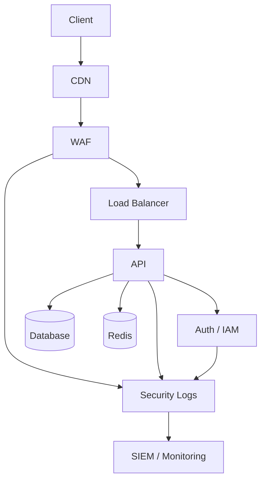

Amma bununla kifayətlənməyək.

Security üçün ayrıca:

```text
#THREAT
#TRUST
#ATTACK
#DATA
#NETWORK
#IAM
```

diagram view-ləri olsun.

---

# 14. Trust Boundary diagram

Məsələn:

```text
Internet
   │
 ╔═╧══════════════╗
 ║ Untrusted      ║
 ║                ║
 ║ CDN / WAF      ║
 ╚══════╤═════════╝
        │
 ╔══════╧═════════╗
 ║ Application    ║
 ║                ║
 ║ API / Workers  ║
 ╚══════╤═════════╝
        │
 ╔══════╧═════════╗
 ║ Trusted Data   ║
 ║                ║
 ║ DB / Secrets   ║
 ╚════════════════╝
```

AI security analysis zamanı trust boundary-ni görə bilər.

---

# 15. Supply-chain security-ni də unutmayaq

Sənin Laravel `vendor` məsələnə görə bu xüsusilə vacibdir.

AI:

```text
source
 ↓
dependencies
 ↓
package manager
 ↓
container image
 ↓
registry
 ↓
deployment
```

hamısını security chain-ə salmalıdır.

Məsələn:

```text
SCA
SBOM
dependency vulnerability
container scan
image signing
secret scan
license check
```

---

# 16. Container üçün ayrıca security gate

Docker istifadə edirsənsə:

```text
Dockerfile
 ↓
Build
 ↓
SAST
 ↓
Dependency Scan
 ↓
Image Scan
 ↓
SBOM
 ↓
Sign
 ↓
Registry
 ↓
Deploy
```

AI bunu project stack-ə görə avtomatik aktivləşdirir.

---

# 17. Secret management

Kodda:

```text
PASSWORD=
API_KEY=
TOKEN=
```

görülürsə:

```text
SC !
```

və:

```text
secret-management skill
```

aktivləşir.

Project AWS-dirsə:

```text
AWS secret strategy
```

VPS-dirsə başqa strategy.

Yəni skill:

```text
security/secrets
```

olur, provider-specific implementation ayrıca.

---

# 18. Security + Business Logic

Bunu xüsusi vurğulayıram.

Ən təhlükəli səhvlər bəzən:

```text
SQL injection
```

deyil.

Business logic:

```text
refund twice
coupon reuse
balance manipulation
permission escalation
price manipulation
race condition
```

ola bilər.

Ona görə:

```text
security/business-logic
```

ayrıca skill olmalıdır.

---

# 19. Security Risk Budget

Project-in:

```text
.sdd/project/security.sdd
```

olmalıdır:

```text
SecurityLevel:
  L3

RiskTolerance:
  low

CriticalAllowed:
  false

HighAllowed:
  false

PentestRequired:
  true

ExternalExposure:
  public
```

AI buna görə security depth seçir.

Internal tool isə:

```text
L1
```

ola bilər.

---

# 20. Pros / Cons bütün qərarlara tətbiq edilməlidir

Məsələn DDoS protection:

```text
Cloudflare
```

AI sadəcə:

> istifadə et

deməməlidir.

```text
Pros:
  global edge
  DDoS protection
  WAF

Cons:
  vendor dependency
  cost
  architecture coupling
```

Alternativ:

```text
AWS Shield
```

və s.

Sonra:

```text
Project:
  AWS
```

olduğuna görə uyğunluğu qiymətləndirir.

---

# 21. Security maturity də L0-L5 olsun

Məsələn:

```text
L0
basic security

L1
auth + validation + secrets

L2
SAST + dependency + security tests

L3
threat model + DAST + pentest

L4
continuous security + SIEM + incident response

L5
continuous adversarial security + advanced detection
```

Amma yenə:

> **L5 həmişə lazım deyil.**

---

# 22. Mən bütün sistemi artıq belə görürəm

```text
                    PRODUCT
                       │
                       ↓
                  ARCHITECTURE
                       │
             ┌─────────┴─────────┐
             ↓                   ↓
         ENGINEERING          SECURITY
             │                   │
      ┌──────┼──────┐       ┌────┼─────┐
      BE     FE     MD      SAST  DAST  PENTEST
      │      │      │        │     │      │
      └──────┼──────┘        └─────┼──────┘
             ↓                     ↓
             DB ←──── API ─────────┘
             │
             ↓
             QA
             │
             ├── Unit
             ├── Integration
             ├── E2E
             ├── Load
             └── Regression
             │
             ↓
             DO
             │
             ├── Deploy
             ├── Monitor
             ├── Backup
             └── Incident
             │
             ↓
             VR
```

---

# 23. Amma ən vacibi: `Security` bütün sistemə feedback verməlidir

Məsələn pentest:

```text
SEC-021
```

tapdı:

> authorization bypass.

Bu sadəcə bug fix task deyil.

AI baxmalıdır:

```text
SEC finding
 ↓
code fix
 ↓
test
 ↓
architecture?
 ↓
skill?
 ↓
documentation?
 ↓
other modules?
 ↓
similar vulnerability?
```

Əgər eyni pattern 5 yerdə varsa:

```text
SEC-021
SEC-022
SEC-023
SEC-024
SEC-025
```

AI deməlidir:

> Bu artıq individual bug deyil. Shared engineering pattern problemidir.

və:

```text
skill improvement
+
architecture improvement
+
global scan
```

yaratmalıdır.

**Məncə sənin “AI şirkət kimi düşünməlidir” dediyin yer məhz buradır.**

---

## Son olaraq `.sdd`-nin əsas prinsipini belə yazardım

```text
.sdd = Engineering Governance System

It must know:

WHAT
  are we building?

WHY
  are we building it?

HOW
  should it be built?

WHO
  owns each responsibility?

RISK
  what can go wrong?

SECURITY
  how can it be attacked?

QUALITY
  how do we prove it works?

OPERATIONS
  how do we run it?

FAILURE
  where do we go when it breaks?

COST
  how much context/complexity are we spending?

DRIFT
  is reality still aligned with our model?

VERIFY
  can we safely call it done?
```

Və ən əsas qayda:

> **`DONE` yalnız kod yazılıb test keçəndə deyil; Business → Architecture → Code → QA → Security → Infrastructure → Documentation → Verification zəncirində bütün tələb olunan gate-lər keçəndə `DONE` olur.**

Bu yanaşma ilə `.sdd` artıq “AI-yə kod yazdırmaq üçün prompt sistemi” yox, **Product + Engineering + QA + Security + DevOps + Operations üçün vahid idarəetmə sistemi** olur.


________________________________________________________________________________________________
indi men bunlari bir agentin absa duseceyi sistem kimi qurmaq isteyirem onda ne ede bilerem yeni sabah bu menim git repomda olmaldir men onu node uzerinde ne ise uzerinden elde edirem ve bu elede edilmis qovluq avotatmtik menim lahiyyemde yerlesir ve buna esasen agent o qovluqu oxuyub islemye baslayir


Bəli. İndi artıq məqsəd aydındır: sən `.sdd`-ni **folder structure yox, Git repository-də işləyən Agent Protocol** etmək istəyirsən.

Mən bunu Node.js-də ayrıca bir **`sdd-agent` CLI/tool** kimi qurardım. Amma agentin özü `.sdd`-nin içində yaşamamalıdır. `.sdd` layihənin **idarəetmə yaddaşı**, agent isə onu oxuyan **icra mühərriki** olmalıdır.

## 1. Arxitekturanı belə qurardım

```text
your-project/
│
├── .sdd/                    ← Agent-in source of truth
│   ├── PROJECT.sdd
│   ├── protocol/
│   ├── skills/
│   ├── project/
│   ├── tasks/
│   ├── decisions/
│   ├── flows/
│   ├── security/
│   └── state/
│
├── docs/                    ← Human documentation
│
├── BE/
├── FE/
├── MD/
├── tests/
├── infra/
│
└── ...
```

Agent isə ayrıca:

```text
sdd-agent/
├── src/
│   ├── cli/
│   ├── loader/
│   ├── parser/
│   ├── context/
│   ├── planner/
│   ├── chain/
│   ├── router/
│   ├── verifier/
│   ├── security/
│   └── git/
│
├── package.json
└── README.md
```

Yəni:

```text
.sdd
  ↓
SDD Agent
  ↓
Project
```

---

# 2. Əsas istifadə təcrübəsi

Sən yeni layihədə:

```bash
npx sdd-agent init
```

deyirsən.

Agent avtomatik:

```text
.sdd/
docs/
```

strukturunu yaradır.

Sonra:

```bash
sdd analyze
```

deyirsən.

Agent:

```text
.sdd/
     ↓
PROJECT.sdd
     ↓
protocol
     ↓
skills
     ↓
project model
     ↓
existing source code
     ↓
architecture
     ↓
security
     ↓
QA
     ↓
DevOps
```

analiz edir.

---

# 3. Ən vacib məsələ

Sənin dediyin:

> “Mən `.sdd` qovluğunu əlavə etmişəm, sadəcə `layihəmi analiz et` deyirəm.”

Bu ayrıca command olmalıdır:

```bash
sdd analyze
```

və ya agentə:

```text
Analyze this project.
```

deyəndə agent bunu başa düşməlidir.

Bu zaman **kod yazmır**.

Əvvəl:

```text
DISCOVERY
```

rejiminə keçir.

---

# 4. Discovery mərhələsi

Agent əvvəl:

```text
.sdd/
```

oxuyur.

Sonra layihənin özünü:

```text
BE/
FE/
MD/
DB/
infra/
tests/
...
```

araşdırır.

Amma bütün repository-ni LLM-ə göndərmir.

Bu çox vacibdir.

Node agent:

```text
filesystem
git
AST
package managers
docker
config
```

vasitəsilə project haqqında struktur çıxarır.

Məsələn:

```text
BE:
  Go

FE:
  React + TypeScript

MD:
  React Native

DB:
  PostgreSQL

Infra:
  Docker

CI:
  GitHub Actions
```

Sonra yalnız relevant faylları AI context-ə verir.

---

# 5. Node.js burada nə edir?

Node **AI deyil**.

Node agent orchestration layer-dir.

```text
              SDD AGENT
                  │
       ┌──────────┼──────────┐
       ↓          ↓          ↓
   Filesystem     Git       Parser
       │          │          │
       └──────────┼──────────┘
                  ↓
              Context
                  ↓
               LLM
                  ↓
             Decision
                  ↓
       ┌──────────┼──────────┐
       ↓          ↓          ↓
     Task       Code       Verify
```

---

# 6. Mən Node-da `AI SDK` üzərində qurardım

Agentin model provider-dan asılı olmaması yaxşıdır.

Məsələn:

```text
SDD Agent
   │
   └── LLM Adapter
        ├── OpenAI
        ├── Anthropic
        ├── Gemini
        └── Local model
```

Beləliklə `.sdd` formatı AI modelindən asılı olmur.

---

# 7. Agent üçün əsas command-lar

Mən başlanğıcda çox command yaratmazdım.

Yalnız:

```bash
sdd init
sdd analyze
sdd plan
sdd work
sdd verify
sdd status
```

### `init`

```text
create .sdd
```

### `analyze`

```text
understand project
```

### `plan`

```text
prompt → tasks → chains
```

### `work`

```text
execute task
```

### `verify`

```text
QA + SC + DO + architecture
```

### `status`

```text
project health
```

---

# 8. `sdd work` adi coding agent kimi olmamalıdır

Məsələn:

```bash
sdd work
```

Agent görür:

```text
PAY-042
```

və sadəcə:

```text
write code
```

etmir.

Chain-i açır:

```text
AR
↓
DB
↓
BE
↓
API
↓
FE
↓
MD
↓
QA
↓
SC
↓
DO
↓
VR
```

və project-də hansı stage-in hazır olduğunu müəyyən edir.

Məsələn:

```text
AR ✓
DB ✓
BE >
API ~
FE ~
MD -
QA -
SC -
DO -
VR -
```

Deməli BE-dən başlayır.

---

# 9. `.sdd` Agent-in “memory” sistemidir

Burada çox vacib distinction var:

### `.sdd`

AI üçün:

```text
compressed operational knowledge
```

### `docs/`

Human üçün:

```text
expanded explanation
```

### Source code

Real implementation.

Belə:

```text
           .sdd
            │
     "what / why / flow"
            │
            ↓
          CODE
            │
            ↓
          TEST
            │
            ↓
          VERIFY
```

---

# 10. Agent source code-u dəyişəndə `.sdd` də dəyişməlidir

Məsələn:

```text
BE/internal/payment/refund.go
```

də böyük dəyişiklik etdi.

Agent yoxlamalıdır:

```text
Does this change architecture?
Does this change API?
Does this change DB?
Does this change security?
Does this change docs?
Does this change task?
```

Əgər:

```text
yes
```

onda corresponding `.sdd` update task yaranır.

Bu **drift detection**-dır.

---

# 11. Ən yaxşı hissə: Git integration

Agent Git-i də bilməlidir.

Məsələn:

```bash
git diff
```

oxuyur.

Sonra:

```text
Changed:
  BE/internal/payment/refund.go

Impact:
  Payment
  Refund API
  DB transaction
  QA refund tests
  Security idempotency
```

çıxarır.

Beləliklə agent bütün project-i yenidən oxumur.

---

# 12. Commit də SDD-aware ola bilər

Məsələn:

```bash
git commit
```

əvəzinə agent:

```text
PAY-042
SC-004
QA-119
```

ilə əlaqələndirə bilər.

Commit:

```text
feat(payment): prevent duplicate refunds

SDD: PAY-042
```

Bu sonradan debugging üçün çox dəyərlidir.

---

# 13. Git hook əlavə edə bilərik

`init` zamanı:

```text
.sdd/hooks/
```

yarada bilər.

və Git hook:

```text
pre-commit
pre-push
```

ilə:

```text
SDD consistency
tests
security
task state
```

yoxlaya bilər.

Məsələn:

```text
git push
   ↓
SDD check
   ↓
QA check
   ↓
Security check
   ↓
Architecture check
   ↓
push
```

---

# 14. CI/CD də `.sdd`-ni oxusun

GitHub Actions:

```text
PR
 ↓
SDD validation
 ↓
lint
 ↓
unit test
 ↓
integration
 ↓
security
 ↓
build
 ↓
container scan
 ↓
deploy
 ↓
verify
```

Beləliklə `.sdd` sadəcə developer laptopunda qalmır.

---

# 15. `sdd doctor` əlavə edərdim

Çox faydalı olacaq:

```bash
sdd doctor
```

çıxışı:

```text
SDD Health

✓ PROJECT.sdd
✓ protocol
✓ skills
✓ architecture
✓ task registry
✓ chain registry

! 3 stale skills
! 2 undocumented modules
! 1 architecture drift
! 1 unresolved security finding

Health: 86%
```

---

# 16. Agentin özü `.sdd`-ni dəyişməməlidir

Bunu da qaydaya salardım.

Agent:

```text
CODE CHANGE
```

edə bilər.

Amma:

```text
ARCHITECTURE CHANGE
SECURITY POLICY CHANGE
GLOBAL SKILL CHANGE
DECISION CHANGE
```

üçün:

```text
PROPOSAL
```

yaratmalıdır.

Məsələn:

```text
.sdd/proposals/PROP-019.sdd
```

Human:

```text
ACCEPT
```

edəndən sonra apply olunur.

Bu çox vacib governance mexanizmidir.

---

# 17. Sənin “AI şirkət kimi düşünsün” istəyinin Node tərəfi

Mən bunu agent daxilində role-based engine edərdim:

```text
Agent
 │
 ├── Product Analyst
 ├── Architect
 ├── Backend Engineer
 ├── Frontend Engineer
 ├── Mobile Engineer
 ├── QA Engineer
 ├── Security Engineer
 ├── Database Engineer
 ├── DevOps Engineer
 ├── SRE
 └── Reviewer
```

Amma **11 ayrı agent yaratmaq məcburi deyil**.

Bir orchestrator bunları context/role kimi çağırır.

Bu həm daha ucuz, həm idarəolunan olur.

---

# 18. Əsas orchestrator

Məsələn daxildə:

```text
REQUEST
   ↓
CLASSIFY
   ↓
DISCOVER
   ↓
IMPACT
   ↓
PLAN
   ↓
CHAIN
   ↓
EXECUTE
   ↓
TEST
   ↓
SECURITY
   ↓
INFRA
   ↓
VERIFY
   ↓
UPDATE SDD
   ↓
DONE
```

Əgər failure:

```text
FAIL
 ↓
CLASSIFY FAILURE
 ↓
ROUTE OWNER
 ↓
RETRY ≤ N
 ↓
VERIFY
```

Əgər yenə failure:

```text
ESCALATE
```

---

# 19. Mən repo üçün belə package strukturunu seçərdim

```text
sdd-agent/
├── packages/
│
│   ├── core/
│   │   ├── parser
│   │   ├── schema
│   │   ├── state
│   │   └── protocol
│   │
│   ├── discovery/
│   │   ├── filesystem
│   │   ├── git
│   │   ├── ast
│   │   └── project-detector
│   │
│   ├── intelligence/
│   │   ├── context
│   │   ├── planner
│   │   ├── router
│   │   ├── chain
│   │   └── impact
│   │
│   ├── security/
│   │   ├── threat
│   │   ├── scan
│   │   └── gates
│   │
│   ├── verification/
│   │   ├── qa
│   │   ├── architecture
│   │   └── drift
│   │
│   └── cli/
│       └── commands
│
├── templates/
│   └── .sdd/
│
└── package.json
```

---

# 20. Amma sənə ən vacib məsləhətim

**İlk mərhələdə AI agenti yazmağa başlamayaq.**

Əvvəl:

```text
.sdd specification
```

tam dondurulmalıdır.

Çünki:

```text
BAD PROTOCOL
     ↓
GOOD AGENT
     ↓
BAD SYSTEM
```

Agent sadəcə sənin qaydalarını icra edəcək.

Ona görə mən bunu **3 mərhələdə** qurardım:

### Phase 1 — Protocol

```text
.sdd/
skills/
chains/
symbols/
tasks/
project/
security/
verification/
```

Formatlar, state-lər, routing, dependency, gates.

### Phase 2 — Engine

Node.js:

```text
parser
loader
context engine
chain engine
router
validator
```

### Phase 3 — AI Agent

```text
LLM
↓
reasoning
↓
tool execution
↓
code
↓
tests
↓
security
↓
verify
```

---

## Və sənin üçün ən düzgün başlanğıc

Sən hazırda **`.sdd` qovluğunun arxitekturasını qurursan**. Məncə bu mərhələdə Node.js koduna keçmək tezdir.

İndi növbəti iş:

```text
.sdd/
```

üçün **rəsmi Architecture v1** hazırlamaqdır.

Orada əvvəlcə yalnız bunları donduraq:

```text
01 PROJECT
02 PROTOCOL
03 SYMBOLS
04 SKILLS
05 PROJECT MODEL
06 FLOWS / CHAINS
07 TASKS
08 DECISIONS
09 SECURITY
10 VERIFICATION
11 STATE
12 DOCS CONTRACT
13 COST / CONTEXT
14 DRIFT
15 RISK
```

Sonra **hər qovluğun nə iş gördüyünü, hansı faylların məcburi olduğunu və AI-nin hansı ardıcıllıqla oxuyacağını** bir-bir müəyyən edək.

Bunu etdikdən sonra Node `sdd-agent` artıq çox sadə olacaq: **`.sdd` protocolunu parse edən və həmin protocol əsasında Git repository-ni idarə edən orchestration engine.**


________________________________________________________________________________________________
aha davam etsek bunlari phrasa uzre zip formatinda vere bielrsen?

Bəli. Hətta məncə **mərhələ-mərhələ ZIP** vermək bu layihə üçün ən düzgün yanaşmadır.

Belə gedək:

```text
PHASE 01
.sdd Architecture v1
        ↓
PHASE 02
Protocol + Symbols
        ↓
PHASE 03
Skills system
        ↓
PHASE 04
Project model
        ↓
PHASE 05
Flows / Chains
        ↓
PHASE 06
Tasks + State
        ↓
PHASE 07
Security system
        ↓
PHASE 08
QA + Verification
        ↓
PHASE 09
Docs system
        ↓
PHASE 10
Cost / Context engine
        ↓
PHASE 11
Drift / Risk / Decisions
        ↓
PHASE 12
Node.js SDD Agent
        ↓
PHASE 13
Git / CI/CD integration
        ↓
PHASE 14
End-to-end Agent
```

Hər phase-in sonunda sənə:

```text
.sdd/
├── ...
└── ...
```

hazır vəziyyətdə **ZIP** verə bilərəm.

Amma bir qaydanı qoruyardım:

> **Sən “next” dedikcə növbəti phase-ə keçirik; əvvəlki architecture qaydalarını özbaşına dəyişmirəm.** Əgər yeni fikir əvvəlki qaydanı pozursa, əvvəlcə onu sənə göstərib qərar veririk.

### Phase 01-də nə verəcəyəm

İlk ZIP yalnız `.sdd` skeleton olacaq:

```text
.sdd/
├── PROJECT.sdd
├── protocol/
├── skills/
├── project/
├── flows/
├── tasks/
├── decisions/
├── security/
├── verification/
├── state/
├── risk/
└── context/
```

Amma boş qovluqlar yox — hər birinin **contract-i**, naming qaydası və AI üçün minimal giriş faylları olacaq.

Sonrakı phase-lərdə bunun üstünə sistematik şəkildə əlavə edəcəyik.

**Yəni ZIP-lər bir-birinin davamı olacaq, sonda hamısını birləşdirib real `sdd-agent` repository-si çıxara biləcəyik.**


________________________________________________________________________________________________
https://planu.dev/en/blog/

https://www.pluralsight.com/resources/blog/software-development/spec-driven-development-with-AI-SDD

https://codelabs.developers.google.com/sdd-adk-antigravity#0

https://path.kilo.ai/introduction/patterns/spec-driven-development/


https://medium.com/product-management-aspects/core-concept-spec-driven-development-sdd-agents-1ae3d1ea786d

https://www.augmentcode.com/guides/what-is-spec-driven-development


https://medium.com/@dave-patten/spec-driven-development-with-ai-agents-from-build-to-runtime-diagnostics-415025fb1d62

https://blog.allegro.tech/2026/06/spec-driven-development-best-practices.html

LiorCohen/sdd.git

https://arxiv.org/html/2602.00180v1


https://developer.microsoft.com/blog/spec-driven-development-spec-kit/

https://medium.com/@dominikus.nold/from-chaos-to-clarity-how-sdd-and-multi-agent-workflows-transformed-our-ai-assisted-development-4d16b5742031

https://www.ibm.com/think/topics/spec-driven-development


https://amux.io/guides/spec-driven-development/


Bu resuralrida sandox html kimi elde edib bunlar uzerinden de planlama ederdik yekun qerar gelerdik


Basqa neleerimiz var

Ne ede bilerik


Hamisi planli sekilde ardicilliqlar ile oslun.


Bəli. Məncə artıq **ZIP-ləri hazırlamağa keçməzdən əvvəl bu verdiyin mənbələri bizim dizayn üçün “research input” kimi götürüb yekun arxitekturanı çıxarmalıyıq**. Sənin ideyanın bəzi hissələri mövcud SDD sistemlərindən daha genişdir, amma bəzi hissələrdə onların artıq həll etdiyi şeyləri yenidən icad etməməliyik.

Mən ilkin araşdırmadan artıq bir neçə vacib nəticə görürəm.

### Mövcud sistemlərdən götürəcəyimiz yaxşı tərəflər

**SpecDD** source-adjacent `.sdd` faylları, path-based resolution, inheritance, local authority və bootstrap yanaşmasını çox yaxşı həll edir. Xüsusilə “context delivered, not discovered” prinsipi sənin fikrinlə çox üst-üstə düşür. ([GitHub][1])

**GitHub Spec Kit** lifecycle-ı mərhələlərə ayırır və ambiguity üçün `clarify / checklist / analyze` kimi quality gate-lər saxlayır. Bu bizim chain sistemimizə yaxşı baza ola bilər. ([GitHub][2])

**LiorCohen/sdd** isə specialized agents + spec → plan → implementation → verification modelini göstərir. Biz bunu BE-yə fokuslanmış yox, **BE + FE + MD + DB + QA + SC + DO + VR** səviyyəsinə genişləndirə bilərik. ([GitHub][3])

**SpecD** isə bizim üçün xüsusilə vacib ideya verir: spec ↔ source ↔ symbol ↔ dependency graph və deterministik validation. Bu sənin “AI sabah kodu harada tapacağını bilməlidir” fikrinin texniki tərəfidir. ([GitHub][4])

---

# Amma bizim sistem bunların sadəcə copy-si olmamalıdır

Mən sənin indiyə qədər dediklərini birləşdirəndə belə bir fərq görürəm:

```text
Classic SDD

Human
  ↓
Spec
  ↓
Plan
  ↓
Code
  ↓
Test
```

Sənin istədiyin isə:

```text
                         HUMAN
                           │
                           ↓
                    BUSINESS INTENT
                           │
                           ↓
                       ANALYSIS
                           │
                           ↓
                    PROJECT MODEL
                           │
                           ↓
                    ARCHITECTURE
                           │
                           ↓
                       IMPACT
                           │
              ┌────────────┼────────────┐
              ↓            ↓            ↓
             BE           FE           MD
              │            │            │
              └────────────┼────────────┘
                           ↓
                           DB
                           ↓
                          API
                           ↓
                           QA
                           ↓
                          SC
                           ↓
                          DO
                           ↓
                          VR
                           │
                    ┌──────┴──────┐
                    ↓             ↓
                  DONE          FAIL
                                  │
                                  ↓
                               ROUTER
                                  │
                           correct stage
```

Bu artıq sadəcə **Spec-Driven Development** deyil.

Mən bunu işçi ad olaraq:

> **SDD Engineering Operating System**

kimi götürərdim.

---

# 1. Əsas yeni prinsip: `Intent → Model → Execution`

Əvvəlki yanaşmamızda `.sdd` əsasən specification idi.

İndi bunu üç səviyyəyə ayırmaq daha düzgün görünür:

```text
.sdd/
│
├── intent/
├── model/
└── execution/
```

### Intent

İnsan nə istəyir?

```text
business
requirements
constraints
goals
```

### Model

Sistem bunu necə anlayır?

```text
architecture
domains
modules
dependencies
data
APIs
security
flows
```

### Execution

İş necə görülür?

```text
tasks
chains
stages
attempts
verification
state
```

Bu ayrım çox vacibdir.

---

# 2. `.sdd/project` artıq sadəcə documentation olmayacaq

Sənin əvvəlki fikrin burada çox güclüdür.

Məsələn:

```text
.sdd/project/
├── payments/
│   ├── payment.sdd
│   ├── architecture.sdd
│   ├── api.sdd
│   ├── db.sdd
│   ├── security.sdd
│   └── flows.sdd
│
├── users/
│   └── ...
│
└── shared/
```

Bu AI üçün **project graph-in human-readable representation** olacaq.

Source code:

```text
BE/internal/payments/refund.go
```

amma AI əvvəl:

```text
.sdd/project/payments/
```

oxuyur.

Sonra yalnız lazım olan source-u açır.

Bu da sənin token-saving məqsədinə tam uyğundur.

---

# 3. Amma bir dəyişiklik təklif edirəm

`.sdd/project` **source of truth-un özü olmamalıdır**.

Əks halda kod dəyişdikcə `.sdd/project` köhnələ bilər.

Ona görə:

```text
PROJECT MODEL
       │
       ├── declared model
       │
       └── observed model
```

olmalıdır.

Agent:

```text
DECLARED
```

və:

```text
ACTUAL
```

arasında müqayisə aparmalıdır.

Məsələn:

```text
Declared:
Payment → PostgreSQL

Actual:
Payment → PostgreSQL
Payment → Redis
```

nəticə:

```text
ARCHITECTURE DRIFT
```

Bu, sənin əvvəl dediyin **“kod var, amma sistematikası itib”** problemini həll edir.

---

# 4. Ən vacib yeni komponent: Graph

Sənin sisteminin mərkəzində mən artıq `flows.sdd`-ni tək qoymazdım.

Bunun yerinə:

```text
                     PROJECT GRAPH
                          │
       ┌──────────────────┼──────────────────┐
       ↓                  ↓                  ↓
    MODULE             DEPENDENCY          FLOW
       │                  │                  │
       ↓                  ↓                  ↓
     SYMBOL             DATA               STAGE
       │                  │                  │
       ↓                  ↓                  ↓
     SOURCE              API                TASK
```

olmalıdır.

Bu çox böyük fərqdir.

Çünki AI:

> “payment haradadır?”

sualına filesystem search ilə yox:

```text
PROJECT GRAPH
→ payments
→ refund
→ BE
→ refund.go
```

ilə cavab verə bilər.

---

# 5. `flows.sdd` məsələsində sənin əvvəlki düzəlişin doğrudur

Mən də artıq onu sadəcə:

> project flow

kimi adlandırmazdım.

Çünki:

```text
AR → DB → BE → FE → MD → QA → SC → DO → VR
```

project-specific deyil.

Bu **lifecycle standard**dır.

Ona görə:

```text
.sdd/protocol/lifecycle.sdd
```

və:

```text
.sdd/project/payments/flows.sdd
```

ayrı olmalıdır.

### Global

```text
lifecycle.sdd
```

deyir:

```text
feature development:
AR → DB → BE → API → FE → MD → QA → SC → DO → VR
```

### Project

```text
payments/flows.sdd
```

deyir:

```text
Payment flow:
API → PaymentService → DB → EventBus
```

Beləliklə standard və implementation qarışmır.

---

# 6. Chain-i skill-lərlə bağlayırıq

Bu da sənin əvvəl dediyin ən vacib məsələlərdən biridir.

Məsələn:

```text
BE
```

sadəcə stage deyil.

O stage-in skill registry-si var:

```text
skills/backend/
├── clean-code
├── architecture
├── ddd
├── modularity
├── error-handling
├── concurrency
├── observability
└── testing
```

Chain:

```text
BE
```

daxil olduqda router deyir:

```text
BE
 ↓
applicable skills
 ↓
project constraints
 ↓
target module
 ↓
implementation
```

---

# 7. Skill-lər də static olmayacaq

Sənin “skill köhnəlib, özünü yenilə” fikrini mütləq saxlayardım.

Məsələn:

```text
skill:
  backend/ddd
```

metadata:

```text
version: 1.4
last_reviewed: 2026-07
status: active
sources:
  ...
```

Agent:

```text
sdd skill audit
```

deyə bilər.

Nəticə:

```text
DDD skill
✓ still valid

New practices:
+ X

Potential obsolete:
- Y

Recommendation:
UPDATE
```

Amma:

> **AI avtomatik global skill-i dəyişməməlidir.**

Əvvəl:

```text
SKILL_UPDATE_PROPOSAL
```

yaratmalıdır.

---

# 8. Sənin `Pros / Cons` ideyanı formal sistemə çevirək

Hər architectural decision:

```text
Decision:
  Redis caching

Why:
  reduce DB load

Pros:
  latency ↓
  DB load ↓

Cons:
  invalidation complexity
  operational cost

Alternatives:
  local cache
  CDN
  DB optimization

Chosen:
  Redis
```

Bu AI üçün qərar tarixçəsidir.

Sabah:

```text
"Redis-i çıxaraq?"
```

deyəndə AI bütün context-i yenidən düşünməyə məcbur olmur.

---

# 9. Çox mühüm əlavə: `Evidence`

Mən bunu əvvəl deməmişdim, amma sənin sisteminə mütləq əlavə edərdim.

AI:

> “Bu architecture yaxşıdır.”

deməməlidir.

Soruşmalıyıq:

```text
Evidence:
  benchmark
  test
  documentation
  incident
  source
  decision
```

Məsələn:

```text
Redis chosen

Evidence:
  DB load test #LOAD-004
  latency benchmark #BENCH-003
```

Beləliklə AI qərarları “uydurmur”.

---

# 10. `Assumption` sistemi də lazımdır

Məsələn istifadəçi deyir:

> Sistem 1M DAU olacaq.

Bu fakt olmaya bilər.

Ona görə:

```text
ASSUMPTION
```

kimi saxlanmalıdır.

```text
A-004

Assumption:
  1M DAU

Confidence:
  MEDIUM

Impact:
  HIGH
```

Sonra project böyüdükcə:

```text
Assumption
→ validated
→ rejected
```

ola bilər.

Bu çox vacibdir.

---

# 11. Scale profile

Sənin 1M DAU, MAU, load və s. fikrin ayrıca model olmalıdır:

```text
.sdd/project/scale.sdd
```

məsələn:

```text
DAU: 1M
MAU: 5M
Peak RPS: 20K
Peak concurrency: 100K
Data growth: 500GB/month
Availability: 99.95%
```

AI architecture seçərkən bunu nəzərə alır.

Kiçik project:

```text
DAU: 500
```

üçün isə Kubernetes + Kafka + microservices yaratmır.

Bu sənin çox vacib prinsipindir:

> **Architecture must be proportional to the problem.**

---

# 12. Mən `Architecture Level` əlavə edərdim

```text
L0 = simple
L1 = modular
L2 = modular monolith
L3 = distributed
L4 = microservices
L5 = large-scale distributed
```

AI project-i analiz edir:

```text
Complexity:
  L1
```

və:

```text
Microservices?
NO
```

deyir.

---

# 13. Security artıq ayrıca graph node olacaq

```text
Project Graph
       │
       ├── Architecture
       ├── Data
       ├── API
       ├── Dependencies
       ├── Security
       └── Operations
```

Məsələn:

```text
Payment
 ↓
Money
 ↓
PII
 ↓
Public API
 ↓
High risk
```

AI avtomatik:

```text
Threat Model
Security Review
Pentest
```

chain-lərini aktivləşdirir.

---

# 14. `Runtime` layer-i də əlavə edərdim

Sənin sonuncu mesajlarında çox vacib bir şey var:

> Kod yazılır, sonra real sistemdə problem çıxır.

Deməli SDD yalnız development-a qədər getməməlidir.

```text
BUILD
 ↓
TEST
 ↓
DEPLOY
 ↓
RUNTIME
 ↓
OBSERVE
 ↓
INCIDENT
 ↓
RCA
 ↓
SPEC UPDATE
```

Bu məncə bizim sistemi klassik SDD-dən ən çox fərqləndirəcək hissələrdən biridir.

---

# 15. Incident → Skill feedback loop

Məsələn production-da:

```text
DB connection exhaustion
```

baş verdi.

System:

```text
INCIDENT
 ↓
RCA
 ↓
Architecture finding
 ↓
Skill finding
 ↓
Test missing?
 ↓
Skill update proposal
 ↓
Architecture update
 ↓
Regression
```

Beləliklə `.sdd` **living engineering system** olur.

---

# 16. Sonda bizim lifecycle belə olur

```text
                 HUMAN INTENT
                      │
                      ↓
                 DISCOVERY
                      │
                      ↓
               PROJECT MODEL
                      │
                      ↓
                ARCHITECTURE
                      │
                      ↓
                  DECISIONS
                      │
                      ↓
                    PLAN
                      │
                      ↓
                  TASK GRAPH
                      │
                      ↓
                 CHAIN ENGINE
                      │
       ┌──────────────┼──────────────┐
       ↓              ↓              ↓
      BE             FE             MD
       │              │              │
       └──────────────┼──────────────┘
                      ↓
                 DB / API
                      ↓
                     QA
                      ↓
                     SC
                      ↓
                     DO
                      ↓
                     VR
                      ↓
                    SHIP
                      ↓
                   RUNTIME
                      ↓
                  INCIDENT
                      ↓
                    RCA
                      ↓
             MODEL / SKILL UPDATE
                      │
                      └──────────→ NEXT CYCLE
```

**Bu artıq məncə bizim “target architecture” olmalıdır.**

---

# 17. Növbəti mərhələlərimizi dəyişirəm

Əvvəl 14 phase demişdik. Araşdırmadan sonra bunu daha düzgün belə bölərdim:

```text
PHASE 00 — RESEARCH & DECISIONS
             ↓
PHASE 01 — SDD PROTOCOL
             ↓
PHASE 02 — SYMBOL / TOKEN LANGUAGE
             ↓
PHASE 03 — PROJECT MODEL
             ↓
PHASE 04 — PROJECT GRAPH
             ↓
PHASE 05 — SKILL SYSTEM
             ↓
PHASE 06 — LIFECYCLE / CHAIN ENGINE
             ↓
PHASE 07 — TASK / STATE ENGINE
             ↓
PHASE 08 — SECURITY / RISK
             ↓
PHASE 09 — QA / VERIFY
             ↓
PHASE 10 — DOCS / HUMAN VIEW
             ↓
PHASE 11 — CONTEXT / COST ENGINE
             ↓
PHASE 12 — DRIFT / EVIDENCE / ASSUMPTION
             ↓
PHASE 13 — RUNTIME / INCIDENT
             ↓
PHASE 14 — NODE SDD ENGINE
             ↓
PHASE 15 — GIT / CI/CD
             ↓
PHASE 16 — AGENT ADAPTERS
             ↓
PHASE 17 — FULL E2E
```

Və **PHASE 00 ən vacibidir**.

Çünki sənin verdiyin linklərdən yalnız “nə yaxşıdır?” götürmək yox, hər ideyanı:

```text
EXISTING SDD
      │
      ↓
OUR REQUIREMENT
      │
      ↓
KEEP / MODIFY / REJECT
      │
      ↓
DECISION
```

formatında qiymətləndirmək lazımdır.

Məsələn:

| Mövzu                    | Mövcud SDD-lərdə | Bizdə                       |
| ------------------------ | ---------------- | --------------------------- |
| Spec-first               | ✅                | saxlanılır                  |
| Local `.sdd`             | ✅                | saxlanılır                  |
| Bootstrap                | ✅                | saxlanılır                  |
| Path resolution          | ✅                | genişləndirilir             |
| Task lifecycle           | ✅                | genişləndirilir             |
| Specialized agents       | ✅                | role-based engine           |
| Spec/code graph          | bəzi sistemlərdə | **əsas komponent**          |
| BE→FE→MD→QA→SC→DO→VR     | ❌                | **əsas chain**              |
| Security gates           | qismən           | **cross-cutting gate**      |
| Runtime feedback         | zəif             | **əsas lifecycle**          |
| Skill evolution          | zəif             | **skill governance**        |
| Evidence                 | qismən           | **decision evidence**       |
| Scale-aware architecture | zəif             | **məcburi model**           |
| Human docs               | var              | **ayrı presentation layer** |
| Token-optimized language | məhdud           | **core design principle**   |
| Drift detection          | var              | **graph-based**             |
| Incident → architecture  | nadir            | **feedback loop**           |

Bu cədvəl bizim **PHASE 00 qərar sənədimiz** ola bilər.

Sənin verdiyin resurslardan ən önəmli nəticə isə budur: **biz SpecDD/Spec Kit-i əvəz edən başqa bir `.sdd` formatı yaratmamalıyıq; onların yaxşı etdiyi spec/context/verification prinsiplərini götürüb üstünə Project Graph + Lifecycle Chain + Security Gates + Runtime Feedback + Skill Governance + Cost-aware Context əlavə etməliyik.** Bu, layihəni lazımsız böyütmək əvəzinə mövcud yaxşı standartların üzərində qurmağa imkan verir. ([GitHub][1])

**Növbəti konkret addım: PHASE 00 — `RESEARCH_DECISIONS.sdd` hazırlamaqdır.** Onu yekunlaşdırmadan `.sdd` ZIP skeleton-unu yaratmamaq daha düzgündür.

[1]: https://github.com/specdd/specdd?utm_source=chatgpt.com "GitHub - specdd/specdd: Spec-Driven Development framework that enables humans and AI agents to build better software by giving them small, local instructions right where the code lives. It increases productivity, reduces implementation errors, and helps keep changes aligned with the project’s intended design. · GitHub"
[2]: https://github.com/github/spec-kit/blob/main/docs/reference/agentic-sdd.md?utm_source=chatgpt.com "spec-kit/docs/reference/agentic-sdd.md at main · github/spec-kit · GitHub"
[3]: https://github.com/LiorCohen/sdd?utm_source=chatgpt.com "GitHub - LiorCohen/sdd: Spec-driven development (SDD) plugin for Claude Code — a collection of specialized AI agents, phased implementation plans, and verified code generation for full-stack teams · GitHub"
[4]: https://github.com/specd-sdd/SpecD?utm_source=chatgpt.com "GitHub - specd-sdd/SpecD: Spec-driven development for humans and AI agents. Define, verify, and evolve behavioral specifications across single repos, monorepos, and multi-repo systems. · GitHub"


________________________________________________________________________________________________
next

Hazırdır. **PHASE 00 — Research & Decisions** tamamlandı.

[**SDD_PHASE_00_RESEARCH_DECISIONS.zip**](sandbox:/mnt/data/SDD_PHASE_00_RESEARCH_DECISIONS.zip)

Bu mərhələdə qərarlaşdırdıq:

```text
Research
   ↓
Keep / Extend / Reject
   ↓
Architecture Decisions
   ↓
Scope
   ↓
Protocol
```

Əsas qərarlar artıq ZIP-dədir:

* `.sdd` → AI operational memory
* `docs/` → Human documentation
* `Project Model`
* `Project Graph`
* Global lifecycle ≠ project flow
* Chain integrity
* Architecture L0–L5
* Declared vs Observed model
* Security gates
* Runtime → SDD feedback
* Evidence + Assumptions
* Skill governance
* Cost-aware context
* Human approval boundaries

Mövcud SDD yanaşmalarından **nəyi götürüb, nəyi genişləndirdiyimizi və nəyi rədd etdiyimizi** də ayrıca qeyd etmişəm. GitHub Spec Kit-in hazırkı workflow yanaşmasında da spec → plan → tasks → implement və quality-gate/ workflow mexanizmləri əsasdır; biz bunları öz chain və project-graph modelimizlə genişləndirəcəyik. ([GitHub][1])

### Növbəti

**PHASE 01 — SDD PROTOCOL**

Burada artıq əsas sualı həll edəcəyik:

> **`.sdd` daxilində hansı qaydalar universal olacaq və AI ilk olaraq hansı faylı, hansı ardıcıllıqla oxuyacaq?**

Sonra `symbols`, qısa açarlar (`VR`, `SC`, `DB`, `BE`, `+`, `~` və s.), state və file contracts-i donduracağıq.

**Phase 00 → tamamlandı.**

[1]: https://github.com/github/spec-kit/blob/main/docs/index.md/?utm_source=chatgpt.com "spec-kit/docs/index.md at main · github/spec-kit · GitHub"


________________________________________________________________________________________________
next

## PHASE 01 — SDD PROTOCOL

İndi artıq `.sdd`-nin **qanun kitabını** qururuq. Bu mərhələdə hələ `skills`, `tasks`, `project` və s. detallarını doldurmuruq. Əvvəl onların hamısının tabe olacağı universal protokolu müəyyən edirik.

### 01.1 — Əsas qayda

```text
.sdd/
   ↓
PROTOCOL
   ↓
PROJECT MODEL
   ↓
GRAPH
   ↓
SKILLS
   ↓
CHAINS
   ↓
TASKS
   ↓
VERIFY
```

AI `.sdd`-yə daxil olanda **random fayl axtarmamalıdır**.

İlk giriş nöqtəsi:

```text
.sdd/INDEX.sdd
```

olacaq.

---

# `.sdd/INDEX.sdd`

Bu fayl AI üçün **routing table** olacaq.

```text
Spec: SDDIndex

Version:
  1

Purpose:
  .sdd sisteminin əsas giriş nöqtəsi.
  Agent bütün digər .sdd məlumatlarını bu fayldan route etməlidir.

ReadOrder:
  1  @protocol
  2  @project
  3  @graph
  4  @skills
  5  @chains
  6  @tasks
  7  @security
  8  @verification
  9  @state

Modes:
  ANALYZE
  PLAN
  WORK
  VERIFY
  REVIEW
  INCIDENT
  AUDIT

Rules:
  + Never scan blindly
  + Resolve before read
  + Read minimum sufficient context
  + Follow chain
  + Preserve state
  + Never skip mandatory gate
  + Never invent project facts

Entry:
  @protocol/ROOT.sdd
```

Burada `@protocol`, `@project`, `@graph` və s. **token-efficient symbols** olacaq.

---

# 01.2 — `ROOT.sdd`

```text
.sdd/
├── INDEX.sdd
│
├── protocol/
│   └── ROOT.sdd
│
├── project/
├── graph/
├── skills/
├── chains/
├── tasks/
├── decisions/
├── security/
├── verification/
├── state/
├── risk/
└── context/
```

`ROOT.sdd`:

```text
Spec: SDDProtocol

Purpose:
  .sdd sisteminin universal qaydalarını müəyyən edir.

Authority:
  protocol > project > task > source

Agent:
  Must:
    Resolve context before implementation.
    Follow declared chains.
    Respect project constraints.
    Record state transitions.
    Verify completed work.

  MustNot:
    Invent architecture.
    Skip required gates.
    Modify global skills silently.
    Treat assumptions as facts.
    Read the entire repository unnecessarily.

Context:
  Minimal sufficient context only.

Truth:
  Declared:
    approved project intent.

  Observed:
    actual repository/runtime state.

  Evidence:
    measurable/supporting information.

Conflict:
  Declared != Observed
  → DRIFT

  Fact != Assumption
  → mark explicitly.

  Policy conflict
  → HUMAN_REVIEW
```

---

# 01.3 — Universal object modeli

`.sdd` daxilində əsas obyektlər bunlardır:

```text
PROJECT
DOMAIN
MODULE
COMPONENT
SYMBOL
SKILL
CHAIN
STAGE
TASK
DECISION
RISK
EVIDENCE
ASSUMPTION
FINDING
VERIFY
```

Bunları indi bütün `.sdd` sisteminin **primitive types**-ı kimi qəbul edirik.

---

# 01.4 — Universal state

Sənin əvvəl dediyin qısa simvolları burada standartlaşdırırıq.

```text
~   pending
>   active
+   passed
!   failed
?   blocked
@   review
-   skipped
x   cancelled
```

Məsələn:

```text
State: ~
```

və:

```text
State: >
```

və:

```text
State: +
```

AI uzun:

```text
PROCESS_DONE
```

yazmağa məcbur deyil.

---

# 01.5 — Stage symbols

Sənin seçdiyin:

```text
VR = Verify
```

qalır.

İlkin universal stage vocabulary:

```text
AR = Architecture
DB = Database
BE = Backend
API = API
FE = Frontend
MD = Mobile
TS = Test
QA = Quality Assurance
SC = Security
DO = DevOps
VR = Verify
```

Burada vacib qayda:

> **Bunlar sadəcə qısaltma deyil. Hər biri ayrıca skill/chains registry-yə bağlanan semantic symbol-dur.**

Məsələn:

```text
BE
```

AI üçün:

```text
BE
→ backend stage
→ backend skills
→ backend project paths
→ backend dependencies
```

deməkdir.

---

# 01.6 — Chain syntax

Sənin istədiyin:

```text
AR
>
DB
>
BE
>
API
>
FE
>
MD
>
TS
>
QA
>
SC
>
DO
>
VR
```

amma bunu universal olaraq belə saxlayırıq:

```text
Chain:
  AR > DB > BE > API > FE > MD > TS > QA > SC > DO > VR
```

`>` artıq **execution transition** deməkdir.

---

# 01.7 — Dependency syntax

Başqa bir şey:

```text
BE -> DB
```

burada execution deyil.

Bu:

```text
DependsOn:
  DB
```

deməkdir.

Ona görə syntax qarışmamalıdır.

### `>`

```text
stage transition
```

### `->`

```text
dependency
```

### `@`

```text
reference
```

### `+`

```text
passed/done
```

### `~`

```text
pending
```

Bu çox vacib token optimizasiyasıdır.

---

# 01.8 — Reference system

Məsələn:

```text
@payments
@payments/refund
@skills/backend/ddd
@tasks/PAY-042
@decision/DEC-012
```

AI:

```text
@payments/refund
```

görəndə filesystem-də bütün repository-ni axtarmamalıdır.

Əvvəl:

```text
graph
 ↓
resolver
 ↓
exact target
```

etməlidir.

---

# 01.9 — Context priority

Əgər AI-nin qarşısında çoxlu informasiya varsa:

```text
1. Current task
2. Current module
3. Current chain stage
4. Direct dependencies
5. Applicable skills
6. Security constraints
7. Project architecture
8. Global protocol
9. Historical context
```

şəklində context priority olacaq.

Bu **token economy** üçün çox vacibdir.

---

# 01.10 — Əsas agent davranışı

Agent:

```text
INPUT
 ↓
CLASSIFY
 ↓
RESOLVE
 ↓
LOAD
 ↓
IMPACT
 ↓
CHAIN
 ↓
EXECUTE
 ↓
VERIFY
 ↓
STATE
```

olmalıdır.

Heç vaxt:

```text
INPUT
 ↓
SEARCH EVERYTHING
 ↓
READ EVERYTHING
 ↓
CODE
```

olmamalıdır.

---

# 01.11 — Failure routing

Əgər:

```text
BE
 ↓
!
```

agent:

```text
next
```

etmir.

Əvvəl:

```text
FAILURE
 ↓
CLASSIFY
 ↓
OWNER
 ↓
RETURN TO CORRECT STAGE
```

Məsələn:

```text
BE
 ↓
QA
 ↓
!
 ↓
BE
```

DB problemi isə:

```text
QA
 ↓
!
 ↓
DB
```

Security problemi:

```text
QA
 ↓
SC
 ↓
!
 ↓
BE
```

Bu **chain loop deyil**.

Bu **controlled return**-dir.

---

# 01.12 — Human approval

AI bütün qərarları avtomatik qəbul etməyəcək.

Bu üç səviyyə olacaq:

```text
AUTO
REVIEW
BLOCK
```

Məsələn:

```text
Code formatting
  AUTO

Refactor
  AUTO / REVIEW

Architecture change
  REVIEW

Security policy change
  REVIEW

Production destructive operation
  BLOCK
```

Bu gələcək agent üçün çox mühüm safety layer olacaq.

---

# 01.13 — Phase 01-in nəticəsi

Bu mərhələnin sonunda `.sdd` üçün:

```text
INDEX.sdd
ROOT.sdd
symbols.sdd
states.sdd
references.sdd
context.sdd
```

tipli universal protocol faylları olacaq.

Sonrakı phase isə:

# **PHASE 02 — SYMBOL / TOKEN LANGUAGE**

orada artıq:

```text
AR
DB
BE
API
FE
MD
TS
QA
SC
DO
VR

+
~
>
!
?
@
-
x
```

kimi bütün qısa simvolların **rəsmi dictionary + semantic contract + state transition qaydalarını** quracağıq.

Yəni bundan sonra AI üçün:

```text
SC ! → BE
```

sadəcə üç simvol olmayacaq; sistem bunu:

> Security gate failed → ownership/backend stage-ə controlled return

kimi anlayacaq.

**PHASE 01-in əsas qaydasını belə bağlayırıq:**

> `.sdd` daxilində heç bir fayl özbaşına mənalandırılmır. Bütün fayllar `INDEX → PROTOCOL → RESOLVER → CONTEXT` mexanizminə tabedir.

Əgər bu struktur sənin əvvəl verdiyin qaydalarla uyğundursa, növbəti **PHASE 02-ni hazırlayıb ZIP** kimi verəcəyik.


________________________________________________________________________________________________
next

# PHASE 02 — SYMBOL / TOKEN LANGUAGE

Bu mərhələdə `.sdd`-nin **qısa dilini** qururuq.

Əsas məqsəd:

> AI uzun mətn oxumadan `BE ! → DB @ VR` kimi məlumatdan nə baş verdiyini anlamalıdır.

Amma burada çox vacib qayda qoyuram:

**Token qısalığı heç vaxt mənanın qeyri-müəyyənliyi bahasına olmamalıdır.**

Yəni `+` qənaətlidir, amma `+`-ın nə olduğunu AI yalnız `states.sdd`-dən öyrənəcək.

---

# 02.1 — Token sisteminin 4 kateqoriyası

```text
TYPE
STATE
FLOW
REFERENCE
```

### TYPE

```text
AR  Architecture
DB  Database
BE  Backend
API API
FE  Frontend
MD  Mobile
TS  Test
QA  Quality
SC  Security
DO  DevOps
VR  Verify
UX  UI/UX
OP  Operations
BS  Business
SP  Support
```

---

# 02.2 — State tokens

```text
~   pending
>   active
+   passed
!   failed
?   blocked
@   review
-   skipped
x   cancelled
```

Məsələn:

```text
State: ~
```

deməkdir:

> Task yaradılıb, amma başlanmayıb.

---

# 02.3 — Flow tokens

```text
>     next stage
->    dependency
<-    reverse dependency
=>    produces
<=    consumes
>>    continue
<<    return
```

Məsələn:

```text
BE > QA
```

Bu:

> Backend-dən QA mərhələsinə keç.

Amma:

```text
BE -> DB
```

bu:

> Backend Database-dən asılıdır.

Bunları **eyni məna kimi qəbul etmirik**.

---

# 02.4 — Reference tokens

```text
@project
@domain
@module
@skill
@task
@decision
@finding
@api
@db
@doc
```

Məsələn:

```text
Domain:
  @payments
```

və:

```text
Skills:
  @BE/DDD
  @BE/clean
  @DB/tx
```

---

# 02.5 — Relation tokens

Project Graph üçün:

```text
owns    :
uses    :
calls   :
reads   :
writes  :
tests   :
secures :
deploys :
documents:
```

Amma burada token economy üçün bunları da qısaldırıq:

```text
o: owns
u: uses
c: calls
r: reads
w: writes
t: tests
s: secures
d: deploys
doc: documents
```

Məsələn:

```text
BE/payments
  o: refund.go
  u: DB/payment
  c: API/refund
  w: DB/refunds
  t: QA/refund
```

AI üçün çox daha ucuzdur.

---

# 02.6 — Impact tokens

Bunlar gələcəkdə çox vacib olacaq.

```text
I0 = isolated
I1 = local
I2 = module
I3 = domain
I4 = project
I5 = system
```

Məsələn:

```text
Impact: I3
```

deməkdir:

> dəyişiklik domain səviyyəsində təsir yaradır.

---

# 02.7 — Risk tokens

```text
R0 = none
R1 = low
R2 = medium
R3 = high
R4 = critical
```

Security üçün:

```text
SC:R3
```

AI üçün:

> High security risk.

---

# 02.8 — Architecture level

Əvvəl müəyyən etdiyimiz L0–L5 burada standart olur:

```text
L0 simple
L1 modular
L2 modular-monolith
L3 distributed
L4 microservices
L5 large-scale
```

Məsələn:

```text
Arch: L2
```

AI artıq bilməlidir:

> Modular monolith.

və avtomatik olaraq microservice yaratmağa çalışmamalıdır.

---

# 02.9 — Evidence tokens

Qərarların faktla dəstəklənməsi üçün:

```text
E: test
E: benchmark
E: incident
E: metric
E: audit
E: doc
E: pentest
```

Məsələn:

```text
Decision:
  cache added

Reason:
  E: benchmark
  E: metric
```

Beləliklə AI:

> "Məncə Redis lazımdır"

ilə

> "Redis əlavə olunub, benchmark və production metric bunu dəstəkləyir"

arasındakı fərqi anlayır.

---

# 02.10 — Truth tokens

Bu sistem üçün çox vacibdir.

```text
F = Fact
A = Assumption
O = Observed
D = Declared
E = Evidence
```

Məsələn:

```text
DAU:
  A: 1M
```

Bu **fakt deyil**.

Repository-dən aşkar olunubsa:

```text
DAU:
  O: 1M
```

Müştəri təsdiqləyibsə:

```text
DAU:
  D: 1M
```

Metric ilə sübut olunubsa:

```text
DAU:
  E: metric
```

Bu gələcək architecture decision engine üçün çox böyük əhəmiyyət daşıyır.

---

# 02.11 — Approval tokens

```text
A0 = automatic
A1 = agent review
A2 = human approval
A3 = blocked
```

Məsələn:

```text
Arch change:
  A2
```

AI architecture-ni özü dəyişmir.

---

# 02.12 — Failure routing

Burada sənin əvvəlki ideyanı formal hala gətiririk.

```text
!
```

sadəcə "fail" deməkdir.

Amma:

```text
!
→ owner
→ return
```

olmalıdır.

Məsələn:

```text
QA !
  << BE
```

Security:

```text
SC !
  << BE
```

Database:

```text
DB !
  << DB
```

Infrastructure:

```text
DO !
  << DO
```

Architecture:

```text
AR !
  << AR
```

Beləliklə AI:

> "Fail oldu, yenidən nə edim?"

deyə düşünməyəcək.

Chain contract ona deyəcək.

---

# 02.13 — Real nümunə

Sənin `PAY-042` nümunəni yeni language ilə belə yaza bilərik:

```text
Task: #PAY-042

T: refund-double

O: @payments/refund
D: @payments

P:
  @BE/idempotency
  @DB/tx
  @SC/payment

Dep:
  #PAY-039

C:
  AR > DB > BE > QA > VR

State: ~
Attempt: 0/3

Accept:
  refund(request) => once

Fail:
  SC ! << BE

Rel:
  #PAY-041
  #SEC-004
```

İnsan bunu görəndə çox şey başa düşməyə bilər.

Amma:

```text
.sdd/skills/
.sdd/project/
.sdd/chains/
.sdd/graph/
```

ilə AI bunların hamısını resolve edə bilər.

---

# 02.14 — İnsan üçün ayrıca decode

Burada sənin çox düzgün dediyin prinsip gəlir:

> **AI qısa yazacaq, Human uzun izahı docs-da görəcək.**

Məsələn `.sdd`:

```text
C:
  AR > DB > BE > QA > VR
```

`docs/engineering/lifecycle.md`:

```text
Architecture
↓
Database
↓
Backend
↓
Quality Assurance
↓
Verification
```

Beləliklə:

```text
.sdd = compressed operational representation
docs = expanded human representation
```

Bu bizim sistemin ən vacib fərqlərindən biri olur.

---

# 02.15 — Token dictionary

İndi `.sdd/protocol/` altında:

```text
protocol/
├── ROOT.sdd
├── symbols.sdd
├── states.sdd
├── flow.sdd
├── relations.sdd
├── risk.sdd
├── truth.sdd
└── levels.sdd
```

olacaq.

Amma **hələ project-specific məlumat burada yazılmır.**

Bunlar universal language-dir.

---

# 02.16 — Ən vacib qayda

Skill daxilində:

```text
BE
DB
QA
SC
VR
```

görünürsə, AI bunun mənasını özü təxmin etmir.

Resolver edir:

```text
TOKEN
 ↓
PROTOCOL
 ↓
SEMANTIC DEFINITION
 ↓
SKILL
 ↓
PROJECT CONTEXT
```

Məsələn:

```text
BE
```

→ Backend stage

amma:

```text
@BE/idempotency
```

→ Backend skill → Idempotency

və:

```text
BE > QA
```

→ Backend → QA transition.

Eyni token müxtəlif context-də fərqli **rol** daşıya bilər, amma mənası ambiguity yaratmamalıdır.

---

# 02.17 — Token economy qaydası

Bundan sonra `.sdd` yazarkən:

### Uzun

```text
The refund operation must not be executed twice
for the same payment request.
```

### Compact

```text
Accept:
  refund(request) => once
```

---

### Uzun

```text
Security review failed and the task must return
to the backend implementation stage.
```

### Compact

```text
SC ! << BE
```

---

### Uzun

```text
This backend module owns the refund implementation.
```

### Compact

```text
BE
o: refund
```

---

# 02.18 — Amma bir sərhəd qoyuruq

Token economy **over-compression** olmamalıdır.

Pis:

```text
R3 SC ! << BE
```

Əgər AI bunun bütün mənasını bilirsə, yaxşıdır.

Amma:

```text
R3 SC ! << BE ? @X
```

kimi həddən artıq sıxışdırılmış və oxunması çətin dil yaratmaq **istəmirik**.

Bizim prinsip:

> **Machine compact, Human recoverable.**

Yəni hər token protocol dictionary vasitəsilə tam açıla bilməlidir.

---

# PHASE 02 nəticəsi

Artıq `.sdd` üçün ilkin **language layer** hazırdır:

```text
             .sdd LANGUAGE
                  │
      ┌───────────┼───────────┐
      ↓           ↓           ↓
    TYPE        STATE        FLOW
      │           │           │
   BE/DB/...    ~/+!/!       >/->/<<
                  │
                  ↓
              RELATIONS
                  │
             o/u/c/r/w/t
                  │
                  ↓
              EVIDENCE
                  │
               E/A/O/D
```

Və ən əsas prinsip:

```text
.sdd  → compressed machine language
docs/ → expanded human language
code  → actual implementation
graph → relationship/navigation truth
```

### Növbəti mərhələ

**PHASE 03 — PROJECT MODEL**

Burada artıq sənin ən vacib probleminə keçirik:

> AI `payments` taskı gələndə bütün repository-ni gəzmədən necə biləcək ki, `payments` haradadır, hansı BE/FE/MD/DB/API/QA/SC/DO hissələri ona bağlıdır və hansı fayllara toxunmaq olar?

Burada `.sdd/project/`-in **real skeleton + domain/module modelini** quracağıq.


________________________________________________________________________________________________
next


# PHASE 03 — PROJECT MODEL

İndi artıq `.sdd`-nin **ən vacib navigation layer**-ına keçirik.

Məqsəd:

> AI task gələndə repository-ni gəzməsin. `.sdd/project/` modelinə baxıb **nədir, haradadır, kimdən asılıdır, kim ona bağlıdır və hansı chain-dən keçməlidir** bunu dərhal bilsin.

Burada çox vacib bir düzəliş edək:

**`.sdd/project/` source code-un ikinci nüsxəsi olmayacaq.**

O, source code-un **semantic map**-idir.

---

# 03.1 — Project Model nədir?

Məsələn real project:

```text
project/
├── BE/
│   └── internal/
│       ├── users/
│       └── payments/
├── FE/
├── MD/
├── DB/
└── DO/
```

`.sdd/project/` isə belə olacaq:

```text
.sdd/
└── project/
    ├── PROJECT.sdd
    ├── users/
    │   └── PROJECT.sdd
    ├── payments/
    │   └── PROJECT.sdd
    └── ...
```

Amma burada yalnız **AI üçün lazım olan metadata** saxlanılır.

---

# 03.2 — `PROJECT.sdd`

Əsas giriş:

```text
Spec: ProjectModel

Name:
  @project

Type:
  application

Arch:
  L2

Languages:
  BE: go
  FE: react-ts
  MD: react-native
  DB: postgresql
  DO: docker

Domains:
  @users
  @payments

Stages:
  AR > DB > BE > API > FE > MD > TS > QA > SC > DO > VR

Roots:
  BE: ./BE
  FE: ./FE
  MD: ./MD
  DB: ./DB
  DO: ./DO

Graph:
  @graph/project

Docs:
  @docs/project

Policy:
  @policy/project
```

Bu faylı oxuyan AI artıq bilir:

```text
Backend → Go
Frontend → React/TS
Mobile → React Native
Database → PostgreSQL
Architecture → Modular Monolith
```

və məsələn PHP Laravel projectinə Go qaydalarını tətbiq etməməlidir.

---

# 03.3 — Project modelin əsas prinsipi

Burada:

```text
.sdd/project/
```

**directory tree mirror deyil.**

Məsələn source-da:

```text
BE/internal/payments/refund/
```

var.

Project modeldə:

```text
payments/
```

olması kifayətdir.

Çünki AI:

```text
@payments
```

resolver vasitəsilə:

```text
@payments
 ↓
BE/internal/payments
```

tapmalıdır.

---

# 03.4 — Domain model

Məsələn:

```text
.sdd/project/payments/PROJECT.sdd
```

```text
Spec: Domain

ID:
  @payments

Type:
  domain

Purpose:
  Payment lifecycle and financial operations.

Paths:
  BE: ./BE/internal/payments
  FE: ./FE/src/features/payments
  MD: ./MD/src/payments
  DB: ./DB/payments
  QA: ./tests/payments

Owns:
  refund
  payment
  escrow

Uses:
  @users
  @payment-gateway

API:
  @api/payments

Data:
  @db/payments

Chain:
  AR > DB > BE > API > FE > MD > TS > QA > SC > DO > VR

Risk:
  R3

Security:
  @SC/payment

Docs:
  @docs/business/payments
  @docs/developer/payments
```

Burada artıq çox böyük üstünlük yaranır.

AI `PAY-042` görür:

```text
@payments/refund
```

və birbaşa:

```text
BE/internal/payments
FE/src/features/payments
MD/src/payments
DB/payments
tests/payments
```

əlaqəsini bilir.

---

# 03.5 — Component model

Məsələn:

```text
.sdd/project/payments/refund.sdd
```

```text
Spec: Component

ID:
  @payments/refund

Type:
  component

Stage:
  BE

Path:
  ./BE/internal/payments/refund

Owns:
  refund.go

Tests:
  ./tests/payments/refund

API:
  @api/refund

DB:
  @db/refunds

Skills:
  @BE/idempotency
  @DB/transactions
  @SC/payment

DependsOn:
  @payments/payment

UsedBy:
  @FE/payments
  @MD/payments

Chain:
  DB > BE > QA > SC > VR

Risk:
  R3
```

İndi AI artıq `refund.go` açmadan da onun **semantic identity**-sini bilir.

---

# 03.6 — Source mapping

Bu bizim üçün çox vacib olacaq.

```text
Source:
  ./BE/internal/payments/refund/refund.go

Semantic:
  @payments/refund

Type:
  component

Stage:
  BE

Owns:
  refund logic

Tests:
  @tests/payments/refund

API:
  @api/refund

DB:
  @db/refunds
```

Beləliklə:

```text
source → semantic
semantic → source
```

iki istiqamətli resolver olacaq.

---

# 03.7 — AI task gələndə nə edir?

Məsələn input:

```text
Refund zamanı double refund problemini həll et.
```

AI:

```text
INPUT
 ↓
CLASSIFY
 ↓
@payments/refund
 ↓
PROJECT MODEL
 ↓
GRAPH
 ↓
SKILLS
 ↓
CHAIN
 ↓
TASK
```

və artıq:

```text
BE/internal/payments/refund
```

harada olduğunu axtarmır.

---

# 03.8 — Dependency map

Project model yalnız `DependsOn` saxlamamalıdır.

İki istiqamət lazımdır:

```text
DependsOn
UsedBy
```

Məsələn:

```text
@payments/refund

DependsOn:
  @db/refunds
  @payment-gateway

UsedBy:
  @FE/payments/refund
  @MD/payments/refund
  @QA/payments/refund
```

Bu gələcəkdə **impact analysis** üçün əsas olacaq.

---

# 03.9 — Impact

Məsələn DB column dəyişdi:

```text
@db/refunds
```

Graph:

```text
DB
 ↓
BE
 ↓
API
 ↓
FE
 ↓
MD
 ↓
TS
 ↓
QA
 ↓
VR
```

AI artıq:

> "DB dəyişdi, backend taskı bitdi."

deməməlidir.

Dəyişiklik impact-i:

```text
I4
```

olduqda bütün bağlı hissələri nəzərdən keçirməlidir.

---

# 03.10 — Project model + Chain

Burada əvvəlki chain sistemini project-specific edirik.

Global:

```text
AR > DB > BE > API > FE > MD > TS > QA > SC > DO > VR
```

Amma project:

```text
@payments:
  DB > BE > API > FE > MD > TS > QA > SC > DO > VR
```

Məsələn sadə CLI utility:

```text
@cli:
  BE > TS > VR
```

Məsələn yalnız infrastructure:

```text
@infra:
  DO > SC > VR
```

**Deməli global chain məcburi şablondur, project/domain chain isə onun tətbiqidir.**

Bu, əvvəl danışdığımız:

> "Kiçik projectə lazımsız microservice/DDD/Kubernetes tətbiq etməsin"

qaydasını qoruyur.

---

# 03.11 — Architecture level burada aktiv olur

Project:

```text
Arch: L1
```

olarsa AI:

```text
DDD
Microservices
Kafka
Kubernetes
CQRS
```

kimi şeyləri avtomatik əlavə etmir.

Project:

```text
Arch: L4
```

olarsa həmin skill-ləri applicability üzrə nəzərdən keçirə bilər.

Yəni:

```text
Skill exists
      ↓
Applicable?
      ↓
Project level
      ↓
Constraints
      ↓
Evidence
      ↓
YES / NO
```

Bu çox mühüm fərqdir.

---

# 03.12 — `PROJECT.sdd` source truth deyil

Burada daha bir qayda qoyaq:

```text
Declared project model
        ≠
Actual repository
```

Məsələn:

```text
PROJECT.sdd

FE:
  ./FE
```

amma real repo-da:

```text
FE/
```

yoxdur.

Agent:

```text
D:
  project-model != repository
```

qeyd etməlidir.

Yəni:

```text
D = Drift
```

tokenini əlavə edirik.

```text
D0 = no drift
D1 = minor
D2 = significant
D3 = critical
```

Bu gələcəkdə `sdd audit` üçün əsas olacaq.

---

# 03.13 — Project Model iki vəziyyəti saxlayacaq

### Declared

İnsan/project specification nə deyir:

```text
D:
  Arch: L2
  BE: Go
```

### Observed

Repository-də nə var:

```text
O:
  Arch: mixed
  BE: Go + legacy PHP
```

AI:

```text
D != O
```

görərsə:

```text
DRIFT
```

yaradır.

Bu xüsusilə sənin Laravel → gələcək microservice migration ssenarində çox faydalıdır.

---

# 03.14 — Project modelin minimal forması

Hər domain üçün 500 sətirlik sənəd yaratmırıq.

Minimal:

```text
Spec: Domain

ID: @payments

Path:
  BE: ./BE/internal/payments
  FE: ./FE/src/features/payments
  MD: ./MD/src/payments
  DB: ./DB/payments

API:
  @api/payments

Data:
  @db/payments

Depends:
  @users
  @gateway

UsedBy:
  @FE/payments
  @MD/payments

Chain:
  DB > BE > API > FE > MD > TS > QA > SC > DO > VR

Risk:
  R3
```

Qalan məlumat graph və skill-lərdədir.

Bu da **context bloat** yaratmır.

---

# 03.15 — Project Model Architecture

Beləliklə `.sdd/project`:

```text
.sdd/project/
│
├── PROJECT.sdd
│
├── users/
│   └── PROJECT.sdd
│
├── payments/
│   ├── PROJECT.sdd
│   └── refund.sdd
│
├── auth/
│   └── PROJECT.sdd
│
└── shared/
    └── PROJECT.sdd
```

olur.

Amma:

```text
.sdd/project/
```

**yalnız project model-dir.**

Task burada yaşamır.

Decision burada yaşamır.

Skill burada yaşamır.

Source code burada yaşamır.

Bu ayrılığı qoruyuruq.

---

# 03.16 — Əsas navigation

Artıq AI üçün:

```text
.sdd/INDEX.sdd
       ↓
.sdd/protocol/
       ↓
.sdd/project/PROJECT.sdd
       ↓
.sdd/project/payments/PROJECT.sdd
       ↓
.sdd/graph/
       ↓
.sdd/skills/
       ↓
.sdd/chains/
       ↓
.sdd/tasks/
```

axını yaranır.

Beləliklə AI:

> "Payment haradadır?"

deyə repository-də `find` etməyə başlamır.

Əvvəl:

```text
@payments
```

resolve edir.

---

# PHASE 03 nəticəsi

İndi sistemimizdə artıq üç əsas qat var:

```text
          .sdd
           │
    ┌──────┴──────┐
    ↓             ↓
PROTOCOL       PROJECT
    │             │
rules          model
    │             │
    └──────┬──────┘
           ↓
         GRAPH
           ↓
      real relations
```

Və əsas prinsip:

> **Project model AI-yə "kod haradadır?" sualının cavabını verir; Graph isə "bu kod nə ilə əlaqəlidir?" sualının cavabını verir.**

### Növbəti mərhələ — PHASE 04

**PROJECT GRAPH**

Burada artıq ən maraqlı hissəyə keçirik:

```text
BE → API → FE → MD
 ↓     ↓     ↓
DB    QA    TS
 ↓
SC
 ↓
DO
 ↓
VR
```

Bunu sadə `flows.sdd` faylı ilə məhdudlaşdırmayacağıq. **Node/Edge əsaslı dependency graph + flow graph + impact graph + ownership graph** kimi ayıracağıq.

Bu mərhələ sənin dediyin:

> **"Sabah kod yazmayanda insan özü də bilməlidir ki, nəyi harda və necə axtaracaq."**

probleminin əsas həlli olacaq.


________________________________________________________________________________________________
her phase uzre yukleme gormedim yoxsa sonunda tedim edeceksen bilemdim 

Bəli, burada mənim səhvim oldu. **Hər phase ayrıca ZIP kimi verilməlidir.** Sən mərhələ-mərhələ qurursan, ona görə sonuna qədər gözlətmək düzgün deyil.

Bundan sonra qayda belə olsun:

```text
PHASE 00 → ZIP → sən yoxlayırsan
PHASE 01 → ZIP → sən yoxlayırsan
PHASE 02 → ZIP → sən yoxlayırsan
PHASE 03 → ZIP → sən yoxlayırsan
...
```

Həm də ZIP-in içində artıq yalnız izah yox, **real `.sdd` strukturunun həmin phase üçün yaradılmış faylları** olacaq.

### Hazır vəziyyət

| Phase | Mövzu                   | ZIP               |
| ----- | ----------------------- | ----------------- |
| 00    | Research & Decisions    | ✅ hazır           |
| 01    | SDD Protocol            | ⚠️ ZIP verilməyib |
| 02    | Symbol / Token Language | ⚠️ ZIP verilməyib |
| 03    | Project Model           | ⚠️ ZIP verilməyib |
| 04    | Project Graph           | ⏳ başlamayıb      |

Deməli indi **PHASE 01-dən başlayaraq çatışmayan ZIP-ləri düzəltməliyik**.

Və bir qayda da əlavə edirəm:

> **Phase təsdiqlənmədən növbəti phase-in strukturunu final hesab etmirik.**

Yəni sən `next` dedikdə mən:

1. həmin phase-in məntiqini təqdim edəcəyəm;
2. sən düzəliş edəcəksən;
3. təsdiqlənmiş versiyanı **ZIP şəklində verəcəyəm**;
4. sonra növbəti phase-ə keçəcəyik.

Beləliklə sonda bizdə sadəcə danışıq yox, **phase-by-phase qurulmuş real `.sdd` repository** olacaq.


________________________________________________________________________________________________
next

It seems like I can’t do more advanced data analysis right now. Please try again later.

PHASE 01 üçün ZIP-i yaratmağa çalışdım, amma fayl yaratma alətinə hazırda limit səbəbindən daxil ola bilmədim. **Yeni mesaj göndərəndə PHASE 01 ZIP-dən davam edəcəyik; məzmunu yenidən qurmağa ehtiyac yoxdur.**


next

Bəli. Bu yanaşma daha düzgündür. **İndi ZIP yaratmırıq.** Bütün phase-ləri ardıcıl qururuq, hər phase təsdiqlənəndə məntiqini saxlayırıq, **sonda bütün `.sdd` sistemini birlikdə ZIP edirik.**

Beləliklə artıq qaydamız:

```text
PHASE 01 → Protocol
      ↓
PHASE 02 → Token / Symbol Language
      ↓
PHASE 03 → Project Model
      ↓
PHASE 04 → Project Graph
      ↓
PHASE 05 → Skills
      ↓
PHASE 06 → Chains
      ↓
PHASE 07 → Tasks
      ↓
PHASE 08 → Decisions
      ↓
PHASE 09 → Security
      ↓
PHASE 10 → QA / STLC
      ↓
PHASE 11 → Docs / Human Layer
      ↓
PHASE 12 → Architecture / Infrastructure
      ↓
PHASE 13 → Agent Workflow
      ↓
PHASE 14 → Drift / Audit
      ↓
PHASE 15 → Self-Update / Skill Evolution
      ↓
PHASE 16 → Final Integration
      ↓
ZIP
```

İndi **PHASE 04 — PROJECT GRAPH**-a keçirik.

---

# PHASE 04 — PROJECT GRAPH

Burada əvvəlki `PROJECT.sdd`-dən fərqli olaraq əsas sual:

> **"Bu project-də nə nə ilə əlaqəlidir?"**

olacaq.

Project Model:

```text
@payments = haradadır?
```

Graph:

```text
@payments → nələrlə əlaqəlidir?
```

---

## 04.1 — Graph üç ayrı şeyi bilməlidir

Sadəcə dependency graph kifayət deyil.

Bizdə:

```text
1. Dependency Graph
2. Impact Graph
3. Ownership Graph
```

olmalıdır.

Sonra bunların üzərində Flow Graph işləyəcək.

---

# 04.2 — Dependency Graph

Məsələn:

```text
@payments/refund
    │
    ├──> @db/refunds
    ├──> @api/refund
    └──> @payment-gateway
```

Bu:

> Refund işləmək üçün nədən asılıdır?

sualıdır.

---

# 04.3 — Impact Graph

Məsələn:

```text
@db/refunds
      │
      ↓
@BE/payments/refund
      │
      ↓
@api/refund
      │
 ┌────┴────┐
 ↓         ↓
@FE      @MD
 │         │
 └────┬────┘
      ↓
     @TS
      ↓
     @QA
      ↓
     @VR
```

DB dəyişdikdə AI avtomatik anlamalıdır:

> Bu yalnız DB taskı deyil.

Impact:

```text
DB
→ BE
→ API
→ FE
→ MD
→ TS
→ QA
→ VR
```

---

# 04.4 — Ownership Graph

Bu isə başqa sualdır:

> Bu işə kim cavabdehdir?

Məsələn:

```text
@payments/refund
  owner: BE

@api/refund
  owner: API

@FE/payments/refund
  owner: FE

@MD/payments/refund
  owner: MD

@test/payments/refund
  owner: QA

@security/payment
  owner: SC

@deploy/payment
  owner: DO
```

Bu, failure routing üçün əsas olacaq.

---

# 04.5 — `graph.sdd`

Əsas graph entry:

```text
Spec: ProjectGraph

Version:
  1

Nodes:
  @users
  @payments
  @payments/refund
  @api/refund
  @db/refunds
  @FE/payments
  @MD/payments
  @QA/payments
  @SC/payment
  @DO/payment

Edges:
  @payments/refund -> @db/refunds
  @payments/refund -> @api/refund

  @api/refund -> @FE/payments
  @api/refund -> @MD/payments

  @FE/payments -> @QA/payments
  @MD/payments -> @QA/payments

  @QA/payments -> @SC/payment
  @SC/payment -> @DO/payment
  @DO/payment -> @VR

Ownership:
  @payments/refund: BE
  @api/refund: API
  @FE/payments: FE
  @MD/payments: MD
  @QA/payments: QA
  @SC/payment: SC
  @DO/payment: DO
```

---

# 04.6 — Amma burada bir problem var

Sənin əvvəl dediyin kimi:

> `flows.sdd` sabah şişə bilər.

Tamamilə doğrudur.

Ona görə **bir böyük `flows.sdd` source-of-truth etməyəcəyik.**

Graph parçalanacaq:

```text
.sdd/graph/
├── graph.sdd
├── dependencies.sdd
├── ownership.sdd
├── impact.sdd
└── api.sdd
```

və domain daxilində:

```text
.sdd/project/payments/
├── PROJECT.sdd
└── graph.sdd
```

ola bilər.

---

# 04.7 — Global graph nə edir?

Global:

```text
.sdd/graph/graph.sdd
```

yalnız yüksək səviyyəni saxlayır:

```text
PROJECT
 ├── USERS
 ├── PAYMENTS
 ├── AUTH
 └── REPORTING
```

Məsələn:

```text
@payments -> @users
@payments -> @gateway
@reporting -> @payments
```

---

# 04.8 — Domain graph nə edir?

```text
.sdd/project/payments/graph.sdd
```

daha detallı olur:

```text
@payment
 ├── @refund
 ├── @capture
 ├── @escrow
 └── @gateway
```

AI `@payments/refund` taskına gələndə:

```text
global graph
     ↓
payments graph
     ↓
refund component
```

gedir.

Bu **context locality** yaradır.

---

# 04.9 — Graph traversal

Agent üçün standart navigation:

```text
resolve(@payments/refund)
        ↓
project model
        ↓
local graph
        ↓
dependencies
        ↓
owner
        ↓
chain
        ↓
skills
```

AI artıq:

```text
grep -R "refund"
```

ilə repository-ni gəzməməlidir.

Bu yalnız **graph-da məlumat yoxdursa fallback discovery** olmalıdır.

---

# 04.10 — Fallback discovery

Çox vacib qayda:

```text
Graph says path exists
        ↓
use graph
```

Əgər:

```text
Graph says nothing
```

onda:

```text
DISCOVER
 ↓
OBSERVE
 ↓
UPDATE GRAPH
 ↓
CONTINUE
```

Amma AI bunu səssiz etməməlidir.

Məsələn:

```text
Discovery:
  @payments/refund

Result:
  path found:
  ./BE/internal/payments/refund

Graph:
  missing

Action:
  DRAFT graph update
```

Human approval tələb olunan projectlərdə:

```text
A2
```

olacaq.

---

# 04.11 — Graph Drift

Project model:

```text
@payments/refund
Path:
  ./BE/internal/payments/refund
```

Repository:

```text
./BE/internal/payment/refund
```

olarsa:

```text
D1
```

yaranır.

Məsələn:

```text
Finding:
  DRIFT-001

Type:
  PATH

Expected:
  ./BE/internal/payments/refund

Observed:
  ./BE/internal/payment/refund

State:
  @
```

AI dərhal kodu dəyişmir.

Əvvəl:

```text
DRIFT
 ↓
ANALYZE
 ↓
DECIDE
 ↓
UPDATE MODEL
```

---

# 04.12 — API Graph

Sənin əvvəl dediyin xüsusi tələb burada daxil olur.

```text
@api/refund
```

məsələn:

```text
API:
  method: POST
  route: /payments/{id}/refund

Owner:
  @payments/refund

Consumes:
  @FE/payments
  @MD/payments

Produces:
  refund-result

Auth:
  @SC/payment-auth

Tests:
  @QA/api/refund
```

Beləliklə user deyəndə:

> "Refund API-də xəta var."

Agent:

```text
refund
 ↓
@api/refund
 ↓
payments
 ↓
BE
 ↓
QA
 ↓
SC
```

gedə bilər.

---

# 04.13 — Database Graph

Eyni prinsip DB üçün:

```text
@db/refunds
```

```text
Table:
  refunds

UsedBy:
  @payments/refund

Columns:
  id
  payment_id
  amount
  status
  idempotency_key

Indexes:
  payment_id
  idempotency_key

Constraints:
  unique(idempotency_key)

Reads:
  @payments/refund

Writes:
  @payments/refund
```

Bu sənin:

> "AI sabah hansı table-də hansı məlumatı axtaracağını bilsin"

tələbinin əsasını yaradır.

---

# 04.14 — Graph-in ən vacib xüsusiyyəti

Graph sadəcə:

```text
A -> B
```

olmayacaq.

Edge-in özü metadata daşıya bilər:

```text
A -> B
```

məsələn:

```text
A -> B
  type: dependency
  risk: R2
  required: true
  direction: outbound
```

və ya:

```text
FE -> API
  type: calls
  protocol: HTTP
  contract: @api/refund
```

Beləliklə graph sonradan **architecture intelligence** üçün istifadə edilə bilər.

---

# 04.15 — Final Project Graph

Belə bir struktur əldə edirik:

```text
.sdd/
└── graph/
    ├── graph.sdd
    ├── dependencies.sdd
    ├── ownership.sdd
    ├── impact.sdd
    ├── api.sdd
    └── db.sdd
```

və domain:

```text
.sdd/
└── project/
    └── payments/
        ├── PROJECT.sdd
        └── graph.sdd
```

---

# PHASE 04 nəticəsi

İndi sistem:

```text
PROJECT MODEL
     │
     ↓
PROJECT GRAPH
     │
 ┌───┼────────┐
 ↓   ↓        ↓
DEP IMPACT  OWNER
 │    │        │
 └────┼────────┘
      ↓
    CHAIN
      ↓
    SKILLS
      ↓
    TASK
```

kimi işləyəcək.

Ən vacibi isə:

> **Graph AI-nin repository-də kor-koranə axtarış etməsinin qarşısını alan əsas mexanizm olacaq.**

Növbəti:

# PHASE 05 — SKILLS

Burada sənin əvvəl dediyin əsas məsələni quracağıq:

```text
.sdd/skills/
├── AR/
├── DB/
├── BE/
├── API/
├── FE/
├── MD/
├── TS/
├── QA/
├── SC/
├── DO/
└── VR/
```

və hər skill:

**nə vaxt istifadə olunur → hansı digər skill-lərə bağlanır → hansı level-də aktivdir → pros/cons → best practice → failure routing → evidence → review → update**

hamısını biləcək.

Əsas məqsəd də bu olacaq:

> **Skill təkbaşına sənəd yox, chain-in bir node-u olacaq.**


________________________________________________________________________________________________
next

# PHASE 05 — SKILLS

İndi sistemin **knowledge engine** hissəsinə keçirik.

Burada əsas qaydanı dəyişmirik:

> **Skill = sadəcə “Clean Code necə yazılır” sənədi deyil. Skill AI-nin konkret vəziyyətdə hansı qərarları necə verməli olduğunu bilən icra qaydasıdır.**

Və sənin ən vacib tələbini saxlayırıq:

```text
Skill → Skill → Skill → Chain → Task → Verify
```

AI bir skill-i oxuyub dayanmayacaq.

---

# 05.1 — Skill arxitekturası

`.sdd/skills/`:

```text
.sdd/
└── skills/
    ├── INDEX.sdd
    │
    ├── AR/
    ├── DB/
    ├── BE/
    ├── API/
    ├── FE/
    ├── MD/
    ├── TS/
    ├── QA/
    ├── SC/
    ├── DO/
    └── VR/
```

Bunlar **role/stage** səviyyəsidir.

Məsələn:

```text
BE
```

altında:

```text
BE/
├── INDEX.sdd
├── clean-code/
├── architecture/
├── DDD/
├── modularity/
├── error-handling/
├── concurrency/
├── observability/
└── testing/
```

---

# 05.2 — Amma skill-ləri həddindən artıq bölmürük

Məsələn:

```text
BE/
├── clean-code/
├── naming/
├── functions/
├── variables/
├── comments/
├── formatting/
...
```

**istəmirik.**

Çünki bu yenidən sənəd partlayışına səbəb olacaq.

Bunun əvəzinə:

```text
BE/clean-code/
└── skill.sdd
```

içində bütün əlaqəli qaydalar olur.

---

# 05.3 — Universal Skill formatı

Hər skill eyni schema istifadə edir.

Məsələn:

```text id="1av6vz"
Spec: Skill

ID:
  @BE/clean-code

Stage:
  BE

Purpose:
  Write maintainable backend code.

Applies:
  L0-L5

Requires:
  @BE/modularity

Before:
  @AR/architecture

After:
  @QA/unit

Related:
  @BE/DDD
  @BE/error-handling

Checks:
  cohesion
  coupling
  naming
  complexity
  duplication

Avoid:
  premature abstraction
  unnecessary patterns

Failure:
  QA ! << BE

Evidence:
  test
  review

Update:
  @skill-evolution

Level:
  L0:
    basic
  L1:
    modular
  L2:
    boundary-aware
  L3:
    distributed-aware
  L4:
    service-aware
  L5:
    large-scale
```

Bu format bütün skill-lərdə eyni olacaq.

---

# 05.4 — Skill-in ən vacib hissəsi: Applies

Sənin dediyin:

> Kiçik projectə DDD + microservice + Kubernetes yükləməsin.

bunu `Applies` həll edir.

Məsələn:

```text id="a3y1jw"
@BE/DDD

Applies:
  L2+
```

Project:

```text id="d6l0sh"
Arch: L1
```

Agent:

```text
DDD
↓
Applies?
↓
NO
```

və onu avtomatik tətbiq etmir.

---

# 05.5 — Skill level yalnız architecture deyil

Burada bunu daha da genişləndiririk:

```text id="n2k1le"
L0 = basic
L1 = small modular
L2 = modular monolith
L3 = distributed
L4 = microservices
L5 = large scale
```

Amma skill həm də:

```text
Scale
Traffic
Data
Security
Team
Risk
```

kimi faktorlarla qərar verə bilər.

Məsələn:

```text id="yrw1c8"
Redis

Arch:
  L1+

Traffic:
  I2+

Need:
  caching
  distributed-lock
  session
```

AI sadəcə:

> Redis best practice-dir.

deyə əlavə etmir.

---

# 05.6 — Pros / Cons

Sənin istədiyin hissəni universal edirik.

```text id="p2czdy"
Options:
  local-cache
  redis
  database-cache

local-cache:
  Pros:
    simple
    fast
  Cons:
    process-local
    no shared state

redis:
  Pros:
    shared
    fast
    distributed
  Cons:
    infrastructure
    operational-cost

database-cache:
  Pros:
    simple infrastructure
  Cons:
    DB load
```

Sonra:

```text id="a6zj7b"
Decision:
  based-on:
    project-scale
    latency
    consistency
    operational-cost
```

Beləliklə skill:

**“Redis istifadə et”**

demir.

**“Bu vəziyyətdə hansı seçim daha uyğundur?”**

deyir.

---

# 05.7 — Skill → Skill chain

Bu çox vacibdir.

Məsələn task:

```text
Refund double execution
```

Agent:

```text
@BE/idempotency
```

skill-ə daxil olur.

Orada:

```text id="z7j3v2"
Requires:
  @DB/transactions

Related:
  @SC/payment

After:
  @TS/idempotency
```

deməli:

```text
BE/idempotency
      ↓
DB/transactions
      ↓
SC/payment
      ↓
TS/idempotency
```

Skill özündən sonrakı işi **pointer ilə göstərir**.

---

# 05.8 — Chain qırılmasının qarşısı

Skill:

```text id="d4t2s0"
Next:
  @DB/transactions
```

deyirsə, agent:

```text
BE/idempotency
```

işini görüb:

```text
DONE
```

deməməlidir.

Çünki:

```text
Next != null
```

olduğu üçün chain davam etməlidir.

---

# 05.9 — Skill state

Skill-in öz state-i də olacaq:

```text id="1h5m9b"
State:
  + active
```

amma skill knowledge üçün:

```text id="0tqv8a"
Maturity:
  L0-L5
```

və:

```text id="t4ql9v"
Freshness:
  + current
  ? review
  ! outdated
```

olacaq.

---

# 05.10 — Skill outdated

Sənin:

> “AI-yə desəm skill-lər köhnəlib, özünü yenilə”

ideyan burada daxil olur.

Məsələn:

```text id="qzj5sl"
Skill:
  @DO/docker

Freshness:
  !

Reason:
  technology-change

Review:
  required
```

AI:

```text
skill outdated
 ↓
research
 ↓
compare
 ↓
pros/cons
 ↓
evidence
 ↓
proposed update
 ↓
human approval
```

edir.

**Skill-i özbaşına dəyişmir.**

---

# 05.11 — Skill update lifecycle

```text
DISCOVER
   ↓
COMPARE
   ↓
EVALUATE
   ↓
PROPOSE
   ↓
REVIEW
   ↓
APPROVE
   ↓
UPDATE
   ↓
VERSION
```

Bu da ayrıca chain olacaq.

---

# 05.12 — Versioning

Skill:

```text id="d2qg0x"
Version:
  3
```

Project:

```text
Required:
  @BE/idempotency@3
```

ola bilər.

Əgər skill:

```text
@BE/idempotency@4
```

olubsa:

```text
Compatibility:
  compatible
```

və ya:

```text
breaking
```

müəyyən edilir.

---

# 05.13 — Skill dependency graph

Məsələn:

```text id="y7ubv0"
@BE/idempotency
       │
       ├──> @DB/transactions
       │
       ├──> @SC/payment
       │
       └──> @TS/idempotency
```

Başqa:

```text id="k8kr0a"
@FE/form
    │
    ├──> @API/validation
    ├──> @FE/accessibility
    └──> @TS/e2e
```

Beləliklə **bütün skill-lər chain-in hissəsi olur.**

---

# 05.14 — Role-lar bir-birindən ayrı deyil

Sənin əvvəlki narahatlığın burada həll olunur.

AI:

```text
BE done
```

deyib dayanmır.

Məsələn:

```text
BE
 ↓
API
 ↓
FE
 ↓
MD
 ↓
TS
 ↓
QA
 ↓
SC
 ↓
DO
 ↓
VR
```

Hansı mərhələ lazımdırsa project graph və chain müəyyən edir.

---

# 05.15 — Security skill xüsusi statusda

Security sadəcə başqa skill deyil.

```text
SC
```

**cross-cutting concern** olacaq.

Yəni:

```text
BE ─┐
FE ─┤
MD ─┤──> SC
DB ─┤
API─┤
DO ─┘
```

Məsələn:

```text
BE code
 ↓
SC review
```

və:

```text
DB migration
 ↓
SC review
```

və:

```text
DO deployment
 ↓
SC review
```

---

# 05.16 — Verification də cross-cutting

Eyni:

```text
VR
```

son mərhələdə:

```text
Requirements
Code
Tests
Security
Architecture
Deployment
Docs
```

hamısını yoxlayır.

Yəni:

```text
VR ≠ QA
```

QA test edir.

VR isə:

> **Bu iş həqiqətən tamamlanıbmı?**

sualına cavab verir.

---

# 05.17 — Skill minimal format

Final olaraq skill faylları uzun olmayacaq.

Məsələn:

```text id="1hx5th"
Spec: Skill

ID: @BE/idempotency
Stage: BE

Purpose:
  Prevent duplicate execution.

Applies:
  L1+

Requires:
  @DB/transactions

Related:
  @SC/payment

Next:
  @TS/idempotency

Checks:
  same-request => once
  retry-safe
  transaction-safe

Avoid:
  client-only protection

Failure:
  QA ! << BE

Evidence:
  test
  review
```

Qalan izah:

```text
docs/
```

qatında olacaq.

Bu, bizim əsas prinsipimizi qoruyur:

```text
.sdd = machine optimized
docs = human optimized
```

---

# PHASE 05 nəticəsi

Artıq sistemin əsas knowledge loop-u formalaşır:

```text
PROJECT
   ↓
GRAPH
   ↓
SKILL
   ↓
SKILL
   ↓
SKILL
   ↓
CHAIN
   ↓
TASK
   ↓
CODE
   ↓
TEST
   ↓
SECURITY
   ↓
VERIFY
```

və ən vacib qayda:

> **Heç bir skill özünü son mərhələ hesab edə bilməz, əgər onun `Next`, `After` və ya chain contract-ı davam göstərirsə.**

---

## Növbəti: PHASE 06 — CHAINS

Burada artıq bütün bu skill-ləri **real SDLC/STLC axınına** bağlayacağıq.

Məsələn:

```text
PROMPT
 ↓
ANALYZE
 ↓
AR
 ↓
DB
 ↓
BE
 ↓
API
 ↓
FE
 ↓
MD
 ↓
TS
 ↓
QA
 ↓
SC
 ↓
DO
 ↓
VR
```

və ayrıca:

```text
FAIL
 ↓
OWNER
 ↓
RETURN
 ↓
REWORK
 ↓
REVIEW
 ↓
CONTINUE
```

quracağıq.

Burada əsas məsələ **loop yaratmadan retry/rework mexanizmi** olacaq.


# PHASE 05 — SKILLS

İndi sistemin **beyin qatına** keçirik.

Əvvəlki phase-lərdə:

```text
PROTOCOL → qaydalar
PROJECT  → nə var / haradadır
GRAPH    → nə nəyə bağlıdır
```

qurduq.

İndi:

```text
SKILL → işi necə görmək lazımdır?
```

sualını həll edirik.

---

# 05.1 — Skill nədir?

Bizim sistemdə skill sadəcə:

```text
"DDD nədir?"
```

sənədi olmayacaq.

Skill:

> **AI-nin müəyyən bir işi hansı qaydalarla, hansı mərhələdə, hansı şərtlərlə və hansı nəticəyə qədər aparmalı olduğunu müəyyən edən executable knowledge contract olacaq.**

Məsələn:

```text
@BE/idempotency
```

AI bunu görəndə bilməlidir:

```text
WHEN:
  duplicate operation risk exists

DO:
  identify request identity
  define idempotency boundary
  enforce atomicity
  test replay

CHECK:
  concurrent requests
  retries
  timeout + retry
  partial failure

THEN:
  QA
  SC
  VR
```

---

# 05.2 — Skill hierarchy

Burada böyük bir səhv etməməliyik.

Bütün skill-ləri eyni səviyyədə saxlamaq düzgün deyil.

Belə olacaq:

```text
.sdd/skills/
│
├── foundation/
├── architecture/
├── engineering/
├── database/
├── api/
├── frontend/
├── mobile/
├── testing/
├── security/
├── devops/
└── verification/
```

Sonra domain üzrə:

```text
engineering/
├── clean-code
├── solid
├── error-handling
├── logging
├── observability
└── concurrency
```

---

# 05.3 — Role-based index

Əlavə olaraq:

```text
.sdd/skills/
├── AR/
├── DB/
├── BE/
├── API/
├── FE/
├── MD/
├── TS/
├── QA/
├── SC/
├── DO/
└── VR/
```

Burada **duplicate skill yaratmırıq**.

Məsələn:

```text
BE/idempotency
```

əsl skill-dir.

`BE/` yalnız həmin skill-lərin **role index**-idir.

---

# 05.4 — Skill identity

Hər skill-in ID-si:

```text
@BE/idempotency
@DB/transactions
@SC/payment-security
@FE/accessibility
@MD/offline-sync
@QA/bdd
@DO/container-build
```

olur.

Bu ID-lər sonradan task və chain-lərdə istifadə olunur.

---

# 05.5 — Skill formatı

Məsələn:

```text
.sdd/skills/BE/idempotency/skill.sdd
```

```text
Spec: Skill

ID:
  @BE/idempotency

Role:
  BE

Purpose:
  Prevent duplicate execution of non-idempotent operations.

When:
  retryable request
  payment/refund
  message redelivery
  distributed retry
  duplicate event

Requires:
  @DB/transactions

Chain:
  DB > BE > QA > SC > VR

Must:
  define identity
  enforce uniqueness
  make operation atomic
  handle replay

Test:
  duplicate request
  concurrent request
  retry after timeout
  partial failure

Review:
  @SC/payment
  @QA/concurrency

Risk:
  R3

Level:
  L1-L5

Evidence:
  E: test
  E: benchmark

Fail:
  QA ! << BE
  SC ! << BE

State:
  +
```

---

# 05.6 — Skill-in-skill dependency

Sənin ən vacib tələblərindən biri burada həyata keçir.

Skill-lər bir-birinə bağlıdır.

Məsələn:

```text
@BE/idempotency
       │
       ├──> @DB/transactions
       ├──> @QA/concurrency
       └──> @SC/payment-security
```

AI `idempotency` işinə başlayanda bunları da nəzərə alır.

Beləliklə skill:

> **izolyasiya olunmuş knowledge file deyil.**

Graph-in node-udur.

---

# 05.7 — Skill chain

Skill özü chain-in bir hissəsidir.

Məsələn:

```text
@BE/idempotency
```

üçün:

```text
AR
 ↓
DB
 ↓
BE
 ↓
QA
 ↓
SC
 ↓
VR
```

Amma başqa skill:

```text
@FE/accessibility
```

üçün:

```text
FE
 ↓
TS
 ↓
QA
 ↓
VR
```

ola bilər.

---

# 05.8 — Applicability

Ən vacib hissələrdən biri.

AI bütün skill-ləri tətbiq etməməlidir.

Məsələn project:

```text
Arch: L1
```

olarsa:

```text
@architecture/microservices
```

mövcud olsa belə:

```text
Applicable: NO
Reason:
  L1 project
```

olmalıdır.

---

# 05.9 — Level system

Skill:

```text
Level:
  L0-L5
```

ilə müəyyən edilir.

Məsələn:

```text
@architecture/microservices
```

```text
Minimum:
  L3
```

və:

```text
@architecture/modular-monolith
```

```text
Level:
  L1-L3
```

Beləliklə AI:

```text
Project L1
      ↓
microservices
      ↓
NOT APPLICABLE
```

deyə bilər.

Bu sənin:

> kiçik projectə böyük architecture yükləmə

qaydanı qoruyur.

---

# 05.10 — Pros / Cons

Sənin əvvəlki tələbin burada standart olur.

Hər architectural/technical skill:

```text
Pros:
  ...

Cons:
  ...

UseWhen:
  ...

AvoidWhen:
  ...

Alternatives:
  ...
```

saxlayır.

Məsələn Redis:

```text
UseWhen:
  high read pressure
  shared cache
  distributed locks

AvoidWhen:
  no measurable need
  simple local application

Pros:
  low latency
  shared state

Cons:
  operational complexity
  consistency concerns
```

AI yalnız:

> "Redis best practice-dir"

deyə qərar verməyəcək.

---

# 05.11 — Evidence-based skill

Skill:

```text
Recommendation:
  Redis
```

demək əvəzinə:

```text
EvidenceRequired:
  benchmark OR metric OR explicit requirement
```

deyə bilər.

Bu çox vacibdir.

Çünki:

```text
Best practice ≠ always applicable
```

Bizim prinsip:

```text
Requirement
    ↓
Context
    ↓
Evidence
    ↓
Options
    ↓
Pros / Cons
    ↓
Decision
```

---

# 05.12 — Skill versioning

Skill dəyişə bilər.

```text
Version:
  3
```

və:

```text
Updated:
  2026-08
```

amma daha vacibi:

```text
Reason:
  framework changed
```

və:

```text
Evidence:
  @research/R-021
```

olmalıdır.

---

# 05.13 — Skill freshness

Sənin:

> "AI desəm skill-lər köhnəlib özünü yenilə"

tələbin üçün:

```text
Freshness:
  valid
  stale
  deprecated
  review
```

state-ləri əlavə edirik.

Məsələn:

```text
@BE/laravel-cache

Freshness:
  stale

Reason:
  framework version changed

Action:
  REVIEW
```

AI köhnə skill-i avtomatik silmir.

---

# 05.14 — Skill lifecycle

```text
DISCOVER
   ↓
DRAFT
   ↓
REVIEW
   ↓
APPROVE
   ↓
ACTIVE
   ↓
STALE
   ↓
RESEARCH
   ↓
UPDATE
   ↓
REVIEW
   ↓
ACTIVE
```

Bu, skill-lərin canlı qalmasını təmin edir.

---

# 05.15 — Skill update ayrıca chain-dir

Məsələn:

```text
Skill stale
```

olduqda:

```text
RESEARCH
 ↓
COMPARE
 ↓
PROS/CONS
 ↓
EVIDENCE
 ↓
UPDATE
 ↓
REVIEW
 ↓
APPROVE
```

gedir.

AI:

> "internetdə yeni framework gördüm, skill-i dəyişdim"

etmir.

---

# 05.16 — Skill composition

Məsələn payment refund taskı:

```text
@BE/idempotency
@DB/transactions
@SC/payment-security
@QA/bdd
@QA/concurrency
```

AI bunları ayrıca oxuyub qarışdırmamalıdır.

Composition:

```text
PAYMENT REFUND
      │
      ├── BE/idempotency
      ├── DB/transactions
      ├── SC/payment-security
      ├── QA/bdd
      └── QA/concurrency
```

sonra conflict detection:

```text
Skill A says X
Skill B says Y
        ↓
CONFLICT
        ↓
REVIEW
```

---

# 05.17 — Skill conflict

Bu xüsusilə vacibdir.

Məsələn:

```text
@DB/performance
```

deyir:

```text
add index
```

amma:

```text
@DB/write-optimization
```

deyir:

```text
avoid index
```

AI özü birini seçməməlidir.

```text
CONFLICT
 ↓
Evidence
 ↓
Pros/Cons
 ↓
Decision
```

və lazım gəlsə:

```text
A2
```

Human approval.

---

# 05.18 — Skill-də code yoxdur

Bu da vacib prinsipdir.

Skill:

```text
@BE/error-handling
```

source code-un içindəki funksiyanın nüsxəsi deyil.

O deyir:

```text
WHAT
WHEN
WHY
MUST
MUST NOT
CHECK
TEST
REVIEW
FAIL
```

Kod isə source-da qalır.

---

# 05.19 — Skill və docs fərqi

```text
.sdd/skills/
```

AI üçündür.

```text
docs/
```

Human üçündür.

Məsələn skill:

```text
@BE/idempotency
```

qısa:

```text
Must:
  unique identity
  atomic operation
  replay-safe
```

Human docs:

```text
docs/developer/backend/idempotency.md
```

burada geniş izah:

* niyə istifadə edilir
* nümunələr
* sequence diagram
* BDD
* failure cases
* implementation guidance

olur.

---

# 05.20 — Skill structure

Belə final model təklif edirəm:

```text
.sdd/skills/
│
├── INDEX.sdd
│
├── foundation/
│
├── architecture/
│
├── database/
│
├── backend/
│
├── api/
│
├── frontend/
│
├── mobile/
│
├── testing/
│
├── security/
│
├── devops/
│
└── verification/
```

Hər skill:

```text
skill.sdd
```

və ehtiyac olduqda:

```text
examples.sdd
cases.sdd
matrix.sdd
```

ilə genişlənə bilər.

Amma **hər skill üçün 5-10 fayl yaratmırıq.**

Default:

```text
skill.sdd
```

---

# PHASE 05 əsas nəticə

Artıq agentin knowledge sistemi belədir:

```text
                  PROJECT
                     │
                     ↓
                   GRAPH
                     │
                     ↓
                   TASK
                     │
                     ↓
                  SKILLS
                     │
        ┌────────────┼────────────┐
        ↓            ↓            ↓
      RULES       EVIDENCE      LEVEL
        │            │            │
        └────────────┼────────────┘
                     ↓
                   CHAIN
                     ↓
                   WORK
```

Ən vacib prinsip:

> **Skill agentə "nə etmək olar" yox, "bu kontekstdə nə etmək lazımdır, nə vaxt etmək lazımdır və nə ilə sübut etmək lazımdır" deyir.**

Növbəti:

# PHASE 06 — CHAINS

Burada artıq sənin sisteminin **ən kritik hissəsini** quracağıq.

`BE → FE → MD → TS → QA → SC → DO → VR` sadəcə siyahı olmayacaq.

Chain:

* stage dependency
* entry condition
* exit condition
* required skills
* failure return
* retry
* parallel work
* blocking work
* verification
* human gate

hamısını idarə edən **state machine** olacaq.

Və burada ayrıca `chains/` ilə `stages/` məsələsini də həll edəcəyik — əvvəl dediyin kimi bunların strukturda ayrıca görünməsi lazımdır.


________________________________________________________________________________________________
next

# PHASE 06 — CHAINS / STAGES

Bura bizim sistemin **workflow engine** hissəsidir.

Əvvəl:

```text
PROJECT → GRAPH → SKILLS
```

deyirdik.

İndi:

```text
PROJECT
   ↓
GRAPH
   ↓
SKILLS
   ↓
CHAIN
   ↓
STAGE
   ↓
TASK
```

qururuq.

Əsas fərq:

> **Chain = işin ümumi yolu**
> **Stage = həmin yolun konkret mərhələsi**

---

# 06.1 — `chains` və `stages` niyə ayrı olmalıdır?

Sənin əvvəl dediyin məsələ burada düz həll olunur.

```text
.sdd/
├── chains/
└── stages/
```

Çünki eyni stage müxtəlif chain-lərdə istifadə oluna bilər.

Məsələn:

```text
BE
```

bir dəfə yaradılır.

Sonra:

```text
Feature Chain:
AR > DB > BE > API > FE > MD > TS > QA > SC > DO > VR

Bug Chain:
AR > BE > QA > SC > VR

DB Migration:
AR > DB > QA > SC > DO > VR
```

hamısı eyni:

```text
@stage/BE
@stage/DB
@stage/QA
```

node-larını istifadə edir.

Beləliklə duplicate workflow yaranmır.

---

# 06.2 — Stage nədir?

Məsələn:

```text
.sdd/stages/BE.sdd
```

```text
Spec: Stage

ID:
  @BE

Purpose:
  Backend implementation.

Entry:
  requirements resolved
  dependencies known
  applicable skills loaded

Must:
  implement approved behavior
  preserve architecture boundaries
  follow applicable skills
  add/update tests

Exit:
  code complete
  local tests pass
  static checks pass
  implementation review ready

OnFail:
  << BE

Next:
  API
  FE
  MD
  QA
```

Stage özü **növbəti mərhələni məcbur etmir**.

Chain qərar verir.

---

# 06.3 — Chain nədir?

Məsələn:

```text
.sdd/chains/feature.sdd
```

```text
Spec: Chain

ID:
  @chain/feature

Purpose:
  Standard feature delivery.

Flow:
  AR
  >
  DB
  >
  BE
  >
  API
  >
  FE
  >
  MD
  >
  TS
  >
  QA
  >
  SC
  >
  DO
  >
  VR
```

Amma bu hələ kifayət deyil.

---

# 06.4 — Chain şərti olmalıdır

Məsələn project-də mobile yoxdur.

Əgər:

```text
MD
```

stage-i chain-də həmişə məcburi olsa, səhvdir.

Ona görə:

```text
MD:
  when: project.mobile == true
```

olmalıdır.

Nəticə:

```text
AR > DB > BE > API > FE > TS > QA > SC > DO > VR
```

Bu feature üçün MD avtomatik çıxarılır.

---

# 06.5 — Default chain

Biz bir universal chain saxlayırıq:

```text
@chain/default-feature
```

```text
AR
>
DB?
>
BE
>
API?
>
FE?
>
MD?
>
TS
>
QA
>
SC
>
DO?
>
VR
```

`?` burada:

> **conditional stage**

deməkdir.

---

# 06.6 — Amma bütün layihələr eyni deyil

Project model deyir:

```text
Project:
  backend: true
  frontend: true
  mobile: false
  database: postgres
  deploy: docker
```

AI chain-i instantiate edir:

```text
AR
>
DB
>
BE
>
API
>
FE
>
TS
>
QA
>
SC
>
DO
>
VR
```

Mobile yoxdur.

---

# 06.7 — Stage activation

Stage-in:

```text
active
inactive
conditional
blocked
```

vəziyyəti ola bilər.

Məsələn:

```text
MD:
  conditional
  condition:
    mobile == true
```

---

# 06.8 — Ən vacib məsələ: parallel work

Sənin istədiyin sistem sırf:

```text
BE → FE → MD
```

kimi ardıcıl olmaq məcburiyyətində deyil.

Məsələn BE API contract hazırdırsa:

```text
BE
 ↓
API contract
 ├────────→ FE
 └────────→ MD
```

FE və MD paralel işləyə bilər.

Bunu:

```text
||
```

ilə göstərə bilərik.

Məsələn:

```text
BE
>
API
>
[
  FE
  ||
  MD
]
>
TS
>
QA
```

---

# 06.9 — Parallel != independent

Çox vacib fərq.

FE və MD paralel başlaya bilər, amma:

```text
FE -> API
MD -> API
```

dependency-si qalır.

Yəni:

```text
BE
 ↓
API CONTRACT
 ├── FE
 └── MD
```

olur.

---

# 06.10 — Verification hər yerdə ola bilər

Sənin sonradan əlavə etdiyin:

```text
VR
```

yalnız final deyil.

Məsələn:

```text
BE
 ↓
BE review
 ↓
API
```

və final:

```text
DO
 ↓
VR
```

olur.

Buna görə:

```text
VR
```

iki mənada istifadə edilməməlidir.

Mən bunu belə ayırmağı məsləhət görürəm:

```text
REVIEW = mərhələ review-u
VR     = final verification
```

Beləliklə:

```text
BE > RV
```

və:

```text
DO > VR
```

olur.

Burada `RV` = Review.

---

# 06.11 — Sənin bütün stage-lərin

Standart vocabulary:

```text
AR = Architecture / Analysis
DB = Database
BE = Backend
API = API / Contract
FE = Frontend
MD = Mobile
TS = Test Specification
QA = Quality Assurance
SC = Security
DO = DevOps
RV = Review
VR = Verify
```

Bu qısa kodlar **token economy** üçün çox faydalıdır.

---

# 06.12 — Stage transition

Hər transition condition daşıyır.

Məsələn:

```text
BE
>
API
```

şərti:

```text
BE:
  code: +
  tests: +
  contract: +
```

Əgər:

```text
tests: !
```

onda:

```text
BE !
<<
BE
```

olur.

---

# 06.13 — Failure routing

Bu sistemin ən kritik hissələrindən biridir.

Məsələn:

```text
QA !
```

AI:

```text
QA → BE
```

deməməlidir.

Əvvəl failure səbəbini müəyyənləşdirir.

```text
QA !
 ↓
classify
 ├── BE defect → BE
 ├── FE defect → FE
 ├── MD defect → MD
 ├── DB defect → DB
 ├── SC defect → SC
 └── requirement defect → AR
```

Yəni:

> **Failure əvvəl owner-a route olunur, sonra chain davam edir.**

---

# 06.14 — Retry

Task:

```text
attempt: 1/3
```

olarsa:

```text
FAIL
 ↓
OWNER
 ↓
FIX
 ↓
RETEST
```

3 dəfə sonra:

```text
3/3
 ↓
REVIEW
```

və artıq:

```text
AI özü sonsuz loop etmir.
```

---

# 06.15 — Loop protection

Əsas qayda:

```text
FAIL → FIX → FAIL → FIX
```

sonsuz gedə bilməz.

Chain-də:

```text
max_attempts: 3
```

olacaq.

Əlavə:

```text
same_failure:
  2
```

olarsa:

```text
REVIEW
```

Məsələn:

```text
QA
!
BE
>
QA
!
BE
>
same finding
```

artıq:

```text
RV
```

---

# 06.16 — Human Gate

Bəzi transition-lar insan təsdiqi tələb edir.

Məsələn:

```text
SC
>
DO
```

əgər production deployment-dirsə:

```text
gate:
  A2
```

olur.

AI:

```text
SC +
DO waiting
```

saxlayır.

---

# 06.17 — Chain state

Chain-in özü də state daşıyır:

```text
~ pending
> running
@ review
! failed
+ passed
? blocked
x cancelled
```

Məsələn:

```text
Feature #PAY-042

Chain:
  @chain/feature

State:
  >

Current:
  QA

Completed:
  AR +
  DB +
  BE +
  API +
  FE +
  TS +

Pending:
  QA >
  SC ~
  DO ~
  VR ~
```

---

# 06.18 — Chain + Skills

Chain stage-ə skill bind edir.

Məsələn:

```text
BE
```

stage:

```text
RequiredSkills:
  @BE/clean-code
  @BE/error-handling
  @BE/observability
  @BE/idempotency
```

Amma yalnız applicability uyğun gələndə.

---

# 06.19 — Chain + Graph

Chain:

```text
BE > FE
```

deyir.

Graph:

```text
BE/API -> FE
```

deyir.

Agent hər ikisini yoxlayır.

Əgər:

```text
Chain:
  BE > FE

Graph:
  BE has no API dependency
```

amma FE API istifadə edirsə:

```text
DRIFT
```

yarana bilər.

Bu çox güclü yoxlama olacaq.

---

# 06.20 — Chain + Task

Task:

```text
#PAY-042
```

deyir:

```text
Chain:
  @chain/feature
```

Agent chain-i resolve edir:

```text
#PAY-042
 ↓
feature chain
 ↓
current stage
 ↓
required skills
 ↓
graph
 ↓
implementation
```

---

# 06.21 — Chain faylları

Struktur:

```text
.sdd/
├── chains/
│   ├── INDEX.sdd
│   ├── feature.sdd
│   ├── bugfix.sdd
│   ├── hotfix.sdd
│   ├── refactor.sdd
│   ├── migration.sdd
│   ├── security.sdd
│   └── incident.sdd
│
└── stages/
    ├── AR.sdd
    ├── DB.sdd
    ├── BE.sdd
    ├── API.sdd
    ├── FE.sdd
    ├── MD.sdd
    ├── TS.sdd
    ├── QA.sdd
    ├── SC.sdd
    ├── DO.sdd
    ├── RV.sdd
    └── VR.sdd
```

---

# 06.22 — Əsas chain növləri

Minimum olaraq:

```text
feature
bugfix
hotfix
refactor
migration
security
incident
maintenance
```

olmalıdır.

Məsələn Security:

```text
SC
>
BE?
>
DB?
>
QA
>
SC
>
VR
```

Incident:

```text
AR
>
SC
>
BE?
>
DB?
>
DO
>
QA
>
VR
```

Migration:

```text
AR
>
DB
>
BE?
>
QA
>
DO
>
VR
```

---

# 06.23 — Chain seçimi AI tərəfindən

User:

> Refund problemini düzəlt.

AI avtomatik:

```text
intent:
  bug

domain:
  payments

risk:
  high

chain:
  @chain/bugfix
```

seçə bilər.

User:

> Yeni refund sistemi yarat.

onda:

```text
intent:
  feature

chain:
  @chain/feature
```

---

# 06.24 — Chain standardı

Ən vacib qərar:

**Biz chain-ləri sərbəst text kimi yazmayacağıq.**

Hər chain eyni contract-a malik olacaq:

```text
Spec:
ID:
Purpose:
Trigger:
Stages:
Conditions:
Dependencies:
Parallel:
Gates:
Failure:
Retry:
Exit:
State:
```

Bu standart vocabulary sonradan agent üçün parser yaratmağı da çox asanlaşdıracaq.

---

# PHASE 06 nəticəsi

İndi artıq:

```text
             PROJECT
                ↓
              GRAPH
                ↓
              TASK
                ↓
             CHAIN
                ↓
             STAGES
                ↓
             SKILLS
                ↓
              CODE
                ↓
        TEST / SECURITY
                ↓
              DO
                ↓
               VR
```

və failure:

```text
FAIL
 ↓
CLASSIFY
 ↓
OWNER
 ↓
FIX
 ↓
RETEST
 ↓
PASS → CONTINUE
FAIL → RETRY / REVIEW
```

quruluşuna sahibik.

### Növbəti PHASE 07 — TASK ENGINE

Burada `tasks.sdd`-ni artıq əvvəl danışdığımız formada **kökündə saxlayacağıq**:

```text
.sdd/tasks/#PAY-042.sdd
```

amma taskın özü:

```text
origin
project
domain
module
chain
current stage
skills
dependencies
acceptance
attempts
state
related
```

ilə graph/chain-ə bağlanacaq.

Ən vacibi də:

> **Task "nə iş görmək lazımdır?" deyəcək; necə və hansı ardıcıllıqla etmək lazım olduğunu isə Chain + Stage + Skill birlikdə müəyyən edəcək.**


________________________________________________________________________________________________
next


# PHASE 07 — TASK ENGINE

İndi `Task` sistemini qururuq. Burada əvvəlki qərarımızı qoruyuruq:

> **Task `.sdd/tasks/` daxilində qalır. Project qovluğuna köçürülmür.**
> Project isə taskın **harada və hansı domainə aid olduğunu** graph vasitəsilə göstərir.

Yəni:

```text
.sdd/
├── tasks/
│   └── #PAY-042.sdd
│
├── project/
│   └── payments/
│
├── graph/
├── chains/
├── stages/
└── skills/
```

---

# 07.1 — Task nədir?

Task:

> **İnsan tərəfindən verilmiş və ya sistem tərəfindən aşkar edilmiş konkret işi təmsil edən stateful work object-dir.**

Task nə `skill`, nə `chain`, nə də `project` deyil.

```text
Project
   ↓
Graph
   ↓
Task
   ↓
Chain
   ↓
Stage
   ↓
Skill
   ↓
Work
```

---

# 07.2 — Taskın əsas məqsədi

Task bu suallara cavab verməlidir:

```text
Nə baş verib?
Nə edilməlidir?
Niyə edilməlidir?
Hansı project/domain-ə aiddir?
Harada işlənməlidir?
Hansı chain işləməlidir?
Hazırda hansı stage-dədir?
Kimdən asılıdır?
Nəticə nə olmalıdır?
Nə qədər dəfə yoxlanılıb?
```

Amma task **kodun necə yazılacağını izah etməməlidir.**

Bunu skill edir.

---

# 07.3 — Task ID

Standart:

```text
#PAY-042
```

Burada:

```text
PAY = domain/project prefix
042 = sequence
```

olur.

Məsələn:

```text
#AUTH-001
#USER-014
#ORD-103
#DB-021
#SEC-004
```

---

# 07.4 — Task faylı

```text
.sdd/tasks/#PAY-042.sdd
```

nümunəsi:

```text
Task: #PAY-042

Title:
  Refund double execution problemini həll et.

Origin:
  prompt: #PROMPT-019
  finding: #SEC-004

Context:
  project: @project
  domain: @project/payments
  module: @payments/refund
  component: BE

Purpose:
  Eyni refund request-in bir dəfədən çox icra olunmasının qarşısını almaq.

Chain:
  @chain/bugfix

Skills:
  @BE/idempotency
  @DB/transactions
  @SC/payment-security
  @QA/concurrency

DependsOn:
  #PAY-039

Acceptance:
  Same request cannot execute refund twice.

State:
  ~

Stage:
  AR

Attempts:
  0/3

Related:
  #PAY-041
  #SEC-004
```

---

# 07.5 — Burada əvvəlki formatdan vacib dəyişiklik var

Əvvəl:

```text
Chain:
  AR
  >
  DB
  >
  BE
  >
  QA
```

yazırdıq.

Artıq bunu taskda təkrar etmirik.

Task sadəcə:

```text
Chain:
  @chain/bugfix
```

deyir.

Çünki:

```text
@chain/bugfix
```

artıq bilir:

```text
AR > DB > BE > API > QA > SC > VR
```

Beləliklə tasklar şişmir.

Bu həm token, həm də consistency baxımından daha düzgündür.

---

# 07.6 — Current Stage

Taskda yalnız cari vəziyyət saxlanılır:

```text
Stage:
  BE
```

və chain bilir ki:

```text
BE > API > QA
```

Beləliklə AI hər dəfə bütün chain-i taskın içindən oxumalı deyil.

---

# 07.7 — Task State

Standart:

```text
~ pending
> active
@ review
! failed
? blocked
+ passed
- skipped
x cancelled
```

Məsələn:

```text
State: >
Stage: BE
```

deməkdir:

> Task aktivdir və Backend mərhələsindədir.

---

# 07.8 — Task lifecycle

Task:

```text
DISCOVER
   ↓
DRAFT
   ↓
READY
   ↓
ACTIVE
   ↓
REVIEW
   ↓
VERIFY
   ↓
DONE
```

Biz bunu qısa state-lərlə də saxlaya bilərik:

```text
~ → > → @ → + 
```

---

# 07.9 — Task yaradılması

Task iki yolla yarana bilər.

### Human

```text
User:
  "Refund double processing problemini düzəlt."
```

AI:

```text
ANALYZE
 ↓
CREATE TASK
```

və:

```text
#PAY-042
```

yaradır.

### System

Məsələn Security scan:

```text
Finding:
  #SEC-004
```

AI bunu task-a çevirir:

```text
#SEC-004
   ↓
#PAY-042
```

---

# 07.10 — Origin

Bu hissə vacibdir.

Taskın **haradan yarandığını** itirmirik.

```text
Origin:
  prompt: #PROMPT-019
  finding: #SEC-004
  incident: #INC-012
  review: #RV-033
  user: human
```

Beləliklə:

> "Bu task niyə yaranmışdı?"

sualının cavabı qalır.

---

# 07.11 — Task → Project

Task:

```text
project: @project
domain: @project/payments
module: @payments/refund
```

deyir.

Amma path-i taska sərt şəkildə yazmaq istəmirik.

Məsələn:

```text
path:
  ./BE/internal/payments/refund
```

əvəzinə:

```text
module:
  @payments/refund
```

olur.

Sonra Graph:

```text
@payments/refund
      ↓
actual path
```

resolve edir.

Bu çox vacibdir.

Çünki sabah:

```text
BE/internal/payments/refund
```

microservice-ə köçəndə task köhnəlmir.

---

# 07.12 — Task → Graph

Task:

```text
module:
  @payments/refund
```

Agent:

```text
resolve(@payments/refund)
```

edir.

Graph:

```text
@payments/refund
 ├── BE
 ├── DB
 ├── API
 ├── FE
 ├── MD
 └── QA
```

çıxarır.

Beləliklə task yalnız bir backend taskı kimi qalmır.

---

# 07.13 — Task → Chain

Task:

```text
Chain:
  @chain/bugfix
```

Chain:

```text
AR > DB > BE > API > QA > SC > VR
```

Project:

```text
mobile: false
frontend: false
```

olarsa:

```text
AR > DB > BE > API > QA > SC > VR
```

qalır.

---

# 07.14 — Task → Skills

Task:

```text
Skills:
  @BE/idempotency
  @DB/transactions
  @SC/payment-security
```

deyə bilər.

Amma burada bir qayda:

> **Task skill-ləri özü uydurmamalıdır.**

AI:

```text
Task
 ↓
Graph
 ↓
Stage
 ↓
Skill applicability
 ↓
required skills
```

hesablamalıdır.

Taskda göstərilən skill-lər:

```text
ExplicitSkills
```

kimi qəbul edilir.

Sistem tərəfindən tapılanlar isə:

```text
DerivedSkills
```

olur.

---

# 07.15 — Explicit vs Derived

Məsələn:

```text
Explicit:
  @BE/idempotency
```

Graph isə göstərir:

```text
refund
 ↓
payment
 ↓
money movement
```

və sistem əlavə tapır:

```text
Derived:
  @SC/payment-security
  @QA/concurrency
```

Bu çox güclü mexanizmdir.

---

# 07.16 — Acceptance Criteria

Acceptance:

> Taskın nə vaxt bitmiş hesab ediləcəyini müəyyən edir.

Məsələn:

```text
Acceptance:
  Refund eyni request üçün ikinci dəfə icra olunmamalıdır.
```

Amma daha yaxşısı:

```text
Acceptance:
  duplicate request -> no second refund
  concurrent request -> one successful execution
  retry -> same result
```

---

# 07.17 — BDD taska necə bağlanır?

Taskın içində BDD kodunun hamısını saxlamırıq.

```text
BDD:
  @QA/bdd/PAY-042
```

və həmin QA artifact:

```text
Given
When
Then
```

strukturunu saxlayır.

Task:

```text
BDD:
  required
  status: ~
```

deyə bilər.

---

# 07.18 — Definition of Done

Taskın `Done when` hissəsi çox vacibdir.

```text
DoneWhen:
  acceptance +
  tests +
  security +
  review +
  verification
```

Amma hansı testin necə yazılacağını:

```text
@QA/bdd
```

skill müəyyən edir.

---

# 07.19 — Attempts

```text
Attempts:
  0/3
```

Amma yalnız say saxlamaq kifayət deyil.

Failure history də olmalıdır.

Məsələn:

```text
Attempts:
  1/3

LastFailure:
  stage: QA
  owner: BE
  reason: duplicate concurrent execution
  finding: #QA-088
```

Beləliklə AI eyni səhvi təkrar yaratmır.

---

# 07.20 — Failure routing

Task:

```text
Stage:
  QA

State:
  !
```

onda:

```text
Failure:
  type: BE
```

olarsa:

```text
QA
 ↓
BE
 ↓
QA
```

Amma:

```text
Failure:
  type: DB
```

olarsa:

```text
QA
 ↓
DB
 ↓
QA
```

olur.

---

# 07.21 — Failure classification

Standart:

```text
BE
FE
MD
DB
API
QA
SC
DO
AR
REQ
INFRA
UNKNOWN
```

Əgər:

```text
UNKNOWN
```

olarsa:

```text
UNKNOWN
 ↓
RV
```

və insan/reviewer qərarı tələb oluna bilər.

---

# 07.22 — Related Tasks

```text
Related:
  #PAY-041
  #SEC-004
```

Amma dependency ilə related eyni deyil.

### DependsOn

```text
#PAY-042
DependsOn:
  #PAY-039
```

olarsa, #PAY-039 bitmədən #PAY-042 başlaya bilməz.

### Related

Sadəcə əlaqəlidir:

```text
Related:
  #SEC-004
```

#SEC-004 bitməsə də task mütləq bloklanmaya bilər.

---

# 07.23 — Blocks

Əlavə etmək lazımdır:

```text
Blocks:
  #PAY-043
```

Bu:

```text
PAY-042
   │
   └── blocks → PAY-043
```

deməkdir.

---

# 07.24 — Task priority

Standart:

```text
P0 critical
P1 high
P2 normal
P3 low
```

Security:

```text
P0/P1
```

ola bilər.

---

# 07.25 — Task risk

```text
Risk:
  R0
  R1
  R2
  R3
  R4
  R5
```

Məsələn:

```text
R0 = trivial
R1 = low
R2 = moderate
R3 = high
R4 = critical
R5 = systemic
```

Bu sonradan chain-in hansı gate-ləri aktivləşdirəcəyini müəyyən edə bilər.

Məsələn:

```text
R0 → QA + VR
R2 → QA + SC + VR
R4 → QA + SC + DO + human gate + VR
```

---

# 07.26 — Task scope

Task:

```text
Scope:
  module
```

ola bilər.

Amma:

```text
Scope:
  project
```

olarsa, daha böyük chain aktivləşir.

```text
module
  ↓
local chain

project
  ↓
cross-module impact
  ↓
global review
```

---

# 07.27 — Task model

Beləliklə final model:

```text
Task:
  ID
  Title

Origin:
  ...

Context:
  project
  domain
  module

Purpose:
  ...

Chain:
  ...

Stage:
  ...

ExplicitSkills:
  ...

DependsOn:
  ...

Blocks:
  ...

Related:
  ...

Acceptance:
  ...

BDD:
  ...

DoneWhen:
  ...

Priority:
  ...

Risk:
  ...

State:
  ...

Attempts:
  ...

Failure:
  ...

Owner:
  ...

Created:
  ...

Updated:
  ...
```

---

# 07.28 — Task artıq "iş siyahısı" deyil

Əsas qərar budur.

Task:

```text
TODO:
  write refund code
```

deyil.

Task artıq:

```text
Work Object
```

olur.

Onun içində:

```text
Identity
Context
Origin
Dependency
Chain
Stage
Skills
Acceptance
Evidence
State
Failure
History
```

var.

---

# 07.29 — Task engine necə işləyəcək?

User:

> "Refund problem var."

Agent:

```text
1. Detect intent
        ↓
2. Resolve project
        ↓
3. Resolve domain
        ↓
4. Resolve module
        ↓
5. Inspect graph
        ↓
6. Create task
        ↓
7. Select chain
        ↓
8. Resolve skills
        ↓
9. Determine first stage
        ↓
10. Execute
```

İş zamanı:

```text
Stage
 ↓
Skill
 ↓
Work
 ↓
Evidence
 ↓
Review
 ↓
Next Stage
```

Problem:

```text
FAIL
 ↓
Classify
 ↓
Owner
 ↓
Return
 ↓
Retry
```

---

# 07.30 — Task Engine-in əsas qaydası

Ən vacib qaydanı ayrıca qeyd edək:

```text
RULE T-001

Task does not define the workflow.

Task references the workflow.

Chain defines workflow.
Stage defines stage behavior.
Skill defines domain behavior.
Graph defines relationships.
Project defines project context.
Protocol defines global rules.
```

Bu bizim bütün `.sdd` sisteminin fundamental separation-of-concerns qaydalarından biri olacaq.

---

# PHASE 07 nəticəsi

İndi artıq sistemdə:

```text
.sdd/
├── protocol/
├── project/
├── graph/
├── skills/
├── chains/
├── stages/
└── tasks/
```

qatlarının rolları aydındır.

```text
PROTOCOL
   ↓
PROJECT
   ↓
GRAPH
   ↓
TASK
   ↓
CHAIN
   ↓
STAGE
   ↓
SKILL
   ↓
WORK
   ↓
REVIEW
   ↓
VERIFY
```

və ən əsası:

```text
FAIL
 ↓
CLASSIFY
 ↓
OWNER
 ↓
RETURN
 ↓
RETRY
 ↓
REVIEW if limit reached
```

**Növbəti PHASE 08 — DECISIONS / ADR.**

Burada əvvəlki qərarımızı da qoruyacağıq: **global `.sdd/decisions.sdd` olmayacaq.** Qərarlar project/domain səviyyəsində yaşayacaq ki, root `.sdd` layihənin real skeleton-unu lazımsız project məlumatları ilə doldurmasın.

Məsələn:

```text
.sdd/project/payments/
├── PROJECT.sdd
├── graph.sdd
└── decisions/
    ├── DEC-001.sdd
    └── DEC-002.sdd
```

və AI bir qərarın **niyə qəbul edildiyini, hansı alternativlərin rədd edildiyini, hansı skill-lərə təsir etdiyini və sabah həmin qərar dəyişəndə hansı task/graph/skill-lərin yenidən yoxlanmalı olduğunu** müəyyən edə biləcək.


________________________________________________________________________________________________
next

# PHASE 08 — DECISIONS / ADR

Bu phase-də əsas məqsədimiz **“niyə belə etdik?”** problemini həll etməkdir.

Bizdə artıq:

```text
PROJECT → nə var
GRAPH   → nə nəyə bağlıdır
TASK    → nə edilməlidir
CHAIN   → hansı ardıcıllıqla
STAGE   → hansı mərhələ
SKILL   → necə etmək lazımdır
```

İndi:

```text
DECISION → niyə belə qərar verdik?
```

---

# 08.1 — Decisions root-da olmayacaq

Əvvəlki qərarımızı saxlayırıq:

❌ belə olmayacaq:

```text
.sdd/
└── decisions.sdd
```

Çünki root `.sdd`:

> **project skeleton + global system control**

olmalıdır.

Qərarlar isə project/domain kontekstinə aiddir.

---

# 08.2 — Project-level decisions

Məsələn:

```text
.sdd/project/
└── payments/
    ├── PROJECT.sdd
    ├── graph.sdd
    └── decisions/
        ├── DEC-001.sdd
        ├── DEC-002.sdd
        └── DEC-003.sdd
```

Başqa project:

```text
.sdd/project/users/
├── PROJECT.sdd
├── graph.sdd
└── decisions/
```

Beləliklə qərar öz domaininin yanında qalır.

---

# 08.3 — Niyə bu vacibdir?

Məsələn Payments qərarı:

```text
Redis istifadə edirik.
```

Users üçün bunun heç bir mənası olmaya bilər.

Əgər hamısını:

```text
.sdd/decisions.sdd
```

içinə yığsaq, zamanla:

```text
1000+
```

qərar yaranacaq.

AI hər task üçün hamısını oxumamalıdır.

Bizim prinsip:

```text
Task
 ↓
Domain
 ↓
Local decisions
```

olmalıdır.

---

# 08.4 — Decision nədir?

Decision:

> **Bir və ya bir neçə real alternativ arasında project kontekstinə əsasən qəbul edilmiş, izah edilə bilən və gələcəkdə yenidən qiymətləndirilə bilən qərardır.**

Məsələn:

```text
DEC-004

Redis cache istifadə edirik.
```

təkbaşına decision deyil.

Daha düzgün:

```text
Decision:
  Payment status üçün Redis read-cache istifadə edilir.

Why:
  PostgreSQL read pressure yüksəkdir.

Alternatives:
  PostgreSQL only
  Redis
  in-memory cache

Chosen:
  Redis

Reason:
  shared cache
  horizontal scaling
  acceptable consistency window
```

---

# 08.5 — Decision formatı

```text
Spec: Decision

ID:
  DEC-004

Title:
  Payment status üçün Redis cache

Status:
  +

Context:
  @payments

Problem:
  Payment status read yükü yüksəkdir.

Decision:
  Redis read-cache istifadə ediləcək.

Alternatives:
  PostgreSQL-only
  Redis
  local-memory

Why:
  Horizontal scaling
  Low latency
  Shared cache

Tradeoffs:
  cache invalidation
  eventual consistency

Skills:
  @DB/caching
  @BE/cache-invalidation
  @DO/redis

Affected:
  @payments/status
  @api/payment-status

Evidence:
  @research/R-021

ReviewWhen:
  traffic > 1M DAU
  consistency requirement changes

State:
  +
```

---

# 08.6 — Decision state

Standart:

```text
~ proposed
@ review
+ accepted
! rejected
x superseded
? deprecated
```

Məsələn:

```text
DEC-004
State: +
```

---

# 08.7 — Decision lifecycle

```text
PROPOSE
   ↓
ANALYZE
   ↓
COMPARE
   ↓
REVIEW
   ↓
APPROVE
   ↓
ACTIVE
```

Sonra:

```text
ACTIVE
   ↓
REVIEW_TRIGGER
   ↓
REASSESS
   ↓
KEEP / CHANGE / SUPERSEDE
```

---

# 08.8 — Decision heç vaxt səssiz dəyişdirilmir

Məsələn:

```text
DEC-004
Redis istifadə edirik.
```

sonradan:

```text
PostgreSQL + local cache
```

istəsək:

❌ DEC-004-ü overwrite etmirik.

Yeni:

```text
DEC-011
```

yaradırıq.

və:

```text
DEC-004
State:
  x

SupersededBy:
  DEC-011
```

olur.

Bu tarixçəni qoruyur.

---

# 08.9 — Decision dependency

Decision başqa decision-a bağlı ola bilər:

```text
DEC-011
DependsOn:
  DEC-004
```

və ya:

```text
DEC-011
Supersedes:
  DEC-004
```

və ya:

```text
DEC-011
Conflicts:
  DEC-007
```

---

# 08.10 — Decision → Task

Çox vacib əlaqə:

```text
DEC-011
   ↓
Tasks
```

Məsələn yeni qərar:

> Redis əvəzinə Kafka istifadə edək.

Bu sadəcə sənəd dəyişikliyi deyil.

AI impact analysis etməlidir:

```text
DEC-011
 ↓
Graph
 ↓
Skills
 ↓
Tasks
 ↓
Docs
 ↓
Tests
 ↓
Infra
```

---

# 08.11 — Decision impact

Məsələn:

```text
DEC-011
Decision:
  PostgreSQL → MongoDB
```

Agent:

```text
Impact:
  DB
  BE
  API
  FE
  MD
  QA
  SC
  DO
  DOCS
```

hesablamalıdır.

Çünki bu sadəcə DB dəyişiklik deyil.

---

# 08.12 — Decision → Skill

Əgər qərar:

```text
Kafka
```

olarsa:

```text
AffectedSkills:
  @BE/event-driven
  @DO/kafka
  @QA/event-testing
  @SC/message-security
```

AI bunların:

```text
ACTIVE
```

olub-olmadığını yoxlayır.

Əgər skill yoxdur:

```text
MISSING_SKILL
```

yaradır.

---

# 08.13 — Decision → Architecture

Məsələn:

```text
DEC-020

Decision:
  Modular Monolith

Reason:
  Project L2
  current scale insufficient for microservices
```

Bu:

```text
@architecture/modular-monolith
```

skill-i ilə bağlanır.

Sonra project model:

```text
Architecture:
  modular-monolith
```

olur.

---

# 08.14 — Decision → Level

Bu da əvvəlki sistemimizə bağlanmalıdır.

```text
Level:
  L2
```

Decision:

```text
DEC-020
```

AI anlayır:

```text
L2
 ↓
modular monolith
```

və:

```text
microservices
```

üçün:

```text
NotApplicable
```

qərarı çıxara bilər.

---

# 08.15 — Decision trigger

Qərarın yenidən baxılmasını avtomatik trigger etmək istəyirik.

Məsələn:

```text
ReviewWhen:
  DAU > 1M
  latency > 500ms
  error_rate > 2%
  infrastructure_cost > $X
```

Bu halda sistem:

```text
DECISION_REVIEW
```

yaradır.

---

# 08.16 — Bu çox vacibdir

Beləliklə:

> Decision yalnız “keçmişdə nə qərar verdik” deyil.

Həm də:

> **“Bu qərarın artıq qüvvədə olub-olmadığını nə vaxt yenidən yoxlamalıyıq?”**

deməkdir.

Bu bizim **self-evolving SDD** sisteminin əsas hissələrindən olacaq.

---

# 08.17 — Pros / Cons burada da qalır

Decision:

```text
Options:
  A
  B
  C
```

və:

```text
A:
  Pros
  Cons

B:
  Pros
  Cons

C:
  Pros
  Cons
```

AI seçimi yalnız:

```text
BEST_PRACTICE
```

deyə əsaslandırmamalıdır.

Əsas:

```text
PROJECT CONTEXT
+
REQUIREMENTS
+
EVIDENCE
+
TRADEOFF
```

olmalıdır.

---

# 08.18 — Human decision

Bəzi qərarlar AI tərəfindən yalnız hazırlanmalıdır.

Məsələn:

```text
DB:
  PostgreSQL → MongoDB
```

və ya:

```text
Monolith → Microservices
```

AI:

```text
ANALYZE
 ↓
OPTIONS
 ↓
PROS/CONS
 ↓
IMPACT
 ↓
RECOMMENDATION
 ↓
A2
```

Human:

```text
APPROVE
```

etdikdən sonra:

```text
DECISION +
```

olur.

---

# 08.19 — Decision conflict

Məsələn:

```text
DEC-001:
  PostgreSQL is source of truth.

DEC-019:
  MongoDB is source of truth.
```

AI:

```text
CONFLICT
```

çıxarmalıdır.

Sonra:

```text
CONFLICT
 ↓
IMPACT
 ↓
REVIEW
```

Bu çox vacibdir.

Çünki AI köhnə qərarı bilmədən yeni architecture qura bilməz.

---

# 08.20 — Decision və code

Kodun içinə:

```text
// DEC-004
```

kimi çoxlu annotation doldurmaq istəmirik.

Əsas mapping `.sdd`-də qalır:

```text
DEC-004
Affected:
  @payments/status
```

Beləliklə source code təmiz qalır.

---

# 08.21 — Decision və Human Docs

Burada əvvəlki qərarımızı da qoruyuruq:

```text
.sdd/
    AI-readable
```

və:

```text
docs/
    Human-readable
```

Human document:

```text
docs/architecture/payments/cache.md
```

məsələn:

* problem
* alternativlər
* diagram
* qərar
* trade-offs
* operational impact

izah edir.

`.sdd` isə qısa formadır:

```text
DEC-004
@payments
Redis
reason:R2
review:1MDAU
```

---

# 08.22 — Decision relation model

Belə bir relation vocabulary istifadə edirik:

```text
DependsOn
Supersedes
Conflicts
Affects
DerivedFrom
Requires
ReviewedBy
ImplementedBy
VerifiedBy
```

Məsələn:

```text
DEC-011
Supersedes:
  DEC-004

Affects:
  @payments

Requires:
  @BE/event-driven

ImplementedBy:
  #PAY-089

VerifiedBy:
  #QA-031
```

---

# 08.23 — Token economy

Burada qısa operatorlar istifadə edə bilərik:

```text
->  affects
=>  produces
<-  depends
~   pending
+   accepted
!   conflict/fail
x   superseded
@   review
```

Amma **insanın başa düşmədiyi random abbreviation yaratmırıq.**

Məsələn:

```text
SPRF
```

kimi 4 hərfli mənasız sözlər yox.

Bizim prinsip:

> **Qısa + deterministik + mnemonic.**

---

# 08.24 — Decision index

Domain daxilində:

```text
.sdd/project/payments/
├── PROJECT.sdd
├── graph.sdd
└── decisions/
    ├── INDEX.sdd
    ├── DEC-001.sdd
    ├── DEC-002.sdd
    └── DEC-003.sdd
```

`INDEX.sdd`:

```text
Spec: DecisionIndex

Domain:
  @payments

Active:
  DEC-001
  DEC-003

Review:
  DEC-007

Superseded:
  DEC-002
  DEC-004
```

AI əvvəlcə **INDEX**, sonra lazım olan decision-i oxuyur.

Beləliklə bütün qərarları yükləmir.

---

# 08.25 — Decision retrieval

Task:

```text
#PAY-042
```

AI:

```text
Task
 ↓
@payments
 ↓
Decision INDEX
 ↓
affected decisions
 ↓
only relevant DEC files
```

Bu da token qənaətidir.

---

# 08.26 — Decision impact workflow

Ən vacib flow:

```text
NEW DECISION
     ↓
COMPARE
     ↓
CONFLICT CHECK
     ↓
IMPACT ANALYSIS
     ↓
SKILL IMPACT
     ↓
GRAPH IMPACT
     ↓
TASK IMPACT
     ↓
DOC IMPACT
     ↓
HUMAN GATE
     ↓
APPROVE
     ↓
CREATE / UPDATE TASKS
```

---

# PHASE 08 nəticəsi

Artıq sistemimiz:

```text
PROJECT
  ↓
GRAPH
  ↓
DECISIONS
  ↓
TASKS
  ↓
CHAINS
  ↓
STAGES
  ↓
SKILLS
  ↓
WORK
```

və decision dəyişəndə:

```text
DECISION
 ↓
IMPACT
 ├── GRAPH
 ├── SKILLS
 ├── TASKS
 ├── TESTS
 ├── DOCS
 └── INFRA
```

yoxlanılır.

Bu, sənin istədiyin **“AI bir işi görüb sağ ol deməsin, həmin işin bütün sistemə təsirini araşdırsın”** prinsipinin əsas hissəsidir.

### Növbəti: PHASE 09 — SECURITY

Burada artıq Security-ni adi skill kimi yox, **cross-cutting mandatory control layer** kimi qurmağı təklif edirəm.

Yəni:

```text
BE → SC
FE → SC
MD → SC
API → SC
DB → SC
QA → SC
DO → SC
```

və ayrıca:

```text
SAST
DAST
Dependency Scan
Secret Scan
Container Scan
Threat Model
Pentest
Load / Stress
DDoS readiness
Auth
RBAC
Rate Limit
Audit
Supply Chain
```

olacaq.

Ən vacibi isə **QA keçdi deyə iş bitmiş sayılmayacaq**:

```text
QA +
SC +
VR +
```

olmadan riskli task `DONE` ola bilməyəcək.


________________________________________________________________________________________________
next

# PHASE 09 — SECURITY CONTROL LAYER

Bu phase-də əvvəlki qərarımızı bir az daha dəqiqləşdirək:

**Security adi `skill` deyil.**
Security bütün SDLC boyunca işləyən **cross-cutting control layer** olacaq.

Yəni:

```text
                    SECURITY
                       │
       ┌───────────────┼────────────────┐
       ↓               ↓                ↓
      BE              FE               MD
       │               │                │
       ├───────────────┼────────────────┤
       ↓               ↓                ↓
      API             DB               DO
                       │
                       ↓
                      QA
                       │
                       ↓
                      VR
```

Bu o deməkdir ki, məsələn BE işi bitirib:

> "Backend hazırdır, növbəti."

deyə bilməyəcək.

Agent əvvəlcə həmin dəyişiklik üçün **Security applicability** yoxlamalıdır.

---

# 09.1 — Security-nin əsas rolu

Security layer bu suallara cavab verməlidir:

```text
Bu dəyişiklik təhlükəsizdirmi?
Nə risk yaradır?
Hansı security control-lar tətbiq olunmalıdır?
Hansı testlər edilməlidir?
Pentest lazımdır?
Threat model dəyişib?
Secret riski varmı?
Dependency riski varmı?
Infrastructure riski varmı?
Production-a çıxmaq olarmı?
```

---

# 09.2 — Security root-da ayrıca sistemdir

```text
.sdd/
└── security/
    ├── SECURITY.sdd
    ├── controls.sdd
    ├── gates.sdd
    ├── threats.sdd
    ├── scanners.sdd
    └── INDEX.sdd
```

Burada diqqət:

`security/` bütün project üçün **global security policy** saxlayır.

Project-specific security isə:

```text
.sdd/project/payments/security/
```

altında ola bilər.

---

# 09.3 — SECURITY.sdd

Bu əsas entry point olacaq:

```text
Spec: Security

Version:
  1

Purpose:
  Project daxilində bütün dəyişikliklər üçün
  security control və verification qaydalarını müəyyən edir.

Mandatory:
  SecretScan
  DependencyScan
  SAST

Conditional:
  DAST
  ThreatModel
  Pentest
  ContainerScan
  LoadTest
  DDoSReview

Gate:
  Critical = 0
  High = 0

Final:
  SC > VR
```

Burada `SC` = Security Control/Review.

---

# 09.4 — Security chain

Security-ni bir dənə mərhələ kimi yox, daxili flow kimi düşünək:

```text
CHANGE
  ↓
THREAT
  ↓
SCAN
  ↓
TEST
  ↓
REVIEW
  ↓
REMEDIATE
  ↓
VERIFY
```

Məsələn payment refund:

```text
Task
 ↓
BE
 ↓
QA
 ↓
SC
    ├── SAST
    ├── dependency
    ├── auth
    ├── idempotency
    ├── race condition
    └── payment abuse
 ↓
VR
```

---

# 09.5 — Security hər task üçün eyni deyil

Bu çox vacibdir.

AI:

```text
Task → Security
```

deyib həmişə 20 test işlətməməlidir.

Əvvəl:

```text
Risk Analysis
```

etməlidir.

Məsələn:

### UI text dəyişdi

```text
Risk:
  R0
```

Security:

```text
SecretScan
DependencyScan
```

kifayət edə bilər.

### Payment logic dəyişdi

```text
Risk:
  R4
```

onda:

```text
SAST
Dependency
Threat Model
Security Tests
Concurrency
Auth
Audit
Pentest consideration
```

aktivləşir.

---

# 09.6 — Risk matrix

```text
R0 → minimal
R1 → low
R2 → moderate
R3 → high
R4 → critical
R5 → systemic
```

Control matrix:

```text
Risk    Controls
────────────────────────────
R0      baseline
R1      baseline + QA
R2      + security tests
R3      + threat review
R4      + pentest/security gate
R5      + architecture/security review
```

Bu yalnız nümunədir; real project level bunu override edə bilər.

---

# 09.7 — Security applicability

AI əvvəlcə:

```text
SECURITY APPLICABILITY
```

hesablamalıdır.

Məsələn:

```text
Task:
  #PAY-042

Affected:
  BE
  DB
  API

Data:
  financial

Auth:
  yes

External:
  payment gateway

Risk:
  R4
```

Nəticə:

```text
Required:
  SAST
  DAST
  Dependency
  ThreatModel
  SecurityTest
  PentestReview
  AuditReview
```

---

# 09.8 — Security controls

`controls.sdd`:

```text
Spec: SecurityControls

Controls:

  SEC.SECRET:
    detect exposed secrets

  SEC.DEP:
    detect vulnerable dependencies

  SEC.SAST:
    static code security analysis

  SEC.DAST:
    runtime application security testing

  SEC.AUTH:
    authentication/authorization validation

  SEC.INPUT:
    input validation

  SEC.RATE:
    rate limiting

  SEC.AUDIT:
    security-sensitive audit logging

  SEC.THREAT:
    threat model review

  SEC.PENTEST:
    penetration testing

  SEC.CONTAINER:
    container/image security

  SEC.SUPPLY:
    software supply-chain security
```

---

# 09.9 — Security skill-ləri

Bunlar ayrıca skill ola bilər:

```text
.sdd/skills/
└── security/
    ├── auth.sdd
    ├── authorization.sdd
    ├── input-validation.sdd
    ├── injection.sdd
    ├── secrets.sdd
    ├── dependencies.sdd
    ├── api-security.sdd
    ├── payment-security.sdd
    ├── container-security.sdd
    ├── supply-chain.sdd
    └── threat-modeling.sdd
```

Beləliklə:

**Security layer ≠ Security skills**

Layer qərar verir:

> hansı control lazımdır?

Skill deyir:

> həmin control necə həyata keçirilir?

---

# 09.10 — Security Gate

`gates.sdd`:

```text
Spec: SecurityGates

Gate: SC

Must:
  Critical findings = 0
  High findings = 0
  Required controls = passed

May:
  Medium findings with accepted risk

Block:
  Critical
  unresolved High
  secret exposure
  authentication bypass
  payment double execution
```

---

# 09.11 — Finding modeli

Security scan nəticəsi ayrıca artifact ola bilər:

```text
.sdd/security/findings/
```

Məsələn:

```text
SEC-004.sdd
```

```text
Finding: #SEC-004

Title:
  Refund double execution

Severity:
  Critical

Type:
  BusinessLogic

Affected:
  @payments/refund

DetectedBy:
  security-test

Status:
  ~

Task:
  #PAY-042

Evidence:
  test/refund_concurrency

Blocks:
  release
```

Bu bizim əvvəlki:

```text
finding: #SEC-004
```

modelini tamamlamağa başlayır.

---

# 09.12 — Finding → Task

Security finding özü task deyil.

```text
Finding
   ↓
Assessment
   ↓
Task
```

Məsələn:

```text
SEC-004
   ↓
PAY-042
```

Task həll edilir.

Sonra:

```text
PAY-042
   ↓
Security verification
   ↓
SEC-004 = +
```

---

# 09.13 — Security finding lifecycle

```text
~
 ↓
triaged
 ↓
task-created
 ↓
fixing
 ↓
verification
 ↓
+
```

və ya:

```text
~
 ↓
false-positive
 ↓
x
```

və ya:

```text
~
 ↓
accepted-risk
 ↓
@
```

---

# 09.14 — Accepted Risk

Hər finding kodla düzəldilməyə bilər.

Məsələn:

```text
Severity:
  Medium

Decision:
  Accept risk
```

Bu halda:

```text
SEC-012
Status:
  @

Decision:
  DEC-021
```

olmalıdır.

Yəni Security exception **səssiz şəkildə bağlanmır**.

---

# 09.15 — Security exception

Ayrıca:

```text
Exception:
  EXC-003

Finding:
  SEC-012

Reason:
  Temporary compatibility requirement

Owner:
  Security

Expires:
  2026-10-01

Review:
  required
```

Beləliklə:

> "Bunu bilirdik, amma keçdik."

tipli təhlükəli qərarlar sistemdə görünən olur.

---

# 09.16 — Security + BDD

BDD yalnız business acceptance üçün deyil.

Security BDD də ola bilər:

```text
Feature:
  Refund idempotency

Scenario:
  Duplicate refund request

Given:
  refund transaction exists

When:
  same request arrives twice

Then:
  only one refund is executed
```

Beləliklə:

```text
Business requirement
        ↓
BDD
        ↓
Code
        ↓
Security test
```

---

# 09.17 — Security + QA

QA:

```text
Does it work?
```

Security:

```text
Can it be abused?
```

Verification:

```text
Does evidence prove both?
```

Ona görə:

```text
QA PASS
```

heç vaxt avtomatik:

```text
SECURITY PASS
```

demək deyil.

---

# 09.18 — Security + DO

Infrastructure da security scope-dadır:

```text
Docker
Kubernetes
VPS
AWS
GCP
Azure
Nginx
TLS
Secrets
IAM
Network
Firewall
Container
Registry
CI/CD
```

Məsələn Docker image:

```text
build
 ↓
SBOM
 ↓
image scan
 ↓
dependency scan
 ↓
deploy
```

olmalıdır.

---

# 09.19 — Security + CI/CD

Pipeline:

```text
CODE
 ↓
UNIT
 ↓
BDD
 ↓
SAST
 ↓
DEPENDENCY
 ↓
BUILD
 ↓
CONTAINER SCAN
 ↓
DAST
 ↓
QA
 ↓
SC
 ↓
VR
 ↓
DEPLOY
```

Amma bu ardıcıllıq **hər projectdə eyni hard-code edilməyəcək**.

Project level:

```text
L0-L5
```

və risk chain-i müəyyən edəcək.

---

# 09.20 — DDoS

DDoS ayrıca task deyil.

Bu:

```text
@security/ddos
```

control/skill olacaq.

AI architecture görə bilər:

```text
Public API
 ↓
Load Balancer
 ↓
API
```

və soruşmalıdır:

```text
Rate limit?
WAF?
CDN?
Bot protection?
Connection limits?
Autoscaling?
Caching?
Origin protection?
```

Amma L1 projectə avtomatik AWS WAF + Kubernetes + 15 servis yığmaq olmaz.

**Context-driven security.**

---

# 09.21 — Pentest

Pentest də hər commit-də işə düşməməlidir.

Trigger:

```text
Trigger:
  public auth change
  payment flow change
  privilege change
  major API exposure
  release milestone
```

olduqda:

```text
PENTEST_REQUIRED
```

çıxa bilər.

---

# 09.22 — Security review levels

```text
L0:
  baseline

L1:
  baseline + automated scans

L2:
  scans + security tests

L3:
  threat model + DAST

L4:
  pentest + architecture security review

L5:
  continuous security + external assessment
```

Project level:

```text
SecurityLevel:
  L2
```

deyirsə, AI həmin level-in controls-larını seçir.

---

# 09.23 — Security architecture

Human doc-da diagram da olmalıdır.

Məsələn:

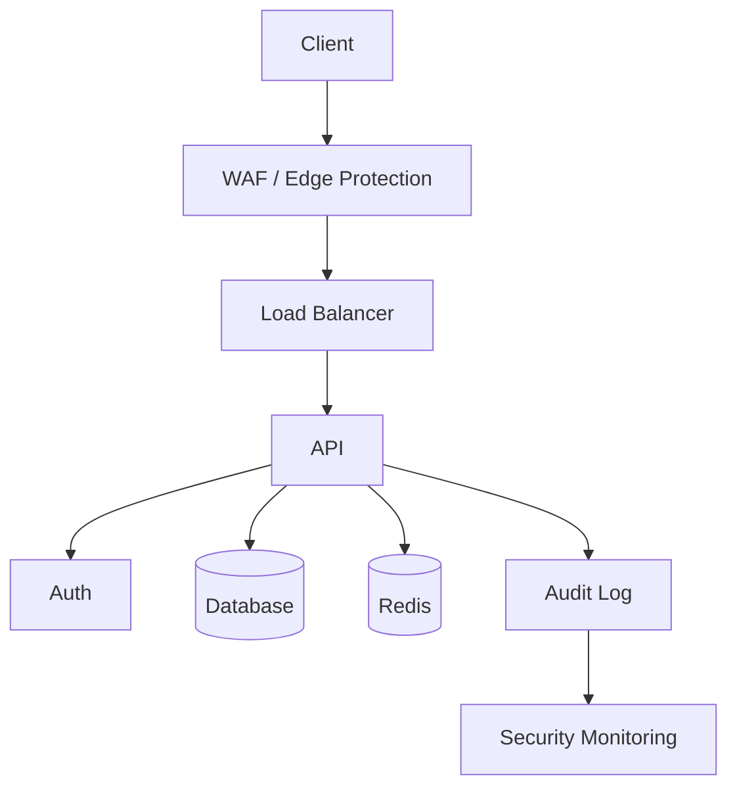

Bu diagram:

```text
docs/security/
```

altında human-readable ola bilər.

`.sdd` isə:

```text
SecurityGraph:
  Client
  WAF
  LB
  API
  Auth
  DB
  Redis
  Audit
  SIEM
```

kimi qısa representation saxlayır.

---

# 09.24 — Security verification

Bizim final flow:

```text
CHANGE
 ↓
IMPLEMENT
 ↓
QA
 ↓
SC
 ↓
REMEDIATION if needed
 ↓
SC
 ↓
VR
```

Əgər security fail:

```text
SC !
 ↓
Finding
 ↓
Task
 ↓
Owner
 ↓
Fix
 ↓
QA
 ↓
SC
```

Beləliklə chain qırılmır.

---

# 09.25 — Security loop

Ən vacib qayda:

```text
BE → FE → MD → QA → SC → VR
```

sadəcə düz xətt deyil.

Security problemi çıxsa:

```text
SC
 ↓
affected stage
 ↓
fix
 ↓
resume chain
```

Məsələn:

```text
FE
 ↓
MD
 ↓
QA
 ↓
SC !
 ↓
FE
 ↓
MD
 ↓
QA
 ↓
SC +
 ↓
VR
```

---

# 09.26 — Security final gate

Riskli task üçün:

```text
DONE
```

yalnız:

```text
Acceptance +
QA +
SC +
VR +
```

olanda mümkündür.

Əgər:

```text
SC !
```

varsa:

```text
DONE = impossible
```

---

# PHASE 09 yekunu

İndi security artıq:

```text
Skill
```

səviyyəsindən çıxıb:

```text
Cross-cutting Control System
```

səviyyəsinə keçdi.

Tam model:

```text
                    PROJECT
                       │
                    GRAPH
                       │
                     TASK
                       │
                    CHAIN
                       │
              ┌────────┴────────┐
              ↓                 ↓
             STAGE           SECURITY
              │                 │
            SKILL           CONTROLS
              │                 │
              └────────┬────────┘
                       ↓
                      QA
                       ↓
                      SC
                       ↓
                      VR
```

### Növbəti PHASE 10 — `GRAPH / PROJECT MAP`

Burada ən kritik hissələrdən birinə keçirik:

```text
.sdd/project/
```

içində **BE → FE → MD → DB → API → QA → DO → SC → VR əlaqələrini** necə saxlayacağımızı quracağıq.

Əsas məqsəd:

> AI `#PAY-042` görəndə kodu kor-koranə axtarmasın; əvvəl graph-dan **hansı modul → hansı backend → hansı API → hansı frontend → hansı mobile → hansı DB → hansı test → hansı infrastructure** əlaqələrinin mövcud olduğunu çıxarsın.

Və burada sənin əvvəl dediyin **`flows.sdd` məsələsini də dəqiqləşdirəcəyik**: onu sadəcə “architecture diagram” kimi yox, **project dependency/relationship graph-ının bir hissəsi** kimi necə düzgün modelləşdirmək lazım olduğunu müəyyən edəcəyik.


________________________________________________________________________________________________
next

# PHASE 10 — PROJECT GRAPH / SYSTEM MAP

İndi `.sdd` sisteminin ən vacib hissələrindən birinə gəlirik.

Sənin əvvəl dediyin problem məhz burada həll olunur:

> **AI kodun harada olduğunu bilməsə belə, əvvəl `.sdd/project/` graph-ını oxuyub sistemin strukturunu anlamalıdır.**

Amma burada bir düzəliş edirəm:

**`flows.sdd` bütün architecture-ı özündə saxlayan nəhəng fayl olmamalıdır.**

Çünki sən haqlı olaraq dedin ki, zamanla şişəcək.

Biz bunu **INDEX + local graph + flow** modelinə ayırırıq.

---

# 10.1 — Project Graph nədir?

Graph bu suallara cavab verir:

```text
Bu modul haradadır?
Nədən istifadə edir?
Kim ondan istifadə edir?
Hansı API-yə bağlıdır?
Hansı DB table-ları ilə işləyir?
Frontend hansı API-ni çağırır?
Mobile hansı API-ni çağırır?
Hansı testlər bunu yoxlayır?
Hansı infrastructure bunu işlədib?
```

Məsələn:

```text
Payment
 ├── BE
 │    ├── Service
 │    ├── Repository
 │    └── DB
 │
 ├── API
 │
 ├── FE
 │
 ├── MD
 │
 ├── QA
 │
 └── DO
```

---

# 10.2 — `.sdd/project/` strukturu

Təklif etdiyim struktur:

```text
.sdd/
└── project/
    ├── PROJECT.sdd
    ├── INDEX.sdd
    │
    ├── architecture/
    │   └── ARCH.sdd
    │
    ├── flows/
    │   ├── INDEX.sdd
    │   ├── refund.sdd
    │   ├── payment.sdd
    │   └── checkout.sdd
    │
    ├── domains/
    │   ├── users/
    │   │   ├── DOMAIN.sdd
    │   │   ├── graph.sdd
    │   │   ├── flows/
    │   │   └── decisions/
    │   │
    │   └── payments/
    │       ├── DOMAIN.sdd
    │       ├── graph.sdd
    │       ├── flows/
    │       └── decisions/
    │
    └── infrastructure/
        ├── INFRA.sdd
        ├── database.sdd
        ├── cache.sdd
        └── deployment.sdd
```

Burada çox vacib prinsip var:

> **Global graph yalnız routing/index rolunda qalır. Detallar öz domain-lərində yaşayır.**

---

# 10.3 — PROJECT.sdd

Bu fayl project-in **modelidir**, amma bütün project-i copy-paste etmir.

Məsələn:

```text
Spec: Project

ID:
  @project

Name:
  EduNexus

Level:
  L2

Architecture:
  modular-monolith

Backend:
  Go

Frontend:
  React

Mobile:
  ReactNative

Database:
  PostgreSQL

Cache:
  Redis

Testing:
  BDD
  Playwright

Infrastructure:
  Docker
  VPS

Domains:
  users
  payments
  lessons

Entry:
  @project/INDEX
```

Bu AI üçün project-in **5 saniyəlik modelidir**.

---

# 10.4 — INDEX.sdd

`INDEX` isə routing layer-dir.

```text
Spec: ProjectIndex

Project:
  @project

Domains:
  users:
    @project/domains/users

  payments:
    @project/domains/payments

  lessons:
    @project/domains/lessons

Architecture:
  @project/architecture/ARCH

Flows:
  @project/flows/INDEX

Infrastructure:
  @project/infrastructure/INFRA
```

AI bütün qovluğu oxumaq əvəzinə əvvəl INDEX oxuyur.

---

# 10.5 — Domain Graph

Məsələn:

```text
.sdd/project/domains/payments/graph.sdd
```

```text
Spec: Graph

Domain:
  @payments

Modules:

  refund:
    BE: @payments/refund/BE
    API: @payments/refund/API
    FE: @payments/refund/FE
    MD: @payments/refund/MD
    DB: @payments/refund/DB
    QA: @payments/refund/QA

  checkout:
    BE: @payments/checkout/BE
    API: @payments/checkout/API
    FE: @payments/checkout/FE
```

Burada artıq AI görür:

```text
refund
 ├── BE
 ├── API
 ├── FE
 ├── MD
 ├── DB
 └── QA
```

---

# 10.6 — Path məsələsi

Sənin ən böyük problemlərindən biri bu idi:

> AI kodun path-ını hardan biləcək?

Biz taska belə yazmırıq:

```text
BE/internal/payments/refund/service.go
```

Graph bunu resolve edir.

Məsələn:

```text
refund:
  BE:
    root: ./BE/internal/payments/refund
```

və:

```text
service:
  ./BE/internal/payments/refund/service.go
```

Artıq AI bilir.

---

# 10.7 — Amma `.sdd` kodla paralel saxlanılmalıdır

Məsələn real code:

```text
BE/internal/payments/refund/
├── service.go
├── repository.go
└── handler.go
```

`.sdd`:

```text
.sdd/project/domains/payments/refund/
├── BE.sdd
├── API.sdd
├── DB.sdd
└── QA.sdd
```

Bu:

```text
code
```

və:

```text
AI model
```

arasında mapping-dir.

---

# 10.8 — Sənin istədiyin `.sdd` sidecar problemi

Sən demişdin:

> `repository.go` yanında `repository.md` istəmirəm.

Tamamilə razıyam.

Belə:

```text
repository.go
repository.md
```

❌

Belə:

```text
BE/internal/payments/refund/repository.go
```

və:

```text
.sdd/project/domains/payments/refund/BE/repository.sdd
```

✅

və Human docs:

```text
docs/developer/payments/refund.md
```

Beləliklə üç ayrı layer olur:

```text
CODE → machine executable
.SDD → AI executable context
DOCS → human executable context
```

---

# 10.9 — Flow nədir?

İndi əvvəlki sualına gəlirik.

`flow.sdd`:

> **Architecture deyil.**

`flow.sdd`:

> **Concrete business/system execution flow-dur.**

Məsələn Refund:

```text
Customer
 ↓
POST /refund
 ↓
API
 ↓
Refund Service
 ↓
Idempotency
 ↓
DB Transaction
 ↓
Payment Gateway
 ↓
Audit
 ↓
Response
```

Bu `refund.sdd` flow-dur.

---

# 10.10 — Architecture və Flow fərqi

### Architecture

```text
Payment
 ├── BE
 ├── API
 ├── DB
 ├── FE
 └── DO
```

### Flow

```text
POST /refund
 ↓
Handler
 ↓
Service
 ↓
Transaction
 ↓
Gateway
 ↓
Audit
 ↓
Response
```

Yəni:

```text
Architecture = what exists + relations

Flow = how something moves through the system
```

Bu fərqi saxlamalıyıq.

---

# 10.11 — Flow faylı

```text
.sdd/project/domains/payments/flows/refund.sdd
```

```text
Spec: Flow

ID:
  @flow/refund

Domain:
  @payments

Trigger:
  POST /refund

Flow:
  API
  >
  RefundService
  >
  Idempotency
  >
  DB.Transaction
  >
  PaymentGateway
  >
  Audit
  >
  Response

Reads:
  payments
  refunds

Writes:
  refunds
  audit_events

Security:
  @SC/payment-security

Tests:
  @QA/refund

Failure:
  PaymentGateway -> retry
  DB -> rollback
  duplicate -> existing-result

Verify:
  @VR/refund
```

---

# 10.12 — Flow chain qırılmasını necə tapır?

Bu çox vacibdir.

Flow deyir:

```text
RefundService
 >
PaymentGateway
```

Graph isə göstərir:

```text
PaymentGateway
```

mövcud deyil.

Agent:

```text
GRAPH_DRIFT
```

çıxarır.

və ya:

```text
Flow:
  DB.Transaction

Code:
  direct DB write
```

onda:

```text
FLOW_DRIFT
```

olur.

---

# 10.13 — Flow + code verification

AI flow-u sadəcə oxumamalıdır.

O:

```text
FLOW
 ↓
resolve nodes
 ↓
resolve code
 ↓
inspect implementation
 ↓
compare
```

etməlidir.

Məsələn:

```text
Flow:
  API > Service > Repository > DB
```

Code:

```text
API > Service > DB
```

Repository yoxdur.

Əgər architecture bunu tələb edirsə:

```text
ARCHITECTURE_DRIFT
```

çıxır.

---

# 10.14 — DB mapping

Sənin xüsusi istədiyin məsələni burada əlavə edirik.

Domain graph:

```text
DB:
  refunds:
    table: payments.refunds

  transactions:
    table: payments.transactions

  audit:
    table: audit.events
```

AI artıq bilir:

> Refund taskında DB-də haraya baxmalıyam?

---

# 10.15 — DB.sdd

```text
Spec: DatabaseMap

Module:
  @payments/refund

Tables:

  refunds:
    table: payments.refunds
    purpose: refund records

  transactions:
    table: payments.transactions
    purpose: payment transaction state

Reads:
  refunds
  transactions

Writes:
  refunds

Locks:
  transaction_id

Indexes:
  transaction_id
  request_id
```

Bu çox böyük token qənaətidir.

AI hər dəfə bütün schema dump-u oxumağa ehtiyac duymur.

---

# 10.16 — API mapping

Eyni şeyi API üçün edirik.

```text
API:
  POST /payments/refund
  GET /payments/{id}/refund
```

`sdd`:

```text
Spec: APIMap

POST /payments/refund:
  owner: @payments/refund
  handler: @payments/refund/BE
  auth: required
  rate_limit: payment
  idempotency: required
  tests: @QA/refund
```

Sabah user desə:

> `/payments/refund` 500 verir.

AI:

```text
API
 ↓
@payments/refund
 ↓
BE
 ↓
Flow
 ↓
DB
 ↓
QA
```

yolunu bilir.

---

# 10.17 — FE mapping

```text
RefundPage
 ↓
useRefund()
 ↓
POST /payments/refund
```

`.sdd`:

```text
Spec: FrontendMap

Component:
  RefundPage

API:
  POST /payments/refund

State:
  refundStatus

Errors:
  payment_error
  duplicate_request

Tests:
  @QA/refund-ui
```

---

# 10.18 — MD mapping

Eyni:

```text
Spec: MobileMap

Screen:
  RefundScreen

API:
  POST /payments/refund

Platform:
  iOS
  Android

DependsOn:
  @API/payments/refund
```

Beləliklə:

```text
BE
 ↓
API
 ├── FE
 └── MD
```

aydın olur.

---

# 10.19 — QA mapping

```text
Spec: TestMap

Module:
  @payments/refund

BDD:
  @QA/bdd/refund

API:
  @QA/api/refund

UI:
  @QA/ui/refund

Load:
  @QA/load/refund

Security:
  @SC/payment-security
```

---

# 10.20 — DO mapping

```text
Spec: DeploymentMap

Service:
  payments

Runtime:
  Docker

Hosts:
  VPS

Dependencies:
  PostgreSQL
  Redis

Health:
  /health
  /ready

Logs:
  payments

Metrics:
  payments.requests
  payments.errors
```

---

# 10.21 — Beləliklə Project Graph

Artıq:

```text
                         PROJECT
                            │
                          DOMAIN
                            │
                         PAYMENT
                            │
        ┌───────────┬───────┼────────┬─────────┐
        ↓           ↓       ↓        ↓         ↓
       BE          API      DB       FE        MD
        │           │       │        │         │
        └───────────┴───────┴────────┴─────────┘
                            │
                           QA
                            │
                           SC
                            │
                           DO
                            │
                           VR
```

və hər node öz detalına malikdir.

---

# 10.22 — Graph giant file olmayacaq

Bu vacibdir.

❌:

```text
flows.sdd = 10,000 lines
```

istəmirik.

Bunun əvəzinə:

```text
INDEX
 ↓
DOMAIN GRAPH
 ↓
MODULE GRAPH
 ↓
FLOW
 ↓
NODE
```

lazy loading edirik.

---

# 10.23 — AI traversal

User:

> Refund API-də problem var.

AI:

```text
1. PROJECT INDEX
2. PAYMENTS DOMAIN
3. API MAP
4. refund module
5. refund flow
6. BE implementation
7. DB mapping
8. QA mapping
9. SC controls
```

Bütün project-i oxumur.

Bu bizim **context-aware traversal** sistemimizdir.

---

# 10.24 — Graph traversal shortcuts

Sənin istədiyin shortcut konsepsiyasını burada istifadə edə bilərik:

```text
@BE
@FE
@MD
@DB
@API
@QA
@SC
@DO
@VR
```

və:

```text
@flow/refund
@payments/refund
@db/refunds
@api/refund
```

AI üçün bunlar **semantic references** olacaq.

---

# 10.25 — Broken reference

Əgər:

```text
@payments/refund
```

artıq mövcud deyilsə:

```text
BROKEN_REF
```

çıxmalıdır.

Əgər fayl köçürülübsə:

```text
MOVE_DETECTED
```

çıxa bilər.

AI:

```text
old:
  ./BE/internal/payments/refund

new:
  ./services/payments/refund
```

taparsa mapping-i yeniləmək üçün task yaradır.

---

# 10.26 — Graph drift

Ən güclü validation-lardan biri:

```text
CODE
vs
SDD GRAPH
```

comparison.

Məsələn `.sdd` deyir:

```text
payments → PostgreSQL
```

kod isə MongoDB istifadə edir.

```text
GRAPH_DRIFT
```

---

# 10.27 — Architecture drift

`.sdd`:

```text
Architecture:
  modular-monolith
```

Kod:

```text
new microservice
```

yaradır.

Agent:

```text
ARCHITECTURE_DRIFT
```

deyir.

Bu dərhal:

```text
DECISION_REQUIRED
```

yarada bilər.

---

# 10.28 — Flow drift

`.sdd`:

```text
API > Service > Repository > DB
```

kod:

```text
API > DB
```

Agent:

```text
FLOW_DRIFT
```

çıxarır.

---

# 10.29 — Dependency drift

Graph:

```text
FE → API
```

Code:

```text
FE → direct database
```

Agent:

```text
DEPENDENCY_VIOLATION
```

çıxarır.

---

# 10.30 — Project Graph-in əsas prinsipi

Bu phase üçün əsas qaydanı belə yazıram:

```text
RULE G-001

The project graph describes relationships,
not implementation details.

Implementation belongs to code.
AI-readable meaning belongs to .sdd.
Human explanation belongs to docs.
```

İkinci qayda:

```text
RULE G-002

Global indexes route the agent.
Local graphs provide context.
Flows describe execution.
```

Üçüncü:

```text
RULE G-003

The agent must traverse the smallest
context required to solve the current task.
```

Bu üçüncü qayda **token optimization üçün fundamental** olacaq.

---

# PHASE 10 yekun modeli

Artıq `.sdd/project` belə düşünülməlidir:

```text
.sdd/project/
│
├── PROJECT.sdd
├── INDEX.sdd
│
├── architecture/
│   └── ARCH.sdd
│
├── domains/
│   │
│   ├── users/
│   │   ├── DOMAIN.sdd
│   │   ├── graph.sdd
│   │   ├── flows/
│   │   └── decisions/
│   │
│   └── payments/
│       ├── DOMAIN.sdd
│       ├── graph.sdd
│       │
│       ├── refund/
│       │   ├── BE.sdd
│       │   ├── API.sdd
│       │   ├── DB.sdd
│       │   ├── FE.sdd
│       │   ├── MD.sdd
│       │   └── QA.sdd
│       │
│       ├── flows/
│       │   └── refund.sdd
│       │
│       └── decisions/
│
└── infrastructure/
    ├── INFRA.sdd
    ├── database.sdd
    ├── cache.sdd
    └── deployment.sdd
```

Bu artıq sənin əvvəl dediyin:

> **“Sabah insan kodu açmasa belə sistemin hansı hissəsinin haraya bağlı olduğunu başa düşsün; AI isə birbaşa lazım olan yerə getsin.”**

tələbinə uyğun modeldir.

---

## Növbəti PHASE 11 — SKILL SYSTEM 2.0

Burada əvvəlki bütün fikirlərimizi birləşdirəcəyik.

Skill artıq sadəcə:

```text
skills/backend/idempotency
```

olmayacaq.

Onu:

```text
DOMAIN
LEVEL
APPLICABILITY
BEST-PRACTICE
PROS
CONS
WHEN
WHEN-NOT
INPUT
OUTPUT
TOOLS
TEST
SECURITY
PERFORMANCE
DEPRECATION
ALTERNATIVES
VERSION
EVIDENCE
```

modelinə keçirəcəyik.

Və ən vacibi:

> AI-yə **“skill-lər köhnəlib, özünü yoxla və yeni best practice varsa müqayisə et”** deməyin mexanizmini quracağıq.

Bu, sənin istədiyin **self-updating skill system** üçün əsas phase olacaq.


________________________________________________________________________________________________
next

# PHASE 11 — SKILL SYSTEM 2.0

Bu phase bizim sistemin **“beyin”** hissələrindən biridir.

Əvvəlki modeldə skill belə idi:

```text
@skills/backend/idempotency
```

Bu yaxşıdır, amma kifayət deyil. AI bilməlidir:

* bu skill nə vaxt tətbiq olunur;
* hansı level-də tətbiq olunur;
* nə vaxt tətbiq olunmur;
* hansı alternativlər var;
* pros/cons nədir;
* hansı texnologiyada necə tətbiq edilir;
* security təsiri nədir;
* performance təsiri nədir;
* hansı test tələb olunur;
* skill köhnəlibmi;
* daha yaxşı yanaşma varmı.

Amma **bütün bunları hər taska yazmaq olmaz**. Token israfı yaranar.

Ona görə Skill System-i **layered + lazy-loaded** qururuq.

---

# 11.1 — Skill-in yeni modeli

Bir skill:

```text
SKILL
 ├── Identity
 ├── Applicability
 ├── Levels
 ├── Rules
 ├── Alternatives
 ├── Tradeoffs
 ├── Security
 ├── Performance
 ├── Testing
 ├── Technology
 ├── Evidence
 └── Lifecycle
```

olacaq.

---

# 11.2 — `.sdd/skills/` strukturu

```text
.sdd/
└── skills/
    ├── INDEX.sdd
    │
    ├── backend/
    │   ├── INDEX.sdd
    │   ├── architecture/
    │   ├── api/
    │   ├── concurrency/
    │   ├── database/
    │   └── performance/
    │
    ├── frontend/
    │   ├── INDEX.sdd
    │   ├── react/
    │   ├── vue/
    │   ├── angular/
    │   ├── state/
    │   └── performance/
    │
    ├── mobile/
    │   ├── INDEX.sdd
    │   ├── react-native/
    │   ├── flutter/
    │   └── architecture/
    │
    ├── qa/
    │   ├── INDEX.sdd
    │   ├── bdd/
    │   ├── api/
    │   ├── ui/
    │   ├── e2e/
    │   ├── load/
    │   └── performance/
    │
    ├── database/
    │   ├── INDEX.sdd
    │   ├── postgres/
    │   ├── mysql/
    │   ├── mongodb/
    │   ├── redis/
    │   └── optimization/
    │
    ├── devops/
    │   ├── INDEX.sdd
    │   ├── docker/
    │   ├── kubernetes/
    │   ├── linux/
    │   ├── ci-cd/
    │   └── cloud/
    │
    └── security/
        ├── INDEX.sdd
        ├── auth/
        ├── api/
        ├── supply-chain/
        └── threat-modeling/
```

Bu strukturu **bütün texnologiyaları əvvəldən yaratmaq məcburiyyətində deyilik**.

INDEX-də mövcud capability-lər qeyd olunur.

---

# 11.3 — Skill INDEX

```text
Spec: SkillIndex

Skill:
  @backend/idempotency

Domain:
  backend

Category:
  reliability

Level:
  L2-L5

Triggers:
  duplicate-request
  retry
  payment
  webhook
  message-consumer

Status:
  active

Load:
  on-demand
```

Bu fayl AI üçün **metadata**-dır.

AI hələ skill-in bütün məzmununu oxumur.

---

# 11.4 — Əsas skill

Məsələn:

```text
.sdd/skills/backend/concurrency/idempotency.sdd
```

```text
Spec: Skill

ID:
  @backend/idempotency

Name:
  Idempotency

Purpose:
  Repeated execution must not produce
  unintended duplicate effects.

Apply:
  duplicate requests
  retries
  payments
  webhooks
  message processing

Avoid:
  read-only operations
  naturally idempotent operations
```

Bu qədər.

İlk mərhələdə AI üçün kifayətdir.

---

# 11.5 — Level sistemi

Skill:

```text
Level:
  L1-L5
```

amma bu:

> “L5 həmişə daha yaxşıdır”

demək deyil.

Məsələn:

```text
L1:
  request idempotency key

L2:
  database uniqueness

L3:
  transactional idempotency

L4:
  distributed idempotency

L5:
  distributed workflow/idempotent orchestration
```

AI project-in scale və riskinə baxır.

---

# 11.6 — Project level skill seçimini idarə edir

Məsələn:

```text
Project:
  L1

Scale:
  10K MAU

Architecture:
  modular-monolith
```

AI:

```text
L1/L2 approach
```

seçir.

Başqa project:

```text
Project:
  L5

Scale:
  1M DAU

Multi-region:
  yes
```

onda daha advanced variantları araşdırır.

Bu sənin əvvəl dediyin prinsipdir:

> **Kiçik layihəyə görə microservice qurma.**

---

# 11.7 — Skill selection

Agent üçün:

```text
TASK
 ↓
PROJECT LEVEL
 ↓
DOMAIN
 ↓
RISK
 ↓
SCALE
 ↓
TECHNOLOGY
 ↓
SKILL INDEX
 ↓
SELECT
 ↓
LOAD FULL SKILL
```

Beləliklə AI bütün skill repository-ni oxumur.

---

# 11.8 — Technology matrix

Məsələn idempotency:

```text
Technology:

Go:
  native

Laravel:
  middleware/service

Node:
  middleware

PostgreSQL:
  unique constraint
  transaction

Redis:
  SET NX

Kafka:
  consumer strategy
```

AI artıq bilir:

> Mənim project Go + PostgreSQL-dir.

Deməli yalnız uyğun hissələri yükləyir.

---

# 11.9 — Pros / Cons

Skill daxilində:

```text
Options:

A:
  DB unique constraint

  Pros:
    strong consistency
    simple
    durable

  Cons:
    DB dependency
    contention possible

B:
  Redis lock

  Pros:
    fast
    distributed

  Cons:
    expiration
    failure complexity

C:
  application memory

  Pros:
    simple

  Cons:
    not distributed
    unsafe after restart
```

AI:

```text
Project:
  PostgreSQL
  single-region
  modular-monolith
```

görüb A-nı seçə bilər.

---

# 11.10 — Decision engine

Skill özü qərarı məcbur etmir.

Belə olur:

```text
Skill
 ↓
Options
 ↓
Project constraints
 ↓
Trade-off analysis
 ↓
Recommendation
 ↓
Decision
```

Yəni:

**Skill = knowledge**

**Decision = project-specific conclusion**

Bu ikisini qarışdırmırıq.

---

# 11.11 — Decision project-ə gedir

Əvvəl qərarların root `.sdd/`-də olmasını istəmirdin.

Bu prinsip qorunur.

```text
.sdd/project/payments/decisions/
```

Məsələn:

```text
DEC-021.sdd
```

```text
Decision:
  Use PostgreSQL uniqueness for refund idempotency.

Reason:
  Single-region modular monolith.

Rejected:
  Redis distributed lock.

Why:
  unnecessary complexity.

BasedOn:
  @backend/idempotency

Level:
  L2
```

Beləliklə skill dəyişə bilər, amma project-in qərarı tarix kimi qalır.

---

# 11.12 — Skill-in “best practice” problemi

Sənin ən maraqlı tələbin budur:

> “Mən skill-i yaratdım. Amma sabah texnologiya dəyişdi. AI bunu bilməlidir.”

Bunun üçün skill-də:

```text
Lifecycle:
  active

Review:
  periodic

Evidence:
  required
```

saxlayırıq.

---

# 11.13 — Skill freshness

```text
Freshness:
  reviewed: 2026-08
  review_after: 2026-11
```

Amma bu:

> “3 ay keçdi, skill yanlışdır”

demək deyil.

Sadəcə:

```text
REVIEW_REQUIRED
```

deməkdir.

---

# 11.14 — Skill Update Agent

Sonradan ayrıca agent:

```text
Skill Auditor
```

işləyə bilər.

Flow:

```text
SKILL
 ↓
IDENTIFY TECHNOLOGY
 ↓
SEARCH CURRENT PRACTICE
 ↓
COMPARE
 ↓
PROS/CONS
 ↓
CONFIDENCE
 ↓
UPDATE PROPOSAL
 ↓
HUMAN APPROVAL
```

Vacib:

**AI production skill-i özbaşına dəyişməməlidir.**

Əvvəl:

```text
SKILL_UPDATE_PROPOSAL
```

yaradır.

---

# 11.15 — Evidence

Skill update üçün:

```text
Evidence:
  source:
    official-docs

  version:
    PostgreSQL 18

  date:
    2026-08

  confidence:
    high
```

Sonradan bu hissəni web/search agent ilə avtomatlaşdıra bilərik.

---

# 11.16 — Deprecated skill

Skill köhnəlibsə:

```text
Status:
  deprecated

Replacement:
  @backend/new-pattern

Reason:
  technology evolution
```

Amma silmirik.

Çünki köhnə project həmin skill ilə qurulmuş ola bilər.

---

# 11.17 — Skill alias

Token qənaəti üçün:

```text
@idem
```

→

```text
@backend/idempotency
```

Amma insan sənədlərində full adı göstərilə bilər.

Bu çox faydalıdır.

Məsələn task:

```text
Skills:
  @idem
  @tx
  @pay-sec
```

Human docs:

```text
Idempotency
Database Transactions
Payment Security
```

---

# 11.18 — Standard vocabulary

Bu artıq sənin əvvəl dediyin **standart keyword** məsələsidir.

Məsələn:

```text
AR = ANALYZE
DB = DATABASE
BE = BACKEND
FE = FRONTEND
MD = MOBILE
QA = QUALITY
SC = SECURITY
DO = DEVOPS
VR = VERIFY
```

Mən burada bir düzəliş edirəm:

**`AR` üçün `ANALYZE` istifadə etmək daha düzgündür.**

Çünki `A` həm architecture, həm analysis üçün qarışıqlıq yarada bilər.

Architecture üçün:

```text
ARCH
```

istifadə edək.

Belə:

```text
AR
DB
BE
FE
MD
QA
SC
DO
VR
```

standart stage vocabulary olur.

---

# 11.19 — Chain vocabulary

Task:

```text
Chain:
  AR > DB > BE > FE > MD > QA > SC > DO > VR
```

Amma bu **universal mandatory chain deyil**.

AI taska görə stage-ləri seçir.

Məsələn DB-only:

```text
AR > DB > QA > SC > VR
```

Frontend:

```text
AR > FE > QA > SC > VR
```

Infrastructure:

```text
AR > DO > QA > SC > VR
```

---

# 11.20 — Stage registry

Bunun üçün:

```text
.sdd/skills/stages.sdd
```

yarada bilərik.

```text
Stages:

AR:
  Analyze

DB:
  Database

BE:
  Backend

FE:
  Frontend

MD:
  Mobile

QA:
  Quality Assurance

SC:
  Security Control

DO:
  DevOps

VR:
  Verify
```

Bu artıq **controlled vocabulary** olur.

AI başqa ad icad etməməlidir.

---

# 11.21 — Skill applicability

Hər skill üçün:

```text
ApplyWhen
DoNotApplyWhen
```

olmalıdır.

Məsələn:

```text
@cache

ApplyWhen:
  repeated expensive reads
  high latency
  high DB load

DoNotApplyWhen:
  source data changes every request
  correctness requires immediate consistency
```

Bu çox vacibdir.

Çünki AI-nin ən böyük problemlərindən biri:

> **“Best practice gördüm → hər yerə tətbiq etdim.”**

olur.

Biz bunu qadağan edirik.

---

# 11.22 — Anti-patterns

Skill-də:

```text
AntiPatterns:
  cache-everything
  microservice-by-default
  premature-optimization
  distributed-lock-without-need
```

ola bilər.

Bu xüsusilə sənin istədiyin sistem üçün vacibdir.

---

# 11.23 — Architecture skills

Skill system yalnız coding olmayacaq.

```text
@architecture/modular-monolith
@architecture/microservices
@architecture/event-driven
@architecture/serverless
```

AI project-i analiz edib seçim edə bilər.

Məsələn:

```text
Project:
  small
  2 developers
  low traffic
```

nəticə:

```text
modular-monolith
```

Microservices:

```text
REJECTED
reason:
  operational complexity > benefit
```

---

# 11.24 — Scale skill

Burada əvvəl dediyin:

> 1M DAU / MAU / scale

məsələsi daxil olur.

```text
@scale/1k
@scale/10k
@scale/100k
@scale/1m
@scale/10m
```

Amma bunlar “hard rule” deyil.

AI:

```text
DAU
MAU
RPS
peak RPS
data volume
latency
availability
```

görməlidir.

---

# 11.25 — Performance skill

Məsələn:

```text
@performance/database-index
```

AI:

```text
Query frequency
+
Query latency
+
Table size
+
Write/read ratio
```

görmədən:

> “Index əlavə et”

deməməlidir.

Bu bizim **evidence-driven skill** modelidir.

---

# 11.26 — Bütün modullar üçün eyni skill engine

Bu çox vacibdir.

Biz:

```text
BE Skill Engine
```

qurmuruq.

Bir:

```text
Skill Engine
```

qururuq.

O:

```text
BE
FE
MD
DB
QA
SC
DO
ARCH
```

hamısını idarə edir.

Məsələn:

```text
FE:
  React
  Vue
  Angular

MD:
  ReactNative
  Flutter

QA:
  Playwright
  Cypress

DO:
  VPS
  AWS
  GCP
  Azure
```

hamısı eyni sistemin capability-ləridir.

---

# 11.27 — AI Skill Resolution

Final mexanizm:

```text
User Request
     ↓
Analyze
     ↓
Project Context
     ↓
Domain
     ↓
Scale
     ↓
Risk
     ↓
Technology
     ↓
Stage
     ↓
Skill INDEX
     ↓
Select Skills
     ↓
Load only required skills
     ↓
Compare options
     ↓
Apply project constraints
     ↓
Decision
     ↓
Task
```

Bu artıq bizim **AI-native SDLC engine**-in əsasını yaradır.

---

# 11.28 — Token optimization

Ən vacib prinsip:

```text
DO NOT LOAD ALL SKILLS
```

Agent:

```text
INDEX → metadata → relevant skill → relevant section
```

oxuyur.

Məsələn refund problemi üçün:

```text
Loaded:
  @idem
  @tx
  @pay-sec
  @postgres/locking
```

amma:

```text
React
Angular
Flutter
Kubernetes
AWS
Cypress
```

oxunmur.

Bu ciddi context qənaətidir.

---

# 11.29 — Human vs AI

Beləliklə sistemdə üç representation olur:

```text
CODE
  ↓
actual implementation

.SDD
  ↓
compact machine context

DOCS
  ↓
human explanation
```

Skill üçün də:

```text
.sdd/skills/
   ↓
AI compact knowledge

docs/skills/
   ↓
Human explanation
```

olacaq.

---

# 11.30 — PHASE 11-in əsas qərarı

Bu phase üçün əsas architecture qərarımız:

```text
Skill ≠ Decision

Skill ≠ Project rule

Skill = reusable knowledge + applicability + trade-offs
```

və:

```text
Project Decision
    ↓
uses Skill
    ↓
applies Project Context
    ↓
creates concrete implementation rule
```

Bu ayrımı qorumasaq, sistem bir neçə ay sonra qarışacaq.

---

## İndiki progress

Bu mərhələyə qədər artıq əsas skeleton belədir:

```text
.sdd/
│
├── PROJECT/                 ← root project intelligence
│
├── skills/                  ← reusable knowledge
│
├── security/                ← cross-cutting security
│
├── tasks/                   ← task lifecycle
│
└── [global control/index]
```

Project daxilində isə:

```text
.sdd/project/
│
├── PROJECT.sdd
├── INDEX.sdd
├── architecture/
├── domains/
│   └── payments/
│       ├── graph.sdd
│       ├── flows/
│       ├── decisions/
│       └── modules/
└── infrastructure/
```

və human tərəfdə:

```text
docs/
├── business/
├── developer/
├── qa/
├── security/
├── support/
└── infrastructure/
```

---

# Növbəti — PHASE 12: SDLC + STLC ENGINE

Burada artıq **işin necə hərəkət etdiyini** formal olaraq quracağıq:

```text
IDEA
 ↓
ANALYZE
 ↓
BDD
 ↓
ARCHITECTURE
 ↓
TASK
 ↓
DB / BE / FE / MD
 ↓
TEST
 ↓
SECURITY
 ↓
REVIEW
 ↓
DEVOPS
 ↓
DEPLOY
 ↓
VERIFY
 ↓
OBSERVE
 ↓
FEEDBACK
 ↓
REFACTOR
```

və paralel:

```text
STLC
```

ilə:

```text
BDD
UNIT
API
INTEGRATION
UI
E2E
LOAD
SECURITY
MANUAL
```

bir-birinə bağlanacaq.

**Əsas məqsəd:** sabah AI “kod yaz” əmri alanda kod yazmağa qaçmasın; əvvəl bu engine-dən keçərək **növbəti düzgün mərhələni özü müəyyən etsin.**


v
next

# PHASE 12 — SDLC + STLC ENGINE

Bu phase-də artıq `.sdd` sisteminin **işləmə qanununu** qururuq.

Burada vacib düzəliş:

**SDLC və STLC-ni iki ayrı, paralel dünya kimi saxlamırıq.**

Onlar bir-birinə bağlı lifecycle-lardır.

```text
SDLC
  │
  ├── Business
  ├── Architecture
  ├── Development
  ├── Deployment
  └── Operations
          │
          └──── STLC
                 ├── BDD
                 ├── Test Design
                 ├── Automation
                 ├── Execution
                 ├── Security
                 └── Verification
```

---

# 12.1 — Əsas lifecycle

Bizim standart flow:

```text
INPUT
  ↓
AR
  ↓
BDD
  ↓
ARCH
  ↓
TASK
  ↓
IMPLEMENT
  ↓
QA
  ↓
SC
  ↓
REVIEW
  ↓
DO
  ↓
VR
  ↓
OBSERVE
```

Amma **bu hər task üçün məcburi full chain deyil.**

Məsələn documentation dəyişiklik:

```text
AR > DOC > VR
```

DB index:

```text
AR > DB > QA > SC > VR
```

Full payment feature:

```text
AR > BDD > ARCH > DB > BE > FE > MD > QA > SC > DO > VR
```

AI chain-i taskın təsir dairəsinə görə seçir.

---

# 12.2 — Stage registry

Bu dəfə stage-ləri formal qaydaya salırıq.

```text
.sdd/workflow/
├── INDEX.sdd
├── stages.sdd
├── transitions.sdd
├── gates.sdd
└── policies.sdd
```

---

# 12.3 — stages.sdd

```text
Spec: Stages

AR:
  name: Analyze
  purpose: understand requirement and impact

BDD:
  name: Behavior
  purpose: define expected behavior

ARCH:
  name: Architecture
  purpose: define system structure

DB:
  name: Database
  purpose: data/storage changes

BE:
  name: Backend
  purpose: backend implementation

FE:
  name: Frontend
  purpose: web implementation

MD:
  name: Mobile
  purpose: mobile implementation

QA:
  name: Quality
  purpose: functional verification

SC:
  name: Security
  purpose: security verification

DO:
  name: DevOps
  purpose: runtime/deployment

VR:
  name: Verify
  purpose: final consistency verification
```

---

# 12.4 — Stage ≠ Skill

Bu ayrımı qoruyuruq.

```text
BE
```

stage-dir.

```text
@go/concurrency
```

skill-dir.

Yəni:

```text
BE
 ↓
select skills
 ↓
@go/concurrency
@go/testing
@postgres/transaction
```

---

# 12.5 — Stage transition

`transitions.sdd`:

```text
Spec: Transitions

Default:

AR > BDD
BDD > ARCH
ARCH > DB
DB > BE
BE > FE
FE > MD
MD > QA
QA > SC
SC > DO
DO > VR
```

Amma bu **default graph**-dır.

---

# 12.6 — Conditional transition

Məsələn MD lazım deyilsə:

```text
FE > QA
```

Backend-only:

```text
BE > QA
```

DB-only:

```text
DB > QA
```

Infrastructure:

```text
DO > QA
```

Beləliklə AI:

```text
RequiredStages
```

hesablayır.

---

# 12.7 — Task-dan chain çıxarma

Task:

```text
Refund endpoint-də double refund problemini həll et.
```

AI:

```text
Affected:
  API
  BE
  DB
  Security
  QA
```

Chain:

```text
AR
 >
BDD
 >
ARCH
 >
DB
 >
BE
 >
QA
 >
SC
 >
VR
```

FE/MD yoxdur.

Bu çox vacibdir.

---

# 12.8 — BDD ilk-class stage

Sənin business mindset qərarına görə:

> **Yeni business behavior əvvəl BDD ilə ifadə olunmalıdır.**

Məsələn:

```text
Feature:
  Refund

Scenario:
  Duplicate refund request

Given:
  refund already exists

When:
  same request is submitted again

Then:
  no second refund is created
```

Bundan sonra implementation başlayır.

---

# 12.9 — Amma BDD hər işə tətbiq edilmir

Məsələn:

```text
Refactor variable name
```

BDD yaratmaq mənasızdır.

AI:

```text
BDD:
  not-required
Reason:
  no behavior change
```

deyə bilər.

Bu da bizim:

> **Do not over-engineer**

qaydamızdır.

---

# 12.10 — Test lifecycle

STLC-ni ayrıca model edirik:

```text
.sdd/workflow/testing/
├── INDEX.sdd
├── levels.sdd
├── types.sdd
├── gates.sdd
└── automation.sdd
```

---

# 12.11 — Test levels

```text
T0:
  static

T1:
  unit

T2:
  integration

T3:
  API

T4:
  UI/E2E

T5:
  load/performance

T6:
  security

T7:
  manual/exploratory
```

AI taska görə lazım olan level-ləri seçir.

---

# 12.12 — BDD → Test

BDD:

```text
Refund duplicate request
```

test chain:

```text
BDD
 ↓
Unit
 ↓
Integration
 ↓
API
 ↓
Security
```

UI test yalnız UI behavior varsa əlavə olunur.

---

# 12.13 — Test pyramid

Default:

```text
             E2E
           /     \
         UI       API
        /           \
   Integration
      /     \
    Unit   Unit
```

AI:

> “Hər şeyə Playwright yaz”

deməməlidir.

Çünki bu:

* yavaşdır;
* bahadır;
* brittle-dir;
* maintenance çoxdur.

---

# 12.14 — Test ownership

Test:

```text
BDD
```

business behavior-i ifadə edir.

```text
Unit
```

developer ownership.

```text
API
```

backend/integration.

```text
UI
```

frontend.

```text
E2E
```

system behavior.

```text
Security
```

security control.

```text
Load
```

performance/infrastructure.

Beləliklə sabah problem gələndə:

> “Kim baxmalıdır?”

sualına graph cavab verir.

---

# 12.15 — Gate sistemi

`gates.sdd`:

```text
Gate: QA

Required:
  applicable tests pass

Gate: SC

Required:
  required security controls pass

Gate: DO

Required:
  deployment health pass

Gate: VR

Required:
  all required gates pass
  graph consistent
  no blocking findings
```

---

# 12.16 — Gate ≠ Stage

Məsələn:

```text
QA
```

stage-dir.

```text
QA+
```

gate result-dur.

State:

```text
~
```

pending.

```text
+
```

passed.

```text
!
```

failed.

```text
x
```

not applicable/closed according to defined state semantics.

Bunları sonrakı state registry-də formal bağlayacağıq.

---

# 12.17 — Gate failure loop

Məsələn:

```text
BE
 ↓
QA !
```

AI dayanır.

Finding:

```text
QA-021
```

yaradır.

Task:

```text
PAY-043
```

yaradır.

Sonra:

```text
BE
 ↓
QA
 ↓
SC
 ↓
VR
```

davam edir.

---

# 12.18 — Security failure

```text
QA +
 ↓
SC !
```

onda:

```text
SC Finding
 ↓
Task
 ↓
Affected Stage
```

tapılır.

Əgər BE problemidirsə:

```text
SC
 ↓
BE
 ↓
QA
 ↓
SC
 ↓
VR
```

Əgər infrastructure problemidirsə:

```text
SC
 ↓
DO
 ↓
QA
 ↓
SC
 ↓
VR
```

Bu **reverse traversal** olacaq.

---

# 12.19 — Review stage

Sənin əvvəl dediyin problemi burada həll edirik:

> BE review etdim, FE-yə baxmadım.

Review:

```text
REVIEW
```

bir global stage ola bilər, amma onun scope-u task graph-dan çıxır.

Məsələn:

```text
Affected:
  BE
  FE
  MD
  DB
```

Review:

```text
BE ✓
FE ✓
MD ✓
DB ✓
```

olmadan task final ola bilməz.

---

# 12.20 — Cross-module review

Əgər:

```text
FE → API
```

dəyişirsə, yalnız FE review edilmir.

Agent dependency graph-a baxır:

```text
FE
 ↓
API
 ↓
BE
 ↓
DB
```

və impacted review scope çıxarır.

Bu çox vacib feature-dir.

---

# 12.21 — Change Impact Analysis

Yeni əsas engine:

```text
CHANGE
 ↓
DEPENDENCY GRAPH
 ↓
IMPACT ANALYSIS
```

çıxışı:

```text
Affected:
  FE
  BE
  API
  DB
  QA
  SC
```

və:

```text
NotAffected:
  MD
  DO
```

Bu nəticə chain-i formalaşdırır.

---

# 12.22 — Change types

```text
Behavior
Architecture
Code
Database
API
UI
Mobile
Infrastructure
Security
Dependency
Configuration
Documentation
```

Məsələn:

```text
API contract changed
```

AI avtomatik:

```text
BE
FE
MD
QA
SC
```

təsirini yoxlayır.

---

# 12.23 — Dependency change

Məsələn:

```text
Laravel
```

versiyası dəyişir.

Bu artıq sadəcə BE task deyil.

AI:

```text
Dependency
 ↓
BE
 ↓
Security
 ↓
Tests
 ↓
Infrastructure
 ↓
Runtime
```

yoxlayır.

---

# 12.24 — Refactor

Refactor:

```text
Code structure changes
Behavior unchanged
```

onda:

```text
AR
 >
BE
 >
QA
 >
SC
 >
VR
```

BDD tələb olunmaya bilər.

Əgər behavior dəyişirsə:

```text
BDD
```

yenidən aktivləşir.

---

# 12.25 — Database optimization

Məsələn:

> `users.email` index əlavə et.

AI:

```text
AR
 ↓
DB
 ↓
QA
 ↓
PERF
 ↓
SC
 ↓
VR
```

Burada `PERF` ayrıca stage kimi gələcək phase-də müzakirə edə bilərik.

Hazırda onu QA/DO daxilində capability kimi saxlamaq daha düzgündür.

---

# 12.26 — Runtime feedback

Ən böyük üstünlüklərdən biri:

SDLC deployment-da bitmir.

```text
VR
 ↓
DEPLOY
 ↓
OBSERVE
 ↓
METRICS
 ↓
INCIDENT
 ↓
ANALYZE
 ↓
TASK
```

Yəni production:

```text
feedback loop
```

yaradır.

---

# 12.27 — Incident → Graph

Sabah:

> Payment API 500 verir.

AI:

```text
INCIDENT
 ↓
API
 ↓
@payments/refund
 ↓
flow
 ↓
BE
 ↓
DB
 ↓
DO
 ↓
logs
 ↓
metrics
```

gedir.

Əgər root cause DB-dirsə:

```text
DO
 ↓
DB
```

qayıdır.

Əgər kod problemidirsə:

```text
DO
 ↓
BE
```

qayıdır.

---

# 12.28 — SDLC + Operations loop

Final:

```text
              ┌───────────────┐
              │     INPUT     │
              └───────┬───────┘
                      ↓
                     AR
                      ↓
                    BDD
                      ↓
                    ARCH
                      ↓
                 IMPLEMENT
                      ↓
                     QA
                      ↓
                     SC
                      ↓
                     DO
                      ↓
                     VR
                      ↓
                   DEPLOY
                      ↓
                  OBSERVE
                      ↓
                  FEEDBACK
                      │
                      └────→ AR
```

Bu artıq sadəcə development workflow deyil.

**Closed-loop Engineering System** olur.

---

# 12.29 — Agent-in davranışı

User yazır:

> “Refund sistemində double refund problemi var, düzəlt.”

Agentin ilk işi:

```text
1. INPUT
2. PROJECT INDEX
3. DOMAIN
4. GRAPH
5. IMPACT
6. SKILLS
7. RISK
8. CHAIN
```

olur.

Sonra:

```text
9. BDD
10. IMPLEMENT
11. TEST
12. SECURITY
13. REVIEW
14. VERIFY
```

və yalnız bundan sonra:

```text
DONE
```

deyir.

---

# 12.30 — Ən vacib qayda

Bunu sistemin fundamental qaydalarından biri kimi qəbul edirəm:

```text
RULE SDLC-001

The agent must not start implementation
before determining:

- affected domains
- affected components
- applicable skills
- required stages
- required tests
- security impact
- architecture impact
```

Amma:

```text
RULE SDLC-002

The agent must not execute unnecessary stages.
```

İki qayda birlikdə işləyir.

Bu bizi həm:

**chaos**

və həm də:

**over-engineering**

problemindən qoruyur.

---

# PHASE 12 nəticəsi

Artıq sistemimizdə:

```text
SKILL
   ↓
PROJECT CONTEXT
   ↓
IMPACT ANALYSIS
   ↓
CHAIN
   ↓
STAGE
   ↓
GATE
   ↓
NEXT STAGE
```

mexanizmi formalaşır.

---

## Progress

İndiyə qədər ən böyük komponentlər hazır konsept olaraq müəyyənləşib:

```text
01  .sdd architecture
02  root/project separation
03  PROJECT.sdd
04  TASK system
05  DECISION system
06  PROJECT GRAPH
07  FLOW system
08  DB/API/FE/MD mappings
09  SECURITY control layer
10  SKILL SYSTEM
11  SDLC
12  STLC
```

Hələ **implementation ZIP** yaratmırıq. Çünki əvvəl architecture-ni tam bağlamaq daha düzgündür. Sonda bütün phase-ləri birləşdirib **real `.sdd` starter repository** yaradacağıq.

---

# PHASE 13 — STATE + TASK ENGINE

Növbəti mərhələdə isə bütün bu sistemin **“hazırda nə baş verir?”** sualını həll edəcəyik.

Çünki hazırda artıq bunları bilirik:

```text
Task
Graph
Flow
Skill
Stage
QA
SC
DO
VR
```

amma hələ universal olaraq:

```text
Task haradadır?
Kimdədir?
Nə gözləyir?
Nə bloklayır?
Nə qədər cəhd edilib?
Hansı mərhələdən geri qayıdıb?
Niyə geri qayıdıb?
Növbəti addım nədir?
```

suallarını formal state machine ilə bağlamamışıq.

Burada `#PAY-042` kimi taskın:

```text
~
AR
BDD
BE
QA!
SC
BE
QA+
SC+
VR+
```

kimi **real lifecycle tarixçəsini** və agentin hər dəfə **“next action”**-ı avtomatik çıxarmasını quracağıq.


________________________________________________________________________________________________
next

# PHASE 13 — STATE + TASK ENGINE

Bu phase-də məqsədimiz `.sdd` sisteminə **yaddaş + vəziyyət + növbəti addım** verməkdir.

Əvvəlki phase-lərdə müəyyən etdik:

```text
SKILL
PROJECT
GRAPH
FLOW
SDLC
STLC
GATES
```

İndi bunların hamısını task üzərində birləşdiririk.

Əsas prinsip:

> **Task sadəcə iş təsviri deyil. Task — sistemin müəyyən bir işi hansı mərhələdə, hansı vəziyyətdə və hansı səbəblə apardığını göstərən lifecycle obyektidir.**

---

# 13.1 — Task artıq necə görünür?

Əvvəlki formatını qoruyuruq, amma bir qədər optimallaşdırırıq:

```text
.sdd/tasks/#PAY-042.sdd
```

```text
Task: #PAY-042

Title:
  Refund double execution

Origin:
  prompt: #PROMPT-019
  finding: #SEC-004

Context:
  project: @project
  domain: @project/payments
  module: @project/payments/refund
  component: BE

Purpose:
  Ensure one refund per transaction.

Skills:
  @idem
  @tx
  @pay-sec

DependsOn:
  #PAY-039

Chain:
  AR > BDD > DB > BE > QA > SC > VR

Acceptance:
  Duplicate refund request must not create
  another refund.

State:
  ~

Attempts:
  0/3

Related:
  #PAY-041
  #SEC-004
```

Burada **History yazmırıq**.

Bu vacibdir.

Task özü qısa qalır.

---

# 13.2 — History harada olacaq?

Sənin əsas prinsipinə uyğun:

```text
.sdd/tasks/
```

task definition üçündür.

Lifecycle history üçün:

```text
.sdd/runtime/
```

istifadə edə bilərik.

Məsələn:

```text
.sdd/runtime/
└── tasks/
    └── PAY-042/
        └── state.sdd
```

Amma burada da bir problem var:

> çoxlu runtime faylı `.sdd`-ni şişirdə bilər.

Ona görə mən daha yaxşı variant təklif edirəm:

```text
.sdd/runtime/
└── events.sdd
```

və task yalnız öz cari state-ni saxlayır.

---

# 13.3 — Task State

Task üçün universal state vocabulary:

```text
NEW
ANALYZING
PLANNED
READY
IN_PROGRESS
BLOCKED
REVIEW
TESTING
SECURITY
VERIFYING
DONE
FAILED
CANCELLED
```

Amma bunların hamısını taska yazmaq lazım deyil.

---

# 13.4 — State ≠ Stage

Bu ayrımı ciddi saxlayırıq.

Məsələn:

```text
Stage:
  BE
```

və:

```text
State:
  IN_PROGRESS
```

deməkdir:

> Task Backend mərhələsindədir və hazırda işlənir.

Başqa:

```text
Stage:
  QA

State:
  BLOCKED
```

deməkdir:

> QA mərhələsinə çatıb, amma bloklanıb.

---

# 13.5 — Current position

Task:

```text
Stage:
  QA

State:
  BLOCKED
```

Bu agentə dərhal deyir:

```text
Current:
  QA

Next:
  resolve blocker
```

---

# 13.6 — Next Action Engine

Bu phase-in ən vacib hissəsidir.

Agent hər task üçün:

```text
NEXT ACTION
```

hesablayacaq.

Məsələn:

```text
Stage:
  BE

State:
  IN_PROGRESS
```

çıxış:

```text
NextAction:
  complete backend implementation
```

---

# 13.7 — QA failure

Məsələn:

```text
QA:
  FAILED
```

Agent:

```text
NextAction:
  inspect QA finding
```

Finding:

```text
QA-021
```

Backend problemidirsə:

```text
NextStage:
  BE
```

Beləliklə:

```text
QA
 ↓
FAIL
 ↓
BE
 ↓
QA
```

loop yaranır.

---

# 13.8 — State machine

Formal model:

```text
NEW
 ↓
ANALYZING
 ↓
PLANNED
 ↓
READY
 ↓
IN_PROGRESS
 ↓
REVIEW
 ↓
TESTING
 ↓
SECURITY
 ↓
VERIFYING
 ↓
DONE
```

Failure:

```text
TESTING
   ↓
 BLOCKED
   ↓
IN_PROGRESS
```

Security:

```text
SECURITY
   ↓
FAILED
   ↓
IN_PROGRESS
```

---

# 13.9 — Transition rules

```text
.sdd/workflow/state.sdd
```

```text
StateTransitions:

NEW > ANALYZING

ANALYZING > PLANNED
ANALYZING > BLOCKED

PLANNED > READY

READY > IN_PROGRESS

IN_PROGRESS > REVIEW
IN_PROGRESS > BLOCKED

REVIEW > TESTING
REVIEW > IN_PROGRESS

TESTING > SECURITY
TESTING > IN_PROGRESS
TESTING > BLOCKED

SECURITY > VERIFYING
SECURITY > IN_PROGRESS
SECURITY > BLOCKED

VERIFYING > DONE
VERIFYING > IN_PROGRESS
VERIFYING > BLOCKED

BLOCKED > IN_PROGRESS
```

---

# 13.10 — Agent transition qaydasını poza bilməz

Məsələn:

```text
NEW
```

və agent birbaşa:

```text
DONE
```

yaza bilməz.

Çünki:

```text
NEW > DONE
```

transition yoxdur.

Amma documentation-only task üçün custom flow ola bilər:

```text
NEW > ANALYZING > READY > IN_PROGRESS > REVIEW > DONE
```

Bunu project/task context müəyyən edir.

---

# 13.11 — State history

Runtime event:

```text
.sdd/runtime/events.sdd
```

məsələn:

```text
2026-08-21T20:10
PAY-042
STATE
NEW > ANALYZING

2026-08-21T20:15
PAY-042
STATE
ANALYZING > PLANNED

2026-08-21T20:22
PAY-042
STATE
PLANNED > READY

2026-08-21T20:30
PAY-042
STATE
READY > IN_PROGRESS
```

Bu human üçün əsas document deyil.

Bu **machine audit log**-dur.

---

# 13.12 — Token qənaəti

Agent hər dəfə bütün history-ni oxumamalıdır.

Task:

```text
State:
  IN_PROGRESS

Stage:
  BE
```

Agentə kifayətdir.

History yalnız:

```text
WHY?
AUDIT?
DEBUG?
```

lazım olanda oxunur.

Bu bizim:

> **lazy context loading**

prinsipidir.

---

# 13.13 — Attempts

Sənin əvvəlki:

```text
Attempts:
  0/3
```

ideyanı saxlayırıq.

Amma mən bunu belə formalaşdırmağı məsləhət görürəm:

```text
Attempts:
  current: 0
  max: 3
```

AI:

```text
attempt 1
attempt 2
attempt 3
```

edir.

3-cü də uğursuzdursa:

```text
BLOCKED
```

və human intervention tələb olunur.

---

# 13.14 — Niyə max attempts lazımdır?

AI eyni problemi sonsuz loop-a sala bilər:

```text
fix
 ↓
test fail
 ↓
fix
 ↓
test fail
 ↓
fix
 ↓
...
```

Biz:

```text
max attempts = 3
```

qoyuruq.

Sonra:

```text
HumanReviewRequired
```

---

# 13.15 — Blocker

Task:

```text
State:
  BLOCKED
```

tək başına kifayət deyil.

```text
BlockedBy:
  #SEC-004
```

və ya:

```text
BlockedBy:
  ENV-012
```

olmalıdır.

---

# 13.16 — Blocker types

```text
DEPENDENCY
SECURITY
TECHNICAL
ENVIRONMENT
HUMAN
EXTERNAL
DECISION
RESOURCE
```

Məsələn:

```text
BlockedBy:
  type: DECISION
  ref: DEC-021
```

Agent bilir:

> Mən kod yaza bilmərəm, əvvəl qərar lazımdır.

---

# 13.17 — Dependency state

Task:

```text
DependsOn:
  PAY-039
```

Amma PAY-039:

```text
State:
  IN_PROGRESS
```

olarsa:

```text
PAY-042
```

automatic olaraq:

```text
BLOCKED
```

ola bilər.

Beləliklə dependency graph real işləyir.

---

# 13.18 — Parallel tasks

Məsələn:

```text
PAY-042
```

3 subtask:

```text
PAY-042-BE
PAY-042-FE
PAY-042-QA
```

olur.

BE və FE paralel işləyə bilər.

Graph:

```text
             PAY-042
              /    \
             BE    FE
              \    /
               QA
                |
                SC
```

Agent dependency-lərə əsasən parallelizmi təyin edə bilər.

---

# 13.19 — Human intervention

Bəzi vəziyyətlərdə AI özü qərar verməməlidir.

Məsələn:

```text
Architecture change
Database migration
Security exception
Production incident
Cost increase
Cloud migration
Data deletion
```

onda:

```text
HumanApproval:
  REQUIRED
```

olur.

---

# 13.20 — Approval gate

Məsələn:

```text
Decision:
  migrate PostgreSQL → MongoDB

Risk:
  HIGH

Approval:
  REQUIRED
```

Agent plan hazırlaya bilər.

Amma:

```text
EXECUTE
```

edə bilməz.

---

# 13.21 — Risk level

Task:

```text
Risk:
  LOW
```

və ya:

```text
MEDIUM
HIGH
CRITICAL
```

AI riskə görə chain genişləndirir.

Məsələn:

```text
LOW:
AR > BE > QA > VR
```

```text
HIGH:
AR > BDD > ARCH > DB > BE > QA > SC > DO > VR
```

```text
CRITICAL:
AR > BDD > ARCH > DB > BE > FE > MD > QA > SC > DO > VR
```

və əlavə human approval.

---

# 13.22 — Risk ≠ Complexity

Bunları da ayırırıq.

```text
Complexity:
  LOW/MEDIUM/HIGH
```

```text
Risk:
  LOW/MEDIUM/HIGH/CRITICAL
```

Sadə kod yüksək riskli ola bilər.

Məsələn:

> payment authorization check

Kod azdır, amma risk yüksəkdir.

---

# 13.23 — Task priority

```text
Priority:
  P0
  P1
  P2
  P3
```

P0:

> production/security critical

P1:

> important business functionality

P2:

> normal

P3:

> improvement

AI task queue-da:

```text
Risk + Priority + Dependency
```

ilə sıralaya bilər.

---

# 13.24 — Task Queue Engine

Agent:

```text
tasks/
```

oxuyur və:

```text
READY
```

olan taskları tapır.

Sonra:

```text
Priority
+
Risk
+
Dependency
+
Business impact
+
Blocked state
```

hesablayır.

Nəticə:

```text
NextTask:
  PAY-042
```

---

# 13.25 — “Next” artıq sadəcə UI əmri deyil

Sən chat-də:

> next

deyəndə agent:

```text
1. current phase
2. current task
3. state
4. blockers
5. dependencies
6. next valid transition
```

hesablamalıdır.

Sonra:

```text
Next:
  PHASE 13 / STATE ENGINE
```

və ya artıq real projectdə:

```text
Next:
  PAY-042 / BE / implement idempotency
```

deyə bilər.

---

# 13.26 — Recovery

Agent öldü.

Restart oldu.

Heç nə itmir.

Çünki:

```text
PROJECT
TASK
STATE
EVENTS
GRAPH
```

diskdədir.

Agent:

```text
READ INDEX
 ↓
READ ACTIVE TASK
 ↓
READ CURRENT STATE
 ↓
RESUME
```

edir.

Bu bizim sistem üçün çox vacibdir.

---

# 13.27 — Crash-safe principle

Agent heç vaxt:

```text
memory only
```

state saxlamamalıdır.

Əsas state:

```text
.sdd/
```

içində persistent olmalıdır.

---

# 13.28 — Task Snapshot

`task.sdd`:

```text
Task: #PAY-042

State:
  IN_PROGRESS

Stage:
  BE

Attempts:
  1/3

Next:
  implement database idempotency constraint
```

Bu snapshot-dır.

History isə:

```text
runtime/events.sdd
```

dədir.

Beləliklə:

```text
Snapshot = NOW
Events = HISTORY
```

---

# 13.29 — Bu ayrım çox vacibdir

Biz:

```text
Task
```

faylını böyük log faylına çevirmirik.

Əks halda 1 il sonra:

```text
#PAY-042.sdd
```

5000 sətir olacaq.

İstəmirik.

---

# 13.30 — Final Task Model

Beləliklə taskın machine modelini:

```text
Task
 ├── Identity
 ├── Origin
 ├── Context
 ├── Purpose
 ├── Skills
 ├── Dependencies
 ├── Chain
 ├── Acceptance
 ├── State
 ├── Stage
 ├── Attempts
 ├── Priority
 ├── Risk
 ├── Blocker
 └── Related
```

kimi bağlayırıq.

History:

```text
Runtime Events
```

Ayrıdır.

---

# PHASE 13-də əsas qərarlar

### 1. Task ≠ History

```text
task.sdd = current truth
events.sdd = historical truth
```

### 2. State ≠ Stage

```text
BE + IN_PROGRESS
QA + BLOCKED
SC + FAILED
```

kimi birlikdə işləyirlər.

### 3. Agent hər zaman `NextAction` hesablaya bilir

```text
Current state
+
graph
+
dependencies
+
gates
=
next action
```

### 4. Sonsuz AI loop yoxdur

```text
Attempts: 0/3
```

sonra human intervention.

### 5. Dependency-lər real işləyir

```text
DependsOn → BLOCKED/READY
```

### 6. Risk chain-i genişləndirir

```text
LOW ≠ CRITICAL workflow
```

### 7. Restart sonrası agent davam edir

```text
persistent state
```

əsasında.

---

# Hazırkı arxitektura

İndi sistem artıq belə görünür:

```text
.sdd/
│
├── PROJECT/
│
├── skills/
│
├── workflow/
│   ├── stages.sdd
│   ├── transitions.sdd
│   ├── gates.sdd
│   ├── state.sdd
│   └── testing/
│
├── tasks/
│   └── #PAY-042.sdd
│
├── security/
│
└── runtime/
    └── events.sdd
```

Project tərəfində isə:

```text
.sdd/project/
│
├── PROJECT.sdd
├── INDEX.sdd
├── architecture/
├── domains/
├── decisions/
├── flows/
└── infrastructure/
```

Human tərəf:

```text
docs/
├── business/
├── developer/
├── qa/
├── security/
├── support/
└── infrastructure/
```

---

## Növbəti: PHASE 14 — SECURITY ENGINE

Bu phase-i xüsusilə geniş qurmaq lazımdır, çünki sənin sistemində security **sadəcə bir skill olmayacaq**.

Ayrıca:

```text
Threat Modeling
Authentication
Authorization
Secrets
Dependency Security
SAST
DAST
API Security
Data Security
Container Security
Supply Chain
Pentest
DDoS
Rate Limit
Abuse Detection
Infrastructure Security
Runtime Security
Incident Response
Security Gates
```

hamısı eyni security graph-ına bağlanacaq.

Ən vacibi isə:

```text
CODE
 ↓
QA
 ↓
SECURITY
 ↓
PENTEST
 ↓
LOAD
 ↓
DDoS/ABUSE
 ↓
PRODUCTION
 ↓
MONITORING
```

və security problemi çıxdıqda onun **hansı kod → hansı modul → hansı flow → hansı task → hansı qərar → hansı skill** zəncirindən gəldiyini geriyə tapmaq mümkün olacaq.


________________________________________________________________________________________________
Task qovluqu duzgun deyil. Menim istediyim `.sdd` qovluqunun root qovluqlarini `.sdd/project` qovluqlarindan ayirim.
Sebeb ise tasklar project basedir skiller testler workflowlar ise root basedir. bele ede bilerik ki,
`.sdd/project/tasks/` `.sdd/project/workflow/` bu daha aqila batan ola biler. task root base folderei mene deyecek ki 
hansi qovluqa gede bilersen. ve project de olan index de gosterecek ki hansi task elave edilib siralaama necedir assili taski varmi 
asli tasklarin icrasini ilk baslair ondan sonra gelir serbest olan taska
 1000
 1001 -> 1011 -> 1023
 
 Task ilk olaraq 1023 gedir onu oxuyur
 1023 -> 999
 demek ki, 999 getmeliyik ve gorur ki 999 taski serbestdirse onda onu baslayir islemeye
 999 -> 1023 -> 1011 -> 1001
 icrasi olur yeni kicikden boyuge bunu duzelsini edek.


Bəli, burada əvvəlki modeldə **əsas arxitektura səhvi var idi**. Sənin dediyin separation daha məntiqlidir.

Əsas prinsip belə olmalıdır:

> **Root `.sdd/` sistemin özünü idarə edir. `.sdd/project/` isə konkret layihənin vəziyyətini və işlərini saxlayır.**

Və task **project-owned entity** olmalıdır. Root-da taskların özünü saxlamaq düzgün deyil.

---

# PHASE 13 — DÜZƏLİŞ: PROJECT-BASED TASK ENGINE

## 1. Yeni separation

Belə qururuq:

```text
.sdd/
│
├── INDEX.sdd
│
├── skills/
├── workflow/
├── testing/
├── security/
├── architecture/
├── standards/
│
└── project/
    ├── INDEX.sdd
    ├── PROJECT.sdd
    │
    ├── tasks/
    │   ├── INDEX.sdd
    │   ├── 1000.sdd
    │   ├── 1001.sdd
    │   ├── 1011.sdd
    │   ├── 1023.sdd
    │   └── 999.sdd
    │
    ├── decisions/
    ├── architecture/
    ├── domains/
    ├── flows/
    └── infrastructure/
```

Burada:

### Root

```text
.sdd/
```

AI-nin **knowledge + rules + standards** hissəsidir.

### Project

```text
.sdd/project/
```

AI-nin **bu konkret layihədə nə baş verdiyini** göstərir.

---

# 2. Əsas qayda

Bunu artıq fundamental rule kimi qoyaq:

```text
ROOT-001

Root `.sdd` MUST contain reusable
system intelligence.

Project `.sdd/project` MUST contain
project-specific state.
```

Yəni:

```text
.sdd/skills/
```

→ ümumi skill.

```text
.sdd/project/tasks/
```

→ bu layihənin taskları.

---

# 3. Workflow məsələsində də düzəliş

Burada sənin cümləndə bir vacib məqam var:

> skiller, testlər, workflowlar root basedir.

Mən bununla razıyam.

Ona görə:

```text
.sdd/workflow/
```

**root-based standard workflow** olacaq.

Project isə yalnız workflow-un **project-specific vəziyyətini** saxlayacaqsa:

```text
.sdd/project/workflow/
```

istifadə edə bilər.

Amma default olaraq project daxilində workflow yaratmağa ehtiyac yoxdur.

Yəni:

```text
.sdd/workflow/
```

→ **how work should happen**

```text
.sdd/project/tasks/
```

→ **what work exists**

```text
.sdd/project/tasks/INDEX.sdd
```

→ **which work exists + dependency/order**

Bu daha təmizdir.

---

# 4. Root TASKS qovluğu nə olacaq?

Əslində:

```text
.sdd/tasks/
```

artıq lazım deyil.

Çünki task project-baseddir.

Root-da yalnız:

```text
.sdd/
├── INDEX.sdd
├── skills/
├── workflow/
├── testing/
├── security/
├── standards/
└── project/
```

olacaq.

Bu çox yaxşı separation verir.

---

# 5. Bəs root necə deyəcək task haradadır?

Root:

```text
.sdd/INDEX.sdd
```

project routing məlumatını saxlayacaq.

Məsələn:

```text
Projects:
  @project:
    path: ./project
    tasks: ./project/tasks
    decisions: ./project/decisions
    domains: ./project/domains
```

AI artıq bilir:

```text
@project/tasks
@project/decisions
@project/domains
```

haradadır.

---

# 6. Project INDEX

Əsas idarəetmə burada olacaq:

```text
.sdd/project/tasks/INDEX.sdd
```

Məsələn:

```text
Project: @project

Tasks:

  999:
    state: READY
    priority: P1
    depends: []

  1000:
    state: READY
    priority: P2
    depends: []

  1001:
    state: WAIT
    priority: P1
    depends: [1011]

  1011:
    state: WAIT
    priority: P1
    depends: [1023]

  1023:
    state: WAIT
    priority: P1
    depends: [999]
```

Bu artıq taskların **master index**-idir.

---

# 7. Task özü

Məsələn:

```text
.sdd/project/tasks/1023.sdd
```

```text
Task: 1023

Title:
  Implement refund protection

DependsOn:
  999

Priority:
  P1

State:
  WAIT

Skills:
  @idem
  @tx
  @pay-sec

Chain:
  AR > BDD > DB > BE > QA > SC > VR
```

Burada taskın bütün lifecycle history-si saxlanmır.

Task **compact** qalır.

---

# 8. İndi sənin ən vacib düzəlişin

Sənin dediyin:

```text
1000

1001 -> 1011 -> 1023
```

burada biz dependency istiqamətini çox dəqiq standartlaşdırmalıyıq.

Mən bunu belə təyin etməyi məsləhət görürəm:

```text
A -> B
```

deməkdir:

> **A B-dən asılıdır.**

Yəni:

```text
1001 -> 1011 -> 1023
```

belə oxunur:

```text
1001
  depends on
1011
  depends on
1023
```

Deməli execution:

```text
1023
 ↓
1011
 ↓
1001
```

olmalıdır.

Bu standardı bir dəfə müəyyənləşdiririk və bütün `.sdd` sistemində dəyişmir.

---

# 9. Sənin 1023 nümunən

Sən deyirsən:

```text
Task 1023 açıldı.
```

AI onu oxuyur:

```text
1023
DependsOn:
  999
```

AI:

> 1023-ü hələ işlədə bilmərəm.

Sonra:

```text
999
```

tapır.

Əgər:

```text
999
DependsOn:
  []
```

və:

```text
State:
  READY
```

dirsə:

**999 başlayır.**

---

# 10. Execution

Belə olur:

```text
1023
 ↓
dependency check
 ↓
999
 ↓
execute 999
 ↓
999 DONE
 ↓
1023 READY
 ↓
execute 1023
```

Sonra dependency graph-ı yenidən yoxlayır.

---

# 11. Daha böyük nümunə

Sənin:

```text
1000

1001 -> 1011 -> 1023
                  ↓
                 999
```

modelin:

```text
1001
  ↓
1011
  ↓
1023
  ↓
999
```

deyil.

Əgər `1023 DependsOn 999`-dırsa:

```text
1001
  ↓
1011
  ↓
1023
  ↓
999
```

**dependency graph** belədir.

Amma execution:

```text
999
 ↓
1023
 ↓
1011
 ↓
1001
```

olur.

---

# 12. Sənin “kiçikdən böyüyə” prinsipin

Burada çox mühüm bir fərq var.

Sən:

> kiçikdən böyüyə

deyəndə mən bunu **task ID-nin numerik sıralaması** kimi yox, **dependency depth** kimi qəbul edirəm.

Çünki:

```text
1023 -> 999
```

varsa, `999` daha kiçikdir.

Amma:

```text
2000 -> 1500
```

da ola bilər.

Burada ID-nin böyük/kiçik olması əsas deyil.

Əsas qayda:

> **Dependency əvvəl, dependent sonra.**

Bu daha düzgün və universal standartdır.

---

# 13. Execution order

Beləliklə:

```text
Dependency Graph
        ↓
Resolve dependencies
        ↓
Find leaf/root task
        ↓
Execute
        ↓
Mark DONE
        ↓
Unlock dependent
        ↓
Execute next
```

---

# 14. “Leaf task” nədir?

Məsələn:

```text
1023 -> 999
```

`999`:

```text
DependsOn: []
```

olduğu üçün:

```text
READY
```

taskdır.

1023 isə:

```text
WAIT
```

olur.

---

# 15. INDEX-də state avtomatik görünməlidir

Məsələn:

```text
.sdd/project/tasks/INDEX.sdd
```

```text
Tasks:

999:
  state: DONE

1023:
  state: READY

1011:
  state: WAIT
  depends: 1023

1001:
  state: WAIT
  depends: 1011

1000:
  state: READY
```

Agent artıq bunu oxuyub bilir:

```text
READY:
  1000
  1023

WAIT:
  1011
  1001
```

---

# 16. Hansını birinci götürəcək?

Burada ikinci scheduler lazımdır.

```text
READY tasks
 ↓
Priority
 ↓
Risk
 ↓
Dependency depth
 ↓
Creation/order
```

Məsələn:

```text
1000 P2
1023 P1
```

olarsa:

```text
1023
```

birinci seçilə bilər.

Amma 1023 dependency olaraq 999-a bağlıdırsa:

```text
999
```

birinci icra edilir.

---

# 17. Scheduler qaydası

Bunu belə yazmaq daha düzgündür:

```text
Execution Priority:

1. Unresolved dependencies
2. Blocking dependencies
3. Priority
4. Risk
5. Dependency depth
6. Stable task order
```

Beləliklə AI “sadəcə ID kiçikdir” kimi axmaq qayda tətbiq etmir.

---

# 18. Task lifecycle

Task:

```text
WAIT
```

↓

dependency həll oldu:

```text
READY
```

↓

işə başladı:

```text
IN_PROGRESS
```

↓

iş tamamlandı:

```text
REVIEW
```

↓

test:

```text
TESTING
```

↓

security:

```text
SECURITY
```

↓

verify:

```text
DONE
```

---

# 19. Dependency unlock

Məsələn:

```text
999 DONE
```

Scheduler graph-a baxır:

```text
999
 ↑
1023
```

və görür:

```text
1023 dependencies:
  999 = DONE
```

deməli:

```text
1023:
  WAIT → READY
```

Sonra:

```text
1023 DONE
```

və:

```text
1011
```

unlock olur.

Sonra:

```text
1011 DONE
```

və:

```text
1001
```

unlock olur.

---

# 20. Tam execution

Sənin nümunəni tam göstərək:

```text
Initial:

999   READY
1023  WAIT → 999
1011  WAIT → 1023
1001  WAIT → 1011
1000  READY
```

Scheduler:

```text
READY:
  999
  1000
```

Priority görə:

```text
999
```

başlayır.

---

Sonra:

```text
999 DONE

1023 → READY
```

---

Sonra:

```text
1023 DONE

1011 → READY
```

---

Sonra:

```text
1011 DONE

1001 → READY
```

---

Sonra:

```text
1001 DONE
```

Execution:

```text
999
 ↓
1023
 ↓
1011
 ↓
1001
```

`1000` isə müstəqil taskdır və scheduler priority-yə görə uyğun yerdə icra edə bilər.

---

# 21. Root INDEX nə edir?

Root:

```text
.sdd/INDEX.sdd
```

yalnız **system routing** verir:

```text
Skills:
  ./skills

Workflow:
  ./workflow

Testing:
  ./testing

Security:
  ./security

Projects:
  ./project
```

Root taskları görmür.

Bu çox vacibdir.

---

# 22. Project INDEX nə edir?

```text
.sdd/project/INDEX.sdd
```

project map verir:

```text
Project:
  @project

Tasks:
  ./tasks

Domains:
  ./domains

Architecture:
  ./architecture

Decisions:
  ./decisions

Flows:
  ./flows
```

---

# 23. Task INDEX nə edir?

```text
.sdd/project/tasks/INDEX.sdd
```

isə **task scheduler map** olur:

```text
Tasks:
  999
  1000
  1001
  1011
  1023
```

və:

```text
State
Priority
DependsOn
Risk
```

metadata-sını saxlayır.

---

# 24. Bu üç INDEX çox yaxşı separation verir

```text
.sdd/INDEX.sdd
        ↓
SYSTEM MAP

.sdd/project/INDEX.sdd
        ↓
PROJECT MAP

.sdd/project/tasks/INDEX.sdd
        ↓
TASK MAP
```

AI də lazım olan qədər oxuyur.

---

# 25. Root-based skill, workflow, testing

Final separation:

```text
.sdd/
│
├── INDEX.sdd
│
├── skills/
│
├── workflow/
│
├── testing/
│
├── security/
│
├── architecture/
│
├── standards/
│
└── project/
    │
    ├── INDEX.sdd
    ├── PROJECT.sdd
    │
    ├── tasks/
    │   └── INDEX.sdd
    │
    ├── decisions/
    ├── architecture/
    ├── domains/
    ├── flows/
    └── infrastructure/
```

Bu məncə əvvəlki variantdan **xeyli daha doğru architecture**-dır.

---

# 26. Bir əlavə düzəliş də təklif edirəm

Taskların içində:

```text
Chain:
  AR > BDD > DB > BE > QA > SC > VR
```

saxlamaq olar, amma **task bunu özü müəyyən etməməlidir**.

Task yalnız:

```text
Impact:
  DB
  BE
  QA
  SC
```

deyə bilər.

Sonra root:

```text
.sdd/workflow/
```

və skill engine deyir:

```text
Impact
+
Risk
+
Project level
+
Applicable skills
=
Chain
```

Beləliklə task faylında:

```text
Chain:
```

hard-coded olmaq məcburiyyətində deyil.

Bu, sənin əvvəl dediyin **“standart dəyişəndə AI özü başa düşsün”** prinsipinə daha uyğundur.

---

# 27. Task daha da yüngülləşir

Məsələn:

```text
Task: 1023

Title:
  Refund idempotency

DependsOn:
  999

Impact:
  DB
  BE

Priority:
  P1

Risk:
  HIGH

Skills:
  @idem
  @tx
  @pay-sec

Acceptance:
  Duplicate refund must not execute twice.

State:
  WAIT
```

Qalanı root knowledge-dan gəlir.

Bu **token-efficient** modeldir.

---

# 28. Son nəticə

Bizim yeni fundamental model:

```text
ROOT
│
├── KNOWLEDGE
├── STANDARDS
├── WORKFLOW
├── TESTING
├── SECURITY
└── ARCHITECTURE
        │
        ↓
PROJECT
│
├── PROJECT CONTEXT
├── TASKS
├── DECISIONS
├── DOMAINS
├── FLOWS
└── INFRASTRUCTURE
        │
        ↓
TASK GRAPH
        │
        ↓
DEPENDENCY RESOLUTION
        │
        ↓
READY TASK
        │
        ↓
EXECUTE
        │
        ↓
DONE
        │
        ↓
UNLOCK NEXT TASK
```

### Ən vacib qayda isə:

> **Task ID order deyil, dependency order execution-u müəyyən edir.**

Yəni:

```text
1001 -> 1011 -> 1023 -> 999
```

dependencydirsə:

```text
999 → 1023 → 1011 → 1001
```

icra olunur.

Bu qaydanı mən `.sdd` sisteminin **Task Scheduler Standard**-ı kimi qəbul edərdim.

Növbəti phase-də isə bunun üzərinə **PHASE 14 — SECURITY ENGINE** qurmaq daha düzgündür; çünki task scheduler artıq hansı işin nə vaxt açılacağını bilir, Security Engine isə həmin işin **hansı security gates-dən keçməli olduğunu** müəyyən edəcək.


________________________________________________________________________________________________
Tasklar ucun Human Base tasklarinin doc yaradardin yeni humn da bilsin ki hanis taask nomresi hannsi ilseri gorecek. Amma file by file olsun ki, sabah .sdd qovluqunda olan nomre ile human docsda olan nomre ile fayillari analiz ede bilsin.
Bəli. Bu yanaşmanı mən **mütləq əlavə edərdim**. Hətta burada Human və AI tərəfini bir-birindən ayırmaq üçün çox yaxşı standart yarada bilərik.

Əsas prinsip:

> **AI task = `.sdd/project/tasks/1023.sdd`**
> **Human task document = `docs/tasks/1023.md`**

Eyni ID olduğu üçün agent hər ikisini deterministik şəkildə əlaqələndirə bilir.

---

# 1. Yeni Human Task arxitekturası

Project-də:

```text
.sdd/
└── project/
    └── tasks/
        ├── INDEX.sdd
        ├── 999.sdd
        ├── 1000.sdd
        ├── 1011.sdd
        ├── 1023.sdd
        └── ...
```

Human documentation-da:

```text
docs/
└── tasks/
    ├── INDEX.md
    ├── 999.md
    ├── 1000.md
    ├── 1011.md
    ├── 1023.md
    └── ...
```

Beləliklə:

```text
.sdd/project/tasks/1023.sdd
        ↕
docs/tasks/1023.md
```

**1:1 relationship** yaranır.

---

# 2. AI faylı nə üçündür?

Məsələn:

```text
.sdd/project/tasks/1023.sdd
```

çox qısa olacaq:

```text
Task: 1023

Title:
  Refund idempotency

DependsOn:
  999

Impact:
  DB
  BE

Priority:
  P1

Risk:
  HIGH

Skills:
  @idem
  @tx
  @pay-sec

Acceptance:
  Duplicate refund must not execute twice.

State:
  WAIT
```

AI üçün bu kifayətdir.

---

# 3. Human faylı

```text
docs/tasks/1023.md
```

isə normal insan dilində olacaq:

```markdown
# TASK-1023 — Refund Idempotency

## Purpose

Refund əməliyyatının eyni transaction üçün iki dəfə
icra olunmasının qarşısını almaq.

## Why

Hazırkı sistemdə eyni refund request-in təkrar göndərilməsi
double refund yarada bilər.

Bu, maliyyə və security baxımından yüksək riskli problemdir.

## What Must Be Done

1. Refund request üçün idempotency mexanizmi qurulmalıdır.
2. Eyni request ikinci dəfə gəldikdə yeni refund yaradılmamalıdır.
3. Database transaction təhlükəsizliyi qorunmalıdır.
4. Concurrent request-lər ayrıca test edilməlidir.

## Depends On

- TASK-999

TASK-999 tamamlanmadan TASK-1023 icra edilməməlidir.

## Affected Areas

- Backend
- Database
- Payment security

## Testing

BDD testləri yazılmalıdır.

Əsas ssenari:

Given eyni refund request mövcuddur  
When həmin request ikinci dəfə göndərilir  
Then ikinci refund yaradılmamalıdır

## Security

Bu task payment-security qaydalarına tabedir.

Security testlərində aşağıdakılar yoxlanmalıdır:

- duplicate request
- concurrent request
- replay attack
- idempotency key manipulation

## Completion

Task yalnız aşağıdakılar tamamlandıqdan sonra DONE hesab olunur:

- Code
- BDD
- QA
- Security
- Verification
```

Human developer bunu rahat oxuya bilir.

---

# 4. Burada çox vacib qayda

`docs/tasks/1023.md` **source of truth deyil**.

Source of truth:

```text
.sdd/project/tasks/1023.sdd
```

Human document isə:

```text
human-readable projection
```

olur.

Yəni:

```text
.sdd
  ↓
AI understands
  ↓
docs
  ↓
Human understands
```

---

# 5. Human INDEX də lazımdır

```text
docs/tasks/INDEX.md
```

Bu sənədə bütün taskların ümumi xəritəsi düşür:

```markdown
# Project Tasks

| ID | Title | Depends On | Priority | Risk | State |
|---|---|---|---|---|---|
| 999 | Refund foundation | — | P1 | HIGH | DONE |
| 1023 | Refund idempotency | 999 | P1 | HIGH | READY |
| 1011 | Refund API | 1023 | P1 | MEDIUM | WAIT |
| 1001 | Refund UI | 1011 | P2 | LOW | WAIT |
| 1000 | Reporting | — | P2 | LOW | READY |
```

Human burada bir baxışda görür:

```text
999
 ↓
1023
 ↓
1011
 ↓
1001
```

---

# 6. Amma INDEX-də execution order ayrıca göstərilməlidir

Çünki dependency list ilə execution order eyni şey deyil.

Məsələn:

```markdown
## Execution Order

1. TASK-999
2. TASK-1023
3. TASK-1011
4. TASK-1001
```

və ayrıca:

```markdown
## Independent Tasks

- TASK-1000
```

Beləliklə manager olaraq sən birbaşa görürsən:

> Hazırda hansı iş əsas chain-dədir?

---

# 7. Task numbering üçün standart

Burada mən bir qayda da qoyardım:

```text
TASK-0001
TASK-0002
TASK-0003
```

və ya sənin əvvəlki formatına uyğun:

```text
999
1000
1001
1023
```

Amma **formatı sistem boyu dəyişməz saxlamalıyıq**.

Mən daha explicit variantı üstün tuturam:

```text
TASK-1023
```

Çünki:

```text
1023
```

təkbaşına başqa entity ilə qarışa bilər.

Məsələn:

```text
TASK-1023
DEC-1023
SEC-1023
BUG-1023
```

ayrı şeylərdir.

---

# 8. Buna görə Human docs strukturu

Mən bunu belə qurardım:

```text
docs/
│
├── INDEX.md
│
├── tasks/
│   ├── INDEX.md
│   ├── TASK-0999.md
│   ├── TASK-1000.md
│   ├── TASK-1001.md
│   ├── TASK-1011.md
│   └── TASK-1023.md
│
├── business/
├── developer/
├── qa/
├── security/
├── support/
└── infrastructure/
```

---

# 9. `.sdd` tərəfi

```text
.sdd/
│
├── INDEX.sdd
│
├── skills/
├── workflow/
├── testing/
├── security/
├── architecture/
├── standards/
│
└── project/
    ├── INDEX.sdd
    ├── PROJECT.sdd
    │
    ├── tasks/
    │   ├── INDEX.sdd
    │   ├── TASK-0999.sdd
    │   ├── TASK-1000.sdd
    │   ├── TASK-1001.sdd
    │   ├── TASK-1011.sdd
    │   └── TASK-1023.sdd
    │
    ├── decisions/
    ├── architecture/
    ├── domains/
    ├── flows/
    └── infrastructure/
```

---

# 10. AI bunu necə tapacaq?

Agent:

```text
.sdd/project/tasks/TASK-1023.sdd
```

oxuyur.

Root standard deyir:

```text
HumanDoc:
  docs/tasks/{TASK_ID}.md
```

Agent avtomatik tapır:

```text
docs/tasks/TASK-1023.md
```

Beləliklə heç bir əlavə mapping file lazım deyil.

Bu **token və complexity qənaətidir**.

---

# 11. Ən yaxşı tərəfi: consistency check

Agent periodik olaraq yoxlaya bilər:

```text
.sdd/project/tasks/
```

və:

```text
docs/tasks/
```

müqayisə edir.

Məsələn:

```text
.sdd:
TASK-1023
```

var, amma:

```text
docs:
TASK-1023
```

yoxdur.

Agent:

```text
DOC-MISSING
TASK-1023
```

yarada bilər.

Əksinə:

```text
docs/tasks/TASK-777.md
```

var, amma `.sdd`-də task yoxdur.

Agent:

```text
ORPHAN-DOC
TASK-777
```

tapır.

---

# 12. Daha da yaxşısı — checksum / version

Human doc ilə AI taskın hansı versiyaya uyğun olduğunu da göstərə bilərik.

AI:

```text
TASK-1023.sdd

Version:
  3
```

Human:

```markdown
<!-- SDD-TASK: TASK-1023 -->
<!-- SDD-VERSION: 3 -->
```

Agent görə bilər:

```text
AI:
version 4

Human:
version 3
```

və deyə bilər:

> Human documentation outdated.

Bu çox faydalıdır.

---

# 13. Human document avtomatik generate edilə bilər

Əsas prinsip:

```text
.sdd/project/tasks/TASK-1023.sdd
             ↓
       Task Renderer
             ↓
docs/tasks/TASK-1023.md
```

Yəni developer `.md` faylını əl ilə yazmaq məcburiyyətində deyil.

AI task specification dəyişdikdə:

```text
.sdd
 ↓
render
 ↓
docs
```

yenilənir.

---

# 14. Amma Human əlavə izah yaza bilər

Burada bir istisna saxlamalıyıq.

Məsələn:

```markdown
## Human Notes

Bu problem 2026-07-15 production incident
zamanı aşkar edilmişdir.

Payment komandası tərəfindən prioritet
P1 olaraq müəyyən edilmişdir.
```

Bunu AI silməməlidir.

Deməli Human doc iki hissədən ibarət ola bilər:

```text
Generated
Human maintained
```

Məsələn:

```markdown
<!-- SDD-GENERATED: START -->

...

<!-- SDD-GENERATED: END -->

## Human Notes

...
```

AI yalnız generated hissəyə toxunur.

Bu, çox yaxşı safeguard-dır.

---

# 15. Beləliklə 3 səviyyə yaranır

### AI specification

```text
.sdd/project/tasks/TASK-1023.sdd
```

**Machine optimized**

### Human task document

```text
docs/tasks/TASK-1023.md
```

**Human optimized**

### Runtime

```text
.sdd/runtime/
```

**Execution optimized**

---

# 16. Final model

```text
                PROJECT
                   │
          ┌────────┴────────┐
          │                 │
       AI SIDE          HUMAN SIDE
          │                 │
 .sdd/project/tasks/     docs/tasks/
          │                 │
 TASK-1023.sdd  ←────→  TASK-1023.md
          │
          ↓
      WORKFLOW
          │
          ↓
       EXECUTE
          │
          ↓
       RUNTIME
```

Bu model sənin əsas məqsədinə çox uyğun gəlir:

> **AI üçün qısa, deterministic, token-efficient `.sdd`; insan üçün geniş, izahlı, rahat `docs`.**

Və ən önəmlisi, **ID eyniliyi səbəbilə AI heç bir əlavə registry oxumadan `.sdd` taskından onun Human sənədinə gedə bilir.**

Mən bunu artıq `.sdd` arxitekturasının **məcburi standardlarından biri** kimi qəbul edərdim.


________________________________________________________________________________________________
next
## PHASE 14 — SECURITY ENGINE

İndi Task modelini bağladıq. Növbəti düzgün addım **Security Engine**-dir. Çünki sənin sistemində security sonradan əlavə olunan bir test deyil; layihənin arxitekturasından başlayıb production-a qədər gedən ayrıca lifecycle olmalıdır.

### 14.1. Security də project-owned deyil

Burada əvvəlki qaydamızı qoruyuruq:

```text
.sdd/
├── security/
├── testing/
├── workflow/
├── skills/
└── project/
    └── ...
```

`security/` root-based olur, çünki:

> Security qaydaları, standartları, gates və skill-lər bütün layihələr üçün reusable knowledge-dur.

Project isə yalnız öz security vəziyyətini saxlayır:

```text
.sdd/project/
├── security/
│   ├── INDEX.sdd
│   ├── threats/
│   ├── findings/
│   └── exceptions/
└── tasks/
```

---

# 14.2. Security lifecycle

Security flow-u standartlaşdırırıq:

```text
AR
 ↓
THREAT
 ↓
DESIGN
 ↓
CODE
 ↓
SAST
 ↓
DEPENDENCY
 ↓
SECRETS
 ↓
DAST
 ↓
API SECURITY
 ↓
CONTAINER
 ↓
LOAD/ABUSE
 ↓
PENTEST
 ↓
PRODUCTION
 ↓
MONITORING
 ↓
INCIDENT
```

Amma **hər project bütün bunlardan keçməli deyil**.

Bu çox vacibdir.

Kiçik landing page üçün:

```text
DESIGN
→ CODE
→ SAST
→ DEPENDENCY
→ QA
→ VERIFY
```

kifayət edə bilər.

Payment platform üçün:

```text
THREAT
→ SAST
→ DAST
→ API
→ DATA
→ CONTAINER
→ PENTEST
→ LOAD
→ ABUSE
→ PRODUCTION
```

ola bilər.

Bunu `Risk + Impact + Architecture + Project level` müəyyən edir.

---

# 14.3. Security level

Root:

```text
.sdd/security/levels.sdd
```

məsələn:

```text
L0:
  Prototype

L1:
  Internal

L2:
  Standard production

L3:
  High-risk production

L4:
  Critical system

L5:
  Regulated / mission-critical
```

AI project-i analiz edib level seçir.

Məsələn:

```text
Payment
Authentication
Personal data
Public API
Internet exposed
Financial transactions
```

tapırsa:

```text
SecurityLevel:
  L4
```

seçə bilər.

---

# 14.4. Security level hər şeyi avtomatik seçir

Bu sənin əvvəl dediyin sistemin əsas gücüdür.

Məsələn:

```text
Project:
  small internal admin panel
```

AI:

```text
L1
```

və ağır pentest chain yaratmır.

Amma:

```text
Project:
  payment platform
  public API
  financial transactions
```

AI:

```text
L4
```

və əlavə edir:

```text
Threat Modeling
SAST
DAST
Dependency Scan
Secret Scan
API Security
Container Security
Pentest
Load Test
Abuse Test
DDoS Protection
Incident Response
```

---

# 14.5. Security gates

Root:

```text
.sdd/security/gates/
```

Burada hər gate ayrıca specification olur:

```text
.sdd/security/gates/SAST.sdd
.sdd/security/gates/DAST.sdd
.sdd/security/gates/PENTEST.sdd
.sdd/security/gates/DEPENDENCY.sdd
.sdd/security/gates/SECRETS.sdd
.sdd/security/gates/API.sdd
.sdd/security/gates/CONTAINER.sdd
.sdd/security/gates/ABUSE.sdd
```

Bunlar **işin necə yoxlanacağını** müəyyən edir.

---

# 14.6. Finding

Security problemi ayrıca entity-dir.

Project:

```text
.sdd/project/security/findings/
```

Məsələn:

```text
SEC-004.sdd
```

```text
Finding: SEC-004

Type:
  IDOR

Severity:
  HIGH

Component:
  BE/payments/refund

Status:
  OPEN

RelatedTask:
  TASK-1023

Skill:
  @api-authz

Gate:
  API
```

Bu artıq task deyil.

Bu **finding**-dir.

---

# 14.7. Finding → Task

Security engine tapır:

```text
SEC-004
```

və task yaradır:

```text
TASK-1023
```

Task:

```text
Origin:
  finding: SEC-004
```

Beləliklə:

```text
SECURITY FINDING
       ↓
TASK
       ↓
CODE
       ↓
QA
       ↓
SECURITY
       ↓
VERIFY
```

zənciri yaranır.

---

# 14.8. Security finding → Human doc

Eyni prinsip:

```text
.sdd/project/security/findings/SEC-004.sdd
```

↓

```text
docs/security/findings/SEC-004.md
```

Beləliklə human:

> Bu problem nədir?

AI:

> Bu problem hansı rule ilə bağlıdır?

sualını cavablandıra bilir.

---

# 14.9. Severity

Standart:

```text
INFO
LOW
MEDIUM
HIGH
CRITICAL
```

Amma severity təkbaşına qərar vermir.

AI həmçinin:

```text
Severity
+
Exploitability
+
Business Impact
+
Exposure
+
Data Sensitivity
```

baxmalıdır.

Məsələn:

```text
LOW vulnerability
+
Internet exposed
+
payment endpoint
```

real olaraq daha yüksək prioritet ala bilər.

---

# 14.10. Security risk score

Root skill bunu hesablaya bilər:

```text
Risk =
  Severity
  × Exposure
  × Impact
  × Exploitability
```

Burada məqsəd riyazi “mükəmməl” score yaratmaq deyil.

Məqsəd agentə:

> hansı security işini əvvəl görməliyəm?

sualını cavablandırmaqdır.

---

# 14.11. Security exception

Bəzən vulnerability var, amma dərhal fix edilə bilmir.

Məsələn:

```text
SEC-021
```

və:

```text
Status:
  ACCEPTED_RISK
```

olur.

Amma AI bunu:

```text
DONE
```

hesab etmir.

Bu çox vacibdir.

```text
OPEN
FIXED
VERIFIED
ACCEPTED_RISK
FALSE_POSITIVE
MITIGATED
```

ayrı state-lərdir.

---

# 14.12. Risk acceptance human qərarıdır

AI:

```text
Recommendation:
  Accept risk
```

deyə bilər.

Amma:

```text
ApprovedBy:
  HUMAN
```

olmadan critical security exception bağlanmamalıdır.

---

# 14.13. DDoS məsələsi

DDoS-u sadəcə:

```text
@ddos
```

skill etmək kifayət deyil.

AI architecture-a baxmalıdır:

```text
Internet
 ↓
CDN/WAF
 ↓
Load Balancer
 ↓
API
 ↓
Rate Limit
 ↓
Cache
 ↓
Backend
```

və soruşmalıdır:

* hansı layer request-i ilk qəbul edir?
* WAF varmı?
* rate limiting haradadır?
* connection exhaustion mümkündürmü?
* expensive endpoint varmı?
* cache amplification mümkündürmü?
* DB connection pool necə qorunur?
* autoscaling varmı?
* upstream provider hansı qorumanı verir?

Sonra project architecture-a uyğun security plan çıxarır.

---

# 14.14. Security yalnız BE deyil

Bu da əvvəlki düzəlişimizə uyğun olmalıdır.

Security scope:

```text
BE
FE
MD
DB
INFRA
CI/CD
CLOUD
CONTAINER
NETWORK
DEPENDENCIES
SECRETS
DATA
```

Məsələn mobile app varsa:

```text
.sdd/security/mobile/
```

skill-ləri tətbiq olunur.

FE varsa:

```text
XSS
CSRF
CSP
Dependency
Supply Chain
Auth
Token Storage
```

MD varsa:

```text
Secure Storage
Certificate Pinning
Deep Link
WebView
Authentication
API Token
```

---

# 14.15. Security architecture diagram

Human docs-da hər security level üçün diagram olmalıdır.

Məsələn:

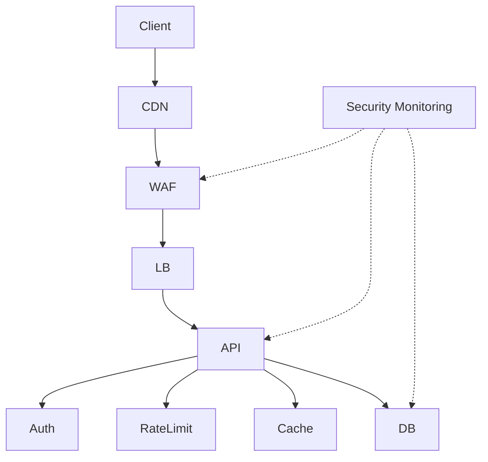

AI isə `.sdd` içində bunun qısa əlaqələrini saxlayır:

```text
WAF > LB > API > AUTH > DB
MON > WAF
MON > API
MON > DB
```

Human üçün diagram.

AI üçün compact graph.

Bu bizim əvvəlki **“insan çox anlasın, AI az token xərcləsin”** prinsipinə tam uyğundur.

---

# 14.16. Security gate task-a necə qoşulur?

Task:

```text
TASK-1023
```

deyir:

```text
Risk:
  HIGH

Impact:
  DB
  BE
  SECURITY
```

Security engine root rules-a baxır:

```text
HIGH + PAYMENT
```

və task üçün avtomatik:

```text
BDD
DB
BE
QA
SAST
DAST
API
SECURITY
VERIFY
```

chain yarada bilər.

Taskın özündə bunların hamısını yazmaq lazım deyil.

---

# 14.17. Əsas prinsip

Beləliklə:

```text
Task
```

deyir:

> Mən nə etməliyəm?

```text
Skill
```

deyir:

> Bunu necə etməliyəm?

```text
Workflow
```

deyir:

> Hansı ardıcıllıqla etməliyəm?

```text
Security
```

deyir:

> Hansı risklərə və security gates-ə tabeyəm?

```text
Project
```

deyir:

> Bunların hamısı mənim konkret layihəmdə haradadır?

```text
Docs
```

deyir:

> İnsan bunu necə başa düşməlidir?

Bu separation artıq bizim sistemin əsas fəlsəfəsinə çevrilir.

---

## PHASE 14 nəticəsi

Hazırda `.sdd` modelimiz:

```text
.sdd/
│
├── INDEX.sdd
│
├── skills/              # HOW
├── workflow/            # WHEN / ORDER
├── testing/             # VERIFY
├── security/            # RISK / SECURITY
├── architecture/        # DESIGN RULES
├── standards/           # GLOBAL RULES
│
└── project/             # PROJECT STATE
    ├── INDEX.sdd
    ├── PROJECT.sdd
    ├── tasks/
    ├── security/
    ├── decisions/
    ├── architecture/
    ├── domains/
    └── flows/
```

və human tərəf:

```text
docs/
├── tasks/
├── business/
├── developer/
├── qa/
├── security/
├── support/
└── infrastructure/
```

**Növbəti məntiqli phase: PHASE 15 — TESTING ENGINE.**

Orada BDD → Unit → Integration → API → E2E → UI → Mobile → Load → Performance → Security testlərini **bir-birindən ayırıb**, hansı project level-də hansının avtomatik seçiləcəyini və test failure olduqda Task Graph-a necə geri qayıdacağını qurmaq lazımdır.


________________________________________________________________________________________________
next
# PHASE 15 — TESTING ENGINE

Burada məqsəd sadəcə `testing/` qovluğu yaratmaq deyil. **Test sistemi Task → Code → Test → Failure → Fix → Retest zəncirinin avtomatik idarə olunmasını** təmin etməlidir.

Sənin əvvəl dediyin SDLC/STLC modelinə əsasən bunu bütün stack üçün qururuq: **BE, FE, MD, DB, Infrastructure və Security**.

---

## 15.1. Testing root-based olacaq

```text
.sdd/
├── testing/
│   ├── INDEX.sdd
│   ├── levels.sdd
│   ├── types.sdd
│   ├── gates.sdd
│   ├── bdd.sdd
│   ├── unit.sdd
│   ├── integration.sdd
│   ├── api.sdd
│   ├── e2e.sdd
│   ├── ui.sdd
│   ├── mobile.sdd
│   ├── performance.sdd
│   ├── load.sdd
│   └── contract.sdd
```

Bunlar **testin necə aparılacağını** izah edir.

Project isə test nəticələrini və project-specific məlumatları saxlayır:

```text
.sdd/project/
└── testing/
    ├── INDEX.sdd
    ├── coverage.sdd
    ├── runs/
    ├── failures/
    └── exceptions/
```

---

# 15.2. Test source code ilə qarışmamalıdır

Sənin əvvəlki prinsipinə uyğun:

```text
BE/internal/payment/refund.go
```

yanında:

```text
refund.md
refund.sdd
```

yaratmırıq.

Kod öz yerində qalır.

Test də layihənin normal test strukturunda qalır:

```text
BE/internal/payment/refund.go
BE/internal/payment/refund_test.go
```

və ya:

```text
FE/src/components/Refund.tsx
FE/tests/refund.spec.ts
```

`.sdd` isə testin **metadata və workflow məlumatını** saxlayır.

Bu, project-i təmiz saxlayır.

---

# 15.3. Test Engine nəyi müəyyən edir?

AI taskı oxuyur:

```text
TASK-1023
Impact:
  DB
  BE

Risk:
  HIGH
```

Sonra:

```text
testing/levels.sdd
testing/types.sdd
workflow/
security/
skills/
```

üzərindən qərar verir.

Məsələn:

```text
TASK-1023
    ↓
BDD
    ↓
Unit
    ↓
Integration
    ↓
API
    ↓
Security
    ↓
Regression
    ↓
Verify
```

Amma başqa task üçün:

```text
TASK-1000
FE
LOW
```

yalnız:

```text
Unit
↓
Component
↓
E2E
```

ola bilər.

---

# 15.4. BDD birinci-class citizen olacaq

Sənin dediyin:

> Business mindset → əvvəl BDD → sonra Code

bunu workflow səviyyəsində standartlaşdırırıq.

```text
Requirement
    ↓
BDD
    ↓
Implementation
    ↓
Automated Tests
    ↓
UI/API/E2E
    ↓
Manual Verification
```

BDD task başlamadan əvvəl acceptance behaviour formalaşdırır.

Məsələn Human:

```text
Given customer has sufficient balance
When customer requests refund
Then refund is created once
```

AI isə bunu compact şəkildə görə bilər:

```text
BDD:
  balance>=refund
  refund(req)=once
```

---

# 15.5. BDD və test eyni şey deyil

Bu fərqi sistemdə açıq saxlamalıyıq.

### BDD

> Sistem necə davranmalıdır?

### Unit

> Kiçik kod komponenti düzgün işləyir?

### Integration

> Komponentlər birlikdə düzgün işləyir?

### API

> API contract və behaviour düzgündür?

### E2E

> Real user/business flow işləyir?

### UI

> Interface düzgün davranır?

### Load

> Sistem yük altında işləyir?

### Security

> Sistem hücuma qarşı təhlükəsizdir?

---

# 15.6. Test pyramid

Root standard:

```text
                 E2E
                /   \
              API   UI
             /       \
       Integration   Contract
          /             \
        Unit           Component
```

Amma biz bunu rigid qayda etməyəcəyik.

AI project-ə görə dəyişə bilər.

Məsələn:

```text
Microservice:
Unit > Integration > Contract > API
```

Frontend:

```text
Unit > Component > E2E
```

Mobile:

```text
Unit > Integration > UI > E2E
```

---

# 15.7. Test Level

`testing/levels.sdd`:

```text
L0:
  smoke

L1:
  unit
  component

L2:
  integration
  api
  contract

L3:
  e2e
  ui
  mobile

L4:
  load
  performance
  resilience

L5:
  security
  pentest
  abuse
  disaster
```

Amma burada da bir düzəliş:

**L0-L5 universal test severity deyil.**

Project level və test depth ayrı anlayışlardır.

Məsələn:

```text
ProjectLevel: L3
SecurityLevel: L4
```

ola bilər.

Bu iki şeyi qarışdırmırıq.

---

# 15.8. Test Gate

Hər task bütün testləri keçmədən `DONE` olmamalıdır.

Məsələn:

```text
TASK-1023
```

üçün:

```text
BDD       PASS
UNIT      PASS
INTEGRATION PASS
API       PASS
SECURITY  PASS
VERIFY    PASS
```

olmalıdır.

Əgər:

```text
API FAIL
```

olarsa:

```text
TASK-1023
State:
  BLOCKED
```

olur.

---

# 15.9. Failure Task Graph-a qayıdır

Bu çox vacibdir.

```text
TASK-1023
    ↓
TEST
    ↓
FAIL
    ↓
FAILURE-004
    ↓
ROOT CAUSE
    ↓
FIX TASK
```

Məsələn:

```text
FAIL-004
Test:
  refund_concurrent_request

Result:
  duplicate refund

Origin:
  TASK-1023
```

Sonra AI qərar verir:

```text
Existing task?
```

Əgər bug həmin taskın daxilindədirsə:

```text
TASK-1023 → REWORK
```

Əgər ayrıca problem çıxıbsa:

```text
TASK-1042
Origin:
  FAIL-004
```

yaradır.

---

# 15.10. Failure ayrıca entity olmalıdır

Project:

```text
.sdd/project/testing/failures/
```

Məsələn:

```text
FAIL-004.sdd
```

Human:

```text
docs/qa/failures/FAIL-004.md
```

Eyni ID principle.

---

# 15.11. Test result ayrıca saxlanmalıdır

```text
.sdd/project/testing/runs/
```

Məsələn:

```text
RUN-20260822-001.sdd
```

```text
Run:
  RUN-20260822-001

Task:
  TASK-1023

Commit:
  abc123

Suite:
  API

Result:
  FAIL

Failures:
  FAIL-004
```

Bu artıq runtime/history-dir.

Task faylını hər test run-da dəyişdirməyə ehtiyac yoxdur.

---

# 15.12. Token economy

Burada vacib optimizasiya var.

AI hər dəfə:

```text
RUN-20260822-001
```

kimi bütün nəticələri oxumamalıdır.

`INDEX.sdd` yalnız:

```text
TASK-1023:
  test: FAIL
  failure: FAIL-004
```

deyə bilər.

AI yalnız lazım olanda:

```text
FAIL-004.sdd
```

oxuyur.

Bu **progressive disclosure** olacaq.

---

# 15.13. Test statusları

Standart:

```text
PENDING
RUNNING
PASS
FAIL
BLOCKED
SKIPPED
FLAKY
WAIVED
```

`WAIVED` isə yalnız müəyyən approval qaydasına uyğun bağlana bilər.

---

# 15.14. Flaky test ayrıca idarə olunmalıdır

Çox vacibdir.

Test:

```text
PASS
FAIL
PASS
FAIL
```

olursa bunu sadəcə `FAIL` kimi qəbul etmək düzgün deyil.

AI:

```text
FLAKY
```

işarələyir.

Sonra:

```text
FLAKY-007
```

yarana bilər.

Bu artıq ayrıca task-a çevrilə bilər:

```text
TASK-1051
Fix flaky payment integration test
```

---

# 15.15. Coverage da yalnız faiz deyil

AI:

```text
Coverage:
  87%
```

görüb “yaxşıdır” deməməlidir.

Daha düzgün:

```text
Coverage
+
Critical path coverage
+
Risk coverage
+
Mutation / behavioural confidence
```

Məsələn:

```text
Overall: 92%

Payment:
  98%

Auth:
  95%

Refund:
  61%  ← HIGH RISK
```

AI `92%`-ə aldanmamalıdır.

---

# 15.16. Test Impact Analysis

Bu sistemə çox güclü funksiya əlavə edək:

> Kodun hansı hissəsi dəyişibsə, yalnız ona bağlı testləri seç.

Məsələn:

```text
BE/internal/payment/refund
```

dəyişib.

AI graph-dan tapır:

```text
refund
 ↓
refund API
 ↓
payment service
 ↓
transaction
```

və uyğun testləri seçir:

```text
refund unit
refund integration
refund API
payment regression
security idempotency
```

Bütün 20.000 testin hamısını hər dəfə işə salmaq məcburi deyil.

Bu həm **vaxt**, həm **CI cost**, həm **token** qənaətidir.

---

# 15.17. Full regression nə vaxt?

Root workflow bunu müəyyən edir:

```text
PR:
  impacted tests

Merge:
  regression

Release:
  full regression

Critical release:
  regression + security + performance
```

Bu artıq çox daha real CI/CD modelidir.

---

# 15.18. Stack-aware testing

Sənin dediyin bütün texnologiyalar nəzərə alınır.

### BE

```text
Go
Laravel
Node
...
```

### FE

```text
React
Vue
Angular
TypeScript
```

### MD

```text
React Native
Flutter
```

### Test

```text
Playwright
Cypress
Jest
Vitest
Go test
PHPUnit
...
```

AI project-də hansı stack olduğunu `.sdd/project/PROJECT.sdd`-dən tapır və uyğun skill seçir.

---

# 15.19. Testing skill özü texnologiyaya bağlı deyil

Məsələn:

```text
@testing/unit
```

deyir:

> Unit test necə dizayn edilməlidir?

Sonra adapter:

```text
Go → testing
Laravel → PHPUnit
React → Vitest/Jest
Flutter → flutter_test
```

seçir.

Bu separation çox vacibdir:

```text
Testing principle
      ↓
Language/framework adapter
```

---

# 15.20. Human documentation

Testing docs:

```text
docs/qa/
├── INDEX.md
├── testing-strategy.md
├── test-pyramid.md
├── bdd.md
├── automation.md
├── regression.md
├── performance.md
├── failures/
└── runs/
```

Task docs isə yenə:

```text
docs/tasks/TASK-1023.md
```

qalır.

Test documentation task documentation-a qarışmır.

---

# 15.21. Diagram

Human üçün:

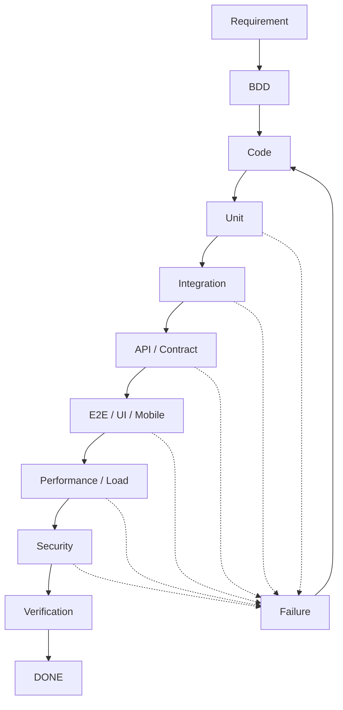

Bu diagramı daha sonra project architecture-dan avtomatik generate edə bilərik.

---

# 15.22. Ən vacib nəticə

Artıq Task Engine + Testing Engine birlikdə belə işləyir:

```text
TASK
 ↓
DEPENDENCY RESOLUTION
 ↓
BDD
 ↓
CODE
 ↓
UNIT
 ↓
INTEGRATION
 ↓
API / CONTRACT
 ↓
E2E / UI / MOBILE
 ↓
PERFORMANCE
 ↓
SECURITY
 ↓
VERIFY
 ↓
DONE
```

Problem çıxarsa:

```text
             ┌──────────────┐
             │    FAILURE   │
             └──────┬───────┘
                    ↓
              ROOT CAUSE
                    ↓
                 TASK
                    ↓
                  FIX
                    ↓
                 RETEST
```

Bu artıq sadəcə `.sdd` folder strukturu deyil.

**Bu, agentin SDLC/STLC execution modelinin nüvəsidir.**

---

## PHASE 15-dən sonra vəziyyət

```text
PHASE 13
Task Engine                 ✅

PHASE 14
Security Engine             ✅

PHASE 15
Testing Engine              ✅

NEXT
PHASE 16
Architecture & Decision Engine
```

Növbəti phase-də ən vacib məsələlərdən biri olacaq: **AI layihənin ölçüsünü, DAU/MAU, traffic, data, latency, availability, SPOF, team capacity və budget-i analiz edib “modular monolith kifayətdir, yoxsa microservice lazımdır?” qərarını necə verməlidir.**

Bu da sənin əvvəl dediyin **“kiçik layihəyə süni microservice/DDD qurmasın, böyük sistemə də sadə CRUD kimi yanaşmasın”** problemini həll edəcək.


________________________________________________________________________________________________
next
# PHASE 16 — ARCHITECTURE & DECISION ENGINE

Bu phase bizim sistemin ən vacib hissələrindən biridir. Çünki artıq agentdə:

* Task Engine
* Workflow Engine
* Testing Engine
* Security Engine
* Skills

var.

İndi agent bunların hamısından istifadə edib **“bu layihə necə qurulmalıdır?”** qərarını verməlidir.

Əsas prinsip:

> **AI texnologiya seçməməlidir; əvvəl problemi və məhdudiyyətləri analiz etməli, sonra uyğun arxitekturanı seçməlidir.**

---

## 16.1. Architecture root-based

```text
.sdd/
├── architecture/
│   ├── INDEX.sdd
│   ├── levels.sdd
│   ├── patterns.sdd
│   ├── scaling.sdd
│   ├── data.sdd
│   ├── availability.sdd
│   ├── observability.sdd
│   ├── networking.sdd
│   └── deployment.sdd
```

Buradakı fayllar:

> **Architecture knowledge**

olacaq.

Project-specific architecture isə:

```text
.sdd/project/architecture/
├── INDEX.sdd
├── system.sdd
├── components.sdd
├── data.sdd
├── infrastructure.sdd
└── diagrams/
```

---

# 16.2. Architecture Decision ≠ Skill

Bu fərqi çox dəqiq saxlamalıyıq.

### Skill

```text
@cache
@postgres
@redis
@microservice
@kubernetes
```

deyir:

> Bu texnologiya/prinsip necə istifadə olunur?

### Decision

deyir:

> Bu layihədə bunu niyə istifadə edirik?

Məsələn:

```text
Decision:
  Redis istifadə olunur.

Reason:
  Session və hot-read workload.

Rejected:
  PostgreSQL-only cache.

Tradeoff:
  Additional infrastructure.
```

---

# 16.3. Decision project-owned olacaq

```text
.sdd/project/decisions/
├── INDEX.sdd
├── DEC-001.sdd
├── DEC-002.sdd
└── DEC-003.sdd
```

Human:

```text
docs/decisions/
├── INDEX.md
├── DEC-001.md
├── DEC-002.md
└── DEC-003.md
```

Yenə 1:1 ID:

```text
DEC-003.sdd
      ↕
DEC-003.md
```

---

# 16.4. Architecture qərarı necə yaranır?

Agent:

```text
INPUT
 ↓
Requirements
 ↓
Business constraints
 ↓
Technical constraints
 ↓
Scale
 ↓
Risk
 ↓
Team capability
 ↓
Budget
 ↓
Security
 ↓
Availability
 ↓
Architecture options
 ↓
Trade-off analysis
 ↓
Decision
```

Yəni:

**“Go yaxşıdır, microservice yaxşıdır”** deyib birbaşa qərar vermir.

---

# 16.5. Project Level

Bunu əvvəlki level-lərlə qarışdırmamaq üçün:

```text
ProjectScale:
  L0
  L1
  L2
  L3
  L4
  L5
```

təklif edirəm.

### L0 — Prototype

```text
single app
local DB
minimal infrastructure
```

### L1 — Small

```text
modular application
single DB
basic cache
basic CI/CD
```

### L2 — Production

```text
modular architecture
HA considerations
observability
backup
security
```

### L3 — Large

```text
high traffic
scaling
distributed components
advanced caching
queues
```

### L4 — Critical

```text
HA
multi-zone
disaster recovery
strong security
failure isolation
```

### L5 — Massive / mission-critical

```text
multi-region
advanced resilience
strict compliance
extreme scale
```

---

# 16.6. Amma AI yalnız “DAU” ilə qərar verməməlidir

Məsələn:

```text
1M DAU
```

avtomatik:

```text
MICROSERVICE
```

demək deyil.

Agent bunlara baxmalıdır:

```text
DAU
MAU
RPS
Peak RPS
Concurrent users
Payload size
Data growth
Read/write ratio
Latency
Availability
SLA
RPO
RTO
Team size
Budget
Deployment model
Security
Compliance
```

---

# 16.7. Architecture Decision Matrix

AI variantları müqayisə edir.

Məsələn:

| Variant          | Complexity |     Scale |     Cost |   Team |    Ops |
| ---------------- | ---------: | --------: | -------: | -----: | -----: |
| Monolith         |        Low |    Medium |      Low |    Low |    Low |
| Modular Monolith |     Medium |      High |      Low | Medium |    Low |
| Microservices    |       High | Very High |     High |   High |   High |
| Serverless       |     Medium |      High | Variable | Medium | Medium |

Sonra:

```text
Requirement
+
Constraints
+
Trade-offs
=
Architecture
```

---

# 16.8. Sənin “Laravel vendor” nümunən

Məsələn mövcud:

```text
Laravel
vendor/
10 GB
```

var.

Agent bunu görür.

Amma dərhal:

> Microservice-ə bölək.

demir.

Əvvəl analiz:

```text
vendor:
  runtime dependency

question:
  Is vendor duplicated across services?
```

Sonra variantlar:

### A

```text
Each service builds own image
```

### B

```text
Shared base image
```

### C

```text
Build artifact
```

### D

```text
Extract actual bounded component
```

və qərar:

```text
Keep vendor inside service image
```

və ya:

```text
Shared immutable base image
```

kimi çıxır.

Çünki `vendor/`-u ayrıca runtime service kimi düşünmək səhv ola bilər.

---

# 16.9. Architecture pattern selection

Root:

```text
.sdd/architecture/patterns.sdd
```

AI burada pattern catalog oxuyur:

```text
Modular Monolith
Monolith
Microservices
Event Driven
CQRS
Event Sourcing
Serverless
Hexagonal
Clean Architecture
Layered
DDD
```

Amma bunların hamısı **default deyil**.

---

# 16.10. Pattern selection rules

Məsələn:

```text
IF
  small team
  low traffic
  low complexity

THEN
  prefer modular monolith
```

və:

```text
IF
  independent scaling
  independent deployment
  strong domain boundaries
  organizational ownership

THEN
  consider microservices
```

və:

```text
IF
  event-driven workload
  asynchronous processing
  eventual consistency acceptable

THEN
  consider event-driven architecture
```

---

# 16.11. “Overengineering Gate”

Bu sistemə xüsusi gate əlavə etməyi məsləhət görürəm:

```text
.sdd/architecture/gates/overengineering.sdd
```

AI architecture seçəndə soruşur:

```text
Does this architecture introduce complexity
without measurable business/technical benefit?
```

Əgər:

```text
2 developer
500 users
CRUD application
```

üçün:

```text
Kubernetes
Kafka
20 microservices
CQRS
Event Sourcing
Service Mesh
```

təklif edilirsə:

```text
OVERENGINEERING
```

flag-i çıxır.

---

# 16.12. Underengineering də olmalıdır

Əks halda digər tərəfdən problem yaranar.

```text
.sdd/architecture/gates/underengineering.sdd
```

Məsələn:

```text
500k RPS
99.99 SLA
financial transaction
```

üçün:

```text
single VPS
single DB
no backup
no HA
```

çıxırsa:

```text
UNDERENGINEERING
```

---

# 16.13. SPOF Engine

Bu ayrıca vacibdir.

Architecture:

```text
Client
 ↓
API
 ↓
DB
```

AI görür:

```text
DB = SPOF
```

Əgər requirement:

```text
99.99%
```

dirsə, qərar yenidən qiymətləndirilir.

Amma:

```text
internal tool
99.0%
```

üçün single DB qəbul edilə bilər.

Yəni:

> SPOF özü səhv deyil; **tələbə uyğun olmayan SPOF səhvdir.**

---

# 16.14. Availability

Architecture Engine:

```text
Availability:
  99%
  99.9%
  99.95%
  99.99%
  99.999%
```

və:

```text
RTO
RPO
```

ilə birlikdə baxır.

Məsələn:

```text
RTO:
  1 hour

RPO:
  15 min
```

onda backup/restore architecture buna uyğun seçilir.

---

# 16.15. Infrastructure decision

AI:

```text
VPS
AWS
Azure
GCP
On-prem
Hybrid
```

arasında seçim edə bilər.

Amma:

> AWS modern olduğu üçün AWS.

deməməlidir.

Baxmalıdır:

```text
Budget
Team
Region
Compliance
Existing infrastructure
Vendor lock-in
Scaling
Managed services
Operational burden
```

---

# 16.16. Deployment architecture

Project-specific:

```text
.sdd/project/infrastructure/
```

məsələn:

```text
deployment.sdd
network.sdd
compute.sdd
database.sdd
storage.sdd
observability.sdd
```

Human:

```text
docs/infrastructure/
├── deployment.md
├── network.md
├── database.md
├── storage.md
└── observability.md
```

---

# 16.17. Cloud adapter

Root:

```text
.sdd/architecture/providers/
├── vps.sdd
├── aws.sdd
├── azure.sdd
├── gcp.sdd
└── onprem.sdd
```

Agent qərar verir:

```text
Provider:
  AWS
```

onda AWS-specific skill və docs aktiv olur.

VPS seçilərsə:

```text
VPS skill
```

aktiv olur.

Beləliklə bütün cloud məlumatlarını hər project-ə yükləmirik.

Bu da token qənaətidir.

---

# 16.18. Architecture diagram generation

Project architecture-dan:

```text
.sdd/project/architecture/system.sdd
```

AI Human docs üçün Mermaid yarada bilər:

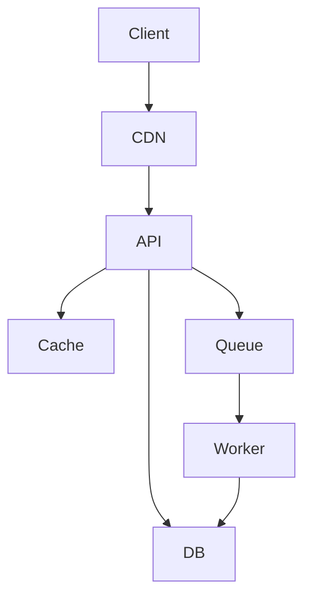

Amma `.sdd` özü:

```text
CLIENT>CDN>API
API>CACHE
API>DB
API>QUEUE
QUEUE>WORKER
WORKER>DB
```

kimi compact qala bilər.

---

# 16.19. Diagram relationship

Burada sənin əvvəlki istəyini də bağlayırıq.

Human diagram elementləri kodla əlaqələndirilə bilər:

```text
API
  code:
    BE/internal/api

RefundService
  code:
    BE/internal/payment/refund

DB
  code:
    PostgreSQL/payment
```

Beləliklə human diagram-a baxır:

```text
RefundService
```

və agentə deyir:

> Bu hansı kodla bağlıdır?

Agent:

```text
BE/internal/payment/refund
```

tapır.

Bu **architecture → code traceability**-dir.

---

# 16.20. Decision lifecycle

Decision:

```text
PROPOSED
 ↓
ANALYZED
 ↓
APPROVED
 ↓
ACTIVE
 ↓
SUPERSEDED
 ↓
RETIRED
```

Məsələn:

```text
DEC-003
```

əvvəl:

```text
Redis
```

sonra yeni decision:

```text
DEC-017
```

ilə:

```text
KeyDB
```

əvəzlənirsə:

```text
DEC-003:
  SUPERSEDED BY DEC-017
```

olur.

Köhnə qərarı silmirik.

Çünki **niyə bu sistem belə qurulub?** sualının cavabı gələcəkdə lazım olacaq.

---

# 16.21. Human decision document

```text
docs/decisions/DEC-017.md
```

formatı:

```markdown
# DEC-017 — Introduce Redis Cache

## Decision

Redis will be used for high-frequency read caching.

## Context

The PostgreSQL read workload increased significantly.

## Alternatives

### PostgreSQL only
Pros:
- Simple

Cons:
- Higher DB load

### Redis
Pros:
- Lower DB load
- Low latency

Cons:
- Additional infrastructure

### In-memory application cache
Pros:
- Very simple

Cons:
- Not shared across instances

## Why Redis

The application will run multiple instances,
therefore local memory is insufficient.

## Consequences

Positive:
- Lower DB load
- Better latency

Negative:
- Additional operational component
```

Bu artıq manager/developer/support üçün çox dəyərlidir.

---

# 16.22. Architecture Engine-in əsas qərarı

Agent sonda belə bir nəticə çıxarmalıdır:

```text
Project:
  Edunexus

Scale:
  L2

Architecture:
  Modular Monolith

Backend:
  Go

Database:
  PostgreSQL

Cache:
  Redis

Queue:
  Not required

Frontend:
  React

Mobile:
  React Native

Deployment:
  Docker + VPS

CI/CD:
  GitHub Actions

Observability:
  Logs + Metrics

Security:
  L3

HA:
  Basic

Reason:
  Current scale does not justify microservices.
```

Bu **final architecture instance** olur.

---

# 16.23. Ən vacib prinsip

Architecture Engine:

```text
Skills
+
Standards
+
Project input
+
Existing code
+
Constraints
+
Scale
+
Risk
+
Budget
```

→

```text
ARCHITECTURE INSTANCE
```

yaradır.

Yəni `.sdd/` sadəcə əvvəlcədən hazırlanmış architecture template deyil.

**AI onu layihəyə görə instantiate edir.**

Bu sənin bütün sistem ideyanın mərkəzidir.

---

## İndiki ümumi progress

```text
PHASE 13  Task Engine                 ✅
PHASE 14  Security Engine             ✅
PHASE 15  Testing Engine              ✅
PHASE 16  Architecture & Decisions    ✅
```

Növbəti:

### **PHASE 17 — STACK & TECHNOLOGY ENGINE**

Burada artıq ayrıca **BE / FE / MD / DB / DevOps / QA / Security** üçün technology selection modelini quracağıq.

Məsələn project input-da sadəcə:

```text
"web + mobile education platform"
```

yazılsa, agent:

```text
BE → Go
FE → React
MD → React Native
DB → PostgreSQL
Cache → Redis
Testing → Playwright + Go test
CI/CD → GitHub Actions
Runtime → Docker
```

kimi qərarı **skill-lər + architecture + project constraints** əsasında çıxarmalıdır — və `Go/React/React Native` kimi konkret seçimləri systemə kor-koranə hard-code etməməliyik.


________________________________________________________________________________________________
next

# PHASE 17 — STACK & TECHNOLOGY ENGINE

Bu phase-də məqsəd **“AI hansı texnologiyanı sevir?”** deyil.

Məqsəd:

> **Project requirement → Architecture → Constraints → Technology selection → Implementation stack**

olmalıdır.

Yəni agent sabah başqa layihədə Go yox, məsələn Java/Kotlin/.NET seçə bilməlidir.

---

## 17.1. Əsas prinsip

Əvvəlki phase-ləri belə bağlayırıq:

```text
INPUT
  ↓
PROJECT ANALYSIS
  ↓
ARCHITECTURE
  ↓
TECHNOLOGY SELECTION
  ↓
WORKFLOW
  ↓
TASKS
  ↓
CODE
  ↓
TEST
  ↓
SECURITY
  ↓
DEPLOY
```

Technology seçimi **architecture-dan əvvəl olmamalıdır**.

---

# 17.2. Stack root-based

```text
.sdd/
├── stack/
│   ├── INDEX.sdd
│   ├── languages.sdd
│   ├── backend.sdd
│   ├── frontend.sdd
│   ├── mobile.sdd
│   ├── database.sdd
│   ├── cache.sdd
│   ├── messaging.sdd
│   ├── testing.sdd
│   ├── infrastructure.sdd
│   └── observability.sdd
```

Bunlar technology knowledge-dır.

Project:

```text
.sdd/project/
└── stack/
    ├── INDEX.sdd
    ├── backend.sdd
    ├── frontend.sdd
    ├── mobile.sdd
    ├── database.sdd
    ├── testing.sdd
    └── infrastructure.sdd
```

Burada artıq **seçilmiş technology instance** saxlanır.

---

# 17.3. Language catalog

```text
.sdd/stack/languages.sdd
```

Məsələn:

```text
Go
Java
Kotlin
C#
PHP
Python
Rust
TypeScript
Dart
Swift
```

Amma hər biri üçün:

```text
Pros
Cons
BestFor
AvoidWhen
Performance
Ecosystem
Hiring
Testing
Security
OperationalCost
```

kimi metadata ola bilər.

---

# 17.4. Framework catalog

Backend:

```text
Go:
  net/http
  Gin
  Echo
  Fiber

PHP:
  Laravel
  Symfony

Java:
  Spring Boot

.NET:
  ASP.NET Core
```

Frontend:

```text
React
Vue
Angular
Svelte
```

Mobile:

```text
React Native
Flutter
Swift
Kotlin Multiplatform
```

Testing:

```text
Playwright
Cypress
Vitest
Jest
Go testing
PHPUnit
```

Infrastructure:

```text
Docker
Kubernetes
Nomad
Terraform
Ansible
```

---

# 17.5. Technology selection score

AI texnologiyanı sadəcə adla seçməməlidir.

Məsələn:

```text
TechnologyScore =
  RequirementFit
  + ArchitectureFit
  + TeamFit
  + Ecosystem
  + Performance
  + Security
  + OperationalFit
  + Cost
  + Maintainability
```

Amma score-lar hard-coded universal həqiqət kimi qəbul edilməməlidir.

Onlar **decision aid**-dir.

Final qərarın səbəbi ayrıca yazılmalıdır.

---

# 17.6. Example

Project:

```text
High-performance API
Financial transactions
Small engineering team
Moderate traffic
```

Agent:

```text
Go
Java
C#
PHP
```

variantlarını analiz edə bilər.

Sonra:

```text
Selected:
Go

Why:
- Strong concurrency model
- Simple deployment
- Good performance
- Team capability
- Existing ecosystem fit
```

və:

```text
Rejected:
Java

Reason:
Higher operational complexity for current team
without sufficient business benefit.
```

Bu qərar `.sdd/project/stack/backend.sdd`-də saxlanır.

---

# 17.7. Technology selection Human doc

```text
docs/architecture/technology.md
```

məsələn:

```markdown
# Technology Decisions

## Backend

Selected: Go

### Why

- High concurrency requirements
- Small runtime footprint
- Simple container deployment
- Existing team expertise

### Alternatives

PHP/Laravel:
- Faster CRUD development
- Larger existing ecosystem
- Less suitable for current workload

Java/Spring:
- Excellent enterprise ecosystem
- Higher operational complexity for this project
```

---

# 17.8. Technology ≠ Architecture

Bu distinction vacibdir.

```text
Modular Monolith
```

architecture-dir.

```text
Go
```

language-dir.

```text
Gin
```

framework-dir.

```text
PostgreSQL
```

database-dir.

```text
Redis
```

cache-dir.

```text
Docker
```

runtime/deployment technology-dir.

Bunları bir-birinə qarışdırmırıq.

---

# 17.9. Stack compatibility

Agent yalnız ayrı-ayrı texnologiyaları yox, **birlikdə işləməsini** də yoxlamalıdır.

Məsələn:

```text
Go
+
PostgreSQL
+
Redis
+
RabbitMQ
+
Docker
```

uyğunluğunu yoxlayır.

Sonra:

```text
Observability
Testing
Security
CI/CD
```

ilə də uyğunluq yoxlanır.

---

# 17.10. Dependency graph

Stack-in öz graph-ı ola bilər:

```text
Go
 ↓
HTTP
 ↓
PostgreSQL
 ↓
Redis
 ↓
Docker
 ↓
CI/CD
```

və:

```text
React
 ↓
API
 ↓
Auth
 ↓
Backend
```

Bu graph sonradan architecture diagram-a qoşulur.

---

# 17.11. Version policy

Bu hissə çox vacibdir.

AI:

```text
Go
React
PostgreSQL
```

seçib bitirməməlidir.

Məsələn:

```text
Go:
  version policy: current stable

React:
  version policy: current supported

PostgreSQL:
  version policy: supported LTS/current
```

kimi policy olmalıdır.

**Hard-coded version-ları `.sdd`-də uzun müddət saxlamaq istəmirik.**

Çünki technology köhnəlir.

---

# 17.12. Skill freshness

Sənin əvvəlki istəyini burada həyata keçiririk.

Root:

```text
.sdd/stack/
```

technology metadata-sında:

```text
Freshness:
  CURRENT

Review:
  2026-08

NextReview:
  2026-11
```

ola bilər.

Agent:

```text
"Update technology skills"
```

deyildikdə:

```text
Search
 ↓
Compare current best practices
 ↓
Check deprecations
 ↓
Check security
 ↓
Check ecosystem
 ↓
Update skill
```

pros/cons-u yenidən qiymətləndirir.

---

# 17.13. Amma AI skill-i özbaşına dəyişməməlidir

Bu çox vacib safeguard-dır.

AI tapır:

```text
Technology changed
```

Amma dərhal:

```text
.sdd/stack/go.sdd
```

dəyişmir.

Əvvəl:

```text
Proposal
```

yaradır:

```text
TECH-UPDATE-004
```

Human approval tələb edən qərarlar ayrıca müəyyən edilir.

---

# 17.14. Technology lifecycle

```text
CANDIDATE
 ↓
EVALUATING
 ↓
SELECTED
 ↓
SUPPORTED
 ↓
DEPRECATED
 ↓
MIGRATION
 ↓
RETIRED
```

Beləliklə:

```text
Angular
```

project-də hələ istifadə olunursa:

```text
SUPPORTED
```

ola bilər.

Amma yeni project üçün:

```text
DEPRECATED_FOR_NEW_PROJECTS
```

kimi policy ola bilər.

Bu daha realdır.

---

# 17.15. FE / BE / MD ayrı yox, bütün stack analiz edilir

Sənin xüsusi istəyinə uyğun:

```text
Stack Analysis
├── Backend
├── Frontend
├── Mobile
├── Database
├── Cache
├── Messaging
├── Storage
├── Testing
├── Security
├── DevOps
├── Observability
└── Documentation
```

Agent yalnız:

> BE hazırdır.

deyib işi bitirməyəcək.

FE və MD-də də uyğunluq yoxlanacaq.

---

# 17.16. Cross-layer impact

Məsələn:

```text
Backend
```

də auth dəyişdi.

Agent graph-dan tapır:

```text
BE Auth
 ↓
FE Auth
 ↓
Mobile Auth
 ↓
API Contract
 ↓
E2E
 ↓
Security
 ↓
Documentation
```

və lazımi task-ları açır.

Bu, sənin:

> BE düzəldi, FE yadımızdan çıxdı, sabah mobile qırıldı

problemini həll edir.

---

# 17.17. Contract-first dependency

API dəyişiklikləri üçün:

```text
API Contract
```

ayrıca entity ola bilər.

```text
.sdd/project/contracts/
├── INDEX.sdd
├── auth.sdd
├── users.sdd
└── payments.sdd
```

Human:

```text
docs/contracts/
```

Agent API dəyişəndə:

```text
BE
 ↓
Contract
 ↓
FE
 ↓
MD
 ↓
Tests
```

impact analysis edir.

---

# 17.18. Breaking change detection

Məsələn:

```text
GET /users/{id}
```

əvvəl:

```json
{
  "id": 1,
  "name": "Rasim"
}
```

qaytarırdı.

Sonra:

```json
{
  "user": {
    "id": 1,
    "name": "Rasim"
  }
}
```

oldu.

Agent contract graph-dan görür:

```text
BREAKING CHANGE
```

və avtomatik:

```text
FE task
MD task
API test
E2E test
Docs update
```

çıxara bilər.

---

# 17.19. Technology matrix

Project Human docs-da:

```text
docs/architecture/stack.md
```

belə görünə bilər:

| Layer   | Technology     | Why         | Alternatives |
| ------- | -------------- | ----------- | ------------ |
| BE      | Go             | Concurrency | Java, C#     |
| FE      | React          | Ecosystem   | Vue          |
| MD      | React Native   | Shared TS   | Flutter      |
| DB      | PostgreSQL     | Relational  | MySQL        |
| Cache   | Redis          | Low latency | Valkey       |
| Test    | Playwright     | E2E         | Cypress      |
| Runtime | Docker         | Portability | VM           |
| CI/CD   | GitHub Actions | Integration | GitLab CI    |

---

# 17.20. Architecture → Stack → Skills

Burada sistemin çox güclü hissəsi yaranır:

```text
PROJECT
   ↓
ARCHITECTURE
   ↓
STACK
   ↓
REQUIRED SKILLS
   ↓
WORKFLOW
   ↓
TASK
```

Məsələn:

```text
PostgreSQL
```

seçildi.

Agent avtomatik aktiv edir:

```text
@database/postgresql
@database/indexing
@database/transactions
@database/migrations
@testing/database
@security/database
```

Amma hamısını hər task-a yükləmir.

**Task impact əsasında yalnız lazım olan skill-ləri seçir.**

Bu token qənaətinin əsas mexanizmlərindən biridir.

---

# 17.21. Skill loading strategy

Agent:

```text
Task:
  Refund idempotency
```

üçün:

```text
@database/postgresql
@database/transactions
@backend/idempotency
@security/payment
@testing/concurrency
```

yükləyir.

Amma:

```text
@frontend/vue
@mobile/flutter
@kubernetes
```

yükləmir.

Çünki task üçün lazım deyil.

Bu:

> **Contextual Skill Loading**

olacaq.

---

# 17.22. Technology decision də Task-a bağlanır

Məsələn:

```text
DEC-017
Redis selection
```

ilə:

```text
TASK-1044
Implement Redis cache
```

arasında:

```text
DEC-017
   ↓
TASK-1044
```

relationship olur.

Beləliklə kodun niyə Redis istifadə etdiyini gələcəkdə tapmaq mümkündür.

---

# 17.23. Full traceability

Artıq sistemdə:

```text
PROMPT
  ↓
REQUIREMENT
  ↓
DECISION
  ↓
ARCHITECTURE
  ↓
STACK
  ↓
TASK
  ↓
CODE
  ↓
TEST
  ↓
SECURITY
  ↓
DEPLOYMENT
  ↓
RUNTIME
```

traceability yaradırıq.

Məsələn manager soruşur:

> Bu Redis niyə var?

Agent:

```text
DEC-017
 ↓
Architecture requirement
 ↓
High read workload
 ↓
TASK-1044
 ↓
BE/cache
 ↓
Tests
```

gedib səbəbi göstərə bilir.

---

# 17.24. PHASE 17 nəticəsi

Yeni struktur:

```text
.sdd/
├── stack/
│   ├── INDEX.sdd
│   ├── languages.sdd
│   ├── backend.sdd
│   ├── frontend.sdd
│   ├── mobile.sdd
│   ├── database.sdd
│   ├── cache.sdd
│   ├── messaging.sdd
│   ├── testing.sdd
│   ├── infrastructure.sdd
│   └── observability.sdd
│
└── project/
    └── stack/
        ├── INDEX.sdd
        ├── backend.sdd
        ├── frontend.sdd
        ├── mobile.sdd
        ├── database.sdd
        ├── testing.sdd
        └── infrastructure.sdd
```

Human:

```text
docs/
├── architecture/
│   ├── stack.md
│   └── technology.md
│
├── decisions/
└── contracts/
```

---

## Progress

```text
PHASE 13  Task Engine                    ✅
PHASE 14  Security Engine                ✅
PHASE 15  Testing Engine                 ✅
PHASE 16  Architecture & Decision Engine ✅
PHASE 17  Stack & Technology Engine      ✅
```

### Növbəti: **PHASE 18 — SDLC / WORKFLOW ORCHESTRATOR**

Burada artıq ayrı-ayrı engine-ləri birləşdirəcəyik:

```text
Requirement
    ↓
Analysis
    ↓
Architecture
    ↓
Stack
    ↓
Decision
    ↓
BDD
    ↓
Task
    ↓
Development
    ↓
Review
    ↓
Testing
    ↓
Security
    ↓
Infrastructure
    ↓
Deployment
    ↓
Monitoring
    ↓
Feedback
    ↺
```

və ən vacibi: **agent hər project üçün bu chain-in hansı hissələrinin lazım olduğunu özü seçəcək**, kiçik project-i lazımsız SDLC ilə boğmayacaq, kritik project-i də sadələşdirib təhlükəyə atmayacaq.


________________________________________________________________________________________________
next

# PHASE 18 — SDLC / WORKFLOW ORCHESTRATOR

Bu phase əvvəl yaratdığımız bütün engine-ləri **bir icra sisteminə** bağlayır.

Əsas məqsəd:

> AI hər layihədə eyni uzun workflow-u kor-koranə işlətməsin. Project-i analiz etsin, lazım olan mərhələləri seçsin, ardıcıllığı qursun və hər mərhələnin nəticəsini növbəti mərhələyə ötürsün.

---

## 18.1. Workflow artıq root-da ayrıca sistemdir

Sənin son qərarına uyğun:

```text
.sdd/
├── workflow/
│   ├── INDEX.sdd
│   ├── lifecycle.sdd
│   ├── stages.sdd
│   ├── gates.sdd
│   ├── transitions.sdd
│   ├── dependencies.sdd
│   ├── recovery.sdd
│   └── policies.sdd
│
└── project/
    └── workflow/
        ├── INDEX.sdd
        ├── lifecycle.sdd
        ├── active.sdd
        └── exceptions.sdd
```

Burada:

* `.sdd/workflow` → **workflow qaydaları**
* `.sdd/project/workflow` → **bu project-də seçilmiş workflow**

olur.

---

# 18.2. Workflow chain

Standart lifecycle:

```text
DISCOVER
   ↓
ANALYZE
   ↓
ARCHITECT
   ↓
DECIDE
   ↓
PLAN
   ↓
BDD
   ↓
DEVELOP
   ↓
REVIEW
   ↓
TEST
   ↓
SECURITY
   ↓
DEPLOY
   ↓
OBSERVE
   ↓
VERIFY
   ↓
DONE
```

Amma bu **default catalog**-dur.

Project üçün hamısı aktiv olmaq məcburiyyətində deyil.

---

# 18.3. Project-specific workflow

Məsələn sadə internal tool:

```text
ANALYZE
 ↓
PLAN
 ↓
BDD
 ↓
DEVELOP
 ↓
TEST
 ↓
REVIEW
 ↓
DEPLOY
 ↓
VERIFY
```

Security ayrıca:

```text
SECURITY:
  BASIC
```

ola bilər.

---

Böyük payment system:

```text
DISCOVER
 ↓
ANALYZE
 ↓
ARCHITECT
 ↓
SECURITY DESIGN
 ↓
DECIDE
 ↓
PLAN
 ↓
BDD
 ↓
DEVELOP
 ↓
CODE REVIEW
 ↓
UNIT
 ↓
INTEGRATION
 ↓
CONTRACT
 ↓
E2E
 ↓
SECURITY TEST
 ↓
PENTEST
 ↓
LOAD
 ↓
DEPLOY
 ↓
OBSERVE
 ↓
VERIFY
```

---

# 18.4. Workflow Engine-in əsas prinsipi

Workflow:

```text
Stage
```

və:

```text
Gate
```

anlayışlarını ayırır.

### Stage

> İş görülür.

### Gate

> Növbəti mərhələyə keçməyə icazə varmı?

Məsələn:

```text
DEVELOP
   ↓
TEST
```

amma:

```text
TEST PASS?
```

yoxdursa:

```text
BLOCKED
```

---

# 18.5. Gate sistemi

```text
.sdd/workflow/gates.sdd
```

məsələn:

```text
BDD_GATE
CODE_GATE
REVIEW_GATE
TEST_GATE
SECURITY_GATE
DEPLOY_GATE
VERIFY_GATE
```

Hər gate:

```text
Required
Optional
Conditional
```

ola bilər.

---

# 18.6. Conditional gates

Ən vacib hissələrdən biridir.

Məsələn:

```text
IF
  payment=true

THEN
  SECURITY_GATE = REQUIRED
  PENTEST = REQUIRED
```

Amma:

```text
IF
  internal-tool=true

THEN
  PENTEST = OPTIONAL
```

Beləliklə workflow project context-ə uyğunlaşır.

---

# 18.7. Workflow selection

Agent əvvəl:

```text
PROJECT.sdd
```

oxuyur.

Məsələn:

```text
Type:
  payment

Scale:
  L4

Security:
  high

Availability:
  99.99

Data:
  financial
```

sonra workflow generator:

```text
workflow:
  strict
```

seçir.

---

# 18.8. Kiçik project nümunəsi

```text
Project:
  landing page

Scale:
  L0
```

Workflow:

```text
ANALYZE
 ↓
IMPLEMENT
 ↓
UI TEST
 ↓
VERIFY
```

Burada:

```text
Kafka
Kubernetes
Pentest
Multi-region
Disaster Recovery
```

gətirmək qadağan deyil, amma **default olaraq aktiv deyil**.

---

# 18.9. Böyük project nümunəsi

```text
Project:
  Payment platform

Scale:
  L4

Security:
  Critical
```

workflow:

```text
ANALYZE
 ↓
ARCHITECTURE
 ↓
SECURITY DESIGN
 ↓
BDD
 ↓
IMPLEMENT
 ↓
REVIEW
 ↓
UNIT
 ↓
INTEGRATION
 ↓
CONTRACT
 ↓
E2E
 ↓
SECURITY
 ↓
LOAD
 ↓
PENTEST
 ↓
DEPLOY
 ↓
OBSERVE
 ↓
VERIFY
```

---

# 18.10. Workflow dependency graph

Burada sadə sıra kifayət deyil.

Məsələn:

```text
1000
1001
1011
1023
```

task graph-ı kimi workflow da dependency graph olacaq.

```text
BDD
 ↓
CODE
 ↓
UNIT
 ↓
INTEGRATION
      ↘
       API
        ↓
       E2E
        ↓
     SECURITY
        ↓
      VERIFY
```

Agent dependency-ləri analiz edir.

---

# 18.11. Task execution isə sənin son dediyin modelə uyğun qalır

Məsələn:

```text
1000

1001 → 1011 → 1023
```

1023 oxunur:

```text
1023 → 999
```

Agent görür:

```text
999 = free
```

onda:

```text
999
 ↓
1023
 ↓
1011
 ↓
1001
```

icra edir.

Yəni **dependency resolution + workflow stage** bir-birindən ayrı qalır.

---

# 18.12. Bu distinction çox vacibdir

```text
TASK GRAPH
```

deyir:

> Hansı iş hansı işdən asılıdır?

```text
WORKFLOW GRAPH
```

deyir:

> Bu iş hansı mərhələlərdən keçməlidir?

Məsələn:

```text
TASK-1023
```

üçün:

```text
TASK dependency:
  1023 → 999
```

Workflow:

```text
BDD
 ↓
CODE
 ↓
TEST
 ↓
SECURITY
 ↓
VERIFY
```

Bunları qarışdırmırıq.

---

# 18.13. Workflow state machine

Project workflow state-ləri:

```text
PLANNED
READY
RUNNING
WAITING
BLOCKED
FAILED
REWORK
VERIFYING
COMPLETED
CANCELLED
```

Task isə öz state-lərinə malikdir.

---

# 18.14. Recovery

Burada agentin “problem oldu, indi nə edim?” hissəsi yaranır.

```text
TEST FAIL
   ↓
ANALYZE FAILURE
   ↓
KNOWN ISSUE?
   ├── YES → APPLY EXISTING FIX
   └── NO
         ↓
      ROOT CAUSE
         ↓
      NEW TASK
```

---

# 18.15. Retry policy

Məsələn:

```text
Attempts:
  0/3
```

amma hər problem retry edilməməlidir.

### Retry edilə bilər

```text
network timeout
temporary CI failure
container startup race
```

### Retry edilməməlidir

```text
compile error
assertion failure
security violation
wrong architecture
missing requirement
```

Bu qərarı:

```text
.sdd/workflow/recovery.sdd
```

müəyyən edir.

---

# 18.16. Human intervention

Agent hər şeyi özü dəyişməməlidir.

Bəzi state-lər:

```text
AUTO
```

bəzi:

```text
REVIEW_REQUIRED
```

bəzi:

```text
HUMAN_APPROVAL
```

olmalıdır.

Məsələn:

```text
Code formatting
→ AUTO

Unit test failure
→ AUTO_REWORK

Architecture change
→ REVIEW_REQUIRED

Production database migration
→ HUMAN_APPROVAL

Security exception
→ HUMAN_APPROVAL
```

---

# 18.17. Workflow event log

Agentin nə etdiyini sonradan görmək üçün:

```text
.sdd/project/workflow/
└── events/
```

məsələn:

```text
EVT-001
EVT-002
EVT-003
```

Amma burada da bütün AI reasoning saxlanmır.

Yalnız:

```text
timestamp
actor
stage
action
result
related entity
```

kimi operational məlumat saxlanılır.

Bu həm token, həm repository ölçüsü baxımından yaxşıdır.

---

# 18.18. Human workflow documentation

```text
docs/workflow/
├── INDEX.md
├── lifecycle.md
├── stages.md
├── gates.md
├── recovery.md
└── escalation.md
```

Human `lifecycle.md` açanda:

```text
Requirement
 → Analysis
 → Architecture
 → BDD
 → Development
 → Testing
 → Security
 → Deployment
 → Verification
```

görür.

---

# 18.19. Workflow diagram

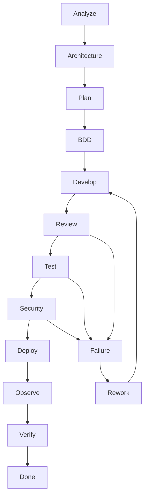

---

# 18.20. Cross-layer orchestration

Bu artıq sənin istədiyin FullStack agent modelidir.

Məsələn:

```text
TASK-1200
Change authentication
```

AI impact analysis edir:

```text
BE
FE
MD
DB
SECURITY
TEST
DOCS
```

Sonra:

```text
BE
 ↓
API Contract
 ↓
FE
 ↓
MD
 ↓
Tests
 ↓
Security
 ↓
Docs
```

işlərini ardıcıllığa salır.

---

# 18.21. Parallel execution

Hər şey serial getməməlidir.

Məsələn:

```text
BE implementation
        ↓
   API contract
      /     \
     /       \
   FE         MD
    \         /
     \       /
      E2E tests
```

FE və MD bir-birindən asılı deyilsə paralel gedə bilər.

Bu:

* vaxtı azaldır
* agent runtime-ını azaldır
* CI cost-u azaldır

---

# 18.22. Critical path

Workflow Engine:

```text
Task Graph
+
Stage Graph
```

üzərindən:

```text
Critical Path
```

çıxarmalıdır.

Məsələn:

```text
1000
 ↓
1001
 ↓
1011
 ↓
1023
```

kritik path-dirsə, agent bunu prioritetləşdirir.

Amma:

```text
1100
1101
```

müstəqil task-lardırsa paralel işlənə bilər.

---

# 18.23. Workflow budget

Bu sistemə daha bir ağıllı layer əlavə etmək istəyirəm:

```text
Execution Budget
```

Məsələn:

```text
Project:
  small

Max:
  5 workflow stages
```

və ya:

```text
AI Context Budget:
  low
```

Agent daha minimal workflow seçir.

Critical project:

```text
Security:
  high

Execution budget:
  unlimited
```

olduqda daha çox validation edir.

---

# 18.24. “Minimum Sufficient Process”

Bu bizim əsas policy-lərdən biri olmalıdır:

> **Layihənin riskini idarə etmək üçün lazım olan minimum proses istifadə edilməlidir.**

Nə:

> ən az proses

nə də:

> mümkün olan bütün proses.

**Minimum sufficient process.**

Bu sənin “kiçik layihəyə microservice/DDD/Kubernetes yükləmə” problemini workflow səviyyəsində də həll edir.

---

# 18.25. Phase 18-in nəticəsi

Artıq:

```text
Architecture Engine
        ↓
Stack Engine
        ↓
Task Engine
        ↓
Testing Engine
        ↓
Security Engine
```

ayrı-ayrı modullar olmaqdan çıxıb:

```text
              ┌─────────────┐
              │   PROJECT   │
              └──────┬──────┘
                     ↓
              ┌─────────────┐
              │   ANALYZE   │
              └──────┬──────┘
                     ↓
       ┌─────────────┴─────────────┐
       ↓                           ↓
 ARCHITECTURE                    STACK
       └─────────────┬─────────────┘
                     ↓
                  DECISION
                     ↓
                   TASK
                     ↓
                   BDD
                     ↓
                  CODE
                     ↓
                 REVIEW
                     ↓
                  TEST
                     ↓
                SECURITY
                     ↓
                 DEPLOY
                     ↓
                OBSERVE
                     ↓
                 VERIFY
                     ↓
                   DONE
```

və failure zamanı:

```text
FAILURE
   ↓
ROOT CAUSE
   ↓
TASK / DECISION / ARCHITECTURE CHANGE
   ↓
REWORK
   ↓
RETEST
```

---

## Progress

```text
PHASE 13  Task Engine                    ✅
PHASE 14  Security Engine                ✅
PHASE 15  Testing Engine                 ✅
PHASE 16  Architecture & Decision Engine ✅
PHASE 17  Stack & Technology Engine      ✅
PHASE 18  SDLC / Workflow Orchestrator   ✅
```

### Növbəti — PHASE 19

**OBSERVABILITY, RUNTIME DIAGNOSTICS & INCIDENT ENGINE**

Burada sistem artıq yalnız:

> “kodu yazdım, test keçdi”

səviyyəsində qalmayacaq.

Production-da:

```text
Error
↓
Log
↓
Metric
↓
Trace
↓
Alert
↓
Incident
↓
Impact
↓
Root Cause
↓
Task
↓
Fix
↓
Deploy
↓
Verify
```

zəncirini `.sdd` sisteminə bağlayacağıq.

Bu phase xüsusilə sənin əvvəl dediyin **“kod işləyir, amma problem çıxanda zəncirin harada qırıldığını tapmaq çətindir”** problemini həll edən hissə olacaq.


________________________________________________________________________________________________
next

# PHASE 19 — OBSERVABILITY, RUNTIME DIAGNOSTICS & INCIDENT ENGINE

Bu phase əvvəlki sistemin **production tərəfini** tamamlayır.

İndiyə qədər:

```text
Requirement
 ↓
Architecture
 ↓
Stack
 ↓
Task
 ↓
BDD
 ↓
Code
 ↓
Test
 ↓
Security
 ↓
Deploy
```

deyirdik.

İndi:

```text
Deploy
 ↓
Runtime
 ↓
Observe
 ↓
Detect
 ↓
Diagnose
 ↓
Incident
 ↓
Root Cause
 ↓
Fix Task
 ↓
Test
 ↓
Deploy
```

qayıdacaq.

Beləliklə sistem **development-only SDD yox, development → runtime → feedback SDD** olacaq.

---

# 19.1. Root structure

```text
.sdd/
├── observability/
│   ├── INDEX.sdd
│   ├── logging.sdd
│   ├── metrics.sdd
│   ├── tracing.sdd
│   ├── alerting.sdd
│   ├── health.sdd
│   ├── diagnostics.sdd
│   └── incident.sdd
│
└── project/
    └── observability/
        ├── INDEX.sdd
        ├── runtime.sdd
        ├── services.sdd
        ├── alerts.sdd
        ├── incidents/
        └── diagnostics/
```

Root:

> **Necə observe etməliyik?**

Project:

> **Bu project-də nəyi necə observe edirik?**

---

# 19.2. Observability 3 əsas sütun

Standart:

```text
Logs
Metrics
Traces
```

Amma bunu bir az genişləndiririk:

```text
Logs
Metrics
Traces
Profiles
Events
Health
```

---

# 19.3. Logs

AI üçün log:

```text
ERROR payment failed
```

kifayət deyil.

Structured log:

```text
timestamp
level
service
environment
request_id
trace_id
user_id
operation
error_code
duration
```

kimi metadata ilə əlaqələndirilir.

`.sdd` isə log formatını deyil, **policy-ni** saxlayır.

Məsələn:

```text
.sdd/observability/logging.sdd
```

Human:

```text
docs/operations/logging.md
```

---

# 19.4. Sensitive data protection

Log sistemi Security Engine ilə əlaqələnir.

Agent yoxlamalıdır:

```text
password
token
session
card
secret
PII
```

log-a düşürmü?

Məsələn:

```text
Authorization: Bearer xxx
```

loglanırsa:

```text
SECURITY VIOLATION
```

yarana bilər.

Bu artıq:

```text
Security
 ↓
Observability
```

cross-layer əlaqəsidir.

---

# 19.5. Metrics

Ən vacib metric kateqoriyaları:

```text
Traffic
Errors
Latency
Saturation
```

Buna əlavə:

```text
Business metrics
Security metrics
Infrastructure metrics
```

əlavə edirik.

---

# 19.6. RED + USE

Service üçün:

```text
Rate
Errors
Duration
```

Infrastructure üçün:

```text
Utilization
Saturation
Errors
```

Agent bunu project-ə görə seçir.

---

# 19.7. Business metrics

Məsələn payment system:

```text
payment_attempts
payment_success
payment_failed
refund_attempts
refund_success
refund_failed
```

Bu çox vacibdir.

Çünki:

```text
CPU = normal
Memory = normal
HTTP 200 = normal
```

ola bilər.

Amma:

```text
refund_success = 0
```

olursa sistem business olaraq qırılıb.

AI bunu görməlidir.

---

# 19.8. Tracing

Request:

```text
Client
 ↓
API
 ↓
Auth
 ↓
Payment
 ↓
PostgreSQL
 ↓
Redis
```

trace:

```text
TRACE-123
```

ilə bağlanır.

Əgər latency:

```text
2.4s
```

olursa AI görür:

```text
API      20ms
Auth     10ms
Payment  40ms
Redis    15ms
DB       2.2s ← bottleneck
```

və problem location müəyyənləşdirir.

---

# 19.9. Code → Trace mapping

Ən güclü hissələrdən biri.

Trace:

```text
payment.create
```

code:

```text
BE/internal/payment/service.go
```

ilə əlaqələndirilir.

Human:

```text
Payment Service
```

diagramda görür.

AI:

```text
trace
 ↓
service
 ↓
component
 ↓
code
 ↓
task
```

gedə bilir.

---

# 19.10. Runtime dependency graph

Project:

```text
.sdd/project/observability/services.sdd
```

məsələn:

```text
API
  -> PostgreSQL
  -> Redis
  -> Queue

Worker
  -> Queue
  -> PostgreSQL
```

Agent runtime problemində graph-ı istifadə edir.

---

# 19.11. Health model

Sadəcə:

```text
200 OK
```

health check kifayət deyil.

Üç səviyyə:

```text
Liveness
Readiness
Dependency health
```

Məsələn:

```text
API alive
API ready = false
Postgres unavailable
```

Bu:

> application ölməyib, amma traffic qəbul etməməlidir.

kimi interpretasiya olunur.

---

# 19.12. Alert Engine

Alert:

```text
CPU > 90%
```

kimi sadə olmamalıdır.

Daha yaxşı:

```text
Error rate > 5%
for 5 minutes
```

və ya:

```text
p95 latency > 500ms
AND
traffic > baseline
```

kimi condition-lar.

---

# 19.13. Alert severity

```text
INFO
WARNING
MINOR
MAJOR
CRITICAL
```

Project-specific severity policy ola bilər.

Payment:

```text
refund failure
→ CRITICAL
```

internal admin:

```text
UI latency
→ WARNING
```

ola bilər.

---

# 19.14. Alert ≠ Incident

Bu distinction vacibdir.

```text
Alert
```

deyir:

> Şübhəli vəziyyət var.

```text
Incident
```

deyir:

> Real business/system impact təsdiqlənib.

Məsələn:

```text
CPU 90%
```

alert-dir.

Amma:

```text
API unavailable
```

incident-dir.

---

# 19.15. Incident structure

```text
.sdd/project/observability/incidents/
```

məsələn:

```text
INC-20260822-001.sdd
```

Human:

```text
docs/incidents/INC-20260822-001.md
```

---

# 19.16. Incident compact format

```text
ID:
  INC-001

Severity:
  S1

Detected:
  alert: ALT-004

Impact:
  payment API unavailable

Start:
  01:12

End:
  01:37

Affected:
  payment

RootCause:
  DB connection exhaustion

Task:
  TASK-1088

Status:
  RESOLVED
```

AI üçün kifayət qədər compact.

Human doc isə geniş izah edir.

---

# 19.17. Incident lifecycle

```text
DETECTED
 ↓
TRIAGED
 ↓
INVESTIGATING
 ↓
MITIGATING
 ↓
RESOLVED
 ↓
POSTMORTEM
 ↓
PREVENTION
```

---

# 19.18. Root Cause Analysis

AI:

```text
Incident
 ↓
Metrics
 ↓
Logs
 ↓
Trace
 ↓
Deploy history
 ↓
Code change
 ↓
Dependency
 ↓
Root Cause
```

analiz edir.

Məsələn:

```text
01:00 deploy
01:04 DB connections ↑
01:07 API latency ↑
01:10 errors ↑
01:12 alert
```

AI:

```text
LikelyRootCause:
  connection pool regression
```

çıxara bilər.

Amma bunu **fact kimi yox**, confidence ilə vermək daha doğrudur:

```text
Confidence:
  0.87
```

---

# 19.19. AI diagnosis certainty

```text
CONFIRMED
HIGH_CONFIDENCE
LIKELY
POSSIBLE
UNKNOWN
```

Agent:

```text
RootCause:
  DB connection exhaustion

Confidence:
  HIGH_CONFIDENCE
```

deyə bilər.

Beləliklə AI yanlış ehtimalı fakt kimi təqdim etmir.

---

# 19.20. Incident → Task

Problem həll olunandan sonra:

```text
INC-001
 ↓
ROOT CAUSE
 ↓
TASK-1088
```

məsələn:

```text
TASK-1088

Title:
Fix DB connection pool exhaustion

Origin:
  incident: INC-001

Priority:
  HIGH

Type:
  reliability
```

Bu task normal Task Engine-ə daxil olur.

---

# 19.21. Incident → Architecture

Bəzən problem sadəcə bug deyil.

Məsələn:

```text
DB overloaded
```

üç dəfə təkrarlanır.

AI görür:

```text
INC-001
INC-009
INC-021
```

və:

```text
Recurring failure
```

çıxarır.

Sonra Architecture Engine-ə signal:

```text
ARCHITECTURE_REVIEW_REQUIRED
```

göndərir.

Bu çox güclüdür.

---

# 19.22. Incident → Skill update

Əgər problem skill-dəki köhnə praktikadan yaranıbsa:

```text
Runtime problem
 ↓
Root Cause
 ↓
Skill outdated?
```

əgər:

```text
YES
```

onda:

```text
SKILL_UPDATE_PROPOSAL
```

yaradılır.

Bu sənin əvvəl dediyin:

> “Skill köhnəlibsə AI özü bunu tapsın.”

tələbinin runtime tərəfidir.

---

# 19.23. Deploy correlation

Deploy:

```text
DEPLOY-042
```

incident:

```text
INC-001
```

arasında correlation saxlanılır.

Məsələn:

```text
INC-001
SuspectedDeploy:
  DEPLOY-042
```

Beləliklə:

> Problem hansı deploy-dan sonra başladı?

sualı avtomatik cavablandırıla bilər.

---

# 19.24. Rollback decision

AI:

```text
Incident
 ↓
Recent deploy?
 ↓
Regression?
 ↓
Rollback safe?
```

analiz edə bilər.

Amma:

```text
production rollback
```

kritik əməliyyat olduğuna görə project policy-dən asılı olaraq:

```text
AUTO
```

və ya:

```text
HUMAN_APPROVAL
```

olmalıdır.

---

# 19.25. Runbook Engine

Project:

```text
.sdd/project/operations/runbooks/
```

məsələn:

```text
RB-001.sdd
RB-002.sdd
```

Human:

```text
docs/runbooks/
```

Məsələn:

```text
RB-001
Database unavailable
```

AI incident zamanı uyğun runbook-u tapır.

```text
Incident
 ↓
Classification
 ↓
Runbook
 ↓
Action
```

---

# 19.26. Runbook da skill kimi reusable olacaq

Root:

```text
.sdd/operations/
├── runbooks/
│   ├── database-down.sdd
│   ├── redis-down.sdd
│   ├── high-cpu.sdd
│   ├── disk-full.sdd
│   └── certificate-expired.sdd
```

Project yalnız lazım olanları activate edir.

---

# 19.27. Disaster / Resilience

Observability burada:

```text
monitor
```

ilə bitmir.

Agent həmçinin:

```text
Failure Injection
Recovery
Backup
Restore
Failover
RTO
RPO
```

nəticələrini izləməlidir.

---

# 19.28. SLO Engine

Project:

```text
.sdd/project/observability/slo.sdd
```

məsələn:

```text
Availability:
  99.95%

API p95:
  < 300ms

Error rate:
  < 0.5%

Recovery:
  RTO < 30m
  RPO < 5m
```

AI runtime vəziyyətini bunlarla müqayisə edir.

---

# 19.29. Error Budget

SLO:

```text
99.95%
```

olarsa müəyyən qədər failure budget var.

Əgər error budget tükənirsə:

```text
Release velocity ↓
Reliability work ↑
```

kimi workflow policy aktivləşə bilər.

Bu artıq sadə monitoringdən daha yüksək səviyyəli engineering management-dir.

---

# 19.30. Runtime feedback loop

Bütün sistem belə bağlanır:

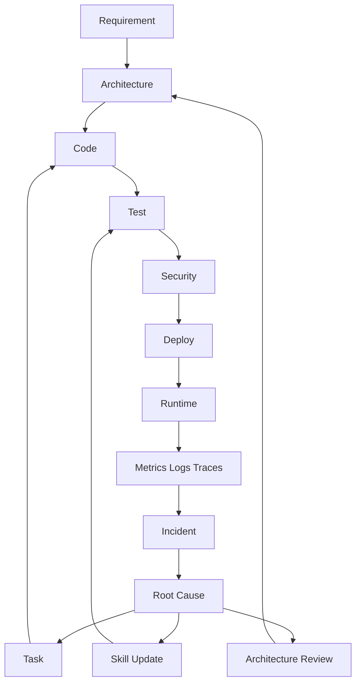

Bu artıq **self-improving engineering system** üçün əsas skeletdir.

---

# 19.31. Human documentation

```text
docs/
├── operations/
│   ├── observability.md
│   ├── logging.md
│   ├── metrics.md
│   ├── tracing.md
│   ├── alerting.md
│   └── health.md
│
├── incidents/
│   └── INC-*.md
│
└── runbooks/
    └── RB-*.md
```

Developer:

> Kod problemi haradan gəlir?

Support:

> Incident nədir?

DevOps:

> Runtime necə işləyir?

Manager:

> Nə qədər impact oldu?

Security:

> Security event varmı?

hamısı öz documentation layer-indən məlumat alır.

---

# 19.32. Bu phase-in ən vacib nəticəsi

İndiyə qədər sistem:

```text
AI → Code
```

kimi görünə bilərdi.

İndi:

```text
AI
 ↓
Engineering Lifecycle
 ↓
Production
 ↓
Reality
 ↓
Feedback
 ↓
Engineering Lifecycle
```

olur.

Yəni sistem **kod yazan agentdən engineering agentə** çevrilir.

---

## Progress

```text
PHASE 13  Task Engine                    ✅
PHASE 14  Security Engine                ✅
PHASE 15  Testing Engine                 ✅
PHASE 16  Architecture & Decision Engine ✅
PHASE 17  Stack & Technology Engine      ✅
PHASE 18  SDLC / Workflow Orchestrator   ✅
PHASE 19  Observability / Incident       ✅
```

### Növbəti: **PHASE 20 — DOCUMENTATION & KNOWLEDGE ENGINE**

Bu phase sənin əvvəl dediyin **“developer üçün ayrı, business üçün ayrı, support üçün ayrı, infra üçün ayrı documentation olsun; amma kodun yanında lazımsız `.md` faylları yaranmasın”** problemini sistemli şəkildə həll edəcək.

Əsas model:

```text
.sdd/       → AI compact truth
docs/       → Human knowledge
source code → Actual implementation
runtime     → Actual system state
```

və agent bunların arasında **single source of truth + traceability** qaydasını quracaq.


________________________________________________________________________________________________
next
# PHASE 20 — DOCUMENTATION & KNOWLEDGE ENGINE

Bu phase bizim sistemdə çox vacib sərhədi müəyyən edir:

> **`.sdd` AI üçün, `docs/` insan üçün, source code isə real implementation üçün olacaq.**

Beləliklə sən istəmədiyin vəziyyət yaranmır:

```text
BE/internal/analytics/repository.go
BE/internal/analytics/repository.md
```

Əvəzinə:

```text
BE/internal/analytics/repository.go

docs/
└── developer/
    └── analytics.md

.sdd/
└── project/
    └── BE/
        └── internal/
            └── analytics/
                └── repository.sdd
```

---

# 20.1. Üç qatlı knowledge model

Sistemin əsas modeli:

```text
                    PROJECT
                       │
          ┌────────────┼────────────┐
          ↓            ↓            ↓
      SOURCE         .sdd/        docs/
       CODE          AI TRUTH     HUMAN TRUTH
          │            │            │
          └────────────┼────────────┘
                       ↓
                  TRACEABILITY
```

### Source code

Real iş görür.

### `.sdd`

AI-nin kompakt struktur və semantic knowledge qatıdır.

### `docs/`

İnsanların oxuyacağı geniş izah qatıdır.

---

# 20.2. Documentation root

```text
docs/
├── INDEX.md
├── business/
├── architecture/
├── developer/
├── testing/
├── security/
├── operations/
├── infrastructure/
├── support/
├── deployment/
├── incidents/
└── decisions/
```

Burada məqsəd:

> **Document → audience**

münasibətini açıq saxlamaqdır.

---

# 20.3. Audience modeli

```text
BUSINESS
DEVELOPER
QA
SECURITY
DEVOPS
SUPPORT
OPERATIONS
MANAGER
ARCHITECT
```

Hər document bir və ya bir neçə audience-ə aid ola bilər.

Məsələn:

```text
docs/security/payment-security.md
```

Audience:

```text
SECURITY
DEVELOPER
QA
```

---

# 20.4. Human documentation index

```text
docs/INDEX.md
```

məsələn:

```text
# Project Documentation

## Business
Business rules and product behaviour.

## Architecture
System structure and design decisions.

## Developer
Implementation and development knowledge.

## QA
Testing strategy and test behaviour.

## Security
Security controls and security procedures.

## Infrastructure
Deployment and runtime infrastructure.

## Support
Operational troubleshooting.

## Incidents
Production incidents and postmortems.
```

İnsan project-ə girəndə ilk olaraq bunu görür.

---

# 20.5. `.sdd` documentation mapping

AI tərəfdə:

```text
.sdd/project/docs/
├── INDEX.sdd
├── mappings.sdd
└── ownership.sdd
```

Məsələn:

```text
repository.sdd
```

içində:

```text
HumanDoc:
  docs/developer/analytics.md
```

ola bilər.

Amma `.sdd`-də bütün markdown məzmunu təkrar yazılmır.

---

# 20.6. Single Source of Truth

Ən vacib policy:

> **Eyni məlumat iki fərqli yerdə müstəqil həqiqət kimi saxlanmamalıdır.**

Məsələn:

```text
API davranışı
```

source code + contract-dan müəyyən edilir.

Human doc isə onu izah edir.

Beləliklə:

```text
Code ≠ copy of documentation
Documentation ≠ copy of code
```

---

# 20.7. Documentation types

Document-ləri də standartlaşdırırıq:

```text
CONCEPT
GUIDE
REFERENCE
RUNBOOK
DECISION
PROCEDURE
TROUBLESHOOT
ARCHITECTURE
API
BUSINESS
POSTMORTEM
```

Məsələn:

```text
docs/developer/auth.md
```

`GUIDE`.

```text
docs/operations/database-down.md
```

`RUNBOOK`.

```text
docs/decisions/DEC-017.md
```

`DECISION`.

---

# 20.8. L0–L5 documentation depth

Sənin əvvəlki L0–L5 ideyanı burada tətbiq edirik.

### L0 — Minimal

```text
What is this?
```

Kiçik project.

### L1 — Basic

```text
What
Why
How
```

### L2 — Developer

```text
Architecture
Dependencies
Testing
Operations
```

### L3 — Production

```text
Scaling
Security
Monitoring
Failure handling
```

### L4 — High scale

```text
SLO
DR
Capacity
Multi-region
Resilience
```

### L5 — Critical / enterprise

```text
Compliance
Advanced security
Formal controls
Disaster scenarios
Auditability
```

Agent project levelinə görə documentation depth seçir.

---

# 20.9. Documentation generation

AI source code yaratdıqdan sonra:

```text
CODE
 ↓
ANALYZE
 ↓
DOC IMPACT
 ↓
UPDATE HUMAN DOC
```

edir.

Amma hər kod dəyişiklikdə bütün docs yenidən yaradılmır.

Yalnız təsirlənən documentation tapılır.

---

# 20.10. Documentation impact graph

Məsələn:

```text
repository.go
     ↓
repository.sdd
     ↓
analytics domain
     ↓
docs/developer/analytics.md
     ↓
docs/architecture/data-flow.md
```

Əgər `repository.go` dəyişirsə, agent həmin graph-a baxır.

---

# 20.11. Stale documentation detection

AI source code ilə docs-u müqayisə edir.

Məsələn doc:

```text
Redis is used for session storage.
```

amma source:

```text
PostgreSQL sessions
```

istifadə edir.

Agent:

```text
DOC-DRIFT
```

aşkar edir.

---

# 20.12. Documentation status

Hər human document üçün:

```text
CURRENT
STALE
REVIEW
DRAFT
ARCHIVED
```

statusu ola bilər.

`.sdd`:

```text
Doc:
  docs/developer/auth.md

Status:
  CURRENT

LastVerified:
  2026-08-22
```

---

# 20.13. Documentation ownership

Hər sənədin owner-i ola bilər:

```text
Owner:
  DEVELOPER
```

və ya:

```text
Owner:
  DEVOPS
```

və ya:

```text
Owner:
  SECURITY
```

Beləliklə agent:

> Bu document-i kim update etməlidir?

sualına cavab verə bilir.

---

# 20.14. Business → Developer → Support əlaqəsi

Məsələn business qaydası:

```text
Refund can only happen once.
```

↓

Developer:

```text
Idempotency protection.
```

↓

QA:

```text
Duplicate refund BDD scenario.
```

↓

Security:

```text
Replay protection.
```

↓

Support:

```text
Refund already processed.
```

Bunlar ayrı document-lərdir, amma relationship saxlanır.

---

# 20.15. Business documentation

```text
docs/business/
├── INDEX.md
├── requirements.md
├── business-rules.md
├── workflows.md
└── terminology.md
```

Burada texniki implementation mümkün qədər gizli saxlanır.

Business user:

> Refund necə işləyir?

oxuya bilər.

Amma:

> Redis lock necə qurulub?

onu burada görməməlidir.

---

# 20.16. Developer documentation

```text
docs/developer/
├── INDEX.md
├── architecture.md
├── coding.md
├── modules.md
├── contracts.md
└── troubleshooting.md
```

Developer üçün:

```text
What
Why
Where
How
Dependencies
Constraints
```

olmalıdır.

---

# 20.17. QA documentation

```text
docs/testing/
├── strategy.md
├── bdd.md
├── unit.md
├── integration.md
├── contract.md
├── e2e.md
├── performance.md
└── security-testing.md
```

Burada BDD qaydaları ayrıca izah edilir.

---

# 20.18. Security documentation

```text
docs/security/
├── model.md
├── controls.md
├── authentication.md
├── authorization.md
├── data-protection.md
├── threat-model.md
├── pentest.md
└── incident-response.md
```

Security Engine bunlarla əlaqələnir.

---

# 20.19. Infrastructure documentation

```text
docs/infrastructure/
├── architecture.md
├── environments.md
├── networking.md
├── compute.md
├── database.md
├── cache.md
├── storage.md
└── disaster-recovery.md
```

VPS, AWS, GCP, Azure fərqləri burada ayrıca göstərilə bilər.

---

# 20.20. Deployment documentation

Sənin əvvəlki istəyinə uyğun:

```text
docs/deployment/
├── INDEX.md
├── local.md
├── staging.md
├── production.md
├── vps.md
├── aws.md
├── gcp.md
└── azure.md
```

Amma hamısı project üçün yaradılmır.

Əgər project:

```text
Infrastructure:
  VPS
```

dirsə:

```text
vps.md
```

aktiv olur.

AWS sənədi isə:

```text
NOT_APPLICABLE
```

ola bilər.

---

# 20.21. Diagram documentation

Diagramları da knowledge graph-a bağlayırıq.

```text
docs/architecture/diagrams/
├── system.md
├── deployment.md
├── data-flow.md
├── sequence.md
└── network.md
```

Mermaid istifadə etmək yaxşı default-dur.

---

# 20.22. Diagram → code mapping

Sənin xüsusi istəyin burada həyata keçir:

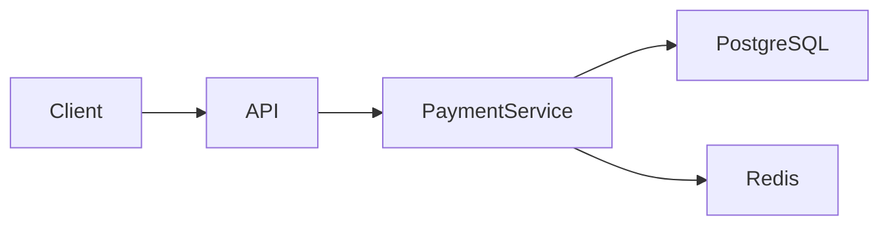

Diagram metadata:

```text
PaymentService:
  source:
    BE/internal/payment/service.go

PostgreSQL:
  source:
    DB/payment

Redis:
  source:
    infrastructure/redis
```

Beləliklə AI diagramı kodla əlaqələndirə bilir.

---

# 20.23. Diagram freshness

Kod dəyişəndə diagram da yoxlanılır.

```text
CODE CHANGE
 ↓
DEPENDENCY GRAPH
 ↓
DIAGRAM IMPACT
 ↓
STALE?
```

Əgər:

```text
API → RabbitMQ
```

əvəzinə:

```text
API → Kafka
```

olubsa, diagram:

```text
STALE
```

olur.

---

# 20.24. Documentation generation rules

AI:

```text
CREATE DOC
```

etməzdən əvvəl soruşmur.

Əvvəl policy yoxlayır:

```text
Already exists?
     ↓
   YES
     ↓
Update

NO
 ↓
Required?
 ↓
YES
 ↓
Create
```

Beləliklə lazımsız sənəd yaranmır.

---

# 20.25. “No duplicate documentation” policy

```text
.sdd/
```

və:

```text
docs/
```

eyni məlumatı uzun şəkildə saxlamır.

Məsələn `.sdd`:

```text
Owner: DEVOPS
Level: L3
Runtime: Docker
Cloud: AWS
```

`docs/infrastructure/architecture.md` isə bunun insan üçün izahını saxlayır.

---

# 20.26. Documentation lint

Agent documentation üçün də test işlədəcək.

Məsələn:

```text
DOC001
Missing owner

DOC002
Broken reference

DOC003
Stale diagram

DOC004
Missing audience

DOC005
Invalid link

DOC006
Outdated technology

DOC007
Missing architecture reference
```

Beləliklə documentation da quality gate-dən keçir.

---

# 20.27. Documentation graph

Bütün knowledge:

```text
Business Rule
      ↓
Requirement
      ↓
Decision
      ↓
Architecture
      ↓
Stack
      ↓
Task
      ↓
Code
      ↓
Test
      ↓
Security
      ↓
Deployment
      ↓
Runtime
      ↓
Incident
      ↓
Documentation
```

ilə əlaqələndirilir.

---

# 20.28. Knowledge retrieval

Agent bütün `docs/` qovluğunu hər dəfə oxumamalıdır.

Bu çox böyük token itkisi olar.

Əvəzində:

```text
QUESTION
 ↓
INDEX
 ↓
RELEVANT ENTITY
 ↓
RELEVANT .sdd
 ↓
RELEVANT DOC
 ↓
SOURCE CODE
```

olmalıdır.

Bu bizim **Context Routing Engine**-ə əsas hazırlıqdır.

---

# 20.29. Token-saving model

Məsələn task:

```text
Fix refund idempotency
```

AI:

```text
PROJECT INDEX
 ↓
TASK-1023
 ↓
payments
 ↓
refund
 ↓
relevant skills
 ↓
relevant source
 ↓
relevant tests
```

yükləyir.

Bütün:

```text
docs/
skills/
project/
```

yüklənmir.

Bu çox ciddi token qənaətidir.

---

# 20.30. Human-readable documentation hierarchy

Manager project-i açanda:

```text
docs/
├── INDEX.md
│
├── business/
│   └── ...
│
├── architecture/
│   └── ...
│
├── developer/
│   └── ...
│
├── testing/
│   └── ...
│
├── security/
│   └── ...
│
├── infrastructure/
│   └── ...
│
├── operations/
│   └── ...
│
└── support/
    └── ...
```

görür.

Yəni:

> **“Bu problem kimə aiddir?”**

sualı documentation strukturundan belə cavablanır.

---

# 20.31. Ownership routing

Məsələn:

```text
DB latency
```

AI:

```text
PRIMARY:
  DEVOPS

SECONDARY:
  BACKEND
```

seçir.

---

```text
Broken UI
```

:

```text
PRIMARY:
  FRONTEND

SECONDARY:
  QA
```

---

```text
Payment security issue
```

:

```text
PRIMARY:
  SECURITY

SECONDARY:
  BACKEND
  QA
```

---

# 20.32. Documentation ↔ incident

Incident zamanı:

```text
INC-001
 ↓
Root cause
 ↓
Relevant runbook
 ↓
Relevant architecture doc
 ↓
Relevant code
```

gedə bilir.

Support artıq:

> Developerə soruşum görüm bu nədir

demək məcburiyyətində qalmır.

---

# 20.33. Documentation ↔ task

Task:

```text
TASK-1023
```

human doc-da:

```text
docs/developer/payments/refund.md
```

ilə əlaqələnir.

Beləliklə:

```text
TASK
 ↔
CODE
 ↔
TEST
 ↔
DOC
```

traceable olur.

---

# 20.34. Documentation ↔ decision

Məsələn:

```text
DEC-017
Use Redis for idempotency locking
```

↓

```text
docs/decisions/DEC-017.md
```

↓

```text
payments/refund
```

↓

```text
repository/service code
```

Bu, gələcəkdə:

> “Niyə Redis seçilmişdi?”

sualını cavablandırır.

---

# 20.35. Phase 20 final model

```text
                    .sdd/
                      │
                AI COMPACT TRUTH
                      │
          ┌───────────┼───────────┐
          ↓           ↓           ↓
       TASKS       DECISIONS    SKILLS
          │           │           │
          └───────────┼───────────┘
                      ↓
                  SOURCE CODE
                      │
                      ↓
                 RUNTIME
                      │
                      ↓
                  INCIDENT
                      │
                      ↓
                    DOCS
                      │
        ┌─────────────┼─────────────┐
        ↓             ↓             ↓
     BUSINESS      DEVELOPER      OPS
        ↓             ↓             ↓
      SUPPORT       QA          SECURITY
```

---

# 20.36. Əsas qayda

Bu phase-dən sonra sistemdə bu prinsip **dəyişməz qayda** olmalıdır:

```text
.sdd/
    = machine-readable engineering knowledge

source/
    = executable truth

docs/
    = human-readable knowledge

runtime/
    = operational truth
```

Heç biri digərinin yerinə keçmir.

---

# Progress

```text
PHASE 13  Task Engine                    ✅
PHASE 14  Security Engine                ✅
PHASE 15  Testing Engine                 ✅
PHASE 16  Architecture & Decision Engine ✅
PHASE 17  Stack & Technology Engine      ✅
PHASE 18  SDLC / Workflow Orchestrator   ✅
PHASE 19  Observability / Incident       ✅
PHASE 20  Documentation / Knowledge      ✅
```

## Növbəti — PHASE 21

**CONTEXT ROUTER & TOKEN OPTIMIZATION ENGINE**

Burada artıq bütün bu böyük sistemi **AI-yə necə az tokenlə yükləyəcəyimizi** quracağıq.

Əsas fikir:

```text
User request
      ↓
Intent
      ↓
Project
      ↓
Domain
      ↓
Task
      ↓
Workflow stage
      ↓
Required skills
      ↓
Required docs
      ↓
Required source
      ↓
MINIMUM CONTEXT
      ↓
AI
```

Yəni AI-yə 500 fayl vermək əvəzinə, **iş üçün lazım olan 8–15 faylı ağıllı şəkildə seçən Context Router** yaradacağıq.


________________________________________________________________________________________________
next


# PHASE 21 — CONTEXT ROUTER & TOKEN OPTIMIZATION ENGINE

Bu phase bizim sistemin **AI beyninə context seçən layer** olacaq.

Əsas problem:

> `.sdd` böyükdür, skills çoxdur, docs çoxdur, source code böyükdür. AI bunların hamısını oxusa həm token, həm vaxt, həm də accuracy itir.

Ona görə AI-yə **bütün project yox, konkret iş üçün minimum kifayət edən context** verilir.

---

# 21.1. Əsas prinsip

```text
User Input
   ↓
Intent Detection
   ↓
Project Detection
   ↓
Domain Detection
   ↓
Task / Requirement Detection
   ↓
Workflow Stage
   ↓
Dependency Analysis
   ↓
Skill Selection
   ↓
Documentation Selection
   ↓
Source Selection
   ↓
Context Budget
   ↓
AI Execution
```

Bu engine-in əsas qaydası:

> **Read less, understand more.**

---

# 21.2. Context root

```text
.sdd/
├── context/
│   ├── INDEX.sdd
│   ├── routing.sdd
│   ├── priorities.sdd
│   ├── budgets.sdd
│   ├── loading.sdd
│   ├── dependencies.sdd
│   └── cache.sdd
```

Project-specific:

```text
.sdd/project/
└── context/
    ├── INDEX.sdd
    ├── map.sdd
    └── active.sdd
```

---

# 21.3. Context Router nə edir?

Məsələn user deyir:

> Refund zamanı double refund problemini həll et.

AI bütün project-i oxumur.

Əvvəl:

```text
Intent:
  FIX

Domain:
  payments

Component:
  refund

Risk:
  high
```

tapır.

Sonra:

```text
TASK
 ↓
PAY-1023
```

tapılır.

---

# 21.4. Task → Context

Task:

```text id="rj3c2f"
PAY-1023
```

deyir:

```text
Domain:
  payments/refund

Skills:
  idempotency
  transactions
  payment-security

DependsOn:
  PAY-999
```

Context Router:

```text
LOAD:
  PAY-1023
  PAY-999
  refund code
  refund tests
  idempotency skill
  transaction skill
  payment security skill
  relevant docs
```

və:

```text
DO NOT LOAD:
  frontend
  mobile
  unrelated infrastructure
```

---

# 21.5. Context priority

Hər context elementinin priority-si olur:

```text
P0 = mandatory
P1 = strongly relevant
P2 = useful
P3 = optional
P4 = background
```

Məsələn:

```text
Task:
  P0

Parent task:
  P0

Required skill:
  P0

Affected source:
  P0

Related test:
  P1

Architecture:
  P1

General documentation:
  P2

Unrelated modules:
  P4
```

AI əvvəl P0 yükləyir.

---

# 21.6. Context budget

Project:

```text
L0
```

üçün:

```text
LOW
```

budget.

Critical payment system:

```text
L4
```

üçün:

```text
HIGH
```

budget.

Amma:

> High budget = bütün repository-ni oxu

demək deyil.

Sadəcə router daha geniş context götürə bilər.

---

# 21.7. Context budget modeli

```text
.sdd/context/budgets.sdd
```

məsələn:

```text
L0:
  context: minimal

L1:
  context: low

L2:
  context: medium

L3:
  context: high

L4:
  context: critical

L5:
  context: exhaustive
```

Amma `exhaustive` belə dependency-aware olmalıdır.

---

# 21.8. Context expansion

AI əvvəl minimal context ilə başlayır:

```text
P0
```

Əgər kifayət etmirsə:

```text
P1
```

sonra:

```text
P2
```

yükləyir.

```text
P0
 ↓
Enough?
 ├── YES → Execute
 └── NO
      ↓
     P1
      ↓
   Enough?
      ├── YES
      └── NO
           ↓
          P2
```

Bu **progressive context loading** olacaq.

---

# 21.9. “Enough Context” criterion

AI özü:

```text
CONTEXT_SUFFICIENT
```

və ya:

```text
CONTEXT_INSUFFICIENT
```

qərarı verməlidir.

Məsələn:

```text
Task:
  Add DB index
```

üçün:

```text
Task
Schema
Query
DB skill
Existing tests
```

kifayətdir.

Bütün frontend lazım deyil.

---

# 21.10. Context dependency graph

```text
TASK-1023
   ↓
PAYMENTS
   ↓
REFUND
   ├── service.go
   ├── repository.go
   ├── refund_test.go
   ├── idempotency.sdd
   └── payment-security.sdd
```

Router bu graph ilə context seçir.

---

# 21.11. Context radius

Task-dan nə qədər uzağa gedəcəyimizi müəyyən edirik.

```text
R0 = task itself
R1 = direct dependencies
R2 = domain
R3 = architecture
R4 = project
```

Default:

```text
R0 + R1
```

Sonra ehtiyac varsa genişlənir.

---

# 21.12. Example

Task:

```text id="wq2g2h"
PAY-1023
```

### R0

```text
PAY-1023
```

### R1

```text
PAY-999
refund service
refund repository
refund tests
```

### R2

```text
payments architecture
payment security
transaction policy
```

### R3

```text
system architecture
database architecture
```

### R4

```text
entire project
```

AI normal halda R4-ə getmir.

---

# 21.13. Skill routing

Bütün skills:

```text
.sdd/skills/
```

altında ola bilər.

Amma:

```text
refund
```

task üçün:

```text
@backend/idempotency
@database/transactions
@security/payment
```

aktiv edilir.

Frontend skills:

```text
@frontend/react
@frontend/vue
```

yüklənmir.

---

# 21.14. Skill hierarchy

Skill-lər:

```text
domain
  ↓
technology
  ↓
specialization
```

məsələn:

```text
backend
 ↓
go
 ↓
postgresql
 ↓
transactions
 ↓
idempotency
```

Context Router aşağıdan yuxarı lazım olan parent context-i də gətirir.

---

# 21.15. Token-aware skill loading

Əgər:

```text
idempotency.sdd
```

çox kiçikdirsə, birbaşa yüklənir.

Əgər böyük skill:

```text
postgresql.sdd
```

1000+ sətirdirsə, AI bütününü yükləmir.

Əvvəl:

```text
INDEX
```

sonra lazım olan section:

```text
transactions
locking
indexes
```

yüklənir.

---

# 21.16. Section-level retrieval

Bu çox vacib optimizasiyadır.

```text
Skill:
  PostgreSQL

Sections:
  installation
  schema
  transactions
  indexing
  replication
  partitioning
  backup
```

Task:

```text
Add index
```

üçün:

```text
indexing
query-planning
```

kifayətdir.

---

# 21.17. Documentation routing

User:

> Payment refund niyə fail edir?

Router:

```text
docs/business/refunds.md
docs/developer/payments.md
docs/operations/payment-failures.md
```

seçə bilər.

Amma:

```text
docs/frontend/
docs/mobile/
```

gətirmir.

---

# 21.18. Audience-aware context

User roluna görə context dəyişir.

### Developer

```text
source
skills
architecture
tests
```

### QA

```text
requirements
BDD
test strategy
contracts
source
```

### Support

```text
business
runbooks
incidents
troubleshooting
```

### Manager

```text
business
status
risks
decisions
progress
```

Beləliklə eyni project üçün fərqli context yaradılır.

---

# 21.19. Manager mode

Sənin manager olaraq istifadə edəcəyin:

```text
.sdd/context/
```

routing:

```text
Manager Request
 ↓
Project status
 ↓
Open tasks
 ↓
Blocked tasks
 ↓
Risks
 ↓
Incidents
 ↓
Decisions
 ↓
Progress
```

Source code yalnız ehtiyac yaranarsa gətirilir.

---

# 21.20. Developer mode

```text
Developer Request
 ↓
Task
 ↓
Code
 ↓
Tests
 ↓
Skills
 ↓
Architecture
 ↓
Relevant docs
```

---

# 21.21. Incident mode

```text
Incident
 ↓
Alert
 ↓
Metrics
 ↓
Logs
 ↓
Trace
 ↓
Recent deployment
 ↓
Affected service
 ↓
Relevant code
 ↓
Runbook
```

Bu context route ayrıca olacaq.

---

# 21.22. Security mode

```text
Security issue
 ↓
Threat model
 ↓
Security skill
 ↓
Affected component
 ↓
Auth/AuthZ
 ↓
Data
 ↓
Logs
 ↓
Tests
 ↓
Pentest history
```

---

# 21.23. Cache

Context Router hər dəfə eyni məlumatı yenidən analiz etməməlidir.

```text
.sdd/context/cache.sdd
```

burada:

```text
context-id
source
hash
last-used
dependencies
```

kimi metadata saxlanır.

Source dəyişməyibsə:

```text
CACHE HIT
```

olur.

---

# 21.24. Context invalidation

Əgər:

```text
repository.go
```

dəyişirsə:

```text
repository.sdd
refund docs
refund tests
```

kimi dependent context-lər invalidate edilə bilər.

```text
SOURCE CHANGE
 ↓
DEPENDENCY GRAPH
 ↓
INVALIDATE
 ↓
REBUILD CONTEXT
```

---

# 21.25. Context fingerprint

Hər context üçün:

```text
CTX-8F3A
```

kimi ID və fingerprint saxlanır.

Məsələn:

```text
CTX:
  project=payments
  task=PAY-1023
  skills=3
  docs=2
  source=5
  workflow=TEST
```

Bu debugging üçün çox faydalıdır.

---

# 21.26. Context audit

AI sonradan:

> Bu qərarı niyə verdin?

sualına cavab verməlidir.

Buna görə context audit:

```text
CTX-8F3A

Loaded:
  PAY-1023
  PAY-999
  refund/service.go
  refund_test.go
  idempotency.sdd
  transaction.sdd

Excluded:
  frontend
  mobile
  unrelated domains
```

kimi qısa metadata saxlayır.

**Amma full prompt/history saxlamırıq.**

Token və storage qənaəti.

---

# 21.27. Context miss detection

AI səhv context seçə bilər.

Məsələn payment task-a frontend lazım olduğu halda yüklənməyib.

Agent bunu müəyyən edir:

```text
CONTEXT_MISS
```

və:

```text
EXPAND_CONTEXT
```

edir.

---

# 21.28. Context confidence

```text
ContextConfidence:
  HIGH
```

və ya:

```text
MEDIUM
LOW
```

Əgər:

```text
LOW
```

olarsa agent implementation-a başlamamalıdır.

Əvvəl əlavə context tapmalıdır.

---

# 21.29. Context budget failure

Əgər project çox böyükdürsə:

```text
Context budget exceeded
```

olanda AI hər şeyi sıxışdırmamalıdır.

Əvəzində:

```text
Prioritize
 ↓
Summarize
 ↓
Retrieve relevant section
 ↓
Continue
```

edir.

---

# 21.30. Summary layers

Böyük project üçün:

```text
Project summary
 ↓
Domain summary
 ↓
Module summary
 ↓
Component summary
 ↓
Source
```

qatları yaradırıq.

Məsələn:

```text
payments.sdd
```

payment domain-in compact representation-ıdır.

AI əvvəl bunu oxuyur.

---

# 21.31. Hierarchical context

```text
PROJECT
 ├── DOMAIN
 │    ├── MODULE
 │    │    ├── COMPONENT
 │    │    │    └── SOURCE
```

Router lazım olan dərinliyə qədər enir.

Bu, bizim `.sdd/project` strukturunun ən böyük faydalarından biri olacaq.

---

# 21.32. Context routing example

User:

> Redis cache-də user balance üçün stale data problemi var, düzəlt.

Router:

```text
Intent:
  BUGFIX

Domain:
  balance

Technology:
  Redis

Risk:
  HIGH

Workflow:
  DEVELOPMENT
```

Context:

```text
P0:
  task
  balance module
  Redis skill
  cache policy
  relevant service
  relevant tests

P1:
  PostgreSQL balance source
  consistency policy
  architecture

P2:
  observability
  incident history
```

Frontend:

```text
NOT_REQUIRED
```

---

# 21.33. Context router + workflow

Workflow stage context-i dəyişir.

Eyni task:

### Development

```text
code
skills
architecture
tests
```

### Review

```text
diff
standards
security
tests
architecture
```

### Security

```text
threat model
security skills
attack surface
code
logs
```

### Deployment

```text
infrastructure
CI/CD
runtime
rollback
```

Yəni:

> **Task context ≠ Workflow context**

Router hər ikisini birləşdirir.

---

# 21.34. Context router + L0–L5

```text
L0:
  task + source

L1:
  task + source + tests

L2:
  + architecture + skills

L3:
  + security + observability

L4:
  + resilience + scaling + infrastructure

L5:
  + compliance + full traceability + historical incidents
```

Beləliklə project level avtomatik context depth müəyyən edir.

---

# 21.35. “Never load everything” policy

Root policy:

```text
.sdd/context/policies.sdd
```

əsas qayda:

```text
NEVER:
  load entire .sdd

UNLESS:
  explicit audit
  architecture review
  migration planning
  system-wide analysis
```

Bu bizim token-saving prinsiplərimizdən biri olacaq.

---

# 21.36. Full project analysis exception

Sən demişdin:

> `.sdd` qovluğunu əlavə etmişəm və “layihəmi analiz et” deyirəm.

Bu halda router xüsusi mode-a keçir:

```text
PROJECT_ANALYSIS
```

və:

```text
Project
 ↓
Structure
 ↓
Stack
 ↓
Architecture
 ↓
Tasks
 ↓
Workflow
 ↓
Security
 ↓
Testing
 ↓
Infrastructure
 ↓
Docs
 ↓
Runtime
```

analiz edir.

Bu normal task mode deyil.

---

# 21.37. Context Router üçün xüsusi command-lar

Sonrakı agentdə bunlar ola bilər:

```text
/sdd analyze
/sdd task PAY-1023
/sdd review PAY-1023
/sdd security PAY-1023
/sdd test PAY-1023
/sdd incident INC-001
/sdd architecture
/sdd docs
/sdd stack
/sdd audit
```

Amma bunlar UI/CLI layer-dir.

Core engine bunlardan asılı olmamalıdır.

---

# 21.38. Agent interface

Node üzərində agent üçün:

```text
sdd-agent
```

məsələn:

```text
sdd-agent analyze
sdd-agent task PAY-1023
sdd-agent review PAY-1023
```

və ya sadəcə:

```text
sdd-agent
```

→ natural language input.

Bu phase-in sonunda agent üçün context:

```text
Agent
 ↓
Context Router
 ↓
Minimal Context
 ↓
LLM
```

olacaq.

---

# 21.39. Context optimization metrics

Sistem özünü ölçməlidir:

```text
ContextTokens
RelevantTokens
UnusedTokens
ContextHitRate
ContextMissRate
ExpansionCount
CacheHitRate
```

Məsələn:

```text
Context:
  18,000 tokens

Relevant:
  14,500

Unused:
  3,500

Efficiency:
  80.5%
```

Bu gələcəkdə Context Router-i optimallaşdırmağa imkan verəcək.

---

# 21.40. Əsas KPI

Mən burada bir KPI təklif edirəm:

```text
Context Efficiency =
Relevant Context / Total Context
```

Məqsəd:

```text
> 80%
```

olmalıdır.

Amma safety-critical task-larda relevance naminə context-i həddən artıq azaltmaq olmaz.

---

# 21.41. Final architecture

Artıq sistem belə görünür:

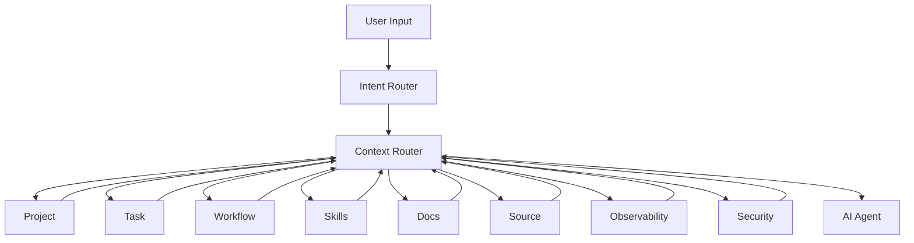

---

# 21.42. İndiki sistemin ən vacib fərqi

Əvvəlki model:

```text
AI
 ↓
Read .sdd
 ↓
Read project
 ↓
Do work
```

Yeni model:

```text
USER
 ↓
INTENT
 ↓
CONTEXT ROUTER
 ↓
PROJECT GRAPH
 ↓
TASK GRAPH
 ↓
WORKFLOW
 ↓
SKILLS
 ↓
DOCS
 ↓
SOURCE
 ↓
MINIMUM CONTEXT
 ↓
AI
```

Bu, artıq sadəcə `.sdd` specification deyil.

Bu:

> **AI Engineering Context Operating System**

olmağa başlayır.

---

# Progress

```text
PHASE 13  Task Engine                    ✅
PHASE 14  Security Engine                ✅
PHASE 15  Testing Engine                 ✅
PHASE 16  Architecture & Decision Engine ✅
PHASE 17  Stack & Technology Engine      ✅
PHASE 18  SDLC / Workflow Orchestrator   ✅
PHASE 19  Observability / Incident       ✅
PHASE 20  Documentation / Knowledge      ✅
PHASE 21  Context Router / Token Engine  ✅
```

## Növbəti — PHASE 22

**AGENT RUNTIME & TOOL EXECUTION ENGINE**

Burada artıq nəzəri `.sdd` sistemindən real Git repository-də işləyən agentə keçirik:

```text
.sdd/
docs/
source/
     ↓
Node Agent
     ↓
Context Router
     ↓
Tool Executor
     ↓
Git
     ↓
Files
     ↓
Tests
     ↓
Docker
     ↓
CI/CD
     ↓
Runtime
```

və ən vacibi agentin:

**nəyi avtomatik edə biləcəyi, nəyi yalnız təklif edə biləcəyi, nə vaxt Human Approval tələb edəcəyi və səhv etdikdə necə rollback edəcəyi**

məhz PHASE 22-də müəyyənləşəcək.


________________________________________________________________________________________________
next
# PHASE 22 — AGENT RUNTIME & TOOL EXECUTION ENGINE

Bu phase-də artıq `.sdd`-ni sadəcə specification kimi yox, **real Git repository-də işləyən engineering agent üçün execution system** kimi dizayn edirik.

Əsas prinsip:

> **AI qərar verir → Policy yoxlayır → Agent icra edir → Verification yoxlayır → Git trace saxlayır.**

---

# 22.1. Agent artıq sadəcə “chatbot” deyil

Final model:

```text
User
 ↓
Intent Router
 ↓
Context Router
 ↓
Planning
 ↓
Policy Engine
 ↓
Agent Runtime
 ↓
Tool Executor
 ↓
Verification
 ↓
Git
 ↓
Result
```

Agent:

* fayl oxuya bilər
* fayl yarada bilər
* kod dəyişə bilər
* test işlədə bilər
* lint işlədə bilər
* BDD işlədə bilər
* Docker işlədə bilər
* DB migration hazırlaya bilər
* Git diff analiz edə bilər
* branch yarada bilər
* commit hazırlaya bilər

Amma bunların hamısını **kor-koranə edə bilməz**.

---

# 22.2. `.sdd/agent/`

Root-da:

```text
.sdd/
└── agent/
    ├── INDEX.sdd
    ├── capabilities.sdd
    ├── permissions.sdd
    ├── policies.sdd
    ├── approvals.sdd
    ├── execution.sdd
    ├── rollback.sdd
    ├── limits.sdd
    └── audit.sdd
```

Bu qovluq agent-in **əməliyyat qaydalarını** müəyyən edir.

---

# 22.3. Agent capabilities

```text
.sdd/agent/capabilities.sdd
```

məsələn:

```text
READ
WRITE
DELETE
MOVE
EXECUTE
TEST
BUILD
DOCKER
GIT
DATABASE
NETWORK
DEPLOY
```

Amma capability ilə permission eyni şey deyil.

---

# 22.4. Capability ≠ Permission

Agent texniki olaraq:

```text
DELETE
```

bacara bilər.

Amma project policy deyə bilər:

```text
DELETE:
  approval: REQUIRED
```

Yəni:

```text
Capability
    ↓
Permission
    ↓
Policy
    ↓
Approval
    ↓
Execution
```

---

# 22.5. Risk-based execution

Hər action risk alır.

```text
R0 = safe
R1 = low
R2 = moderate
R3 = high
R4 = critical
R5 = destructive
```

### R0

```text
Read file
List files
Search
```

### R1

```text
Create temporary file
Run formatter
Run unit test
```

### R2

```text
Modify source
Install dependency
Change config
```

### R3

```text
DB migration
Change security configuration
Docker infrastructure change
```

### R4

```text
Production deployment
Secret rotation
Data migration
```

### R5

```text
Delete production data
Drop database
Destroy infrastructure
```

---

# 22.6. Human approval matrix

```text
R0 → AUTO
R1 → AUTO
R2 → AUTO / POLICY
R3 → APPROVAL
R4 → APPROVAL
R5 → EXPLICIT APPROVAL
```

Bu default olacaq.

Project özü bunu dəyişə bilər.

---

# 22.7. Execution lifecycle

Hər action:

```text
REQUESTED
   ↓
PLANNED
   ↓
AUTHORIZED
   ↓
EXECUTING
   ↓
VERIFIED
   ↓
COMPLETED
```

Problem olarsa:

```text
EXECUTING
   ↓
FAILED
   ↓
ROLLBACK / RECOVERY
```

---

# 22.8. Agent action model

Məsələn:

```text
ACTION:
  ModifyFile

Target:
  BE/internal/payment/refund.go

Reason:
  PAY-1023

Risk:
  R2

Policy:
  ALLOWED

Verification:
  go test ./...
```

Bu çox vacibdir.

Agent etdiyi işin **niyə edildiyini** bilməlidir.

---

# 22.9. Traceability

Hər action ən azı bunlarla əlaqələnir:

```text
User request
Task
Workflow
Skill
Decision
Source
Test
Result
```

Məsələn:

```text
PROMPT-019
   ↓
PAY-1023
   ↓
WORKFLOW-DEV
   ↓
SKILL-IDEMPOTENCY
   ↓
repository.go
   ↓
refund_test.go
   ↓
PASS
```

---

# 22.10. Execution ID

Hər agent run üçün:

```text
RUN-20260822-001
```

kimi ID.

Hər action:

```text
RUN-20260822-001/A01
RUN-20260822-001/A02
RUN-20260822-001/A03
```

olur.

Bu gələcək debugging üçün çox dəyərlidir.

---

# 22.11. Agent run

```text
RUN
├── INPUT
├── CONTEXT
├── PLAN
├── ACTIONS
├── VERIFICATION
├── RESULT
└── AUDIT
```

Amma bunların hamısını böyük markdown faylı kimi project-ə atmaq lazım deyil.

Əsas metadata `.sdd`-də saxlanır.

---

# 22.12. Agent workspace

Agent ayrıca temporary workspace istifadə etməlidir:

```text
.sdd/.runtime/
```

məsələn:

```text
.sdd/.runtime/
├── runs/
├── cache/
├── temp/
└── locks/
```

Bu **source project-in bir hissəsi deyil**.

---

# 22.13. Runtime temporary files

Agent:

```text
go test
npm test
docker compose config
terraform plan
```

kimi əməliyyatlarda temporary fayllar yarada bilər.

Onlar:

```text
.sdd/.runtime/
```

altında qalır və lazım olduqda təmizlənir.

---

# 22.14. Tool abstraction

Node agent birbaşa hər şeyi hard-code etməməlidir.

Model:

```text
Tool
 ├── FileTool
 ├── GitTool
 ├── ShellTool
 ├── TestTool
 ├── DockerTool
 ├── DatabaseTool
 └── DeploymentTool
```

---

# 22.15. File Tool

```text
READ
SEARCH
CREATE
UPDATE
MOVE
DELETE
```

Agent source code-u bu layer vasitəsilə dəyişir.

---

# 22.16. Git Tool

```text
STATUS
DIFF
LOG
BRANCH
CHECKOUT
COMMIT
MERGE
TAG
```

Default olaraq agent:

```text
git push
```

etməməlidir.

Production repository-də bu approval tələb edə bilər.

---

# 22.17. Shell Tool

Shell ən təhlükəli tool-lardan biridir.

Ona görə:

```text
ALLOWLIST
DENYLIST
TIMEOUT
WORKDIR
ENVIRONMENT
```

olmalıdır.

Məsələn:

```text
go test ./...
```

allowed.

Amma:

```text
rm -rf /
```

blocked.

---

# 22.18. Command policy

```text
.sdd/agent/permissions.sdd
```

məsələn:

```text
go test:
  AUTO

go build:
  AUTO

docker build:
  AUTO

docker push:
  APPROVAL

git commit:
  AUTO

git push:
  APPROVAL

production deploy:
  EXPLICIT_APPROVAL
```

---

# 22.19. Secrets

Agent heç vaxt `.env`-i context-ə kor-koranə daxil etməməlidir.

Policy:

```text
SECRET
TOKEN
PASSWORD
PRIVATE_KEY
API_KEY
```

context router tərəfindən:

```text
NEVER_LOAD
```

olmalıdır.

Tool yalnız lazım olduqda secret manager vasitəsilə istifadə edə bilər.

---

# 22.20. Environment separation

```text
LOCAL
TEST
STAGING
PRODUCTION
```

agent hər environment-i fərqli risk kimi görməlidir.

Məsələn:

```text
LOCAL:
  AUTO

TEST:
  AUTO

STAGING:
  APPROVAL

PRODUCTION:
  EXPLICIT_APPROVAL
```

---

# 22.21. Database safety

DB əməliyyatları ayrıca policy-dir.

```text
SELECT
  AUTO

INSERT TEST DATA
  AUTO

UPDATE TEST
  AUTO

MIGRATION
  APPROVAL

DELETE
  APPROVAL

DROP
  BLOCKED
```

Production üçün daha sərt.

---

# 22.22. Migration workflow

Agent:

```text
Requirement
 ↓
Schema analysis
 ↓
Migration plan
 ↓
Impact analysis
 ↓
Generate migration
 ↓
Test
 ↓
Review
 ↓
Approval
 ↓
Apply
```

Birbaşa:

```text
ALTER TABLE ...
```

icra etməməlidir.

---

# 22.23. Code modification workflow

```text
TASK
 ↓
CONTEXT
 ↓
PLAN
 ↓
BDD
 ↓
CODE
 ↓
UNIT TEST
 ↓
INTEGRATION TEST
 ↓
TS / STATIC CHECK
 ↓
SECURITY
 ↓
REVIEW
```

Bu sənin əvvəl dediyin SDLC/STLC modelinə bağlanır.

---

# 22.24. BDD-first enforcement

Əgər project policy:

```text
BDD:
  REQUIRED
```

dirsə:

Agent koddan əvvəl:

```text
BDD scenario
```

yaratmalıdır.

Məsələn:

```text
Given a refund already exists
When the same refund request is received
Then no second refund is created
```

Sonra implementation.

---

# 22.25. Test gate

Agent kodu yazdı:

```text
CODE_COMPLETE
```

bu hələ:

```text
TASK_COMPLETE
```

deyil.

Əvvəl:

```text
BDD
UNIT
INTEGRATION
E2E
SECURITY
```

policy-yə uyğun keçməlidir.

---

# 22.26. Security gate

Payment task üçün:

```text
CODE
 ↓
TEST
 ↓
SECURITY
 ↓
PASS?
```

Security fail:

```text
STOP
```

və task:

```text
SECURITY_BLOCKED
```

olur.

---

# 22.27. Quality gate

Final:

```text
BUILD
PASS

TEST
PASS

BDD
PASS

SECURITY
PASS

LINT
PASS

TYPECHECK
PASS
```

hamısı policy-yə uyğun olduqda:

```text
READY
```

olur.

---

# 22.28. Agent self-review

Agent özü dəyişiklikdən sonra:

```text
What changed?
Why?
What could break?
What dependencies changed?
What tests cover it?
What security risks exist?
```

suallarını analiz edir.

Bu nəticə human reviewer üçün qısa formada təqdim edilir.

---

# 22.29. Diff-first review

Reviewer bütün project-i oxumamalıdır.

Agent:

```text
Git diff
+
Impact graph
+
Tests
+
Security result
```

verir.

Məsələn:

```text
Changed:
  3 files

Added:
  2 tests

Affected:
  payments/refund

Risk:
  Medium

Security:
  PASS

BDD:
  PASS
```

---

# 22.30. Rollback

Agent hər destructive və ya riskli action-dan əvvəl recovery point yaratmalıdır.

Məsələn:

```text
RUN
 ↓
CHECKPOINT
 ↓
ACTION
 ↓
VERIFY
```

fail:

```text
ROLLBACK CHECKPOINT
```

---

# 22.31. Git checkpoint

Normal code changes üçün:

```text
git diff
```

kifayətdir.

Riskli migration və ya böyük refactor üçün:

```text
CHECKPOINT
```

yaradılır.

Bu mütləq commit demək deyil.

---

# 22.32. Partial failure

Əgər:

```text
Task
 ├── BE
 ├── FE
 ├── MD
 └── QA
```

BE keçdi, FE fail oldu:

```text
BE = VERIFIED
FE = FAILED
MD = NOT_STARTED
QA = BLOCKED
```

Agent bütün taskı:

```text
FAILED
```

deyə silmir.

Real vəziyyəti saxlayır.

---

# 22.33. Multi-layer execution

Sənin əvvəl dediyin problem burada həll olunur:

```text
Task
 ↓
Affected layers
 ├── BE
 ├── FE
 ├── MD
 ├── DB
 ├── INFRA
 ├── QA
 └── SECURITY
```

Agent task-a baxıb yalnız BE işləyib dayanmayacaq.

Impact analysis nəticəsinə görə bütün aidiyyəti layer-ləri yoxlayacaq.

---

# 22.34. Technology-aware execution

Project:

```text
BE = Go
FE = React
MD = React Native
DB = PostgreSQL
CI = GitHub Actions
```

Agent uyğun toolchain seçir:

```text
Go:
  gofmt
  go test
  go vet

React:
  npm/pnpm
  eslint
  tsc
  playwright

React Native:
  platform tests

PostgreSQL:
  migration/test

CI:
  GitHub Actions validation
```

Skill engine bu seçimləri təmin edir.

---

# 22.35. Agent policy inheritance

Policy hierarchy:

```text
Global
 ↓
Project
 ↓
Environment
 ↓
Domain
 ↓
Task
 ↓
Action
```

Məsələn:

```text
Global:
  git push = approval

Project:
  git push = approval

Production:
  git push = blocked
```

ən spesifik policy qalib gəlir.

---

# 22.36. Conflict resolution

Əgər:

```text
Global:
  DELETE = APPROVAL

Project:
  DELETE = BLOCKED
```

onda:

```text
BLOCKED
```

qalır.

Agent təhlükəsizlikdə daha sərt policy-ni seçir.

---

# 22.37. Agent stop conditions

Agent dərhal dayanmalıdır:

```text
SECURITY_CRITICAL
POLICY_VIOLATION
CONTEXT_INSUFFICIENT
UNSAFE_COMMAND
PRODUCTION_RISK
DATA_LOSS_RISK
TEST_FAILURE
UNEXPECTED_DIFF
```

və:

```text
STOP
REPORT
WAIT
```

edir.

---

# 22.38. Infinite loop prevention

Agent belə loop-a düşməməlidir:

```text
fix
 ↓
test fail
 ↓
fix
 ↓
test fail
 ↓
fix
```

Limit:

```text
Attempts:
  3
```

sonra:

```text
ESCALATE
```

Bu əvvəlki task `Attempts: 0/3` modelinə də bağlanır.

---

# 22.39. Agent escalation

```text
AUTO
 ↓
RETRY
 ↓
ALTERNATIVE
 ↓
HUMAN REVIEW
```

Məsələn 3 cəhd sonra:

```text
BLOCKED:
  Human decision required
```

---

# 22.40. Agent result

User-ə 5000 sətir log vermək əvəzinə:

```text
TASK: PAY-1023

Status:
  VERIFIED

Changed:
  3 files

Tests:
  BDD PASS
  Unit PASS
  Integration PASS
  Security PASS

Risk:
  Medium

Remaining:
  None
```

kimi nəticə verilir.

Detailed logs isə runtime/audit layer-də qalır.

---

# 22.41. Agent + `.sdd` final relation

```text
.sdd/
├── skills/
├── project/
├── tasks/
├── workflow/
├── decisions/
├── context/
├── agent/
└── runtime/
```

Burada əsas fərq:

```text
skills
  = KNOW HOW

project
  = WHAT EXISTS

tasks
  = WHAT MUST BE DONE

workflow
  = HOW WORK FLOWS

decisions
  = WHY CHOICES WERE MADE

context
  = WHAT AI NEEDS NOW

agent
  = WHAT AI MAY DO

runtime
  = WHAT AI DID
```

Bu artıq çox təmiz separation yaradır.

---

# 22.42. Node Agent architecture

Sənin repository-də real agent:

```text
agent/
├── cmd/
├── internal/
│   ├── router/
│   ├── context/
│   ├── planner/
│   ├── policy/
│   ├── runtime/
│   ├── tools/
│   ├── verifier/
│   ├── git/
│   └── audit/
└── package.json
```

Amma **bu `.sdd` project structure deyil**.

Bu gələcəkdə yazacağımız real Node agent-in öz source structure-ıdır.

`.sdd` isə həmin agentin işləmə qaydalarını təsvir edir.

---

# 22.43. Agent API

Sonradan belə interface ola bilər:

```text
POST /runs
```

Input:

```text
{
  "prompt": "Fix refund double processing"
}
```

Agent:

```text
prompt
 ↓
intent
 ↓
context
 ↓
plan
 ↓
policy
 ↓
execution
 ↓
verification
```

---

# 22.44. Local CLI

Developer üçün:

```text
sdd run "fix refund double processing"
```

və:

```text
sdd analyze
sdd plan
sdd review
sdd test
sdd security
sdd status
```

kimi interface mümkündür.

---

# 22.45. Agent modes

```text
PLAN
ANALYZE
IMPLEMENT
REVIEW
TEST
SECURITY
DEPLOY
DIAGNOSE
AUDIT
```

Default:

```text
PLAN
```

olması daha təhlükəsizdir.

İstəsən:

```text
sdd run
```

project policy-yə görə implementation-a keçə bilər.

---

# 22.46. Ən vacib qərar

Mən burada agent üçün belə prinsip təklif edirəm:

> **AI heç vaxt “məncə bunu etmək olar” məntiqi ilə production action etməməlidir.**

Production action:

```text
Intent
+
Context
+
Policy
+
Risk
+
Approval
+
Verification
```

olmadan icra edilməməlidir.

---

# 22.47. Phase 22 nəticəsi

Artıq:

```text
.sdd
   ↓
Context
   ↓
Agent
   ↓
Tools
   ↓
Code
   ↓
Tests
   ↓
Security
   ↓
Git
```

zəncirini qurmuş olduq.

Bu nöqtədə `.sdd` artıq sadəcə **Spec Driven Development folder** deyil.

O:

> **AI Engineering Control Plane**

rolunu oynayır.

---

# Progress

```text
PHASE 13  Task Engine                    ✅
PHASE 14  Security Engine                ✅
PHASE 15  Testing Engine                 ✅
PHASE 16  Architecture & Decision Engine ✅
PHASE 17  Stack & Technology Engine      ✅
PHASE 18  SDLC / Workflow Orchestrator   ✅
PHASE 19  Observability / Incident       ✅
PHASE 20  Documentation / Knowledge      ✅
PHASE 21  Context Router / Token Engine  ✅
PHASE 22  Agent Runtime / Tool Engine    ✅
```

## Növbəti — PHASE 23

**PROJECT DISCOVERY & REVERSE-ENGINEERING ENGINE**

Bu phase xüsusilə sənin dediyin iki vəziyyəti həll edəcək:

```text
1. Mövcud project var
   ↓
   .sdd əlavə edirəm
   ↓
   "Analyze project"
```

və:

```text
2. Yeni project-dir
   ↓
   yalnız business idea / prompt verirəm
   ↓
   AI architecture + stack + workflows + skills + docs + tasks yaradır
```

Yəni agent həm **greenfield**, həm də **brownfield** project-i başa düşə biləcək.


________________________________________________________________________________________________
next

# PHASE 23 — PROJECT DISCOVERY & REVERSE-ENGINEERING ENGINE

Bu phase sənin sisteminin ən vacib xüsusiyyətlərindən birini həll edir:

> **AI yalnız `.sdd`-yə baxıb project yaratmamalıdır; mövcud project-i də oxuyub onun real vəziyyətini `.sdd` modelinə çıxara bilməlidir.**

Beləliklə iki əsas rejimimiz olacaq:

```text
GREENFIELD
Yeni project
    ↓
Business input
    ↓
AI Architecture
    ↓
.sdd
    ↓
Code
```

və:

```text
BROWNFIELD
Mövcud project
    ↓
Source Code
    ↓
Discovery
    ↓
Reverse Engineering
    ↓
.sdd
    ↓
Docs
    ↓
AI understands project
```

---

# 23.1. Əsas problem

Mövcud project-də çox vaxt belə olur:

```text
source/
├── BE/
├── FE/
├── MD/
├── DB/
└── infrastructure/
```

amma heç kim dəqiq bilmir:

```text
Bu modul nə edir?
Niyə belə yazılıb?
Hansı taskdan yaranıb?
Hansı qərara əsaslanır?
Hansı test bunu qoruyur?
Hansı infrastructure buna bağlıdır?
```

Discovery Engine-in işi məhz bunu tapmaqdır.

---

# 23.2. Discovery root

```text
.sdd/
└── discovery/
    ├── INDEX.sdd
    ├── rules.sdd
    ├── scanners.sdd
    ├── detectors.sdd
    ├── mapping.sdd
    ├── confidence.sdd
    ├── conflicts.sdd
    └── baseline.sdd
```

---

# 23.3. Discovery prinsip

Əsas qayda:

```text
SOURCE CODE
    ↓
OBSERVE
    ↓
INFER
    ↓
VALIDATE
    ↓
MODEL
```

AI source code-dan məlumat çıxarır.

Amma **təxmin etdiyi şeyi fact kimi yazmır.**

---

# 23.4. Fact classification

Discovery nəticələri:

```text
FACT
INFERRED
UNKNOWN
CONFLICT
```

### FACT

Birbaşa source-dan sübut olunur.

### INFERRED

Koddan məntiqi nəticə çıxarılıb.

### UNKNOWN

Məlumat yoxdur.

### CONFLICT

`.sdd` ilə source fərqlidir.

---

# 23.5. Confidence

Hər discovery nəticəsi:

```text
HIGH
MEDIUM
LOW
```

confidence ala bilər.

Məsələn:

```text
Runtime:
  Docker

Evidence:
  Dockerfile
  docker-compose.yml

Confidence:
  HIGH
```

---

# 23.6. Discovery heç nəyi avtomatik dəyişmir

Ən vacib təhlükəsizlik qaydası:

```text
Analyze
≠
Modify
```

Discovery mərhələsində agent:

```text
READ
SEARCH
PARSE
ANALYZE
```

edir.

Source code-a dəyişiklik etmir.

---

# 23.7. Discovery workflow

```text
/sdd analyze
```

işləyəndə:

```text
Repository
 ↓
Structure Scan
 ↓
Stack Detection
 ↓
Architecture Detection
 ↓
Dependency Detection
 ↓
Domain Detection
 ↓
Testing Detection
 ↓
Security Detection
 ↓
Infrastructure Detection
 ↓
Documentation Detection
 ↓
Workflow Detection
 ↓
.sdd Mapping
 ↓
Conflict Report
```

---

# 23.8. Step 1 — Repository scan

Əvvəl directory tree alınır:

```text
BE/
FE/
MD/
DB/
infra/
docker/
.github/
docs/
```

Sonra agent bunları kateqoriyalara ayırır.

---

# 23.9. Source classification

Məsələn:

```text
BE/
```

aşağıdakı səbəblə backend kimi müəyyən edilir:

```text
go.mod
*.go
cmd/
internal/
```

və:

```text
FE/
```

məsələn:

```text
package.json
vite.config.ts
src/
```

ilə frontend.

---

# 23.10. Stack detection

Agent:

```text
Language
Framework
Runtime
Database
Cache
Queue
Testing
CI/CD
Container
Cloud
```

tapır.

Məsələn:

```text
BE:
  Go
  Gin

FE:
  React
  TypeScript

MD:
  React Native

DB:
  PostgreSQL

Cache:
  Redis

CI:
  GitHub Actions

Container:
  Docker
```

---

# 23.11. Stack confidence

```text
Go:
  FACT / HIGH

React:
  FACT / HIGH

Redis:
  INFERRED / MEDIUM
```

Redis məsələn source-da client var, amma runtime configuration görünmürsə confidence aşağı ola bilər.

---

# 23.12. Framework detection

AI sadəcə filename-a güvənməməlidir.

Məsələn Go project:

```text
go.mod
```

var.

Amma framework:

```text
Gin
Fiber
Echo
Chi
net/http
```

ola bilər.

Agent dependency graph-dan müəyyən edir.

---

# 23.13. Dependency graph

Discovery:

```text
go.mod
package.json
Podfile
pubspec.yaml
requirements.txt
composer.json
```

oxuyur.

Sonra:

```text
Project
 ↓
Dependencies
 ↓
Frameworks
 ↓
Libraries
 ↓
Versions
 ↓
Vulnerabilities
```

çıxarır.

---

# 23.14. Architecture detection

Source-dan:

```text
Handler
Controller
Service
Repository
Model
Worker
Queue
Event
```

münasibətlərini çıxarır.

Məsələn:

```text
HTTP
 ↓
Handler
 ↓
Service
 ↓
Repository
 ↓
PostgreSQL
```

---

# 23.15. Architecture mismatch

`.sdd` deyir:

```text
Architecture:
  Modular Monolith
```

Source isə:

```text
microservices/
```

göstərir.

Discovery:

```text
CONFLICT
```

yaradır.

Agent dərhal `.sdd`-ni dəyişmir.

---

# 23.16. Domain discovery

Source:

```text
internal/
├── users/
├── payments/
├── orders/
├── notifications/
```

AI bunu:

```text
Domain:
  users

Domain:
  payments

Domain:
  orders

Domain:
  notifications
```

kimi modelləşdirir.

---

# 23.17. Domain boundary detection

Əsas məqsəd sadəcə qovluqları tapmaq deyil.

Agent baxır:

```text
payments
 ↓
users
 ↓
orders
```

arasında dependency-lərə.

Məsələn:

```text
payments → users
orders → payments
```

Bu artıq domain graph yaradır.

---

# 23.18. Circular dependency detection

```text
payments
 ↓
orders
 ↓
payments
```

tapılarsa:

```text
ARCH-CYCLE
```

yaradılır.

Bu architecture riskidir.

---

# 23.19. Database discovery

Agent:

```text
migrations/
schema/
models/
queries/
repositories/
```

araşdırır.

Sonra:

```text
Users
Payments
Orders
Refunds
```

entity-ləri çıxarır.

---

# 23.20. Database relationship graph

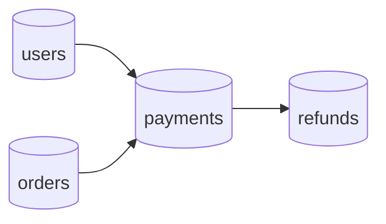

Bu diagram `.sdd` modelinə bağlana bilər.

---

# 23.21. API discovery

Agent:

```text
routes
handlers
controllers
OpenAPI
Swagger
GraphQL
```

tapır.

Məsələn:

```text
POST /payments/refund
GET /payments/{id}
```

və onları source component-lərinə bağlayır.

---

# 23.22. Test discovery

Tapılır:

```text
unit
integration
BDD
E2E
UI
security
load
```

və framework:

```text
Go test
Playwright
Cypress
Jest
Vitest
Flutter test
```

və s.

---

# 23.23. Test coverage map

```text
PaymentService
    ├── unit_test
    ├── integration_test
    ├── BDD
    ├── E2E
    └── security_test
```

Əgər yalnız unit test varsa:

```text
CoverageRisk:
  MEDIUM
```

ola bilər.

---

# 23.24. Security discovery

Agent axtarır:

```text
Authentication
Authorization
RBAC
JWT
OAuth
CSRF
CORS
Rate limiting
Input validation
Encryption
Secrets
Audit logs
```

Sonra security model yaradır.

---

# 23.25. Security gap detection

Məsələn:

```text
Authentication:
  YES

Authorization:
  UNKNOWN

RateLimit:
  NO

AuditLog:
  YES
```

Discovery:

```text
SECURITY_GAP:
  Rate limiting missing
```

yaradır.

---

# 23.26. Infrastructure discovery

Agent:

```text
Dockerfile
docker-compose
Kubernetes
Terraform
Ansible
Nginx
CI/CD
Cloud configuration
```

araşdırır.

Məsələn:

```text
Docker
GitHub Actions
Nginx
VPS
```

tapılır.

---

# 23.27. Environment discovery

```text
.env.example
docker-compose
CI variables
deployment scripts
```

ilə:

```text
LOCAL
TEST
STAGING
PRODUCTION
```

fərqləndirilir.

---

# 23.28. Cloud detection

Agent:

```text
AWS
Azure
GCP
VPS
Bare metal
Unknown
```

tapır.

Məsələn:

```text
terraform/aws/
```

→ AWS.

Əgər:

```text
docker-compose.yml
nginx/
deploy.sh
```

var, amma cloud provider yoxdur:

```text
Infrastructure:
  Generic VPS / Unknown
```

---

# 23.29. Runtime discovery

Agent mümkün qədər runtime-u da analiz edir:

```text
ports
services
containers
healthchecks
environment
dependencies
```

Məsələn:

```text
API :8080
Postgres :5432
Redis :6379
```

---

# 23.30. Documentation discovery

Mövcud:

```text
README
docs/
ADR
architecture/
wiki
```

tapılır.

Sonra:

```text
DOC
 ↓
SOURCE
```

mapping edilir.

---

# 23.31. Existing `.sdd` discovery

Əgər project-də artıq:

```text
.sdd/
```

varsa, agent əvvəl onu oxuyur.

Sonra:

```text
.sdd
vs
source
```

müqayisə edilir.

---

# 23.32. Existing `.sdd` + source

```text
          .sdd
           │
           │ compare
           ↓
         SOURCE
           │
       ┌───┴───┐
       ↓       ↓
     MATCH   CONFLICT
```

MATCH:

```text
VALID
```

CONFLICT:

```text
DRIFT
```

---

# 23.33. Drift types

```text
STACK_DRIFT
ARCHITECTURE_DRIFT
TASK_DRIFT
DOC_DRIFT
SECURITY_DRIFT
TEST_DRIFT
INFRA_DRIFT
DECISION_DRIFT
```

---

# 23.34. Example

`.sdd`:

```text
Cache:
  Redis
```

Source:

```text
Redis + Memcached
```

Discovery:

```text
STACK_DRIFT
```

Agent soruşmur:

> Redis-i silim?

Sadəcə:

```text
Detected:
  Redis
  Memcached

.sdd:
  Redis

Conflict:
  Memcached not documented
```

çıxarır.

---

# 23.35. Discovery report

Human üçün:

```text
docs/discovery/
└── project-analysis.md
```

AI üçün:

```text
.sdd/discovery/
```

Məsələn:

```text
Project:
  Payment Platform

Detected:
  Go
  React
  React Native
  PostgreSQL
  Redis
  Docker

Architecture:
  Modular Monolith

Domains:
  Users
  Payments
  Orders

Tests:
  Unit
  Integration
  E2E

Risks:
  Missing load tests
  Missing rate limiting
```

---

# 23.36. Discovery score

Project-in nə qədər yaxşı başa düşüldüyünü ölçək:

```text
DiscoveryScore:
  87%
```

Məsələn:

```text
Structure       100%
Stack            98%
Architecture     90%
Testing          80%
Security         70%
Infrastructure   95%
Documentation    75%
```

---

# 23.37. Unknown budget

AI project-i analiz edib:

```text
Unknown:
  13%
```

deyə bilər.

Bu çox vacibdir.

Çünki sistem:

> “Mən hər şeyi bilirəm.”

deməməlidir.

---

# 23.38. Discovery quality gate

Project analysis tamamlananda:

```text
DISCOVERY COMPLETE
```

yalnız əgər:

```text
Structure known
Stack known
Architecture sufficiently known
Critical dependencies known
Security baseline known
Testing baseline known
```

olmalıdır.

---

# 23.39. Greenfield vs Brownfield

Root:

```text
.sdd/project/mode.sdd
```

məsələn:

```text
Mode:
  GREENFIELD
```

və ya:

```text
Mode:
  BROWNFIELD
```

və ya:

```text
Mode:
  HYBRID
```

---

# 23.40. Hybrid

Ən maraqlı rejim:

```text
Existing Laravel monolith
        +
New requirements
        ↓
HYBRID
```

AI mövcud kodu qoruyur, yeni architecture-i onun üstünə qurur.

---

# 23.41. Sənin Laravel → Microservice nümunən

Discovery görür:

```text
Laravel
 ↓
vendor/
 ↓
large dependency tree
```

və microservice migration planında:

```text
Monolith
 ↓
Extract bounded context
 ↓
Build independent service
```

analiz edir.

Amma `vendor/`-u hər microservice-ə copy etmək əvəzinə:

```text
dependency
 ↓
service build image
 ↓
runtime image
```

modelini tövsiyə edə bilər.

Bu artıq **architecture optimization** phase-lərinin input-u olacaq.

---

# 23.42. Dependency footprint analysis

Agent:

```text
vendor/
node_modules/
Go dependencies
Docker layers
```

analiz edib:

```text
Size
Runtime dependency
Build dependency
Shared dependency
Unused dependency
```

ayırır.

---

# 23.43. Build vs runtime dependency

Məsələn:

```text
Build:
  compiler
  dev dependencies
  source

Runtime:
  binary
  required libraries
```

Agent multi-stage Docker modelini təklif edə bilər.

Bu sənin dediyin:

> “vendoru image edib başqa layer kimi istifadə etmək”

ideyasına da bağlanır.

---

# 23.44. Architecture recommendation

Discovery-dən sonra agent:

```text
CURRENT
```

və:

```text
RECOMMENDED
```

ayrılığını saxlamalıdır.

Məsələn:

```text
Current:
  Laravel monolith

Recommended:
  Modular monolith

Future:
  Selective service extraction
```

Birbaşa:

```text
MICROSERVICES
```

deməməlidir.

---

# 23.45. Complexity calibration

Ən vacib policy:

```text
Project size
+
Traffic
+
Team
+
Business criticality
+
Operational maturity
```

architecture seçiminə təsir edir.

Kiçik project üçün:

```text
Modular Monolith
```

çox vaxt daha doğru ola bilər.

1M DAU və yüksək reliability tələb edən project üçün:

```text
Distributed architecture
```

lazım ola bilər.

Agent bunu avtomatik qiymətləndirəcək.

---

# 23.46. Discovery → Skills

Discovery nəticəsində:

```text
Go
PostgreSQL
Redis
Docker
React
React Native
Playwright
```

tapılır.

Agent:

```text
required skills
```

seçir.

Amma bütün skill-ləri aktivləşdirmir.

---

# 23.47. Discovery → Docs

Mövcud project üçün:

```text
docs/
```

çatışmırsa, agent:

```text
documentation gaps
```

çıxarır.

Məsələn:

```text
Missing:
  Architecture
  Security
  Deployment
  Incident Runbook
```

və bunları task-a çevirə bilər.

---

# 23.48. Discovery → Tasks

Məsələn:

```text
SECURITY_GAP:
  Missing rate limit
```

↓

```text
SEC-101
```

və:

```text
DOC_GAP:
  Missing deployment documentation
```

↓

```text
DOC-201
```

Beləliklə discovery sadəcə report deyil.

**Actionable backlog** yaradır.

---

# 23.49. Discovery → Baseline

Ən sonda:

```text
.sdd/discovery/baseline.sdd
```

yaradılır.

Bu:

> Project-in discovery anındakı vəziyyətinin snapshot-ıdır.

Sonrakı analizlər bununla müqayisə edilir.

---

# 23.50. Architecture

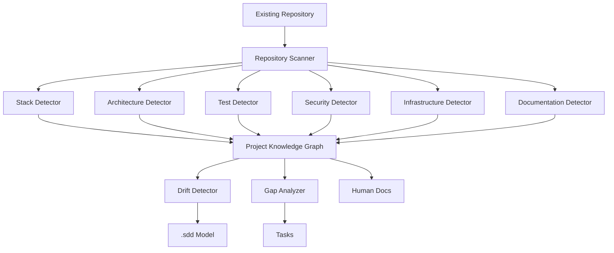

---

# 23.51. Ən vacib prinsip

Discovery Engine heç vaxt:

```text
source → guess → overwrite .sdd
```

etməməlidir.

Doğru:

```text
source
 ↓
evidence
 ↓
inference
 ↓
confidence
 ↓
comparison
 ↓
human/agent decision
 ↓
.sdd update
```

---

# 23.52. Phase 23 nəticəsi

Artıq agent iki dünyanı başa düşür:

```text
GREENFIELD
```

```text
Idea
 ↓
Design
 ↓
.sdd
 ↓
Implementation
```

və:

```text
BROWNFIELD
```

```text
Existing Code
 ↓
Discovery
 ↓
Reverse Engineering
 ↓
.sdd
 ↓
Documentation
 ↓
Tasks
```

Bu isə sənin əvvəl dediyin:

> **“Mən `.sdd` qovluğunu project-ə əlavə edirəm və sadəcə `layihəni analiz et` deyirəm.”**

əmrinin arxasındakı real mexanizmdir.

---

# Progress

```text
PHASE 13  Task Engine                    ✅
PHASE 14  Security Engine                ✅
PHASE 15  Testing Engine                 ✅
PHASE 16  Architecture & Decision Engine ✅
PHASE 17  Stack & Technology Engine      ✅
PHASE 18  SDLC / Workflow Orchestrator   ✅
PHASE 19  Observability / Incident       ✅
PHASE 20  Documentation / Knowledge      ✅
PHASE 21  Context Router / Token Engine  ✅
PHASE 22  Agent Runtime / Tool Engine    ✅
PHASE 23  Project Discovery Engine       ✅
```

## Növbəti — PHASE 24

**ENGINEERING KNOWLEDGE GRAPH & TRACEABILITY ENGINE**

Burada artıq bütün sistemdəki:

```text
PROMPT
 ↓
REQUIREMENT
 ↓
DECISION
 ↓
TASK
 ↓
WORKFLOW
 ↓
SKILL
 ↓
CODE
 ↓
BDD
 ↓
TEST
 ↓
SECURITY
 ↓
INFRASTRUCTURE
 ↓
DEPLOYMENT
 ↓
RUNTIME
 ↓
INCIDENT
 ↓
DOCUMENTATION
```

elementlərini **bir-biri ilə əlaqələndirən əsas graph** quracağıq.

Bu phase xüsusilə sənin:

> **“Zəncir hara gedib, harada qırılıb, hansı qərardan yaranıb, hansı kodda işləyir və problem çıxanda kim baxmalıdır?”**

problemini tam həll edən əsas backbone olacaq.


________________________________________________________________________________________________
next
# PHASE 24 — ENGINEERING KNOWLEDGE GRAPH & TRACEABILITY ENGINE

Bu phase bütün `.sdd` sisteminin **əsas backbone-u** olacaq.

Əvvəlki phase-lərdə ayrı-ayrı sistemlər yaratdıq. İndi onları bir-birinə bağlayırıq.

Əsas fikir:

> **Heç bir iş “tək fayl” olmamalıdır. Hər işin haradan gəldiyi, nə yaratdığı, hansı kodu dəyişdirdiyi, hansı testlə qorunduğu və problem yarananda harada qırıldığı izlənə bilməlidir.**

---

# 24.1. Əsas chain

Sistemin əsas əlaqəsi:

```text
INPUT
  ↓
REQUIREMENT
  ↓
DECISION
  ↓
TASK
  ↓
WORKFLOW
  ↓
SKILL
  ↓
CODE
  ↓
BDD
  ↓
TEST
  ↓
SECURITY
  ↓
INFRA
  ↓
DEPLOYMENT
  ↓
RUNTIME
  ↓
INCIDENT
```

Amma bu **tək istiqamətli chain deyil**.

Məsələn:

```text
INCIDENT
   ↓
CODE
   ↓
TASK
   ↓
DECISION
```

geri qayıtmaq da mümkün olmalıdır.

---

# 24.2. Knowledge Graph

Yeni struktur:

```text
.sdd/
└── graph/
    ├── INDEX.sdd
    ├── nodes.sdd
    ├── relations.sdd
    ├── traceability.sdd
    ├── impact.sdd
    ├── ownership.sdd
    ├── dependencies.sdd
    ├── coverage.sdd
    └── drift.sdd
```

Burada məqsəd hər şeyi bir böyük fayla yığmaq deyil.

Bu fayllar graph-ın **qaydalarını və indekslərini** saxlayır.

---

# 24.3. Node modeli

Sistemdə hər əsas obyekt node olacaq:

```text
PROMPT
REQUIREMENT
DECISION
TASK
WORKFLOW
SKILL
PROJECT
DOMAIN
MODULE
COMPONENT
CODE
BDD
TEST
SECURITY
INFRA
DEPLOYMENT
RUNTIME
INCIDENT
DOCUMENT
```

---

# 24.4. Node ID

Hər node standart ID alır:

```text
PROMPT-019
REQ-042
DEC-017
PAY-1023
WF-DEV-001
SKILL-IDEMPOTENCY
CODE-PAY-REFUND
BDD-PAY-1023
TEST-PAY-1023
SEC-004
INFRA-REDIS-01
INC-2026-019
DOC-PAY-REFUND
```

Bu ID-lər sistemin **qısa dili** olacaq.

AI uzun cümlə əvəzinə:

```text
PAY-1023
```

görüb həmin task-ın bütün əlaqələrini graph-dan tapır.

Bu həm insan üçün oxunaqlıdır, həm də token istifadəsini azaldır.

---

# 24.5. Relation modeli

Node-lar arasında standart əlaqələr:

```text
CREATED_BY
IMPLEMENTS
DEPENDS_ON
BLOCKED_BY
USES
TESTED_BY
VERIFIED_BY
SECURED_BY
DEPLOYED_BY
RUNS_ON
DOCUMENTED_BY
CAUSED_BY
AFFECTS
OWNS
RELATED_TO
REPLACES
SUPERSEDES
CONFLICTS_WITH
```

---

# 24.6. Sənin task nümunən

Məsələn:

```text
PAY-1023
```

graph-da:

```text
PROMPT-019
      │
      ▼
   PAY-1023
      │
      ├── DEPENDS_ON → PAY-0999
      │
      ├── USES → SKILL-IDEMPOTENCY
      │
      ├── IMPLEMENTS → CODE-PAY-REFUND
      │
      ├── VERIFIED_BY → TEST-PAY-1023
      │
      ├── SECURED_BY → SEC-004
      │
      └── DOCUMENTED_BY → DOC-PAY-REFUND
```

---

# 24.7. Task dependency artıq daha güclü olur

Sənin əvvəl verdiyin:

```text
1000

1001 → 1011 → 1023
```

modeli graph-a çevrilir:

```text
1000

1001
  ↓
1011
  ↓
1023
```

Agent `1023` seçəndə:

```text
1023
 ↓
1011
 ↓
1001
```

oxuyur.

Sonra **dependency order** ilə icra edir:

```text
1001
 ↓
1011
 ↓
1023
```

---

# 24.8. Əsas task qaydası

Task execution:

```text
Requested Task
      ↓
Find Dependencies
      ↓
Resolve Dependency Tree
      ↓
Find Unblocked Root Tasks
      ↓
Execute Smallest Ready Task
      ↓
Verify
      ↓
Unlock Next
```

Beləliklə task numbering yalnız ID-dir.

**İcra sırası ID-dən yox, dependency graph-dan gəlir.**

---

# 24.9. Cycle detection

Əgər:

```text
1001 → 1011
1011 → 1023
1023 → 1001
```

olarsa:

```text
TASK-CYCLE
```

və execution dayanır.

Agent:

```text
Cannot determine safe execution order.
```

deyib human-a ötürür.

---

# 24.10. Impact analysis

Ən vacib funksiyalardan biri:

> “Bu kodu dəyişsəm nə təsirlənəcək?”

Məsələn:

```text
repository.go
```

dəyişir.

Graph:

```text
repository.go
    ↓
PaymentService
    ↓
Refund API
    ↓
PAY-1023
    ↓
BDD
    ↓
Integration Test
    ↓
Security Test
```

çıxara bilər.

---

# 24.11. Reverse impact

Əksinə:

> “Bu incident hansı kodlara bağlıdır?”

```text
INC-2026-019
      ↓
SEC-004
      ↓
PAY-1023
      ↓
refund.go
      ↓
PaymentService
```

---

# 24.12. Blast radius

Hər dəyişiklik üçün:

```text
BLAST RADIUS
```

hesablanır.

Məsələn:

```text
Changed:
  PaymentRepository

Affected:
  4 services
  8 APIs
  12 tests
  2 workflows

Risk:
  HIGH
```

---

# 24.13. Risk score

Graph aşağıdakılara əsasən risk hesablaya bilər:

```text
Dependency count
Criticality
Security sensitivity
Data sensitivity
Traffic
Number of consumers
Production exposure
Test coverage
```

Məsələn:

```text
Risk = HIGH
```

çünki:

```text
Payment
+
Production
+
High traffic
+
Low test coverage
```

---

# 24.14. Coverage graph

Artıq sadəcə test coverage faizimiz olmayacaq.

Məsələn:

```text
PAY-1023
 ├── BDD ✅
 ├── Unit ✅
 ├── Integration ✅
 ├── E2E ❌
 ├── Security ✅
 └── Load ❌
```

Human dərhal görür:

> İş functional olaraq test olunub, amma load test yoxdur.

---

# 24.15. Security coverage

Eyni model security üçün:

```text
PAY-1023
 ├── Authentication ✅
 ├── Authorization ✅
 ├── Input Validation ✅
 ├── Idempotency ✅
 ├── Rate Limit ❌
 ├── Abuse Test ❌
 └── Pentest ❌
```

---

# 24.16. Infrastructure coverage

```text
PAY-1023
   ↓
Infrastructure
   ├── Docker ✅
   ├── CI/CD ✅
   ├── Monitoring ✅
   ├── Backup ✅
   ├── Load Test ❌
   └── DDoS Strategy ❌
```

Beləliklə task yalnız developer işi olmur.

---

# 24.17. Ownership

Hər node-un owner-i ola bilər:

```text
OWNER:
  BUSINESS
  BACKEND
  FRONTEND
  MOBILE
  QA
  SECURITY
  DEVOPS
  DBA
  SUPPORT
```

Məsələn:

```text
SEC-004
Owner:
  SECURITY
```

və:

```text
PAY-1023
Owner:
  BACKEND
```

---

# 24.18. Problem çıxanda kim işləməlidir?

Məsələn:

```text
INC-019
```

graph:

```text
INC-019
 ↓
PAY-1023
 ↓
PAYMENT
 ↓
SEC-004
```

Ownership:

```text
Primary:
  Backend

Secondary:
  Security

Infrastructure:
  DevOps
```

Support komandası isə sənəddən:

```text
Who should handle this?
```

cavabını tapa bilər.

Bu sənin əvvəlki **Human Docs role separation** istəyinə birbaşa bağlanır.

---

# 24.19. Human documentation mapping

Graph:

```text
CODE
 ↓
DOMAIN
 ↓
DOCUMENT
```

Məsələn:

```text
BE/internal/payments/refund.go
        ↓
Payment Domain
        ↓
docs/business/payments.md
docs/developer/payments.md
docs/support/payments.md
docs/infrastructure/payments.md
```

Kodun yanında `.md` saxlanılmır.

Bu sənin istədiyin clean project prinsipini qoruyur.

---

# 24.20. AI `.sdd` sənədini tapır

Məsələn source:

```text
BE/internal/payments/refund.go
```

AI:

```text
path
 ↓
graph
 ↓
CODE-PAY-REFUND
 ↓
related docs
 ↓
related tasks
 ↓
skills
 ↓
tests
```

tapır.

Yəni AI bütün repository-ni hər dəfə oxumağa məcbur deyil.

---

# 24.21. Token optimization

Bu sistemin ən böyük üstünlüklərindən biri burada gəlir.

Pis model:

```text
Read whole project
Read all docs
Read all skills
Read all tasks
Read all tests
```

Çox token.

Yeni model:

```text
User request
 ↓
TASK ID
 ↓
GRAPH
 ↓
Affected nodes
 ↓
Relevant context
```

Məsələn yalnız:

```text
PAY-1023
SKILL-IDEMPOTENCY
CODE-PAY-REFUND
BDD-PAY-1023
TEST-PAY-1023
SEC-004
```

oxunur.

---

# 24.22. Context budget

Graph router deyə bilər:

```text
Context budget:
  12k tokens
```

və prioritet:

```text
P0:
  Task

P1:
  Dependencies

P2:
  Relevant skills

P3:
  Code

P4:
  Tests

P5:
  Docs
```

Lazım olmayan şey context-ə girmir.

---

# 24.23. Graph traversal modes

Agent müxtəlif suallar üçün müxtəlif traversal istifadə edir.

### IMPLEMENT

```text
TASK
 ↓
DEPENDENCIES
 ↓
SKILLS
 ↓
CODE
 ↓
TEST
```

### DEBUG

```text
INCIDENT
 ↓
RUNTIME
 ↓
CODE
 ↓
TASK
 ↓
DECISION
```

### SECURITY

```text
SECURITY ISSUE
 ↓
CODE
 ↓
API
 ↓
INFRA
 ↓
TEST
```

### SUPPORT

```text
INCIDENT
 ↓
DOC
 ↓
RUNBOOK
 ↓
OWNER
```

---

# 24.24. Decision trace

Əvvəlki qərarlar da graph-da olur.

Məsələn:

```text
DEC-017
```

deyir:

```text
Architecture:
  Modular Monolith
```

və:

```text
PROJECT
   ↓
DEC-017
   ↓
ARCHITECTURE
   ↓
MODULES
```

Sonradan biri:

> Niyə microservice deyil?

soruşanda agent qərarın tarixçəsini tapır.

---

# 24.25. Decision superseding

Yeni qərar:

```text
DEC-024
```

köhnəni əvəz edir:

```text
DEC-024
   ↓
SUPERSEDES
   ↓
DEC-017
```

Beləliklə köhnə qərar silinmir.

History qalır.

---

# 24.26. Historical trace

Bu çox vacibdir.

Sistem:

```text
CURRENT
```

və:

```text
HISTORY
```

ayırmalıdır.

Məsələn:

```text
Current architecture:
  Modular Monolith

Historical:
  DEC-001 → Monolith
  DEC-017 → Modular Monolith
```

---

# 24.27. Drift detection

Graph source və `.sdd` arasında müqayisə edir.

```text
.sdd:
  React

source:
  Vue
```

↓

```text
STACK_DRIFT
```

və:

```text
decision:
  DEC-031
```

ilə dəyişiklik təsdiqlənibsə:

```text
VALID_DRIFT
```

Əgər qərar yoxdur:

```text
UNEXPLAINED_DRIFT
```

---

# 24.28. Unexplained change

Bu sistemdə çox faydalı olacaq:

```text
Source changed
       ↓
Graph changed
       ↓
No task
No decision
No workflow
       ↓
UNTRACEABLE CHANGE
```

Bu artıq ciddi engineering riskidir.

---

# 24.29. Traceability score

Project üçün:

```text
Traceability:
  91%
```

hesablana bilər.

Məsələn:

```text
Code → Task             95%
Task → Requirement      98%
Task → Test             90%
Task → Security        85%
Decision → Code         88%
Incident → Code         80%
Docs → Code             92%
```

---

# 24.30. Broken chain detection

Ən vacib audit:

```text
PROMPT
 ↓
TASK
 ↓
CODE
 ↓
TEST
```

amma:

```text
TASK
 ↓
CODE
 ↓
❌ TEST
```

onda:

```text
TRACE-BROKEN
```

çıxır.

---

# 24.31. Broken workflow

Məsələn:

```text
BDD
 ↓
CODE
 ↓
TEST
 ↓
SECURITY
 ↓
DEPLOY
```

Security keçilməyibsə:

```text
WORKFLOW-BROKEN
```

və production deploy bloklana bilər.

---

# 24.32. Graph as source of truth

Burada vacib qərar:

> Graph bütün məlumatın özü deyil.

Əsas source-lar öz yerlərində qalır:

```text
Task → tasks/
Decision → decisions/
Skill → skills/
Code → project source
Docs → docs/
```

Graph yalnız:

```text
RELATIONSHIP
INDEX
TRACE
IMPACT
```

saxlayır.

Bu project-in təmiz qalmasını qoruyur.

---

# 24.33. Yəni `.sdd` içində duplicate yaratmırıq

Pis:

```text
.sdd/
 ├── code-copy/
 ├── docs-copy/
 └── tests-copy/
```

Yox.

Düzgün:

```text
.sdd/
├── tasks/
├── decisions/
├── skills/
├── workflow/
├── graph/
└── project/
```

Graph source fayllara reference verir.

---

# 24.34. Human view vs AI view

Eyni məlumat iki formada görünür.

### AI

```text
PAY-1023
DEPENDS_ON: PAY-0999
USES: SKILL-IDEMPOTENCY
TESTED_BY: TEST-1023
```

### Human

```text
Refund əməliyyatının eyni request üçün ikinci dəfə
icra edilməsinin qarşısını almaq.

Bu iş:
- Payment backend-ə aiddir
- Idempotency qaydasından istifadə edir
- BDD və integration test ilə qorunur
- Security testdən keçir
```

---

# 24.35. Diagram generation

Graph-dan avtomatik diagram yaradıla bilər.

Məsələn:

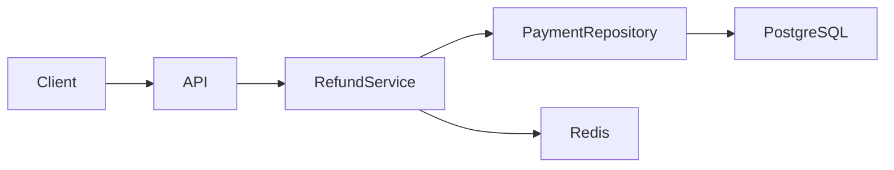

Amma diagram əl ilə source-of-truth deyil.

Graph dəyişəndə diagram yenidən generate edilir.

---

# 24.36. Diagram types

Sistem standart diagram növləri tanımalıdır:

```text
SYSTEM
ARCHITECTURE
DOMAIN
DATA
SEQUENCE
DEPLOYMENT
NETWORK
SECURITY
DEPENDENCY
WORKFLOW
TRACEABILITY
```

Agent uyğun olanı seçir.

---

# 24.37. Architecture → diagram

Əgər:

```text
Architecture:
  Modular Monolith
```

onda:

```text
System Diagram
Domain Diagram
Dependency Diagram
```

yaradıla bilər.

Əgər:

```text
Architecture:
  Microservices
```

onda:

```text
Service Map
Network Diagram
Deployment Diagram
Data Flow
```

daha vacib olur.

---

# 24.38. Scale-aware graph

Project:

```text
DAU
MAU
RPS
Storage
Traffic
```

kimi metric-ləri də graph-a bağlaya bilər.

Məsələn:

```text
PROJECT
 ↓
SCALE
 ├── DAU: 1M
 ├── MAU: 5M
 ├── Peak RPS: 20k
 └── Storage: 8TB
```

Architecture decision:

```text
DEC-042
```

bu scale context-ə bağlanır.

---

# 24.39. Nəticədə AI nə anlayır?

User:

> “Payment sistemini böyüt.”

AI yalnız cümləni analiz etmir.

Graph-dan:

```text
Project:
  Payment Platform

Current:
  Modular Monolith

DAU:
  1M

DB:
  PostgreSQL

Cache:
  Redis

Known bottleneck:
  PaymentRepository

Security:
  PCI-sensitive

Existing decision:
  DEC-017
```

tapır.

Sonra architecture recommendation verir.

---

# 24.40. Phase 24-ün əsas nəticəsi

Artıq sistemimiz:

```text
INPUT
 ↓
KNOWLEDGE
 ↓
DECISION
 ↓
TASK
 ↓
WORKFLOW
 ↓
SKILL
 ↓
CODE
 ↓
TEST
 ↓
SECURITY
 ↓
INFRA
 ↓
RUNTIME
 ↓
INCIDENT
```

hamısını **bir əlaqəli engineering model** kimi görə bilir.

---

# Progress

```text
PHASE 13  Task Engine                    ✅
PHASE 14  Security Engine                ✅
PHASE 15  Testing Engine                 ✅
PHASE 16  Architecture & Decision Engine ✅
PHASE 17  Stack & Technology Engine      ✅
PHASE 18  SDLC / Workflow Orchestrator   ✅
PHASE 19  Observability / Incident       ✅
PHASE 20  Documentation / Knowledge      ✅
PHASE 21  Context Router / Token Engine  ✅
PHASE 22  Agent Runtime / Tool Engine    ✅
PHASE 23  Project Discovery Engine       ✅
PHASE 24  Knowledge Graph & Traceability ✅
```

## Növbəti — PHASE 25

**AUTOMATED QUALITY, SECURITY & RELEASE GATE ENGINE**

Burada sənin xüsusilə vurğuladığın:

```text
BDD
→ Code
→ TS/static checks
→ UI/E2E
→ Manual
→ Security
→ SAST
→ Dependency scan
→ DAST
→ Pentest
→ Load test
→ DDoS resilience
→ Infrastructure
→ Release
→ Production
```

axınını **bir universal gate sistemi** kimi quracağıq.

Ən vacibi də: BE, FE, MD, DB, QA, Security və DevOps ayrı-ayrı “dünyalar” olmayacaq; **bir taskın impact graph-ına görə hansı layer-lərin hansı test/gate-dən keçməli olduğunu AI özü müəyyən edəcək.**


________________________________________________________________________________________________
next

# PHASE 25 — AUTOMATED QUALITY, SECURITY & RELEASE GATE ENGINE

Bu phase-də artıq sistemin **“iş hazırdır” deməsi üçün nə baş verməlidir?** sualını standartlaşdırırıq.

Əsas prinsip:

> **Task bitməsi ≠ Release üçün hazır olması.**

Bir task kod səviyyəsində bitə bilər, amma BDD, security, performance, infrastructure və production readiness tamamlanmayıbsa release edilə bilməz.

---

# 25.1. Universal lifecycle

Sənin dediyin SDLC + STLC axınını belə modelləşdiririk:

```text
REQUIREMENT
    ↓
BDD
    ↓
IMPLEMENTATION
    ↓
STATIC QUALITY
    ↓
UNIT TEST
    ↓
INTEGRATION TEST
    ↓
E2E / UI
    ↓
SECURITY
    ↓
PERFORMANCE
    ↓
INFRASTRUCTURE
    ↓
REVIEW
    ↓
RELEASE
    ↓
DEPLOY
    ↓
RUNTIME VERIFY
```

Amma **hər project üçün bütün mərhələlər məcburi deyil.**

---

# 25.2. Ən vacib qayda — adaptive gates

Məsələn kiçik landing page:

```text
BDD
 ↓
Code
 ↓
Lint
 ↓
UI
 ↓
Release
```

Payment sistemi:

```text
BDD
 ↓
Code
 ↓
Unit
 ↓
Integration
 ↓
E2E
 ↓
Security
 ↓
SAST
 ↓
DAST
 ↓
Load
 ↓
Pentest
 ↓
Release
```

Mobile app:

```text
BDD
 ↓
Code
 ↓
Unit
 ↓
Widget
 ↓
E2E
 ↓
Security
 ↓
Build
 ↓
Store/TestFlight
```

AI project-in context-inə görə gate seçir.

---

# 25.3. Gate engine

Yeni struktur:

```text
.sdd/
└── gates/
    ├── INDEX.sdd
    ├── policy.sdd
    ├── levels.sdd
    ├── quality.sdd
    ├── testing.sdd
    ├── security.sdd
    ├── performance.sdd
    ├── infrastructure.sdd
    ├── release.sdd
    ├── exceptions.sdd
    └── evidence.sdd
```

---

# 25.4. Gate nədir?

Gate sadəcə:

```text
TEST PASSED
```

deyil.

Gate:

```text
Condition
+
Evidence
+
Threshold
+
Owner
+
Decision
```

deməkdir.

Məsələn:

```text
SECURITY-GATE-004

Condition:
  No critical vulnerability

Evidence:
  SAST report

Threshold:
  Critical = 0

Owner:
  Security
```

---

# 25.5. Gate statusları

Standartlaşdırırıq:

```text
PENDING
RUNNING
PASSED
FAILED
BLOCKED
SKIPPED
WAIVED
EXPIRED
```

---

# 25.6. SKIPPED və WAIVED fərqi

Çox vacibdir.

### SKIPPED

Gate project üçün tətbiq olunmur.

```text
Mobile-only project:
  Infrastructure load balancer test
  → SKIPPED
```

### WAIVED

Gate tətbiq olunur, amma xüsusi qərarla keçilir.

```text
Pentest
→ WAIVED
Reason:
  Internal staging only

Approved:
  DEC-092
```

Beləliklə:

```text
SKIPPED ≠ WAIVED
```

---

# 25.7. Evidence

Hər gate nəticəsinin sübutu olmalıdır.

Məsələn:

```text
BDD-GATE
Evidence:
  test result

SECURITY-GATE
Evidence:
  SAST report

LOAD-GATE
Evidence:
  k6 report

DEPLOY-GATE
Evidence:
  deployment result
```

AI:

> “Bu gate keçib.”

deyəndə bunu sübut edə bilməlidir.

---

# 25.8. Gate chain

Məsələn:

```text
BDD-001
   ↓
CODE-001
   ↓
TEST-001
   ↓
SEC-001
   ↓
PERF-001
   ↓
RELEASE-001
```

Bir gate failure:

```text
TEST-001 ❌
```

sonrakıları:

```text
SEC-001
PERF-001
RELEASE-001
```

bloklaya bilər.

---

# 25.9. Critical gate

Bəzi gate-lər **hard blocker** olacaq.

Məsələn:

```text
CRITICAL SECURITY
```

failure:

```text
Release = BLOCKED
```

Amma:

```text
Documentation completeness = 90%
```

release-i mütləq bloklamaya bilər.

---

# 25.10. Gate severity

```text
BLOCKER
CRITICAL
HIGH
MEDIUM
LOW
INFO
```

Məsələn:

```text
Critical vulnerability:
  BLOCKER

Missing README:
  LOW
```

---

# 25.11. BDD Gate

Task başlamazdan əvvəl:

```text
Requirement
 ↓
BDD Scenario
```

olmalıdır.

Məsələn:

```gherkin
Feature: Refund idempotency

Scenario: Duplicate refund request
  Given a refund already exists
  When the same refund request is submitted
  Then a second refund must not be created
```

Gate:

```text
BDD-GATE
Status:
  PASSED
```

---

# 25.12. Implementation Gate

BDD olmadan code yazılıbsa:

```text
BDD:
  MISSING

Implementation:
  EXISTS
```

system bunu:

```text
PROCESS-VIOLATION
```

kimi qeyd edir.

Amma emergency task üçün exception mümkündür.

---

# 25.13. Static Quality Gate

Bütün stack-lər üçün uyğun skill çağırılır.

### Go

```text
gofmt
go vet
staticcheck
tests
```

### TypeScript

```text
eslint
tsc
tests
```

### Flutter

```text
dart analyze
flutter test
```

### React Native

```text
eslint
tsc
jest
```

AI stack-ə görə toolchain seçir.

---

# 25.14. Unit Gate

```text
UNIT-GATE
```

Məsələn:

```text
Tests:
  124

Passed:
  124

Failed:
  0
```

---

# 25.15. Integration Gate

Burada real dependency-lər yoxlanılır:

```text
API
 ↓
DB
 ↓
Redis
 ↓
Queue
```

Məsələn payment task üçün:

```text
PostgreSQL
Redis
Payment API
```

birlikdə test olunur.

---

# 25.16. E2E Gate

Frontend və mobile ayrıca nəzərə alınır.

```text
FE
 ↓
API
 ↓
BE
 ↓
DB
```

və:

```text
MD
 ↓
API
 ↓
BE
```

---

# 25.17. UI test gate

Stack-ə uyğun:

```text
Playwright
Cypress
Detox
Flutter integration
```

kimi testlər seçilir.

AI sadəcə “UI test et” demir.

Project skill registry-dən uyğun tool seçir.

---

# 25.18. Manual QA Gate

Manual test də graph-a daxil olur.

```text
TASK
 ↓
AUTO TEST
 ↓
MANUAL QA
```

Manual nəticə:

```text
PASSED
FAILED
BLOCKED
```

---

# 25.19. Security Gate

Bu sənin sistemində **birinci dərəcəli gate** olacaq.

Security:

```text
SAST
 ↓
Dependency Scan
 ↓
Secrets Scan
 ↓
DAST
 ↓
Security Tests
 ↓
Pentest
```

---

# 25.20. SAST

Source code scan:

```text
SQL Injection
XSS
Command Injection
Path Traversal
Unsafe crypto
```

və s.

---

# 25.21. Dependency security

```text
go.mod
package.json
pubspec.yaml
composer.json
```

və s. dependency-lər yoxlanılır.

Nəticə:

```text
CRITICAL = 0
HIGH = 0
```

kimi policy ola bilər.

---

# 25.22. Secrets gate

Axtarılır:

```text
API keys
Passwords
Tokens
Private keys
Cloud credentials
```

Source repository-də secret varsa:

```text
SECURITY-GATE ❌
```

---

# 25.23. DAST

Running application test edilir.

```text
Internet
 ↓
Application
 ↓
Attack simulation
```

Məsələn:

```text
Authentication
Authorization
Input validation
Session
API abuse
```

---

# 25.24. Pentest Gate

Pentest avtomatik testdən fərqlənir.

Gate:

```text
PENTEST
```

üçün:

```text
Scope
Tester
Date
Environment
Findings
Remediation
Retest
```

saxlanılır.

---

# 25.25. Pentest finding

Məsələn:

```text
PENTEST-004

Severity:
  HIGH

Finding:
  Broken authorization

Status:
  FIXED

Retest:
  PASSED
```

Graph:

```text
PENTEST-004
 ↓
SEC-004
 ↓
TASK-1088
 ↓
CODE
 ↓
TEST
```

---

# 25.26. Performance Gate

Sistem load test-i də context-ə görə seçir.

Məsələn:

```text
1M DAU
```

olan project üçün performance gate yüksək səviyyədə olur.

Kiçik admin paneldə isə minimal ola bilər.

---

# 25.27. Performance metrics

```text
RPS
P50
P95
P99
Error rate
CPU
Memory
DB latency
Cache hit rate
Queue latency
```

---

# 25.28. Example

```text
LOAD-GATE

Target:
  10,000 RPS

P95:
  < 200ms

Errors:
  < 0.1%

Result:
  PASSED
```

---

# 25.29. DDoS resilience

DDoS ayrıca gate olmalıdır.

AI:

```text
Internet exposure
+
Rate limiting
+
WAF
+
CDN
+
Load balancer
+
Autoscaling
```

analiz edir.

---

# 25.30. DDoS policy

Agent özü real DDoS hücumu həyata keçirməməlidir.

Bunun əvəzinə:

```text
authorized test environment
```

üçün:

```text
load simulation
rate-limit verification
capacity test
```

kimi controlled test planı yaradır.

Production üçün:

```text
DDoS provider protection
WAF
rate limiting
traffic filtering
```

yoxlanılır.

---

# 25.31. Infrastructure Gate

```text
Docker
CI/CD
Secrets
Networking
Healthcheck
Backup
Monitoring
Logging
```

yoxlanılır.

---

# 25.32. Deployment Gate

Məsələn VPS:

```text
Build
 ↓
Image
 ↓
Registry
 ↓
VPS
 ↓
Docker Compose
 ↓
Health Check
```

AWS:

```text
Build
 ↓
Registry
 ↓
ECS/EKS/etc.
 ↓
Load Balancer
 ↓
Health Check
```

GCP/Azure üçün skill registry-dən uyğun workflow seçilir.

---

# 25.33. Environment gates

```text
LOCAL
TEST
STAGING
PRODUCTION
```

hərəsinin öz gate-ləri ola bilər.

Production ən sərt səviyyədir.

---

# 25.34. Release Gate

Release yalnız:

```text
Required gates = PASSED
```

olduqda açılır.

Məsələn:

```text
BDD          ✅
Unit         ✅
Integration  ✅
E2E          ✅
Security     ✅
Performance  ✅
Infra        ✅
Manual QA    ✅
```

↓

```text
RELEASE APPROVED
```

---

# 25.35. Release decision

Release node:

```text
REL-2026-042
```

bunlarla əlaqələnir:

```text
TASKS
GATES
COMMIT
BUILD
IMAGE
DEPLOYMENT
ENVIRONMENT
```

---

# 25.36. Deployment verification

Deploy bitməsi kifayət deyil.

```text
DEPLOY
 ↓
SMOKE TEST
 ↓
HEALTH CHECK
 ↓
METRICS
 ↓
ERROR RATE
 ↓
VERIFY
```

---

# 25.37. Automatic rollback

Əgər:

```text
Error rate ↑
Latency ↑
Healthcheck FAIL
```

olarsa:

```text
Release
 ↓
Rollback policy
```

işə düşür.

---

# 25.38. Canary / Blue-Green

Project level-dən asılı olaraq:

```text
Small:
  Direct deployment

Medium:
  Rolling

Large:
  Canary

Critical:
  Blue/Green
```

AI scale skill-lərindən seçim edir.

---

# 25.39. Gate levels

Sistemin əvvəl danışdığımız:

```text
L0
L1
L2
L3
L4
L5
```

modelinə bağlayırıq.

### L0

```text
Prototype
```

Minimal checks.

### L1

```text
Small project
```

Basic test + lint.

### L2

```text
Production application
```

Security + integration + deployment checks.

### L3

```text
Business-critical
```

Performance + security + observability.

### L4

```text
High-scale
```

Resilience + disaster recovery + advanced security.

### L5

```text
Mission-critical
```

Formal controls + advanced resilience + continuous verification.

---

# 25.40. Gate selection

AI:

```text
Project Level
+
Technology
+
Risk
+
Scale
+
Data sensitivity
+
Business criticality
```

əsasında:

```text
Required Gates
```

çıxarır.

Bu çox vacibdir.

Sistem hər project-ə:

> “Microservice + Kubernetes + Pentest + Chaos Engineering”

məcbur etmir.

---

# 25.41. Quality profile

```text
.sdd/gates/profile.sdd
```

məsələn:

```text
ProjectLevel:
  L2

BusinessCriticality:
  HIGH

DataSensitivity:
  HIGH

InternetExposure:
  YES

Scale:
  1M_DAU
```

Agent bundan gate-ləri çıxarır.

---

# 25.42. Gate matrix

Məsələn:

| Gate            |       L1 |         L2 |       L3 | L4 | L5 |
| --------------- | -------: | ---------: | -------: | -: | -: |
| Lint            |        ✅ |          ✅ |        ✅ |  ✅ |  ✅ |
| Unit            |        ✅ |          ✅ |        ✅ |  ✅ |  ✅ |
| Integration     | optional |          ✅ |        ✅ |  ✅ |  ✅ |
| E2E             | optional |          ✅ |        ✅ |  ✅ |  ✅ |
| SAST            | optional |          ✅ |        ✅ |  ✅ |  ✅ |
| DAST            |        ❌ |   optional |        ✅ |  ✅ |  ✅ |
| Pentest         |        ❌ | risk-based |        ✅ |  ✅ |  ✅ |
| Load            |        ❌ | risk-based |        ✅ |  ✅ |  ✅ |
| DDoS resilience |        ❌ |          ❌ | optional |  ✅ |  ✅ |
| DR              |        ❌ |   optional |        ✅ |  ✅ |  ✅ |

Bu sadəcə **default policy** olacaq.

Project-specific policy bunu override edə bilər.

---

# 25.43. Gate exceptions

Bəzən:

```text
Production hotfix
```

kimi vəziyyət olur.

Onda:

```text
WAIVER
```

yaradılır.

Mütləq:

```text
Reason
Owner
Expiration
Risk
Approval
```

olmalıdır.

Məsələn:

```text
WAIVER-009

Gate:
  E2E

Reason:
  Production outage

Approved:
  Engineering Lead

Expires:
  24h
```

---

# 25.44. Expired waiver

Vaxt keçəndə:

```text
WAIVER-009
 ↓
EXPIRED
```

və sistem yenidən gate tələb edir.

Beləliklə “müvəqqəti exception” permanent bypass-a çevrilmir.

---

# 25.45. Gate audit

Hər gate:

```text
Who
What
When
Why
Result
Evidence
```

saxlamalıdır.

Bu compliance və incident araşdırması üçün çox vacibdir.

---

# 25.46. Gate → Graph

Gate-lər knowledge graph-a bağlanır:

```text
TASK
 ↓
GATE
 ↓
EVIDENCE
 ↓
RESULT
```

və:

```text
RELEASE
 ↓
GATES
 ↓
TASKS
```

---

# 25.47. Incident → Gate

Ən faydalı feedback loop:

Production incident:

```text
INC-101
```

araşdırılır.

Məlum olur:

```text
Load test yox idi.
```

Graph:

```text
INC-101
 ↓
MISSING-GATE
 ↓
LOAD-GATE
```

AI avtomatik:

```text
new improvement task
```

yarada bilər.

---

# 25.48. Continuous improvement

Beləliklə sistem:

```text
BUILD
 ↓
RELEASE
 ↓
RUNTIME
 ↓
INCIDENT
 ↓
LEARNING
 ↓
NEW GATE / SKILL / DECISION
 ↓
NEXT RELEASE
```

şəklində özünü təkmilləşdirir.

---

# 25.49. Skill evolution

Məsələn əvvəl:

```text
SKILL-LOAD-TEST
```

deyirdi:

```text
Run 1k RPS
```

Yeni best practice gəldi.

Skill:

```text
Version:
  1.1
```

olur.

AI:

```text
Current skill
+
new evidence
+
technology changes
```

ilə update proposal yaradır.

Amma skill özü avtomatik kor-koranə dəyişdirilmir.

---

# 25.50. Release graph

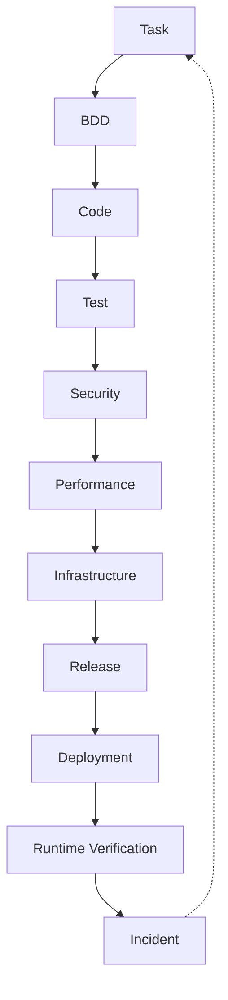

Bu diagramda ən vacib hissə son əlaqədir:

```text
INCIDENT → TASK
```

Çünki sistem yalnız development machine deyil.

**Production-dan öyrənən engineering system-dir.**

---

# 25.51. Human view

Developer:

> Mənim taskım hazırdır?

AI:

```text
PAY-1023

Implementation       ✅
BDD                   ✅
Unit                  ✅
Integration           ✅
E2E                   ❌
Security              ✅
Load                  ⏳
Manual QA             ✅

Release:
  BLOCKED

Reason:
  E2E test missing
```

---

# 25.52. Manager view

Manager:

```text
Release:
  BLOCKED

Main blockers:
  2

1. E2E test
   Owner: FE/QA

2. Load test
   Owner: QA/DevOps
```

---

# 25.53. Security view

Security:

```text
Security posture:

SAST       PASS
Secrets    PASS
Dependency PASS
DAST       PASS
Pentest    PASS
RateLimit  PASS

Risk:
  LOW
```

---

# 25.54. Support view

Support:

```text
Deployment:
  production

Version:
  1.8.2

Known issues:
  none

Rollback:
  1.8.1

Runbook:
  available
```

Beləliklə eyni project üçün hər kəs yalnız öz ehtiyacı olan view-u görür.

---

# 25.55. AI view

Agent isə:

```text
TASK PAY-1023

Context:
  8 nodes

Dependencies:
  2

Required skills:
  3

Gates:
  7

Failed:
  0

Blocked:
  E2E

Next action:
  Run E2E gate
```

kimi çox qısa context alır.

Bu sənin **“işi görən AI çox xərcləsin, işə baxan insan çox anlasın”** prinsipinə tam uyğundur.

---

# 25.56. Phase 25 nəticəsi

Artıq sistemdə:

```text
TASK
 ↓
WORKFLOW
 ↓
QUALITY
 ↓
SECURITY
 ↓
PERFORMANCE
 ↓
INFRA
 ↓
RELEASE
 ↓
PRODUCTION
```

vahid gate mexanizminə bağlanır.

Ən əsası isə:

```text
❌ “Test etdim, hazırdır.”

əvəzinə

✅ “Required gates-in hamısı evidence ilə keçilib.”
```

deyə bilirik.

---

# Progress

```text
PHASE 13  Task Engine                    ✅
PHASE 14  Security Engine                ✅
PHASE 15  Testing Engine                 ✅
PHASE 16  Architecture & Decision Engine ✅
PHASE 17  Stack & Technology Engine      ✅
PHASE 18  SDLC / Workflow Orchestrator   ✅
PHASE 19  Observability / Incident       ✅
PHASE 20  Documentation / Knowledge      ✅
PHASE 21  Context Router / Token Engine  ✅
PHASE 22  Agent Runtime / Tool Engine    ✅
PHASE 23  Project Discovery Engine       ✅
PHASE 24  Knowledge Graph & Traceability ✅
PHASE 25  Quality / Security / Release   ✅
```

## Növbəti PHASE 26

**SKILL INTELLIGENCE & SELF-EVOLUTION ENGINE**

Burada sənin ən kritik ideyalarından birinə keçəcəyik:

```text
Skill
 ↓
Technology changes
 ↓
Best practices
 ↓
Pros / Cons
 ↓
Evidence
 ↓
Version
 ↓
Review
 ↓
Upgrade proposal
```

və agentə:

> **“Skill-lər köhnəlibmi? Yeni texnologiya və best practice varmı? Mənim hazırkı yanaşmam hələ optimaldırmı?”**

deyə biləcəyimiz mexanizmi quracağıq.

Burada xüsusilə **BE + FE + MD + QA + DB + Security + DevOps + Cloud** hamısı eyni skill intelligence sistemi ilə idarə olunacaq.


________________________________________________________________________________________________
next

# PHASE 26 — SKILL INTELLIGENCE & SELF-EVOLUTION ENGINE

Bu phase sistemin **“skill-lər bir dəfə yazıldı və həmişə belə qaldı”** problemini həll edir.

Sənin istədiyin model:

> Skill kiçik və token-efficient qalsın, amma AI onun arxasındakı geniş knowledge-i lazım olanda açsın, yeni best practice-ləri tapsın, pros/cons müqayisə etsin və köhnəlmiş skill üçün update təklif etsin.

Əsas prinsip:

```text
SKILL
  ↓
CURRENT KNOWLEDGE
  ↓
EVIDENCE
  ↓
BEST PRACTICE
  ↓
COMPARISON
  ↓
VERSION
  ↓
REVIEW
  ↓
UPGRADE
```

---

# 26.1. Skill artıq sadəcə `.sdd` faylı deyil

Skill-i 3 qat edirik:

```text
SKILL
├── AI CORE
├── HUMAN KNOWLEDGE
└── EVIDENCE
```

### AI Core

Qısa, token-efficient.

### Human Knowledge

Ətraflı izah.

### Evidence

Nəyə əsaslandığını göstərən mənbələr.

---

# 26.2. Struktur

```text
.sdd/
└── skills/
    ├── INDEX.sdd
    ├── backend/
    ├── frontend/
    ├── mobile/
    ├── database/
    ├── qa/
    ├── security/
    ├── devops/
    ├── infrastructure/
    ├── cloud/
    └── architecture/
```

Məsələn:

```text
.sdd/skills/backend/idempotency.sdd
```

və human tərəfdə:

```text
docs/skills/backend/idempotency.md
```

---

# 26.3. AI skill format

Məsələn:

```text
Skill: idempotency

Use:
  duplicate-safe operations

Apply:
  payment
  order
  webhook
  retry

Requires:
  stable-key
  atomic-state

Avoid:
  non-atomic-check

Level:
  L2+

Review:
  2026-08

Version:
  1.3
```

AI üçün bu kifayətdir.

---

# 26.4. Human skill document

Human tərəfdə:

```text
docs/skills/backend/idempotency.md
```

orada:

```text
# Idempotency

## What problem does it solve?

## When should we use it?

## When should we NOT use it?

## Common implementation patterns

## Database considerations

## Redis considerations

## Failure scenarios

## Pros

## Cons

## Alternatives

## Testing

## Security

## Performance

## Go examples

## References
```

olur.

---

# 26.5. Skill metadata

Hər skill:

```text
ID
Domain
Level
Version
Status
Maturity
Risk
ReviewDate
EvidenceLevel
```

daşıyır.

Məsələn:

```text
SKILL-IDEMPOTENCY

Level:
  L2

Maturity:
  STABLE

Evidence:
  HIGH

Version:
  1.3

Review:
  2026-08
```

---

# 26.6. Skill status

```text
DRAFT
EXPERIMENTAL
STABLE
DEPRECATED
RETIRED
```

---

# 26.7. Skill maturity

```text
UNKNOWN
EMERGING
VALIDATED
MATURE
STANDARD
```

Beləliklə AI yeni texnologiyanı avtomatik “best practice” hesab etmir.

---

# 26.8. Technology lifecycle

Məsələn:

```text
Technology
 ↓
Emerging
 ↓
Adopted
 ↓
Mature
 ↓
Legacy
 ↓
Deprecated
```

Skill buna uyğun dəyişə bilər.

---

# 26.9. Best practice source

Skill update üçün müxtəlif evidence sources:

```text
Official documentation
RFC
Standards
Vendor documentation
Security advisories
Academic research
Engineering blogs
Production experience
Benchmarks
Community consensus
```

Amma prioritet eyni deyil.

---

# 26.10. Evidence priority

Standart:

```text
1. Official standard
2. Official documentation
3. Security advisory
4. Vendor engineering documentation
5. Peer-reviewed research
6. Reputable engineering source
7. Community consensus
8. Blog / opinion
```

AI qərarı yalnız blog-a əsaslandırmamalıdır.

---

# 26.11. Search keys

Sənin dediyin ideyanı burada sistemləşdiririk.

Skill:

```text
SearchKeys:
  idempotency
  distributed retry
  duplicate request
  payment consistency
  exactly once
  at least once
```

Bu key-lər skill-in **knowledge discovery trigger**-ləridir.

---

# 26.12. Search key nə edir?

AI:

```text
Review skill
```

əmrini alanda:

```text
SKILL
 ↓
SEARCH KEYS
 ↓
CURRENT SOURCES
 ↓
COMPARE
```

edir.

---

# 26.13. Skill review

Məsələn:

```text
/sdd skill review idempotency
```

nəticəsi:

```text
Current skill:
  v1.3

New findings:
  4

Relevant:
  2

Potential improvement:
  1

Breaking change:
  NO
```

---

# 26.14. Skill heç vaxt birbaşa dəyişmir

Əsas qayda:

```text
DISCOVER
   ↓
ANALYZE
   ↓
PROPOSE
   ↓
REVIEW
   ↓
APPROVE
   ↓
UPDATE
```

AI internetdə yeni fikir gördü deyə production skill-i dəyişmir.

---

# 26.15. Skill evolution proposal

```text
SKILL-UPGRADE-042

Skill:
  SKILL-IDEMPOTENCY

Current:
  v1.3

Proposed:
  v1.4

Reason:
  New database concurrency pattern

Evidence:
  HIGH

Impact:
  Low

Breaking:
  No
```

---

# 26.16. Pros / Cons matrix

Sənin xüsusi istədiyin hissə:

```text
Approach A
Pros:
  ...
Cons:
  ...

Approach B
Pros:
  ...
Cons:
  ...
```

AI yalnız “ən yaxşı budur” deməməlidir.

---

# 26.17. Decision matrix

Məsələn cache üçün:

| Approach | Complexity |   Cost | Performance | Reliability |     Scale |
| -------- | ---------: | -----: | ----------: | ----------: | --------: |
| DB cache |        Low |    Low |      Medium |        High |       Low |
| Redis    |     Medium | Medium |        High |        High |      High |
| CDN      |        Low | Medium |   Very High |        High | Very High |

AI project context-ini əlavə edir.

---

# 26.18. Contextual recommendation

Məsələn:

```text
Project:
  20k DAU
```

AI deyir:

```text
Redis cluster unnecessary.

Recommendation:
  Single Redis instance
```

Başqa project:

```text
Project:
  1M DAU
  multi-region
```

onda:

```text
Redis architecture:
  HA / cluster / managed service
```

ola bilər.

---

# 26.19. Yəni skill universal recommendation vermir

Skill deyir:

```text
Redis can solve distributed cache problem.
```

Project AI isə qərar verir:

```text
Bu project-də Redis lazımdırmı?
```

Bu fərq çox vacibdir.

---

# 26.20. Skill → architecture

```text
SKILL
 ↓
CONTEXT
 ↓
OPTIONS
 ↓
PROS / CONS
 ↓
ARCHITECTURE DECISION
```

---

# 26.21. Technology comparison

AI məsələn:

```text
RabbitMQ
Kafka
NATS
Redis Streams
```

arasında seçim edə bilər.

Amma seçim:

```text
“Kafka məşhurdur”
```

əsasında deyil.

Context:

```text
Message volume
Ordering
Retention
Consumer count
Latency
Operational complexity
```

ilə edilir.

---

# 26.22. Stack-aware skills

Skill registry:

```text
Go
React
Vue
Angular
React Native
Flutter
PostgreSQL
MongoDB
Redis
Kafka
RabbitMQ
Docker
Kubernetes
AWS
Azure
GCP
VPS
```

və s.

Sən yalnız BE-yə fokuslanmırsan.

Skill intelligence bütün stack-i əhatə edir.

---

# 26.23. Cross-stack dependency

Məsələn:

```text
Backend:
  Go

Frontend:
  React

Mobile:
  React Native
```

API contract dəyişirsə:

```text
BE
 ↓
FE
 ↓
MD
 ↓
E2E
```

hamısına impact çıxır.

---

# 26.24. Framework evolution

Məsələn React framework-də böyük dəyişiklik olur.

Skill:

```text
SKILL-REACT-ARCH
```

review edilir.

AI baxır:

```text
Current project version
Current framework version
New version
Breaking changes
Migration guide
Known issues
Performance
Security
```

---

# 26.25. Upgrade recommendation

```text
Current:
  React X

Latest stable:
  React Y

Recommendation:
  Upgrade

Risk:
  Medium

Breaking:
  Yes

Required tasks:
  4
```

Bu artıq task engine-ə göndərilir.

---

# 26.26. Dependency update

Skill intelligence dependency vulnerability də izləyir.

```text
Dependency
 ↓
Security advisory
 ↓
Skill
 ↓
Task
 ↓
Gate
```

---

# 26.27. Skill deprecation

Məsələn:

```text
SKILL-OLD-AUTH
```

artıq istifadə edilmirsə:

```text
Status:
  DEPRECATED
```

amma dərhal silinmir.

---

# 26.28. Migration mapping

```text
SKILL-OLD-AUTH
       ↓
REPLACED_BY
       ↓
SKILL-OAUTH2
```

AI köhnə skill istifadə olunan project-ləri tapır.

---

# 26.29. Automatic migration candidates

```text
Projects:
  7

Using deprecated skill:
  3

Migration required:
  2

Low priority:
  1
```

və task-lar yaradıla bilər.

---

# 26.30. Skill health

Hər skill üçün:

```text
Health:
  92%
```

məsələn:

```text
Freshness       95
Evidence        90
Usage           98
Security        100
Compatibility   85
```

---

# 26.31. Staleness detection

Skill:

```text
Review:
  2024
```

və technology:

```text
major releases:
  3
```

onda:

```text
STALE
```

flag-i.

Amma sadəcə tarixə görə deprecated etməyəcəyik.

---

# 26.32. Change triggers

Skill review trigger-ləri:

```text
Major framework release
Security advisory
Breaking API
New standard
Performance discovery
New architecture pattern
Deprecation
Production incident
Repeated task failure
```

---

# 26.33. Incident-driven skill evolution

Məsələn production-da:

```text
Redis memory leak
```

oldu.

Incident:

```text
INC-022
```

root cause:

```text
Missing eviction policy
```

AI görür:

```text
SKILL-REDIS-CACHE
```

də bunu qeyd etməyib.

↓

```text
SKILL-GAP
```

↓

```text
SKILL-UPGRADE-PROPOSAL
```

Bu çox güclü feedback loop-dur.

---

# 26.34. Skill feedback loop

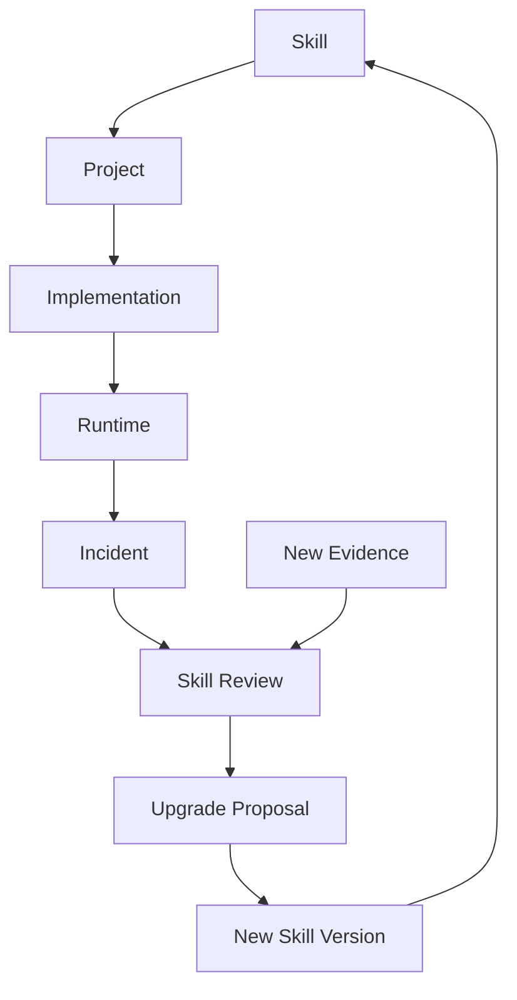

Bu artıq skill-i **living engineering knowledge** edir.

---

# 26.35. Skill anti-pattern detection

AI skill-in özündə də problem tapa bilər:

```text
Too broad
Too vague
Outdated
Contradictory
Duplicated
Unsupported
Over-engineered
```

Məsələn:

```text
SKILL-CACHE
```

40 səhifədirsə:

```text
Skill too large.
Split into:
  cache-selection
  redis-cache
  cache-invalidation
  cache-consistency
```

təklif edə bilər.

---

# 26.36. Skill granularity

Sənin token economy istəyin üçün:

```text
GOOD

SKILL:
  cache-selection

SKILL:
  redis-cache

SKILL:
  cache-invalidation
```

əvəzinə:

```text
BAD

SKILL:
  everything-about-caching
```

---

# 26.37. Skill composition

Lazım olanda:

```text
Payment task
```

AI:

```text
payment
+
idempotency
+
transaction
+
security
+
observability
```

skill-lərini birləşdirir.

Amma bütün skill registry context-ə daxil edilmir.

---

# 26.38. Skill router

```text
User Request
 ↓
Task
 ↓
Domain
 ↓
Stack
 ↓
Risk
 ↓
Required Skills
```

Məsələn:

```text
PAY-1023
```

çıxarır:

```text
idempotency
database transaction
payment security
observability
BDD
```

---

# 26.39. Skill conflict

Bəzən iki skill ziddiyyətli recommendation verə bilər.

Məsələn:

```text
SKILL-A:
  synchronous processing

SKILL-B:
  async processing
```

Graph:

```text
CONFLICT
```

Agent qərarı avtomatik vermir.

```text
Context:
  latency critical

Recommendation:
  async

Reason:
  ...
```

və decision yaranır.

---

# 26.40. Skill → Decision

```text
SKILL
 ↓
OPTIONS
 ↓
PROS / CONS
 ↓
PROJECT CONTEXT
 ↓
DECISION
```

Bu decision graph-a bağlanır.

---

# 26.41. Skill versioning

```text
v1.0
v1.1
v1.2
v2.0
```

Breaking change:

```text
MAJOR
```

compatible improvement:

```text
MINOR
```

correction:

```text
PATCH
```

---

# 26.42. Skill compatibility

Project:

```text
Go 1.x
```

Skill:

```text
Go 2.x pattern
```

AI:

```text
INCOMPATIBLE
```

deyə bilər.

Skill sadəcə “latest” olduğu üçün tətbiq olunmur.

---

# 26.43. Skill evidence graph

```text
SKILL
 ↓
EVIDENCE
 ├── Official Docs
 ├── RFC
 ├── Security Advisory
 ├── Benchmark
 └── Engineering Report
```

Hər recommendation-in arxasında evidence görünür.

---

# 26.44. Human audit

Human deyə bilər:

> Niyə Redis seçdik?

AI:

```text
Decision:
  DEC-042

Based on:
  SKILL-CACHE-SELECTION v2.1

Compared:
  PostgreSQL
  Redis
  Memcached

Primary reason:
  latency + shared state

Tradeoff:
  operational complexity
```

Bu artıq **AI qərarını audit edilə bilən** edir.

---

# 26.45. Skill review schedule

Bütün skill-ləri hər gün review etmək lazım deyil.

```text
Security:
  frequent

Cloud:
  frequent

Framework:
  periodic

Stable algorithm:
  rare
```

Risk-based review:

```text
Critical skill:
  30 days

Normal:
  90 days

Stable:
  180 days
```

---

# 26.46. Token economy

Əsas qayda:

```text
Skill Core
```

çox kiçik qalır.

AI yalnız lazım olanda:

```text
Human docs
Evidence
Comparisons
References
```

açır.

Beləliklə:

```text
Default context:
  small

Deep analysis:
  expandable
```

---

# 26.47. Phase 26 nəticəsi

Artıq skill sistemi:

```text
STATIC FILE
```

deyil.

Belə olur:

```text
              ┌── Evidence
              │
Skill Core ───┼── Human Docs
              │
              ├── Pros / Cons
              │
              ├── Technology
              │
              ├── Decision
              │
              └── Project Context
                       ↓
                    Review
                       ↓
                 Upgrade Proposal
```

---

# Progress

```text
PHASE 13  Task Engine                    ✅
PHASE 14  Security Engine                ✅
PHASE 15  Testing Engine                 ✅
PHASE 16  Architecture & Decision Engine ✅
PHASE 17  Stack & Technology Engine      ✅
PHASE 18  SDLC / Workflow Orchestrator   ✅
PHASE 19  Observability / Incident       ✅
PHASE 20  Documentation / Knowledge      ✅
PHASE 21  Context Router / Token Engine  ✅
PHASE 22  Agent Runtime / Tool Engine    ✅
PHASE 23  Project Discovery Engine       ✅
PHASE 24  Knowledge Graph & Traceability ✅
PHASE 25  Quality / Security / Release   ✅
PHASE 26  Skill Intelligence             ✅
```

## Növbəti — PHASE 27

**AUTONOMOUS PROJECT ORCHESTRATOR**

Burada artıq bütün əvvəlki engine-ləri birləşdirəcəyik:

```text
User
 ↓
Input
 ↓
Discovery / Intent
 ↓
Project Context
 ↓
Architecture
 ↓
Skills
 ↓
Decision
 ↓
Tasks
 ↓
Dependency Graph
 ↓
Workflow
 ↓
BDD
 ↓
Implementation
 ↓
QA
 ↓
Security
 ↓
Performance
 ↓
Infrastructure
 ↓
Release
 ↓
Runtime
 ↓
Incident
 ↓
Learning
```

və əsas sualı həll edəcəyik:

> **Mən agentə bir cümlə, bir paragraph, hətta qarışıq bir business description verəndə, agent bunu necə anlayıb düzgün `.sdd` strukturuna çevirəcək, hansı phase-ləri işə salacaq və nə vaxt dayanıb məndən qərar istəyəcək?**

Bu phase artıq `.sdd`-nin **“file collection” yox, real engineering operating system** kimi davranmasının orchestration qatıdır.


________________________________________________________________________________________________
next

# PHASE 27 — AUTONOMOUS PROJECT ORCHESTRATOR

Bu phase əvvəlki bütün hissələri bir **vahid agent lifecycle** halına gətirir.

Əsas məqsəd:

> Sən AI-a hazır `.sdd` project verirsən və ya sadəcə bir cümlə yazırsan. Agent əvvəlcə nə baş verdiyini anlayır, project-i araşdırır, uyğun skill-ləri seçir, architecture qurur, task/workflow yaradır və yalnız bundan sonra implementation-a keçir.

---

# 27.1. İki giriş rejimi

Sistem iki vəziyyətdə işləməlidir.

### A — New Project

```text
User:
"Online lesson platform qurmaq istəyirəm..."
```

Agent:

```text
INPUT
 ↓
DISCOVERY
 ↓
ANALYSIS
 ↓
ARCHITECTURE
 ↓
PLAN
 ↓
IMPLEMENTATION
```

### B — Existing Project

Sən:

```text
.sdd/project/
```

qovluğunu əlavə edirsən və:

```text
"Project-i analiz et."
```

deyirsən.

Agent **development-i dayandırır** və əvvəlcə repository-ni araşdırır.

---

# 27.2. Existing Project Discovery

Agent ilk mərhələdə:

```text
.sdd/
project/
src/
BE/
FE/
MD/
infra/
tests/
docs/
```

və digər root structure-ları oxuyur.

Sonra:

```text
CODE
CONFIG
DATABASE
TESTS
INFRA
DOCS
DEPENDENCIES
```

analiz edir.

Burada əsas prinsip:

> **Mövcud project-də kod source-of-truth-dur.**

Prompt artıq əsas həqiqət deyil.

---

# 27.3. Project reconstruction

Agent mövcud koddan:

```text
Architecture
Modules
Dependencies
Business flows
Data flows
External services
Security boundaries
Deployment model
```

çıxarır.

Sonra:

```text
.sdd/project/
```

altında project knowledge formalaşdırır.

---

# 27.4. Project root və global root ayrılır

Sənin əvvəlki qərarına əsasən:

```text
.sdd/
```

və:

```text
.sdd/project/
```

eyni şey deyil.

### Global

```text
.sdd/
├── skills/
├── standards/
├── workflows/
├── gates/
├── agents/
├── schemas/
└── prompts/
```

### Project

```text
.sdd/project/
├── INDEX.sdd
├── architecture/
├── tasks/
├── workflow/
├── decisions/
├── modules/
├── diagrams/
├── runtime/
└── project.sdd
```

Beləliklə project-i başqa repository-yə köçürəndə global `.sdd`-yə dependency yaranmır.

---

# 27.5. Project skeleton

Agent project discovery-dən sonra:

```text
.sdd/project/
├── INDEX.sdd
├── project.sdd
├── architecture/
├── modules/
├── tasks/
├── workflow/
├── decisions/
├── diagrams/
└── runtime/
```

strukturunu yaradır.

Amma **lazımsız qovluqları yaratmır**.

Məsələn mobile yoxdursa:

```text
MD/
```

üçün xüsusi project documentation yaranmır.

---

# 27.6. Adaptive structure

Kiçik project:

```text
.sdd/project/
├── INDEX.sdd
├── project.sdd
├── tasks/
└── decisions/
```

Böyük project:

```text
.sdd/project/
├── architecture/
├── modules/
├── tasks/
├── workflow/
├── decisions/
├── diagrams/
├── runtime/
└── environments/
```

Yəni sistem:

> **structure first deyil, context first**

prinsipi ilə işləyir.

---

# 27.7. Discovery confidence

Agent hər tapıntıya confidence verir:

```text
HIGH
MEDIUM
LOW
UNKNOWN
```

Məsələn:

```text
Database:
  PostgreSQL
  confidence: HIGH

Business rule:
  Refund only once
  confidence: MEDIUM

Deployment:
  VPS
  confidence: LOW
```

Bu çox vacibdir.

AI fərziyyəni fakt kimi təqdim etməməlidir.

---

# 27.8. Discovery report

```text
PROJECT DISCOVERY

Stack:
  BE: Go
  FE: React
  MD: React Native

Database:
  PostgreSQL

Cache:
  Redis

Infrastructure:
  Docker
  VPS

Testing:
  Playwright
  Go test

Security:
  JWT
  RBAC

Unknown:
  Production topology
  Backup policy
```

---

# 27.9. Unknown-lar task deyil

Əgər AI bilmir:

```text
Production backup policy?
```

dərhal kod yazmır.

Bunun üçün:

```text
QUESTION
```

yaradır.

---

# 27.10. Agent clarification policy

AI yalnız kritik ambiguity olduqda user-dən soruşur.

Məsələn:

```text
Payment provider?
```

sualı vacibdirsə soruşur.

Amma:

```text
Redis version?
```

implementation üçün kritik deyilsə özü araşdırır.

---

# 27.11. Decision threshold

```text
LOW RISK
→ AI decides

MEDIUM RISK
→ AI recommends

HIGH RISK
→ Human approval

CRITICAL
→ Human mandatory
```

---

# 27.12. Human decision boundary

AI:

```text
Architecture:
  PostgreSQL + Redis
```

seçimini özü edə bilər.

Amma:

```text
Database migration
payment provider
security policy
production destructive operation
```

kimi qərarlar üçün approval tələb edə bilər.

---

# 27.13. Intent engine

User:

> “Refund sistemi double refund edir, düzəlt.”

Agent bunu:

```text
Intent:
  BUG

Domain:
  PAYMENT

Risk:
  HIGH

Likely skills:
  idempotency
  transaction
  security
  testing
```

kimi strukturlaşdırır.

---

# 27.14. User input müxtəlif formada ola bilər

Sistem:

```text
1 sentence
paragraph
story
bug report
meeting notes
technical specification
voice transcript
existing code
```

kimi input-ları qəbul edə bilər.

Hamısı:

```text
INPUT → NORMALIZED INTENT
```

olur.

---

# 27.15. Intent normalization

Məsələn:

> “User iki dəfə payment elədi pul iki dəfə çıxdı bunu düzəlt amma sistemi çox böyütməyək.”

Agent:

```text
Problem:
  duplicate payment

Risk:
  CRITICAL

Constraint:
  avoid overengineering

Domain:
  payment

Required:
  idempotency
  transaction safety

Architecture constraint:
  modular monolith preferred
```

çıxarır.

Bu sənin **“kiçik project-ə microservice qurmasın”** qaydandır.

---

# 27.16. Overengineering guard

Agent hər recommendation üçün:

```text
Necessary?
```

sualını verir.

Məsələn:

```text
10k users
```

üçün:

```text
Kubernetes
Kafka
service mesh
multi-region
```

təklif etməməlidir.

---

# 27.17. Complexity budget

Project üçün:

```text
Complexity:
  LOW
```

və ya:

```text
MEDIUM
HIGH
CRITICAL
```

təyin edilir.

AI architecture complexity-ni bu budget-dən yuxarı çıxarmamalıdır.

---

# 27.18. Architecture selection

Agent:

```text
Project context
+
Scale
+
Risk
+
Team
+
Budget
+
Existing stack
```

ilə architecture seçir.

Məsələn:

```text
Small:
  Modular Monolith

Medium:
  Modular Monolith + async workers

Large:
  Selective services

Very Large:
  Distributed architecture
```

---

# 27.19. Existing architecture preservation

Əgər mövcud project:

```text
Laravel monolith
```

dirsə və sən:

> microservice-ə keçir

deyirsənsə, agent əvvəl:

```text
Vendor
Dependencies
Build artifacts
Runtime coupling
Database coupling
```

araşdırır.

---

# 27.20. Laravel → Microservices example

Sənin verdiyin `vendor` ideyasını burada formalizə edirik.

Agent görə bilər:

```text
Laravel application
+
vendor/
+
composer dependencies
```

və migration zamanı təklif edə bilər:

```text
Base runtime image
+
Composer dependency layer
```

və ya shared build strategy.

Amma burada vacib qayda:

> `vendor` qovluğunu kor-koranə bütün microservice-lərə kopyalamaq olmaz.

Agent dependency graph çıxarmalıdır.

---

# 27.21. Dependency extraction

```text
Laravel
 ↓
composer.json
 ↓
Dependencies
 ↓
Used packages
 ↓
Service boundary
```

Məsələn:

```text
Payment Service
  ↓
payment-related dependencies only
```

Bu daha sağlamdır.

---

# 27.22. Task generation

Architecture hazır olduqdan sonra:

```text
Architecture
 ↓
Work Breakdown
 ↓
Tasks
```

yaradılır.

Task-lar əvvəl danışdığımız dependency modelinə girir.

---

# 27.23. Task DAG

Məsələn:

```text
1000

1001 → 1011 → 1023
```

və:

```text
1023
 ↓
999
```

Agent dependency graph-dan execution order çıxarır.

---

# 27.24. Task execution

Sənin istədiyin model:

```text
1023
 ↓
999
 ↓
1023
 ↓
1011
 ↓
1001
```

yəni əvvəl dependency-lər tamamlanır.

AI task ID-nin rəqəminə yox:

```text
DependsOn
```

graph-a baxır.

---

# 27.25. Task priority vs dependency

Əgər:

```text
1000
1001 → 1011
```

varsa, `1001` yüksək priority olsa belə:

```text
1011
```

bitmədən işlənməyə bilər.

Dependency həmişə execution constraint-dir.

---

# 27.26. Workflow engine

Task:

```text
PAY-1023
```

workflow-a daxil olur:

```text
BDD
 ↓
CODE
 ↓
TEST
 ↓
SECURITY
 ↓
REVIEW
 ↓
RELEASE
```

---

# 27.27. Workflow adaptive olur

Backend task:

```text
BDD
CODE
UNIT
INTEGRATION
SECURITY
```

Frontend:

```text
BDD
CODE
UNIT
E2E
UI
```

Mobile:

```text
BDD
CODE
UNIT
WIDGET
E2E
DEVICE
```

Infrastructure:

```text
PLAN
CONFIG
VALIDATE
SECURITY
DEPLOY
VERIFY
```

---

# 27.28. Cross-layer task

Məsələn API dəyişir.

Agent:

```text
BE
 ↓
API Contract
 ↓
FE
 ↓
MD
 ↓
E2E
```

hamısını impact graph-a salır.

---

# 27.29. Impact analysis

Kod dəyişməzdən əvvəl:

```text
Change:
  PaymentResponse
```

Agent:

```text
Affected:
  BE handler
  BE DTO
  FE API client
  FE UI
  MD API client
  MD screen
  E2E tests
  API docs
```

çıxara bilər.

Bu, sənin:

> “FE düzəldi, sonra MD qırıldı”

problemini həll edir.

---

# 27.30. Change blast radius

Hər dəyişiklik üçün:

```text
LOW
MEDIUM
HIGH
CRITICAL
```

hesablanır.

Məsələn:

```text
CSS change:
  LOW

Database schema:
  HIGH

Authentication:
  CRITICAL
```

---

# 27.31. Agent stop conditions

Agent həmişə sona qədər özü getməməlidir.

Stop:

```text
CRITICAL ambiguity
SECURITY uncertainty
DESTRUCTIVE migration
PRODUCTION destructive action
HIGH-risk architecture decision
Missing required credential
```

olduqda:

```text
WAIT_FOR_HUMAN
```

---

# 27.32. Agent resume

Human qərar verir:

```text
APPROVED
```

agent:

```text
Resume from exact state
```

edir.

Bütün workflow yenidən başlamır.

---

# 27.33. State machine

Agent:

```text
DISCOVERING
ANALYZING
PLANNING
WAITING
IMPLEMENTING
TESTING
VERIFYING
RELEASING
DEPLOYING
OBSERVING
COMPLETED
FAILED
```

statuslarından keçir.

---

# 27.34. Agent state

```text
.sdd/runtime/
├── agent.sdd
├── session.sdd
├── current.sdd
└── checkpoints/
```

Burada:

```text
Current task
Current phase
Current decision
Last successful step
Next action
```

saxlanılır.

---

# 27.35. Crash recovery

Agent yarıda dayandı.

Yenidən başlayanda:

```text
.sdd/runtime/current.sdd
```

oxuyur.

Məsələn:

```text
Task:
  PAY-1023

Phase:
  SECURITY

Last:
  SAST PASSED

Next:
  Dependency Scan
```

və oradan davam edir.

---

# 27.36. No duplicate work

Agent artıq:

```text
BDD PASSED
```

görürsə, yenidən BDD yaratmır.

Evidence graph-a baxır.

---

# 27.37. Git integration

Agent hər task üçün:

```text
Task
 ↓
Branch
 ↓
Commit
 ↓
PR
 ↓
Review
 ↓
Merge
```

trace yarada bilər.

---

# 27.38. Commit trace

Məsələn:

```text
TASK-1023
 ↓
commit abc123
 ↓
PR #451
 ↓
GATES
 ↓
release v1.4.0
```

Bu artıq tam traceability-dir.

---

# 27.39. Rollback trace

Production incident:

```text
INC-022
 ↓
Release v1.4.0
 ↓
PR #451
 ↓
TASK-1023
 ↓
commit abc123
```

AI bir neçə dəqiqə ərzində:

> “Bu incident hansı dəyişiklikdən gəlib?”

sualını araşdıra bilər.

---

# 27.40. Manager command model

Sən manager kimi belə komandalar verə bilərsən:

```text
analyze project
```

```text
plan project
```

```text
show blockers
```

```text
continue
```

```text
review architecture
```

```text
review security
```

```text
why is task 1023 blocked?
```

```text
what changed?
```

```text
what can break?
```

```text
prepare release
```

---

# 27.41. Bir cümləlik input

Sən:

> “Payment zamanı double charge problemini həll et və production üçün təhlükəsiz et.”

deyirsən.

Agent:

```text
INTENT
 ↓
PROJECT DISCOVERY
 ↓
PAYMENT DOMAIN
 ↓
RISK = CRITICAL
 ↓
SKILLS
 ↓
ARCHITECTURE IMPACT
 ↓
TASK GRAPH
 ↓
BDD
 ↓
IMPLEMENTATION
 ↓
TEST
 ↓
SECURITY
 ↓
PERFORMANCE
 ↓
RELEASE
```

çıxarır.

---

# 27.42. Amma AI birbaşa kod yazmır

Əvvəl:

```text
PLAN
```

hazırlayır.

Məsələn:

```text
Task:
  PAY-1023

Problem:
  duplicate charge

Root cause:
  missing idempotency

Plan:
  1. Add idempotency key
  2. Add DB constraint
  3. Make operation atomic
  4. Add BDD
  5. Add concurrency tests
  6. Add security test
```

sonra implementation başlayır.

---

# 27.43. Architecture approval

Critical architecture change olduqda:

```text
AI:
  Recommendation ready.

Human approval required.

Options:
  A — Modular monolith
  B — Microservice

Recommended:
  A

Reason:
  Current scale + lower complexity
```

Sən:

```text
approve A
```

deyirsən.

---

# 27.44. Autonomous mode

Bütün qərarlar critical deyilsə:

```text
AUTO
```

mode-da işləyə bilər.

---

# 27.45. Supervised mode

Riskli project:

```text
SUPERVISED
```

AI hər major decision-də approval istəyir.

---

# 27.46. Strict mode

Financial/security-critical:

```text
STRICT
```

burada:

```text
Architecture
Security
Database migration
Release
```

human approval tələb edir.

---

# 27.47. Agent modes

```text
AUTO
SUPERVISED
STRICT
AUDIT
READ_ONLY
```

### READ_ONLY

Project-i analiz edir, kod dəyişmir.

Bu xüsusilə:

```text
"Analyze project"
```

üçün lazımdır.

---

# 27.48. Ən vacib təhlükəsizlik prinsipi

Agent:

```text
READ
ANALYZE
PLAN
```

edə bilər.

Amma:

```text
DELETE PRODUCTION DB
DROP TABLE
ROTATE PRODUCTION CREDENTIAL
DEPLOY DESTRUCTIVE CHANGE
```

kimi əməliyyatlar xüsusi approval tələb edir.

---

# 27.49. Full orchestration graph

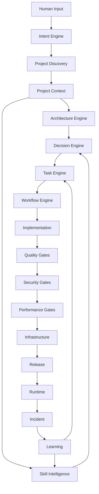

---

# 27.50. Human ↔ AI boundary

Sistemin əsas fəlsəfəsi belə olur:

```text
HUMAN
  ↓
Intent / Business Decision / Approval
  ↓
AI
  ↓
Analysis / Architecture / Planning / Implementation
  ↓
AI
  ↓
Evidence / Verification
  ↓
HUMAN
  ↓
Critical Approval
```

Yəni AI manager-i əvəz etmir.

**Manager-in engineering visibility-sini artırır.**

---

# 27.51. Phase 27 nəticəsi

Artıq əvvəlki phase-lər ayrı-ayrı tool deyil.

Onlar:

```text
Intent Engine
Discovery Engine
Architecture Engine
Skill Engine
Decision Engine
Task Engine
Workflow Engine
QA Engine
Security Engine
Performance Engine
Infrastructure Engine
Release Engine
Runtime Engine
Learning Engine
```

kimi **bir orchestrator altında birləşir.**

---

# Progress

```text
PHASE 13  Task Engine                    ✅
PHASE 14  Security Engine                ✅
PHASE 15  Testing Engine                 ✅
PHASE 16  Architecture & Decision Engine ✅
PHASE 17  Stack & Technology Engine      ✅
PHASE 18  SDLC / Workflow Orchestrator   ✅
PHASE 19  Observability / Incident       ✅
PHASE 20  Documentation / Knowledge      ✅
PHASE 21  Context Router / Token Engine  ✅
PHASE 22  Agent Runtime / Tool Engine    ✅
PHASE 23  Project Discovery Engine       ✅
PHASE 24  Knowledge Graph & Traceability ✅
PHASE 25  Quality / Security / Release   ✅
PHASE 26  Skill Intelligence             ✅
PHASE 27  Autonomous Orchestrator        ✅
```

## Növbəti PHASE 28

**SINGLE SOURCE OF TRUTH + FILE SCHEMA + `.sdd` LANGUAGE**

Burada artıq “nə sistem qururuq?” yox, **“bütün bunlar fiziki olaraq `.sdd` qovluğunda hansı fayllarda, hansı standart syntax-la yerləşəcək?”** məsələsini bağlamaq lazımdır.

Yəni:

```text
.sdd/
├── skills/
├── standards/
├── workflows/
├── gates/
├── agents/
├── schemas/
├── prompts/
└── project/
    ├── INDEX.sdd
    ├── project.sdd
    ├── tasks/
    ├── workflow/
    ├── decisions/
    ├── architecture/
    ├── modules/
    └── diagrams/
```

və hər `.sdd` faylının:

```text
ID
TYPE
SCOPE
RELATION
STATE
DEPENDS_ON
OWNER
LEVEL
EVIDENCE
```

kimi **minimum, standart və token-efficient dilini** müəyyən edəcəyik.

Bu phase-dən sonra artıq bütün sistemin əvvəl danışdığımız ideyalarını **real repository skeleton-a çevirməyə** başlamaq üçün əsas texniki spesifikasiya hazır olacaq.


________________________________________________________________________________________________
next
# PHASE 27 — AUTONOMOUS PROJECT ORCHESTRATOR

Bu phase əvvəlki bütün hissələri bir **vahid agent lifecycle** halına gətirir.

Əsas məqsəd:

> Sən AI-a hazır `.sdd` project verirsən və ya sadəcə bir cümlə yazırsan. Agent əvvəlcə nə baş verdiyini anlayır, project-i araşdırır, uyğun skill-ləri seçir, architecture qurur, task/workflow yaradır və yalnız bundan sonra implementation-a keçir.

---

# 27.1. İki giriş rejimi

Sistem iki vəziyyətdə işləməlidir.

### A — New Project

```text
User:
"Online lesson platform qurmaq istəyirəm..."
```

Agent:

```text
INPUT
 ↓
DISCOVERY
 ↓
ANALYSIS
 ↓
ARCHITECTURE
 ↓
PLAN
 ↓
IMPLEMENTATION
```

### B — Existing Project

Sən:

```text
.sdd/project/
```

qovluğunu əlavə edirsən və:

```text
"Project-i analiz et."
```

deyirsən.

Agent **development-i dayandırır** və əvvəlcə repository-ni araşdırır.

---

# 27.2. Existing Project Discovery

Agent ilk mərhələdə:

```text
.sdd/
project/
src/
BE/
FE/
MD/
infra/
tests/
docs/
```

və digər root structure-ları oxuyur.

Sonra:

```text
CODE
CONFIG
DATABASE
TESTS
INFRA
DOCS
DEPENDENCIES
```

analiz edir.

Burada əsas prinsip:

> **Mövcud project-də kod source-of-truth-dur.**

Prompt artıq əsas həqiqət deyil.

---

# 27.3. Project reconstruction

Agent mövcud koddan:

```text
Architecture
Modules
Dependencies
Business flows
Data flows
External services
Security boundaries
Deployment model
```

çıxarır.

Sonra:

```text
.sdd/project/
```

altında project knowledge formalaşdırır.

---

# 27.4. Project root və global root ayrılır

Sənin əvvəlki qərarına əsasən:

```text
.sdd/
```

və:

```text
.sdd/project/
```

eyni şey deyil.

### Global

```text
.sdd/
├── skills/
├── standards/
├── workflows/
├── gates/
├── agents/
├── schemas/
└── prompts/
```

### Project

```text
.sdd/project/
├── INDEX.sdd
├── architecture/
├── tasks/
├── workflow/
├── decisions/
├── modules/
├── diagrams/
├── runtime/
└── project.sdd
```

Beləliklə project-i başqa repository-yə köçürəndə global `.sdd`-yə dependency yaranmır.

---

# 27.5. Project skeleton

Agent project discovery-dən sonra:

```text
.sdd/project/
├── INDEX.sdd
├── project.sdd
├── architecture/
├── modules/
├── tasks/
├── workflow/
├── decisions/
├── diagrams/
└── runtime/
```

strukturunu yaradır.

Amma **lazımsız qovluqları yaratmır**.

Məsələn mobile yoxdursa:

```text
MD/
```

üçün xüsusi project documentation yaranmır.

---

# 27.6. Adaptive structure

Kiçik project:

```text
.sdd/project/
├── INDEX.sdd
├── project.sdd
├── tasks/
└── decisions/
```

Böyük project:

```text
.sdd/project/
├── architecture/
├── modules/
├── tasks/
├── workflow/
├── decisions/
├── diagrams/
├── runtime/
└── environments/
```

Yəni sistem:

> **structure first deyil, context first**

prinsipi ilə işləyir.

---

# 27.7. Discovery confidence

Agent hər tapıntıya confidence verir:

```text
HIGH
MEDIUM
LOW
UNKNOWN
```

Məsələn:

```text
Database:
  PostgreSQL
  confidence: HIGH

Business rule:
  Refund only once
  confidence: MEDIUM

Deployment:
  VPS
  confidence: LOW
```

Bu çox vacibdir.

AI fərziyyəni fakt kimi təqdim etməməlidir.

---

# 27.8. Discovery report

```text
PROJECT DISCOVERY

Stack:
  BE: Go
  FE: React
  MD: React Native

Database:
  PostgreSQL

Cache:
  Redis

Infrastructure:
  Docker
  VPS

Testing:
  Playwright
  Go test

Security:
  JWT
  RBAC

Unknown:
  Production topology
  Backup policy
```

---

# 27.9. Unknown-lar task deyil

Əgər AI bilmir:

```text
Production backup policy?
```

dərhal kod yazmır.

Bunun üçün:

```text
QUESTION
```

yaradır.

---

# 27.10. Agent clarification policy

AI yalnız kritik ambiguity olduqda user-dən soruşur.

Məsələn:

```text
Payment provider?
```

sualı vacibdirsə soruşur.

Amma:

```text
Redis version?
```

implementation üçün kritik deyilsə özü araşdırır.

---

# 27.11. Decision threshold

```text
LOW RISK
→ AI decides

MEDIUM RISK
→ AI recommends

HIGH RISK
→ Human approval

CRITICAL
→ Human mandatory
```

---

# 27.12. Human decision boundary

AI:

```text
Architecture:
  PostgreSQL + Redis
```

seçimini özü edə bilər.

Amma:

```text
Database migration
payment provider
security policy
production destructive operation
```

kimi qərarlar üçün approval tələb edə bilər.

---

# 27.13. Intent engine

User:

> “Refund sistemi double refund edir, düzəlt.”

Agent bunu:

```text
Intent:
  BUG

Domain:
  PAYMENT

Risk:
  HIGH

Likely skills:
  idempotency
  transaction
  security
  testing
```

kimi strukturlaşdırır.

---

# 27.14. User input müxtəlif formada ola bilər

Sistem:

```text
1 sentence
paragraph
story
bug report
meeting notes
technical specification
voice transcript
existing code
```

kimi input-ları qəbul edə bilər.

Hamısı:

```text
INPUT → NORMALIZED INTENT
```

olur.

---

# 27.15. Intent normalization

Məsələn:

> “User iki dəfə payment elədi pul iki dəfə çıxdı bunu düzəlt amma sistemi çox böyütməyək.”

Agent:

```text
Problem:
  duplicate payment

Risk:
  CRITICAL

Constraint:
  avoid overengineering

Domain:
  payment

Required:
  idempotency
  transaction safety

Architecture constraint:
  modular monolith preferred
```

çıxarır.

Bu sənin **“kiçik project-ə microservice qurmasın”** qaydandır.

---

# 27.16. Overengineering guard

Agent hər recommendation üçün:

```text
Necessary?
```

sualını verir.

Məsələn:

```text
10k users
```

üçün:

```text
Kubernetes
Kafka
service mesh
multi-region
```

təklif etməməlidir.

---

# 27.17. Complexity budget

Project üçün:

```text
Complexity:
  LOW
```

və ya:

```text
MEDIUM
HIGH
CRITICAL
```

təyin edilir.

AI architecture complexity-ni bu budget-dən yuxarı çıxarmamalıdır.

---

# 27.18. Architecture selection

Agent:

```text
Project context
+
Scale
+
Risk
+
Team
+
Budget
+
Existing stack
```

ilə architecture seçir.

Məsələn:

```text
Small:
  Modular Monolith

Medium:
  Modular Monolith + async workers

Large:
  Selective services

Very Large:
  Distributed architecture
```

---

# 27.19. Existing architecture preservation

Əgər mövcud project:

```text
Laravel monolith
```

dirsə və sən:

> microservice-ə keçir

deyirsənsə, agent əvvəl:

```text
Vendor
Dependencies
Build artifacts
Runtime coupling
Database coupling
```

araşdırır.

---

# 27.20. Laravel → Microservices example

Sənin verdiyin `vendor` ideyasını burada formalizə edirik.

Agent görə bilər:

```text
Laravel application
+
vendor/
+
composer dependencies
```

və migration zamanı təklif edə bilər:

```text
Base runtime image
+
Composer dependency layer
```

və ya shared build strategy.

Amma burada vacib qayda:

> `vendor` qovluğunu kor-koranə bütün microservice-lərə kopyalamaq olmaz.

Agent dependency graph çıxarmalıdır.

---

# 27.21. Dependency extraction

```text
Laravel
 ↓
composer.json
 ↓
Dependencies
 ↓
Used packages
 ↓
Service boundary
```

Məsələn:

```text
Payment Service
  ↓
payment-related dependencies only
```

Bu daha sağlamdır.

---

# 27.22. Task generation

Architecture hazır olduqdan sonra:

```text
Architecture
 ↓
Work Breakdown
 ↓
Tasks
```

yaradılır.

Task-lar əvvəl danışdığımız dependency modelinə girir.

---

# 27.23. Task DAG

Məsələn:

```text
1000

1001 → 1011 → 1023
```

və:

```text
1023
 ↓
999
```

Agent dependency graph-dan execution order çıxarır.

---

# 27.24. Task execution

Sənin istədiyin model:

```text
1023
 ↓
999
 ↓
1023
 ↓
1011
 ↓
1001
```

yəni əvvəl dependency-lər tamamlanır.

AI task ID-nin rəqəminə yox:

```text
DependsOn
```

graph-a baxır.

---

# 27.25. Task priority vs dependency

Əgər:

```text
1000
1001 → 1011
```

varsa, `1001` yüksək priority olsa belə:

```text
1011
```

bitmədən işlənməyə bilər.

Dependency həmişə execution constraint-dir.

---

# 27.26. Workflow engine

Task:

```text
PAY-1023
```

workflow-a daxil olur:

```text
BDD
 ↓
CODE
 ↓
TEST
 ↓
SECURITY
 ↓
REVIEW
 ↓
RELEASE
```

---

# 27.27. Workflow adaptive olur

Backend task:

```text
BDD
CODE
UNIT
INTEGRATION
SECURITY
```

Frontend:

```text
BDD
CODE
UNIT
E2E
UI
```

Mobile:

```text
BDD
CODE
UNIT
WIDGET
E2E
DEVICE
```

Infrastructure:

```text
PLAN
CONFIG
VALIDATE
SECURITY
DEPLOY
VERIFY
```

---

# 27.28. Cross-layer task

Məsələn API dəyişir.

Agent:

```text
BE
 ↓
API Contract
 ↓
FE
 ↓
MD
 ↓
E2E
```

hamısını impact graph-a salır.

---

# 27.29. Impact analysis

Kod dəyişməzdən əvvəl:

```text
Change:
  PaymentResponse
```

Agent:

```text
Affected:
  BE handler
  BE DTO
  FE API client
  FE UI
  MD API client
  MD screen
  E2E tests
  API docs
```

çıxara bilər.

Bu, sənin:

> “FE düzəldi, sonra MD qırıldı”

problemini həll edir.

---

# 27.30. Change blast radius

Hər dəyişiklik üçün:

```text
LOW
MEDIUM
HIGH
CRITICAL
```

hesablanır.

Məsələn:

```text
CSS change:
  LOW

Database schema:
  HIGH

Authentication:
  CRITICAL
```

---

# 27.31. Agent stop conditions

Agent həmişə sona qədər özü getməməlidir.

Stop:

```text
CRITICAL ambiguity
SECURITY uncertainty
DESTRUCTIVE migration
PRODUCTION destructive action
HIGH-risk architecture decision
Missing required credential
```

olduqda:

```text
WAIT_FOR_HUMAN
```

---

# 27.32. Agent resume

Human qərar verir:

```text
APPROVED
```

agent:

```text
Resume from exact state
```

edir.

Bütün workflow yenidən başlamır.

---

# 27.33. State machine

Agent:

```text
DISCOVERING
ANALYZING
PLANNING
WAITING
IMPLEMENTING
TESTING
VERIFYING
RELEASING
DEPLOYING
OBSERVING
COMPLETED
FAILED
```

statuslarından keçir.

---

# 27.34. Agent state

```text
.sdd/runtime/
├── agent.sdd
├── session.sdd
├── current.sdd
└── checkpoints/
```

Burada:

```text
Current task
Current phase
Current decision
Last successful step
Next action
```

saxlanılır.

---

# 27.35. Crash recovery

Agent yarıda dayandı.

Yenidən başlayanda:

```text
.sdd/runtime/current.sdd
```

oxuyur.

Məsələn:

```text
Task:
  PAY-1023

Phase:
  SECURITY

Last:
  SAST PASSED

Next:
  Dependency Scan
```

və oradan davam edir.

---

# 27.36. No duplicate work

Agent artıq:

```text
BDD PASSED
```

görürsə, yenidən BDD yaratmır.

Evidence graph-a baxır.

---

# 27.37. Git integration

Agent hər task üçün:

```text
Task
 ↓
Branch
 ↓
Commit
 ↓
PR
 ↓
Review
 ↓
Merge
```

trace yarada bilər.

---

# 27.38. Commit trace

Məsələn:

```text
TASK-1023
 ↓
commit abc123
 ↓
PR #451
 ↓
GATES
 ↓
release v1.4.0
```

Bu artıq tam traceability-dir.

---

# 27.39. Rollback trace

Production incident:

```text
INC-022
 ↓
Release v1.4.0
 ↓
PR #451
 ↓
TASK-1023
 ↓
commit abc123
```

AI bir neçə dəqiqə ərzində:

> “Bu incident hansı dəyişiklikdən gəlib?”

sualını araşdıra bilər.

---

# 27.40. Manager command model

Sən manager kimi belə komandalar verə bilərsən:

```text
analyze project
```

```text
plan project
```

```text
show blockers
```

```text
continue
```

```text
review architecture
```

```text
review security
```

```text
why is task 1023 blocked?
```

```text
what changed?
```

```text
what can break?
```

```text
prepare release
```

---

# 27.41. Bir cümləlik input

Sən:

> “Payment zamanı double charge problemini həll et və production üçün təhlükəsiz et.”

deyirsən.

Agent:

```text
INTENT
 ↓
PROJECT DISCOVERY
 ↓
PAYMENT DOMAIN
 ↓
RISK = CRITICAL
 ↓
SKILLS
 ↓
ARCHITECTURE IMPACT
 ↓
TASK GRAPH
 ↓
BDD
 ↓
IMPLEMENTATION
 ↓
TEST
 ↓
SECURITY
 ↓
PERFORMANCE
 ↓
RELEASE
```

çıxarır.

---

# 27.42. Amma AI birbaşa kod yazmır

Əvvəl:

```text
PLAN
```

hazırlayır.

Məsələn:

```text
Task:
  PAY-1023

Problem:
  duplicate charge

Root cause:
  missing idempotency

Plan:
  1. Add idempotency key
  2. Add DB constraint
  3. Make operation atomic
  4. Add BDD
  5. Add concurrency tests
  6. Add security test
```

sonra implementation başlayır.

---

# 27.43. Architecture approval

Critical architecture change olduqda:

```text
AI:
  Recommendation ready.

Human approval required.

Options:
  A — Modular monolith
  B — Microservice

Recommended:
  A

Reason:
  Current scale + lower complexity
```

Sən:

```text
approve A
```

deyirsən.

---

# 27.44. Autonomous mode

Bütün qərarlar critical deyilsə:

```text
AUTO
```

mode-da işləyə bilər.

---

# 27.45. Supervised mode

Riskli project:

```text
SUPERVISED
```

AI hər major decision-də approval istəyir.

---

# 27.46. Strict mode

Financial/security-critical:

```text
STRICT
```

burada:

```text
Architecture
Security
Database migration
Release
```

human approval tələb edir.

---

# 27.47. Agent modes

```text
AUTO
SUPERVISED
STRICT
AUDIT
READ_ONLY
```

### READ_ONLY

Project-i analiz edir, kod dəyişmir.

Bu xüsusilə:

```text
"Analyze project"
```

üçün lazımdır.

---

# 27.48. Ən vacib təhlükəsizlik prinsipi

Agent:

```text
READ
ANALYZE
PLAN
```

edə bilər.

Amma:

```text
DELETE PRODUCTION DB
DROP TABLE
ROTATE PRODUCTION CREDENTIAL
DEPLOY DESTRUCTIVE CHANGE
```

kimi əməliyyatlar xüsusi approval tələb edir.

---

# 27.49. Full orchestration graph


---

# 27.50. Human ↔ AI boundary

Sistemin əsas fəlsəfəsi belə olur:

```text
HUMAN
  ↓
Intent / Business Decision / Approval
  ↓
AI
  ↓
Analysis / Architecture / Planning / Implementation
  ↓
AI
  ↓
Evidence / Verification
  ↓
HUMAN
  ↓
Critical Approval
```

Yəni AI manager-i əvəz etmir.

**Manager-in engineering visibility-sini artırır.**

---

# 27.51. Phase 27 nəticəsi

Artıq əvvəlki phase-lər ayrı-ayrı tool deyil.

Onlar:

```text
Intent Engine
Discovery Engine
Architecture Engine
Skill Engine
Decision Engine
Task Engine
Workflow Engine
QA Engine
Security Engine
Performance Engine
Infrastructure Engine
Release Engine
Runtime Engine
Learning Engine
```

kimi **bir orchestrator altında birləşir.**

---

# Progress

```text
PHASE 13  Task Engine                    ✅
PHASE 14  Security Engine                ✅
PHASE 15  Testing Engine                 ✅
PHASE 16  Architecture & Decision Engine ✅
PHASE 17  Stack & Technology Engine      ✅
PHASE 18  SDLC / Workflow Orchestrator   ✅
PHASE 19  Observability / Incident       ✅
PHASE 20  Documentation / Knowledge      ✅
PHASE 21  Context Router / Token Engine  ✅
PHASE 22  Agent Runtime / Tool Engine    ✅
PHASE 23  Project Discovery Engine       ✅
PHASE 24  Knowledge Graph & Traceability ✅
PHASE 25  Quality / Security / Release   ✅
PHASE 26  Skill Intelligence             ✅
PHASE 27  Autonomous Orchestrator        ✅
```

## Növbəti PHASE 28

**SINGLE SOURCE OF TRUTH + FILE SCHEMA + `.sdd` LANGUAGE**

Burada artıq “nə sistem qururuq?” yox, **“bütün bunlar fiziki olaraq `.sdd` qovluğunda hansı fayllarda, hansı standart syntax-la yerləşəcək?”** məsələsini bağlamaq lazımdır.

Yəni:

```text
.sdd/
├── skills/
├── standards/
├── workflows/
├── gates/
├── agents/
├── schemas/
├── prompts/
└── project/
    ├── INDEX.sdd
    ├── project.sdd
    ├── tasks/
    ├── workflow/
    ├── decisions/
    ├── architecture/
    ├── modules/
    └── diagrams/
```

və hər `.sdd` faylının:

```text
ID
TYPE
SCOPE
RELATION
STATE
DEPENDS_ON
OWNER
LEVEL
EVIDENCE
```

kimi **minimum, standart və token-efficient dilini** müəyyən edəcəyik.

Bu phase-dən sonra artıq bütün sistemin əvvəl danışdığımız ideyalarını **real repository skeleton-a çevirməyə** başlamaq üçün əsas texniki spesifikasiya hazır olacaq.


________________________________________________________________________________________________
next
# PHASE 28 — `.sdd` LANGUAGE, SCHEMA & SINGLE SOURCE OF TRUTH

Bu phase artıq sistemin **“dili”ni** müəyyən edir.

Əvvəlki phase-lərdə nə edəcəyimizi müəyyən etdik. İndi isə əsas sual:

> **AI bunları necə oxuyacaq ki, az tokenlə çox məna çıxarsın və eyni məlumatı 5 müxtəlif faylda təkrar etməsin?**

Burada əsas qərarım budur:

> `.sdd` faylları **AI üçün source-of-truth**, `docs/` isə **Human explanation layer** olacaq.

Kod isə kodun özündə source-of-truth olaraq qalacaq.

---

# 28.1. Üç qatlı Source of Truth

Sistem belə düşünülməlidir:

```text
CODE
  ↓
Actual implementation

.SDD
  ↓
AI engineering knowledge

DOCS
  ↓
Human explanation
```

Bunlar bir-birini əvəz etmir.

---

# 28.2. Kodun yanında `.md` olmayacaq

Sənin əvvəlki qərarın qorunur.

Belə:

```text
BE/internal/analytics/repository.go
BE/internal/analytics/repository.md
```

❌ YOX.

Əvəzində:

```text
BE/internal/analytics/repository.go
```

və:

```text
.sdd/project/modules/analytics/repository.sdd
```

və Human üçün:

```text
docs/modules/analytics/repository.md
```

---

# 28.3. `.sdd` qovluğunun əsas fəlsəfəsi

`.sdd`:

```text
Documentation folder
```

deyil.

O:

```text
Engineering Knowledge System
```

dir.

---

# 28.4. Final root structure

Bu phase-də mən belə struktur təklif edirəm:

```text
.sdd/
├── INDEX.sdd
│
├── standards/
│   ├── naming.sdd
│   ├── levels.sdd
│   ├── states.sdd
│   ├── relations.sdd
│   └── conventions.sdd
│
├── skills/
│   ├── INDEX.sdd
│   ├── backend/
│   ├── frontend/
│   ├── mobile/
│   ├── database/
│   ├── qa/
│   ├── security/
│   ├── devops/
│   ├── cloud/
│   └── architecture/
│
├── workflows/
│   ├── INDEX.sdd
│   ├── development.sdd
│   ├── bugfix.sdd
│   ├── feature.sdd
│   ├── refactor.sdd
│   ├── security.sdd
│   └── release.sdd
│
├── gates/
│   ├── INDEX.sdd
│   ├── quality.sdd
│   ├── security.sdd
│   ├── performance.sdd
│   └── release.sdd
│
├── schemas/
│   ├── task.sdd
│   ├── decision.sdd
│   ├── workflow.sdd
│   ├── skill.sdd
│   ├── gate.sdd
│   └── module.sdd
│
├── agents/
│   ├── INDEX.sdd
│   ├── architect.sdd
│   ├── developer.sdd
│   ├── qa.sdd
│   ├── security.sdd
│   ├── devops.sdd
│   └── reviewer.sdd
│
└── project/
    ├── INDEX.sdd
    ├── project.sdd
    ├── architecture/
    ├── modules/
    ├── tasks/
    ├── workflow/
    ├── decisions/
    ├── diagrams/
    └── runtime/
```

Bu artıq bizim əsas skeletonumuz ola bilər.

---

# 28.5. Nə root-da, nə project-də?

Əsas qayda:

### `.sdd/`

Bütün layihələr üçün ümumi knowledge.

### `.sdd/project/`

Yalnız həmin project-in vəziyyəti.

---

# 28.6. Məsələn skill

```text
.sdd/skills/backend/idempotency.sdd
```

Burada:

```text
Skill: idempotency
Level: L2+
Use: duplicate-safe operation
Requires: stable-key, atomic-state
Avoid: check-then-insert
Version: 1.3
```

olur.

Bu başqa project-lərdə də istifadə edilə bilər.

---

# 28.7. Project-specific decision

Amma:

```text
.sdd/project/decisions/DEC-042.sdd
```

məsələn:

```text
Decision: Redis is used for session storage.

Reason:
  Existing infrastructure

Scope:
  project

Status:
  accepted
```

Bu yalnız project-ə aiddir.

---

# 28.8. Task da project-specific

```text
.sdd/project/tasks/1023.sdd
```

olmalıdır.

Bu sənin son qərarına uyğundur:

> Task-lar project basedir.

---

# 28.9. Workflow fərqi

Burada incə məsələ var.

### Global workflow

```text
.sdd/workflows/feature.sdd
```

deyir:

> Feature necə işlənməlidir?

### Project workflow state

```text
.sdd/project/workflow/PAY-1023.sdd
```

deyir:

> Bu feature hazırda hansı mərhələdədir?

Bu ikisini qarışdırmırıq.

---

# 28.10. Eyni qayda gates üçün

Global:

```text
.sdd/gates/security.sdd
```

deyir:

> Security gate necə işləyir?

Project:

```text
.sdd/project/runtime/security/PAY-1023.sdd
```

kimi ayrıca state saxlaya bilər.

---

# 28.11. `.sdd` dili

Burada JSON/YAML əvəzinə **compact structured syntax** təklif edirəm.

Məsələn:

```text
@task 1023
title "Prevent duplicate refund"
domain payments
risk high
level L2

depends 999
skills idempotency transaction payment-security

flow BDD>BE>QA>SEC>VR

state ready
```

AI bunu çox rahat parse edə bilər.

---

# 28.12. İnsan da oxuya bilər

Bu syntax tam qapalı deyil.

Məsələn:

```text
@decision DEC-042

topic cache
choice redis

because:
  shared-state
  low-latency
  existing-infra

reject:
  memcached
  db-cache

risk medium
status accepted
```

Human da nə baş verdiyini təxmin edə bilir.

Ətraflı izah isə `docs/`-dadır.

---

# 28.13. Prefix sistemi

Ən vacib token economy qərarlarından biri:

```text
@
>
:
=
?
!
~
```

kimi simvolları standartlaşdırmaqdır.

Məsələn:

```text
@task
@decision
@skill
@gate
@workflow
@module
```

---

# 28.14. Relationship syntax

Əlaqələri uzun sözlərlə yazmaq əvəzinə:

```text
depends 999
uses idempotency
blocks 1011
related SEC-004
implements DEC-042
```

kimi saxlayırıq.

Daha da compact etmək mümkündür:

```text
-> dependency
=> implementation
~> related
!> blocks
```

Amma mən ilk versiyada **oxunaqlılığı** üstün tutardım.

---

# 28.15. State syntax

Standart:

```text
state draft
state ready
state active
state blocked
state done
state failed
state archived
```

---

# 28.16. Human və AI state

Məsələn:

```text
state blocked
reason "waiting for payment provider decision"
```

AI dərhal bilir niyə dayanıb.

Human isə `docs/`-dan daha geniş izahı oxuya bilər.

---

# 28.17. ID naming

Bütün entity-lər standart ID almalıdır.

```text
TASK-1023
DEC-042
SKILL-017
GATE-SEC-004
WF-021
MOD-PAY
INC-091
REL-2026-08
```

Bu çox vacibdir.

Çünki ID-lər bütün graph-ın primary key-ləridir.

---

# 28.18. ID-ni dəyişmək olmaz

Məsələn:

```text
TASK-1023
```

yaradılıbsa, title dəyişə bilər:

```text
Refund idempotency
```

amma ID dəyişməməlidir.

---

# 28.19. Rename problemi

Məsələn:

```text
PAYMENT
```

modulu:

```text
BILLING
```

oldu.

ID:

```text
MOD-PAY
```

qalır.

Sadəcə:

```text
name billing
alias payment
```

ola bilər.

Beləliklə graph qırılmır.

---

# 28.20. Minimal required fields

Hər entity üçün bütün field-ləri məcburi etmirik.

Məsələn Task üçün minimum:

```text
@task TASK-1023
title "..."
state ready
```

kifayətdir.

Sonra lazım olduqda:

```text
depends
skills
risk
level
owner
flow
```

əlavə olunur.

Bu **small project** üçün çox vacibdir.

---

# 28.21. Adaptive schema

Kiçik project:

```text
@project P-001
name "Todo"
level L1
```

Böyük project:

```text
@project P-001

name "Global Commerce"
level L4
scale 1M_DAU

domains:
  payments
  orders
  identity

infra:
  aws
  kubernetes

security:
  high
```

Schema project-in böyüklüyünə görə genişlənir.

---

# 28.22. Schema validation

Agent `.sdd` faylını oxuyanda:

```text
parse
 ↓
validate
 ↓
resolve relations
 ↓
build graph
```

edir.

Məsələn:

```text
depends TASK-999
```

amma TASK-999 yoxdur.

System:

```text
ERROR:
  unresolved dependency
```

verməlidir.

---

# 28.23. Circular dependency

Məsələn:

```text
1001 -> 1023
1023 -> 1001
```

Agent:

```text
CYCLE DETECTED
```

çıxarmalıdır.

Task execution başlamamalıdır.

---

# 28.24. Orphan detection

```text
TASK-1023
```

var, amma heç bir INDEX-də qeyd olunmayıb.

System:

```text
ORPHAN TASK
```

deyə bilər.

---

# 28.25. Duplicate detection

İki faylda:

```text
TASK-1023
```

varsa:

```text
DUPLICATE ID
```

---

# 28.26. Stale reference

Məsələn:

```text
depends TASK-999
```

amma TASK-999:

```text
archived
```

olub.

Agent bunu:

```text
STALE REFERENCE
```

kimi göstərir.

---

# 28.27. INDEX faylları

INDEX-lər **database deyil**.

Onlar:

> “Burada nə var?”

sualına sürətli cavabdır.

Məsələn:

```text
.sdd/project/tasks/INDEX.sdd
```

```text
@task-index

TASK-999  ready
TASK-1001 blocked
TASK-1011 ready
TASK-1023 active

order:
  999
  1023
  1011
  1001
```

---

# 28.28. INDEX source-of-truth deyil

Əsas məlumat:

```text
tasks/1023.sdd
```

faylındadır.

INDEX:

```text
derived metadata
```

kimi qəbul edilir.

Bu çox vacibdir.

INDEX səhvdirsə AI task fayllarından rebuild edə bilər.

---

# 28.29. Auto rebuild

```text
.sdd rebuild-index
```

və ya agent özü.

```text
TASK files
 ↓
parse
 ↓
sort
 ↓
dependency graph
 ↓
INDEX
```

---

# 28.30. Project INDEX

```text
.sdd/project/INDEX.sdd
```

burada:

```text
project
architecture
modules
tasks
decisions
workflow
runtime
```

haqqında navigation məlumatı olur.

---

# 28.31. Root INDEX

```text
.sdd/INDEX.sdd
```

isə agent üçün bootstrap olur:

```text
standards
skills
workflows
gates
schemas
agents
project
```

Agent ilk olaraq bunu oxuyur.

---

# 28.32. Token bootstrap

Agent repository-yə gəlir.

Hamısını oxumur.

Əvvəl:

```text
.sdd/INDEX.sdd
```

↓

lazım olan:

```text
schema
skill
workflow
project INDEX
```

↓

sonra konkret entity.

Bu:

```text
FULL REPO CONTEXT ❌
TARGETED CONTEXT ✅
```

deməkdir.

---

# 28.33. Context loading priority

```text
L0:
INDEX

L1:
Project context

L2:
Current task

L3:
Required skills

L4:
Related decisions

L5:
Relevant code

L6:
Human docs / evidence
```

AI yalnız lazım olduqda aşağı səviyyəyə düşür.

---

# 28.34. Context budget

Agent üçün:

```text
CORE
OPTIONAL
DEEP
```

qatları yaradırıq.

Məsələn skill:

```text
CORE:
  30 tokens

OPTIONAL:
  200 tokens

DEEP:
  2000+ tokens
```

---

# 28.35. Code remains source-of-truth

Çox vacib:

Əgər:

```text
repository.go
```

başqa şey edir,

amma:

```text
repository.sdd
```

başqa şey deyirsə,

AI:

```text
CONFLICT
```

yaratmalıdır.

Avtomatik olaraq `.sdd`-yə inanmaq düzgün deyil.

---

# 28.36. Code ↔ SDD consistency

Agent:

```text
SDD:
  method exists

CODE:
  method missing
```

görürsə:

```text
DRIFT
```

yaradır.

---

# 28.37. Documentation drift

Human docs:

```text
docs/
```

də köhnədirsə:

```text
DOC-DRIFT
```

yarana bilər.

Beləliklə:

```text
CODE
SDD
DOCS
```

arasında consistency yoxlanır.

---

# 28.38. Drift hierarchy

Prioritet:

```text
CODE
  >
SDD
  >
DOCS
```

amma business decision-lər üçün:

```text
DECISION
```

ayrıca source ola bilər.

Məsələn:

```text
DEC-042:
  Redis chosen intentionally.
```

Code Redis istifadə etmir.

AI:

```text
DECISION-IMPLEMENTATION DRIFT
```

deyir.

---

# 28.39. Immutable decisions

Qəbul edilmiş decision silinmir.

```text
DEC-042
```

sonradan:

```text
superseded by DEC-077
```

olur.

Graph:

```text
DEC-042
   ↓
superseded
   ↓
DEC-077
```

Bu audit üçün əladır.

---

# 28.40. Historical state

Task:

```text
TASK-1023
```

əvvəl:

```text
state active
```

sonra:

```text
state done
```

olubsa history saxlanılır.

Amma `.sdd` faylı Git tarixindən də istifadə edə bilər.

Beləliklə əlavə böyük history faylları yaratmağa ehtiyac yoxdur.

---

# 28.41. “Lazımsız sənəd yaratma” prinsipi

Bu sistemdə xüsusi qayda olmalıdır:

> **Yeni fayl yalnız yeni knowledge entity yaranırsa yaradılır.**

Məsələn function dəyişdi deyə:

```text
function.sdd
```

yaratmaq məcburi deyil.

Əgər function sadəcə implementation detail-dirsə:

```text
CODE
```

kifayətdir.

---

# 28.42. Nə zaman `.sdd` yaradılır?

Məsələn:

### Function

```text
calculateTotal()
```

adi implementation-dır.

`.sdd` lazım deyil.

### Business-critical algorithm

```text
fraud scoring
```

architecture/business/security baxımından vacibdirsə:

```text
.sdd/project/modules/fraud/scoring.sdd
```

yaradıla bilər.

---

# 28.43. Bu çox vacib optimization-dır

Yoxsa sistem:

```text
1000 code files
+
1000 sdd files
+
1000 md files
```

yaradacaq.

Bu isə sənin istəmədiyin:

> documentation explosion

problemini yaradacaq.

---

# 28.44. Documentation level

Hər entity üçün:

```text
DOC:
  none
  summary
  detailed
  operational
```

ola bilər.

Məsələn:

```text
simple helper:
  none

business module:
  detailed

production infrastructure:
  operational
```

---

# 28.45. Diagram policy

Diagram da avtomatik yaradılmamalıdır.

Əgər architecture relation varsa:

```text
diagram required
```

olur.

Məsələn:

```text
BE → Redis → Worker → DB
```

üçün architecture diagram lazımdır.

Amma:

```text
helper function
```

üçün diagram absurd olar.

---

# 28.46. Diagram source

Diagram image kimi source-of-truth olmayacaq.

```text
.sdd/project/diagrams/payment-flow.mmd
```

və Human docs onu render edir.

Beləliklə AI diagramı parse edə bilər.

---

# 28.47. Diagram relations

Məsələn:

```text
@diagram PAYMENT-FLOW

uses:
  MOD-PAY
  MOD-ORDER
  MOD-USER

represents:
  architecture/payment
```

Bu diagramın hansı modullara aid olduğunu göstərir.

---

# 28.48. Human docs index

```text
docs/
├── INDEX.md
├── business/
├── developer/
├── qa/
├── security/
├── support/
├── infrastructure/
└── architecture/
```

Bu da əvvəlki istəyinə uyğundur.

---

# 28.49. Role-based documentation

Məsələn:

### Business

```text
docs/business/
```

### Developer

```text
docs/developer/
```

### QA

```text
docs/qa/
```

### Security

```text
docs/security/
```

### Support

```text
docs/support/
```

### Infrastructure

```text
docs/infrastructure/
```

---

# 28.50. Human docs routing

Agent bilir:

```text
Problem:
  DB connection failure
```

kim baxmalıdır:

```text
Primary:
  Infrastructure

Secondary:
  Backend

Reference:
  Database
```

Bu məlumat `.sdd` graph-dan gəlir.

---

# 28.51. Role ownership

Entity-də:

```text
owner backend
reviewer qa
security security
```

kimi metadata ola bilər.

---

# 28.52. Responsibility graph

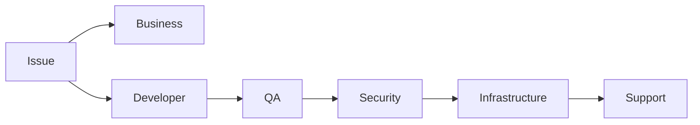

Real project-də agent bunu task/domain əsasında adaptasiya edir.

---

# 28.53. Phase 28-də ən vacib nəticə

Artıq bizdə:

```text
CODE
SDD
DOCS
```

üçlüyü var.

Və hərəsinin rolu aydındır:

| Layer   | Məqsəd                    |
| ------- | ------------------------- |
| Code    | Sistemin faktiki işləməsi |
| `.sdd`  | AI engineering knowledge  |
| `docs/` | Human understanding       |

---

# 28.54. Final prinsip

Sistemin əsas qaydası:

```text
DO NOT DUPLICATE KNOWLEDGE.
REFERENCE IT.
```

Məsələn 15 task payment security skill-dən istifadə edirsə:

```text
15 × full explanation
```

yazılmır.

Sadəcə:

```text
skills payment-security
```

yazılır.

AI lazım olanda skill-i açır.

---

# 28.55. Phase 28 sonrası real skeleton

Belə bir repository artıq kifayət qədər sağlam görünür:

```text
project/
│
├── .sdd/
│   ├── INDEX.sdd
│   ├── standards/
│   ├── skills/
│   ├── workflows/
│   ├── gates/
│   ├── schemas/
│   ├── agents/
│   └── project/
│       ├── INDEX.sdd
│       ├── project.sdd
│       ├── architecture/
│       ├── modules/
│       ├── tasks/
│       ├── workflow/
│       ├── decisions/
│       ├── diagrams/
│       └── runtime/
│
├── docs/
│   ├── INDEX.md
│   ├── business/
│   ├── developer/
│   ├── qa/
│   ├── security/
│   ├── support/
│   ├── infrastructure/
│   └── architecture/
│
├── BE/
├── FE/
├── MD/
├── infra/
├── tests/
└── ...
```

Root isə yenə **təmiz project skeleton** olaraq qalır.

---

# Progress

```text
PHASE 13  Task Engine                    ✅
PHASE 14  Security Engine                ✅
PHASE 15  Testing Engine                 ✅
PHASE 16  Architecture & Decision Engine ✅
PHASE 17  Stack & Technology Engine      ✅
PHASE 18  SDLC / Workflow Orchestrator   ✅
PHASE 19  Observability / Incident       ✅
PHASE 20  Documentation / Knowledge      ✅
PHASE 21  Context Router / Token Engine  ✅
PHASE 22  Agent Runtime / Tool Engine    ✅
PHASE 23  Project Discovery Engine       ✅
PHASE 24  Knowledge Graph & Traceability ✅
PHASE 25  Quality / Security / Release   ✅
PHASE 26  Skill Intelligence             ✅
PHASE 27  Autonomous Orchestrator        ✅
PHASE 28  SDD Language & Schema          ✅
```

## Növbəti PHASE 29 — AGENT RUNTIME & CLI

İndi artıq ən praktik hissəyə keçmək olar:

```text
Node.js CLI
     ↓
.sdd/ bootstrap
     ↓
Agent
     ↓
Tool Registry
     ↓
Filesystem
     ↓
Git
     ↓
Code
     ↓
Tests
     ↓
Web/Search
     ↓
Docker
     ↓
Project
```

Burada konkret olaraq **Git repo-ya qoyacağın Node.js agentin necə işləyəcəyini**, hansı command-lərin olacağını (`init`, `analyze`, `plan`, `run`, `review`, `security`, `status`, `resume` və s.), `.sdd` qovluğunu project-ə necə inject edəcəyini və agentin ilk dəfə repository-yə girəndə **dəqiq hansı ardıcıllıqla nə oxuyacağını** müəyyənləşdirəcəyik.


________________________________________________________________________________________________
next
# PHASE 29 — NODE.JS AGENT RUNTIME + CLI

Bu phase artıq ideyanı **real işləyən agent məhsuluna** çevirir.

Əsas məqsəd:

> İstənilən Git repository-yə agenti qoşursan → `.sdd/` sistemini yaradır → project-i analiz edir → mövcud `.sdd`-ni oxuyur → skill/workflow/task graph qurur → yalnız lazım olan işi icra edir.

---

# 29.1. Agent ayrıca project deyil

Mən agenti belə qurmağı məsləhət görürəm:

```text
your-project/
├── .sdd/
├── docs/
├── BE/
├── FE/
├── MD/
└── ...
```

Agentin özü isə ayrıca CLI package olur:

```text
sdd-agent
```

Yəni project-in içinə agent source code-u salmırıq.

---

# 29.2. İstifadə

Global:

```bash
sdd init
```

və ya mövcud project:

```bash
sdd analyze
```

Sonra:

```bash
sdd plan
sdd status
sdd run
```

---

# 29.3. CLI command-ləri

Əsas command-lər:

```text
sdd init
sdd analyze
sdd inspect
sdd plan
sdd status
sdd run
sdd resume
sdd review
sdd test
sdd security
sdd performance
sdd deploy
sdd incident
sdd explain
sdd trace
sdd doctor
sdd update
```

---

# 29.4. `sdd init`

Yeni project:

```bash
sdd init
```

Agent:

```text
Detect project
↓
Detect stack
↓
Create .sdd/
↓
Create docs/
↓
Create INDEX
↓
Create project.sdd
↓
Register initial architecture
```

Amma boş qovluqları kor-koranə yaratmır.

---

# 29.5. `sdd analyze`

Bu command ən vacib command-lərdən biridir.

```bash
sdd analyze
```

**Heç bir kod dəyişmir.**

Mode:

```text
READ_ONLY
```

Agent:

```text
.sdd/INDEX.sdd
        ↓
project INDEX
        ↓
project.sdd
        ↓
repository
        ↓
architecture
        ↓
modules
        ↓
skills
        ↓
drift
```

çıxarır.

---

# 29.6. Analyze output

Məsələn:

```text
PROJECT ANALYSIS

Stack
  BE      Go
  FE      React + TypeScript
  MD      React Native

Database
  PostgreSQL

Cache
  Redis

Infra
  Docker
  VPS

Tests
  Go test
  Playwright

Security
  JWT
  RBAC

Issues
  2 architecture drift
  1 missing security gate
  3 orphan tasks

Unknown
  Production backup policy
```

---

# 29.7. `sdd status`

Manager command:

```bash
sdd status
```

çıxışı:

```text
PROJECT STATUS

Tasks
  Ready       4
  Active      1
  Blocked     2
  Done        37

Security
  PASS

Quality
  PASS

Architecture
  1 WARNING

Release
  BLOCKED
```

---

# 29.8. `sdd status --tasks`

```text
TASK GRAPH

999       READY
1023      BLOCKED → 999
1011      BLOCKED → 1023
1001      BLOCKED → 1011

Next:
  999
```

---

# 29.9. `sdd plan`

```bash
sdd plan
```

Agent:

```text
Discovery
↓
Intent
↓
Architecture impact
↓
Skills
↓
Task graph
↓
Workflow
```

və heç nə implement etmir.

---

# 29.10. Plan output

```text
PLAN

Task:
  PAY-1023

Goal:
  Prevent duplicate refund

Risk:
  HIGH

Skills:
  idempotency
  transactions
  payment-security

Depends:
  TASK-999

Flow:
  BDD → BE → QA → SEC → VR

Estimated impact:
  BE
  DB
  QA
  Security
```

---

# 29.11. `sdd run`

```bash
sdd run
```

Bu artıq execution mode-dur.

Agent:

```text
Find ready task
↓
Resolve dependencies
↓
Load skills
↓
Load workflow
↓
Load relevant code
↓
Execute
↓
Run gates
↓
Record evidence
↓
Update task
```

---

# 29.12. `sdd run TASK-1023`

Specific task:

```bash
sdd run TASK-1023
```

Agent əvvəl yoxlayır:

```text
TASK-1023
depends TASK-999
```

Əgər 999 hazır deyil:

```text
TASK-1023 BLOCKED

Required:
  TASK-999
```

və 1023-ə toxunmur.

---

# 29.13. `sdd resume`

Agent yarıda qalıb:

```bash
sdd resume
```

Runtime state oxunur:

```text
TASK-1023
PHASE SECURITY
LAST_GATE SAST
STATUS PASS
NEXT dependency-scan
```

və oradan davam edir.

---

# 29.14. Agent filesystem access

Agentin filesystem tool-u məhdudlaşdırılmalıdır.

```text
READ
WRITE
CREATE
DELETE
MOVE
```

hamısı ayrıca permission olmalıdır.

---

# 29.15. Permission model

```text
READ_ONLY
PROJECT_WRITE
SDD_WRITE
CODE_WRITE
INFRA_WRITE
PRODUCTION_WRITE
```

default:

```text
READ_ONLY
```

---

# 29.16. Production heç vaxt default deyil

```text
PRODUCTION_WRITE = DENY
```

Human approval olmadan:

```text
deploy production
```

olmaz.

---

# 29.17. Tool Registry

Agentin bütün imkanlarını birbaşa prompta yazmaq əvəzinə:

```text
Tool Registry
```

olmalıdır.

Məsələn:

```text
filesystem
git
shell
docker
database
browser
search
test
security
cloud
```

---

# 29.18. Lazy tool loading

Agent bütün tool description-ları prompt-a yükləmir.

Məsələn task:

```text
Frontend UI
```

dirsə:

```text
Playwright
filesystem
git
```

lazım ola bilər.

Database migration tool-u isə context-ə salınmır.

Bu ciddi token qənaətidir.

---

# 29.19. Tool capability model

Hər tool:

```text
name
purpose
risk
permissions
input
output
```

ilə qeyd olunur.

Məsələn:

```text
tool: git.commit
risk: medium
permission: project_write
```

---

# 29.20. Agent loop

Əsas loop:

```text
OBSERVE
   ↓
UNDERSTAND
   ↓
PLAN
   ↓
ACT
   ↓
VERIFY
   ↓
RECORD
   ↓
OBSERVE
```

---

# 29.21. Agent heç vaxt

```text
PLAN
→
WRITE 500 files
```

etməməlidir.

Hər major action:

```text
PLAN
→
SMALL CHANGE
→
TEST
→
VERIFY
```

olmalıdır.

---

# 29.22. Transactional agent behavior

Məsələn 5 fayl dəyişir.

```text
1
2
3
4
5
```

3-cü testdən keçmədi.

Agent:

```text
STOP
```

etməlidir.

Sonra:

```text
rollback
```

və ya:

```text
continue with approval
```

---

# 29.23. Git checkpoint

Implementation başlamazdan əvvəl:

```text
git status
```

və checkpoint:

```text
agent/checkpoint/TASK-1023
```

yaradıla bilər.

Daha rahat variant:

```text
git branch:
  sdd/task-1023
```

---

# 29.24. Task branch

```text
TASK-1023
 ↓
sdd/task-1023
 ↓
implementation
 ↓
tests
 ↓
review
 ↓
PR
```

Bu traceability-ni çox gücləndirir.

---

# 29.25. Git diff guard

Agent hər write-dan sonra:

```text
git diff
```

analiz edir.

Əgər plan:

```text
BE/internal/payment/*
```

idi,

amma diff:

```text
FE/*
MD/*
infra/*
```

göstərirsə:

```text
UNEXPECTED CHANGE
```

yaradır.

---

# 29.26. Scope guard

Task:

```text
scope:
  BE/payment
```

Agent:

```text
FE
MD
infra
```

dəyişmək istəyirsə:

```text
IMPACT DETECTED
```

deyir.

Əgər dependency graph bunu tələb edirsə davam edir.

---

# 29.27. Scope expansion

Məsələn:

```text
API contract changed
```

və FE/MD təsirlənir.

Agent:

```text
Expected impact:
  FE
  MD
```

görür.

Bu zaman scope avtomatik genişlənə bilər, amma:

```text
record impact
```

olmalıdır.

---

# 29.28. BDD-first enforcement

Sənin SDLC qaydan:

```text
BDD
↓
CODE
↓
TS
↓
UI
↓
MANUAL
↓
AUTOMATION
```

workflow engine tərəfindən enforce olunur.

Agent kod yazmaq istəyirsə, əvvəl:

```text
BDD missing
```

deyib dayana bilər.

---

# 29.29. Workflow override

Amma hər task BDD tələb etmir.

Məsələn:

```text
docs typo
```

üçün:

```text
BDD
```

absurd olar.

Skill/workflow sistemi bunu adaptiv seçir.

---

# 29.30. Quality gates

Task bitmiş sayılmır:

```text
CODE DONE
```

olduğu üçün.

Bitmiş sayılır:

```text
CODE
+
TEST
+
REVIEW
+
SECURITY
+
REQUIRED GATES
```

keçdikdə.

---

# 29.31. Security pipeline

Security artıq ayrıca command deyil.

Execution pipeline-a daxil olur:

```text
CODE
 ↓
SAST
 ↓
DEPENDENCY SCAN
 ↓
SECRET SCAN
 ↓
AUTH TEST
 ↓
SECURITY TEST
 ↓
PENTEST
 ↓
PASS
```

Risk səviyyəsinə görə bəzi mərhələlər seçilir.

---

# 29.32. Load / DDoS awareness

Production-risk task üçün:

```text
PERFORMANCE
LOAD
RATE LIMIT
DDoS
CAPACITY
```

skill-ləri avtomatik seçilə bilər.

Agent məsələn:

```text
1M DAU
```

görürsə low-scale architecture skill-lərini istifadə etmir.

---

# 29.33. Scale profile

Project:

```text
scale:
  users: 1M
  dau: 250K
  mau: 700K
```

kimi profile saxlayır.

Sonra skill selection:

```text
scale → architecture
scale → caching
scale → DB
scale → CDN
scale → observability
```

etkisini görür.

---

# 29.34. Infrastructure profiles

Agent:

```text
infra:
  provider: VPS
```

görürsə:

```text
VPS deployment skill
```

seçir.

AWS:

```text
aws skill
```

GCP:

```text
gcp skill
```

Azure:

```text
azure skill
```

---

# 29.35. Infrastructure abstraction

Workflow:

```text
BUILD
 ↓
PACKAGE
 ↓
DEPLOY
 ↓
VERIFY
```

standart qalır.

Provider-specific skill isə:

```text
VPS
AWS
GCP
AZURE
```

hissəsini dəyişir.

Bu çox düzgün abstraction-dır.

---

# 29.36. Agent architecture

Node.js tərəfdə belə struktur təklif edirəm:

```text
packages/
├── cli/
├── agent/
├── parser/
├── planner/
├── orchestrator/
├── graph/
├── skills/
├── workflows/
├── gates/
├── tools/
├── runtime/
├── git/
├── filesystem/
└── schemas/
```

---

# 29.37. CLI

```text
packages/cli
```

yalnız:

```text
command parsing
output
config
```

ilə məşğul olur.

Business logic CLI-də olmur.

---

# 29.38. Agent core

```text
packages/agent
```

burada:

```text
observe()
reason()
plan()
act()
verify()
```

olur.

---

# 29.39. Parser

```text
packages/parser
```

`.sdd` syntax:

```text
parse
validate
normalize
```

edir.

---

# 29.40. Graph engine

```text
packages/graph
```

bunları idarə edir:

```text
dependencies
relations
cycles
impact
ordering
```

---

# 29.41. Planner

```text
packages/planner
```

input:

```text
intent
project
skills
architecture
constraints
```

output:

```text
execution plan
```

---

# 29.42. Orchestrator

```text
packages/orchestrator
```

əsas iş:

```text
plan
→ task
→ workflow
→ gate
→ result
```

---

# 29.43. Runtime

```text
packages/runtime
```

saxlayır:

```text
session
state
checkpoint
resume
evidence
```

---

# 29.44. Tool interface

Bütün tool-lar eyni interface-dən keçməlidir.

Məntiq:

```text
Tool
├── metadata
├── permissions
├── execute
└── verify
```

Beləliklə sabah:

```text
GitHub
GitLab
Bitbucket
```

dəyişmək asan olur.

---

# 29.45. External integrations

Agent:

```text
GitHub
GitLab
Jira
Linear
Slack
Sentry
AWS
GCP
Azure
Docker
Kubernetes
```

ilə işləyə bilər.

Amma bunlar core-a hard-code edilməməlidir.

Plugin/tool adapter olmalıdır.

---

# 29.46. `.sdd` plugin awareness

Agent:

```text
.sdd/tools/
```

və ya global registry vasitəsilə project-in istifadə etdiyi integration-ları tanıya bilər.

Amma mən bunu `.sdd/` içində çoxaltmağı yox, ayrıca tool registry saxlamağı üstün tuturam.

---

# 29.47. Agent config

Project-də yalnız:

```text
.sdd/agent.sdd
```

kimi minimal config ola bilər.

Məsələn:

```text
@agent

mode supervised
provider auto

write project
write sdd

production deny

max-risk high
```

---

# 29.48. Default təhlükəsizlik

Default:

```text
mode supervised
project write allow
sdd write allow
production deny
secret read deny
```

---

# 29.49. Secret management

Agent `.env` faylını avtomatik context-ə yükləməməlidir.

```text
.env
```

→ secret source.

Agent yalnız:

```text
SECRET_EXISTS
```

kimi metadata görə bilər.

---

# 29.50. Secret leakage guard

Agentin output-u:

```text
git diff
logs
LLM context
```

içində:

```text
API_KEY
PASSWORD
TOKEN
PRIVATE_KEY
```

görülərsə redaction etməlidir.

---

# 29.51. `sdd doctor`

Bu command sistemin özünü yoxlayır:

```bash
sdd doctor
```

çıxışı:

```text
SDD
  schema          PASS
  index           PASS
  graph           PASS
  skills          PASS
  workflows       PASS
  references      2 warnings
  drift           1 warning
```

---

# 29.52. `sdd review`

```bash
sdd review
```

bütün project-i review edə bilər.

Amma review yalnız BE deyil:

```text
BE
FE
MD
QA
Security
DB
DevOps
Infrastructure
Architecture
Docs
```

hamısını impact-based yoxlayır.

---

# 29.53. Review matrix

```text
                 BE FE MD DB QA SEC DEVOPS DOC
Architecture      ✓  ✓  ✓  ✓  ✓   ✓   ✓     ✓
Security          ✓  ✓  ✓  ✓  ✓   ✓   ✓
Performance       ✓  ✓  ✓  ✓      ✓   ✓
Testing           ✓  ✓  ✓     ✓
```

Agent project stack-ə görə matrix-i dəyişir.

---

# 29.54. `sdd explain`

Manager üçün çox faydalıdır:

```bash
sdd explain TASK-1023
```

çıxışı:

```text
TASK-1023

Why exists:
  Duplicate refund vulnerability

Origin:
  SEC-004

Depends:
  TASK-999

Skills:
  idempotency
  transaction
  payment-security

Affected:
  BE
  DB
  QA
  Security

Current:
  BLOCKED

Reason:
  TASK-999 incomplete
```

---

# 29.55. `sdd trace`

```bash
sdd trace TASK-1023
```

```text
PROMPT
 ↓
FINDING
 ↓
DECISION
 ↓
TASK
 ↓
WORKFLOW
 ↓
CODE
 ↓
TEST
 ↓
SECURITY
 ↓
COMMIT
 ↓
RELEASE
```

Bu sənin əvvəl dediyin:

> “zəncir harada qırılıb?”

problemini birbaşa həll edir.

---

# 29.56. `sdd incident`

```bash
sdd incident
```

production problemi:

```text
Incident
 ↓
release
 ↓
commit
 ↓
task
 ↓
decision
 ↓
requirement
```

trace edilir.

---

# 29.57. `sdd update`

Bu çox vacib olacaq:

```bash
sdd update
```

global skill-ləri yeniləmək üçün istifadə edilir.

Məsələn:

```text
security skill outdated
```

Agent:

```text
Search
 ↓
Compare current practice
 ↓
Pros
 ↓
Cons
 ↓
Breaking changes
 ↓
Recommend
 ↓
Human approval
 ↓
Update skill
```

---

# 29.58. Skill update heç vaxt kor-koranə olmur

AI:

> “Yeni framework çıxdı, skill-i dəyişdim.”

etməməlidir.

Əvvəl:

```text
CURRENT
NEW
PROS
CONS
RISK
MIGRATION
```

müqayisəsi verməlidir.

---

# 29.59. Skill lifecycle

```text
DRAFT
 ↓
ACTIVE
 ↓
REVIEW
 ↓
OUTDATED
 ↓
UPDATED
 ↓
ACTIVE
```

və ya:

```text
ACTIVE
 ↓
DEPRECATED
 ↓
RETIRED
```

---

# 29.60. Agent artıq “AI chatbot” deyil

Bu phase-dən sonra model:

```text
LLM
```

sadəcə reasoning engine-dir.

Əsas sistem:

```text
SDD
+
Graph
+
Skills
+
Workflow
+
Gates
+
Runtime
+
Tools
```

olur.

Bu çox mühüm arxitektura qərarıdır.

---

# 29.61. Final architecture

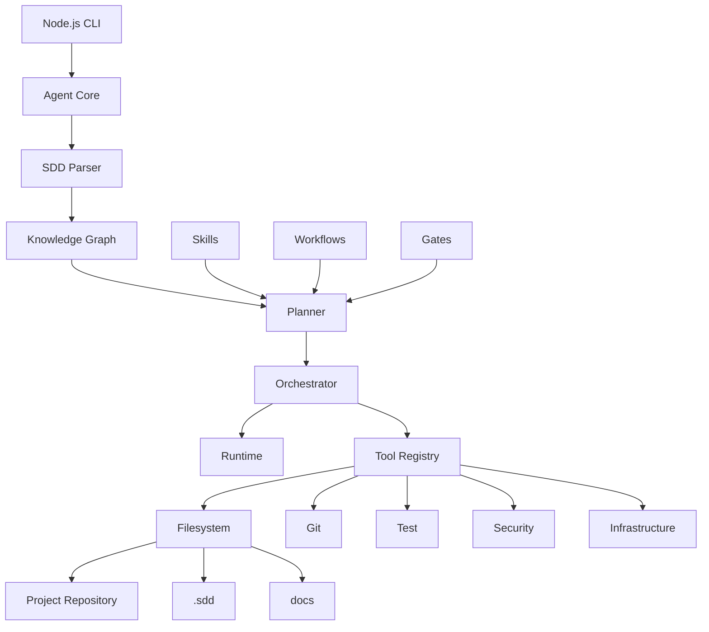

---

# 29.62. Bu phase ilə nə həll olundu?

```text
✅ Node.js agent architecture
✅ CLI
✅ Read-only analysis
✅ Planning
✅ Autonomous execution
✅ Resume
✅ Checkpoint
✅ Tool registry
✅ Permission system
✅ Production safety
✅ Git integration
✅ Scope guard
✅ BDD enforcement
✅ Security gates
✅ Impact analysis
✅ Token-efficient loading
✅ Secret protection
✅ Project-wide review
✅ Incident tracing
✅ Skill updating
```

---

# Progress

```text
PHASE 13  Task Engine                    ✅
PHASE 14  Security Engine                ✅
PHASE 15  Testing Engine                 ✅
PHASE 16  Architecture & Decision       ✅
PHASE 17  Stack & Technology             ✅
PHASE 18  SDLC / Workflow                ✅
PHASE 19  Observability / Incident       ✅
PHASE 20  Documentation                  ✅
PHASE 21  Context / Token Engine         ✅
PHASE 22  Agent Runtime / Tools          ✅
PHASE 23  Project Discovery              ✅
PHASE 24  Knowledge Graph / Traceability ✅
PHASE 25  Quality / Security / Release   ✅
PHASE 26  Skill Intelligence             ✅
PHASE 27  Autonomous Orchestrator        ✅
PHASE 28  SDD Language / Schema          ✅
PHASE 29  Node.js Agent Runtime / CLI    ✅
```

## Növbəti: PHASE 30 — SKILL INTELLIGENCE ENGINE

Burada artıq ən kritik hissələrdən birinə girəcəyik:

**Skill-lərin özlərinin necə yazılacağı.**

Məsələn:

```text
skills/backend/idempotency.sdd
skills/database/postgresql.sdd
skills/security/payment-security.sdd
skills/frontend/react.sdd
skills/mobile/react-native.sdd
skills/qa/playwright.sdd
skills/devops/docker.sdd
skills/cloud/aws.sdd
```

və hər skill-in:

```text
L0 → L1 → L2 → L3 → L4 → L5
```

səviyyələri,

```text
BEST PRACTICE
PROS
CONS
WHEN TO USE
WHEN NOT TO USE
ALTERNATIVES
SCALE
SECURITY
PERFORMANCE
COST
MIGRATION
DEPRECATION
```

kimi məlumatları necə **çox az tokenlə** saxlayacağı və AI-nin project-in səviyyəsinə uyğun yalnız lazım olan hissəni necə seçəcəyi müəyyənləşdiriləcək.


________________________________________________________________________________________________
next
________________________________________________________________________________________________
next
________________________________________________________________________________________________
next
________________________________________________________________________________________________
next
________________________________________________________________________________________________
next
________________________________________________________________________________________________
next
________________________________________________________________________________________________
next
________________________________________________________________________________________________
next
________________________________________________________________________________________________
next
________________________________________________________________________________________________
next
________________________________________________________________________________________________
next
________________________________________________________________________________________________
next
________________________________________________________________________________________________
next
________________________________________________________________________________________________
next
________________________________________________________________________________________________
next
________________________________________________________________________________________________
next
________________________________________________________________________________________________
next
________________________________________________________________________________________________
next
________________________________________________________________________________________________
next
________________________________________________________________________________________________
next
________________________________________________________________________________________________
next
________________________________________________________________________________________________
next
________________________________________________________________________________________________
next
________________________________________________________________________________________________
next
________________________________________________________________________________________________
next
________________________________________________________________________________________________
next
________________________________________________________________________________________________
next
________________________________________________________________________________________________
next
________________________________________________________________________________________________
next
________________________________________________________________________________________________
next
________________________________________________________________________________________________
next
________________________________________________________________________________________________
next
________________________________________________________________________________________________
next
________________________________________________________________________________________________
next
________________________________________________________________________________________________
next
________________________________________________________________________________________________
next
________________________________________________________________________________________________
next
________________________________________________________________________________________________
next
________________________________________________________________________________________________
next
________________________________________________________________________________________________
next
________________________________________________________________________________________________
next
________________________________________________________________________________________________
next
________________________________________________________________________________________________
next
________________________________________________________________________________________________
next
________________________________________________________________________________________________
next
________________________________________________________________________________________________
next
________________________________________________________________________________________________
next
________________________________________________________________________________________________
next
________________________________________________________________________________________________
next
________________________________________________________________________________________________
next
________________________________________________________________________________________________
next