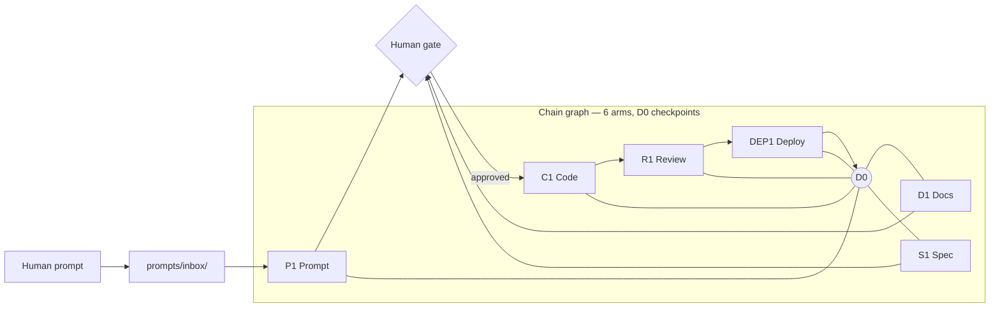
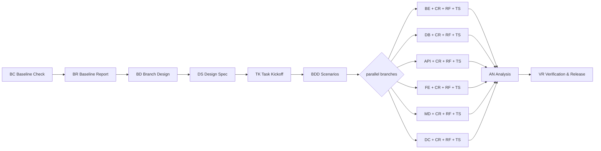
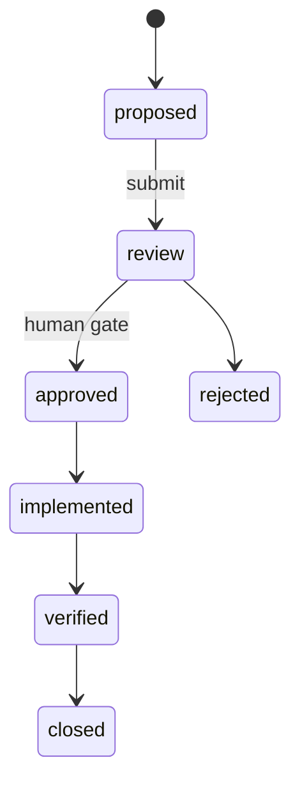

# SDDRA Architecture Overview

SDDRA (Spec-Driven Development & Reasoning Architecture) is a
specification-first operating system for AI-assisted software
engineering. The `.sdd/` directory is the single source of truth;
code, commands, and docs are derived surfaces.

## Three-language model

SDDRA separates a repository into three languages, each with one job:

| Language | Location | Speaks to | Changes |
|----------|----------|-----------|---------|
| **Spec** | `.sdd/` | machines + architects | first (contracts) |
| **Docs** | `docs/`, `.sdd/docs/` | humans | from specs |
| **Code** | `sdd-adapter/`, product code | runtime | from specs |

A change is legal only in that order: spec → docs → code.

## System overview — prompt to deploy

Every arm starts and ends at **D0** (the checkpoint center); state
symbols (`+` active, `-` inactive, `~` archived) mark spec liveness.

## The delivery chain (DL1)

Each engineering branch runs the unified pipeline
`XX → CR-XX → RF-XX → XX-TS → SC-XX`: implement, scoped review with
the 4-pillar checklist, refactor if review raises findings, test,
security-check.

## Decision & task lifecycle

Decisions (DEC-xxx), tasks, phases, and context live in registries
under `.sdd/projects/<name>/`. Every task ends with a git commit
carrying DEC/TASK references ([R95]).

## Enforcement layers

| Layer | Mechanism | Examples |
|-------|-----------|----------|
| L3 intent contracts | `.sdd/` specs + rules R1-R106 | process.sdlc_flow, boundaries |
| L2 runtime enforcement | sandbox, hook-bridge, health gates | Docker-only exec [R102], /sdd-health drift scan |
| L1 scoped review | CR-XX 4-pillar review + RF fix loop | duplication_findings[], N+1 checks |

(See `.sdd/docs/analysis/garry-tan-gstack-alignment.md` for the
three-layer analysis.)

## Where to go next

- [How it works](../concepts/how-it-works.md) — deep dive
- [Install](../getting-started/install.md) — three install paths
- [Contributing](../contributing/contributing.md) — commands, rules, skills
- [Philosophy](../contributing/philosophy.md) — why SDDRA exists
