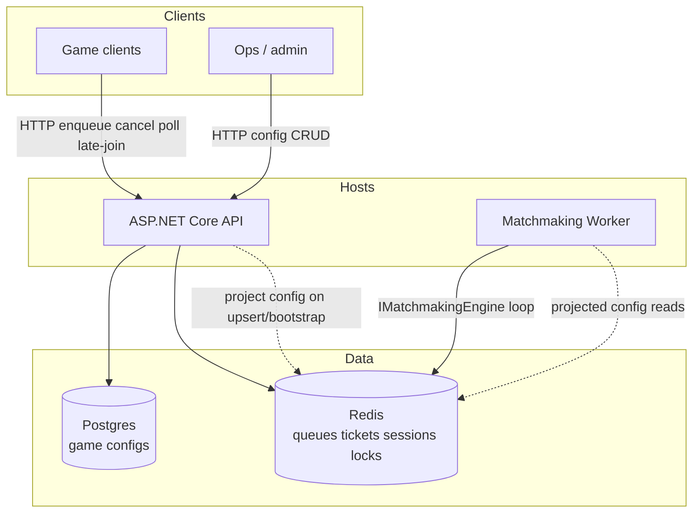

Doc senedlerinde isterdim ki bolmelere ayiraim bu doc business logice, developerelr aiddiir bu doc supporta bu doc infraya bele bele gederek lahiyyenin docuna esasen bu probleme gore kim esas is gormeldir 
Elave oalraq doclarda her yuxarida qeydd etdiyim insfratsruktur layerine groe digramlar olasun msal ucun men numune diqarami bele goruerm daha best pratisi avrsa ealve ederdin





Yeni diaqram her layir doc ucun oz eskini tapmalidir ki bines oxuanda bilsin ki bu logic nece formalsib filan


Bəli. Bu əlavəni mən **mütləq edərdim**, hətta burada əvvəlki modeldən bir addım da irəli getmək olar.

Sənin istədiyin `docs/` artıq sadəcə “documentation” deyil. O, **layihənin insan üçün naviqasiya və əməliyyat xəritəsi** olmalıdır.

Əsas fikir:

> **AI `.sdd`-dən nə etməli olduğunu, insan isə `docs/`-dan sistemin necə işlədiyini və problem çıxanda kimin işləməli olduğunu anlamalıdır.**

---

# 1. `docs/`-u layer-lərə bölək

Mən belə struktur təklif edərdim:

```text
docs/
│
├── 00-about/
│   ├── project.md
│   ├── glossary.md
│   └── system-overview.md
│
├── 10-business/
│   ├── business-model.md
│   ├── business-rules.md
│   ├── domains/
│   └── workflows/
│
├── 20-architecture/
│   ├── overview.md
│   ├── decisions.md
│   ├── boundaries.md
│   ├── dependencies.md
│   └── diagrams/
│
├── 30-backend/
│   ├── overview.md
│   ├── modules/
│   ├── services/
│   ├── api/
│   └── diagrams/
│
├── 40-frontend/
│   ├── overview.md
│   ├── modules/
│   ├── state/
│   └── diagrams/
│
├── 50-mobile/
│   ├── overview.md
│   ├── android/
│   ├── ios/
│   └── diagrams/
│
├── 60-database/
│   ├── overview.md
│   ├── schema/
│   ├── migrations/
│   ├── indexing/
│   └── diagrams/
│
├── 70-api/
│   ├── overview.md
│   ├── contracts/
│   ├── authentication.md
│   └── diagrams/
│
├── 80-qa/
│   ├── strategy.md
│   ├── bdd/
│   ├── automation/
│   ├── ui/
│   ├── manual/
│   └── diagrams/
│
├── 90-security/
│   ├── overview.md
│   ├── threats.md
│   ├── policies.md
│   └── incidents/
│
├── 100-devops/
│   ├── overview.md
│   ├── docker/
│   ├── ci-cd/
│   ├── deployment/
│   ├── rollback/
│   └── diagrams/
│
├── 110-infrastructure/
│   ├── overview.md
│   ├── vps/
│   ├── aws/
│   ├── azure/
│   ├── gcp/
│   └── kubernetes/
│
├── 120-support/
│   ├── overview.md
│   ├── runbooks/
│   ├── troubleshooting/
│   ├── incidents/
│   └── faq/
│
└── 130-operations/
    ├── monitoring.md
    ├── alerting.md
    ├── sla.md
    └── disaster-recovery.md
```

Bu strukturda hər sənədin **owner-i də təbii olaraq görünür**.

---

# 2. Problem → hansı komanda?

Bu isə sənin çox yaxşı əlavə etdiyin fikirdir.

Məsələn production-da:

```text
Payment failed
```

AI və ya support sistemi əvvəlcə:

```text
Problem
 ↓
Domain
 ↓
Layer
 ↓
Owner
 ↓
Runbook
```

tapmalıdır.

Məsələn:

```text
Payment API 500
```

nəticə:

```text
Domain:
  Payment

Layer:
  API / Backend

Primary:
  Backend

Secondary:
  DevOps

Docs:
  docs/30-backend/api/
  docs/70-api/
  docs/120-support/troubleshooting/
```

Başqa:

```text
Database connection refused
```

→

```text
Primary:
  Infrastructure / DevOps

Secondary:
  Database

Runbook:
  docs/120-support/runbooks/database-down.md
```

---

# 3. Bunun üçün `Ownership Matrix` yaratmaq lazımdır

Məsələn:

```text
docs/00-about/ownership.md
```

```text
| Problem | Primary | Secondary | Runbook |
|---|---|---|---|
| API 500 | BE | DO | api-500 |
| UI broken | FE | QA | ui-failure |
| Mobile crash | MD | QA | mobile-crash |
| DB unavailable | DB | DO | database-down |
| Deployment fail | DO | BE | deployment-failure |
| Security issue | SEC | DO | security-incident |
| Business rule wrong | Product | BE | business-rule |
| Test failure | QA | Owner layer | test-failure |
```

Bu çox praktikdir.

---

# 4. Daha da yaxşısı: hər docs faylının `Owner` məlumatı olsun

Məsələn:

```md
# Payment Refund

Owner:
  Backend

Secondary:
  Database
  QA
  Security

Business:
  Payment

Related:
  @PAY/refund
  @DB/payment
  @API/refund
```

Human oxuyanda dərhal bilir:

> Bu mənim işimdir, yoxsa başqa komandanın?

---

# 5. Diagram məsələsində isə tamamilə səninlə razıyam

Amma bir qayda qoyardım:

> **Hər layer öz diagramını sıfırdan yaratmır. Mövcud diagram source-of-truth-dan derive olunur.**

Məsələn:

```text
docs/20-architecture/diagrams/system.md
```

ümumi architecture.

Sonra Backend:

```text
docs/30-backend/diagrams/payment.md
```

yalnız Backend-in maraqlandığı hissəni göstərir.

Frontend:

```text
docs/40-frontend/diagrams/payment-flow.md
```

Mobile:

```text
docs/50-mobile/diagrams/payment-flow.md
```

QA:

```text
docs/80-qa/diagrams/payment-test-flow.md
```

---

# 6. Sənin Mermaid nümunən çox yaxşıdır

Mən onu saxlayardım, amma bir az metadata əlavə edərdim:


Bu artıq insan üçün çox yaxşı architecture snapshot-dır.

---

# 7. Amma diagramın yuxarısında SDD reference saxlayardım

Məsələn:

```md
# Payment Architecture

Layer:
  ARCH

Owner:
  Backend

Related:
  @PAY
  @DB/payment
  @API/payment
  @DO/payment

Source:
  .sdd/project/flows.sdd

Generated:
  2026-08-20

Status:
  ✓ verified
```

sonra Mermaid.

Bu çox vacibdir.

AI görür:

```text
@PAY
```

və `.sdd/project/` modelinə gedə bilir.

İnsan isə diagramı oxuyur.

---

# 8. Diagramların da növləri olmalıdır

Mən sadəcə “architecture diagram” deməzdim.

Canonical diagram types:

```text
#CTX   Context
#ARCH  Architecture
#FLOW  Flow
#SEQ   Sequence
#DATA  Data model
#DEP   Dependency
#NET   Network
#DEPLOY Deployment
#CI    CI/CD
#OBS   Observability
#SEC   Security
#TEST  Test flow
```

Məsələn:

```text
#PAY
#ARCH
```

architecture diagram.

```text
#PAY
#FLOW
```

business flow.

```text
#PAY
#SEQ
```

request sequence.

---

# 9. Hər layer öz “view”sini yaradır

Məsələn ümumi sistem:

```text
Client
 ↓
API
 ↓
BE
 ↓
DB
```

Backend developer üçün:

```text
API
 ↓
Controller
 ↓
Service
 ↓
Repository
 ↓
DB
```

DevOps üçün:

```text
Internet
 ↓
Load Balancer
 ↓
Container
 ↓
Postgres
 ↓
Redis
```

QA üçün:

```text
BDD
 ↓
API Test
 ↓
UI Test
 ↓
Integration
 ↓
Regression
```

Business üçün:

```text
Student
 ↓
Course
 ↓
Payment
 ↓
Completion
 ↓
Teacher payout
```

**Eyni sistemdir. Sadəcə fərqli “view”dir.**

Bu çox güclü yanaşmadır.

---

# 10. Buna görə `.sdd/project/flows.sdd` birbaşa diagram deyil

Bu əvvəlki müzakirəmizdəki vacib düzəlişdir.

`flows.sdd`:

> **canonical relationship model**

olur.

Diagram isə:

> **view**

olur.

Yəni:

```text
.sdd/project/flows.sdd
        │
        ├── Business view
        ├── Backend view
        ├── Frontend view
        ├── Mobile view
        ├── QA view
        └── DevOps view
```

Bu daha düzgündür.

---

# 11. AI yeni kod yazanda diagramı da düşünməlidir

Məsələn BE-də:

```text
PaymentService
```

əlavə edildi.

AI yoxlayır:

```text
Impact:
  BE +
  API +
  DB +
  FE ?
  MD ?
  QA +
  DO ?
  DOC +
```

Əgər architecture relationship dəyişibsə:

```text
flows.sdd
```

də dəyişir.

Sonra:

```text
docs/20-architecture/...
docs/30-backend/...
docs/70-api/...
```

uyğun diagramları yeniləmək task-a çevrilir.

---

# 12. Documentation da `VR`-dan keçməlidir

Bu məncə mütləq qayda olmalıdır:

```text
Code changed
      ↓
Impact analysis
      ↓
Documentation impact
      ↓
Diagram impact
      ↓
Docs update
      ↓
VR
```

Əgər:

```text
source changed
```

amma:

```text
diagram stale
```

olarsa:

```text
VR !
```

---

# 13. “Stale documentation” ayrıca status olsun

```text
DOC+
DOC~
DOC!
```

Məsələn:

```text
Payment architecture
  status: ~
  reason: source changed
```

AI görəndə:

> Bu sənəd köhnəlib.

və bunu özü task-a çevirir.

---

# 14. Mən bir də `DOC INDEX` yaradardım

```text
docs/index.md
```

orada:

```text
Business
  ↓
Architecture
  ↓
Backend
  ↓
Frontend
  ↓
Mobile
  ↓
Database
  ↓
API
  ↓
QA
  ↓
Security
  ↓
DevOps
  ↓
Infrastructure
  ↓
Support
  ↓
Operations
```

və hər birinin:

```text
Owner
Purpose
Related domains
Related diagrams
Related runbooks
```

məlumatı olar.

İnsan layihəyə ilk daxil olanda **hara getməli olduğunu dərhal bilir.**

---

# 15. Ən güclü model: Problem → Documentation → Owner → Skill → Chain

Məsələn:

```text
PROBLEM
  ↓
"Payment timeout"
  ↓
DOC INDEX
  ↓
Payment
  ↓
API / Backend / Infrastructure
  ↓
OWNER
  ↓
BE + DO
  ↓
SKILLS
  ↓
#TIMEOUT
#API
#DB
#CACHE
#OBS
  ↓
CHAIN
  ↓
AR → BE → DB → DO → QA → VR
```

Bu artıq sənin dediyin:

> **“Problemin nə olduğunu görüb kim işləməlidir?”**

sualını avtomatik həll edir.

---

## Məncə burada son modelimiz artıq belə olmalıdır

```text
                    PROJECT
                       │
             ┌─────────┴─────────┐
             │                   │
        .sdd PROJECT             docs
             │                   │
        AI knowledge         Human knowledge
             │                   │
       Skills / Chains       Explanations
       Tasks / State         Diagrams
       Dependencies          Runbooks
       Impact                Ownership
             │                   │
             └─────────┬─────────┘
                       ↓
                     CODE
                       │
                       ↓
                    VERIFY
                       │
             ┌─────────┴─────────┐
             ↓                   ↓
           VALID               FAIL
             │                   │
           DONE              ROOT CAUSE
                                 │
                                 ↓
                           CORRECT OWNER
                                 │
                                 ↓
                              RE-CHAIN
```

**Bu yanaşmanı mən sənin sistemində əsas model kimi saxlayardım.**

Xüsusilə `docs` üçün üç şeyi standartlaşdırmaq lazımdır:

1. **Owner** — kim məsuldur?
2. **View** — hansı layer üçün göstərilir?
3. **Diagram** — həmin layer sistemi necə görür?

Beləliklə eyni architecture məlumatını 10 dəfə əl ilə yazmırıq; **bir canonical `.sdd` modelindən Business, BE, FE, MD, QA, DB, DO və Support view-ləri törəyir.** Bu həm sənədlərin şişməsinin, həm də bir-birindən fərqli diagramların yaranmasının qarşısını alır.
