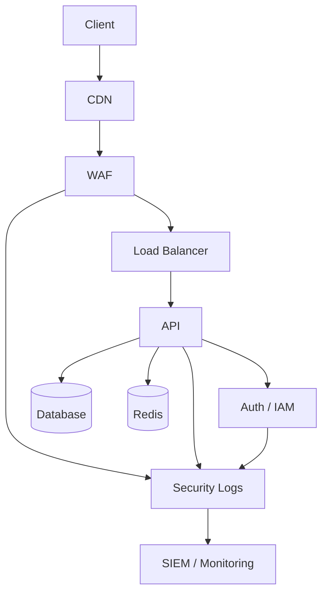

esas derd Security onun da dizayni olmalidir qa test kecdi SC -Security testden kecmelidir pentest edilmelidir load test edilib ddos atacina meruz qaldiqda ne etmelidir bu halalrida elave ederdim skille yeni bir sirket kimi ozunu dusun butun Pros Cons idare eden bir ai kimi ozunu fikirles


Tam olaraq. Burada mən bir düzəliş edərdim: **Security-ni ayrıca bir skill qovluğu kimi saxlamaq kifayət deyil.** Security bütün lifecycle-ın içindən keçən **cross-cutting gate** olmalıdır.

Sistemi bir şirkət kimi düşünsək, AI təkcə developer deyil:

```text
PRODUCT
ARCHITECT
BE
FE
MD
DB
API
QA
SECURITY
DEVOPS
SRE
SUPPORT
```

və bunların hamısının üzərində:

```text
                GOVERNANCE
                    │
       ┌────────────┼────────────┐
       ↓            ↓            ↓
    QUALITY      SECURITY      RISK
       │            │            │
       └────────────┼────────────┘
                    ↓
                  VERIFY
```

## 1. Security `chain` yox, `gate` də olmalıdır

Sənin əvvəlki chain-in:

```text
AR → DB → BE → FE → MD → QA → DO → VR
```

ola bilər.

Amma Security belə ayrıca paralel işləməlidir:

```text
                 AR
                 │
          ┌──────┴──────┐
          ↓             ↓
       DESIGN          SECURITY
          │             │
          ↓             ↓
        DB/BE/FE/MD   SCAN/THREAT
          │             │
          └──────┬──────┘
                 ↓
                QA
                 ↓
              SEC TEST
                 ↓
              PENTEST
                 ↓
              LOAD TEST
                 ↓
                DO
                 ↓
                VR
```

Yəni:

> **QA keçdi ≠ Security keçdi.**

---

# 2. Security lifecycle

Mən `.sdd/skills/security/` daxilində belə bir model qurardım:

```text
security/
├── design/
│   ├── threat-modeling/
│   ├── trust-boundary/
│   ├── attack-surface/
│   └── secure-architecture/
│
├── application/
│   ├── authentication/
│   ├── authorization/
│   ├── session/
│   ├── input-validation/
│   ├── injection/
│   ├── csrf/
│   ├── ssrf/
│   └── business-logic/
│
├── api/
│   ├── api-security/
│   ├── rate-limit/
│   ├── abuse-prevention/
│   └── api-fuzzing/
│
├── database/
│   ├── access/
│   ├── encryption/
│   ├── secrets/
│   └── backup/
│
├── infrastructure/
│   ├── network/
│   ├── firewall/
│   ├── iam/
│   ├── container/
│   └── cloud/
│
├── supply-chain/
│   ├── dependencies/
│   ├── images/
│   ├── sbom/
│   └── signing/
│
├── testing/
│   ├── sast/
│   ├── dast/
│   ├── dependency-scan/
│   ├── container-scan/
│   ├── api-security/
│   ├── penetration-test/
│   ├── fuzz-test/
│   └── load-security/
│
├── incident/
│   ├── ddos/
│   ├── breach/
│   ├── credential-leak/
│   ├── ransomware/
│   └── data-leak/
│
└── compliance/
```

---

# 3. `SC` qısa açarını əlavə edərdim

Sənin:

```text
BE
FE
MD
QA
DO
VR
```

sisteminə:

```text
SC = Security
```

əlavə edək.

Amma burada bir fərq var.

`QA` bir stage ola bilər.

`SC` isə **cross-cutting domain + gate**.

---

# 4. Feature chain nümunəsi

Payment refund:

```text
AR
 ↓
DB
 ↓
BE
 ↓
API
 ↓
FE
 ↓
MD
 ↓
QA
 ↓
SC
 ↓
DO
 ↓
VR
```

Amma SC içəridə:

```text
SC
├── threat model
├── SAST
├── dependency scan
├── API security
├── auth/permission test
├── abuse test
├── DAST
├── penetration test
└── security review
```

---

# 5. Security risk-lə başlamalıdır

AI kod yazmağa keçməzdən əvvəl:

```text
Feature
 ↓
Attack Surface
 ↓
Threat Model
 ↓
Security Requirements
```

çıxarmalıdır.

Məsələn:

```text
Refund API

Assets:
  money
  transaction
  user identity

Threats:
  double refund
  unauthorized refund
  replay
  race condition
  parameter tampering
```

Sonra development.

Bu çox vacibdir:

> **Security test sonradan əlavə olunan mərhələ olmamalıdır.**

---

# 6. Security Acceptance Criteria

Task:

```text
#PAY-042
```

üçün:

```text
Security:
  [ ] unauthorized refund blocked
  [ ] duplicate refund blocked
  [ ] replay blocked
  [ ] rate limit enforced
  [ ] audit trail exists
  [ ] secrets not exposed
```

və:

```text
SC:
  ~
```

QA:

```text
QA:
  ✓
```

SC:

```text
SC:
  !
```

olarsa:

```text
VR:
  blocked
```

---

# 7. Security severity standardı

Bütün project-də eyni vocabulary istifadə edək:

```text
INFO
LOW
MEDIUM
HIGH
CRITICAL
```

və state:

```text
OPEN
MITIGATED
ACCEPTED
FALSE_POSITIVE
RESOLVED
VERIFIED
```

Məsələn:

```text
#SEC-004

Severity:
  CRITICAL

Status:
  OPEN

Area:
  Payment

Finding:
  Double refund

Owner:
  BE

Required:
  fix + security-test + verify
```

---

# 8. `Security cannot be bypassed`

Çox vacib qayda:

```text
QA ✓
BE ✓
FE ✓
DO ✓
SC !
VR
```

nəticə:

```text
VR = BLOCKED
```

AI:

> Security critical finding unresolved olduğu üçün release edilə bilməz.

Bu governance səviyyəsidir.

---

# 9. Pentest ayrıca mərhələdir

Mən:

```text
SC
```

altında:

```text
SEC-TEST
PENTEST
```

ayırardım.

Məsələn:

```text
SC
 ↓
Automated Security Tests
 ↓
Manual Security Review
 ↓
Pentest
 ↓
Remediation
 ↓
Retest
```

Pentest nəticəsi:

```text
PENTEST-2026-004
```

və findings:

```text
SEC-101
SEC-102
SEC-103
```

ola bilər.

---

# 10. Load test + Security birləşməlidir

Sənin dediyin çox vacibdir.

Adi load test:

```text
10k requests
```

amma security:

```text
10k malicious requests
```

fərqlidir.

Ona görə:

```text
QA
├── Functional
├── Load
├── Stress
└── Reliability

SC
├── Abuse
├── Rate-limit
├── Resource exhaustion
├── DDoS resilience
└── Attack simulation
```

olmalıdır.

---

# 11. DDoS ayrıca `incident flow`

Burada AI-nin “DDoS gəldi, kodu dəyiş” deməsi düzgün deyil.

Chain:

```text
DETECTION
 ↓
CLASSIFY
 ↓
CONTAIN
 ↓
MITIGATE
 ↓
VERIFY
 ↓
RECOVER
 ↓
POST-INCIDENT
```

Məsələn:

```text
DDoS detected
 ↓
CDN/WAF
 ↓
Rate limiting
 ↓
Traffic filtering
 ↓
Origin protection
 ↓
Scale / isolate
 ↓
Monitor
 ↓
Recovery
```

Sonra:

```text
RCA
 ↓
architecture improvement
 ↓
skill improvement
```

---

# 12. DDoS üçün Runbook

Human üçün:

```text
docs/120-support/runbooks/ddos.md
```

orada:

```text
Detection
Indicators
Who owns incident
Immediate actions
Escalation
Provider contacts
Mitigation
Verification
Recovery
Postmortem
```

olmalıdır.

AI `.sdd` isə sadəcə:

```text
#DDoS
owner: DO
secondary: SEC
runbook: ddos
severity: CRITICAL
```

deyə bilər.

---

# 13. `Security Architecture Diagram`

Sənin istədiyin diagram məsələsində bunu da əlavə edərdim:



Amma bununla kifayətlənməyək.

Security üçün ayrıca:

```text
#THREAT
#TRUST
#ATTACK
#DATA
#NETWORK
#IAM
```

diagram view-ləri olsun.

---

# 14. Trust Boundary diagram

Məsələn:

```text
Internet
   │
 ╔═╧══════════════╗
 ║ Untrusted      ║
 ║                ║
 ║ CDN / WAF      ║
 ╚══════╤═════════╝
        │
 ╔══════╧═════════╗
 ║ Application    ║
 ║                ║
 ║ API / Workers  ║
 ╚══════╤═════════╝
        │
 ╔══════╧═════════╗
 ║ Trusted Data   ║
 ║                ║
 ║ DB / Secrets   ║
 ╚════════════════╝
```

AI security analysis zamanı trust boundary-ni görə bilər.

---

# 15. Supply-chain security-ni də unutmayaq

Sənin Laravel `vendor` məsələnə görə bu xüsusilə vacibdir.

AI:

```text
source
 ↓
dependencies
 ↓
package manager
 ↓
container image
 ↓
registry
 ↓
deployment
```

hamısını security chain-ə salmalıdır.

Məsələn:

```text
SCA
SBOM
dependency vulnerability
container scan
image signing
secret scan
license check
```

---

# 16. Container üçün ayrıca security gate

Docker istifadə edirsənsə:

```text
Dockerfile
 ↓
Build
 ↓
SAST
 ↓
Dependency Scan
 ↓
Image Scan
 ↓
SBOM
 ↓
Sign
 ↓
Registry
 ↓
Deploy
```

AI bunu project stack-ə görə avtomatik aktivləşdirir.

---

# 17. Secret management

Kodda:

```text
PASSWORD=
API_KEY=
TOKEN=
```

görülürsə:

```text
SC !
```

və:

```text
secret-management skill
```

aktivləşir.

Project AWS-dirsə:

```text
AWS secret strategy
```

VPS-dirsə başqa strategy.

Yəni skill:

```text
security/secrets
```

olur, provider-specific implementation ayrıca.

---

# 18. Security + Business Logic

Bunu xüsusi vurğulayıram.

Ən təhlükəli səhvlər bəzən:

```text
SQL injection
```

deyil.

Business logic:

```text
refund twice
coupon reuse
balance manipulation
permission escalation
price manipulation
race condition
```

ola bilər.

Ona görə:

```text
security/business-logic
```

ayrıca skill olmalıdır.

---

# 19. Security Risk Budget

Project-in:

```text
.sdd/project/security.sdd
```

olmalıdır:

```text
SecurityLevel:
  L3

RiskTolerance:
  low

CriticalAllowed:
  false

HighAllowed:
  false

PentestRequired:
  true

ExternalExposure:
  public
```

AI buna görə security depth seçir.

Internal tool isə:

```text
L1
```

ola bilər.

---

# 20. Pros / Cons bütün qərarlara tətbiq edilməlidir

Məsələn DDoS protection:

```text
Cloudflare
```

AI sadəcə:

> istifadə et

deməməlidir.

```text
Pros:
  global edge
  DDoS protection
  WAF

Cons:
  vendor dependency
  cost
  architecture coupling
```

Alternativ:

```text
AWS Shield
```

və s.

Sonra:

```text
Project:
  AWS
```

olduğuna görə uyğunluğu qiymətləndirir.

---

# 21. Security maturity də L0-L5 olsun

Məsələn:

```text
L0
basic security

L1
auth + validation + secrets

L2
SAST + dependency + security tests

L3
threat model + DAST + pentest

L4
continuous security + SIEM + incident response

L5
continuous adversarial security + advanced detection
```

Amma yenə:

> **L5 həmişə lazım deyil.**

---

# 22. Mən bütün sistemi artıq belə görürəm

```text
                    PRODUCT
                       │
                       ↓
                  ARCHITECTURE
                       │
             ┌─────────┴─────────┐
             ↓                   ↓
         ENGINEERING          SECURITY
             │                   │
      ┌──────┼──────┐       ┌────┼─────┐
      BE     FE     MD      SAST  DAST  PENTEST
      │      │      │        │     │      │
      └──────┼──────┘        └─────┼──────┘
             ↓                     ↓
             DB ←──── API ─────────┘
             │
             ↓
             QA
             │
             ├── Unit
             ├── Integration
             ├── E2E
             ├── Load
             └── Regression
             │
             ↓
             DO
             │
             ├── Deploy
             ├── Monitor
             ├── Backup
             └── Incident
             │
             ↓
             VR
```

---

# 23. Amma ən vacibi: `Security` bütün sistemə feedback verməlidir

Məsələn pentest:

```text
SEC-021
```

tapdı:

> authorization bypass.

Bu sadəcə bug fix task deyil.

AI baxmalıdır:

```text
SEC finding
 ↓
code fix
 ↓
test
 ↓
architecture?
 ↓
skill?
 ↓
documentation?
 ↓
other modules?
 ↓
similar vulnerability?
```

Əgər eyni pattern 5 yerdə varsa:

```text
SEC-021
SEC-022
SEC-023
SEC-024
SEC-025
```

AI deməlidir:

> Bu artıq individual bug deyil. Shared engineering pattern problemidir.

və:

```text
skill improvement
+
architecture improvement
+
global scan
```

yaratmalıdır.

**Məncə sənin “AI şirkət kimi düşünməlidir” dediyin yer məhz buradır.**

---

## Son olaraq `.sdd`-nin əsas prinsipini belə yazardım

```text
.sdd = Engineering Governance System

It must know:

WHAT
  are we building?

WHY
  are we building it?

HOW
  should it be built?

WHO
  owns each responsibility?

RISK
  what can go wrong?

SECURITY
  how can it be attacked?

QUALITY
  how do we prove it works?

OPERATIONS
  how do we run it?

FAILURE
  where do we go when it breaks?

COST
  how much context/complexity are we spending?

DRIFT
  is reality still aligned with our model?

VERIFY
  can we safely call it done?
```

Və ən əsas qayda:

> **`DONE` yalnız kod yazılıb test keçəndə deyil; Business → Architecture → Code → QA → Security → Infrastructure → Documentation → Verification zəncirində bütün tələb olunan gate-lər keçəndə `DONE` olur.**

Bu yanaşma ilə `.sdd` artıq “AI-yə kod yazdırmaq üçün prompt sistemi” yox, **Product + Engineering + QA + Security + DevOps + Operations üçün vahid idarəetmə sistemi** olur.
