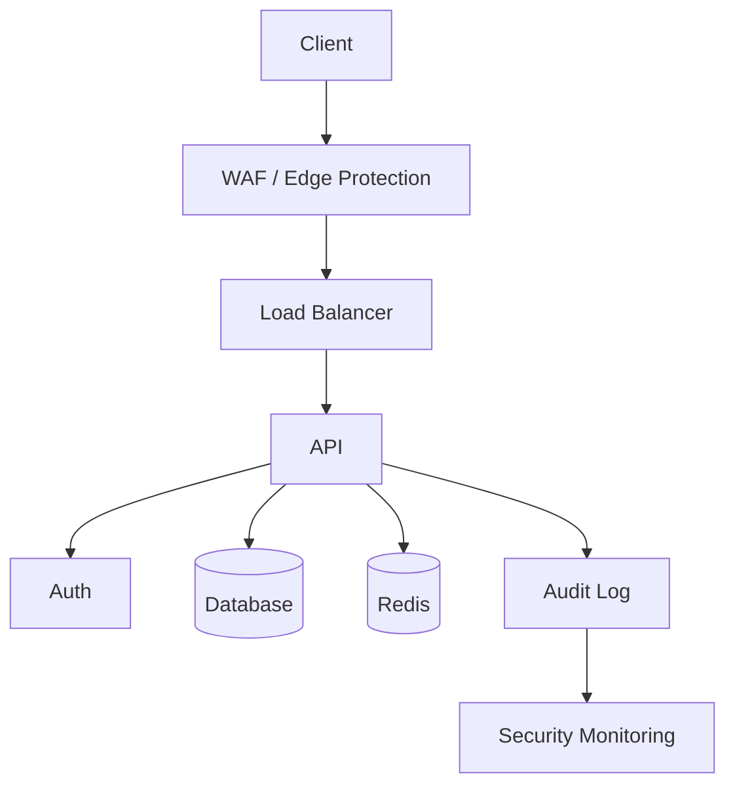

next

# PHASE 09 — SECURITY CONTROL LAYER

Bu phase-də əvvəlki qərarımızı bir az daha dəqiqləşdirək:

**Security adi `skill` deyil.**
Security bütün SDLC boyunca işləyən **cross-cutting control layer** olacaq.

Yəni:

```text
                    SECURITY
                       │
       ┌───────────────┼────────────────┐
       ↓               ↓                ↓
      BE              FE               MD
       │               │                │
       ├───────────────┼────────────────┤
       ↓               ↓                ↓
      API             DB               DO
                       │
                       ↓
                      QA
                       │
                       ↓
                      VR
```

Bu o deməkdir ki, məsələn BE işi bitirib:

> "Backend hazırdır, növbəti."

deyə bilməyəcək.

Agent əvvəlcə həmin dəyişiklik üçün **Security applicability** yoxlamalıdır.

---

# 09.1 — Security-nin əsas rolu

Security layer bu suallara cavab verməlidir:

```text
Bu dəyişiklik təhlükəsizdirmi?
Nə risk yaradır?
Hansı security control-lar tətbiq olunmalıdır?
Hansı testlər edilməlidir?
Pentest lazımdır?
Threat model dəyişib?
Secret riski varmı?
Dependency riski varmı?
Infrastructure riski varmı?
Production-a çıxmaq olarmı?
```

---

# 09.2 — Security root-da ayrıca sistemdir

```text
.sdd/
└── security/
    ├── SECURITY.sdd
    ├── controls.sdd
    ├── gates.sdd
    ├── threats.sdd
    ├── scanners.sdd
    └── INDEX.sdd
```

Burada diqqət:

`security/` bütün project üçün **global security policy** saxlayır.

Project-specific security isə:

```text
.sdd/project/payments/security/
```

altında ola bilər.

---

# 09.3 — SECURITY.sdd

Bu əsas entry point olacaq:

```text
Spec: Security

Version:
  1

Purpose:
  Project daxilində bütün dəyişikliklər üçün
  security control və verification qaydalarını müəyyən edir.

Mandatory:
  SecretScan
  DependencyScan
  SAST

Conditional:
  DAST
  ThreatModel
  Pentest
  ContainerScan
  LoadTest
  DDoSReview

Gate:
  Critical = 0
  High = 0

Final:
  SC > VR
```

Burada `SC` = Security Control/Review.

---

# 09.4 — Security chain

Security-ni bir dənə mərhələ kimi yox, daxili flow kimi düşünək:

```text
CHANGE
  ↓
THREAT
  ↓
SCAN
  ↓
TEST
  ↓
REVIEW
  ↓
REMEDIATE
  ↓
VERIFY
```

Məsələn payment refund:

```text
Task
 ↓
BE
 ↓
QA
 ↓
SC
    ├── SAST
    ├── dependency
    ├── auth
    ├── idempotency
    ├── race condition
    └── payment abuse
 ↓
VR
```

---

# 09.5 — Security hər task üçün eyni deyil

Bu çox vacibdir.

AI:

```text
Task → Security
```

deyib həmişə 20 test işlətməməlidir.

Əvvəl:

```text
Risk Analysis
```

etməlidir.

Məsələn:

### UI text dəyişdi

```text
Risk:
  R0
```

Security:

```text
SecretScan
DependencyScan
```

kifayət edə bilər.

### Payment logic dəyişdi

```text
Risk:
  R4
```

onda:

```text
SAST
Dependency
Threat Model
Security Tests
Concurrency
Auth
Audit
Pentest consideration
```

aktivləşir.

---

# 09.6 — Risk matrix

```text
R0 → minimal
R1 → low
R2 → moderate
R3 → high
R4 → critical
R5 → systemic
```

Control matrix:

```text
Risk    Controls
────────────────────────────
R0      baseline
R1      baseline + QA
R2      + security tests
R3      + threat review
R4      + pentest/security gate
R5      + architecture/security review
```

Bu yalnız nümunədir; real project level bunu override edə bilər.

---

# 09.7 — Security applicability

AI əvvəlcə:

```text
SECURITY APPLICABILITY
```

hesablamalıdır.

Məsələn:

```text
Task:
  #PAY-042

Affected:
  BE
  DB
  API

Data:
  financial

Auth:
  yes

External:
  payment gateway

Risk:
  R4
```

Nəticə:

```text
Required:
  SAST
  DAST
  Dependency
  ThreatModel
  SecurityTest
  PentestReview
  AuditReview
```

---

# 09.8 — Security controls

`controls.sdd`:

```text
Spec: SecurityControls

Controls:

  SEC.SECRET:
    detect exposed secrets

  SEC.DEP:
    detect vulnerable dependencies

  SEC.SAST:
    static code security analysis

  SEC.DAST:
    runtime application security testing

  SEC.AUTH:
    authentication/authorization validation

  SEC.INPUT:
    input validation

  SEC.RATE:
    rate limiting

  SEC.AUDIT:
    security-sensitive audit logging

  SEC.THREAT:
    threat model review

  SEC.PENTEST:
    penetration testing

  SEC.CONTAINER:
    container/image security

  SEC.SUPPLY:
    software supply-chain security
```

---

# 09.9 — Security skill-ləri

Bunlar ayrıca skill ola bilər:

```text
.sdd/skills/
└── security/
    ├── auth.sdd
    ├── authorization.sdd
    ├── input-validation.sdd
    ├── injection.sdd
    ├── secrets.sdd
    ├── dependencies.sdd
    ├── api-security.sdd
    ├── payment-security.sdd
    ├── container-security.sdd
    ├── supply-chain.sdd
    └── threat-modeling.sdd
```

Beləliklə:

**Security layer ≠ Security skills**

Layer qərar verir:

> hansı control lazımdır?

Skill deyir:

> həmin control necə həyata keçirilir?

---

# 09.10 — Security Gate

`gates.sdd`:

```text
Spec: SecurityGates

Gate: SC

Must:
  Critical findings = 0
  High findings = 0
  Required controls = passed

May:
  Medium findings with accepted risk

Block:
  Critical
  unresolved High
  secret exposure
  authentication bypass
  payment double execution
```

---

# 09.11 — Finding modeli

Security scan nəticəsi ayrıca artifact ola bilər:

```text
.sdd/security/findings/
```

Məsələn:

```text
SEC-004.sdd
```

```text
Finding: #SEC-004

Title:
  Refund double execution

Severity:
  Critical

Type:
  BusinessLogic

Affected:
  @payments/refund

DetectedBy:
  security-test

Status:
  ~

Task:
  #PAY-042

Evidence:
  test/refund_concurrency

Blocks:
  release
```

Bu bizim əvvəlki:

```text
finding: #SEC-004
```

modelini tamamlamağa başlayır.

---

# 09.12 — Finding → Task

Security finding özü task deyil.

```text
Finding
   ↓
Assessment
   ↓
Task
```

Məsələn:

```text
SEC-004
   ↓
PAY-042
```

Task həll edilir.

Sonra:

```text
PAY-042
   ↓
Security verification
   ↓
SEC-004 = +
```

---

# 09.13 — Security finding lifecycle

```text
~
 ↓
triaged
 ↓
task-created
 ↓
fixing
 ↓
verification
 ↓
+
```

və ya:

```text
~
 ↓
false-positive
 ↓
x
```

və ya:

```text
~
 ↓
accepted-risk
 ↓
@
```

---

# 09.14 — Accepted Risk

Hər finding kodla düzəldilməyə bilər.

Məsələn:

```text
Severity:
  Medium

Decision:
  Accept risk
```

Bu halda:

```text
SEC-012
Status:
  @

Decision:
  DEC-021
```

olmalıdır.

Yəni Security exception **səssiz şəkildə bağlanmır**.

---

# 09.15 — Security exception

Ayrıca:

```text
Exception:
  EXC-003

Finding:
  SEC-012

Reason:
  Temporary compatibility requirement

Owner:
  Security

Expires:
  2026-10-01

Review:
  required
```

Beləliklə:

> "Bunu bilirdik, amma keçdik."

tipli təhlükəli qərarlar sistemdə görünən olur.

---

# 09.16 — Security + BDD

BDD yalnız business acceptance üçün deyil.

Security BDD də ola bilər:

```text
Feature:
  Refund idempotency

Scenario:
  Duplicate refund request

Given:
  refund transaction exists

When:
  same request arrives twice

Then:
  only one refund is executed
```

Beləliklə:

```text
Business requirement
        ↓
BDD
        ↓
Code
        ↓
Security test
```

---

# 09.17 — Security + QA

QA:

```text
Does it work?
```

Security:

```text
Can it be abused?
```

Verification:

```text
Does evidence prove both?
```

Ona görə:

```text
QA PASS
```

heç vaxt avtomatik:

```text
SECURITY PASS
```

demək deyil.

---

# 09.18 — Security + DO

Infrastructure da security scope-dadır:

```text
Docker
Kubernetes
VPS
AWS
GCP
Azure
Nginx
TLS
Secrets
IAM
Network
Firewall
Container
Registry
CI/CD
```

Məsələn Docker image:

```text
build
 ↓
SBOM
 ↓
image scan
 ↓
dependency scan
 ↓
deploy
```

olmalıdır.

---

# 09.19 — Security + CI/CD

Pipeline:

```text
CODE
 ↓
UNIT
 ↓
BDD
 ↓
SAST
 ↓
DEPENDENCY
 ↓
BUILD
 ↓
CONTAINER SCAN
 ↓
DAST
 ↓
QA
 ↓
SC
 ↓
VR
 ↓
DEPLOY
```

Amma bu ardıcıllıq **hər projectdə eyni hard-code edilməyəcək**.

Project level:

```text
L0-L5
```

və risk chain-i müəyyən edəcək.

---

# 09.20 — DDoS

DDoS ayrıca task deyil.

Bu:

```text
@security/ddos
```

control/skill olacaq.

AI architecture görə bilər:

```text
Public API
 ↓
Load Balancer
 ↓
API
```

və soruşmalıdır:

```text
Rate limit?
WAF?
CDN?
Bot protection?
Connection limits?
Autoscaling?
Caching?
Origin protection?
```

Amma L1 projectə avtomatik AWS WAF + Kubernetes + 15 servis yığmaq olmaz.

**Context-driven security.**

---

# 09.21 — Pentest

Pentest də hər commit-də işə düşməməlidir.

Trigger:

```text
Trigger:
  public auth change
  payment flow change
  privilege change
  major API exposure
  release milestone
```

olduqda:

```text
PENTEST_REQUIRED
```

çıxa bilər.

---

# 09.22 — Security review levels

```text
L0:
  baseline

L1:
  baseline + automated scans

L2:
  scans + security tests

L3:
  threat model + DAST

L4:
  pentest + architecture security review

L5:
  continuous security + external assessment
```

Project level:

```text
SecurityLevel:
  L2
```

deyirsə, AI həmin level-in controls-larını seçir.

---

# 09.23 — Security architecture

Human doc-da diagram da olmalıdır.

Məsələn:



Bu diagram:

```text
docs/security/
```

altında human-readable ola bilər.

`.sdd` isə:

```text
SecurityGraph:
  Client
  WAF
  LB
  API
  Auth
  DB
  Redis
  Audit
  SIEM
```

kimi qısa representation saxlayır.

---

# 09.24 — Security verification

Bizim final flow:

```text
CHANGE
 ↓
IMPLEMENT
 ↓
QA
 ↓
SC
 ↓
REMEDIATION if needed
 ↓
SC
 ↓
VR
```

Əgər security fail:

```text
SC !
 ↓
Finding
 ↓
Task
 ↓
Owner
 ↓
Fix
 ↓
QA
 ↓
SC
```

Beləliklə chain qırılmır.

---

# 09.25 — Security loop

Ən vacib qayda:

```text
BE → FE → MD → QA → SC → VR
```

sadəcə düz xətt deyil.

Security problemi çıxsa:

```text
SC
 ↓
affected stage
 ↓
fix
 ↓
resume chain
```

Məsələn:

```text
FE
 ↓
MD
 ↓
QA
 ↓
SC !
 ↓
FE
 ↓
MD
 ↓
QA
 ↓
SC +
 ↓
VR
```

---

# 09.26 — Security final gate

Riskli task üçün:

```text
DONE
```

yalnız:

```text
Acceptance +
QA +
SC +
VR +
```

olanda mümkündür.

Əgər:

```text
SC !
```

varsa:

```text
DONE = impossible
```

---

# PHASE 09 yekunu

İndi security artıq:

```text
Skill
```

səviyyəsindən çıxıb:

```text
Cross-cutting Control System
```

səviyyəsinə keçdi.

Tam model:

```text
                    PROJECT
                       │
                    GRAPH
                       │
                     TASK
                       │
                    CHAIN
                       │
              ┌────────┴────────┐
              ↓                 ↓
             STAGE           SECURITY
              │                 │
            SKILL           CONTROLS
              │                 │
              └────────┬────────┘
                       ↓
                      QA
                       ↓
                      SC
                       ↓
                      VR
```

### Növbəti PHASE 10 — `GRAPH / PROJECT MAP`

Burada ən kritik hissələrdən birinə keçirik:

```text
.sdd/project/
```

içində **BE → FE → MD → DB → API → QA → DO → SC → VR əlaqələrini** necə saxlayacağımızı quracağıq.

Əsas məqsəd:

> AI `#PAY-042` görəndə kodu kor-koranə axtarmasın; əvvəl graph-dan **hansı modul → hansı backend → hansı API → hansı frontend → hansı mobile → hansı DB → hansı test → hansı infrastructure** əlaqələrinin mövcud olduğunu çıxarsın.

Və burada sənin əvvəl dediyin **`flows.sdd` məsələsini də dəqiqləşdirəcəyik**: onu sadəcə “architecture diagram” kimi yox, **project dependency/relationship graph-ının bir hissəsi** kimi necə düzgün modelləşdirmək lazım olduğunu müəyyən edəcəyik.
