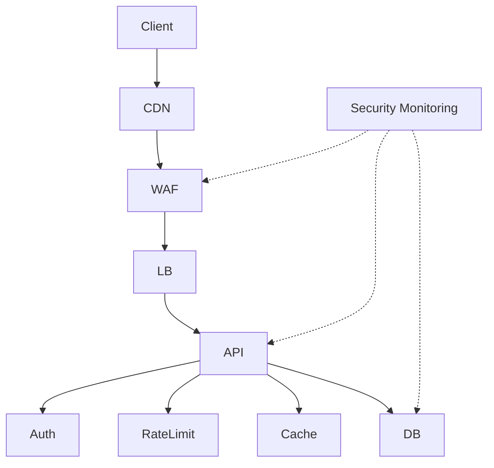

next
## PHASE 14 — SECURITY ENGINE

İndi Task modelini bağladıq. Növbəti düzgün addım **Security Engine**-dir. Çünki sənin sistemində security sonradan əlavə olunan bir test deyil; layihənin arxitekturasından başlayıb production-a qədər gedən ayrıca lifecycle olmalıdır.

### 14.1. Security də project-owned deyil

Burada əvvəlki qaydamızı qoruyuruq:

```text
.sdd/
├── security/
├── testing/
├── workflow/
├── skills/
└── project/
    └── ...
```

`security/` root-based olur, çünki:

> Security qaydaları, standartları, gates və skill-lər bütün layihələr üçün reusable knowledge-dur.

Project isə yalnız öz security vəziyyətini saxlayır:

```text
.sdd/project/
├── security/
│   ├── INDEX.sdd
│   ├── threats/
│   ├── findings/
│   └── exceptions/
└── tasks/
```

---

# 14.2. Security lifecycle

Security flow-u standartlaşdırırıq:

```text
AR
 ↓
THREAT
 ↓
DESIGN
 ↓
CODE
 ↓
SAST
 ↓
DEPENDENCY
 ↓
SECRETS
 ↓
DAST
 ↓
API SECURITY
 ↓
CONTAINER
 ↓
LOAD/ABUSE
 ↓
PENTEST
 ↓
PRODUCTION
 ↓
MONITORING
 ↓
INCIDENT
```

Amma **hər project bütün bunlardan keçməli deyil**.

Bu çox vacibdir.

Kiçik landing page üçün:

```text
DESIGN
→ CODE
→ SAST
→ DEPENDENCY
→ QA
→ VERIFY
```

kifayət edə bilər.

Payment platform üçün:

```text
THREAT
→ SAST
→ DAST
→ API
→ DATA
→ CONTAINER
→ PENTEST
→ LOAD
→ ABUSE
→ PRODUCTION
```

ola bilər.

Bunu `Risk + Impact + Architecture + Project level` müəyyən edir.

---

# 14.3. Security level

Root:

```text
.sdd/security/levels.sdd
```

məsələn:

```text
L0:
  Prototype

L1:
  Internal

L2:
  Standard production

L3:
  High-risk production

L4:
  Critical system

L5:
  Regulated / mission-critical
```

AI project-i analiz edib level seçir.

Məsələn:

```text
Payment
Authentication
Personal data
Public API
Internet exposed
Financial transactions
```

tapırsa:

```text
SecurityLevel:
  L4
```

seçə bilər.

---

# 14.4. Security level hər şeyi avtomatik seçir

Bu sənin əvvəl dediyin sistemin əsas gücüdür.

Məsələn:

```text
Project:
  small internal admin panel
```

AI:

```text
L1
```

və ağır pentest chain yaratmır.

Amma:

```text
Project:
  payment platform
  public API
  financial transactions
```

AI:

```text
L4
```

və əlavə edir:

```text
Threat Modeling
SAST
DAST
Dependency Scan
Secret Scan
API Security
Container Security
Pentest
Load Test
Abuse Test
DDoS Protection
Incident Response
```

---

# 14.5. Security gates

Root:

```text
.sdd/security/gates/
```

Burada hər gate ayrıca specification olur:

```text
.sdd/security/gates/SAST.sdd
.sdd/security/gates/DAST.sdd
.sdd/security/gates/PENTEST.sdd
.sdd/security/gates/DEPENDENCY.sdd
.sdd/security/gates/SECRETS.sdd
.sdd/security/gates/API.sdd
.sdd/security/gates/CONTAINER.sdd
.sdd/security/gates/ABUSE.sdd
```

Bunlar **işin necə yoxlanacağını** müəyyən edir.

---

# 14.6. Finding

Security problemi ayrıca entity-dir.

Project:

```text
.sdd/project/security/findings/
```

Məsələn:

```text
SEC-004.sdd
```

```text
Finding: SEC-004

Type:
  IDOR

Severity:
  HIGH

Component:
  BE/payments/refund

Status:
  OPEN

RelatedTask:
  TASK-1023

Skill:
  @api-authz

Gate:
  API
```

Bu artıq task deyil.

Bu **finding**-dir.

---

# 14.7. Finding → Task

Security engine tapır:

```text
SEC-004
```

və task yaradır:

```text
TASK-1023
```

Task:

```text
Origin:
  finding: SEC-004
```

Beləliklə:

```text
SECURITY FINDING
       ↓
TASK
       ↓
CODE
       ↓
QA
       ↓
SECURITY
       ↓
VERIFY
```

zənciri yaranır.

---

# 14.8. Security finding → Human doc

Eyni prinsip:

```text
.sdd/project/security/findings/SEC-004.sdd
```

↓

```text
docs/security/findings/SEC-004.md
```

Beləliklə human:

> Bu problem nədir?

AI:

> Bu problem hansı rule ilə bağlıdır?

sualını cavablandıra bilir.

---

# 14.9. Severity

Standart:

```text
INFO
LOW
MEDIUM
HIGH
CRITICAL
```

Amma severity təkbaşına qərar vermir.

AI həmçinin:

```text
Severity
+
Exploitability
+
Business Impact
+
Exposure
+
Data Sensitivity
```

baxmalıdır.

Məsələn:

```text
LOW vulnerability
+
Internet exposed
+
payment endpoint
```

real olaraq daha yüksək prioritet ala bilər.

---

# 14.10. Security risk score

Root skill bunu hesablaya bilər:

```text
Risk =
  Severity
  × Exposure
  × Impact
  × Exploitability
```

Burada məqsəd riyazi “mükəmməl” score yaratmaq deyil.

Məqsəd agentə:

> hansı security işini əvvəl görməliyəm?

sualını cavablandırmaqdır.

---

# 14.11. Security exception

Bəzən vulnerability var, amma dərhal fix edilə bilmir.

Məsələn:

```text
SEC-021
```

və:

```text
Status:
  ACCEPTED_RISK
```

olur.

Amma AI bunu:

```text
DONE
```

hesab etmir.

Bu çox vacibdir.

```text
OPEN
FIXED
VERIFIED
ACCEPTED_RISK
FALSE_POSITIVE
MITIGATED
```

ayrı state-lərdir.

---

# 14.12. Risk acceptance human qərarıdır

AI:

```text
Recommendation:
  Accept risk
```

deyə bilər.

Amma:

```text
ApprovedBy:
  HUMAN
```

olmadan critical security exception bağlanmamalıdır.

---

# 14.13. DDoS məsələsi

DDoS-u sadəcə:

```text
@ddos
```

skill etmək kifayət deyil.

AI architecture-a baxmalıdır:

```text
Internet
 ↓
CDN/WAF
 ↓
Load Balancer
 ↓
API
 ↓
Rate Limit
 ↓
Cache
 ↓
Backend
```

və soruşmalıdır:

* hansı layer request-i ilk qəbul edir?
* WAF varmı?
* rate limiting haradadır?
* connection exhaustion mümkündürmü?
* expensive endpoint varmı?
* cache amplification mümkündürmü?
* DB connection pool necə qorunur?
* autoscaling varmı?
* upstream provider hansı qorumanı verir?

Sonra project architecture-a uyğun security plan çıxarır.

---

# 14.14. Security yalnız BE deyil

Bu da əvvəlki düzəlişimizə uyğun olmalıdır.

Security scope:

```text
BE
FE
MD
DB
INFRA
CI/CD
CLOUD
CONTAINER
NETWORK
DEPENDENCIES
SECRETS
DATA
```

Məsələn mobile app varsa:

```text
.sdd/security/mobile/
```

skill-ləri tətbiq olunur.

FE varsa:

```text
XSS
CSRF
CSP
Dependency
Supply Chain
Auth
Token Storage
```

MD varsa:

```text
Secure Storage
Certificate Pinning
Deep Link
WebView
Authentication
API Token
```

---

# 14.15. Security architecture diagram

Human docs-da hər security level üçün diagram olmalıdır.

Məsələn:



AI isə `.sdd` içində bunun qısa əlaqələrini saxlayır:

```text
WAF > LB > API > AUTH > DB
MON > WAF
MON > API
MON > DB
```

Human üçün diagram.

AI üçün compact graph.

Bu bizim əvvəlki **“insan çox anlasın, AI az token xərcləsin”** prinsipinə tam uyğundur.

---

# 14.16. Security gate task-a necə qoşulur?

Task:

```text
TASK-1023
```

deyir:

```text
Risk:
  HIGH

Impact:
  DB
  BE
  SECURITY
```

Security engine root rules-a baxır:

```text
HIGH + PAYMENT
```

və task üçün avtomatik:

```text
BDD
DB
BE
QA
SAST
DAST
API
SECURITY
VERIFY
```

chain yarada bilər.

Taskın özündə bunların hamısını yazmaq lazım deyil.

---

# 14.17. Əsas prinsip

Beləliklə:

```text
Task
```

deyir:

> Mən nə etməliyəm?

```text
Skill
```

deyir:

> Bunu necə etməliyəm?

```text
Workflow
```

deyir:

> Hansı ardıcıllıqla etməliyəm?

```text
Security
```

deyir:

> Hansı risklərə və security gates-ə tabeyəm?

```text
Project
```

deyir:

> Bunların hamısı mənim konkret layihəmdə haradadır?

```text
Docs
```

deyir:

> İnsan bunu necə başa düşməlidir?

Bu separation artıq bizim sistemin əsas fəlsəfəsinə çevrilir.

---

## PHASE 14 nəticəsi

Hazırda `.sdd` modelimiz:

```text
.sdd/
│
├── INDEX.sdd
│
├── skills/              # HOW
├── workflow/            # WHEN / ORDER
├── testing/             # VERIFY
├── security/            # RISK / SECURITY
├── architecture/        # DESIGN RULES
├── standards/           # GLOBAL RULES
│
└── project/             # PROJECT STATE
    ├── INDEX.sdd
    ├── PROJECT.sdd
    ├── tasks/
    ├── security/
    ├── decisions/
    ├── architecture/
    ├── domains/
    └── flows/
```

və human tərəf:

```text
docs/
├── tasks/
├── business/
├── developer/
├── qa/
├── security/
├── support/
└── infrastructure/
```

**Növbəti məntiqli phase: PHASE 15 — TESTING ENGINE.**

Orada BDD → Unit → Integration → API → E2E → UI → Mobile → Load → Performance → Security testlərini **bir-birindən ayırıb**, hansı project level-də hansının avtomatik seçiləcəyini və test failure olduqda Task Graph-a necə geri qayıdacağını qurmaq lazımdır.
