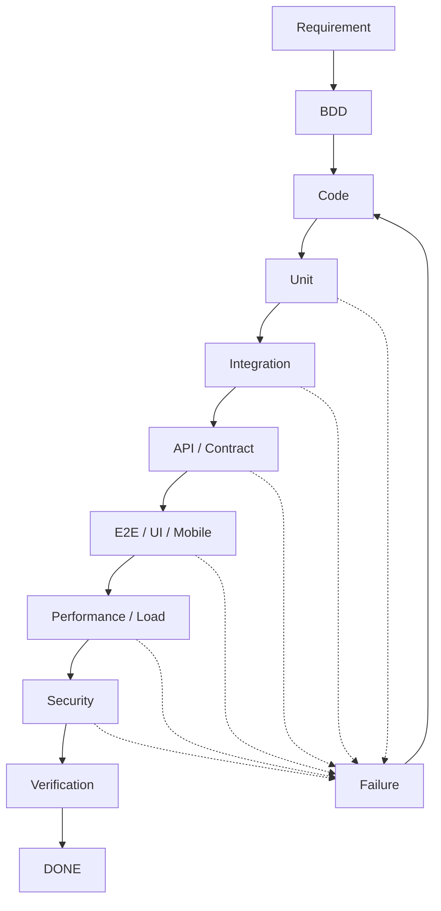

next
# PHASE 15 — TESTING ENGINE

Burada məqsəd sadəcə `testing/` qovluğu yaratmaq deyil. **Test sistemi Task → Code → Test → Failure → Fix → Retest zəncirinin avtomatik idarə olunmasını** təmin etməlidir.

Sənin əvvəl dediyin SDLC/STLC modelinə əsasən bunu bütün stack üçün qururuq: **BE, FE, MD, DB, Infrastructure və Security**.

---

## 15.1. Testing root-based olacaq

```text
.sdd/
├── testing/
│   ├── INDEX.sdd
│   ├── levels.sdd
│   ├── types.sdd
│   ├── gates.sdd
│   ├── bdd.sdd
│   ├── unit.sdd
│   ├── integration.sdd
│   ├── api.sdd
│   ├── e2e.sdd
│   ├── ui.sdd
│   ├── mobile.sdd
│   ├── performance.sdd
│   ├── load.sdd
│   └── contract.sdd
```

Bunlar **testin necə aparılacağını** izah edir.

Project isə test nəticələrini və project-specific məlumatları saxlayır:

```text
.sdd/project/
└── testing/
    ├── INDEX.sdd
    ├── coverage.sdd
    ├── runs/
    ├── failures/
    └── exceptions/
```

---

# 15.2. Test source code ilə qarışmamalıdır

Sənin əvvəlki prinsipinə uyğun:

```text
BE/internal/payment/refund.go
```

yanında:

```text
refund.md
refund.sdd
```

yaratmırıq.

Kod öz yerində qalır.

Test də layihənin normal test strukturunda qalır:

```text
BE/internal/payment/refund.go
BE/internal/payment/refund_test.go
```

və ya:

```text
FE/src/components/Refund.tsx
FE/tests/refund.spec.ts
```

`.sdd` isə testin **metadata və workflow məlumatını** saxlayır.

Bu, project-i təmiz saxlayır.

---

# 15.3. Test Engine nəyi müəyyən edir?

AI taskı oxuyur:

```text
TASK-1023
Impact:
  DB
  BE

Risk:
  HIGH
```

Sonra:

```text
testing/levels.sdd
testing/types.sdd
workflow/
security/
skills/
```

üzərindən qərar verir.

Məsələn:

```text
TASK-1023
    ↓
BDD
    ↓
Unit
    ↓
Integration
    ↓
API
    ↓
Security
    ↓
Regression
    ↓
Verify
```

Amma başqa task üçün:

```text
TASK-1000
FE
LOW
```

yalnız:

```text
Unit
↓
Component
↓
E2E
```

ola bilər.

---

# 15.4. BDD birinci-class citizen olacaq

Sənin dediyin:

> Business mindset → əvvəl BDD → sonra Code

bunu workflow səviyyəsində standartlaşdırırıq.

```text
Requirement
    ↓
BDD
    ↓
Implementation
    ↓
Automated Tests
    ↓
UI/API/E2E
    ↓
Manual Verification
```

BDD task başlamadan əvvəl acceptance behaviour formalaşdırır.

Məsələn Human:

```text
Given customer has sufficient balance
When customer requests refund
Then refund is created once
```

AI isə bunu compact şəkildə görə bilər:

```text
BDD:
  balance>=refund
  refund(req)=once
```

---

# 15.5. BDD və test eyni şey deyil

Bu fərqi sistemdə açıq saxlamalıyıq.

### BDD

> Sistem necə davranmalıdır?

### Unit

> Kiçik kod komponenti düzgün işləyir?

### Integration

> Komponentlər birlikdə düzgün işləyir?

### API

> API contract və behaviour düzgündür?

### E2E

> Real user/business flow işləyir?

### UI

> Interface düzgün davranır?

### Load

> Sistem yük altında işləyir?

### Security

> Sistem hücuma qarşı təhlükəsizdir?

---

# 15.6. Test pyramid

Root standard:

```text
                 E2E
                /   \
              API   UI
             /       \
       Integration   Contract
          /             \
        Unit           Component
```

Amma biz bunu rigid qayda etməyəcəyik.

AI project-ə görə dəyişə bilər.

Məsələn:

```text
Microservice:
Unit > Integration > Contract > API
```

Frontend:

```text
Unit > Component > E2E
```

Mobile:

```text
Unit > Integration > UI > E2E
```

---

# 15.7. Test Level

`testing/levels.sdd`:

```text
L0:
  smoke

L1:
  unit
  component

L2:
  integration
  api
  contract

L3:
  e2e
  ui
  mobile

L4:
  load
  performance
  resilience

L5:
  security
  pentest
  abuse
  disaster
```

Amma burada da bir düzəliş:

**L0-L5 universal test severity deyil.**

Project level və test depth ayrı anlayışlardır.

Məsələn:

```text
ProjectLevel: L3
SecurityLevel: L4
```

ola bilər.

Bu iki şeyi qarışdırmırıq.

---

# 15.8. Test Gate

Hər task bütün testləri keçmədən `DONE` olmamalıdır.

Məsələn:

```text
TASK-1023
```

üçün:

```text
BDD       PASS
UNIT      PASS
INTEGRATION PASS
API       PASS
SECURITY  PASS
VERIFY    PASS
```

olmalıdır.

Əgər:

```text
API FAIL
```

olarsa:

```text
TASK-1023
State:
  BLOCKED
```

olur.

---

# 15.9. Failure Task Graph-a qayıdır

Bu çox vacibdir.

```text
TASK-1023
    ↓
TEST
    ↓
FAIL
    ↓
FAILURE-004
    ↓
ROOT CAUSE
    ↓
FIX TASK
```

Məsələn:

```text
FAIL-004
Test:
  refund_concurrent_request

Result:
  duplicate refund

Origin:
  TASK-1023
```

Sonra AI qərar verir:

```text
Existing task?
```

Əgər bug həmin taskın daxilindədirsə:

```text
TASK-1023 → REWORK
```

Əgər ayrıca problem çıxıbsa:

```text
TASK-1042
Origin:
  FAIL-004
```

yaradır.

---

# 15.10. Failure ayrıca entity olmalıdır

Project:

```text
.sdd/project/testing/failures/
```

Məsələn:

```text
FAIL-004.sdd
```

Human:

```text
docs/qa/failures/FAIL-004.md
```

Eyni ID principle.

---

# 15.11. Test result ayrıca saxlanmalıdır

```text
.sdd/project/testing/runs/
```

Məsələn:

```text
RUN-20260822-001.sdd
```

```text
Run:
  RUN-20260822-001

Task:
  TASK-1023

Commit:
  abc123

Suite:
  API

Result:
  FAIL

Failures:
  FAIL-004
```

Bu artıq runtime/history-dir.

Task faylını hər test run-da dəyişdirməyə ehtiyac yoxdur.

---

# 15.12. Token economy

Burada vacib optimizasiya var.

AI hər dəfə:

```text
RUN-20260822-001
```

kimi bütün nəticələri oxumamalıdır.

`INDEX.sdd` yalnız:

```text
TASK-1023:
  test: FAIL
  failure: FAIL-004
```

deyə bilər.

AI yalnız lazım olanda:

```text
FAIL-004.sdd
```

oxuyur.

Bu **progressive disclosure** olacaq.

---

# 15.13. Test statusları

Standart:

```text
PENDING
RUNNING
PASS
FAIL
BLOCKED
SKIPPED
FLAKY
WAIVED
```

`WAIVED` isə yalnız müəyyən approval qaydasına uyğun bağlana bilər.

---

# 15.14. Flaky test ayrıca idarə olunmalıdır

Çox vacibdir.

Test:

```text
PASS
FAIL
PASS
FAIL
```

olursa bunu sadəcə `FAIL` kimi qəbul etmək düzgün deyil.

AI:

```text
FLAKY
```

işarələyir.

Sonra:

```text
FLAKY-007
```

yarana bilər.

Bu artıq ayrıca task-a çevrilə bilər:

```text
TASK-1051
Fix flaky payment integration test
```

---

# 15.15. Coverage da yalnız faiz deyil

AI:

```text
Coverage:
  87%
```

görüb “yaxşıdır” deməməlidir.

Daha düzgün:

```text
Coverage
+
Critical path coverage
+
Risk coverage
+
Mutation / behavioural confidence
```

Məsələn:

```text
Overall: 92%

Payment:
  98%

Auth:
  95%

Refund:
  61%  ← HIGH RISK
```

AI `92%`-ə aldanmamalıdır.

---

# 15.16. Test Impact Analysis

Bu sistemə çox güclü funksiya əlavə edək:

> Kodun hansı hissəsi dəyişibsə, yalnız ona bağlı testləri seç.

Məsələn:

```text
BE/internal/payment/refund
```

dəyişib.

AI graph-dan tapır:

```text
refund
 ↓
refund API
 ↓
payment service
 ↓
transaction
```

və uyğun testləri seçir:

```text
refund unit
refund integration
refund API
payment regression
security idempotency
```

Bütün 20.000 testin hamısını hər dəfə işə salmaq məcburi deyil.

Bu həm **vaxt**, həm **CI cost**, həm **token** qənaətidir.

---

# 15.17. Full regression nə vaxt?

Root workflow bunu müəyyən edir:

```text
PR:
  impacted tests

Merge:
  regression

Release:
  full regression

Critical release:
  regression + security + performance
```

Bu artıq çox daha real CI/CD modelidir.

---

# 15.18. Stack-aware testing

Sənin dediyin bütün texnologiyalar nəzərə alınır.

### BE

```text
Go
Laravel
Node
...
```

### FE

```text
React
Vue
Angular
TypeScript
```

### MD

```text
React Native
Flutter
```

### Test

```text
Playwright
Cypress
Jest
Vitest
Go test
PHPUnit
...
```

AI project-də hansı stack olduğunu `.sdd/project/PROJECT.sdd`-dən tapır və uyğun skill seçir.

---

# 15.19. Testing skill özü texnologiyaya bağlı deyil

Məsələn:

```text
@testing/unit
```

deyir:

> Unit test necə dizayn edilməlidir?

Sonra adapter:

```text
Go → testing
Laravel → PHPUnit
React → Vitest/Jest
Flutter → flutter_test
```

seçir.

Bu separation çox vacibdir:

```text
Testing principle
      ↓
Language/framework adapter
```

---

# 15.20. Human documentation

Testing docs:

```text
docs/qa/
├── INDEX.md
├── testing-strategy.md
├── test-pyramid.md
├── bdd.md
├── automation.md
├── regression.md
├── performance.md
├── failures/
└── runs/
```

Task docs isə yenə:

```text
docs/tasks/TASK-1023.md
```

qalır.

Test documentation task documentation-a qarışmır.

---

# 15.21. Diagram

Human üçün:



Bu diagramı daha sonra project architecture-dan avtomatik generate edə bilərik.

---

# 15.22. Ən vacib nəticə

Artıq Task Engine + Testing Engine birlikdə belə işləyir:

```text
TASK
 ↓
DEPENDENCY RESOLUTION
 ↓
BDD
 ↓
CODE
 ↓
UNIT
 ↓
INTEGRATION
 ↓
API / CONTRACT
 ↓
E2E / UI / MOBILE
 ↓
PERFORMANCE
 ↓
SECURITY
 ↓
VERIFY
 ↓
DONE
```

Problem çıxarsa:

```text
             ┌──────────────┐
             │    FAILURE   │
             └──────┬───────┘
                    ↓
              ROOT CAUSE
                    ↓
                 TASK
                    ↓
                  FIX
                    ↓
                 RETEST
```

Bu artıq sadəcə `.sdd` folder strukturu deyil.

**Bu, agentin SDLC/STLC execution modelinin nüvəsidir.**

---

## PHASE 15-dən sonra vəziyyət

```text
PHASE 13
Task Engine                 ✅

PHASE 14
Security Engine             ✅

PHASE 15
Testing Engine              ✅

NEXT
PHASE 16
Architecture & Decision Engine
```

Növbəti phase-də ən vacib məsələlərdən biri olacaq: **AI layihənin ölçüsünü, DAU/MAU, traffic, data, latency, availability, SPOF, team capacity və budget-i analiz edib “modular monolith kifayətdir, yoxsa microservice lazımdır?” qərarını necə verməlidir.**

Bu da sənin əvvəl dediyin **“kiçik layihəyə süni microservice/DDD qurmasın, böyük sistemə də sadə CRUD kimi yanaşmasın”** problemini həll edəcək.
