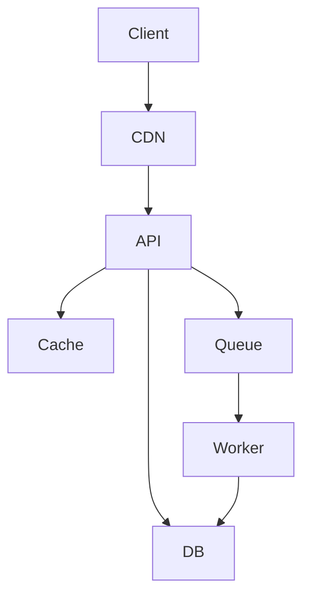

next
# PHASE 16 — ARCHITECTURE & DECISION ENGINE

Bu phase bizim sistemin ən vacib hissələrindən biridir. Çünki artıq agentdə:

* Task Engine
* Workflow Engine
* Testing Engine
* Security Engine
* Skills

var.

İndi agent bunların hamısından istifadə edib **“bu layihə necə qurulmalıdır?”** qərarını verməlidir.

Əsas prinsip:

> **AI texnologiya seçməməlidir; əvvəl problemi və məhdudiyyətləri analiz etməli, sonra uyğun arxitekturanı seçməlidir.**

---

## 16.1. Architecture root-based

```text
.sdd/
├── architecture/
│   ├── INDEX.sdd
│   ├── levels.sdd
│   ├── patterns.sdd
│   ├── scaling.sdd
│   ├── data.sdd
│   ├── availability.sdd
│   ├── observability.sdd
│   ├── networking.sdd
│   └── deployment.sdd
```

Buradakı fayllar:

> **Architecture knowledge**

olacaq.

Project-specific architecture isə:

```text
.sdd/project/architecture/
├── INDEX.sdd
├── system.sdd
├── components.sdd
├── data.sdd
├── infrastructure.sdd
└── diagrams/
```

---

# 16.2. Architecture Decision ≠ Skill

Bu fərqi çox dəqiq saxlamalıyıq.

### Skill

```text
@cache
@postgres
@redis
@microservice
@kubernetes
```

deyir:

> Bu texnologiya/prinsip necə istifadə olunur?

### Decision

deyir:

> Bu layihədə bunu niyə istifadə edirik?

Məsələn:

```text
Decision:
  Redis istifadə olunur.

Reason:
  Session və hot-read workload.

Rejected:
  PostgreSQL-only cache.

Tradeoff:
  Additional infrastructure.
```

---

# 16.3. Decision project-owned olacaq

```text
.sdd/project/decisions/
├── INDEX.sdd
├── DEC-001.sdd
├── DEC-002.sdd
└── DEC-003.sdd
```

Human:

```text
docs/decisions/
├── INDEX.md
├── DEC-001.md
├── DEC-002.md
└── DEC-003.md
```

Yenə 1:1 ID:

```text
DEC-003.sdd
      ↕
DEC-003.md
```

---

# 16.4. Architecture qərarı necə yaranır?

Agent:

```text
INPUT
 ↓
Requirements
 ↓
Business constraints
 ↓
Technical constraints
 ↓
Scale
 ↓
Risk
 ↓
Team capability
 ↓
Budget
 ↓
Security
 ↓
Availability
 ↓
Architecture options
 ↓
Trade-off analysis
 ↓
Decision
```

Yəni:

**“Go yaxşıdır, microservice yaxşıdır”** deyib birbaşa qərar vermir.

---

# 16.5. Project Level

Bunu əvvəlki level-lərlə qarışdırmamaq üçün:

```text
ProjectScale:
  L0
  L1
  L2
  L3
  L4
  L5
```

təklif edirəm.

### L0 — Prototype

```text
single app
local DB
minimal infrastructure
```

### L1 — Small

```text
modular application
single DB
basic cache
basic CI/CD
```

### L2 — Production

```text
modular architecture
HA considerations
observability
backup
security
```

### L3 — Large

```text
high traffic
scaling
distributed components
advanced caching
queues
```

### L4 — Critical

```text
HA
multi-zone
disaster recovery
strong security
failure isolation
```

### L5 — Massive / mission-critical

```text
multi-region
advanced resilience
strict compliance
extreme scale
```

---

# 16.6. Amma AI yalnız “DAU” ilə qərar verməməlidir

Məsələn:

```text
1M DAU
```

avtomatik:

```text
MICROSERVICE
```

demək deyil.

Agent bunlara baxmalıdır:

```text
DAU
MAU
RPS
Peak RPS
Concurrent users
Payload size
Data growth
Read/write ratio
Latency
Availability
SLA
RPO
RTO
Team size
Budget
Deployment model
Security
Compliance
```

---

# 16.7. Architecture Decision Matrix

AI variantları müqayisə edir.

Məsələn:

| Variant          | Complexity |     Scale |     Cost |   Team |    Ops |
| ---------------- | ---------: | --------: | -------: | -----: | -----: |
| Monolith         |        Low |    Medium |      Low |    Low |    Low |
| Modular Monolith |     Medium |      High |      Low | Medium |    Low |
| Microservices    |       High | Very High |     High |   High |   High |
| Serverless       |     Medium |      High | Variable | Medium | Medium |

Sonra:

```text
Requirement
+
Constraints
+
Trade-offs
=
Architecture
```

---

# 16.8. Sənin “Laravel vendor” nümunən

Məsələn mövcud:

```text
Laravel
vendor/
10 GB
```

var.

Agent bunu görür.

Amma dərhal:

> Microservice-ə bölək.

demir.

Əvvəl analiz:

```text
vendor:
  runtime dependency

question:
  Is vendor duplicated across services?
```

Sonra variantlar:

### A

```text
Each service builds own image
```

### B

```text
Shared base image
```

### C

```text
Build artifact
```

### D

```text
Extract actual bounded component
```

və qərar:

```text
Keep vendor inside service image
```

və ya:

```text
Shared immutable base image
```

kimi çıxır.

Çünki `vendor/`-u ayrıca runtime service kimi düşünmək səhv ola bilər.

---

# 16.9. Architecture pattern selection

Root:

```text
.sdd/architecture/patterns.sdd
```

AI burada pattern catalog oxuyur:

```text
Modular Monolith
Monolith
Microservices
Event Driven
CQRS
Event Sourcing
Serverless
Hexagonal
Clean Architecture
Layered
DDD
```

Amma bunların hamısı **default deyil**.

---

# 16.10. Pattern selection rules

Məsələn:

```text
IF
  small team
  low traffic
  low complexity

THEN
  prefer modular monolith
```

və:

```text
IF
  independent scaling
  independent deployment
  strong domain boundaries
  organizational ownership

THEN
  consider microservices
```

və:

```text
IF
  event-driven workload
  asynchronous processing
  eventual consistency acceptable

THEN
  consider event-driven architecture
```

---

# 16.11. “Overengineering Gate”

Bu sistemə xüsusi gate əlavə etməyi məsləhət görürəm:

```text
.sdd/architecture/gates/overengineering.sdd
```

AI architecture seçəndə soruşur:

```text
Does this architecture introduce complexity
without measurable business/technical benefit?
```

Əgər:

```text
2 developer
500 users
CRUD application
```

üçün:

```text
Kubernetes
Kafka
20 microservices
CQRS
Event Sourcing
Service Mesh
```

təklif edilirsə:

```text
OVERENGINEERING
```

flag-i çıxır.

---

# 16.12. Underengineering də olmalıdır

Əks halda digər tərəfdən problem yaranar.

```text
.sdd/architecture/gates/underengineering.sdd
```

Məsələn:

```text
500k RPS
99.99 SLA
financial transaction
```

üçün:

```text
single VPS
single DB
no backup
no HA
```

çıxırsa:

```text
UNDERENGINEERING
```

---

# 16.13. SPOF Engine

Bu ayrıca vacibdir.

Architecture:

```text
Client
 ↓
API
 ↓
DB
```

AI görür:

```text
DB = SPOF
```

Əgər requirement:

```text
99.99%
```

dirsə, qərar yenidən qiymətləndirilir.

Amma:

```text
internal tool
99.0%
```

üçün single DB qəbul edilə bilər.

Yəni:

> SPOF özü səhv deyil; **tələbə uyğun olmayan SPOF səhvdir.**

---

# 16.14. Availability

Architecture Engine:

```text
Availability:
  99%
  99.9%
  99.95%
  99.99%
  99.999%
```

və:

```text
RTO
RPO
```

ilə birlikdə baxır.

Məsələn:

```text
RTO:
  1 hour

RPO:
  15 min
```

onda backup/restore architecture buna uyğun seçilir.

---

# 16.15. Infrastructure decision

AI:

```text
VPS
AWS
Azure
GCP
On-prem
Hybrid
```

arasında seçim edə bilər.

Amma:

> AWS modern olduğu üçün AWS.

deməməlidir.

Baxmalıdır:

```text
Budget
Team
Region
Compliance
Existing infrastructure
Vendor lock-in
Scaling
Managed services
Operational burden
```

---

# 16.16. Deployment architecture

Project-specific:

```text
.sdd/project/infrastructure/
```

məsələn:

```text
deployment.sdd
network.sdd
compute.sdd
database.sdd
storage.sdd
observability.sdd
```

Human:

```text
docs/infrastructure/
├── deployment.md
├── network.md
├── database.md
├── storage.md
└── observability.md
```

---

# 16.17. Cloud adapter

Root:

```text
.sdd/architecture/providers/
├── vps.sdd
├── aws.sdd
├── azure.sdd
├── gcp.sdd
└── onprem.sdd
```

Agent qərar verir:

```text
Provider:
  AWS
```

onda AWS-specific skill və docs aktiv olur.

VPS seçilərsə:

```text
VPS skill
```

aktiv olur.

Beləliklə bütün cloud məlumatlarını hər project-ə yükləmirik.

Bu da token qənaətidir.

---

# 16.18. Architecture diagram generation

Project architecture-dan:

```text
.sdd/project/architecture/system.sdd
```

AI Human docs üçün Mermaid yarada bilər:



Amma `.sdd` özü:

```text
CLIENT>CDN>API
API>CACHE
API>DB
API>QUEUE
QUEUE>WORKER
WORKER>DB
```

kimi compact qala bilər.

---

# 16.19. Diagram relationship

Burada sənin əvvəlki istəyini də bağlayırıq.

Human diagram elementləri kodla əlaqələndirilə bilər:

```text
API
  code:
    BE/internal/api

RefundService
  code:
    BE/internal/payment/refund

DB
  code:
    PostgreSQL/payment
```

Beləliklə human diagram-a baxır:

```text
RefundService
```

və agentə deyir:

> Bu hansı kodla bağlıdır?

Agent:

```text
BE/internal/payment/refund
```

tapır.

Bu **architecture → code traceability**-dir.

---

# 16.20. Decision lifecycle

Decision:

```text
PROPOSED
 ↓
ANALYZED
 ↓
APPROVED
 ↓
ACTIVE
 ↓
SUPERSEDED
 ↓
RETIRED
```

Məsələn:

```text
DEC-003
```

əvvəl:

```text
Redis
```

sonra yeni decision:

```text
DEC-017
```

ilə:

```text
KeyDB
```

əvəzlənirsə:

```text
DEC-003:
  SUPERSEDED BY DEC-017
```

olur.

Köhnə qərarı silmirik.

Çünki **niyə bu sistem belə qurulub?** sualının cavabı gələcəkdə lazım olacaq.

---

# 16.21. Human decision document

```text
docs/decisions/DEC-017.md
```

formatı:

```markdown
# DEC-017 — Introduce Redis Cache

## Decision

Redis will be used for high-frequency read caching.

## Context

The PostgreSQL read workload increased significantly.

## Alternatives

### PostgreSQL only
Pros:
- Simple

Cons:
- Higher DB load

### Redis
Pros:
- Lower DB load
- Low latency

Cons:
- Additional infrastructure

### In-memory application cache
Pros:
- Very simple

Cons:
- Not shared across instances

## Why Redis

The application will run multiple instances,
therefore local memory is insufficient.

## Consequences

Positive:
- Lower DB load
- Better latency

Negative:
- Additional operational component
```

Bu artıq manager/developer/support üçün çox dəyərlidir.

---

# 16.22. Architecture Engine-in əsas qərarı

Agent sonda belə bir nəticə çıxarmalıdır:

```text
Project:
  Edunexus

Scale:
  L2

Architecture:
  Modular Monolith

Backend:
  Go

Database:
  PostgreSQL

Cache:
  Redis

Queue:
  Not required

Frontend:
  React

Mobile:
  React Native

Deployment:
  Docker + VPS

CI/CD:
  GitHub Actions

Observability:
  Logs + Metrics

Security:
  L3

HA:
  Basic

Reason:
  Current scale does not justify microservices.
```

Bu **final architecture instance** olur.

---

# 16.23. Ən vacib prinsip

Architecture Engine:

```text
Skills
+
Standards
+
Project input
+
Existing code
+
Constraints
+
Scale
+
Risk
+
Budget
```

→

```text
ARCHITECTURE INSTANCE
```

yaradır.

Yəni `.sdd/` sadəcə əvvəlcədən hazırlanmış architecture template deyil.

**AI onu layihəyə görə instantiate edir.**

Bu sənin bütün sistem ideyanın mərkəzidir.

---

## İndiki ümumi progress

```text
PHASE 13  Task Engine                 ✅
PHASE 14  Security Engine             ✅
PHASE 15  Testing Engine              ✅
PHASE 16  Architecture & Decisions    ✅
```

Növbəti:

### **PHASE 17 — STACK & TECHNOLOGY ENGINE**

Burada artıq ayrıca **BE / FE / MD / DB / DevOps / QA / Security** üçün technology selection modelini quracağıq.

Məsələn project input-da sadəcə:

```text
"web + mobile education platform"
```

yazılsa, agent:

```text
BE → Go
FE → React
MD → React Native
DB → PostgreSQL
Cache → Redis
Testing → Playwright + Go test
CI/CD → GitHub Actions
Runtime → Docker
```

kimi qərarı **skill-lər + architecture + project constraints** əsasında çıxarmalıdır — və `Go/React/React Native` kimi konkret seçimləri systemə kor-koranə hard-code etməməliyik.
