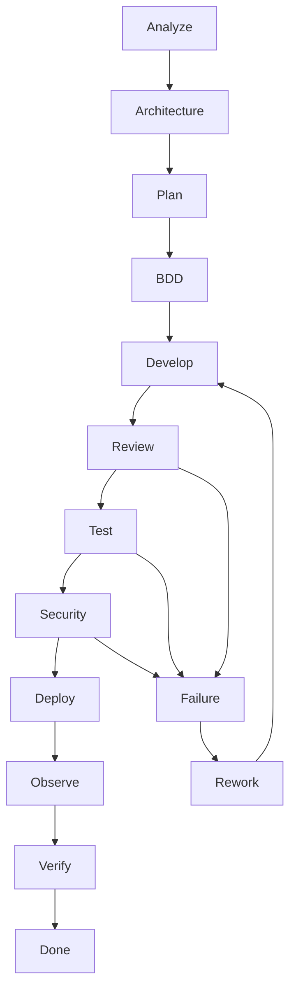

next

# PHASE 18 — SDLC / WORKFLOW ORCHESTRATOR

Bu phase əvvəl yaratdığımız bütün engine-ləri **bir icra sisteminə** bağlayır.

Əsas məqsəd:

> AI hər layihədə eyni uzun workflow-u kor-koranə işlətməsin. Project-i analiz etsin, lazım olan mərhələləri seçsin, ardıcıllığı qursun və hər mərhələnin nəticəsini növbəti mərhələyə ötürsün.

---

## 18.1. Workflow artıq root-da ayrıca sistemdir

Sənin son qərarına uyğun:

```text
.sdd/
├── workflow/
│   ├── INDEX.sdd
│   ├── lifecycle.sdd
│   ├── stages.sdd
│   ├── gates.sdd
│   ├── transitions.sdd
│   ├── dependencies.sdd
│   ├── recovery.sdd
│   └── policies.sdd
│
└── project/
    └── workflow/
        ├── INDEX.sdd
        ├── lifecycle.sdd
        ├── active.sdd
        └── exceptions.sdd
```

Burada:

* `.sdd/workflow` → **workflow qaydaları**
* `.sdd/project/workflow` → **bu project-də seçilmiş workflow**

olur.

---

# 18.2. Workflow chain

Standart lifecycle:

```text
DISCOVER
   ↓
ANALYZE
   ↓
ARCHITECT
   ↓
DECIDE
   ↓
PLAN
   ↓
BDD
   ↓
DEVELOP
   ↓
REVIEW
   ↓
TEST
   ↓
SECURITY
   ↓
DEPLOY
   ↓
OBSERVE
   ↓
VERIFY
   ↓
DONE
```

Amma bu **default catalog**-dur.

Project üçün hamısı aktiv olmaq məcburiyyətində deyil.

---

# 18.3. Project-specific workflow

Məsələn sadə internal tool:

```text
ANALYZE
 ↓
PLAN
 ↓
BDD
 ↓
DEVELOP
 ↓
TEST
 ↓
REVIEW
 ↓
DEPLOY
 ↓
VERIFY
```

Security ayrıca:

```text
SECURITY:
  BASIC
```

ola bilər.

---

Böyük payment system:

```text
DISCOVER
 ↓
ANALYZE
 ↓
ARCHITECT
 ↓
SECURITY DESIGN
 ↓
DECIDE
 ↓
PLAN
 ↓
BDD
 ↓
DEVELOP
 ↓
CODE REVIEW
 ↓
UNIT
 ↓
INTEGRATION
 ↓
CONTRACT
 ↓
E2E
 ↓
SECURITY TEST
 ↓
PENTEST
 ↓
LOAD
 ↓
DEPLOY
 ↓
OBSERVE
 ↓
VERIFY
```

---

# 18.4. Workflow Engine-in əsas prinsipi

Workflow:

```text
Stage
```

və:

```text
Gate
```

anlayışlarını ayırır.

### Stage

> İş görülür.

### Gate

> Növbəti mərhələyə keçməyə icazə varmı?

Məsələn:

```text
DEVELOP
   ↓
TEST
```

amma:

```text
TEST PASS?
```

yoxdursa:

```text
BLOCKED
```

---

# 18.5. Gate sistemi

```text
.sdd/workflow/gates.sdd
```

məsələn:

```text
BDD_GATE
CODE_GATE
REVIEW_GATE
TEST_GATE
SECURITY_GATE
DEPLOY_GATE
VERIFY_GATE
```

Hər gate:

```text
Required
Optional
Conditional
```

ola bilər.

---

# 18.6. Conditional gates

Ən vacib hissələrdən biridir.

Məsələn:

```text
IF
  payment=true

THEN
  SECURITY_GATE = REQUIRED
  PENTEST = REQUIRED
```

Amma:

```text
IF
  internal-tool=true

THEN
  PENTEST = OPTIONAL
```

Beləliklə workflow project context-ə uyğunlaşır.

---

# 18.7. Workflow selection

Agent əvvəl:

```text
PROJECT.sdd
```

oxuyur.

Məsələn:

```text
Type:
  payment

Scale:
  L4

Security:
  high

Availability:
  99.99

Data:
  financial
```

sonra workflow generator:

```text
workflow:
  strict
```

seçir.

---

# 18.8. Kiçik project nümunəsi

```text
Project:
  landing page

Scale:
  L0
```

Workflow:

```text
ANALYZE
 ↓
IMPLEMENT
 ↓
UI TEST
 ↓
VERIFY
```

Burada:

```text
Kafka
Kubernetes
Pentest
Multi-region
Disaster Recovery
```

gətirmək qadağan deyil, amma **default olaraq aktiv deyil**.

---

# 18.9. Böyük project nümunəsi

```text
Project:
  Payment platform

Scale:
  L4

Security:
  Critical
```

workflow:

```text
ANALYZE
 ↓
ARCHITECTURE
 ↓
SECURITY DESIGN
 ↓
BDD
 ↓
IMPLEMENT
 ↓
REVIEW
 ↓
UNIT
 ↓
INTEGRATION
 ↓
CONTRACT
 ↓
E2E
 ↓
SECURITY
 ↓
LOAD
 ↓
PENTEST
 ↓
DEPLOY
 ↓
OBSERVE
 ↓
VERIFY
```

---

# 18.10. Workflow dependency graph

Burada sadə sıra kifayət deyil.

Məsələn:

```text
1000
1001
1011
1023
```

task graph-ı kimi workflow da dependency graph olacaq.

```text
BDD
 ↓
CODE
 ↓
UNIT
 ↓
INTEGRATION
      ↘
       API
        ↓
       E2E
        ↓
     SECURITY
        ↓
      VERIFY
```

Agent dependency-ləri analiz edir.

---

# 18.11. Task execution isə sənin son dediyin modelə uyğun qalır

Məsələn:

```text
1000

1001 → 1011 → 1023
```

1023 oxunur:

```text
1023 → 999
```

Agent görür:

```text
999 = free
```

onda:

```text
999
 ↓
1023
 ↓
1011
 ↓
1001
```

icra edir.

Yəni **dependency resolution + workflow stage** bir-birindən ayrı qalır.

---

# 18.12. Bu distinction çox vacibdir

```text
TASK GRAPH
```

deyir:

> Hansı iş hansı işdən asılıdır?

```text
WORKFLOW GRAPH
```

deyir:

> Bu iş hansı mərhələlərdən keçməlidir?

Məsələn:

```text
TASK-1023
```

üçün:

```text
TASK dependency:
  1023 → 999
```

Workflow:

```text
BDD
 ↓
CODE
 ↓
TEST
 ↓
SECURITY
 ↓
VERIFY
```

Bunları qarışdırmırıq.

---

# 18.13. Workflow state machine

Project workflow state-ləri:

```text
PLANNED
READY
RUNNING
WAITING
BLOCKED
FAILED
REWORK
VERIFYING
COMPLETED
CANCELLED
```

Task isə öz state-lərinə malikdir.

---

# 18.14. Recovery

Burada agentin “problem oldu, indi nə edim?” hissəsi yaranır.

```text
TEST FAIL
   ↓
ANALYZE FAILURE
   ↓
KNOWN ISSUE?
   ├── YES → APPLY EXISTING FIX
   └── NO
         ↓
      ROOT CAUSE
         ↓
      NEW TASK
```

---

# 18.15. Retry policy

Məsələn:

```text
Attempts:
  0/3
```

amma hər problem retry edilməməlidir.

### Retry edilə bilər

```text
network timeout
temporary CI failure
container startup race
```

### Retry edilməməlidir

```text
compile error
assertion failure
security violation
wrong architecture
missing requirement
```

Bu qərarı:

```text
.sdd/workflow/recovery.sdd
```

müəyyən edir.

---

# 18.16. Human intervention

Agent hər şeyi özü dəyişməməlidir.

Bəzi state-lər:

```text
AUTO
```

bəzi:

```text
REVIEW_REQUIRED
```

bəzi:

```text
HUMAN_APPROVAL
```

olmalıdır.

Məsələn:

```text
Code formatting
→ AUTO

Unit test failure
→ AUTO_REWORK

Architecture change
→ REVIEW_REQUIRED

Production database migration
→ HUMAN_APPROVAL

Security exception
→ HUMAN_APPROVAL
```

---

# 18.17. Workflow event log

Agentin nə etdiyini sonradan görmək üçün:

```text
.sdd/project/workflow/
└── events/
```

məsələn:

```text
EVT-001
EVT-002
EVT-003
```

Amma burada da bütün AI reasoning saxlanmır.

Yalnız:

```text
timestamp
actor
stage
action
result
related entity
```

kimi operational məlumat saxlanılır.

Bu həm token, həm repository ölçüsü baxımından yaxşıdır.

---

# 18.18. Human workflow documentation

```text
docs/workflow/
├── INDEX.md
├── lifecycle.md
├── stages.md
├── gates.md
├── recovery.md
└── escalation.md
```

Human `lifecycle.md` açanda:

```text
Requirement
 → Analysis
 → Architecture
 → BDD
 → Development
 → Testing
 → Security
 → Deployment
 → Verification
```

görür.

---

# 18.19. Workflow diagram



---

# 18.20. Cross-layer orchestration

Bu artıq sənin istədiyin FullStack agent modelidir.

Məsələn:

```text
TASK-1200
Change authentication
```

AI impact analysis edir:

```text
BE
FE
MD
DB
SECURITY
TEST
DOCS
```

Sonra:

```text
BE
 ↓
API Contract
 ↓
FE
 ↓
MD
 ↓
Tests
 ↓
Security
 ↓
Docs
```

işlərini ardıcıllığa salır.

---

# 18.21. Parallel execution

Hər şey serial getməməlidir.

Məsələn:

```text
BE implementation
        ↓
   API contract
      /     \
     /       \
   FE         MD
    \         /
     \       /
      E2E tests
```

FE və MD bir-birindən asılı deyilsə paralel gedə bilər.

Bu:

* vaxtı azaldır
* agent runtime-ını azaldır
* CI cost-u azaldır

---

# 18.22. Critical path

Workflow Engine:

```text
Task Graph
+
Stage Graph
```

üzərindən:

```text
Critical Path
```

çıxarmalıdır.

Məsələn:

```text
1000
 ↓
1001
 ↓
1011
 ↓
1023
```

kritik path-dirsə, agent bunu prioritetləşdirir.

Amma:

```text
1100
1101
```

müstəqil task-lardırsa paralel işlənə bilər.

---

# 18.23. Workflow budget

Bu sistemə daha bir ağıllı layer əlavə etmək istəyirəm:

```text
Execution Budget
```

Məsələn:

```text
Project:
  small

Max:
  5 workflow stages
```

və ya:

```text
AI Context Budget:
  low
```

Agent daha minimal workflow seçir.

Critical project:

```text
Security:
  high

Execution budget:
  unlimited
```

olduqda daha çox validation edir.

---

# 18.24. “Minimum Sufficient Process”

Bu bizim əsas policy-lərdən biri olmalıdır:

> **Layihənin riskini idarə etmək üçün lazım olan minimum proses istifadə edilməlidir.**

Nə:

> ən az proses

nə də:

> mümkün olan bütün proses.

**Minimum sufficient process.**

Bu sənin “kiçik layihəyə microservice/DDD/Kubernetes yükləmə” problemini workflow səviyyəsində də həll edir.

---

# 18.25. Phase 18-in nəticəsi

Artıq:

```text
Architecture Engine
        ↓
Stack Engine
        ↓
Task Engine
        ↓
Testing Engine
        ↓
Security Engine
```

ayrı-ayrı modullar olmaqdan çıxıb:

```text
              ┌─────────────┐
              │   PROJECT   │
              └──────┬──────┘
                     ↓
              ┌─────────────┐
              │   ANALYZE   │
              └──────┬──────┘
                     ↓
       ┌─────────────┴─────────────┐
       ↓                           ↓
 ARCHITECTURE                    STACK
       └─────────────┬─────────────┘
                     ↓
                  DECISION
                     ↓
                   TASK
                     ↓
                   BDD
                     ↓
                  CODE
                     ↓
                 REVIEW
                     ↓
                  TEST
                     ↓
                SECURITY
                     ↓
                 DEPLOY
                     ↓
                OBSERVE
                     ↓
                 VERIFY
                     ↓
                   DONE
```

və failure zamanı:

```text
FAILURE
   ↓
ROOT CAUSE
   ↓
TASK / DECISION / ARCHITECTURE CHANGE
   ↓
REWORK
   ↓
RETEST
```

---

## Progress

```text
PHASE 13  Task Engine                    ✅
PHASE 14  Security Engine                ✅
PHASE 15  Testing Engine                 ✅
PHASE 16  Architecture & Decision Engine ✅
PHASE 17  Stack & Technology Engine      ✅
PHASE 18  SDLC / Workflow Orchestrator   ✅
```

### Növbəti — PHASE 19

**OBSERVABILITY, RUNTIME DIAGNOSTICS & INCIDENT ENGINE**

Burada sistem artıq yalnız:

> “kodu yazdım, test keçdi”

səviyyəsində qalmayacaq.

Production-da:

```text
Error
↓
Log
↓
Metric
↓
Trace
↓
Alert
↓
Incident
↓
Impact
↓
Root Cause
↓
Task
↓
Fix
↓
Deploy
↓
Verify
```

zəncirini `.sdd` sisteminə bağlayacağıq.

Bu phase xüsusilə sənin əvvəl dediyin **“kod işləyir, amma problem çıxanda zəncirin harada qırıldığını tapmaq çətindir”** problemini həll edən hissə olacaq.
