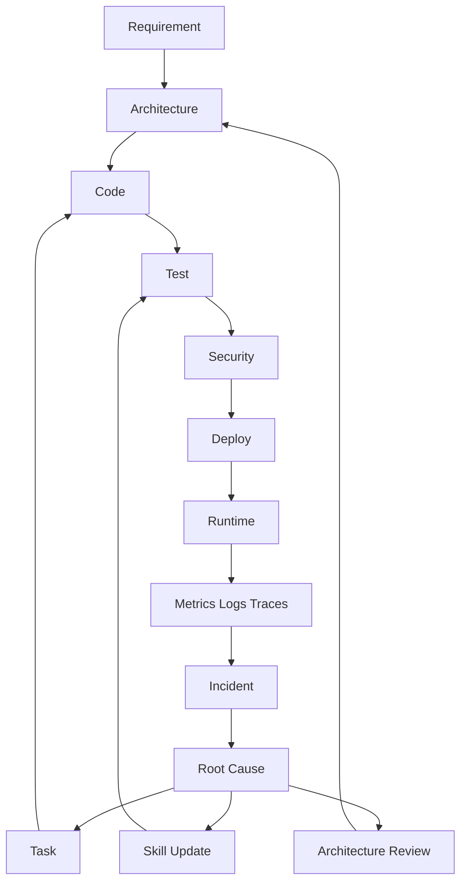

next

# PHASE 19 — OBSERVABILITY, RUNTIME DIAGNOSTICS & INCIDENT ENGINE

Bu phase əvvəlki sistemin **production tərəfini** tamamlayır.

İndiyə qədər:

```text
Requirement
 ↓
Architecture
 ↓
Stack
 ↓
Task
 ↓
BDD
 ↓
Code
 ↓
Test
 ↓
Security
 ↓
Deploy
```

deyirdik.

İndi:

```text
Deploy
 ↓
Runtime
 ↓
Observe
 ↓
Detect
 ↓
Diagnose
 ↓
Incident
 ↓
Root Cause
 ↓
Fix Task
 ↓
Test
 ↓
Deploy
```

qayıdacaq.

Beləliklə sistem **development-only SDD yox, development → runtime → feedback SDD** olacaq.

---

# 19.1. Root structure

```text
.sdd/
├── observability/
│   ├── INDEX.sdd
│   ├── logging.sdd
│   ├── metrics.sdd
│   ├── tracing.sdd
│   ├── alerting.sdd
│   ├── health.sdd
│   ├── diagnostics.sdd
│   └── incident.sdd
│
└── project/
    └── observability/
        ├── INDEX.sdd
        ├── runtime.sdd
        ├── services.sdd
        ├── alerts.sdd
        ├── incidents/
        └── diagnostics/
```

Root:

> **Necə observe etməliyik?**

Project:

> **Bu project-də nəyi necə observe edirik?**

---

# 19.2. Observability 3 əsas sütun

Standart:

```text
Logs
Metrics
Traces
```

Amma bunu bir az genişləndiririk:

```text
Logs
Metrics
Traces
Profiles
Events
Health
```

---

# 19.3. Logs

AI üçün log:

```text
ERROR payment failed
```

kifayət deyil.

Structured log:

```text
timestamp
level
service
environment
request_id
trace_id
user_id
operation
error_code
duration
```

kimi metadata ilə əlaqələndirilir.

`.sdd` isə log formatını deyil, **policy-ni** saxlayır.

Məsələn:

```text
.sdd/observability/logging.sdd
```

Human:

```text
docs/operations/logging.md
```

---

# 19.4. Sensitive data protection

Log sistemi Security Engine ilə əlaqələnir.

Agent yoxlamalıdır:

```text
password
token
session
card
secret
PII
```

log-a düşürmü?

Məsələn:

```text
Authorization: Bearer xxx
```

loglanırsa:

```text
SECURITY VIOLATION
```

yarana bilər.

Bu artıq:

```text
Security
 ↓
Observability
```

cross-layer əlaqəsidir.

---

# 19.5. Metrics

Ən vacib metric kateqoriyaları:

```text
Traffic
Errors
Latency
Saturation
```

Buna əlavə:

```text
Business metrics
Security metrics
Infrastructure metrics
```

əlavə edirik.

---

# 19.6. RED + USE

Service üçün:

```text
Rate
Errors
Duration
```

Infrastructure üçün:

```text
Utilization
Saturation
Errors
```

Agent bunu project-ə görə seçir.

---

# 19.7. Business metrics

Məsələn payment system:

```text
payment_attempts
payment_success
payment_failed
refund_attempts
refund_success
refund_failed
```

Bu çox vacibdir.

Çünki:

```text
CPU = normal
Memory = normal
HTTP 200 = normal
```

ola bilər.

Amma:

```text
refund_success = 0
```

olursa sistem business olaraq qırılıb.

AI bunu görməlidir.

---

# 19.8. Tracing

Request:

```text
Client
 ↓
API
 ↓
Auth
 ↓
Payment
 ↓
PostgreSQL
 ↓
Redis
```

trace:

```text
TRACE-123
```

ilə bağlanır.

Əgər latency:

```text
2.4s
```

olursa AI görür:

```text
API      20ms
Auth     10ms
Payment  40ms
Redis    15ms
DB       2.2s ← bottleneck
```

və problem location müəyyənləşdirir.

---

# 19.9. Code → Trace mapping

Ən güclü hissələrdən biri.

Trace:

```text
payment.create
```

code:

```text
BE/internal/payment/service.go
```

ilə əlaqələndirilir.

Human:

```text
Payment Service
```

diagramda görür.

AI:

```text
trace
 ↓
service
 ↓
component
 ↓
code
 ↓
task
```

gedə bilir.

---

# 19.10. Runtime dependency graph

Project:

```text
.sdd/project/observability/services.sdd
```

məsələn:

```text
API
  -> PostgreSQL
  -> Redis
  -> Queue

Worker
  -> Queue
  -> PostgreSQL
```

Agent runtime problemində graph-ı istifadə edir.

---

# 19.11. Health model

Sadəcə:

```text
200 OK
```

health check kifayət deyil.

Üç səviyyə:

```text
Liveness
Readiness
Dependency health
```

Məsələn:

```text
API alive
API ready = false
Postgres unavailable
```

Bu:

> application ölməyib, amma traffic qəbul etməməlidir.

kimi interpretasiya olunur.

---

# 19.12. Alert Engine

Alert:

```text
CPU > 90%
```

kimi sadə olmamalıdır.

Daha yaxşı:

```text
Error rate > 5%
for 5 minutes
```

və ya:

```text
p95 latency > 500ms
AND
traffic > baseline
```

kimi condition-lar.

---

# 19.13. Alert severity

```text
INFO
WARNING
MINOR
MAJOR
CRITICAL
```

Project-specific severity policy ola bilər.

Payment:

```text
refund failure
→ CRITICAL
```

internal admin:

```text
UI latency
→ WARNING
```

ola bilər.

---

# 19.14. Alert ≠ Incident

Bu distinction vacibdir.

```text
Alert
```

deyir:

> Şübhəli vəziyyət var.

```text
Incident
```

deyir:

> Real business/system impact təsdiqlənib.

Məsələn:

```text
CPU 90%
```

alert-dir.

Amma:

```text
API unavailable
```

incident-dir.

---

# 19.15. Incident structure

```text
.sdd/project/observability/incidents/
```

məsələn:

```text
INC-20260822-001.sdd
```

Human:

```text
docs/incidents/INC-20260822-001.md
```

---

# 19.16. Incident compact format

```text
ID:
  INC-001

Severity:
  S1

Detected:
  alert: ALT-004

Impact:
  payment API unavailable

Start:
  01:12

End:
  01:37

Affected:
  payment

RootCause:
  DB connection exhaustion

Task:
  TASK-1088

Status:
  RESOLVED
```

AI üçün kifayət qədər compact.

Human doc isə geniş izah edir.

---

# 19.17. Incident lifecycle

```text
DETECTED
 ↓
TRIAGED
 ↓
INVESTIGATING
 ↓
MITIGATING
 ↓
RESOLVED
 ↓
POSTMORTEM
 ↓
PREVENTION
```

---

# 19.18. Root Cause Analysis

AI:

```text
Incident
 ↓
Metrics
 ↓
Logs
 ↓
Trace
 ↓
Deploy history
 ↓
Code change
 ↓
Dependency
 ↓
Root Cause
```

analiz edir.

Məsələn:

```text
01:00 deploy
01:04 DB connections ↑
01:07 API latency ↑
01:10 errors ↑
01:12 alert
```

AI:

```text
LikelyRootCause:
  connection pool regression
```

çıxara bilər.

Amma bunu **fact kimi yox**, confidence ilə vermək daha doğrudur:

```text
Confidence:
  0.87
```

---

# 19.19. AI diagnosis certainty

```text
CONFIRMED
HIGH_CONFIDENCE
LIKELY
POSSIBLE
UNKNOWN
```

Agent:

```text
RootCause:
  DB connection exhaustion

Confidence:
  HIGH_CONFIDENCE
```

deyə bilər.

Beləliklə AI yanlış ehtimalı fakt kimi təqdim etmir.

---

# 19.20. Incident → Task

Problem həll olunandan sonra:

```text
INC-001
 ↓
ROOT CAUSE
 ↓
TASK-1088
```

məsələn:

```text
TASK-1088

Title:
Fix DB connection pool exhaustion

Origin:
  incident: INC-001

Priority:
  HIGH

Type:
  reliability
```

Bu task normal Task Engine-ə daxil olur.

---

# 19.21. Incident → Architecture

Bəzən problem sadəcə bug deyil.

Məsələn:

```text
DB overloaded
```

üç dəfə təkrarlanır.

AI görür:

```text
INC-001
INC-009
INC-021
```

və:

```text
Recurring failure
```

çıxarır.

Sonra Architecture Engine-ə signal:

```text
ARCHITECTURE_REVIEW_REQUIRED
```

göndərir.

Bu çox güclüdür.

---

# 19.22. Incident → Skill update

Əgər problem skill-dəki köhnə praktikadan yaranıbsa:

```text
Runtime problem
 ↓
Root Cause
 ↓
Skill outdated?
```

əgər:

```text
YES
```

onda:

```text
SKILL_UPDATE_PROPOSAL
```

yaradılır.

Bu sənin əvvəl dediyin:

> “Skill köhnəlibsə AI özü bunu tapsın.”

tələbinin runtime tərəfidir.

---

# 19.23. Deploy correlation

Deploy:

```text
DEPLOY-042
```

incident:

```text
INC-001
```

arasında correlation saxlanılır.

Məsələn:

```text
INC-001
SuspectedDeploy:
  DEPLOY-042
```

Beləliklə:

> Problem hansı deploy-dan sonra başladı?

sualı avtomatik cavablandırıla bilər.

---

# 19.24. Rollback decision

AI:

```text
Incident
 ↓
Recent deploy?
 ↓
Regression?
 ↓
Rollback safe?
```

analiz edə bilər.

Amma:

```text
production rollback
```

kritik əməliyyat olduğuna görə project policy-dən asılı olaraq:

```text
AUTO
```

və ya:

```text
HUMAN_APPROVAL
```

olmalıdır.

---

# 19.25. Runbook Engine

Project:

```text
.sdd/project/operations/runbooks/
```

məsələn:

```text
RB-001.sdd
RB-002.sdd
```

Human:

```text
docs/runbooks/
```

Məsələn:

```text
RB-001
Database unavailable
```

AI incident zamanı uyğun runbook-u tapır.

```text
Incident
 ↓
Classification
 ↓
Runbook
 ↓
Action
```

---

# 19.26. Runbook da skill kimi reusable olacaq

Root:

```text
.sdd/operations/
├── runbooks/
│   ├── database-down.sdd
│   ├── redis-down.sdd
│   ├── high-cpu.sdd
│   ├── disk-full.sdd
│   └── certificate-expired.sdd
```

Project yalnız lazım olanları activate edir.

---

# 19.27. Disaster / Resilience

Observability burada:

```text
monitor
```

ilə bitmir.

Agent həmçinin:

```text
Failure Injection
Recovery
Backup
Restore
Failover
RTO
RPO
```

nəticələrini izləməlidir.

---

# 19.28. SLO Engine

Project:

```text
.sdd/project/observability/slo.sdd
```

məsələn:

```text
Availability:
  99.95%

API p95:
  < 300ms

Error rate:
  < 0.5%

Recovery:
  RTO < 30m
  RPO < 5m
```

AI runtime vəziyyətini bunlarla müqayisə edir.

---

# 19.29. Error Budget

SLO:

```text
99.95%
```

olarsa müəyyən qədər failure budget var.

Əgər error budget tükənirsə:

```text
Release velocity ↓
Reliability work ↑
```

kimi workflow policy aktivləşə bilər.

Bu artıq sadə monitoringdən daha yüksək səviyyəli engineering management-dir.

---

# 19.30. Runtime feedback loop

Bütün sistem belə bağlanır:



Bu artıq **self-improving engineering system** üçün əsas skeletdir.

---

# 19.31. Human documentation

```text
docs/
├── operations/
│   ├── observability.md
│   ├── logging.md
│   ├── metrics.md
│   ├── tracing.md
│   ├── alerting.md
│   └── health.md
│
├── incidents/
│   └── INC-*.md
│
└── runbooks/
    └── RB-*.md
```

Developer:

> Kod problemi haradan gəlir?

Support:

> Incident nədir?

DevOps:

> Runtime necə işləyir?

Manager:

> Nə qədər impact oldu?

Security:

> Security event varmı?

hamısı öz documentation layer-indən məlumat alır.

---

# 19.32. Bu phase-in ən vacib nəticəsi

İndiyə qədər sistem:

```text
AI → Code
```

kimi görünə bilərdi.

İndi:

```text
AI
 ↓
Engineering Lifecycle
 ↓
Production
 ↓
Reality
 ↓
Feedback
 ↓
Engineering Lifecycle
```

olur.

Yəni sistem **kod yazan agentdən engineering agentə** çevrilir.

---

## Progress

```text
PHASE 13  Task Engine                    ✅
PHASE 14  Security Engine                ✅
PHASE 15  Testing Engine                 ✅
PHASE 16  Architecture & Decision Engine ✅
PHASE 17  Stack & Technology Engine      ✅
PHASE 18  SDLC / Workflow Orchestrator   ✅
PHASE 19  Observability / Incident       ✅
```

### Növbəti: **PHASE 20 — DOCUMENTATION & KNOWLEDGE ENGINE**

Bu phase sənin əvvəl dediyin **“developer üçün ayrı, business üçün ayrı, support üçün ayrı, infra üçün ayrı documentation olsun; amma kodun yanında lazımsız `.md` faylları yaranmasın”** problemini sistemli şəkildə həll edəcək.

Əsas model:

```text
.sdd/       → AI compact truth
docs/       → Human knowledge
source code → Actual implementation
runtime     → Actual system state
```

və agent bunların arasında **single source of truth + traceability** qaydasını quracaq.
