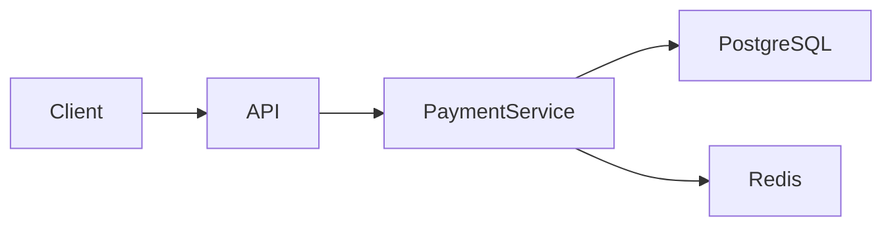

next
# PHASE 20 — DOCUMENTATION & KNOWLEDGE ENGINE

Bu phase bizim sistemdə çox vacib sərhədi müəyyən edir:

> **`.sdd` AI üçün, `docs/` insan üçün, source code isə real implementation üçün olacaq.**

Beləliklə sən istəmədiyin vəziyyət yaranmır:

```text
BE/internal/analytics/repository.go
BE/internal/analytics/repository.md
```

Əvəzinə:

```text
BE/internal/analytics/repository.go

docs/
└── developer/
    └── analytics.md

.sdd/
└── project/
    └── BE/
        └── internal/
            └── analytics/
                └── repository.sdd
```

---

# 20.1. Üç qatlı knowledge model

Sistemin əsas modeli:

```text
                    PROJECT
                       │
          ┌────────────┼────────────┐
          ↓            ↓            ↓
      SOURCE         .sdd/        docs/
       CODE          AI TRUTH     HUMAN TRUTH
          │            │            │
          └────────────┼────────────┘
                       ↓
                  TRACEABILITY
```

### Source code

Real iş görür.

### `.sdd`

AI-nin kompakt struktur və semantic knowledge qatıdır.

### `docs/`

İnsanların oxuyacağı geniş izah qatıdır.

---

# 20.2. Documentation root

```text
docs/
├── INDEX.md
├── business/
├── architecture/
├── developer/
├── testing/
├── security/
├── operations/
├── infrastructure/
├── support/
├── deployment/
├── incidents/
└── decisions/
```

Burada məqsəd:

> **Document → audience**

münasibətini açıq saxlamaqdır.

---

# 20.3. Audience modeli

```text
BUSINESS
DEVELOPER
QA
SECURITY
DEVOPS
SUPPORT
OPERATIONS
MANAGER
ARCHITECT
```

Hər document bir və ya bir neçə audience-ə aid ola bilər.

Məsələn:

```text
docs/security/payment-security.md
```

Audience:

```text
SECURITY
DEVELOPER
QA
```

---

# 20.4. Human documentation index

```text
docs/INDEX.md
```

məsələn:

```text
# Project Documentation

## Business
Business rules and product behaviour.

## Architecture
System structure and design decisions.

## Developer
Implementation and development knowledge.

## QA
Testing strategy and test behaviour.

## Security
Security controls and security procedures.

## Infrastructure
Deployment and runtime infrastructure.

## Support
Operational troubleshooting.

## Incidents
Production incidents and postmortems.
```

İnsan project-ə girəndə ilk olaraq bunu görür.

---

# 20.5. `.sdd` documentation mapping

AI tərəfdə:

```text
.sdd/project/docs/
├── INDEX.sdd
├── mappings.sdd
└── ownership.sdd
```

Məsələn:

```text
repository.sdd
```

içində:

```text
HumanDoc:
  docs/developer/analytics.md
```

ola bilər.

Amma `.sdd`-də bütün markdown məzmunu təkrar yazılmır.

---

# 20.6. Single Source of Truth

Ən vacib policy:

> **Eyni məlumat iki fərqli yerdə müstəqil həqiqət kimi saxlanmamalıdır.**

Məsələn:

```text
API davranışı
```

source code + contract-dan müəyyən edilir.

Human doc isə onu izah edir.

Beləliklə:

```text
Code ≠ copy of documentation
Documentation ≠ copy of code
```

---

# 20.7. Documentation types

Document-ləri də standartlaşdırırıq:

```text
CONCEPT
GUIDE
REFERENCE
RUNBOOK
DECISION
PROCEDURE
TROUBLESHOOT
ARCHITECTURE
API
BUSINESS
POSTMORTEM
```

Məsələn:

```text
docs/developer/auth.md
```

`GUIDE`.

```text
docs/operations/database-down.md
```

`RUNBOOK`.

```text
docs/decisions/DEC-017.md
```

`DECISION`.

---

# 20.8. L0–L5 documentation depth

Sənin əvvəlki L0–L5 ideyanı burada tətbiq edirik.

### L0 — Minimal

```text
What is this?
```

Kiçik project.

### L1 — Basic

```text
What
Why
How
```

### L2 — Developer

```text
Architecture
Dependencies
Testing
Operations
```

### L3 — Production

```text
Scaling
Security
Monitoring
Failure handling
```

### L4 — High scale

```text
SLO
DR
Capacity
Multi-region
Resilience
```

### L5 — Critical / enterprise

```text
Compliance
Advanced security
Formal controls
Disaster scenarios
Auditability
```

Agent project levelinə görə documentation depth seçir.

---

# 20.9. Documentation generation

AI source code yaratdıqdan sonra:

```text
CODE
 ↓
ANALYZE
 ↓
DOC IMPACT
 ↓
UPDATE HUMAN DOC
```

edir.

Amma hər kod dəyişiklikdə bütün docs yenidən yaradılmır.

Yalnız təsirlənən documentation tapılır.

---

# 20.10. Documentation impact graph

Məsələn:

```text
repository.go
     ↓
repository.sdd
     ↓
analytics domain
     ↓
docs/developer/analytics.md
     ↓
docs/architecture/data-flow.md
```

Əgər `repository.go` dəyişirsə, agent həmin graph-a baxır.

---

# 20.11. Stale documentation detection

AI source code ilə docs-u müqayisə edir.

Məsələn doc:

```text
Redis is used for session storage.
```

amma source:

```text
PostgreSQL sessions
```

istifadə edir.

Agent:

```text
DOC-DRIFT
```

aşkar edir.

---

# 20.12. Documentation status

Hər human document üçün:

```text
CURRENT
STALE
REVIEW
DRAFT
ARCHIVED
```

statusu ola bilər.

`.sdd`:

```text
Doc:
  docs/developer/auth.md

Status:
  CURRENT

LastVerified:
  2026-08-22
```

---

# 20.13. Documentation ownership

Hər sənədin owner-i ola bilər:

```text
Owner:
  DEVELOPER
```

və ya:

```text
Owner:
  DEVOPS
```

və ya:

```text
Owner:
  SECURITY
```

Beləliklə agent:

> Bu document-i kim update etməlidir?

sualına cavab verə bilir.

---

# 20.14. Business → Developer → Support əlaqəsi

Məsələn business qaydası:

```text
Refund can only happen once.
```

↓

Developer:

```text
Idempotency protection.
```

↓

QA:

```text
Duplicate refund BDD scenario.
```

↓

Security:

```text
Replay protection.
```

↓

Support:

```text
Refund already processed.
```

Bunlar ayrı document-lərdir, amma relationship saxlanır.

---

# 20.15. Business documentation

```text
docs/business/
├── INDEX.md
├── requirements.md
├── business-rules.md
├── workflows.md
└── terminology.md
```

Burada texniki implementation mümkün qədər gizli saxlanır.

Business user:

> Refund necə işləyir?

oxuya bilər.

Amma:

> Redis lock necə qurulub?

onu burada görməməlidir.

---

# 20.16. Developer documentation

```text
docs/developer/
├── INDEX.md
├── architecture.md
├── coding.md
├── modules.md
├── contracts.md
└── troubleshooting.md
```

Developer üçün:

```text
What
Why
Where
How
Dependencies
Constraints
```

olmalıdır.

---

# 20.17. QA documentation

```text
docs/testing/
├── strategy.md
├── bdd.md
├── unit.md
├── integration.md
├── contract.md
├── e2e.md
├── performance.md
└── security-testing.md
```

Burada BDD qaydaları ayrıca izah edilir.

---

# 20.18. Security documentation

```text
docs/security/
├── model.md
├── controls.md
├── authentication.md
├── authorization.md
├── data-protection.md
├── threat-model.md
├── pentest.md
└── incident-response.md
```

Security Engine bunlarla əlaqələnir.

---

# 20.19. Infrastructure documentation

```text
docs/infrastructure/
├── architecture.md
├── environments.md
├── networking.md
├── compute.md
├── database.md
├── cache.md
├── storage.md
└── disaster-recovery.md
```

VPS, AWS, GCP, Azure fərqləri burada ayrıca göstərilə bilər.

---

# 20.20. Deployment documentation

Sənin əvvəlki istəyinə uyğun:

```text
docs/deployment/
├── INDEX.md
├── local.md
├── staging.md
├── production.md
├── vps.md
├── aws.md
├── gcp.md
└── azure.md
```

Amma hamısı project üçün yaradılmır.

Əgər project:

```text
Infrastructure:
  VPS
```

dirsə:

```text
vps.md
```

aktiv olur.

AWS sənədi isə:

```text
NOT_APPLICABLE
```

ola bilər.

---

# 20.21. Diagram documentation

Diagramları da knowledge graph-a bağlayırıq.

```text
docs/architecture/diagrams/
├── system.md
├── deployment.md
├── data-flow.md
├── sequence.md
└── network.md
```

Mermaid istifadə etmək yaxşı default-dur.

---

# 20.22. Diagram → code mapping

Sənin xüsusi istəyin burada həyata keçir:



Diagram metadata:

```text
PaymentService:
  source:
    BE/internal/payment/service.go

PostgreSQL:
  source:
    DB/payment

Redis:
  source:
    infrastructure/redis
```

Beləliklə AI diagramı kodla əlaqələndirə bilir.

---

# 20.23. Diagram freshness

Kod dəyişəndə diagram da yoxlanılır.

```text
CODE CHANGE
 ↓
DEPENDENCY GRAPH
 ↓
DIAGRAM IMPACT
 ↓
STALE?
```

Əgər:

```text
API → RabbitMQ
```

əvəzinə:

```text
API → Kafka
```

olubsa, diagram:

```text
STALE
```

olur.

---

# 20.24. Documentation generation rules

AI:

```text
CREATE DOC
```

etməzdən əvvəl soruşmur.

Əvvəl policy yoxlayır:

```text
Already exists?
     ↓
   YES
     ↓
Update

NO
 ↓
Required?
 ↓
YES
 ↓
Create
```

Beləliklə lazımsız sənəd yaranmır.

---

# 20.25. “No duplicate documentation” policy

```text
.sdd/
```

və:

```text
docs/
```

eyni məlumatı uzun şəkildə saxlamır.

Məsələn `.sdd`:

```text
Owner: DEVOPS
Level: L3
Runtime: Docker
Cloud: AWS
```

`docs/infrastructure/architecture.md` isə bunun insan üçün izahını saxlayır.

---

# 20.26. Documentation lint

Agent documentation üçün də test işlədəcək.

Məsələn:

```text
DOC001
Missing owner

DOC002
Broken reference

DOC003
Stale diagram

DOC004
Missing audience

DOC005
Invalid link

DOC006
Outdated technology

DOC007
Missing architecture reference
```

Beləliklə documentation da quality gate-dən keçir.

---

# 20.27. Documentation graph

Bütün knowledge:

```text
Business Rule
      ↓
Requirement
      ↓
Decision
      ↓
Architecture
      ↓
Stack
      ↓
Task
      ↓
Code
      ↓
Test
      ↓
Security
      ↓
Deployment
      ↓
Runtime
      ↓
Incident
      ↓
Documentation
```

ilə əlaqələndirilir.

---

# 20.28. Knowledge retrieval

Agent bütün `docs/` qovluğunu hər dəfə oxumamalıdır.

Bu çox böyük token itkisi olar.

Əvəzində:

```text
QUESTION
 ↓
INDEX
 ↓
RELEVANT ENTITY
 ↓
RELEVANT .sdd
 ↓
RELEVANT DOC
 ↓
SOURCE CODE
```

olmalıdır.

Bu bizim **Context Routing Engine**-ə əsas hazırlıqdır.

---

# 20.29. Token-saving model

Məsələn task:

```text
Fix refund idempotency
```

AI:

```text
PROJECT INDEX
 ↓
TASK-1023
 ↓
payments
 ↓
refund
 ↓
relevant skills
 ↓
relevant source
 ↓
relevant tests
```

yükləyir.

Bütün:

```text
docs/
skills/
project/
```

yüklənmir.

Bu çox ciddi token qənaətidir.

---

# 20.30. Human-readable documentation hierarchy

Manager project-i açanda:

```text
docs/
├── INDEX.md
│
├── business/
│   └── ...
│
├── architecture/
│   └── ...
│
├── developer/
│   └── ...
│
├── testing/
│   └── ...
│
├── security/
│   └── ...
│
├── infrastructure/
│   └── ...
│
├── operations/
│   └── ...
│
└── support/
    └── ...
```

görür.

Yəni:

> **“Bu problem kimə aiddir?”**

sualı documentation strukturundan belə cavablanır.

---

# 20.31. Ownership routing

Məsələn:

```text
DB latency
```

AI:

```text
PRIMARY:
  DEVOPS

SECONDARY:
  BACKEND
```

seçir.

---

```text
Broken UI
```

:

```text
PRIMARY:
  FRONTEND

SECONDARY:
  QA
```

---

```text
Payment security issue
```

:

```text
PRIMARY:
  SECURITY

SECONDARY:
  BACKEND
  QA
```

---

# 20.32. Documentation ↔ incident

Incident zamanı:

```text
INC-001
 ↓
Root cause
 ↓
Relevant runbook
 ↓
Relevant architecture doc
 ↓
Relevant code
```

gedə bilir.

Support artıq:

> Developerə soruşum görüm bu nədir

demək məcburiyyətində qalmır.

---

# 20.33. Documentation ↔ task

Task:

```text
TASK-1023
```

human doc-da:

```text
docs/developer/payments/refund.md
```

ilə əlaqələnir.

Beləliklə:

```text
TASK
 ↔
CODE
 ↔
TEST
 ↔
DOC
```

traceable olur.

---

# 20.34. Documentation ↔ decision

Məsələn:

```text
DEC-017
Use Redis for idempotency locking
```

↓

```text
docs/decisions/DEC-017.md
```

↓

```text
payments/refund
```

↓

```text
repository/service code
```

Bu, gələcəkdə:

> “Niyə Redis seçilmişdi?”

sualını cavablandırır.

---

# 20.35. Phase 20 final model

```text
                    .sdd/
                      │
                AI COMPACT TRUTH
                      │
          ┌───────────┼───────────┐
          ↓           ↓           ↓
       TASKS       DECISIONS    SKILLS
          │           │           │
          └───────────┼───────────┘
                      ↓
                  SOURCE CODE
                      │
                      ↓
                 RUNTIME
                      │
                      ↓
                  INCIDENT
                      │
                      ↓
                    DOCS
                      │
        ┌─────────────┼─────────────┐
        ↓             ↓             ↓
     BUSINESS      DEVELOPER      OPS
        ↓             ↓             ↓
      SUPPORT       QA          SECURITY
```

---

# 20.36. Əsas qayda

Bu phase-dən sonra sistemdə bu prinsip **dəyişməz qayda** olmalıdır:

```text
.sdd/
    = machine-readable engineering knowledge

source/
    = executable truth

docs/
    = human-readable knowledge

runtime/
    = operational truth
```

Heç biri digərinin yerinə keçmir.

---

# Progress

```text
PHASE 13  Task Engine                    ✅
PHASE 14  Security Engine                ✅
PHASE 15  Testing Engine                 ✅
PHASE 16  Architecture & Decision Engine ✅
PHASE 17  Stack & Technology Engine      ✅
PHASE 18  SDLC / Workflow Orchestrator   ✅
PHASE 19  Observability / Incident       ✅
PHASE 20  Documentation / Knowledge      ✅
```

## Növbəti — PHASE 21

**CONTEXT ROUTER & TOKEN OPTIMIZATION ENGINE**

Burada artıq bütün bu böyük sistemi **AI-yə necə az tokenlə yükləyəcəyimizi** quracağıq.

Əsas fikir:

```text
User request
      ↓
Intent
      ↓
Project
      ↓
Domain
      ↓
Task
      ↓
Workflow stage
      ↓
Required skills
      ↓
Required docs
      ↓
Required source
      ↓
MINIMUM CONTEXT
      ↓
AI
```

Yəni AI-yə 500 fayl vermək əvəzinə, **iş üçün lazım olan 8–15 faylı ağıllı şəkildə seçən Context Router** yaradacağıq.
