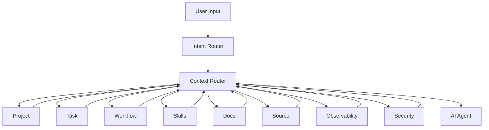

next


# PHASE 21 — CONTEXT ROUTER & TOKEN OPTIMIZATION ENGINE

Bu phase bizim sistemin **AI beyninə context seçən layer** olacaq.

Əsas problem:

> `.sdd` böyükdür, skills çoxdur, docs çoxdur, source code böyükdür. AI bunların hamısını oxusa həm token, həm vaxt, həm də accuracy itir.

Ona görə AI-yə **bütün project yox, konkret iş üçün minimum kifayət edən context** verilir.

---

# 21.1. Əsas prinsip

```text
User Input
   ↓
Intent Detection
   ↓
Project Detection
   ↓
Domain Detection
   ↓
Task / Requirement Detection
   ↓
Workflow Stage
   ↓
Dependency Analysis
   ↓
Skill Selection
   ↓
Documentation Selection
   ↓
Source Selection
   ↓
Context Budget
   ↓
AI Execution
```

Bu engine-in əsas qaydası:

> **Read less, understand more.**

---

# 21.2. Context root

```text
.sdd/
├── context/
│   ├── INDEX.sdd
│   ├── routing.sdd
│   ├── priorities.sdd
│   ├── budgets.sdd
│   ├── loading.sdd
│   ├── dependencies.sdd
│   └── cache.sdd
```

Project-specific:

```text
.sdd/project/
└── context/
    ├── INDEX.sdd
    ├── map.sdd
    └── active.sdd
```

---

# 21.3. Context Router nə edir?

Məsələn user deyir:

> Refund zamanı double refund problemini həll et.

AI bütün project-i oxumur.

Əvvəl:

```text
Intent:
  FIX

Domain:
  payments

Component:
  refund

Risk:
  high
```

tapır.

Sonra:

```text
TASK
 ↓
PAY-1023
```

tapılır.

---

# 21.4. Task → Context

Task:

```text id="rj3c2f"
PAY-1023
```

deyir:

```text
Domain:
  payments/refund

Skills:
  idempotency
  transactions
  payment-security

DependsOn:
  PAY-999
```

Context Router:

```text
LOAD:
  PAY-1023
  PAY-999
  refund code
  refund tests
  idempotency skill
  transaction skill
  payment security skill
  relevant docs
```

və:

```text
DO NOT LOAD:
  frontend
  mobile
  unrelated infrastructure
```

---

# 21.5. Context priority

Hər context elementinin priority-si olur:

```text
P0 = mandatory
P1 = strongly relevant
P2 = useful
P3 = optional
P4 = background
```

Məsələn:

```text
Task:
  P0

Parent task:
  P0

Required skill:
  P0

Affected source:
  P0

Related test:
  P1

Architecture:
  P1

General documentation:
  P2

Unrelated modules:
  P4
```

AI əvvəl P0 yükləyir.

---

# 21.6. Context budget

Project:

```text
L0
```

üçün:

```text
LOW
```

budget.

Critical payment system:

```text
L4
```

üçün:

```text
HIGH
```

budget.

Amma:

> High budget = bütün repository-ni oxu

demək deyil.

Sadəcə router daha geniş context götürə bilər.

---

# 21.7. Context budget modeli

```text
.sdd/context/budgets.sdd
```

məsələn:

```text
L0:
  context: minimal

L1:
  context: low

L2:
  context: medium

L3:
  context: high

L4:
  context: critical

L5:
  context: exhaustive
```

Amma `exhaustive` belə dependency-aware olmalıdır.

---

# 21.8. Context expansion

AI əvvəl minimal context ilə başlayır:

```text
P0
```

Əgər kifayət etmirsə:

```text
P1
```

sonra:

```text
P2
```

yükləyir.

```text
P0
 ↓
Enough?
 ├── YES → Execute
 └── NO
      ↓
     P1
      ↓
   Enough?
      ├── YES
      └── NO
           ↓
          P2
```

Bu **progressive context loading** olacaq.

---

# 21.9. “Enough Context” criterion

AI özü:

```text
CONTEXT_SUFFICIENT
```

və ya:

```text
CONTEXT_INSUFFICIENT
```

qərarı verməlidir.

Məsələn:

```text
Task:
  Add DB index
```

üçün:

```text
Task
Schema
Query
DB skill
Existing tests
```

kifayətdir.

Bütün frontend lazım deyil.

---

# 21.10. Context dependency graph

```text
TASK-1023
   ↓
PAYMENTS
   ↓
REFUND
   ├── service.go
   ├── repository.go
   ├── refund_test.go
   ├── idempotency.sdd
   └── payment-security.sdd
```

Router bu graph ilə context seçir.

---

# 21.11. Context radius

Task-dan nə qədər uzağa gedəcəyimizi müəyyən edirik.

```text
R0 = task itself
R1 = direct dependencies
R2 = domain
R3 = architecture
R4 = project
```

Default:

```text
R0 + R1
```

Sonra ehtiyac varsa genişlənir.

---

# 21.12. Example

Task:

```text id="wq2g2h"
PAY-1023
```

### R0

```text
PAY-1023
```

### R1

```text
PAY-999
refund service
refund repository
refund tests
```

### R2

```text
payments architecture
payment security
transaction policy
```

### R3

```text
system architecture
database architecture
```

### R4

```text
entire project
```

AI normal halda R4-ə getmir.

---

# 21.13. Skill routing

Bütün skills:

```text
.sdd/skills/
```

altında ola bilər.

Amma:

```text
refund
```

task üçün:

```text
@backend/idempotency
@database/transactions
@security/payment
```

aktiv edilir.

Frontend skills:

```text
@frontend/react
@frontend/vue
```

yüklənmir.

---

# 21.14. Skill hierarchy

Skill-lər:

```text
domain
  ↓
technology
  ↓
specialization
```

məsələn:

```text
backend
 ↓
go
 ↓
postgresql
 ↓
transactions
 ↓
idempotency
```

Context Router aşağıdan yuxarı lazım olan parent context-i də gətirir.

---

# 21.15. Token-aware skill loading

Əgər:

```text
idempotency.sdd
```

çox kiçikdirsə, birbaşa yüklənir.

Əgər böyük skill:

```text
postgresql.sdd
```

1000+ sətirdirsə, AI bütününü yükləmir.

Əvvəl:

```text
INDEX
```

sonra lazım olan section:

```text
transactions
locking
indexes
```

yüklənir.

---

# 21.16. Section-level retrieval

Bu çox vacib optimizasiyadır.

```text
Skill:
  PostgreSQL

Sections:
  installation
  schema
  transactions
  indexing
  replication
  partitioning
  backup
```

Task:

```text
Add index
```

üçün:

```text
indexing
query-planning
```

kifayətdir.

---

# 21.17. Documentation routing

User:

> Payment refund niyə fail edir?

Router:

```text
docs/business/refunds.md
docs/developer/payments.md
docs/operations/payment-failures.md
```

seçə bilər.

Amma:

```text
docs/frontend/
docs/mobile/
```

gətirmir.

---

# 21.18. Audience-aware context

User roluna görə context dəyişir.

### Developer

```text
source
skills
architecture
tests
```

### QA

```text
requirements
BDD
test strategy
contracts
source
```

### Support

```text
business
runbooks
incidents
troubleshooting
```

### Manager

```text
business
status
risks
decisions
progress
```

Beləliklə eyni project üçün fərqli context yaradılır.

---

# 21.19. Manager mode

Sənin manager olaraq istifadə edəcəyin:

```text
.sdd/context/
```

routing:

```text
Manager Request
 ↓
Project status
 ↓
Open tasks
 ↓
Blocked tasks
 ↓
Risks
 ↓
Incidents
 ↓
Decisions
 ↓
Progress
```

Source code yalnız ehtiyac yaranarsa gətirilir.

---

# 21.20. Developer mode

```text
Developer Request
 ↓
Task
 ↓
Code
 ↓
Tests
 ↓
Skills
 ↓
Architecture
 ↓
Relevant docs
```

---

# 21.21. Incident mode

```text
Incident
 ↓
Alert
 ↓
Metrics
 ↓
Logs
 ↓
Trace
 ↓
Recent deployment
 ↓
Affected service
 ↓
Relevant code
 ↓
Runbook
```

Bu context route ayrıca olacaq.

---

# 21.22. Security mode

```text
Security issue
 ↓
Threat model
 ↓
Security skill
 ↓
Affected component
 ↓
Auth/AuthZ
 ↓
Data
 ↓
Logs
 ↓
Tests
 ↓
Pentest history
```

---

# 21.23. Cache

Context Router hər dəfə eyni məlumatı yenidən analiz etməməlidir.

```text
.sdd/context/cache.sdd
```

burada:

```text
context-id
source
hash
last-used
dependencies
```

kimi metadata saxlanır.

Source dəyişməyibsə:

```text
CACHE HIT
```

olur.

---

# 21.24. Context invalidation

Əgər:

```text
repository.go
```

dəyişirsə:

```text
repository.sdd
refund docs
refund tests
```

kimi dependent context-lər invalidate edilə bilər.

```text
SOURCE CHANGE
 ↓
DEPENDENCY GRAPH
 ↓
INVALIDATE
 ↓
REBUILD CONTEXT
```

---

# 21.25. Context fingerprint

Hər context üçün:

```text
CTX-8F3A
```

kimi ID və fingerprint saxlanır.

Məsələn:

```text
CTX:
  project=payments
  task=PAY-1023
  skills=3
  docs=2
  source=5
  workflow=TEST
```

Bu debugging üçün çox faydalıdır.

---

# 21.26. Context audit

AI sonradan:

> Bu qərarı niyə verdin?

sualına cavab verməlidir.

Buna görə context audit:

```text
CTX-8F3A

Loaded:
  PAY-1023
  PAY-999
  refund/service.go
  refund_test.go
  idempotency.sdd
  transaction.sdd

Excluded:
  frontend
  mobile
  unrelated domains
```

kimi qısa metadata saxlayır.

**Amma full prompt/history saxlamırıq.**

Token və storage qənaəti.

---

# 21.27. Context miss detection

AI səhv context seçə bilər.

Məsələn payment task-a frontend lazım olduğu halda yüklənməyib.

Agent bunu müəyyən edir:

```text
CONTEXT_MISS
```

və:

```text
EXPAND_CONTEXT
```

edir.

---

# 21.28. Context confidence

```text
ContextConfidence:
  HIGH
```

və ya:

```text
MEDIUM
LOW
```

Əgər:

```text
LOW
```

olarsa agent implementation-a başlamamalıdır.

Əvvəl əlavə context tapmalıdır.

---

# 21.29. Context budget failure

Əgər project çox böyükdürsə:

```text
Context budget exceeded
```

olanda AI hər şeyi sıxışdırmamalıdır.

Əvəzində:

```text
Prioritize
 ↓
Summarize
 ↓
Retrieve relevant section
 ↓
Continue
```

edir.

---

# 21.30. Summary layers

Böyük project üçün:

```text
Project summary
 ↓
Domain summary
 ↓
Module summary
 ↓
Component summary
 ↓
Source
```

qatları yaradırıq.

Məsələn:

```text
payments.sdd
```

payment domain-in compact representation-ıdır.

AI əvvəl bunu oxuyur.

---

# 21.31. Hierarchical context

```text
PROJECT
 ├── DOMAIN
 │    ├── MODULE
 │    │    ├── COMPONENT
 │    │    │    └── SOURCE
```

Router lazım olan dərinliyə qədər enir.

Bu, bizim `.sdd/project` strukturunun ən böyük faydalarından biri olacaq.

---

# 21.32. Context routing example

User:

> Redis cache-də user balance üçün stale data problemi var, düzəlt.

Router:

```text
Intent:
  BUGFIX

Domain:
  balance

Technology:
  Redis

Risk:
  HIGH

Workflow:
  DEVELOPMENT
```

Context:

```text
P0:
  task
  balance module
  Redis skill
  cache policy
  relevant service
  relevant tests

P1:
  PostgreSQL balance source
  consistency policy
  architecture

P2:
  observability
  incident history
```

Frontend:

```text
NOT_REQUIRED
```

---

# 21.33. Context router + workflow

Workflow stage context-i dəyişir.

Eyni task:

### Development

```text
code
skills
architecture
tests
```

### Review

```text
diff
standards
security
tests
architecture
```

### Security

```text
threat model
security skills
attack surface
code
logs
```

### Deployment

```text
infrastructure
CI/CD
runtime
rollback
```

Yəni:

> **Task context ≠ Workflow context**

Router hər ikisini birləşdirir.

---

# 21.34. Context router + L0–L5

```text
L0:
  task + source

L1:
  task + source + tests

L2:
  + architecture + skills

L3:
  + security + observability

L4:
  + resilience + scaling + infrastructure

L5:
  + compliance + full traceability + historical incidents
```

Beləliklə project level avtomatik context depth müəyyən edir.

---

# 21.35. “Never load everything” policy

Root policy:

```text
.sdd/context/policies.sdd
```

əsas qayda:

```text
NEVER:
  load entire .sdd

UNLESS:
  explicit audit
  architecture review
  migration planning
  system-wide analysis
```

Bu bizim token-saving prinsiplərimizdən biri olacaq.

---

# 21.36. Full project analysis exception

Sən demişdin:

> `.sdd` qovluğunu əlavə etmişəm və “layihəmi analiz et” deyirəm.

Bu halda router xüsusi mode-a keçir:

```text
PROJECT_ANALYSIS
```

və:

```text
Project
 ↓
Structure
 ↓
Stack
 ↓
Architecture
 ↓
Tasks
 ↓
Workflow
 ↓
Security
 ↓
Testing
 ↓
Infrastructure
 ↓
Docs
 ↓
Runtime
```

analiz edir.

Bu normal task mode deyil.

---

# 21.37. Context Router üçün xüsusi command-lar

Sonrakı agentdə bunlar ola bilər:

```text
/sdd analyze
/sdd task PAY-1023
/sdd review PAY-1023
/sdd security PAY-1023
/sdd test PAY-1023
/sdd incident INC-001
/sdd architecture
/sdd docs
/sdd stack
/sdd audit
```

Amma bunlar UI/CLI layer-dir.

Core engine bunlardan asılı olmamalıdır.

---

# 21.38. Agent interface

Node üzərində agent üçün:

```text
sdd-agent
```

məsələn:

```text
sdd-agent analyze
sdd-agent task PAY-1023
sdd-agent review PAY-1023
```

və ya sadəcə:

```text
sdd-agent
```

→ natural language input.

Bu phase-in sonunda agent üçün context:

```text
Agent
 ↓
Context Router
 ↓
Minimal Context
 ↓
LLM
```

olacaq.

---

# 21.39. Context optimization metrics

Sistem özünü ölçməlidir:

```text
ContextTokens
RelevantTokens
UnusedTokens
ContextHitRate
ContextMissRate
ExpansionCount
CacheHitRate
```

Məsələn:

```text
Context:
  18,000 tokens

Relevant:
  14,500

Unused:
  3,500

Efficiency:
  80.5%
```

Bu gələcəkdə Context Router-i optimallaşdırmağa imkan verəcək.

---

# 21.40. Əsas KPI

Mən burada bir KPI təklif edirəm:

```text
Context Efficiency =
Relevant Context / Total Context
```

Məqsəd:

```text
> 80%
```

olmalıdır.

Amma safety-critical task-larda relevance naminə context-i həddən artıq azaltmaq olmaz.

---

# 21.41. Final architecture

Artıq sistem belə görünür:



---

# 21.42. İndiki sistemin ən vacib fərqi

Əvvəlki model:

```text
AI
 ↓
Read .sdd
 ↓
Read project
 ↓
Do work
```

Yeni model:

```text
USER
 ↓
INTENT
 ↓
CONTEXT ROUTER
 ↓
PROJECT GRAPH
 ↓
TASK GRAPH
 ↓
WORKFLOW
 ↓
SKILLS
 ↓
DOCS
 ↓
SOURCE
 ↓
MINIMUM CONTEXT
 ↓
AI
```

Bu, artıq sadəcə `.sdd` specification deyil.

Bu:

> **AI Engineering Context Operating System**

olmağa başlayır.

---

# Progress

```text
PHASE 13  Task Engine                    ✅
PHASE 14  Security Engine                ✅
PHASE 15  Testing Engine                 ✅
PHASE 16  Architecture & Decision Engine ✅
PHASE 17  Stack & Technology Engine      ✅
PHASE 18  SDLC / Workflow Orchestrator   ✅
PHASE 19  Observability / Incident       ✅
PHASE 20  Documentation / Knowledge      ✅
PHASE 21  Context Router / Token Engine  ✅
```

## Növbəti — PHASE 22

**AGENT RUNTIME & TOOL EXECUTION ENGINE**

Burada artıq nəzəri `.sdd` sistemindən real Git repository-də işləyən agentə keçirik:

```text
.sdd/
docs/
source/
     ↓
Node Agent
     ↓
Context Router
     ↓
Tool Executor
     ↓
Git
     ↓
Files
     ↓
Tests
     ↓
Docker
     ↓
CI/CD
     ↓
Runtime
```

və ən vacibi agentin:

**nəyi avtomatik edə biləcəyi, nəyi yalnız təklif edə biləcəyi, nə vaxt Human Approval tələb edəcəyi və səhv etdikdə necə rollback edəcəyi**

məhz PHASE 22-də müəyyənləşəcək.
