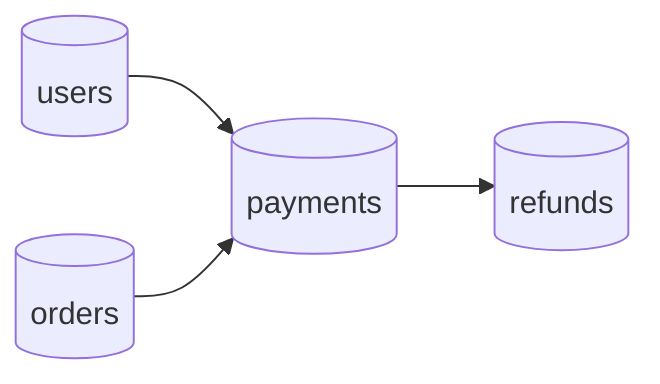
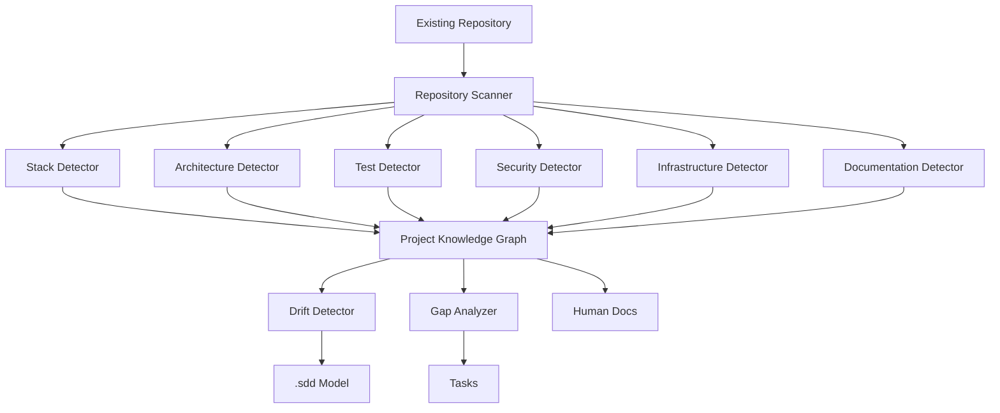

next

# PHASE 23 — PROJECT DISCOVERY & REVERSE-ENGINEERING ENGINE

Bu phase sənin sisteminin ən vacib xüsusiyyətlərindən birini həll edir:

> **AI yalnız `.sdd`-yə baxıb project yaratmamalıdır; mövcud project-i də oxuyub onun real vəziyyətini `.sdd` modelinə çıxara bilməlidir.**

Beləliklə iki əsas rejimimiz olacaq:

```text
GREENFIELD
Yeni project
    ↓
Business input
    ↓
AI Architecture
    ↓
.sdd
    ↓
Code
```

və:

```text
BROWNFIELD
Mövcud project
    ↓
Source Code
    ↓
Discovery
    ↓
Reverse Engineering
    ↓
.sdd
    ↓
Docs
    ↓
AI understands project
```

---

# 23.1. Əsas problem

Mövcud project-də çox vaxt belə olur:

```text
source/
├── BE/
├── FE/
├── MD/
├── DB/
└── infrastructure/
```

amma heç kim dəqiq bilmir:

```text
Bu modul nə edir?
Niyə belə yazılıb?
Hansı taskdan yaranıb?
Hansı qərara əsaslanır?
Hansı test bunu qoruyur?
Hansı infrastructure buna bağlıdır?
```

Discovery Engine-in işi məhz bunu tapmaqdır.

---

# 23.2. Discovery root

```text
.sdd/
└── discovery/
    ├── INDEX.sdd
    ├── rules.sdd
    ├── scanners.sdd
    ├── detectors.sdd
    ├── mapping.sdd
    ├── confidence.sdd
    ├── conflicts.sdd
    └── baseline.sdd
```

---

# 23.3. Discovery prinsip

Əsas qayda:

```text
SOURCE CODE
    ↓
OBSERVE
    ↓
INFER
    ↓
VALIDATE
    ↓
MODEL
```

AI source code-dan məlumat çıxarır.

Amma **təxmin etdiyi şeyi fact kimi yazmır.**

---

# 23.4. Fact classification

Discovery nəticələri:

```text
FACT
INFERRED
UNKNOWN
CONFLICT
```

### FACT

Birbaşa source-dan sübut olunur.

### INFERRED

Koddan məntiqi nəticə çıxarılıb.

### UNKNOWN

Məlumat yoxdur.

### CONFLICT

`.sdd` ilə source fərqlidir.

---

# 23.5. Confidence

Hər discovery nəticəsi:

```text
HIGH
MEDIUM
LOW
```

confidence ala bilər.

Məsələn:

```text
Runtime:
  Docker

Evidence:
  Dockerfile
  docker-compose.yml

Confidence:
  HIGH
```

---

# 23.6. Discovery heç nəyi avtomatik dəyişmir

Ən vacib təhlükəsizlik qaydası:

```text
Analyze
≠
Modify
```

Discovery mərhələsində agent:

```text
READ
SEARCH
PARSE
ANALYZE
```

edir.

Source code-a dəyişiklik etmir.

---

# 23.7. Discovery workflow

```text
/sdd analyze
```

işləyəndə:

```text
Repository
 ↓
Structure Scan
 ↓
Stack Detection
 ↓
Architecture Detection
 ↓
Dependency Detection
 ↓
Domain Detection
 ↓
Testing Detection
 ↓
Security Detection
 ↓
Infrastructure Detection
 ↓
Documentation Detection
 ↓
Workflow Detection
 ↓
.sdd Mapping
 ↓
Conflict Report
```

---

# 23.8. Step 1 — Repository scan

Əvvəl directory tree alınır:

```text
BE/
FE/
MD/
DB/
infra/
docker/
.github/
docs/
```

Sonra agent bunları kateqoriyalara ayırır.

---

# 23.9. Source classification

Məsələn:

```text
BE/
```

aşağıdakı səbəblə backend kimi müəyyən edilir:

```text
go.mod
*.go
cmd/
internal/
```

və:

```text
FE/
```

məsələn:

```text
package.json
vite.config.ts
src/
```

ilə frontend.

---

# 23.10. Stack detection

Agent:

```text
Language
Framework
Runtime
Database
Cache
Queue
Testing
CI/CD
Container
Cloud
```

tapır.

Məsələn:

```text
BE:
  Go
  Gin

FE:
  React
  TypeScript

MD:
  React Native

DB:
  PostgreSQL

Cache:
  Redis

CI:
  GitHub Actions

Container:
  Docker
```

---

# 23.11. Stack confidence

```text
Go:
  FACT / HIGH

React:
  FACT / HIGH

Redis:
  INFERRED / MEDIUM
```

Redis məsələn source-da client var, amma runtime configuration görünmürsə confidence aşağı ola bilər.

---

# 23.12. Framework detection

AI sadəcə filename-a güvənməməlidir.

Məsələn Go project:

```text
go.mod
```

var.

Amma framework:

```text
Gin
Fiber
Echo
Chi
net/http
```

ola bilər.

Agent dependency graph-dan müəyyən edir.

---

# 23.13. Dependency graph

Discovery:

```text
go.mod
package.json
Podfile
pubspec.yaml
requirements.txt
composer.json
```

oxuyur.

Sonra:

```text
Project
 ↓
Dependencies
 ↓
Frameworks
 ↓
Libraries
 ↓
Versions
 ↓
Vulnerabilities
```

çıxarır.

---

# 23.14. Architecture detection

Source-dan:

```text
Handler
Controller
Service
Repository
Model
Worker
Queue
Event
```

münasibətlərini çıxarır.

Məsələn:

```text
HTTP
 ↓
Handler
 ↓
Service
 ↓
Repository
 ↓
PostgreSQL
```

---

# 23.15. Architecture mismatch

`.sdd` deyir:

```text
Architecture:
  Modular Monolith
```

Source isə:

```text
microservices/
```

göstərir.

Discovery:

```text
CONFLICT
```

yaradır.

Agent dərhal `.sdd`-ni dəyişmir.

---

# 23.16. Domain discovery

Source:

```text
internal/
├── users/
├── payments/
├── orders/
├── notifications/
```

AI bunu:

```text
Domain:
  users

Domain:
  payments

Domain:
  orders

Domain:
  notifications
```

kimi modelləşdirir.

---

# 23.17. Domain boundary detection

Əsas məqsəd sadəcə qovluqları tapmaq deyil.

Agent baxır:

```text
payments
 ↓
users
 ↓
orders
```

arasında dependency-lərə.

Məsələn:

```text
payments → users
orders → payments
```

Bu artıq domain graph yaradır.

---

# 23.18. Circular dependency detection

```text
payments
 ↓
orders
 ↓
payments
```

tapılarsa:

```text
ARCH-CYCLE
```

yaradılır.

Bu architecture riskidir.

---

# 23.19. Database discovery

Agent:

```text
migrations/
schema/
models/
queries/
repositories/
```

araşdırır.

Sonra:

```text
Users
Payments
Orders
Refunds
```

entity-ləri çıxarır.

---

# 23.20. Database relationship graph



Bu diagram `.sdd` modelinə bağlana bilər.

---

# 23.21. API discovery

Agent:

```text
routes
handlers
controllers
OpenAPI
Swagger
GraphQL
```

tapır.

Məsələn:

```text
POST /payments/refund
GET /payments/{id}
```

və onları source component-lərinə bağlayır.

---

# 23.22. Test discovery

Tapılır:

```text
unit
integration
BDD
E2E
UI
security
load
```

və framework:

```text
Go test
Playwright
Cypress
Jest
Vitest
Flutter test
```

və s.

---

# 23.23. Test coverage map

```text
PaymentService
    ├── unit_test
    ├── integration_test
    ├── BDD
    ├── E2E
    └── security_test
```

Əgər yalnız unit test varsa:

```text
CoverageRisk:
  MEDIUM
```

ola bilər.

---

# 23.24. Security discovery

Agent axtarır:

```text
Authentication
Authorization
RBAC
JWT
OAuth
CSRF
CORS
Rate limiting
Input validation
Encryption
Secrets
Audit logs
```

Sonra security model yaradır.

---

# 23.25. Security gap detection

Məsələn:

```text
Authentication:
  YES

Authorization:
  UNKNOWN

RateLimit:
  NO

AuditLog:
  YES
```

Discovery:

```text
SECURITY_GAP:
  Rate limiting missing
```

yaradır.

---

# 23.26. Infrastructure discovery

Agent:

```text
Dockerfile
docker-compose
Kubernetes
Terraform
Ansible
Nginx
CI/CD
Cloud configuration
```

araşdırır.

Məsələn:

```text
Docker
GitHub Actions
Nginx
VPS
```

tapılır.

---

# 23.27. Environment discovery

```text
.env.example
docker-compose
CI variables
deployment scripts
```

ilə:

```text
LOCAL
TEST
STAGING
PRODUCTION
```

fərqləndirilir.

---

# 23.28. Cloud detection

Agent:

```text
AWS
Azure
GCP
VPS
Bare metal
Unknown
```

tapır.

Məsələn:

```text
terraform/aws/
```

→ AWS.

Əgər:

```text
docker-compose.yml
nginx/
deploy.sh
```

var, amma cloud provider yoxdur:

```text
Infrastructure:
  Generic VPS / Unknown
```

---

# 23.29. Runtime discovery

Agent mümkün qədər runtime-u da analiz edir:

```text
ports
services
containers
healthchecks
environment
dependencies
```

Məsələn:

```text
API :8080
Postgres :5432
Redis :6379
```

---

# 23.30. Documentation discovery

Mövcud:

```text
README
docs/
ADR
architecture/
wiki
```

tapılır.

Sonra:

```text
DOC
 ↓
SOURCE
```

mapping edilir.

---

# 23.31. Existing `.sdd` discovery

Əgər project-də artıq:

```text
.sdd/
```

varsa, agent əvvəl onu oxuyur.

Sonra:

```text
.sdd
vs
source
```

müqayisə edilir.

---

# 23.32. Existing `.sdd` + source

```text
          .sdd
           │
           │ compare
           ↓
         SOURCE
           │
       ┌───┴───┐
       ↓       ↓
     MATCH   CONFLICT
```

MATCH:

```text
VALID
```

CONFLICT:

```text
DRIFT
```

---

# 23.33. Drift types

```text
STACK_DRIFT
ARCHITECTURE_DRIFT
TASK_DRIFT
DOC_DRIFT
SECURITY_DRIFT
TEST_DRIFT
INFRA_DRIFT
DECISION_DRIFT
```

---

# 23.34. Example

`.sdd`:

```text
Cache:
  Redis
```

Source:

```text
Redis + Memcached
```

Discovery:

```text
STACK_DRIFT
```

Agent soruşmur:

> Redis-i silim?

Sadəcə:

```text
Detected:
  Redis
  Memcached

.sdd:
  Redis

Conflict:
  Memcached not documented
```

çıxarır.

---

# 23.35. Discovery report

Human üçün:

```text
docs/discovery/
└── project-analysis.md
```

AI üçün:

```text
.sdd/discovery/
```

Məsələn:

```text
Project:
  Payment Platform

Detected:
  Go
  React
  React Native
  PostgreSQL
  Redis
  Docker

Architecture:
  Modular Monolith

Domains:
  Users
  Payments
  Orders

Tests:
  Unit
  Integration
  E2E

Risks:
  Missing load tests
  Missing rate limiting
```

---

# 23.36. Discovery score

Project-in nə qədər yaxşı başa düşüldüyünü ölçək:

```text
DiscoveryScore:
  87%
```

Məsələn:

```text
Structure       100%
Stack            98%
Architecture     90%
Testing          80%
Security         70%
Infrastructure   95%
Documentation    75%
```

---

# 23.37. Unknown budget

AI project-i analiz edib:

```text
Unknown:
  13%
```

deyə bilər.

Bu çox vacibdir.

Çünki sistem:

> “Mən hər şeyi bilirəm.”

deməməlidir.

---

# 23.38. Discovery quality gate

Project analysis tamamlananda:

```text
DISCOVERY COMPLETE
```

yalnız əgər:

```text
Structure known
Stack known
Architecture sufficiently known
Critical dependencies known
Security baseline known
Testing baseline known
```

olmalıdır.

---

# 23.39. Greenfield vs Brownfield

Root:

```text
.sdd/project/mode.sdd
```

məsələn:

```text
Mode:
  GREENFIELD
```

və ya:

```text
Mode:
  BROWNFIELD
```

və ya:

```text
Mode:
  HYBRID
```

---

# 23.40. Hybrid

Ən maraqlı rejim:

```text
Existing Laravel monolith
        +
New requirements
        ↓
HYBRID
```

AI mövcud kodu qoruyur, yeni architecture-i onun üstünə qurur.

---

# 23.41. Sənin Laravel → Microservice nümunən

Discovery görür:

```text
Laravel
 ↓
vendor/
 ↓
large dependency tree
```

və microservice migration planında:

```text
Monolith
 ↓
Extract bounded context
 ↓
Build independent service
```

analiz edir.

Amma `vendor/`-u hər microservice-ə copy etmək əvəzinə:

```text
dependency
 ↓
service build image
 ↓
runtime image
```

modelini tövsiyə edə bilər.

Bu artıq **architecture optimization** phase-lərinin input-u olacaq.

---

# 23.42. Dependency footprint analysis

Agent:

```text
vendor/
node_modules/
Go dependencies
Docker layers
```

analiz edib:

```text
Size
Runtime dependency
Build dependency
Shared dependency
Unused dependency
```

ayırır.

---

# 23.43. Build vs runtime dependency

Məsələn:

```text
Build:
  compiler
  dev dependencies
  source

Runtime:
  binary
  required libraries
```

Agent multi-stage Docker modelini təklif edə bilər.

Bu sənin dediyin:

> “vendoru image edib başqa layer kimi istifadə etmək”

ideyasına da bağlanır.

---

# 23.44. Architecture recommendation

Discovery-dən sonra agent:

```text
CURRENT
```

və:

```text
RECOMMENDED
```

ayrılığını saxlamalıdır.

Məsələn:

```text
Current:
  Laravel monolith

Recommended:
  Modular monolith

Future:
  Selective service extraction
```

Birbaşa:

```text
MICROSERVICES
```

deməməlidir.

---

# 23.45. Complexity calibration

Ən vacib policy:

```text
Project size
+
Traffic
+
Team
+
Business criticality
+
Operational maturity
```

architecture seçiminə təsir edir.

Kiçik project üçün:

```text
Modular Monolith
```

çox vaxt daha doğru ola bilər.

1M DAU və yüksək reliability tələb edən project üçün:

```text
Distributed architecture
```

lazım ola bilər.

Agent bunu avtomatik qiymətləndirəcək.

---

# 23.46. Discovery → Skills

Discovery nəticəsində:

```text
Go
PostgreSQL
Redis
Docker
React
React Native
Playwright
```

tapılır.

Agent:

```text
required skills
```

seçir.

Amma bütün skill-ləri aktivləşdirmir.

---

# 23.47. Discovery → Docs

Mövcud project üçün:

```text
docs/
```

çatışmırsa, agent:

```text
documentation gaps
```

çıxarır.

Məsələn:

```text
Missing:
  Architecture
  Security
  Deployment
  Incident Runbook
```

və bunları task-a çevirə bilər.

---

# 23.48. Discovery → Tasks

Məsələn:

```text
SECURITY_GAP:
  Missing rate limit
```

↓

```text
SEC-101
```

və:

```text
DOC_GAP:
  Missing deployment documentation
```

↓

```text
DOC-201
```

Beləliklə discovery sadəcə report deyil.

**Actionable backlog** yaradır.

---

# 23.49. Discovery → Baseline

Ən sonda:

```text
.sdd/discovery/baseline.sdd
```

yaradılır.

Bu:

> Project-in discovery anındakı vəziyyətinin snapshot-ıdır.

Sonrakı analizlər bununla müqayisə edilir.

---

# 23.50. Architecture



---

# 23.51. Ən vacib prinsip

Discovery Engine heç vaxt:

```text
source → guess → overwrite .sdd
```

etməməlidir.

Doğru:

```text
source
 ↓
evidence
 ↓
inference
 ↓
confidence
 ↓
comparison
 ↓
human/agent decision
 ↓
.sdd update
```

---

# 23.52. Phase 23 nəticəsi

Artıq agent iki dünyanı başa düşür:

```text
GREENFIELD
```

```text
Idea
 ↓
Design
 ↓
.sdd
 ↓
Implementation
```

və:

```text
BROWNFIELD
```

```text
Existing Code
 ↓
Discovery
 ↓
Reverse Engineering
 ↓
.sdd
 ↓
Documentation
 ↓
Tasks
```

Bu isə sənin əvvəl dediyin:

> **“Mən `.sdd` qovluğunu project-ə əlavə edirəm və sadəcə `layihəni analiz et` deyirəm.”**

əmrinin arxasındakı real mexanizmdir.

---

# Progress

```text
PHASE 13  Task Engine                    ✅
PHASE 14  Security Engine                ✅
PHASE 15  Testing Engine                 ✅
PHASE 16  Architecture & Decision Engine ✅
PHASE 17  Stack & Technology Engine      ✅
PHASE 18  SDLC / Workflow Orchestrator   ✅
PHASE 19  Observability / Incident       ✅
PHASE 20  Documentation / Knowledge      ✅
PHASE 21  Context Router / Token Engine  ✅
PHASE 22  Agent Runtime / Tool Engine    ✅
PHASE 23  Project Discovery Engine       ✅
```

## Növbəti — PHASE 24

**ENGINEERING KNOWLEDGE GRAPH & TRACEABILITY ENGINE**

Burada artıq bütün sistemdəki:

```text
PROMPT
 ↓
REQUIREMENT
 ↓
DECISION
 ↓
TASK
 ↓
WORKFLOW
 ↓
SKILL
 ↓
CODE
 ↓
BDD
 ↓
TEST
 ↓
SECURITY
 ↓
INFRASTRUCTURE
 ↓
DEPLOYMENT
 ↓
RUNTIME
 ↓
INCIDENT
 ↓
DOCUMENTATION
```

elementlərini **bir-biri ilə əlaqələndirən əsas graph** quracağıq.

Bu phase xüsusilə sənin:

> **“Zəncir hara gedib, harada qırılıb, hansı qərardan yaranıb, hansı kodda işləyir və problem çıxanda kim baxmalıdır?”**

problemini tam həll edən əsas backbone olacaq.
