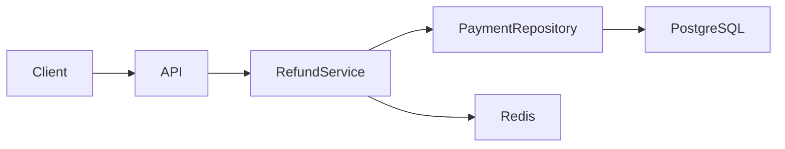

next
# PHASE 24 — ENGINEERING KNOWLEDGE GRAPH & TRACEABILITY ENGINE

Bu phase bütün `.sdd` sisteminin **əsas backbone-u** olacaq.

Əvvəlki phase-lərdə ayrı-ayrı sistemlər yaratdıq. İndi onları bir-birinə bağlayırıq.

Əsas fikir:

> **Heç bir iş “tək fayl” olmamalıdır. Hər işin haradan gəldiyi, nə yaratdığı, hansı kodu dəyişdirdiyi, hansı testlə qorunduğu və problem yarananda harada qırıldığı izlənə bilməlidir.**

---

# 24.1. Əsas chain

Sistemin əsas əlaqəsi:

```text
INPUT
  ↓
REQUIREMENT
  ↓
DECISION
  ↓
TASK
  ↓
WORKFLOW
  ↓
SKILL
  ↓
CODE
  ↓
BDD
  ↓
TEST
  ↓
SECURITY
  ↓
INFRA
  ↓
DEPLOYMENT
  ↓
RUNTIME
  ↓
INCIDENT
```

Amma bu **tək istiqamətli chain deyil**.

Məsələn:

```text
INCIDENT
   ↓
CODE
   ↓
TASK
   ↓
DECISION
```

geri qayıtmaq da mümkün olmalıdır.

---

# 24.2. Knowledge Graph

Yeni struktur:

```text
.sdd/
└── graph/
    ├── INDEX.sdd
    ├── nodes.sdd
    ├── relations.sdd
    ├── traceability.sdd
    ├── impact.sdd
    ├── ownership.sdd
    ├── dependencies.sdd
    ├── coverage.sdd
    └── drift.sdd
```

Burada məqsəd hər şeyi bir böyük fayla yığmaq deyil.

Bu fayllar graph-ın **qaydalarını və indekslərini** saxlayır.

---

# 24.3. Node modeli

Sistemdə hər əsas obyekt node olacaq:

```text
PROMPT
REQUIREMENT
DECISION
TASK
WORKFLOW
SKILL
PROJECT
DOMAIN
MODULE
COMPONENT
CODE
BDD
TEST
SECURITY
INFRA
DEPLOYMENT
RUNTIME
INCIDENT
DOCUMENT
```

---

# 24.4. Node ID

Hər node standart ID alır:

```text
PROMPT-019
REQ-042
DEC-017
PAY-1023
WF-DEV-001
SKILL-IDEMPOTENCY
CODE-PAY-REFUND
BDD-PAY-1023
TEST-PAY-1023
SEC-004
INFRA-REDIS-01
INC-2026-019
DOC-PAY-REFUND
```

Bu ID-lər sistemin **qısa dili** olacaq.

AI uzun cümlə əvəzinə:

```text
PAY-1023
```

görüb həmin task-ın bütün əlaqələrini graph-dan tapır.

Bu həm insan üçün oxunaqlıdır, həm də token istifadəsini azaldır.

---

# 24.5. Relation modeli

Node-lar arasında standart əlaqələr:

```text
CREATED_BY
IMPLEMENTS
DEPENDS_ON
BLOCKED_BY
USES
TESTED_BY
VERIFIED_BY
SECURED_BY
DEPLOYED_BY
RUNS_ON
DOCUMENTED_BY
CAUSED_BY
AFFECTS
OWNS
RELATED_TO
REPLACES
SUPERSEDES
CONFLICTS_WITH
```

---

# 24.6. Sənin task nümunən

Məsələn:

```text
PAY-1023
```

graph-da:

```text
PROMPT-019
      │
      ▼
   PAY-1023
      │
      ├── DEPENDS_ON → PAY-0999
      │
      ├── USES → SKILL-IDEMPOTENCY
      │
      ├── IMPLEMENTS → CODE-PAY-REFUND
      │
      ├── VERIFIED_BY → TEST-PAY-1023
      │
      ├── SECURED_BY → SEC-004
      │
      └── DOCUMENTED_BY → DOC-PAY-REFUND
```

---

# 24.7. Task dependency artıq daha güclü olur

Sənin əvvəl verdiyin:

```text
1000

1001 → 1011 → 1023
```

modeli graph-a çevrilir:

```text
1000

1001
  ↓
1011
  ↓
1023
```

Agent `1023` seçəndə:

```text
1023
 ↓
1011
 ↓
1001
```

oxuyur.

Sonra **dependency order** ilə icra edir:

```text
1001
 ↓
1011
 ↓
1023
```

---

# 24.8. Əsas task qaydası

Task execution:

```text
Requested Task
      ↓
Find Dependencies
      ↓
Resolve Dependency Tree
      ↓
Find Unblocked Root Tasks
      ↓
Execute Smallest Ready Task
      ↓
Verify
      ↓
Unlock Next
```

Beləliklə task numbering yalnız ID-dir.

**İcra sırası ID-dən yox, dependency graph-dan gəlir.**

---

# 24.9. Cycle detection

Əgər:

```text
1001 → 1011
1011 → 1023
1023 → 1001
```

olarsa:

```text
TASK-CYCLE
```

və execution dayanır.

Agent:

```text
Cannot determine safe execution order.
```

deyib human-a ötürür.

---

# 24.10. Impact analysis

Ən vacib funksiyalardan biri:

> “Bu kodu dəyişsəm nə təsirlənəcək?”

Məsələn:

```text
repository.go
```

dəyişir.

Graph:

```text
repository.go
    ↓
PaymentService
    ↓
Refund API
    ↓
PAY-1023
    ↓
BDD
    ↓
Integration Test
    ↓
Security Test
```

çıxara bilər.

---

# 24.11. Reverse impact

Əksinə:

> “Bu incident hansı kodlara bağlıdır?”

```text
INC-2026-019
      ↓
SEC-004
      ↓
PAY-1023
      ↓
refund.go
      ↓
PaymentService
```

---

# 24.12. Blast radius

Hər dəyişiklik üçün:

```text
BLAST RADIUS
```

hesablanır.

Məsələn:

```text
Changed:
  PaymentRepository

Affected:
  4 services
  8 APIs
  12 tests
  2 workflows

Risk:
  HIGH
```

---

# 24.13. Risk score

Graph aşağıdakılara əsasən risk hesablaya bilər:

```text
Dependency count
Criticality
Security sensitivity
Data sensitivity
Traffic
Number of consumers
Production exposure
Test coverage
```

Məsələn:

```text
Risk = HIGH
```

çünki:

```text
Payment
+
Production
+
High traffic
+
Low test coverage
```

---

# 24.14. Coverage graph

Artıq sadəcə test coverage faizimiz olmayacaq.

Məsələn:

```text
PAY-1023
 ├── BDD ✅
 ├── Unit ✅
 ├── Integration ✅
 ├── E2E ❌
 ├── Security ✅
 └── Load ❌
```

Human dərhal görür:

> İş functional olaraq test olunub, amma load test yoxdur.

---

# 24.15. Security coverage

Eyni model security üçün:

```text
PAY-1023
 ├── Authentication ✅
 ├── Authorization ✅
 ├── Input Validation ✅
 ├── Idempotency ✅
 ├── Rate Limit ❌
 ├── Abuse Test ❌
 └── Pentest ❌
```

---

# 24.16. Infrastructure coverage

```text
PAY-1023
   ↓
Infrastructure
   ├── Docker ✅
   ├── CI/CD ✅
   ├── Monitoring ✅
   ├── Backup ✅
   ├── Load Test ❌
   └── DDoS Strategy ❌
```

Beləliklə task yalnız developer işi olmur.

---

# 24.17. Ownership

Hər node-un owner-i ola bilər:

```text
OWNER:
  BUSINESS
  BACKEND
  FRONTEND
  MOBILE
  QA
  SECURITY
  DEVOPS
  DBA
  SUPPORT
```

Məsələn:

```text
SEC-004
Owner:
  SECURITY
```

və:

```text
PAY-1023
Owner:
  BACKEND
```

---

# 24.18. Problem çıxanda kim işləməlidir?

Məsələn:

```text
INC-019
```

graph:

```text
INC-019
 ↓
PAY-1023
 ↓
PAYMENT
 ↓
SEC-004
```

Ownership:

```text
Primary:
  Backend

Secondary:
  Security

Infrastructure:
  DevOps
```

Support komandası isə sənəddən:

```text
Who should handle this?
```

cavabını tapa bilər.

Bu sənin əvvəlki **Human Docs role separation** istəyinə birbaşa bağlanır.

---

# 24.19. Human documentation mapping

Graph:

```text
CODE
 ↓
DOMAIN
 ↓
DOCUMENT
```

Məsələn:

```text
BE/internal/payments/refund.go
        ↓
Payment Domain
        ↓
docs/business/payments.md
docs/developer/payments.md
docs/support/payments.md
docs/infrastructure/payments.md
```

Kodun yanında `.md` saxlanılmır.

Bu sənin istədiyin clean project prinsipini qoruyur.

---

# 24.20. AI `.sdd` sənədini tapır

Məsələn source:

```text
BE/internal/payments/refund.go
```

AI:

```text
path
 ↓
graph
 ↓
CODE-PAY-REFUND
 ↓
related docs
 ↓
related tasks
 ↓
skills
 ↓
tests
```

tapır.

Yəni AI bütün repository-ni hər dəfə oxumağa məcbur deyil.

---

# 24.21. Token optimization

Bu sistemin ən böyük üstünlüklərindən biri burada gəlir.

Pis model:

```text
Read whole project
Read all docs
Read all skills
Read all tasks
Read all tests
```

Çox token.

Yeni model:

```text
User request
 ↓
TASK ID
 ↓
GRAPH
 ↓
Affected nodes
 ↓
Relevant context
```

Məsələn yalnız:

```text
PAY-1023
SKILL-IDEMPOTENCY
CODE-PAY-REFUND
BDD-PAY-1023
TEST-PAY-1023
SEC-004
```

oxunur.

---

# 24.22. Context budget

Graph router deyə bilər:

```text
Context budget:
  12k tokens
```

və prioritet:

```text
P0:
  Task

P1:
  Dependencies

P2:
  Relevant skills

P3:
  Code

P4:
  Tests

P5:
  Docs
```

Lazım olmayan şey context-ə girmir.

---

# 24.23. Graph traversal modes

Agent müxtəlif suallar üçün müxtəlif traversal istifadə edir.

### IMPLEMENT

```text
TASK
 ↓
DEPENDENCIES
 ↓
SKILLS
 ↓
CODE
 ↓
TEST
```

### DEBUG

```text
INCIDENT
 ↓
RUNTIME
 ↓
CODE
 ↓
TASK
 ↓
DECISION
```

### SECURITY

```text
SECURITY ISSUE
 ↓
CODE
 ↓
API
 ↓
INFRA
 ↓
TEST
```

### SUPPORT

```text
INCIDENT
 ↓
DOC
 ↓
RUNBOOK
 ↓
OWNER
```

---

# 24.24. Decision trace

Əvvəlki qərarlar da graph-da olur.

Məsələn:

```text
DEC-017
```

deyir:

```text
Architecture:
  Modular Monolith
```

və:

```text
PROJECT
   ↓
DEC-017
   ↓
ARCHITECTURE
   ↓
MODULES
```

Sonradan biri:

> Niyə microservice deyil?

soruşanda agent qərarın tarixçəsini tapır.

---

# 24.25. Decision superseding

Yeni qərar:

```text
DEC-024
```

köhnəni əvəz edir:

```text
DEC-024
   ↓
SUPERSEDES
   ↓
DEC-017
```

Beləliklə köhnə qərar silinmir.

History qalır.

---

# 24.26. Historical trace

Bu çox vacibdir.

Sistem:

```text
CURRENT
```

və:

```text
HISTORY
```

ayırmalıdır.

Məsələn:

```text
Current architecture:
  Modular Monolith

Historical:
  DEC-001 → Monolith
  DEC-017 → Modular Monolith
```

---

# 24.27. Drift detection

Graph source və `.sdd` arasında müqayisə edir.

```text
.sdd:
  React

source:
  Vue
```

↓

```text
STACK_DRIFT
```

və:

```text
decision:
  DEC-031
```

ilə dəyişiklik təsdiqlənibsə:

```text
VALID_DRIFT
```

Əgər qərar yoxdur:

```text
UNEXPLAINED_DRIFT
```

---

# 24.28. Unexplained change

Bu sistemdə çox faydalı olacaq:

```text
Source changed
       ↓
Graph changed
       ↓
No task
No decision
No workflow
       ↓
UNTRACEABLE CHANGE
```

Bu artıq ciddi engineering riskidir.

---

# 24.29. Traceability score

Project üçün:

```text
Traceability:
  91%
```

hesablana bilər.

Məsələn:

```text
Code → Task             95%
Task → Requirement      98%
Task → Test             90%
Task → Security        85%
Decision → Code         88%
Incident → Code         80%
Docs → Code             92%
```

---

# 24.30. Broken chain detection

Ən vacib audit:

```text
PROMPT
 ↓
TASK
 ↓
CODE
 ↓
TEST
```

amma:

```text
TASK
 ↓
CODE
 ↓
❌ TEST
```

onda:

```text
TRACE-BROKEN
```

çıxır.

---

# 24.31. Broken workflow

Məsələn:

```text
BDD
 ↓
CODE
 ↓
TEST
 ↓
SECURITY
 ↓
DEPLOY
```

Security keçilməyibsə:

```text
WORKFLOW-BROKEN
```

və production deploy bloklana bilər.

---

# 24.32. Graph as source of truth

Burada vacib qərar:

> Graph bütün məlumatın özü deyil.

Əsas source-lar öz yerlərində qalır:

```text
Task → tasks/
Decision → decisions/
Skill → skills/
Code → project source
Docs → docs/
```

Graph yalnız:

```text
RELATIONSHIP
INDEX
TRACE
IMPACT
```

saxlayır.

Bu project-in təmiz qalmasını qoruyur.

---

# 24.33. Yəni `.sdd` içində duplicate yaratmırıq

Pis:

```text
.sdd/
 ├── code-copy/
 ├── docs-copy/
 └── tests-copy/
```

Yox.

Düzgün:

```text
.sdd/
├── tasks/
├── decisions/
├── skills/
├── workflow/
├── graph/
└── project/
```

Graph source fayllara reference verir.

---

# 24.34. Human view vs AI view

Eyni məlumat iki formada görünür.

### AI

```text
PAY-1023
DEPENDS_ON: PAY-0999
USES: SKILL-IDEMPOTENCY
TESTED_BY: TEST-1023
```

### Human

```text
Refund əməliyyatının eyni request üçün ikinci dəfə
icra edilməsinin qarşısını almaq.

Bu iş:
- Payment backend-ə aiddir
- Idempotency qaydasından istifadə edir
- BDD və integration test ilə qorunur
- Security testdən keçir
```

---

# 24.35. Diagram generation

Graph-dan avtomatik diagram yaradıla bilər.

Məsələn:



Amma diagram əl ilə source-of-truth deyil.

Graph dəyişəndə diagram yenidən generate edilir.

---

# 24.36. Diagram types

Sistem standart diagram növləri tanımalıdır:

```text
SYSTEM
ARCHITECTURE
DOMAIN
DATA
SEQUENCE
DEPLOYMENT
NETWORK
SECURITY
DEPENDENCY
WORKFLOW
TRACEABILITY
```

Agent uyğun olanı seçir.

---

# 24.37. Architecture → diagram

Əgər:

```text
Architecture:
  Modular Monolith
```

onda:

```text
System Diagram
Domain Diagram
Dependency Diagram
```

yaradıla bilər.

Əgər:

```text
Architecture:
  Microservices
```

onda:

```text
Service Map
Network Diagram
Deployment Diagram
Data Flow
```

daha vacib olur.

---

# 24.38. Scale-aware graph

Project:

```text
DAU
MAU
RPS
Storage
Traffic
```

kimi metric-ləri də graph-a bağlaya bilər.

Məsələn:

```text
PROJECT
 ↓
SCALE
 ├── DAU: 1M
 ├── MAU: 5M
 ├── Peak RPS: 20k
 └── Storage: 8TB
```

Architecture decision:

```text
DEC-042
```

bu scale context-ə bağlanır.

---

# 24.39. Nəticədə AI nə anlayır?

User:

> “Payment sistemini böyüt.”

AI yalnız cümləni analiz etmir.

Graph-dan:

```text
Project:
  Payment Platform

Current:
  Modular Monolith

DAU:
  1M

DB:
  PostgreSQL

Cache:
  Redis

Known bottleneck:
  PaymentRepository

Security:
  PCI-sensitive

Existing decision:
  DEC-017
```

tapır.

Sonra architecture recommendation verir.

---

# 24.40. Phase 24-ün əsas nəticəsi

Artıq sistemimiz:

```text
INPUT
 ↓
KNOWLEDGE
 ↓
DECISION
 ↓
TASK
 ↓
WORKFLOW
 ↓
SKILL
 ↓
CODE
 ↓
TEST
 ↓
SECURITY
 ↓
INFRA
 ↓
RUNTIME
 ↓
INCIDENT
```

hamısını **bir əlaqəli engineering model** kimi görə bilir.

---

# Progress

```text
PHASE 13  Task Engine                    ✅
PHASE 14  Security Engine                ✅
PHASE 15  Testing Engine                 ✅
PHASE 16  Architecture & Decision Engine ✅
PHASE 17  Stack & Technology Engine      ✅
PHASE 18  SDLC / Workflow Orchestrator   ✅
PHASE 19  Observability / Incident       ✅
PHASE 20  Documentation / Knowledge      ✅
PHASE 21  Context Router / Token Engine  ✅
PHASE 22  Agent Runtime / Tool Engine    ✅
PHASE 23  Project Discovery Engine       ✅
PHASE 24  Knowledge Graph & Traceability ✅
```

## Növbəti — PHASE 25

**AUTOMATED QUALITY, SECURITY & RELEASE GATE ENGINE**

Burada sənin xüsusilə vurğuladığın:

```text
BDD
→ Code
→ TS/static checks
→ UI/E2E
→ Manual
→ Security
→ SAST
→ Dependency scan
→ DAST
→ Pentest
→ Load test
→ DDoS resilience
→ Infrastructure
→ Release
→ Production
```

axınını **bir universal gate sistemi** kimi quracağıq.

Ən vacibi də: BE, FE, MD, DB, QA, Security və DevOps ayrı-ayrı “dünyalar” olmayacaq; **bir taskın impact graph-ına görə hansı layer-lərin hansı test/gate-dən keçməli olduğunu AI özü müəyyən edəcək.**
