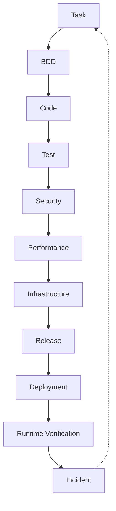

next

# PHASE 25 — AUTOMATED QUALITY, SECURITY & RELEASE GATE ENGINE

Bu phase-də artıq sistemin **“iş hazırdır” deməsi üçün nə baş verməlidir?** sualını standartlaşdırırıq.

Əsas prinsip:

> **Task bitməsi ≠ Release üçün hazır olması.**

Bir task kod səviyyəsində bitə bilər, amma BDD, security, performance, infrastructure və production readiness tamamlanmayıbsa release edilə bilməz.

---

# 25.1. Universal lifecycle

Sənin dediyin SDLC + STLC axınını belə modelləşdiririk:

```text
REQUIREMENT
    ↓
BDD
    ↓
IMPLEMENTATION
    ↓
STATIC QUALITY
    ↓
UNIT TEST
    ↓
INTEGRATION TEST
    ↓
E2E / UI
    ↓
SECURITY
    ↓
PERFORMANCE
    ↓
INFRASTRUCTURE
    ↓
REVIEW
    ↓
RELEASE
    ↓
DEPLOY
    ↓
RUNTIME VERIFY
```

Amma **hər project üçün bütün mərhələlər məcburi deyil.**

---

# 25.2. Ən vacib qayda — adaptive gates

Məsələn kiçik landing page:

```text
BDD
 ↓
Code
 ↓
Lint
 ↓
UI
 ↓
Release
```

Payment sistemi:

```text
BDD
 ↓
Code
 ↓
Unit
 ↓
Integration
 ↓
E2E
 ↓
Security
 ↓
SAST
 ↓
DAST
 ↓
Load
 ↓
Pentest
 ↓
Release
```

Mobile app:

```text
BDD
 ↓
Code
 ↓
Unit
 ↓
Widget
 ↓
E2E
 ↓
Security
 ↓
Build
 ↓
Store/TestFlight
```

AI project-in context-inə görə gate seçir.

---

# 25.3. Gate engine

Yeni struktur:

```text
.sdd/
└── gates/
    ├── INDEX.sdd
    ├── policy.sdd
    ├── levels.sdd
    ├── quality.sdd
    ├── testing.sdd
    ├── security.sdd
    ├── performance.sdd
    ├── infrastructure.sdd
    ├── release.sdd
    ├── exceptions.sdd
    └── evidence.sdd
```

---

# 25.4. Gate nədir?

Gate sadəcə:

```text
TEST PASSED
```

deyil.

Gate:

```text
Condition
+
Evidence
+
Threshold
+
Owner
+
Decision
```

deməkdir.

Məsələn:

```text
SECURITY-GATE-004

Condition:
  No critical vulnerability

Evidence:
  SAST report

Threshold:
  Critical = 0

Owner:
  Security
```

---

# 25.5. Gate statusları

Standartlaşdırırıq:

```text
PENDING
RUNNING
PASSED
FAILED
BLOCKED
SKIPPED
WAIVED
EXPIRED
```

---

# 25.6. SKIPPED və WAIVED fərqi

Çox vacibdir.

### SKIPPED

Gate project üçün tətbiq olunmur.

```text
Mobile-only project:
  Infrastructure load balancer test
  → SKIPPED
```

### WAIVED

Gate tətbiq olunur, amma xüsusi qərarla keçilir.

```text
Pentest
→ WAIVED
Reason:
  Internal staging only

Approved:
  DEC-092
```

Beləliklə:

```text
SKIPPED ≠ WAIVED
```

---

# 25.7. Evidence

Hər gate nəticəsinin sübutu olmalıdır.

Məsələn:

```text
BDD-GATE
Evidence:
  test result

SECURITY-GATE
Evidence:
  SAST report

LOAD-GATE
Evidence:
  k6 report

DEPLOY-GATE
Evidence:
  deployment result
```

AI:

> “Bu gate keçib.”

deyəndə bunu sübut edə bilməlidir.

---

# 25.8. Gate chain

Məsələn:

```text
BDD-001
   ↓
CODE-001
   ↓
TEST-001
   ↓
SEC-001
   ↓
PERF-001
   ↓
RELEASE-001
```

Bir gate failure:

```text
TEST-001 ❌
```

sonrakıları:

```text
SEC-001
PERF-001
RELEASE-001
```

bloklaya bilər.

---

# 25.9. Critical gate

Bəzi gate-lər **hard blocker** olacaq.

Məsələn:

```text
CRITICAL SECURITY
```

failure:

```text
Release = BLOCKED
```

Amma:

```text
Documentation completeness = 90%
```

release-i mütləq bloklamaya bilər.

---

# 25.10. Gate severity

```text
BLOCKER
CRITICAL
HIGH
MEDIUM
LOW
INFO
```

Məsələn:

```text
Critical vulnerability:
  BLOCKER

Missing README:
  LOW
```

---

# 25.11. BDD Gate

Task başlamazdan əvvəl:

```text
Requirement
 ↓
BDD Scenario
```

olmalıdır.

Məsələn:

```gherkin
Feature: Refund idempotency

Scenario: Duplicate refund request
  Given a refund already exists
  When the same refund request is submitted
  Then a second refund must not be created
```

Gate:

```text
BDD-GATE
Status:
  PASSED
```

---

# 25.12. Implementation Gate

BDD olmadan code yazılıbsa:

```text
BDD:
  MISSING

Implementation:
  EXISTS
```

system bunu:

```text
PROCESS-VIOLATION
```

kimi qeyd edir.

Amma emergency task üçün exception mümkündür.

---

# 25.13. Static Quality Gate

Bütün stack-lər üçün uyğun skill çağırılır.

### Go

```text
gofmt
go vet
staticcheck
tests
```

### TypeScript

```text
eslint
tsc
tests
```

### Flutter

```text
dart analyze
flutter test
```

### React Native

```text
eslint
tsc
jest
```

AI stack-ə görə toolchain seçir.

---

# 25.14. Unit Gate

```text
UNIT-GATE
```

Məsələn:

```text
Tests:
  124

Passed:
  124

Failed:
  0
```

---

# 25.15. Integration Gate

Burada real dependency-lər yoxlanılır:

```text
API
 ↓
DB
 ↓
Redis
 ↓
Queue
```

Məsələn payment task üçün:

```text
PostgreSQL
Redis
Payment API
```

birlikdə test olunur.

---

# 25.16. E2E Gate

Frontend və mobile ayrıca nəzərə alınır.

```text
FE
 ↓
API
 ↓
BE
 ↓
DB
```

və:

```text
MD
 ↓
API
 ↓
BE
```

---

# 25.17. UI test gate

Stack-ə uyğun:

```text
Playwright
Cypress
Detox
Flutter integration
```

kimi testlər seçilir.

AI sadəcə “UI test et” demir.

Project skill registry-dən uyğun tool seçir.

---

# 25.18. Manual QA Gate

Manual test də graph-a daxil olur.

```text
TASK
 ↓
AUTO TEST
 ↓
MANUAL QA
```

Manual nəticə:

```text
PASSED
FAILED
BLOCKED
```

---

# 25.19. Security Gate

Bu sənin sistemində **birinci dərəcəli gate** olacaq.

Security:

```text
SAST
 ↓
Dependency Scan
 ↓
Secrets Scan
 ↓
DAST
 ↓
Security Tests
 ↓
Pentest
```

---

# 25.20. SAST

Source code scan:

```text
SQL Injection
XSS
Command Injection
Path Traversal
Unsafe crypto
```

və s.

---

# 25.21. Dependency security

```text
go.mod
package.json
pubspec.yaml
composer.json
```

və s. dependency-lər yoxlanılır.

Nəticə:

```text
CRITICAL = 0
HIGH = 0
```

kimi policy ola bilər.

---

# 25.22. Secrets gate

Axtarılır:

```text
API keys
Passwords
Tokens
Private keys
Cloud credentials
```

Source repository-də secret varsa:

```text
SECURITY-GATE ❌
```

---

# 25.23. DAST

Running application test edilir.

```text
Internet
 ↓
Application
 ↓
Attack simulation
```

Məsələn:

```text
Authentication
Authorization
Input validation
Session
API abuse
```

---

# 25.24. Pentest Gate

Pentest avtomatik testdən fərqlənir.

Gate:

```text
PENTEST
```

üçün:

```text
Scope
Tester
Date
Environment
Findings
Remediation
Retest
```

saxlanılır.

---

# 25.25. Pentest finding

Məsələn:

```text
PENTEST-004

Severity:
  HIGH

Finding:
  Broken authorization

Status:
  FIXED

Retest:
  PASSED
```

Graph:

```text
PENTEST-004
 ↓
SEC-004
 ↓
TASK-1088
 ↓
CODE
 ↓
TEST
```

---

# 25.26. Performance Gate

Sistem load test-i də context-ə görə seçir.

Məsələn:

```text
1M DAU
```

olan project üçün performance gate yüksək səviyyədə olur.

Kiçik admin paneldə isə minimal ola bilər.

---

# 25.27. Performance metrics

```text
RPS
P50
P95
P99
Error rate
CPU
Memory
DB latency
Cache hit rate
Queue latency
```

---

# 25.28. Example

```text
LOAD-GATE

Target:
  10,000 RPS

P95:
  < 200ms

Errors:
  < 0.1%

Result:
  PASSED
```

---

# 25.29. DDoS resilience

DDoS ayrıca gate olmalıdır.

AI:

```text
Internet exposure
+
Rate limiting
+
WAF
+
CDN
+
Load balancer
+
Autoscaling
```

analiz edir.

---

# 25.30. DDoS policy

Agent özü real DDoS hücumu həyata keçirməməlidir.

Bunun əvəzinə:

```text
authorized test environment
```

üçün:

```text
load simulation
rate-limit verification
capacity test
```

kimi controlled test planı yaradır.

Production üçün:

```text
DDoS provider protection
WAF
rate limiting
traffic filtering
```

yoxlanılır.

---

# 25.31. Infrastructure Gate

```text
Docker
CI/CD
Secrets
Networking
Healthcheck
Backup
Monitoring
Logging
```

yoxlanılır.

---

# 25.32. Deployment Gate

Məsələn VPS:

```text
Build
 ↓
Image
 ↓
Registry
 ↓
VPS
 ↓
Docker Compose
 ↓
Health Check
```

AWS:

```text
Build
 ↓
Registry
 ↓
ECS/EKS/etc.
 ↓
Load Balancer
 ↓
Health Check
```

GCP/Azure üçün skill registry-dən uyğun workflow seçilir.

---

# 25.33. Environment gates

```text
LOCAL
TEST
STAGING
PRODUCTION
```

hərəsinin öz gate-ləri ola bilər.

Production ən sərt səviyyədir.

---

# 25.34. Release Gate

Release yalnız:

```text
Required gates = PASSED
```

olduqda açılır.

Məsələn:

```text
BDD          ✅
Unit         ✅
Integration  ✅
E2E          ✅
Security     ✅
Performance  ✅
Infra        ✅
Manual QA    ✅
```

↓

```text
RELEASE APPROVED
```

---

# 25.35. Release decision

Release node:

```text
REL-2026-042
```

bunlarla əlaqələnir:

```text
TASKS
GATES
COMMIT
BUILD
IMAGE
DEPLOYMENT
ENVIRONMENT
```

---

# 25.36. Deployment verification

Deploy bitməsi kifayət deyil.

```text
DEPLOY
 ↓
SMOKE TEST
 ↓
HEALTH CHECK
 ↓
METRICS
 ↓
ERROR RATE
 ↓
VERIFY
```

---

# 25.37. Automatic rollback

Əgər:

```text
Error rate ↑
Latency ↑
Healthcheck FAIL
```

olarsa:

```text
Release
 ↓
Rollback policy
```

işə düşür.

---

# 25.38. Canary / Blue-Green

Project level-dən asılı olaraq:

```text
Small:
  Direct deployment

Medium:
  Rolling

Large:
  Canary

Critical:
  Blue/Green
```

AI scale skill-lərindən seçim edir.

---

# 25.39. Gate levels

Sistemin əvvəl danışdığımız:

```text
L0
L1
L2
L3
L4
L5
```

modelinə bağlayırıq.

### L0

```text
Prototype
```

Minimal checks.

### L1

```text
Small project
```

Basic test + lint.

### L2

```text
Production application
```

Security + integration + deployment checks.

### L3

```text
Business-critical
```

Performance + security + observability.

### L4

```text
High-scale
```

Resilience + disaster recovery + advanced security.

### L5

```text
Mission-critical
```

Formal controls + advanced resilience + continuous verification.

---

# 25.40. Gate selection

AI:

```text
Project Level
+
Technology
+
Risk
+
Scale
+
Data sensitivity
+
Business criticality
```

əsasında:

```text
Required Gates
```

çıxarır.

Bu çox vacibdir.

Sistem hər project-ə:

> “Microservice + Kubernetes + Pentest + Chaos Engineering”

məcbur etmir.

---

# 25.41. Quality profile

```text
.sdd/gates/profile.sdd
```

məsələn:

```text
ProjectLevel:
  L2

BusinessCriticality:
  HIGH

DataSensitivity:
  HIGH

InternetExposure:
  YES

Scale:
  1M_DAU
```

Agent bundan gate-ləri çıxarır.

---

# 25.42. Gate matrix

Məsələn:

| Gate            |       L1 |         L2 |       L3 | L4 | L5 |
| --------------- | -------: | ---------: | -------: | -: | -: |
| Lint            |        ✅ |          ✅ |        ✅ |  ✅ |  ✅ |
| Unit            |        ✅ |          ✅ |        ✅ |  ✅ |  ✅ |
| Integration     | optional |          ✅ |        ✅ |  ✅ |  ✅ |
| E2E             | optional |          ✅ |        ✅ |  ✅ |  ✅ |
| SAST            | optional |          ✅ |        ✅ |  ✅ |  ✅ |
| DAST            |        ❌ |   optional |        ✅ |  ✅ |  ✅ |
| Pentest         |        ❌ | risk-based |        ✅ |  ✅ |  ✅ |
| Load            |        ❌ | risk-based |        ✅ |  ✅ |  ✅ |
| DDoS resilience |        ❌ |          ❌ | optional |  ✅ |  ✅ |
| DR              |        ❌ |   optional |        ✅ |  ✅ |  ✅ |

Bu sadəcə **default policy** olacaq.

Project-specific policy bunu override edə bilər.

---

# 25.43. Gate exceptions

Bəzən:

```text
Production hotfix
```

kimi vəziyyət olur.

Onda:

```text
WAIVER
```

yaradılır.

Mütləq:

```text
Reason
Owner
Expiration
Risk
Approval
```

olmalıdır.

Məsələn:

```text
WAIVER-009

Gate:
  E2E

Reason:
  Production outage

Approved:
  Engineering Lead

Expires:
  24h
```

---

# 25.44. Expired waiver

Vaxt keçəndə:

```text
WAIVER-009
 ↓
EXPIRED
```

və sistem yenidən gate tələb edir.

Beləliklə “müvəqqəti exception” permanent bypass-a çevrilmir.

---

# 25.45. Gate audit

Hər gate:

```text
Who
What
When
Why
Result
Evidence
```

saxlamalıdır.

Bu compliance və incident araşdırması üçün çox vacibdir.

---

# 25.46. Gate → Graph

Gate-lər knowledge graph-a bağlanır:

```text
TASK
 ↓
GATE
 ↓
EVIDENCE
 ↓
RESULT
```

və:

```text
RELEASE
 ↓
GATES
 ↓
TASKS
```

---

# 25.47. Incident → Gate

Ən faydalı feedback loop:

Production incident:

```text
INC-101
```

araşdırılır.

Məlum olur:

```text
Load test yox idi.
```

Graph:

```text
INC-101
 ↓
MISSING-GATE
 ↓
LOAD-GATE
```

AI avtomatik:

```text
new improvement task
```

yarada bilər.

---

# 25.48. Continuous improvement

Beləliklə sistem:

```text
BUILD
 ↓
RELEASE
 ↓
RUNTIME
 ↓
INCIDENT
 ↓
LEARNING
 ↓
NEW GATE / SKILL / DECISION
 ↓
NEXT RELEASE
```

şəklində özünü təkmilləşdirir.

---

# 25.49. Skill evolution

Məsələn əvvəl:

```text
SKILL-LOAD-TEST
```

deyirdi:

```text
Run 1k RPS
```

Yeni best practice gəldi.

Skill:

```text
Version:
  1.1
```

olur.

AI:

```text
Current skill
+
new evidence
+
technology changes
```

ilə update proposal yaradır.

Amma skill özü avtomatik kor-koranə dəyişdirilmir.

---

# 25.50. Release graph



Bu diagramda ən vacib hissə son əlaqədir:

```text
INCIDENT → TASK
```

Çünki sistem yalnız development machine deyil.

**Production-dan öyrənən engineering system-dir.**

---

# 25.51. Human view

Developer:

> Mənim taskım hazırdır?

AI:

```text
PAY-1023

Implementation       ✅
BDD                   ✅
Unit                  ✅
Integration           ✅
E2E                   ❌
Security              ✅
Load                  ⏳
Manual QA             ✅

Release:
  BLOCKED

Reason:
  E2E test missing
```

---

# 25.52. Manager view

Manager:

```text
Release:
  BLOCKED

Main blockers:
  2

1. E2E test
   Owner: FE/QA

2. Load test
   Owner: QA/DevOps
```

---

# 25.53. Security view

Security:

```text
Security posture:

SAST       PASS
Secrets    PASS
Dependency PASS
DAST       PASS
Pentest    PASS
RateLimit  PASS

Risk:
  LOW
```

---

# 25.54. Support view

Support:

```text
Deployment:
  production

Version:
  1.8.2

Known issues:
  none

Rollback:
  1.8.1

Runbook:
  available
```

Beləliklə eyni project üçün hər kəs yalnız öz ehtiyacı olan view-u görür.

---

# 25.55. AI view

Agent isə:

```text
TASK PAY-1023

Context:
  8 nodes

Dependencies:
  2

Required skills:
  3

Gates:
  7

Failed:
  0

Blocked:
  E2E

Next action:
  Run E2E gate
```

kimi çox qısa context alır.

Bu sənin **“işi görən AI çox xərcləsin, işə baxan insan çox anlasın”** prinsipinə tam uyğundur.

---

# 25.56. Phase 25 nəticəsi

Artıq sistemdə:

```text
TASK
 ↓
WORKFLOW
 ↓
QUALITY
 ↓
SECURITY
 ↓
PERFORMANCE
 ↓
INFRA
 ↓
RELEASE
 ↓
PRODUCTION
```

vahid gate mexanizminə bağlanır.

Ən əsası isə:

```text
❌ “Test etdim, hazırdır.”

əvəzinə

✅ “Required gates-in hamısı evidence ilə keçilib.”
```

deyə bilirik.

---

# Progress

```text
PHASE 13  Task Engine                    ✅
PHASE 14  Security Engine                ✅
PHASE 15  Testing Engine                 ✅
PHASE 16  Architecture & Decision Engine ✅
PHASE 17  Stack & Technology Engine      ✅
PHASE 18  SDLC / Workflow Orchestrator   ✅
PHASE 19  Observability / Incident       ✅
PHASE 20  Documentation / Knowledge      ✅
PHASE 21  Context Router / Token Engine  ✅
PHASE 22  Agent Runtime / Tool Engine    ✅
PHASE 23  Project Discovery Engine       ✅
PHASE 24  Knowledge Graph & Traceability ✅
PHASE 25  Quality / Security / Release   ✅
```

## Növbəti PHASE 26

**SKILL INTELLIGENCE & SELF-EVOLUTION ENGINE**

Burada sənin ən kritik ideyalarından birinə keçəcəyik:

```text
Skill
 ↓
Technology changes
 ↓
Best practices
 ↓
Pros / Cons
 ↓
Evidence
 ↓
Version
 ↓
Review
 ↓
Upgrade proposal
```

və agentə:

> **“Skill-lər köhnəlibmi? Yeni texnologiya və best practice varmı? Mənim hazırkı yanaşmam hələ optimaldırmı?”**

deyə biləcəyimiz mexanizmi quracağıq.

Burada xüsusilə **BE + FE + MD + QA + DB + Security + DevOps + Cloud** hamısı eyni skill intelligence sistemi ilə idarə olunacaq.
