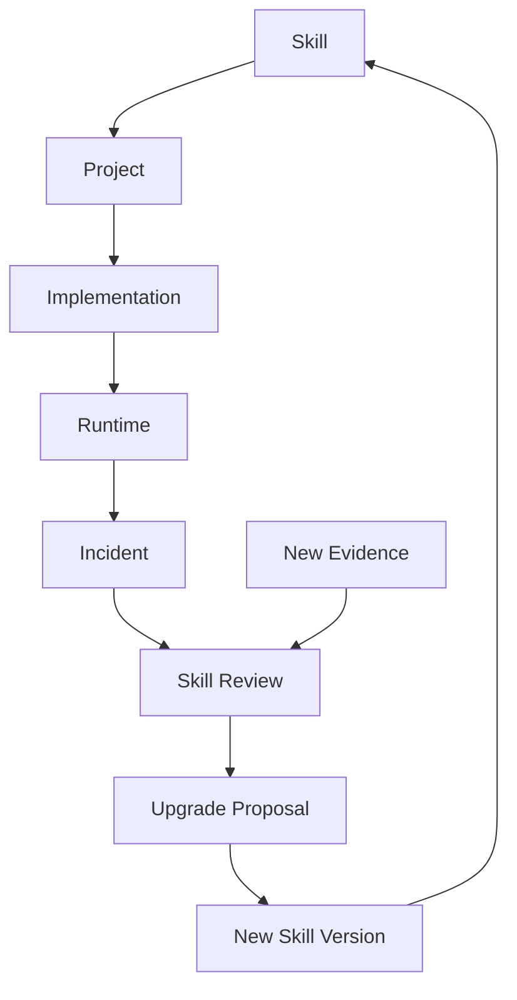

next

# PHASE 26 — SKILL INTELLIGENCE & SELF-EVOLUTION ENGINE

Bu phase sistemin **“skill-lər bir dəfə yazıldı və həmişə belə qaldı”** problemini həll edir.

Sənin istədiyin model:

> Skill kiçik və token-efficient qalsın, amma AI onun arxasındakı geniş knowledge-i lazım olanda açsın, yeni best practice-ləri tapsın, pros/cons müqayisə etsin və köhnəlmiş skill üçün update təklif etsin.

Əsas prinsip:

```text
SKILL
  ↓
CURRENT KNOWLEDGE
  ↓
EVIDENCE
  ↓
BEST PRACTICE
  ↓
COMPARISON
  ↓
VERSION
  ↓
REVIEW
  ↓
UPGRADE
```

---

# 26.1. Skill artıq sadəcə `.sdd` faylı deyil

Skill-i 3 qat edirik:

```text
SKILL
├── AI CORE
├── HUMAN KNOWLEDGE
└── EVIDENCE
```

### AI Core

Qısa, token-efficient.

### Human Knowledge

Ətraflı izah.

### Evidence

Nəyə əsaslandığını göstərən mənbələr.

---

# 26.2. Struktur

```text
.sdd/
└── skills/
    ├── INDEX.sdd
    ├── backend/
    ├── frontend/
    ├── mobile/
    ├── database/
    ├── qa/
    ├── security/
    ├── devops/
    ├── infrastructure/
    ├── cloud/
    └── architecture/
```

Məsələn:

```text
.sdd/skills/backend/idempotency.sdd
```

və human tərəfdə:

```text
docs/skills/backend/idempotency.md
```

---

# 26.3. AI skill format

Məsələn:

```text
Skill: idempotency

Use:
  duplicate-safe operations

Apply:
  payment
  order
  webhook
  retry

Requires:
  stable-key
  atomic-state

Avoid:
  non-atomic-check

Level:
  L2+

Review:
  2026-08

Version:
  1.3
```

AI üçün bu kifayətdir.

---

# 26.4. Human skill document

Human tərəfdə:

```text
docs/skills/backend/idempotency.md
```

orada:

```text
# Idempotency

## What problem does it solve?

## When should we use it?

## When should we NOT use it?

## Common implementation patterns

## Database considerations

## Redis considerations

## Failure scenarios

## Pros

## Cons

## Alternatives

## Testing

## Security

## Performance

## Go examples

## References
```

olur.

---

# 26.5. Skill metadata

Hər skill:

```text
ID
Domain
Level
Version
Status
Maturity
Risk
ReviewDate
EvidenceLevel
```

daşıyır.

Məsələn:

```text
SKILL-IDEMPOTENCY

Level:
  L2

Maturity:
  STABLE

Evidence:
  HIGH

Version:
  1.3

Review:
  2026-08
```

---

# 26.6. Skill status

```text
DRAFT
EXPERIMENTAL
STABLE
DEPRECATED
RETIRED
```

---

# 26.7. Skill maturity

```text
UNKNOWN
EMERGING
VALIDATED
MATURE
STANDARD
```

Beləliklə AI yeni texnologiyanı avtomatik “best practice” hesab etmir.

---

# 26.8. Technology lifecycle

Məsələn:

```text
Technology
 ↓
Emerging
 ↓
Adopted
 ↓
Mature
 ↓
Legacy
 ↓
Deprecated
```

Skill buna uyğun dəyişə bilər.

---

# 26.9. Best practice source

Skill update üçün müxtəlif evidence sources:

```text
Official documentation
RFC
Standards
Vendor documentation
Security advisories
Academic research
Engineering blogs
Production experience
Benchmarks
Community consensus
```

Amma prioritet eyni deyil.

---

# 26.10. Evidence priority

Standart:

```text
1. Official standard
2. Official documentation
3. Security advisory
4. Vendor engineering documentation
5. Peer-reviewed research
6. Reputable engineering source
7. Community consensus
8. Blog / opinion
```

AI qərarı yalnız blog-a əsaslandırmamalıdır.

---

# 26.11. Search keys

Sənin dediyin ideyanı burada sistemləşdiririk.

Skill:

```text
SearchKeys:
  idempotency
  distributed retry
  duplicate request
  payment consistency
  exactly once
  at least once
```

Bu key-lər skill-in **knowledge discovery trigger**-ləridir.

---

# 26.12. Search key nə edir?

AI:

```text
Review skill
```

əmrini alanda:

```text
SKILL
 ↓
SEARCH KEYS
 ↓
CURRENT SOURCES
 ↓
COMPARE
```

edir.

---

# 26.13. Skill review

Məsələn:

```text
/sdd skill review idempotency
```

nəticəsi:

```text
Current skill:
  v1.3

New findings:
  4

Relevant:
  2

Potential improvement:
  1

Breaking change:
  NO
```

---

# 26.14. Skill heç vaxt birbaşa dəyişmir

Əsas qayda:

```text
DISCOVER
   ↓
ANALYZE
   ↓
PROPOSE
   ↓
REVIEW
   ↓
APPROVE
   ↓
UPDATE
```

AI internetdə yeni fikir gördü deyə production skill-i dəyişmir.

---

# 26.15. Skill evolution proposal

```text
SKILL-UPGRADE-042

Skill:
  SKILL-IDEMPOTENCY

Current:
  v1.3

Proposed:
  v1.4

Reason:
  New database concurrency pattern

Evidence:
  HIGH

Impact:
  Low

Breaking:
  No
```

---

# 26.16. Pros / Cons matrix

Sənin xüsusi istədiyin hissə:

```text
Approach A
Pros:
  ...
Cons:
  ...

Approach B
Pros:
  ...
Cons:
  ...
```

AI yalnız “ən yaxşı budur” deməməlidir.

---

# 26.17. Decision matrix

Məsələn cache üçün:

| Approach | Complexity |   Cost | Performance | Reliability |     Scale |
| -------- | ---------: | -----: | ----------: | ----------: | --------: |
| DB cache |        Low |    Low |      Medium |        High |       Low |
| Redis    |     Medium | Medium |        High |        High |      High |
| CDN      |        Low | Medium |   Very High |        High | Very High |

AI project context-ini əlavə edir.

---

# 26.18. Contextual recommendation

Məsələn:

```text
Project:
  20k DAU
```

AI deyir:

```text
Redis cluster unnecessary.

Recommendation:
  Single Redis instance
```

Başqa project:

```text
Project:
  1M DAU
  multi-region
```

onda:

```text
Redis architecture:
  HA / cluster / managed service
```

ola bilər.

---

# 26.19. Yəni skill universal recommendation vermir

Skill deyir:

```text
Redis can solve distributed cache problem.
```

Project AI isə qərar verir:

```text
Bu project-də Redis lazımdırmı?
```

Bu fərq çox vacibdir.

---

# 26.20. Skill → architecture

```text
SKILL
 ↓
CONTEXT
 ↓
OPTIONS
 ↓
PROS / CONS
 ↓
ARCHITECTURE DECISION
```

---

# 26.21. Technology comparison

AI məsələn:

```text
RabbitMQ
Kafka
NATS
Redis Streams
```

arasında seçim edə bilər.

Amma seçim:

```text
“Kafka məşhurdur”
```

əsasında deyil.

Context:

```text
Message volume
Ordering
Retention
Consumer count
Latency
Operational complexity
```

ilə edilir.

---

# 26.22. Stack-aware skills

Skill registry:

```text
Go
React
Vue
Angular
React Native
Flutter
PostgreSQL
MongoDB
Redis
Kafka
RabbitMQ
Docker
Kubernetes
AWS
Azure
GCP
VPS
```

və s.

Sən yalnız BE-yə fokuslanmırsan.

Skill intelligence bütün stack-i əhatə edir.

---

# 26.23. Cross-stack dependency

Məsələn:

```text
Backend:
  Go

Frontend:
  React

Mobile:
  React Native
```

API contract dəyişirsə:

```text
BE
 ↓
FE
 ↓
MD
 ↓
E2E
```

hamısına impact çıxır.

---

# 26.24. Framework evolution

Məsələn React framework-də böyük dəyişiklik olur.

Skill:

```text
SKILL-REACT-ARCH
```

review edilir.

AI baxır:

```text
Current project version
Current framework version
New version
Breaking changes
Migration guide
Known issues
Performance
Security
```

---

# 26.25. Upgrade recommendation

```text
Current:
  React X

Latest stable:
  React Y

Recommendation:
  Upgrade

Risk:
  Medium

Breaking:
  Yes

Required tasks:
  4
```

Bu artıq task engine-ə göndərilir.

---

# 26.26. Dependency update

Skill intelligence dependency vulnerability də izləyir.

```text
Dependency
 ↓
Security advisory
 ↓
Skill
 ↓
Task
 ↓
Gate
```

---

# 26.27. Skill deprecation

Məsələn:

```text
SKILL-OLD-AUTH
```

artıq istifadə edilmirsə:

```text
Status:
  DEPRECATED
```

amma dərhal silinmir.

---

# 26.28. Migration mapping

```text
SKILL-OLD-AUTH
       ↓
REPLACED_BY
       ↓
SKILL-OAUTH2
```

AI köhnə skill istifadə olunan project-ləri tapır.

---

# 26.29. Automatic migration candidates

```text
Projects:
  7

Using deprecated skill:
  3

Migration required:
  2

Low priority:
  1
```

və task-lar yaradıla bilər.

---

# 26.30. Skill health

Hər skill üçün:

```text
Health:
  92%
```

məsələn:

```text
Freshness       95
Evidence        90
Usage           98
Security        100
Compatibility   85
```

---

# 26.31. Staleness detection

Skill:

```text
Review:
  2024
```

və technology:

```text
major releases:
  3
```

onda:

```text
STALE
```

flag-i.

Amma sadəcə tarixə görə deprecated etməyəcəyik.

---

# 26.32. Change triggers

Skill review trigger-ləri:

```text
Major framework release
Security advisory
Breaking API
New standard
Performance discovery
New architecture pattern
Deprecation
Production incident
Repeated task failure
```

---

# 26.33. Incident-driven skill evolution

Məsələn production-da:

```text
Redis memory leak
```

oldu.

Incident:

```text
INC-022
```

root cause:

```text
Missing eviction policy
```

AI görür:

```text
SKILL-REDIS-CACHE
```

də bunu qeyd etməyib.

↓

```text
SKILL-GAP
```

↓

```text
SKILL-UPGRADE-PROPOSAL
```

Bu çox güclü feedback loop-dur.

---

# 26.34. Skill feedback loop



Bu artıq skill-i **living engineering knowledge** edir.

---

# 26.35. Skill anti-pattern detection

AI skill-in özündə də problem tapa bilər:

```text
Too broad
Too vague
Outdated
Contradictory
Duplicated
Unsupported
Over-engineered
```

Məsələn:

```text
SKILL-CACHE
```

40 səhifədirsə:

```text
Skill too large.
Split into:
  cache-selection
  redis-cache
  cache-invalidation
  cache-consistency
```

təklif edə bilər.

---

# 26.36. Skill granularity

Sənin token economy istəyin üçün:

```text
GOOD

SKILL:
  cache-selection

SKILL:
  redis-cache

SKILL:
  cache-invalidation
```

əvəzinə:

```text
BAD

SKILL:
  everything-about-caching
```

---

# 26.37. Skill composition

Lazım olanda:

```text
Payment task
```

AI:

```text
payment
+
idempotency
+
transaction
+
security
+
observability
```

skill-lərini birləşdirir.

Amma bütün skill registry context-ə daxil edilmir.

---

# 26.38. Skill router

```text
User Request
 ↓
Task
 ↓
Domain
 ↓
Stack
 ↓
Risk
 ↓
Required Skills
```

Məsələn:

```text
PAY-1023
```

çıxarır:

```text
idempotency
database transaction
payment security
observability
BDD
```

---

# 26.39. Skill conflict

Bəzən iki skill ziddiyyətli recommendation verə bilər.

Məsələn:

```text
SKILL-A:
  synchronous processing

SKILL-B:
  async processing
```

Graph:

```text
CONFLICT
```

Agent qərarı avtomatik vermir.

```text
Context:
  latency critical

Recommendation:
  async

Reason:
  ...
```

və decision yaranır.

---

# 26.40. Skill → Decision

```text
SKILL
 ↓
OPTIONS
 ↓
PROS / CONS
 ↓
PROJECT CONTEXT
 ↓
DECISION
```

Bu decision graph-a bağlanır.

---

# 26.41. Skill versioning

```text
v1.0
v1.1
v1.2
v2.0
```

Breaking change:

```text
MAJOR
```

compatible improvement:

```text
MINOR
```

correction:

```text
PATCH
```

---

# 26.42. Skill compatibility

Project:

```text
Go 1.x
```

Skill:

```text
Go 2.x pattern
```

AI:

```text
INCOMPATIBLE
```

deyə bilər.

Skill sadəcə “latest” olduğu üçün tətbiq olunmur.

---

# 26.43. Skill evidence graph

```text
SKILL
 ↓
EVIDENCE
 ├── Official Docs
 ├── RFC
 ├── Security Advisory
 ├── Benchmark
 └── Engineering Report
```

Hər recommendation-in arxasında evidence görünür.

---

# 26.44. Human audit

Human deyə bilər:

> Niyə Redis seçdik?

AI:

```text
Decision:
  DEC-042

Based on:
  SKILL-CACHE-SELECTION v2.1

Compared:
  PostgreSQL
  Redis
  Memcached

Primary reason:
  latency + shared state

Tradeoff:
  operational complexity
```

Bu artıq **AI qərarını audit edilə bilən** edir.

---

# 26.45. Skill review schedule

Bütün skill-ləri hər gün review etmək lazım deyil.

```text
Security:
  frequent

Cloud:
  frequent

Framework:
  periodic

Stable algorithm:
  rare
```

Risk-based review:

```text
Critical skill:
  30 days

Normal:
  90 days

Stable:
  180 days
```

---

# 26.46. Token economy

Əsas qayda:

```text
Skill Core
```

çox kiçik qalır.

AI yalnız lazım olanda:

```text
Human docs
Evidence
Comparisons
References
```

açır.

Beləliklə:

```text
Default context:
  small

Deep analysis:
  expandable
```

---

# 26.47. Phase 26 nəticəsi

Artıq skill sistemi:

```text
STATIC FILE
```

deyil.

Belə olur:

```text
              ┌── Evidence
              │
Skill Core ───┼── Human Docs
              │
              ├── Pros / Cons
              │
              ├── Technology
              │
              ├── Decision
              │
              └── Project Context
                       ↓
                    Review
                       ↓
                 Upgrade Proposal
```

---

# Progress

```text
PHASE 13  Task Engine                    ✅
PHASE 14  Security Engine                ✅
PHASE 15  Testing Engine                 ✅
PHASE 16  Architecture & Decision Engine ✅
PHASE 17  Stack & Technology Engine      ✅
PHASE 18  SDLC / Workflow Orchestrator   ✅
PHASE 19  Observability / Incident       ✅
PHASE 20  Documentation / Knowledge      ✅
PHASE 21  Context Router / Token Engine  ✅
PHASE 22  Agent Runtime / Tool Engine    ✅
PHASE 23  Project Discovery Engine       ✅
PHASE 24  Knowledge Graph & Traceability ✅
PHASE 25  Quality / Security / Release   ✅
PHASE 26  Skill Intelligence             ✅
```

## Növbəti — PHASE 27

**AUTONOMOUS PROJECT ORCHESTRATOR**

Burada artıq bütün əvvəlki engine-ləri birləşdirəcəyik:

```text
User
 ↓
Input
 ↓
Discovery / Intent
 ↓
Project Context
 ↓
Architecture
 ↓
Skills
 ↓
Decision
 ↓
Tasks
 ↓
Dependency Graph
 ↓
Workflow
 ↓
BDD
 ↓
Implementation
 ↓
QA
 ↓
Security
 ↓
Performance
 ↓
Infrastructure
 ↓
Release
 ↓
Runtime
 ↓
Incident
 ↓
Learning
```

və əsas sualı həll edəcəyik:

> **Mən agentə bir cümlə, bir paragraph, hətta qarışıq bir business description verəndə, agent bunu necə anlayıb düzgün `.sdd` strukturuna çevirəcək, hansı phase-ləri işə salacaq və nə vaxt dayanıb məndən qərar istəyəcək?**

Bu phase artıq `.sdd`-nin **“file collection” yox, real engineering operating system** kimi davranmasının orchestration qatıdır.
