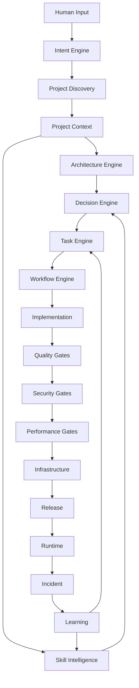

next
# PHASE 27 — AUTONOMOUS PROJECT ORCHESTRATOR

Bu phase əvvəlki bütün hissələri bir **vahid agent lifecycle** halına gətirir.

Əsas məqsəd:

> Sən AI-a hazır `.sdd` project verirsən və ya sadəcə bir cümlə yazırsan. Agent əvvəlcə nə baş verdiyini anlayır, project-i araşdırır, uyğun skill-ləri seçir, architecture qurur, task/workflow yaradır və yalnız bundan sonra implementation-a keçir.

---

# 27.1. İki giriş rejimi

Sistem iki vəziyyətdə işləməlidir.

### A — New Project

```text
User:
"Online lesson platform qurmaq istəyirəm..."
```

Agent:

```text
INPUT
 ↓
DISCOVERY
 ↓
ANALYSIS
 ↓
ARCHITECTURE
 ↓
PLAN
 ↓
IMPLEMENTATION
```

### B — Existing Project

Sən:

```text
.sdd/project/
```

qovluğunu əlavə edirsən və:

```text
"Project-i analiz et."
```

deyirsən.

Agent **development-i dayandırır** və əvvəlcə repository-ni araşdırır.

---

# 27.2. Existing Project Discovery

Agent ilk mərhələdə:

```text
.sdd/
project/
src/
BE/
FE/
MD/
infra/
tests/
docs/
```

və digər root structure-ları oxuyur.

Sonra:

```text
CODE
CONFIG
DATABASE
TESTS
INFRA
DOCS
DEPENDENCIES
```

analiz edir.

Burada əsas prinsip:

> **Mövcud project-də kod source-of-truth-dur.**

Prompt artıq əsas həqiqət deyil.

---

# 27.3. Project reconstruction

Agent mövcud koddan:

```text
Architecture
Modules
Dependencies
Business flows
Data flows
External services
Security boundaries
Deployment model
```

çıxarır.

Sonra:

```text
.sdd/project/
```

altında project knowledge formalaşdırır.

---

# 27.4. Project root və global root ayrılır

Sənin əvvəlki qərarına əsasən:

```text
.sdd/
```

və:

```text
.sdd/project/
```

eyni şey deyil.

### Global

```text
.sdd/
├── skills/
├── standards/
├── workflows/
├── gates/
├── agents/
├── schemas/
└── prompts/
```

### Project

```text
.sdd/project/
├── INDEX.sdd
├── architecture/
├── tasks/
├── workflow/
├── decisions/
├── modules/
├── diagrams/
├── runtime/
└── project.sdd
```

Beləliklə project-i başqa repository-yə köçürəndə global `.sdd`-yə dependency yaranmır.

---

# 27.5. Project skeleton

Agent project discovery-dən sonra:

```text
.sdd/project/
├── INDEX.sdd
├── project.sdd
├── architecture/
├── modules/
├── tasks/
├── workflow/
├── decisions/
├── diagrams/
└── runtime/
```

strukturunu yaradır.

Amma **lazımsız qovluqları yaratmır**.

Məsələn mobile yoxdursa:

```text
MD/
```

üçün xüsusi project documentation yaranmır.

---

# 27.6. Adaptive structure

Kiçik project:

```text
.sdd/project/
├── INDEX.sdd
├── project.sdd
├── tasks/
└── decisions/
```

Böyük project:

```text
.sdd/project/
├── architecture/
├── modules/
├── tasks/
├── workflow/
├── decisions/
├── diagrams/
├── runtime/
└── environments/
```

Yəni sistem:

> **structure first deyil, context first**

prinsipi ilə işləyir.

---

# 27.7. Discovery confidence

Agent hər tapıntıya confidence verir:

```text
HIGH
MEDIUM
LOW
UNKNOWN
```

Məsələn:

```text
Database:
  PostgreSQL
  confidence: HIGH

Business rule:
  Refund only once
  confidence: MEDIUM

Deployment:
  VPS
  confidence: LOW
```

Bu çox vacibdir.

AI fərziyyəni fakt kimi təqdim etməməlidir.

---

# 27.8. Discovery report

```text
PROJECT DISCOVERY

Stack:
  BE: Go
  FE: React
  MD: React Native

Database:
  PostgreSQL

Cache:
  Redis

Infrastructure:
  Docker
  VPS

Testing:
  Playwright
  Go test

Security:
  JWT
  RBAC

Unknown:
  Production topology
  Backup policy
```

---

# 27.9. Unknown-lar task deyil

Əgər AI bilmir:

```text
Production backup policy?
```

dərhal kod yazmır.

Bunun üçün:

```text
QUESTION
```

yaradır.

---

# 27.10. Agent clarification policy

AI yalnız kritik ambiguity olduqda user-dən soruşur.

Məsələn:

```text
Payment provider?
```

sualı vacibdirsə soruşur.

Amma:

```text
Redis version?
```

implementation üçün kritik deyilsə özü araşdırır.

---

# 27.11. Decision threshold

```text
LOW RISK
→ AI decides

MEDIUM RISK
→ AI recommends

HIGH RISK
→ Human approval

CRITICAL
→ Human mandatory
```

---

# 27.12. Human decision boundary

AI:

```text
Architecture:
  PostgreSQL + Redis
```

seçimini özü edə bilər.

Amma:

```text
Database migration
payment provider
security policy
production destructive operation
```

kimi qərarlar üçün approval tələb edə bilər.

---

# 27.13. Intent engine

User:

> “Refund sistemi double refund edir, düzəlt.”

Agent bunu:

```text
Intent:
  BUG

Domain:
  PAYMENT

Risk:
  HIGH

Likely skills:
  idempotency
  transaction
  security
  testing
```

kimi strukturlaşdırır.

---

# 27.14. User input müxtəlif formada ola bilər

Sistem:

```text
1 sentence
paragraph
story
bug report
meeting notes
technical specification
voice transcript
existing code
```

kimi input-ları qəbul edə bilər.

Hamısı:

```text
INPUT → NORMALIZED INTENT
```

olur.

---

# 27.15. Intent normalization

Məsələn:

> “User iki dəfə payment elədi pul iki dəfə çıxdı bunu düzəlt amma sistemi çox böyütməyək.”

Agent:

```text
Problem:
  duplicate payment

Risk:
  CRITICAL

Constraint:
  avoid overengineering

Domain:
  payment

Required:
  idempotency
  transaction safety

Architecture constraint:
  modular monolith preferred
```

çıxarır.

Bu sənin **“kiçik project-ə microservice qurmasın”** qaydandır.

---

# 27.16. Overengineering guard

Agent hər recommendation üçün:

```text
Necessary?
```

sualını verir.

Məsələn:

```text
10k users
```

üçün:

```text
Kubernetes
Kafka
service mesh
multi-region
```

təklif etməməlidir.

---

# 27.17. Complexity budget

Project üçün:

```text
Complexity:
  LOW
```

və ya:

```text
MEDIUM
HIGH
CRITICAL
```

təyin edilir.

AI architecture complexity-ni bu budget-dən yuxarı çıxarmamalıdır.

---

# 27.18. Architecture selection

Agent:

```text
Project context
+
Scale
+
Risk
+
Team
+
Budget
+
Existing stack
```

ilə architecture seçir.

Məsələn:

```text
Small:
  Modular Monolith

Medium:
  Modular Monolith + async workers

Large:
  Selective services

Very Large:
  Distributed architecture
```

---

# 27.19. Existing architecture preservation

Əgər mövcud project:

```text
Laravel monolith
```

dirsə və sən:

> microservice-ə keçir

deyirsənsə, agent əvvəl:

```text
Vendor
Dependencies
Build artifacts
Runtime coupling
Database coupling
```

araşdırır.

---

# 27.20. Laravel → Microservices example

Sənin verdiyin `vendor` ideyasını burada formalizə edirik.

Agent görə bilər:

```text
Laravel application
+
vendor/
+
composer dependencies
```

və migration zamanı təklif edə bilər:

```text
Base runtime image
+
Composer dependency layer
```

və ya shared build strategy.

Amma burada vacib qayda:

> `vendor` qovluğunu kor-koranə bütün microservice-lərə kopyalamaq olmaz.

Agent dependency graph çıxarmalıdır.

---

# 27.21. Dependency extraction

```text
Laravel
 ↓
composer.json
 ↓
Dependencies
 ↓
Used packages
 ↓
Service boundary
```

Məsələn:

```text
Payment Service
  ↓
payment-related dependencies only
```

Bu daha sağlamdır.

---

# 27.22. Task generation

Architecture hazır olduqdan sonra:

```text
Architecture
 ↓
Work Breakdown
 ↓
Tasks
```

yaradılır.

Task-lar əvvəl danışdığımız dependency modelinə girir.

---

# 27.23. Task DAG

Məsələn:

```text
1000

1001 → 1011 → 1023
```

və:

```text
1023
 ↓
999
```

Agent dependency graph-dan execution order çıxarır.

---

# 27.24. Task execution

Sənin istədiyin model:

```text
1023
 ↓
999
 ↓
1023
 ↓
1011
 ↓
1001
```

yəni əvvəl dependency-lər tamamlanır.

AI task ID-nin rəqəminə yox:

```text
DependsOn
```

graph-a baxır.

---

# 27.25. Task priority vs dependency

Əgər:

```text
1000
1001 → 1011
```

varsa, `1001` yüksək priority olsa belə:

```text
1011
```

bitmədən işlənməyə bilər.

Dependency həmişə execution constraint-dir.

---

# 27.26. Workflow engine

Task:

```text
PAY-1023
```

workflow-a daxil olur:

```text
BDD
 ↓
CODE
 ↓
TEST
 ↓
SECURITY
 ↓
REVIEW
 ↓
RELEASE
```

---

# 27.27. Workflow adaptive olur

Backend task:

```text
BDD
CODE
UNIT
INTEGRATION
SECURITY
```

Frontend:

```text
BDD
CODE
UNIT
E2E
UI
```

Mobile:

```text
BDD
CODE
UNIT
WIDGET
E2E
DEVICE
```

Infrastructure:

```text
PLAN
CONFIG
VALIDATE
SECURITY
DEPLOY
VERIFY
```

---

# 27.28. Cross-layer task

Məsələn API dəyişir.

Agent:

```text
BE
 ↓
API Contract
 ↓
FE
 ↓
MD
 ↓
E2E
```

hamısını impact graph-a salır.

---

# 27.29. Impact analysis

Kod dəyişməzdən əvvəl:

```text
Change:
  PaymentResponse
```

Agent:

```text
Affected:
  BE handler
  BE DTO
  FE API client
  FE UI
  MD API client
  MD screen
  E2E tests
  API docs
```

çıxara bilər.

Bu, sənin:

> “FE düzəldi, sonra MD qırıldı”

problemini həll edir.

---

# 27.30. Change blast radius

Hər dəyişiklik üçün:

```text
LOW
MEDIUM
HIGH
CRITICAL
```

hesablanır.

Məsələn:

```text
CSS change:
  LOW

Database schema:
  HIGH

Authentication:
  CRITICAL
```

---

# 27.31. Agent stop conditions

Agent həmişə sona qədər özü getməməlidir.

Stop:

```text
CRITICAL ambiguity
SECURITY uncertainty
DESTRUCTIVE migration
PRODUCTION destructive action
HIGH-risk architecture decision
Missing required credential
```

olduqda:

```text
WAIT_FOR_HUMAN
```

---

# 27.32. Agent resume

Human qərar verir:

```text
APPROVED
```

agent:

```text
Resume from exact state
```

edir.

Bütün workflow yenidən başlamır.

---

# 27.33. State machine

Agent:

```text
DISCOVERING
ANALYZING
PLANNING
WAITING
IMPLEMENTING
TESTING
VERIFYING
RELEASING
DEPLOYING
OBSERVING
COMPLETED
FAILED
```

statuslarından keçir.

---

# 27.34. Agent state

```text
.sdd/runtime/
├── agent.sdd
├── session.sdd
├── current.sdd
└── checkpoints/
```

Burada:

```text
Current task
Current phase
Current decision
Last successful step
Next action
```

saxlanılır.

---

# 27.35. Crash recovery

Agent yarıda dayandı.

Yenidən başlayanda:

```text
.sdd/runtime/current.sdd
```

oxuyur.

Məsələn:

```text
Task:
  PAY-1023

Phase:
  SECURITY

Last:
  SAST PASSED

Next:
  Dependency Scan
```

və oradan davam edir.

---

# 27.36. No duplicate work

Agent artıq:

```text
BDD PASSED
```

görürsə, yenidən BDD yaratmır.

Evidence graph-a baxır.

---

# 27.37. Git integration

Agent hər task üçün:

```text
Task
 ↓
Branch
 ↓
Commit
 ↓
PR
 ↓
Review
 ↓
Merge
```

trace yarada bilər.

---

# 27.38. Commit trace

Məsələn:

```text
TASK-1023
 ↓
commit abc123
 ↓
PR #451
 ↓
GATES
 ↓
release v1.4.0
```

Bu artıq tam traceability-dir.

---

# 27.39. Rollback trace

Production incident:

```text
INC-022
 ↓
Release v1.4.0
 ↓
PR #451
 ↓
TASK-1023
 ↓
commit abc123
```

AI bir neçə dəqiqə ərzində:

> “Bu incident hansı dəyişiklikdən gəlib?”

sualını araşdıra bilər.

---

# 27.40. Manager command model

Sən manager kimi belə komandalar verə bilərsən:

```text
analyze project
```

```text
plan project
```

```text
show blockers
```

```text
continue
```

```text
review architecture
```

```text
review security
```

```text
why is task 1023 blocked?
```

```text
what changed?
```

```text
what can break?
```

```text
prepare release
```

---

# 27.41. Bir cümləlik input

Sən:

> “Payment zamanı double charge problemini həll et və production üçün təhlükəsiz et.”

deyirsən.

Agent:

```text
INTENT
 ↓
PROJECT DISCOVERY
 ↓
PAYMENT DOMAIN
 ↓
RISK = CRITICAL
 ↓
SKILLS
 ↓
ARCHITECTURE IMPACT
 ↓
TASK GRAPH
 ↓
BDD
 ↓
IMPLEMENTATION
 ↓
TEST
 ↓
SECURITY
 ↓
PERFORMANCE
 ↓
RELEASE
```

çıxarır.

---

# 27.42. Amma AI birbaşa kod yazmır

Əvvəl:

```text
PLAN
```

hazırlayır.

Məsələn:

```text
Task:
  PAY-1023

Problem:
  duplicate charge

Root cause:
  missing idempotency

Plan:
  1. Add idempotency key
  2. Add DB constraint
  3. Make operation atomic
  4. Add BDD
  5. Add concurrency tests
  6. Add security test
```

sonra implementation başlayır.

---

# 27.43. Architecture approval

Critical architecture change olduqda:

```text
AI:
  Recommendation ready.

Human approval required.

Options:
  A — Modular monolith
  B — Microservice

Recommended:
  A

Reason:
  Current scale + lower complexity
```

Sən:

```text
approve A
```

deyirsən.

---

# 27.44. Autonomous mode

Bütün qərarlar critical deyilsə:

```text
AUTO
```

mode-da işləyə bilər.

---

# 27.45. Supervised mode

Riskli project:

```text
SUPERVISED
```

AI hər major decision-də approval istəyir.

---

# 27.46. Strict mode

Financial/security-critical:

```text
STRICT
```

burada:

```text
Architecture
Security
Database migration
Release
```

human approval tələb edir.

---

# 27.47. Agent modes

```text
AUTO
SUPERVISED
STRICT
AUDIT
READ_ONLY
```

### READ_ONLY

Project-i analiz edir, kod dəyişmir.

Bu xüsusilə:

```text
"Analyze project"
```

üçün lazımdır.

---

# 27.48. Ən vacib təhlükəsizlik prinsipi

Agent:

```text
READ
ANALYZE
PLAN
```

edə bilər.

Amma:

```text
DELETE PRODUCTION DB
DROP TABLE
ROTATE PRODUCTION CREDENTIAL
DEPLOY DESTRUCTIVE CHANGE
```

kimi əməliyyatlar xüsusi approval tələb edir.

---

# 27.49. Full orchestration graph



---

# 27.50. Human ↔ AI boundary

Sistemin əsas fəlsəfəsi belə olur:

```text
HUMAN
  ↓
Intent / Business Decision / Approval
  ↓
AI
  ↓
Analysis / Architecture / Planning / Implementation
  ↓
AI
  ↓
Evidence / Verification
  ↓
HUMAN
  ↓
Critical Approval
```

Yəni AI manager-i əvəz etmir.

**Manager-in engineering visibility-sini artırır.**

---

# 27.51. Phase 27 nəticəsi

Artıq əvvəlki phase-lər ayrı-ayrı tool deyil.

Onlar:

```text
Intent Engine
Discovery Engine
Architecture Engine
Skill Engine
Decision Engine
Task Engine
Workflow Engine
QA Engine
Security Engine
Performance Engine
Infrastructure Engine
Release Engine
Runtime Engine
Learning Engine
```

kimi **bir orchestrator altında birləşir.**

---

# Progress

```text
PHASE 13  Task Engine                    ✅
PHASE 14  Security Engine                ✅
PHASE 15  Testing Engine                 ✅
PHASE 16  Architecture & Decision Engine ✅
PHASE 17  Stack & Technology Engine      ✅
PHASE 18  SDLC / Workflow Orchestrator   ✅
PHASE 19  Observability / Incident       ✅
PHASE 20  Documentation / Knowledge      ✅
PHASE 21  Context Router / Token Engine  ✅
PHASE 22  Agent Runtime / Tool Engine    ✅
PHASE 23  Project Discovery Engine       ✅
PHASE 24  Knowledge Graph & Traceability ✅
PHASE 25  Quality / Security / Release   ✅
PHASE 26  Skill Intelligence             ✅
PHASE 27  Autonomous Orchestrator        ✅
```

## Növbəti PHASE 28

**SINGLE SOURCE OF TRUTH + FILE SCHEMA + `.sdd` LANGUAGE**

Burada artıq “nə sistem qururuq?” yox, **“bütün bunlar fiziki olaraq `.sdd` qovluğunda hansı fayllarda, hansı standart syntax-la yerləşəcək?”** məsələsini bağlamaq lazımdır.

Yəni:

```text
.sdd/
├── skills/
├── standards/
├── workflows/
├── gates/
├── agents/
├── schemas/
├── prompts/
└── project/
    ├── INDEX.sdd
    ├── project.sdd
    ├── tasks/
    ├── workflow/
    ├── decisions/
    ├── architecture/
    ├── modules/
    └── diagrams/
```

və hər `.sdd` faylının:

```text
ID
TYPE
SCOPE
RELATION
STATE
DEPENDS_ON
OWNER
LEVEL
EVIDENCE
```

kimi **minimum, standart və token-efficient dilini** müəyyən edəcəyik.

Bu phase-dən sonra artıq bütün sistemin əvvəl danışdığımız ideyalarını **real repository skeleton-a çevirməyə** başlamaq üçün əsas texniki spesifikasiya hazır olacaq.
