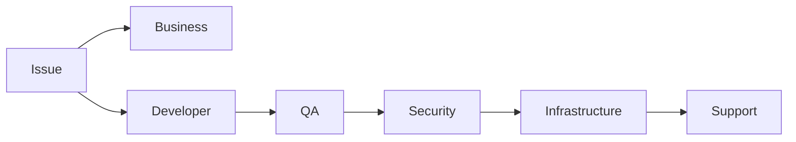

next
# PHASE 28 — `.sdd` LANGUAGE, SCHEMA & SINGLE SOURCE OF TRUTH

Bu phase artıq sistemin **“dili”ni** müəyyən edir.

Əvvəlki phase-lərdə nə edəcəyimizi müəyyən etdik. İndi isə əsas sual:

> **AI bunları necə oxuyacaq ki, az tokenlə çox məna çıxarsın və eyni məlumatı 5 müxtəlif faylda təkrar etməsin?**

Burada əsas qərarım budur:

> `.sdd` faylları **AI üçün source-of-truth**, `docs/` isə **Human explanation layer** olacaq.

Kod isə kodun özündə source-of-truth olaraq qalacaq.

---

# 28.1. Üç qatlı Source of Truth

Sistem belə düşünülməlidir:

```text
CODE
  ↓
Actual implementation

.SDD
  ↓
AI engineering knowledge

DOCS
  ↓
Human explanation
```

Bunlar bir-birini əvəz etmir.

---

# 28.2. Kodun yanında `.md` olmayacaq

Sənin əvvəlki qərarın qorunur.

Belə:

```text
BE/internal/analytics/repository.go
BE/internal/analytics/repository.md
```

❌ YOX.

Əvəzində:

```text
BE/internal/analytics/repository.go
```

və:

```text
.sdd/project/modules/analytics/repository.sdd
```

və Human üçün:

```text
docs/modules/analytics/repository.md
```

---

# 28.3. `.sdd` qovluğunun əsas fəlsəfəsi

`.sdd`:

```text
Documentation folder
```

deyil.

O:

```text
Engineering Knowledge System
```

dir.

---

# 28.4. Final root structure

Bu phase-də mən belə struktur təklif edirəm:

```text
.sdd/
├── INDEX.sdd
│
├── standards/
│   ├── naming.sdd
│   ├── levels.sdd
│   ├── states.sdd
│   ├── relations.sdd
│   └── conventions.sdd
│
├── skills/
│   ├── INDEX.sdd
│   ├── backend/
│   ├── frontend/
│   ├── mobile/
│   ├── database/
│   ├── qa/
│   ├── security/
│   ├── devops/
│   ├── cloud/
│   └── architecture/
│
├── workflows/
│   ├── INDEX.sdd
│   ├── development.sdd
│   ├── bugfix.sdd
│   ├── feature.sdd
│   ├── refactor.sdd
│   ├── security.sdd
│   └── release.sdd
│
├── gates/
│   ├── INDEX.sdd
│   ├── quality.sdd
│   ├── security.sdd
│   ├── performance.sdd
│   └── release.sdd
│
├── schemas/
│   ├── task.sdd
│   ├── decision.sdd
│   ├── workflow.sdd
│   ├── skill.sdd
│   ├── gate.sdd
│   └── module.sdd
│
├── agents/
│   ├── INDEX.sdd
│   ├── architect.sdd
│   ├── developer.sdd
│   ├── qa.sdd
│   ├── security.sdd
│   ├── devops.sdd
│   └── reviewer.sdd
│
└── project/
    ├── INDEX.sdd
    ├── project.sdd
    ├── architecture/
    ├── modules/
    ├── tasks/
    ├── workflow/
    ├── decisions/
    ├── diagrams/
    └── runtime/
```

Bu artıq bizim əsas skeletonumuz ola bilər.

---

# 28.5. Nə root-da, nə project-də?

Əsas qayda:

### `.sdd/`

Bütün layihələr üçün ümumi knowledge.

### `.sdd/project/`

Yalnız həmin project-in vəziyyəti.

---

# 28.6. Məsələn skill

```text
.sdd/skills/backend/idempotency.sdd
```

Burada:

```text
Skill: idempotency
Level: L2+
Use: duplicate-safe operation
Requires: stable-key, atomic-state
Avoid: check-then-insert
Version: 1.3
```

olur.

Bu başqa project-lərdə də istifadə edilə bilər.

---

# 28.7. Project-specific decision

Amma:

```text
.sdd/project/decisions/DEC-042.sdd
```

məsələn:

```text
Decision: Redis is used for session storage.

Reason:
  Existing infrastructure

Scope:
  project

Status:
  accepted
```

Bu yalnız project-ə aiddir.

---

# 28.8. Task da project-specific

```text
.sdd/project/tasks/1023.sdd
```

olmalıdır.

Bu sənin son qərarına uyğundur:

> Task-lar project basedir.

---

# 28.9. Workflow fərqi

Burada incə məsələ var.

### Global workflow

```text
.sdd/workflows/feature.sdd
```

deyir:

> Feature necə işlənməlidir?

### Project workflow state

```text
.sdd/project/workflow/PAY-1023.sdd
```

deyir:

> Bu feature hazırda hansı mərhələdədir?

Bu ikisini qarışdırmırıq.

---

# 28.10. Eyni qayda gates üçün

Global:

```text
.sdd/gates/security.sdd
```

deyir:

> Security gate necə işləyir?

Project:

```text
.sdd/project/runtime/security/PAY-1023.sdd
```

kimi ayrıca state saxlaya bilər.

---

# 28.11. `.sdd` dili

Burada JSON/YAML əvəzinə **compact structured syntax** təklif edirəm.

Məsələn:

```text
@task 1023
title "Prevent duplicate refund"
domain payments
risk high
level L2

depends 999
skills idempotency transaction payment-security

flow BDD>BE>QA>SEC>VR

state ready
```

AI bunu çox rahat parse edə bilər.

---

# 28.12. İnsan da oxuya bilər

Bu syntax tam qapalı deyil.

Məsələn:

```text
@decision DEC-042

topic cache
choice redis

because:
  shared-state
  low-latency
  existing-infra

reject:
  memcached
  db-cache

risk medium
status accepted
```

Human da nə baş verdiyini təxmin edə bilir.

Ətraflı izah isə `docs/`-dadır.

---

# 28.13. Prefix sistemi

Ən vacib token economy qərarlarından biri:

```text
@
>
:
=
?
!
~
```

kimi simvolları standartlaşdırmaqdır.

Məsələn:

```text
@task
@decision
@skill
@gate
@workflow
@module
```

---

# 28.14. Relationship syntax

Əlaqələri uzun sözlərlə yazmaq əvəzinə:

```text
depends 999
uses idempotency
blocks 1011
related SEC-004
implements DEC-042
```

kimi saxlayırıq.

Daha da compact etmək mümkündür:

```text
-> dependency
=> implementation
~> related
!> blocks
```

Amma mən ilk versiyada **oxunaqlılığı** üstün tutardım.

---

# 28.15. State syntax

Standart:

```text
state draft
state ready
state active
state blocked
state done
state failed
state archived
```

---

# 28.16. Human və AI state

Məsələn:

```text
state blocked
reason "waiting for payment provider decision"
```

AI dərhal bilir niyə dayanıb.

Human isə `docs/`-dan daha geniş izahı oxuya bilər.

---

# 28.17. ID naming

Bütün entity-lər standart ID almalıdır.

```text
TASK-1023
DEC-042
SKILL-017
GATE-SEC-004
WF-021
MOD-PAY
INC-091
REL-2026-08
```

Bu çox vacibdir.

Çünki ID-lər bütün graph-ın primary key-ləridir.

---

# 28.18. ID-ni dəyişmək olmaz

Məsələn:

```text
TASK-1023
```

yaradılıbsa, title dəyişə bilər:

```text
Refund idempotency
```

amma ID dəyişməməlidir.

---

# 28.19. Rename problemi

Məsələn:

```text
PAYMENT
```

modulu:

```text
BILLING
```

oldu.

ID:

```text
MOD-PAY
```

qalır.

Sadəcə:

```text
name billing
alias payment
```

ola bilər.

Beləliklə graph qırılmır.

---

# 28.20. Minimal required fields

Hər entity üçün bütün field-ləri məcburi etmirik.

Məsələn Task üçün minimum:

```text
@task TASK-1023
title "..."
state ready
```

kifayətdir.

Sonra lazım olduqda:

```text
depends
skills
risk
level
owner
flow
```

əlavə olunur.

Bu **small project** üçün çox vacibdir.

---

# 28.21. Adaptive schema

Kiçik project:

```text
@project P-001
name "Todo"
level L1
```

Böyük project:

```text
@project P-001

name "Global Commerce"
level L4
scale 1M_DAU

domains:
  payments
  orders
  identity

infra:
  aws
  kubernetes

security:
  high
```

Schema project-in böyüklüyünə görə genişlənir.

---

# 28.22. Schema validation

Agent `.sdd` faylını oxuyanda:

```text
parse
 ↓
validate
 ↓
resolve relations
 ↓
build graph
```

edir.

Məsələn:

```text
depends TASK-999
```

amma TASK-999 yoxdur.

System:

```text
ERROR:
  unresolved dependency
```

verməlidir.

---

# 28.23. Circular dependency

Məsələn:

```text
1001 -> 1023
1023 -> 1001
```

Agent:

```text
CYCLE DETECTED
```

çıxarmalıdır.

Task execution başlamamalıdır.

---

# 28.24. Orphan detection

```text
TASK-1023
```

var, amma heç bir INDEX-də qeyd olunmayıb.

System:

```text
ORPHAN TASK
```

deyə bilər.

---

# 28.25. Duplicate detection

İki faylda:

```text
TASK-1023
```

varsa:

```text
DUPLICATE ID
```

---

# 28.26. Stale reference

Məsələn:

```text
depends TASK-999
```

amma TASK-999:

```text
archived
```

olub.

Agent bunu:

```text
STALE REFERENCE
```

kimi göstərir.

---

# 28.27. INDEX faylları

INDEX-lər **database deyil**.

Onlar:

> “Burada nə var?”

sualına sürətli cavabdır.

Məsələn:

```text
.sdd/project/tasks/INDEX.sdd
```

```text
@task-index

TASK-999  ready
TASK-1001 blocked
TASK-1011 ready
TASK-1023 active

order:
  999
  1023
  1011
  1001
```

---

# 28.28. INDEX source-of-truth deyil

Əsas məlumat:

```text
tasks/1023.sdd
```

faylındadır.

INDEX:

```text
derived metadata
```

kimi qəbul edilir.

Bu çox vacibdir.

INDEX səhvdirsə AI task fayllarından rebuild edə bilər.

---

# 28.29. Auto rebuild

```text
.sdd rebuild-index
```

və ya agent özü.

```text
TASK files
 ↓
parse
 ↓
sort
 ↓
dependency graph
 ↓
INDEX
```

---

# 28.30. Project INDEX

```text
.sdd/project/INDEX.sdd
```

burada:

```text
project
architecture
modules
tasks
decisions
workflow
runtime
```

haqqında navigation məlumatı olur.

---

# 28.31. Root INDEX

```text
.sdd/INDEX.sdd
```

isə agent üçün bootstrap olur:

```text
standards
skills
workflows
gates
schemas
agents
project
```

Agent ilk olaraq bunu oxuyur.

---

# 28.32. Token bootstrap

Agent repository-yə gəlir.

Hamısını oxumur.

Əvvəl:

```text
.sdd/INDEX.sdd
```

↓

lazım olan:

```text
schema
skill
workflow
project INDEX
```

↓

sonra konkret entity.

Bu:

```text
FULL REPO CONTEXT ❌
TARGETED CONTEXT ✅
```

deməkdir.

---

# 28.33. Context loading priority

```text
L0:
INDEX

L1:
Project context

L2:
Current task

L3:
Required skills

L4:
Related decisions

L5:
Relevant code

L6:
Human docs / evidence
```

AI yalnız lazım olduqda aşağı səviyyəyə düşür.

---

# 28.34. Context budget

Agent üçün:

```text
CORE
OPTIONAL
DEEP
```

qatları yaradırıq.

Məsələn skill:

```text
CORE:
  30 tokens

OPTIONAL:
  200 tokens

DEEP:
  2000+ tokens
```

---

# 28.35. Code remains source-of-truth

Çox vacib:

Əgər:

```text
repository.go
```

başqa şey edir,

amma:

```text
repository.sdd
```

başqa şey deyirsə,

AI:

```text
CONFLICT
```

yaratmalıdır.

Avtomatik olaraq `.sdd`-yə inanmaq düzgün deyil.

---

# 28.36. Code ↔ SDD consistency

Agent:

```text
SDD:
  method exists

CODE:
  method missing
```

görürsə:

```text
DRIFT
```

yaradır.

---

# 28.37. Documentation drift

Human docs:

```text
docs/
```

də köhnədirsə:

```text
DOC-DRIFT
```

yarana bilər.

Beləliklə:

```text
CODE
SDD
DOCS
```

arasında consistency yoxlanır.

---

# 28.38. Drift hierarchy

Prioritet:

```text
CODE
  >
SDD
  >
DOCS
```

amma business decision-lər üçün:

```text
DECISION
```

ayrıca source ola bilər.

Məsələn:

```text
DEC-042:
  Redis chosen intentionally.
```

Code Redis istifadə etmir.

AI:

```text
DECISION-IMPLEMENTATION DRIFT
```

deyir.

---

# 28.39. Immutable decisions

Qəbul edilmiş decision silinmir.

```text
DEC-042
```

sonradan:

```text
superseded by DEC-077
```

olur.

Graph:

```text
DEC-042
   ↓
superseded
   ↓
DEC-077
```

Bu audit üçün əladır.

---

# 28.40. Historical state

Task:

```text
TASK-1023
```

əvvəl:

```text
state active
```

sonra:

```text
state done
```

olubsa history saxlanılır.

Amma `.sdd` faylı Git tarixindən də istifadə edə bilər.

Beləliklə əlavə böyük history faylları yaratmağa ehtiyac yoxdur.

---

# 28.41. “Lazımsız sənəd yaratma” prinsipi

Bu sistemdə xüsusi qayda olmalıdır:

> **Yeni fayl yalnız yeni knowledge entity yaranırsa yaradılır.**

Məsələn function dəyişdi deyə:

```text
function.sdd
```

yaratmaq məcburi deyil.

Əgər function sadəcə implementation detail-dirsə:

```text
CODE
```

kifayətdir.

---

# 28.42. Nə zaman `.sdd` yaradılır?

Məsələn:

### Function

```text
calculateTotal()
```

adi implementation-dır.

`.sdd` lazım deyil.

### Business-critical algorithm

```text
fraud scoring
```

architecture/business/security baxımından vacibdirsə:

```text
.sdd/project/modules/fraud/scoring.sdd
```

yaradıla bilər.

---

# 28.43. Bu çox vacib optimization-dır

Yoxsa sistem:

```text
1000 code files
+
1000 sdd files
+
1000 md files
```

yaradacaq.

Bu isə sənin istəmədiyin:

> documentation explosion

problemini yaradacaq.

---

# 28.44. Documentation level

Hər entity üçün:

```text
DOC:
  none
  summary
  detailed
  operational
```

ola bilər.

Məsələn:

```text
simple helper:
  none

business module:
  detailed

production infrastructure:
  operational
```

---

# 28.45. Diagram policy

Diagram da avtomatik yaradılmamalıdır.

Əgər architecture relation varsa:

```text
diagram required
```

olur.

Məsələn:

```text
BE → Redis → Worker → DB
```

üçün architecture diagram lazımdır.

Amma:

```text
helper function
```

üçün diagram absurd olar.

---

# 28.46. Diagram source

Diagram image kimi source-of-truth olmayacaq.

```text
.sdd/project/diagrams/payment-flow.mmd
```

və Human docs onu render edir.

Beləliklə AI diagramı parse edə bilər.

---

# 28.47. Diagram relations

Məsələn:

```text
@diagram PAYMENT-FLOW

uses:
  MOD-PAY
  MOD-ORDER
  MOD-USER

represents:
  architecture/payment
```

Bu diagramın hansı modullara aid olduğunu göstərir.

---

# 28.48. Human docs index

```text
docs/
├── INDEX.md
├── business/
├── developer/
├── qa/
├── security/
├── support/
├── infrastructure/
└── architecture/
```

Bu da əvvəlki istəyinə uyğundur.

---

# 28.49. Role-based documentation

Məsələn:

### Business

```text
docs/business/
```

### Developer

```text
docs/developer/
```

### QA

```text
docs/qa/
```

### Security

```text
docs/security/
```

### Support

```text
docs/support/
```

### Infrastructure

```text
docs/infrastructure/
```

---

# 28.50. Human docs routing

Agent bilir:

```text
Problem:
  DB connection failure
```

kim baxmalıdır:

```text
Primary:
  Infrastructure

Secondary:
  Backend

Reference:
  Database
```

Bu məlumat `.sdd` graph-dan gəlir.

---

# 28.51. Role ownership

Entity-də:

```text
owner backend
reviewer qa
security security
```

kimi metadata ola bilər.

---

# 28.52. Responsibility graph



Real project-də agent bunu task/domain əsasında adaptasiya edir.

---

# 28.53. Phase 28-də ən vacib nəticə

Artıq bizdə:

```text
CODE
SDD
DOCS
```

üçlüyü var.

Və hərəsinin rolu aydındır:

| Layer   | Məqsəd                    |
| ------- | ------------------------- |
| Code    | Sistemin faktiki işləməsi |
| `.sdd`  | AI engineering knowledge  |
| `docs/` | Human understanding       |

---

# 28.54. Final prinsip

Sistemin əsas qaydası:

```text
DO NOT DUPLICATE KNOWLEDGE.
REFERENCE IT.
```

Məsələn 15 task payment security skill-dən istifadə edirsə:

```text
15 × full explanation
```

yazılmır.

Sadəcə:

```text
skills payment-security
```

yazılır.

AI lazım olanda skill-i açır.

---

# 28.55. Phase 28 sonrası real skeleton

Belə bir repository artıq kifayət qədər sağlam görünür:

```text
project/
│
├── .sdd/
│   ├── INDEX.sdd
│   ├── standards/
│   ├── skills/
│   ├── workflows/
│   ├── gates/
│   ├── schemas/
│   ├── agents/
│   └── project/
│       ├── INDEX.sdd
│       ├── project.sdd
│       ├── architecture/
│       ├── modules/
│       ├── tasks/
│       ├── workflow/
│       ├── decisions/
│       ├── diagrams/
│       └── runtime/
│
├── docs/
│   ├── INDEX.md
│   ├── business/
│   ├── developer/
│   ├── qa/
│   ├── security/
│   ├── support/
│   ├── infrastructure/
│   └── architecture/
│
├── BE/
├── FE/
├── MD/
├── infra/
├── tests/
└── ...
```

Root isə yenə **təmiz project skeleton** olaraq qalır.

---

# Progress

```text
PHASE 13  Task Engine                    ✅
PHASE 14  Security Engine                ✅
PHASE 15  Testing Engine                 ✅
PHASE 16  Architecture & Decision Engine ✅
PHASE 17  Stack & Technology Engine      ✅
PHASE 18  SDLC / Workflow Orchestrator   ✅
PHASE 19  Observability / Incident       ✅
PHASE 20  Documentation / Knowledge      ✅
PHASE 21  Context Router / Token Engine  ✅
PHASE 22  Agent Runtime / Tool Engine    ✅
PHASE 23  Project Discovery Engine       ✅
PHASE 24  Knowledge Graph & Traceability ✅
PHASE 25  Quality / Security / Release   ✅
PHASE 26  Skill Intelligence             ✅
PHASE 27  Autonomous Orchestrator        ✅
PHASE 28  SDD Language & Schema          ✅
```

## Növbəti PHASE 29 — AGENT RUNTIME & CLI

İndi artıq ən praktik hissəyə keçmək olar:

```text
Node.js CLI
     ↓
.sdd/ bootstrap
     ↓
Agent
     ↓
Tool Registry
     ↓
Filesystem
     ↓
Git
     ↓
Code
     ↓
Tests
     ↓
Web/Search
     ↓
Docker
     ↓
Project
```

Burada konkret olaraq **Git repo-ya qoyacağın Node.js agentin necə işləyəcəyini**, hansı command-lərin olacağını (`init`, `analyze`, `plan`, `run`, `review`, `security`, `status`, `resume` və s.), `.sdd` qovluğunu project-ə necə inject edəcəyini və agentin ilk dəfə repository-yə girəndə **dəqiq hansı ardıcıllıqla nə oxuyacağını** müəyyənləşdirəcəyik.
