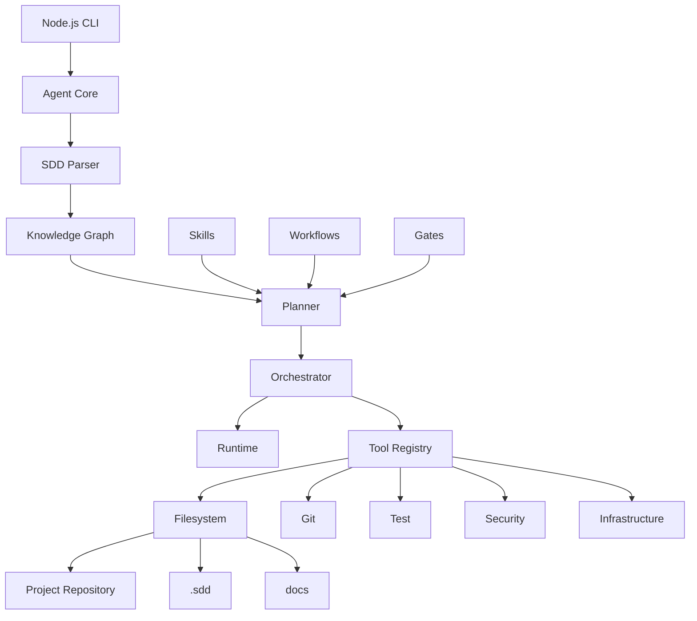

next
# PHASE 29 — NODE.JS AGENT RUNTIME + CLI

Bu phase artıq ideyanı **real işləyən agent məhsuluna** çevirir.

Əsas məqsəd:

> İstənilən Git repository-yə agenti qoşursan → `.sdd/` sistemini yaradır → project-i analiz edir → mövcud `.sdd`-ni oxuyur → skill/workflow/task graph qurur → yalnız lazım olan işi icra edir.

---

# 29.1. Agent ayrıca project deyil

Mən agenti belə qurmağı məsləhət görürəm:

```text
your-project/
├── .sdd/
├── docs/
├── BE/
├── FE/
├── MD/
└── ...
```

Agentin özü isə ayrıca CLI package olur:

```text
sdd-agent
```

Yəni project-in içinə agent source code-u salmırıq.

---

# 29.2. İstifadə

Global:

```bash
sdd init
```

və ya mövcud project:

```bash
sdd analyze
```

Sonra:

```bash
sdd plan
sdd status
sdd run
```

---

# 29.3. CLI command-ləri

Əsas command-lər:

```text
sdd init
sdd analyze
sdd inspect
sdd plan
sdd status
sdd run
sdd resume
sdd review
sdd test
sdd security
sdd performance
sdd deploy
sdd incident
sdd explain
sdd trace
sdd doctor
sdd update
```

---

# 29.4. `sdd init`

Yeni project:

```bash
sdd init
```

Agent:

```text
Detect project
↓
Detect stack
↓
Create .sdd/
↓
Create docs/
↓
Create INDEX
↓
Create project.sdd
↓
Register initial architecture
```

Amma boş qovluqları kor-koranə yaratmır.

---

# 29.5. `sdd analyze`

Bu command ən vacib command-lərdən biridir.

```bash
sdd analyze
```

**Heç bir kod dəyişmir.**

Mode:

```text
READ_ONLY
```

Agent:

```text
.sdd/INDEX.sdd
        ↓
project INDEX
        ↓
project.sdd
        ↓
repository
        ↓
architecture
        ↓
modules
        ↓
skills
        ↓
drift
```

çıxarır.

---

# 29.6. Analyze output

Məsələn:

```text
PROJECT ANALYSIS

Stack
  BE      Go
  FE      React + TypeScript
  MD      React Native

Database
  PostgreSQL

Cache
  Redis

Infra
  Docker
  VPS

Tests
  Go test
  Playwright

Security
  JWT
  RBAC

Issues
  2 architecture drift
  1 missing security gate
  3 orphan tasks

Unknown
  Production backup policy
```

---

# 29.7. `sdd status`

Manager command:

```bash
sdd status
```

çıxışı:

```text
PROJECT STATUS

Tasks
  Ready       4
  Active      1
  Blocked     2
  Done        37

Security
  PASS

Quality
  PASS

Architecture
  1 WARNING

Release
  BLOCKED
```

---

# 29.8. `sdd status --tasks`

```text
TASK GRAPH

999       READY
1023      BLOCKED → 999
1011      BLOCKED → 1023
1001      BLOCKED → 1011

Next:
  999
```

---

# 29.9. `sdd plan`

```bash
sdd plan
```

Agent:

```text
Discovery
↓
Intent
↓
Architecture impact
↓
Skills
↓
Task graph
↓
Workflow
```

və heç nə implement etmir.

---

# 29.10. Plan output

```text
PLAN

Task:
  PAY-1023

Goal:
  Prevent duplicate refund

Risk:
  HIGH

Skills:
  idempotency
  transactions
  payment-security

Depends:
  TASK-999

Flow:
  BDD → BE → QA → SEC → VR

Estimated impact:
  BE
  DB
  QA
  Security
```

---

# 29.11. `sdd run`

```bash
sdd run
```

Bu artıq execution mode-dur.

Agent:

```text
Find ready task
↓
Resolve dependencies
↓
Load skills
↓
Load workflow
↓
Load relevant code
↓
Execute
↓
Run gates
↓
Record evidence
↓
Update task
```

---

# 29.12. `sdd run TASK-1023`

Specific task:

```bash
sdd run TASK-1023
```

Agent əvvəl yoxlayır:

```text
TASK-1023
depends TASK-999
```

Əgər 999 hazır deyil:

```text
TASK-1023 BLOCKED

Required:
  TASK-999
```

və 1023-ə toxunmur.

---

# 29.13. `sdd resume`

Agent yarıda qalıb:

```bash
sdd resume
```

Runtime state oxunur:

```text
TASK-1023
PHASE SECURITY
LAST_GATE SAST
STATUS PASS
NEXT dependency-scan
```

və oradan davam edir.

---

# 29.14. Agent filesystem access

Agentin filesystem tool-u məhdudlaşdırılmalıdır.

```text
READ
WRITE
CREATE
DELETE
MOVE
```

hamısı ayrıca permission olmalıdır.

---

# 29.15. Permission model

```text
READ_ONLY
PROJECT_WRITE
SDD_WRITE
CODE_WRITE
INFRA_WRITE
PRODUCTION_WRITE
```

default:

```text
READ_ONLY
```

---

# 29.16. Production heç vaxt default deyil

```text
PRODUCTION_WRITE = DENY
```

Human approval olmadan:

```text
deploy production
```

olmaz.

---

# 29.17. Tool Registry

Agentin bütün imkanlarını birbaşa prompta yazmaq əvəzinə:

```text
Tool Registry
```

olmalıdır.

Məsələn:

```text
filesystem
git
shell
docker
database
browser
search
test
security
cloud
```

---

# 29.18. Lazy tool loading

Agent bütün tool description-ları prompt-a yükləmir.

Məsələn task:

```text
Frontend UI
```

dirsə:

```text
Playwright
filesystem
git
```

lazım ola bilər.

Database migration tool-u isə context-ə salınmır.

Bu ciddi token qənaətidir.

---

# 29.19. Tool capability model

Hər tool:

```text
name
purpose
risk
permissions
input
output
```

ilə qeyd olunur.

Məsələn:

```text
tool: git.commit
risk: medium
permission: project_write
```

---

# 29.20. Agent loop

Əsas loop:

```text
OBSERVE
   ↓
UNDERSTAND
   ↓
PLAN
   ↓
ACT
   ↓
VERIFY
   ↓
RECORD
   ↓
OBSERVE
```

---

# 29.21. Agent heç vaxt

```text
PLAN
→
WRITE 500 files
```

etməməlidir.

Hər major action:

```text
PLAN
→
SMALL CHANGE
→
TEST
→
VERIFY
```

olmalıdır.

---

# 29.22. Transactional agent behavior

Məsələn 5 fayl dəyişir.

```text
1
2
3
4
5
```

3-cü testdən keçmədi.

Agent:

```text
STOP
```

etməlidir.

Sonra:

```text
rollback
```

və ya:

```text
continue with approval
```

---

# 29.23. Git checkpoint

Implementation başlamazdan əvvəl:

```text
git status
```

və checkpoint:

```text
agent/checkpoint/TASK-1023
```

yaradıla bilər.

Daha rahat variant:

```text
git branch:
  sdd/task-1023
```

---

# 29.24. Task branch

```text
TASK-1023
 ↓
sdd/task-1023
 ↓
implementation
 ↓
tests
 ↓
review
 ↓
PR
```

Bu traceability-ni çox gücləndirir.

---

# 29.25. Git diff guard

Agent hər write-dan sonra:

```text
git diff
```

analiz edir.

Əgər plan:

```text
BE/internal/payment/*
```

idi,

amma diff:

```text
FE/*
MD/*
infra/*
```

göstərirsə:

```text
UNEXPECTED CHANGE
```

yaradır.

---

# 29.26. Scope guard

Task:

```text
scope:
  BE/payment
```

Agent:

```text
FE
MD
infra
```

dəyişmək istəyirsə:

```text
IMPACT DETECTED
```

deyir.

Əgər dependency graph bunu tələb edirsə davam edir.

---

# 29.27. Scope expansion

Məsələn:

```text
API contract changed
```

və FE/MD təsirlənir.

Agent:

```text
Expected impact:
  FE
  MD
```

görür.

Bu zaman scope avtomatik genişlənə bilər, amma:

```text
record impact
```

olmalıdır.

---

# 29.28. BDD-first enforcement

Sənin SDLC qaydan:

```text
BDD
↓
CODE
↓
TS
↓
UI
↓
MANUAL
↓
AUTOMATION
```

workflow engine tərəfindən enforce olunur.

Agent kod yazmaq istəyirsə, əvvəl:

```text
BDD missing
```

deyib dayana bilər.

---

# 29.29. Workflow override

Amma hər task BDD tələb etmir.

Məsələn:

```text
docs typo
```

üçün:

```text
BDD
```

absurd olar.

Skill/workflow sistemi bunu adaptiv seçir.

---

# 29.30. Quality gates

Task bitmiş sayılmır:

```text
CODE DONE
```

olduğu üçün.

Bitmiş sayılır:

```text
CODE
+
TEST
+
REVIEW
+
SECURITY
+
REQUIRED GATES
```

keçdikdə.

---

# 29.31. Security pipeline

Security artıq ayrıca command deyil.

Execution pipeline-a daxil olur:

```text
CODE
 ↓
SAST
 ↓
DEPENDENCY SCAN
 ↓
SECRET SCAN
 ↓
AUTH TEST
 ↓
SECURITY TEST
 ↓
PENTEST
 ↓
PASS
```

Risk səviyyəsinə görə bəzi mərhələlər seçilir.

---

# 29.32. Load / DDoS awareness

Production-risk task üçün:

```text
PERFORMANCE
LOAD
RATE LIMIT
DDoS
CAPACITY
```

skill-ləri avtomatik seçilə bilər.

Agent məsələn:

```text
1M DAU
```

görürsə low-scale architecture skill-lərini istifadə etmir.

---

# 29.33. Scale profile

Project:

```text
scale:
  users: 1M
  dau: 250K
  mau: 700K
```

kimi profile saxlayır.

Sonra skill selection:

```text
scale → architecture
scale → caching
scale → DB
scale → CDN
scale → observability
```

etkisini görür.

---

# 29.34. Infrastructure profiles

Agent:

```text
infra:
  provider: VPS
```

görürsə:

```text
VPS deployment skill
```

seçir.

AWS:

```text
aws skill
```

GCP:

```text
gcp skill
```

Azure:

```text
azure skill
```

---

# 29.35. Infrastructure abstraction

Workflow:

```text
BUILD
 ↓
PACKAGE
 ↓
DEPLOY
 ↓
VERIFY
```

standart qalır.

Provider-specific skill isə:

```text
VPS
AWS
GCP
AZURE
```

hissəsini dəyişir.

Bu çox düzgün abstraction-dır.

---

# 29.36. Agent architecture

Node.js tərəfdə belə struktur təklif edirəm:

```text
packages/
├── cli/
├── agent/
├── parser/
├── planner/
├── orchestrator/
├── graph/
├── skills/
├── workflows/
├── gates/
├── tools/
├── runtime/
├── git/
├── filesystem/
└── schemas/
```

---

# 29.37. CLI

```text
packages/cli
```

yalnız:

```text
command parsing
output
config
```

ilə məşğul olur.

Business logic CLI-də olmur.

---

# 29.38. Agent core

```text
packages/agent
```

burada:

```text
observe()
reason()
plan()
act()
verify()
```

olur.

---

# 29.39. Parser

```text
packages/parser
```

`.sdd` syntax:

```text
parse
validate
normalize
```

edir.

---

# 29.40. Graph engine

```text
packages/graph
```

bunları idarə edir:

```text
dependencies
relations
cycles
impact
ordering
```

---

# 29.41. Planner

```text
packages/planner
```

input:

```text
intent
project
skills
architecture
constraints
```

output:

```text
execution plan
```

---

# 29.42. Orchestrator

```text
packages/orchestrator
```

əsas iş:

```text
plan
→ task
→ workflow
→ gate
→ result
```

---

# 29.43. Runtime

```text
packages/runtime
```

saxlayır:

```text
session
state
checkpoint
resume
evidence
```

---

# 29.44. Tool interface

Bütün tool-lar eyni interface-dən keçməlidir.

Məntiq:

```text
Tool
├── metadata
├── permissions
├── execute
└── verify
```

Beləliklə sabah:

```text
GitHub
GitLab
Bitbucket
```

dəyişmək asan olur.

---

# 29.45. External integrations

Agent:

```text
GitHub
GitLab
Jira
Linear
Slack
Sentry
AWS
GCP
Azure
Docker
Kubernetes
```

ilə işləyə bilər.

Amma bunlar core-a hard-code edilməməlidir.

Plugin/tool adapter olmalıdır.

---

# 29.46. `.sdd` plugin awareness

Agent:

```text
.sdd/tools/
```

və ya global registry vasitəsilə project-in istifadə etdiyi integration-ları tanıya bilər.

Amma mən bunu `.sdd/` içində çoxaltmağı yox, ayrıca tool registry saxlamağı üstün tuturam.

---

# 29.47. Agent config

Project-də yalnız:

```text
.sdd/agent.sdd
```

kimi minimal config ola bilər.

Məsələn:

```text
@agent

mode supervised
provider auto

write project
write sdd

production deny

max-risk high
```

---

# 29.48. Default təhlükəsizlik

Default:

```text
mode supervised
project write allow
sdd write allow
production deny
secret read deny
```

---

# 29.49. Secret management

Agent `.env` faylını avtomatik context-ə yükləməməlidir.

```text
.env
```

→ secret source.

Agent yalnız:

```text
SECRET_EXISTS
```

kimi metadata görə bilər.

---

# 29.50. Secret leakage guard

Agentin output-u:

```text
git diff
logs
LLM context
```

içində:

```text
API_KEY
PASSWORD
TOKEN
PRIVATE_KEY
```

görülərsə redaction etməlidir.

---

# 29.51. `sdd doctor`

Bu command sistemin özünü yoxlayır:

```bash
sdd doctor
```

çıxışı:

```text
SDD
  schema          PASS
  index           PASS
  graph           PASS
  skills          PASS
  workflows       PASS
  references      2 warnings
  drift           1 warning
```

---

# 29.52. `sdd review`

```bash
sdd review
```

bütün project-i review edə bilər.

Amma review yalnız BE deyil:

```text
BE
FE
MD
QA
Security
DB
DevOps
Infrastructure
Architecture
Docs
```

hamısını impact-based yoxlayır.

---

# 29.53. Review matrix

```text
                 BE FE MD DB QA SEC DEVOPS DOC
Architecture      ✓  ✓  ✓  ✓  ✓   ✓   ✓     ✓
Security          ✓  ✓  ✓  ✓  ✓   ✓   ✓
Performance       ✓  ✓  ✓  ✓      ✓   ✓
Testing           ✓  ✓  ✓     ✓
```

Agent project stack-ə görə matrix-i dəyişir.

---

# 29.54. `sdd explain`

Manager üçün çox faydalıdır:

```bash
sdd explain TASK-1023
```

çıxışı:

```text
TASK-1023

Why exists:
  Duplicate refund vulnerability

Origin:
  SEC-004

Depends:
  TASK-999

Skills:
  idempotency
  transaction
  payment-security

Affected:
  BE
  DB
  QA
  Security

Current:
  BLOCKED

Reason:
  TASK-999 incomplete
```

---

# 29.55. `sdd trace`

```bash
sdd trace TASK-1023
```

```text
PROMPT
 ↓
FINDING
 ↓
DECISION
 ↓
TASK
 ↓
WORKFLOW
 ↓
CODE
 ↓
TEST
 ↓
SECURITY
 ↓
COMMIT
 ↓
RELEASE
```

Bu sənin əvvəl dediyin:

> “zəncir harada qırılıb?”

problemini birbaşa həll edir.

---

# 29.56. `sdd incident`

```bash
sdd incident
```

production problemi:

```text
Incident
 ↓
release
 ↓
commit
 ↓
task
 ↓
decision
 ↓
requirement
```

trace edilir.

---

# 29.57. `sdd update`

Bu çox vacib olacaq:

```bash
sdd update
```

global skill-ləri yeniləmək üçün istifadə edilir.

Məsələn:

```text
security skill outdated
```

Agent:

```text
Search
 ↓
Compare current practice
 ↓
Pros
 ↓
Cons
 ↓
Breaking changes
 ↓
Recommend
 ↓
Human approval
 ↓
Update skill
```

---

# 29.58. Skill update heç vaxt kor-koranə olmur

AI:

> “Yeni framework çıxdı, skill-i dəyişdim.”

etməməlidir.

Əvvəl:

```text
CURRENT
NEW
PROS
CONS
RISK
MIGRATION
```

müqayisəsi verməlidir.

---

# 29.59. Skill lifecycle

```text
DRAFT
 ↓
ACTIVE
 ↓
REVIEW
 ↓
OUTDATED
 ↓
UPDATED
 ↓
ACTIVE
```

və ya:

```text
ACTIVE
 ↓
DEPRECATED
 ↓
RETIRED
```

---

# 29.60. Agent artıq “AI chatbot” deyil

Bu phase-dən sonra model:

```text
LLM
```

sadəcə reasoning engine-dir.

Əsas sistem:

```text
SDD
+
Graph
+
Skills
+
Workflow
+
Gates
+
Runtime
+
Tools
```

olur.

Bu çox mühüm arxitektura qərarıdır.

---

# 29.61. Final architecture



---

# 29.62. Bu phase ilə nə həll olundu?

```text
✅ Node.js agent architecture
✅ CLI
✅ Read-only analysis
✅ Planning
✅ Autonomous execution
✅ Resume
✅ Checkpoint
✅ Tool registry
✅ Permission system
✅ Production safety
✅ Git integration
✅ Scope guard
✅ BDD enforcement
✅ Security gates
✅ Impact analysis
✅ Token-efficient loading
✅ Secret protection
✅ Project-wide review
✅ Incident tracing
✅ Skill updating
```

---

# Progress

```text
PHASE 13  Task Engine                    ✅
PHASE 14  Security Engine                ✅
PHASE 15  Testing Engine                 ✅
PHASE 16  Architecture & Decision       ✅
PHASE 17  Stack & Technology             ✅
PHASE 18  SDLC / Workflow                ✅
PHASE 19  Observability / Incident       ✅
PHASE 20  Documentation                  ✅
PHASE 21  Context / Token Engine         ✅
PHASE 22  Agent Runtime / Tools          ✅
PHASE 23  Project Discovery              ✅
PHASE 24  Knowledge Graph / Traceability ✅
PHASE 25  Quality / Security / Release   ✅
PHASE 26  Skill Intelligence             ✅
PHASE 27  Autonomous Orchestrator        ✅
PHASE 28  SDD Language / Schema          ✅
PHASE 29  Node.js Agent Runtime / CLI    ✅
```

## Növbəti: PHASE 30 — SKILL INTELLIGENCE ENGINE

Burada artıq ən kritik hissələrdən birinə girəcəyik:

**Skill-lərin özlərinin necə yazılacağı.**

Məsələn:

```text
skills/backend/idempotency.sdd
skills/database/postgresql.sdd
skills/security/payment-security.sdd
skills/frontend/react.sdd
skills/mobile/react-native.sdd
skills/qa/playwright.sdd
skills/devops/docker.sdd
skills/cloud/aws.sdd
```

və hər skill-in:

```text
L0 → L1 → L2 → L3 → L4 → L5
```

səviyyələri,

```text
BEST PRACTICE
PROS
CONS
WHEN TO USE
WHEN NOT TO USE
ALTERNATIVES
SCALE
SECURITY
PERFORMANCE
COST
MIGRATION
DEPRECATION
```

kimi məlumatları necə **çox az tokenlə** saxlayacağı və AI-nin project-in səviyyəsinə uyğun yalnız lazım olan hissəni necə seçəcəyi müəyyənləşdiriləcək.
